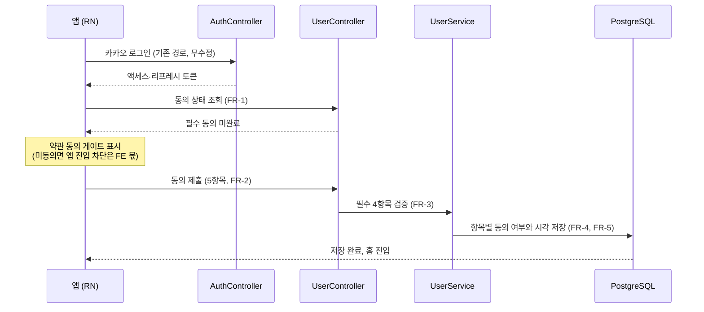
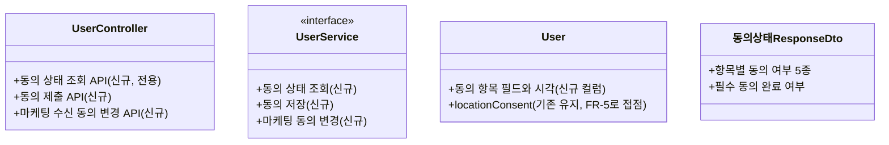

# PRD: 회원가입 약관 동의 저장과 게이트 판별

> 티켓: MSG-433 · 작성일: 2026-08-19 · 작성: prd-writer
> 상태: 검토됨  <!-- 2026-08-19 정민 승인. 저장 모델은 users 컬럼 확장, 게이트 판별은 전용 동의 상태 조회로 같은 날 확정 -->

## 1. 문제 상황

앱 디자인 ver 6의 회원가입 화면은 약관 동의 5항목을 받는다. 만 14세 이상 확인, 서비스 이용약관,
개인정보 수집·이용, 위치기반서비스 이용약관 네 가지가 필수이고 마케팅 정보 수신이 선택이다.
카카오 로그인의 동의 화면은 "카카오가 필맵에 정보를 제공해도 되는가"까지만 다루므로, 이 다섯
가지는 사업자인 우리가 직접 받아야 한다. 특히 위치기반서비스 약관은 위치정보법상 필수 별도
동의다[^1].

그런데 지금 서버에는 위치기반서비스 동의 한 칸(`users.location_consent`, MSG-402)만 있다.
나머지 4개 항목은 저장할 곳이 없고, 동의한 시각을 증빙으로 남길 자리도 없다. 모바일 티켓
MSG-422가 전제하는 "카카오 로그인 직후 서버가 미동의로 응답하면 동의 화면을 띄우고, 회원가입을
누르면 동의 내역이 서버에 저장된다"는 흐름이 현재 API로는 성립하지 않는다 (2026-08-19 앱 디자인
ver 6 전수 대조에서 발견).

## 2. 목적 · 목표

- **목적**: 사업자가 직접 받아야 하는 가입 동의를 서버가 저장하고, 언제 무엇에 동의했는지
  증빙할 수 있게 한다. 클라이언트 동의 게이트[^2]가 판별에 쓸 서버 재료를 제공한다.
- **목표**:
  - 클라이언트가 로그인 직후 추가 동의가 필요한 사용자인지 서버 응답으로 판별할 수 있다
  - 동의 5항목이 저장된다. 철회가 없는 필수 4항목(만 14세, 서비스 이용약관, 개인정보,
    위치기반)은 동의 사실과 시각이 증빙으로 남고, 철회할 수 있는 유일한 항목인 마케팅은
    현재 상태와 마지막 변경 시각이 남는다 (FR-4. 위치 철회 불가는 2026-08-19 팀 합의로
    FR-USER-14가 개정된 결과다)
  - 마케팅 수신 동의는 가입 후에도 조회하고 변경할 수 있다
- **비목표(스코프 제외)**:
  - 약관 전문 콘텐츠 작성 (기획·법무 몫, MSG-422도 같은 이유로 제외)
  - 약관 버전 관리와 개정 시 재동의 흐름 (전문과 개정 정책이 확정된 뒤 별도 논의)
  - 미동의 사용자의 API 접근을 서버가 차단하는 것 (FR-USER-14와 같은 원칙으로 차단은
    클라이언트 게이트 몫)
  - 카카오싱크[^3] 전환 (MSG-422가 MVP 범위 밖으로 확정)
  - OS 위치 권한 팝업 (지도 진입 시점, 별개 사안)

## 3. 기능 요구사항

이 절의 요구는 SRS `FR-USER-15`로 등재됐다 (2026-08-19). 위치 동의 단독 요구는 기존
`FR-USER-14`(MSG-402)이고 FR-5가 그 접점이다.

| ID | 요구사항 | 우선순위 |
|----|----------|----------|
| FR-1 | 클라이언트는 로그인 직후 전용 동의 상태 조회 한 번으로 이 사용자가 필수 동의를 마쳤는지 판별할 수 있다. 응답에는 항목별 동의 여부가 담긴다 (2026-08-19 정민 확정, 프로필 동봉이 아니라 전용 조회) | Must |
| FR-2 | 사용자는 동의 제출 한 번으로 5항목(만 14세 이상, 서비스 이용약관, 개인정보 수집·이용, 위치기반서비스, 마케팅 수신)의 동의 여부를 저장할 수 있다 | Must |
| FR-3 | 필수 4항목 중 하나라도 동의가 아니면 제출이 400으로 거절되고 아무 항목도 저장되지 않는다 | Must |
| FR-4 | 철회가 없는 필수 4항목(만 14세, 서비스 이용약관, 개인정보, 위치기반서비스)은 동의 사실과 시각이 저장되어 증빙으로 남는다. 철회할 수 있는 유일한 항목인 마케팅 수신은 현재 상태와 마지막으로 동의하거나 철회한 시각을 보관한다 (2026-08-19 두 차례 정밀화 — Codex 지적으로 철회 항목의 보관 수준을 가르고, 같은 날 팀 합의로 위치가 철회 불가로 전환되어 필수 축에 합류) | Must |
| FR-5 | 위치기반서비스 항목은 기존 위치 동의 저장(FR-USER-14, `location_consent`)과 한 값으로 관리된다. 가입 동의 제출이 위치 동의를 켠다. 위치 동의는 철회할 수 없고 기존 변경 API로 끄려는 요청은 400으로 거절된다 (2026-08-19 팀 합의, FR-USER-14 개정) | Must |
| FR-6 | 마케팅 수신 동의는 가입 후에도 현재 상태를 조회할 수 있고(동의 상태 조회에 동봉) 켜고 끌 수 있으며 변경 시각이 남는다 | Must |
| FR-7 | 도입 시점에 이미 존재하는 사용자는 필수 동의 미완료로 시작하고, 다음 로그인에서 같은 게이트를 지난다. 백필[^4]로 동의를 만들어 넣지 않는다 | Must |
| FR-8 | 이미 동의를 마친 사용자가 같은 내용을 다시 제출해도 에러가 아니다 (멱등[^5]) | Should |
| FR-9 | 미동의 상태에서도 서버는 다른 API 호출을 차단하지 않는다 | Must |
| FR-10 | 만 14세 이상 확인은 사용자의 자기 확인 체크 사실만 저장한다. 생년월일 등 추가 개인정보는 수집하지 않는다 | Must |

## 4. 비기능 요구사항

| 분류 | 요구사항 |
|------|----------|
| 보안/인가 | 동의 제출과 조회는 본인 액세스 토큰 필수. 다른 사용자의 동의 상태는 조회할 수 없다 |
| 데이터 정합 | 위치기반서비스 동의 값의 저장소는 한 곳이다. 신규 저장분과 기존 `location_consent`가 따로 놀면 안 된다 (FR-5) |
| 데이터 정합 | 계정 삭제 시 동의 기록도 개인 데이터 연쇄 제거(FR-USER-07)에 포함된다 |
| 운영 | 마이그레이션 1건 예상. 기존 행은 미동의가 기본값이라 데이터 백필이 없다 |

## 5. 시퀀스 다이어그램

## 6. 클래스 다이어그램

저장 모델은 users 컬럼 확장으로 확정됐다 (2026-08-19 정민). 계약 표면은 다음과 같다.

## 7. 변경 파일 목록

저장 모델은 사용자 행 컬럼 확장으로 확정됐다 (2026-08-19 정민, 약관 개정 재동의 요건이
생기면 그때 이력 테이블을 도입한다).

| 파일 | 변경 | Owner |
|------|------|-------|
| `src/main/resources/db/migration/V37__users_terms_consent.sql` | 신규 (번호는 착수 시점 재확인, 현재 최신 V36) | - |
| `src/main/java/com/msg/fillmap/user/entity/User.java` | 수정 (동의 항목 필드) | B |
| `src/main/java/com/msg/fillmap/user/repository/UserRepository.java` | 수정 (동의 갱신, `updateLocationConsent` 선례) | B |
| `src/main/java/com/msg/fillmap/user/service/UserService.java` (+Impl) | 수정 (동의 저장, 마케팅 변경) | B |
| `src/main/java/com/msg/fillmap/user/controller/UserController.java` | 수정 (동의 제출, 마케팅 변경 API) | B |
| `src/main/java/com/msg/fillmap/user/dto/` 동의 상태 응답·동의 제출 요청 DTO | 신규 | B |

auth 패키지는 변경하지 않는다. MSG-402 스펙이 로그인 응답 미동봉을 확정(D-2)한 것과 같은
방향으로 로그인 API는 무수정이고, 클라이언트는 로그인 직후 전용 동의 상태 조회로 판별한다
(2026-08-19 정민 확정). 프로필 응답(UserProfileResponseDto)도 이번에는 손대지 않는다. 기존
locationConsent 필드는 FR-5의 단일 값 원칙에 따라 그대로 유효하다.

## 8. 미해결 질문

확정 2건은 본문에 반영했다. 저장 모델은 users 컬럼 확장, 게이트 판별은 전용 동의 상태 조회다
(2026-08-19 정민).

- [ ] 만 14세 이상을 자기 확인 체크만으로 두는 것이 법적으로 충분한지 (생년월일 미수집 전제).
  법무 확인 필요. 스펙과 구현을 막지는 않고, 결론이 다르면 항목 하나가 늘어나는 수준이다
- [ ] 마케팅 수신 동의의 정기 고지 의무[^6] 대응(2년 주기 수신동의 사실 통지)을 어느 티켓이
  다룰지. 이번 범위는 저장과 변경까지다

[^1]: 위치정보법(위치정보의 보호 및 이용 등에 관한 법률)은 위치기반서비스 사업자가 서비스
    약관 동의를 다른 약관과 구분해 별도로 받도록 요구한다. MSG-402의 FR-USER-14가 이 동의를
    처음 도입했고 이번 티켓은 나머지 항목을 채운다.
[^2]: 게이트: 조건을 채우기 전에는 다음 화면으로 못 가게 막는 클라이언트 관문. 이 서비스는
    미동의 차단을 서버가 아니라 클라이언트 게이트가 맡는 원칙을 FR-USER-14에서 확정했다.
[^3]: 카카오싱크: 카카오 로그인 동의 화면 안에서 사업자 약관 동의까지 함께 받는 카카오의
    확장 상품. 신청과 심사가 필요해 MVP 범위에서 제외됐다 (MSG-422 확정).
[^4]: 백필(backfill): 새 컬럼이나 규칙을 도입할 때 기존 행에 값을 소급해 채우는 작업.
    동의는 사용자 본인만 만들 수 있는 사실이라 소급 생성이 성립하지 않는다.
[^5]: 멱등: 같은 요청을 여러 번 보내도 결과가 한 번 보낸 것과 같은 성질. 게이트 화면
    재진입이나 네트워크 재시도로 제출이 중복될 수 있어 필요하다.
[^6]: 정보통신망법은 영리 목적 광고성 정보 수신동의를 받은 사업자에게 2년마다 수신동의
    사실을 알리고 유지 여부를 확인받도록 요구한다.
