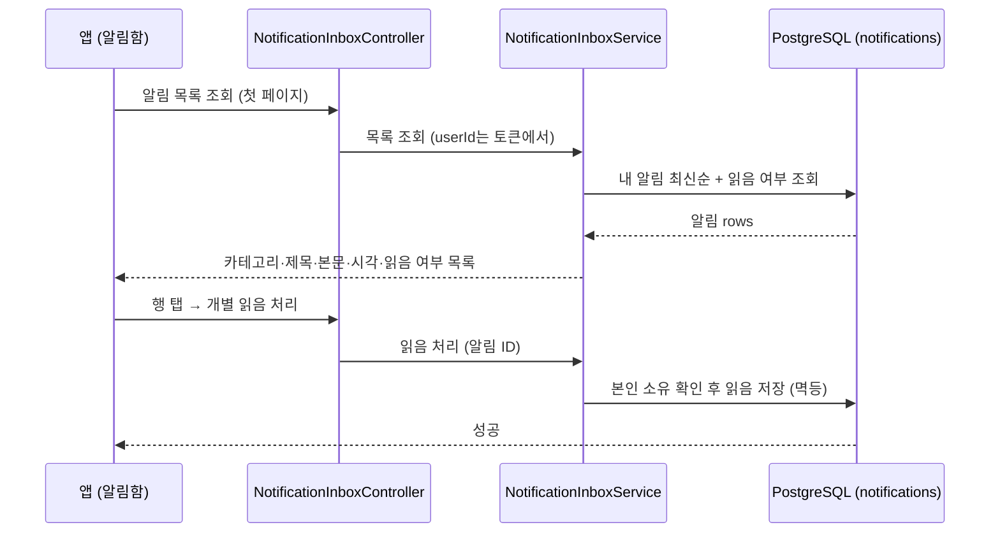
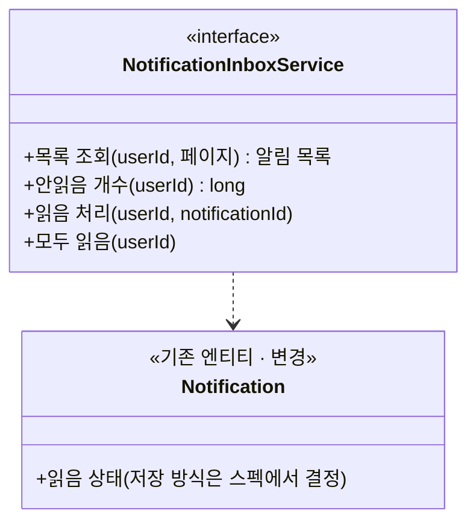

# PRD: 알림함 (받은 알림 모아 보기)

> 티켓: MSG-434 · 작성일: 2026-08-19 · 작성: prd-writer
> 상태: 검토됨 (2026-08-19 정민 승인, 미해결 질문 3건 확정 반영)

## 1. 문제 상황

서버에는 알림을 만들어 푸시로 내보내는 발송 파이프라인(MSG-179)만 있고, 사용자가 자기가 받은 알림을 되짚어 보는 조회 API가 없다. 푸시 권한을 거부한 사용자는 알림을 볼 방법이 아예 없고, 푸시를 받은 사용자도 한 번 지나간 알림을 다시 볼 수 없다. MSG-429(블러 완료 알림)는 "앱 안에서도 알림을 확인할 수 있다"를 요구하는데, 이를 받아줄 화면과 API가 둘 다 없었다.

화면 디자인은 2026-08-19에 확정했다. 진입 구조는 네이버 지도 패턴을 따라, 지도 홈 검색바 우측에는 프로필 이미지만 두고(안읽은 알림이 있으면 빨간 점), 알림함은 프로필 페이지 안의 전용 카드로 들어간다. 피그마 앱 ver 6 페이지에 이식을 마쳤고, 이 PRD는 그 화면을 받치는 서버 요구사항을 정의한다.

한 가지 바로잡을 사실이 있다. 티켓 등재 시점에 "notifications 테이블에 title과 body가 없어 표시 문구 합성이 쟁점"이라고 적었지만 이는 오기다. V21 DDL부터 `title`(100자)과 `body`(255자)가 NOT NULL로 저장되고 있어, 알림함에 보여줄 문구는 이미 쌓여 있다. 실제로 없는 것은 읽음 상태 하나다.

## 2. 목적 · 목표

- **목적**: 발송 기록으로만 쌓이던 알림을 사용자가 앱 안에서 직접 확인할 수 있게 한다. 푸시 도달 여부와 무관하게 알림 내용이 사용자에게 닿는 두 번째 경로를 만든다.
- **목표**:
  - 사용자가 자기 알림 목록을 최신순으로 조회할 수 있다.
  - 알림별 읽음 여부가 저장되고, 개별 읽음과 전체 읽음 처리가 된다.
  - 안읽은 알림 개수를 가볍게 조회할 수 있다. 지도 홈의 빨간 점(존재 여부)과 프로필 카드의 "새 알림 N개"(개수)가 이 값 하나로 해결된다.
- **비목표(스코프 제외)**:
  - 알림을 눌렀을 때 이동할 화면 정보(딥링크[^1] 페이로드)는 싣지 않는다. MSG-432가 카테고리별 목적지 합의와 함께 다룬다.
  - 알림 발송 파이프라인 자체(outbox[^2] 릴레이, Kafka 소비, FCM[^3] 전송)는 바꾸지 않는다. 이 기능은 이미 쌓이는 기록 위에 조회 계층만 얹는다.
  - 알림함 화면 구현은 FE 몫이다. 카테고리별 아이콘과 색, "오늘/이전" 섹션 나누기, 상대 시간 표기는 모두 FE가 응답 재료로 조립한다.
  - 오래된 알림의 물리 삭제(정리 배치)는 이번 범위가 아니다. 노출은 최근 30일로 제한하지만(FR-10) 저장된 기록은 그대로 두며, 삭제 배치는 별도 티켓 후보다.

## 3. 기능 요구사항

SRS 대조: 이 PRD는 FR-NOTI-17(알림함, 계획)을 상세화한 것이다. FR-NOTI-17은 이 PRD 작성과 함께 FR-NOTI-12에서 이력·읽음 몫을 분리해 등재했고, FR-NOTI-12에는 딥링크만 남아 MSG-432가 가져간다.

| ID | 요구사항 | 우선순위 |
|----|----------|----------|
| FR-1 | 로그인한 사용자는 자기 알림 목록을 최신순으로 조회할 수 있다. 항목마다 카테고리, 제목, 본문, 생성 시각, 읽음 여부가 실린다 | Must |
| FR-2 | 목록은 페이지 단위로 끊어 내려간다[^4]. 알림이 수천 건 쌓여도 첫 화면 분량만 받아 볼 수 있다 | Must |
| FR-3 | 푸시가 실제로 발송됐는지와 무관하게 기록된 알림은 목록에 보인다. 발송 전(PENDING), 발송 실패(DEAD) 상태여도 남는다. 푸시 권한을 거부한 사용자가 알림을 확인하는 유일한 경로가 이 목록이다 | Must |
| FR-4 | 사용자는 알림 하나를 읽음 처리할 수 있다(화면에서는 행 탭 시점). 이미 읽은 알림을 다시 읽음 처리해도 오류가 아니다(멱등[^5]) | Must |
| FR-5 | 사용자는 안읽은 알림 전부를 한 번에 읽음 처리할 수 있다(화면의 "모두 읽음" 버튼) | Must |
| FR-6 | 사용자는 자기 안읽은 알림 개수를 조회할 수 있다. 0이면 화면은 빨간 점과 "새 알림 N개" 문구를 숨긴다 | Must |
| FR-7 | 다른 사용자의 알림은 조회할 수도 읽음 처리할 수도 없다. 타인 알림 ID로 읽음 처리를 시도하면 존재하지 않는 알림과 같은 실패 응답을 받는다 | Must |
| FR-8 | 알림이 하나도 없으면 오류가 아니라 빈 목록이 내려간다(빈 상태 화면 재료) | Must |
| FR-9 | 근접 미션(MISSION_NEARBY) 알림은 목록에 나타나지 않는다. 기기가 로컬로 만드는 알림이라 서버 이력에 행 자체가 없고, 현행 CHECK 제약(V35 정의 7종)에 MISSION_NEARBY가 없으며 V36도 의도적으로 추가하지 않아 행 생성이 막혀 있다. 별도 구현 없이 성립하는 사실이지만, FE와 디자인이 전제로 삼도록 명시한다 | Must |
| FR-10 | 목록과 안읽은 알림 개수는 최근 30일 이내에 생성된 알림만 대상으로 한다. 30일이 지난 알림은 조회에서 빠질 뿐 저장 기록은 남는다(발송 이력 겸용이라 삭제하지 않는다) | Must |
| FR-11 | 사용자가 설정에서 끈 카테고리라 발송이 걸러진 알림은 목록과 안읽은 개수에 나타나지 않는다. 받기 싫다고 끈 알림이 알림함에 쌓이면 설정이 무의미해지기 때문이다. 반면 전송률 상한 때문에 푸시만 억제된 알림은 정상적으로 나타난다 | Must |

## 4. 비기능 요구사항

| 분류 | 요구사항 |
|------|----------|
| 성능 | 목록 첫 페이지와 안읽음 개수 조회 p95 300ms 이내. 사용자당 알림 수백 건, 활성 사용자 기준 하루 수 건 적재 규모 |
| 보안/인가 | 모든 API는 토큰 필수, 대상 사용자는 토큰에서 얻는다. 발송 내부 상태(status, retry_count, last_error)와 내부 키(event_key)는 응답에 싣지 않는다 |
| 데이터 정합 | 읽음 상태는 발송 파이프라인의 상태 전이(PENDING에서 SENT 등)와 독립이다. 읽음 처리가 outbox 상태를 건드리지 않고, 상태 전이가 읽음을 덮어쓰지 않는다 |
| 운영 | 읽음 상태 저장을 위한 마이그레이션 1건이 필요하다. 사용자 탈퇴 시 알림 기록은 기존 FK CASCADE로 함께 지워지며, 읽음 저장도 같은 정리 경로를 따라야 한다 |

## 5. 시퀀스 다이어그램

## 6. 클래스 다이어그램

## 7. 변경 파일 목록

전부 notification 패키지(Owner B)다. 클래스 이름은 후보이고 스펙에서 확정한다.

| 파일 | 변경 | Owner |
|------|------|-------|
| `notification/controller/NotificationInboxController.java` | 신규(목록·안읽음 개수·읽음 처리) | B |
| `notification/service/NotificationInboxService.java` (+Impl) | 신규 | B |
| `notification/dto/` 응답·요청 DTO | 신규 | B |
| `notification/repository/NotificationRepository.java` | 수정(목록·개수·읽음 쿼리 추가) | B |
| `notification/entity/Notification.java` | 수정(읽음 상태 매핑, 저장 방식에 따라) | B |
| `src/main/resources/db/migration/V37__*.sql` | 신규(읽음 상태 저장, 번호는 착수 시점 재확인) | - |

## 8. 미해결 질문

전부 2026-08-19 정민 확정으로 해소됐다. 결정 기록으로 남긴다.

- [x] **수신 거부로 걸러진 알림의 노출** → **숨긴다** (FR-11로 승격). 사용자가 설정에서 끈 카테고리는 이벤트 기록이 남아도(FR-NOTI-06) 알림함에 보여주지 않는다. 받기 싫다고 끈 알림이 쌓이면 설정이 무의미해 보이기 때문이다. 전송률 상한으로 푸시만 억제된 알림은 보여준다.
- [x] **보관 기간** → **30일 이내 알림만 보여준다** (FR-10으로 승격). 시안의 하단 안내 문구("최근 30일 알림만 보관돼요") 노출은 FE 몫이다. 저장 기록의 물리 삭제(정리 배치)는 별도 티켓 후보로 남긴다.
- [x] **MSG-432와의 접점** → **이번 응답에는 싣지 않는다.** 행 탭 이동용 대상 식별자는 MSG-432가 푸시 페이로드의 카테고리별 목적지 합의와 한꺼번에 정한다. 앱 개발 진행 시점에 성민이 담당한다.

[^1]: 딥링크(deep link): 알림이나 링크를 눌렀을 때 앱의 첫 화면이 아니라 관련 화면으로 바로 이동시키는 연결 정보.
[^2]: outbox 패턴: 알림 요청을 비즈니스 변경과 같은 DB 트랜잭션으로 테이블에 기록해 두고, 별도 프로세스가 그 테이블을 읽어 실제 발송하는 방식. 장애가 나도 요청이 유실되지 않는다. FillMap의 notifications 테이블이 이 역할과 발송 결과 기록을 겸한다.
[^3]: FCM(Firebase Cloud Messaging): 구글의 푸시 알림 전송 서비스. 서버가 FCM에 메시지를 넘기면 FCM이 각 기기에 푸시를 전달한다.
[^4]: 페이지네이션(pagination): 목록 전체를 한 번에 내려주지 않고 일정 개수씩 끊어 내려주는 방식. 구체적인 방식(페이지 번호 또는 커서)은 스펙에서 정한다.
[^5]: 멱등(idempotent): 같은 요청을 여러 번 보내도 한 번 보낸 것과 결과가 같은 성질.
