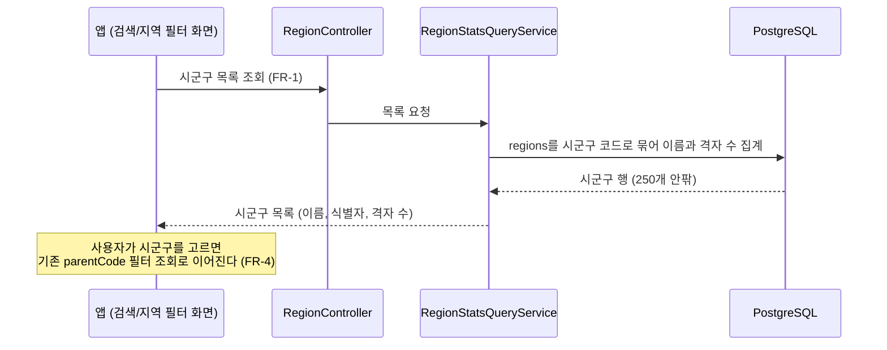

# PRD: 검색 지역 필터용 시군구 목록 조회

> 티켓: MSG-435 · 작성일: 2026-08-19 · 작성: prd-writer
> 상태: 검토됨  <!-- 2026-08-19 정민 승인. 격자 수는 구 전체 격자 수, 목록은 데이터 있는 곳만으로 같은 날 확정 -->

## 1. 문제 상황

앱 디자인 ver 6의 검색/지역 필터 화면은 "전체 지역" 아래에 시군구 목록을 격자 수와 함께
나열한다. "마포구, 격자 2,841" 같은 행이 시군구마다 하나씩이다 (2026-08-19 화면 전수 대조에서
발견). 그런데 지역 조회 API는 행정동[^1] 단위뿐이다. 수집률 조회(`GET /api/regions/stats`)는
행정동 행을 나열하고, 시군구 단위로 묶인 목록을 주는 API가 없다.

클라이언트가 행정동 전량(전국 3,558행)을 받아 시군구로 직접 합산하는 우회는 가능하지만,
목록 화면 하나를 그리려고 매번 큰 응답을 받는 데다 "시군구 목록"이라는 계약이 어디에도 없어
화면과 서버가 서로 다른 정의로 어긋나기 쉽다. 시군구 이상의 상위 레벨 묶음은 구현 현황
문서에도 공백으로 명시돼 있던 부분이다.

## 2. 목적 · 목표

- **목적**: 검색 화면의 지역 필터가 쓸 시군구 목록을 서버가 한 번의 조회로 준다.
- **목표**:
  - 클라이언트가 시군구 목록을 이름과 격자 수와 함께 한 호출로 받는다
  - 값 정의가 기존 수집률·탐험률 재료와 같은 곳에서 나와 서로 모순되지 않는다
- **비목표(스코프 제외)**:
  - 시/도 수준 수집률 집계 ("서울 34%", FR-REGION-13이 MVP 범위 밖으로 유예한 그대로)
  - 최근 방문·최근 검색 칩 (클라이언트 로컬 저장으로 판단, 서버 저장 요구 없음)
  - 검색/지역 필터 화면 구현 (모바일 FE 티켓 별도, 현재 미발행)
  - 장소 검색 자체 (기존 MSG-251 카카오 프록시 그대로)

## 3. 기능 요구사항

이 절의 요구는 SRS `FR-REGION-15`로 등재됐다 (2026-08-19).

| ID | 요구사항 | 우선순위 |
|----|----------|----------|
| FR-1 | 사용자는 시군구 목록을 시군구 이름과 격자 수와 함께 한 번의 조회로 받을 수 있다. 격자 수는 그 구의 전체 격자 수, 즉 소속 행정동들의 전체 격자 수 합이다 (2026-08-19 정민 확정, 영상이 오른 격자나 내 수집 격자가 아니라 사용자 무관 값) | Must |
| FR-2 | 격자 수가 0인 시군구는 목록에서 제외된다 (2026-08-19 정민 확정) | Must |
| FR-3 | 격자 수는 기존 수집률·탐험률이 쓰는 재료(행정동별 물질화 값[^2])와 같은 곳에서 계산되어, 같은 시군구를 다른 화면에서 볼 때와 모순되지 않는다 | Must |
| FR-4 | 응답의 시군구 식별자는 기존 API가 쓰는 행정동 코드 체계와 이어진다. 클라이언트가 이 식별자로 기존 시군구 필터 조회(`parentCode`)를 그대로 쓸 수 있다 | Must |
| FR-5 | 목록은 시군구 이름순으로 정렬된다 (범위 확정에 딸린 기본값. 화면이 다른 순서를 확정하면 스펙에서 정렬 축만 바꾼다) | Should |

## 4. 비기능 요구사항

| 분류 | 요구사항 |
|------|----------|
| 성능 | 전국 시군구는 250개 안팎이라 페이지네이션 없이 전량 응답한다. 행정동 3,558행을 묶는 조회가 목록 화면 진입마다 일어나도 무리가 없어야 한다 |
| 보안/인가 | 격자 수가 사용자 무관 값(구 전체 격자 수)으로 확정되어 다른 지역 조회와 같은 인가 수준을 따른다. 사용자별 값이 없어 응답 캐시도 가능하다 |
| 데이터 정합 | 시군구 격자 수의 합산 재료는 FR-3의 물질화 값 한 곳이다. 화면마다 다른 식으로 세지 않는다 |
| 운영 | 마이그레이션 없음 예상. 기존 regions, region_stats 재료 재사용 |

## 5. 시퀀스 다이어그램

## 6. 클래스 다이어그램

신규 타입은 응답 DTO와 조회 메서드 수준이라 그리지 않는다. 격자 수 정의가 확정되면 스펙이
쿼리와 함께 타입을 정한다.

## 7. 변경 파일 목록

| 파일 | 변경 | Owner |
|------|------|-------|
| `src/main/java/com/msg/fillmap/region/repository/RegionRepository.java` | 수정 (시군구 묶음 조회 추가, `findStats`의 parent_code 축·MSG-356 이름 토큰 선례 재사용) | A |
| `src/main/java/com/msg/fillmap/region/service/RegionStatsQueryService.java` (+Impl) | 수정 (목록 메서드 추가) 또는 전용 서비스 신규 | A |
| `src/main/java/com/msg/fillmap/region/controller/RegionController.java` | 수정 (목록 엔드포인트 추가) | A |
| `src/main/java/com/msg/fillmap/region/dto/` 시군구 목록 응답 DTO | 신규 | A |

마이그레이션과 신규 에러코드는 없을 것으로 본다. 좌표나 시각을 받지 않는 무인자 목록 조회라
검증 실패 유형이 없다.

## 8. 미해결 질문

확정 2건은 본문에 반영했다. 격자 수는 구 전체 격자 수(`regions.total_grid_count` 합)이고,
목록은 격자 수 0인 시군구를 제외한다 (2026-08-19 정민. 규모 검증: 마포구 면적 23.9km²는
100m 격자 약 2,400칸이라 화면의 2,841과 자릿수가 맞는다).

- [ ] **시군구 선택 후 흐름.** 고른 시군구로 무엇을 필터하는지(지도 이동인지, 그 구의 격자
  목록인지)가 화면 티켓이 없어 미정이다. FR-4는 어느 쪽이든 기존 parentCode 축으로 이어지게
  식별자만 보장하므로 스펙과 구현을 막지 않는다

[^1]: 행정동: 이 서비스 지역 데이터의 최소 단위. 전국 3,558개가 시딩되어 있고 코드 앞자리가
    상위 행정구역을 나타내서, 시군구는 행정동 코드의 앞 5자리(parent_code)로 묶인다.
[^2]: 물질화: 조회 때마다 계산하지 않고 쓰기 시점에 미리 계산해 저장해 둔 값. 행정동별 전체
    격자 수(regions.total_grid_count)와 사용자별 수집 수(region_stats)가 이미 물질화되어 있고,
    수집률(MSG-156)과 전국 탐험률(MSG-406)이 같은 재료를 쓴다.
