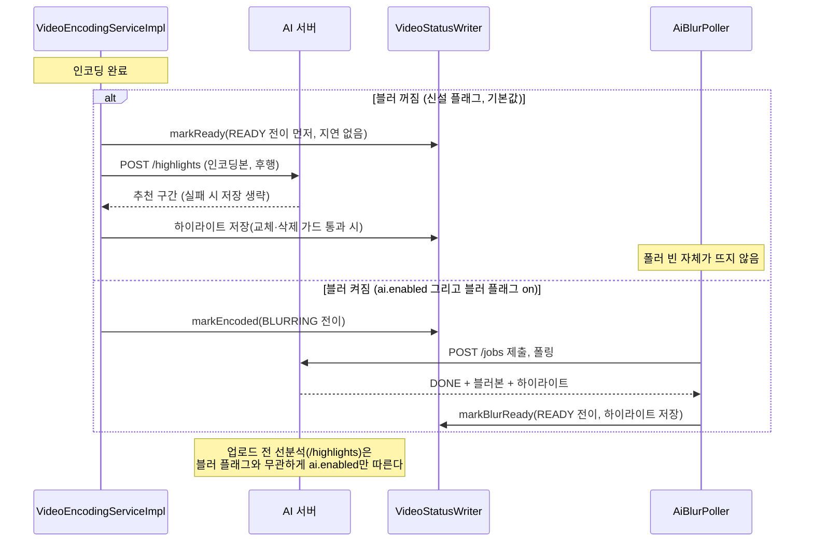

# PRD: 블러 처리 일시 비활성화, AI 연동 플래그 분리

> 티켓: MSG-456 · 작성일: 2026-08-22 · 작성: prd-writer
> 상태: 검토됨  <!-- 수명주기: 초안 → 검토됨(사용자 승인 시 게이트가 갱신) → 확정. 2026-08-22 성민 승인(하이라이트 보관 유지 조건 반영) -->

## 1. 문제 상황

블러 처리 기능을 당분간 빼기로 했다(성민 결정, 2026-08-22). 같은 결정으로 AI 레포에도 블러 제거
작업이 지시된 상태다. 그런데 백엔드는 기능 플래그[^1] `ai.enabled`(환경변수 `AI_ENABLED`) 하나가
AI 연동 전체를 묶고 있다. 이 플래그가 켜지면 인코딩이 끝난 영상은 무조건 BLURRING 상태로 넘어가
폴러[^2]가 AI 서버에 블러 잡을 제출하고, 꺼지면 블러만이 아니라 업로드 확정 전 하이라이트
선분석[^3]까지 함께 죽는다. 선분석을 담당하는 `AiClient`가 같은 플래그로 뜨는 빈이기 때문이다.

재생 화면의 하이라이트도 얽혀 있다. 재생 응답에 실리는 하이라이트 구간(MSG-350)은 블러 잡의
응답에 실려 와 저장되는 부산물이라, 블러만 끄면 신규 영상의 재생용 하이라이트가 함께 끊긴다.

더 급한 위험도 있다. dev 서버는 현재 `AI_ENABLED=true`로 라이브 중이라, AI 레포 쪽 작업으로
블러 잡 API(`/jobs`)가 먼저 사라지면 신규 업로드 전부가 BLURRING에 갇혔다가 30분 타임아웃 뒤
실패 처리되고 사용자에게 실패 알림까지 나간다.

## 2. 목적 · 목표

- **목적**: 하이라이트 추천은 살린 채 블러 파이프라인만 안전하게 끌 수 있게 한다. AI 레포의
  블러 제거가 백엔드 업로드 실패 사고로 번지지 않게 막는다.
- **목표**:
  - 블러를 끈 상태에서 영상 업로드부터 재생까지의 흐름이 인코딩 완료 즉시 준비 완료로 이어진다.
  - 블러를 끈 상태에서도 하이라이트 선분석 API가 정상 동작한다.
  - 블러를 끈 상태에서도 재생 화면의 하이라이트 구간이 계속 제공된다(성민 확정, 2026-08-22).
  - dev 서버에 배포하면 추가 조치 없이 블러가 꺼진 상태가 된다.
- **비목표(스코프 제외)**:
  - 블러 관련 코드(폴러, 상태값, 저장 컬럼)의 제거. 일시 비활성화이므로 코드는 남긴다.
  - AI 레포 쪽 변경. 백엔드가 블러 요청을 보내지 않게 되므로 AI 쪽 작업과 독립이다.

## 3. 기능 요구사항

| ID | 요구사항 | 우선순위 |
|----|----------|----------|
| FR-1 | 블러 파이프라인만 끄는 설정이 존재하며, 하이라이트 선분석과 독립이다. 블러를 꺼도 선분석 API(`POST /api/videos/highlight-preview`)는 그대로 동작한다 | Must |
| FR-2 | 블러가 꺼진 상태에서 업로드 확정된 영상은 인코딩 완료 시 BLURRING을 거치지 않고 준비 완료(READY)가 된다 | Must |
| FR-3 | 블러가 꺼진 상태에서는 폴러가 뜨지 않아 AI 서버로 블러 잡 요청(제출, 폴링, 다운로드)이 일절 나가지 않는다 | Must |
| FR-4 | 기본값은 꺼짐이다. AI 연동이 켜진 환경(`AI_ENABLED=true`)이라도 블러 설정을 명시적으로 켜야만 블러가 돈다. 따라서 이번 배포만으로 dev의 블러가 꺼진다 | Must |
| FR-5 | AI 연동 전체를 끄면(`ai.enabled=false`) 블러 설정값과 무관하게 지금과 동일하게 동작한다(블러, 선분석, 하이라이트 계산 모두 꺼짐. 기존 로컬과 CI 환경 불변) | Must |
| FR-6 | 이미 블러본[^4]이 만들어진 기존 영상의 재생은 그대로 블러본을 준다(FR-VIDEO-12 불변) | Must |
| FR-7 | 블러가 꺼진 기간에 준비 완료된 영상은 처리 완료 알림이 인코딩 경로로 나간다(FR-NOTI-10의 "인코딩만 경로" 그대로) | Must |
| FR-8 | 블러가 꺼진 상태에서도 확정 영상의 재생용 하이라이트가 계산되어 보관되고 재생 응답에 실린다. 인코딩 완료 직후 인코딩본으로 계산하되 영상의 준비 완료(READY)를 막거나 늦추지 않는다. 따라서 준비 완료 직후의 재생 응답은 계산이 끝날 때까지 하이라이트가 잠깐 null일 수 있고(정상 수 초, 저장되면 이후 응답에 실림), 계산이 실패하면 null로 남는다(선분석 실패 시 위저드 폴백과 같은 결) | Must |

## 4. 비기능 요구사항

| 분류 | 요구사항 |
|------|----------|
| 프라이버시 | 블러가 꺼진 동안 공개 영상의 얼굴과 번호판이 블러 없이 노출된다. SRS 프라이버시 원칙 및 FR-MEDIA-04와 어긋나는 의도적 결정이며, SRS에 반영 완료(FR-MEDIA-18, 프라이버시 제약 행 유예 명시) |
| 운영 | DB 마이그레이션 없음. 이 변경 자체를 되돌리는 것은 설정 복원만으로 된다. 단 블러 재활성은 AI 서버의 블러 잡 API가 살아 있어야 성립한다. AI 레포 쪽 제거가 끝난 뒤라면 AI 배포 복원과 함께 진행한다. 배포 전환 사이에 BLURRING에 남는 행은 폴러가 없어 영구 대기(재생 불가)로 남으므로 배포 후 잔존을 점검하고 정리한다(절차는 스펙 몫. dev 실측 0건, 2026-08-22) |
| 데이터 정합 | 처리 상태 기계 자체는 바꾸지 않는다. BLURRING 상태값과 블러 관련 컬럼은 남고, 그 상태로 들어가는 조건만 플래그에 걸린다 |
| 성능 | 하이라이트 계산이 인코딩 완료 경로에 더해져도 영상 준비 완료 목표(NFR-PERF-08, 30초)를 지킨다. 인코딩본은 최대 31초 720p라 선분석 실측(30초 1080p p50 5초) 대비 가벼운 입력이다 |

## 5. 시퀀스 다이어그램

인코딩 완료 시점의 분기. 왼쪽 조건이 이번에 신설되는 플래그다.

## 6. 클래스 다이어그램

신규 타입 없음. 기존 타입의 플래그 조건과 인코딩 완료 경로만 바뀌므로 생략한다.

## 7. 변경 파일 목록

| 파일 | 변경 | Owner |
|------|------|-------|
| `src/main/resources/application.yml` | `ai` 절에 블러 플래그 추가(환경변수 바인딩, 기본 false)와 주석 갱신 | B |
| `src/main/java/com/msg/fillmap/video/config/AiProperties.java` | 블러 플래그 필드 추가 | B |
| `src/main/java/com/msg/fillmap/video/service/VideoEncodingServiceImpl.java` | 인코딩 완료 분기(READY 대 BLURRING) 조건을 블러 플래그로 교체하고, 블러 꺼짐 경로에서 인코딩본 하이라이트 계산 호출 추가 | B |
| `src/main/java/com/msg/fillmap/video/service/VideoStatusWriter.java` | 하이라이트 후행 저장 메서드 추가(교체·삭제 가드 포함, 방식은 스펙 몫) | B |
| `src/main/java/com/msg/fillmap/video/config/AsyncConfig.java` | 하이라이트 후행 계산 전용 단일 스레드 워커 추가(인코딩 워커와 격리) | B |
| `src/main/java/com/msg/fillmap/video/service/AiBlurPoller.java` | 빈 활성 조건(`@ConditionalOnProperty`)을 블러 플래그로 교체 | B |
| `src/test/java/com/msg/fillmap/video/config/AiEnabledContextTest.java` | 플래그 조합별 빈 유무 검증 케이스 추가 | B |
| `src/test/java/com/msg/fillmap/video/service/VideoEncodingAiTriggerTest.java` | 블러 꺼짐 시 READY 직행과 하이라이트 계산·실패 폴백 케이스 추가 | B |

`AiClient`와 `AiConfig`는 `ai.enabled` 조건을 그대로 유지하고, 하이라이트 계산은 기존
`AiClient.analyzeHighlights`를 재사용한다(추가 계약 없음). dev 서버 `fillmap-dev.env`는
기본값이 꺼짐이라 손댈 것이 없고, 나중에 블러를 되살릴 때만 블러 환경변수를 추가한다.

## 8. 후속 과제 (이 티켓 비차단)

이 티켓의 요구사항은 전부 확정됐다. 아래 둘은 범위 밖의 후속 결정이라 스펙과 구현을 막지 않는다.

- 재활성 시점과 조건. "당분간"의 종료 기준이 정해지면 SRS 프라이버시 제약 복원 절차까지 함께
  정한다(FR-MEDIA-18에 미정으로 등재됨).
- AI 레포와의 계약 문서(FillMap-AI README의 BE·AI 계약)에서 블러 잡 절을 어떻게 표기할지.
  백엔드는 호출을 멈추지만 계약 자체의 존폐는 AI 레포 작업 결과에 달렸다.

해소된 질문: 블러 꺼진 기간의 재생용 하이라이트를 null로 수용하는 안은 기각됐다(성민, 2026-08-22).
FR-8이 대체한다.

[^1]: 기능 플래그(feature flag): 코드를 지우지 않고 설정값으로 기능을 켜고 끄는 스위치. 배포와 기능 활성화를 분리해 되돌리기 쉽게 만든다.
[^2]: 폴러(poller): 주기적으로 상태를 확인하는 백그라운드 작업. 여기서는 `AiBlurPoller`가 30초마다 BLURRING 영상을 모아 AI 서버에 제출하고 결과를 회수한다.
[^3]: 하이라이트 선분석: 업로드 확정 전에 원본 영상을 AI 서버로 보내 추천 구간(시작초, 끝초 쌍)을 동기로 받아오는 기능. 업로드 마법사가 구간 선택에 쓴다(MSG-351).
[^4]: 블러본: AI 서버가 얼굴과 번호판을 흐림 처리해 돌려준 영상 파일. 존재하면 재생 시 인코딩본 대신 이것이 나간다.
