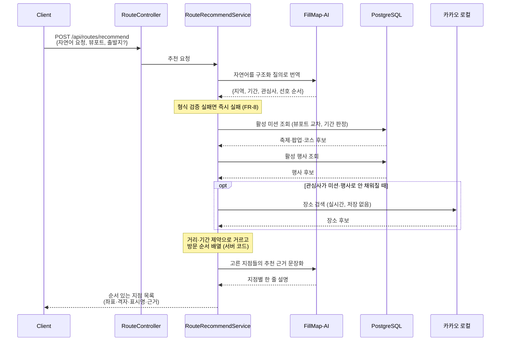
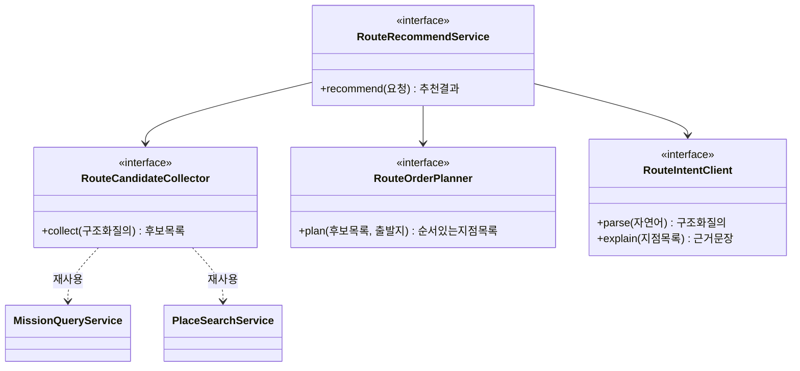

# PRD: AI 경로 추천

> 티켓: MSG-457(백엔드) · MSG-458(AI 서버) · 작성일: 2026-08-22 · 작성: prd-writer
> 상태: 검토됨  <!-- 수명주기: 초안 → 검토됨(사용자 승인 시 게이트가 갱신) → 확정 -->

## 1. 문제 상황

지도 홈 상단 칩 네 종 가운데 경로추천만 아직 무엇을 보여줄지 정해지지 않았다. 2026년 7월 25일
기획 확정 문서가 이미 열린 질문으로 "코스 추천 로직 범위(MVP는 두루누비 노출만?)"를 남겼고, 지금
디자인(`지도 홈(경로추천)`, 노드 `14599:4415`)은 왼쪽 패널에 격자별 영상 카드를 쌓고 지도에는
번호가 붙은 경로선을 그린다. 다시 말해 미리 만들어 둔 코스 148개를 목록으로 보여주는 화면이고,
사용자가 자기 사정을 말할 자리가 없다.

2026년 8월 22일 멘토링에서 이 지점이 지적됐다. 지금 서비스에 붙은 AI는 얼굴과 번호판을 가리는
블러인데 사용자가 체감하지 못하고, 같은 날 블러는 당분간 끄기로 확정됐다(FR-MEDIA-18). 멘토의
요구는 경로추천 칩을 AI 경로 추천으로 바꿔서 사용자가 왼쪽에 하고 싶은 일을 적으면 동선을 짜
주는 형태로 만들라는 것이었다. 근거로 든 사례는 차 안에서 "다이소 들렀다가 햄버거 사서 집에
갈 건데 코스 짜 줘"가 이미 되는 테슬라의 그록이다.

정리하면 문제는 둘이다. **사용자 쪽에서는** 부산에 처음 온 사람이 "오늘 뭘 어떤 순서로 볼지"를
물을 데가 없고, 미리 만든 코스 148개는 그 질문에 답하지 못한다. **팀 쪽에서는** 재료를 이미 다
갖고 있는데(축제, 팝업, 코스, 행사, 장소 검색, 격자) 그것을 엮어 주는 층이 없어서 각 칩이 서로
남남으로 놓여 있다.

## 2. 목적 · 목표

- **목적**: 사용자가 자기 말로 적은 요청을 받아, 서비스가 이미 가진 미션과 행사와 장소를 엮어
  실제로 다닐 수 있는 순서로 돌려준다. 흩어져 있는 칩 네 종의 데이터를 하나의 답으로 합치는 층을
  만드는 일이다.

- **목표**
  - 사용자가 자연어 한 문장으로 요청하면 방문 지점이 순서대로 붙은 동선을 받고, 그 동선이 지도
    위에 그려진다.
  - 추천에 실린 지점은 전부 서버가 실제로 보유하거나 조회한 데이터다. 존재하지 않는 축제나 가게가
    결과에 나오지 않는다.
  - 지점마다 왜 골랐는지 한 줄로 읽을 수 있다.
  - 기존 칩 네 종의 동작과 코스 미션의 스탬프 판정을 그대로 둔다. 지금의 경로추천 칩은 이름만
    코스로 바꿔 하던 일을 계속하고, AI 경로 추천이 다섯 번째 칩으로 들어간다.

- **비목표(스코프 제외)**
  - 실시간 대중교통 경로와 소요 시간 계산은 하지 않는다. 지점의 순서와 위치까지가 이번 범위이고,
    실제 길찾기는 외부 지도 앱으로 넘긴다.
  - 추천 결과를 저장해 다시 꺼내 보거나 공유하는 기능은 넣지 않는다.
  - 사용자의 과거 업로드 이력을 학습해 개인화하지 않는다. 이번 입력은 그 요청 한 건과 지도에
    보이는 범위뿐이다.
  - 모델을 직접 학습시키지 않는다. 경로 추천 정답 데이터가 없고 만들 시간도 없다.
  - 공급자용 포스터 자동 등록은 별도 PRD로 나눈다. 사용자가 다르고 티켓도 따로 나간다.

## 3. 기능 요구사항

| ID | 요구사항 | 우선순위 |
|----|----------|----------|
| FR-1 | 사용자는 하고 싶은 일을 자연어 한 문장 이상으로 적고, 지금 보고 있는 지도 범위를 함께 보내 동선 추천을 요청할 수 있다 | Must |
| FR-2 | 추천 결과는 순서가 있는 방문 지점 목록이고, 각 지점은 이름과 좌표와 격자 식별자와 표시명[^1]을 갖는다. 클라이언트는 이 값만으로 지도에 점과 선을 그릴 수 있다 | Must |
| FR-3 | 결과에 실리는 지점은 서버가 보유한 미션(축제, 팝업, 코스)과 행사, 그리고 장소 검색으로 실제 조회한 장소로만 구성된다. 어떤 경로로도 서버가 확인하지 못한 장소가 결과에 들어가지 않는다 | Must |
| FR-4 | 기간이 있는 미션과 행사는 요청 시점에 활성인 것만 후보가 된다. 이미 끝난 축제는 추천되지 않는다 | Must |
| FR-5 | 지점마다 왜 추천됐는지 한 줄 설명이 함께 온다 | Must |
| FR-6 | 사용자가 지역이나 관심사를 말하지 않아도 지도에 보이는 범위를 기준으로 추천이 나온다 | Must |
| FR-7 | 요청을 해석했지만 조건에 맞는 후보가 부족하면 실패가 아니라 찾은 만큼의 지점과 함께 부족하다는 안내가 온다. 후보가 하나도 없으면 빈 목록과 안내다 | Must |
| FR-8 | 자연어 해석이 실패하거나 해석 단계가 응답하지 않으면 사용자에게 실패를 알린다. 이때 잘못 해석한 결과를 지어내 내려보내지 않는다 | Must |
| FR-9 | 추천으로 코스 미션이 결과에 나와도 그것만으로 스탬프[^2]가 발급되지 않는다. 스탬프는 지금처럼 그 격자에 영상을 올려야 나온다 | Must |
| FR-10 | 지도 홈 칩은 다섯 종(핫구역, 지역축제, 팝업스토어, 코스, AI 경로추천)이고 지금처럼 하나만 활성인 단일 선택 토글로 동작한다. AI 경로 추천이 활성일 때 나머지 칩의 표시는 꺼진다 | Must |
| FR-15 | 지금의 경로추천 칩은 이름만 코스로 바뀌고, 두루누비 코스를 목록으로 보여주던 동작을 그대로 유지한다. 코스 뱃지의 이름(코스 입문, 코스 단골, 코스 마스터)은 바꾸지 않는다 | Must |
| FR-11 | 같은 요청을 다시 보내면 같은 순서의 결과가 온다. 후보 데이터가 그대로인 동안 결과가 흔들리지 않는다 | Should |
| FR-12 | 사용자는 출발 지점을 지정할 수 있고, 지정하면 동선이 그 지점에서 시작한다. 지정하지 않으면 후보들의 위치만으로 순서를 정한다 | Should |
| FR-13 | 한 사용자가 짧은 시간에 반복 요청하면 제한된다 | Should |
| FR-14 | 추천 결과의 지점 수에 상한이 있다. 하루에 다닐 수 없는 분량을 돌려주지 않는다 | Should |

## 4. 비기능 요구사항

| 분류 | 요구사항 |
|------|----------|
| 성능 | 자연어 해석 단계가 외부 왕복을 포함하므로 기존 조회 API 기준(수십 밀리초)을 적용하지 않는다. 사용자가 기다릴 수 있는 상한을 정하고 그 안에 응답하거나 실패로 끝낸다. 상한 값은 미해결 질문 |
| 성능 | 후보 검색과 순서 배열은 서버 안에서 끝나며 외부 왕복을 추가하지 않는다. 이 구간은 기존 미션 조회 수준(뷰포트 목록 웜 p95 4.0ms 실측, MSG-398)을 유지한다 |
| 보안 | 사용자가 적은 문장이 그대로 외부 모델로 나간다. 프롬프트 인젝션[^3]으로 해석 결과의 형식이 깨지거나 지시가 바뀌는 경우를 막아야 하고, 형식이 어긋난 해석 결과는 채택하지 않는다 |
| 보안 | 요청 본문에 사용자 식별 정보를 담아 외부로 보내지 않는다 |
| 데이터 정합 | 장소 검색은 카카오 로컬 약관상 결과를 캐시하거나 저장할 수 없다(MSG-251). 검색 결과를 후보로 쓰더라도 응답 조립 이후 보관하지 않는다 |
| 데이터 정합 | 격자 식별자와 표시명은 기존 규칙(EPSG:5179 100m 격자, 구역 표시명)을 그대로 쓴다. 이 기능이 별도 좌표 체계를 만들지 않는다 |
| 운영 | 외부 모델 호출은 설정 플래그로 켜고 끌 수 있고 기본은 꺼져 있다(NFR-OPS-06 관례). 꺼진 환경에서는 이 기능이 명시적으로 비활성임을 응답한다 |
| 운영 | 호출당 비용이 발생하므로 호출 건수와 실패율과 소요 시간을 지표로 남긴다 |
| 운영 | 마이그레이션이 필요 없다. 추천 결과를 저장하지 않으면 신규 테이블도 없다 |

## 5. 시퀀스 다이어그램

## 6. 클래스 다이어그램

이 PRD 단계에서는 신규 타입의 이름과 경계까지만 둔다. 실제 인터페이스 모양은 스펙 몫이다.

## 7. 변경 파일 목록

신규 패키지 하나에 모으고 기존 도메인은 읽기로만 쓴다. 기존 파일 수정이 거의 없다는 점이 이
설계의 이점이다.

| 파일 | 변경 | Owner |
|------|------|-------|
| `src/main/java/com/msg/fillmap/route/controller/RouteController.java` | 신규 | B |
| `src/main/java/com/msg/fillmap/route/service/RouteRecommendService.java` (+`impl`) | 신규 | B |
| `src/main/java/com/msg/fillmap/route/service/RouteCandidateCollector.java` (+`impl`) | 신규. 미션과 행사와 장소 검색을 읽어 후보를 모은다 | B |
| `src/main/java/com/msg/fillmap/route/service/RouteOrderPlanner.java` (+`impl`) | 신규. 거리와 기간 제약으로 순서를 정한다 | B |
| `src/main/java/com/msg/fillmap/route/service/RouteIntentClient.java` | 신규. 외부 모델 왕복 담당 | B |
| `src/main/java/com/msg/fillmap/route/config/RouteAiProperties.java` | 신규. 기능 플래그와 타임아웃 | B |
| `src/main/java/com/msg/fillmap/route/dto/*.java` | 신규. 요청과 응답 | B |
| `src/main/java/com/msg/fillmap/route/exception/RouteErrorCode.java` | 신규. developCode 대역 배정 필요 (현재 13xxx까지 사용 중) | B |
| `src/main/java/com/msg/fillmap/mission/service/MissionQueryService.java` | 후보 수집용 조회가 기존 메서드로 부족하면 비파괴 추가 | B |
| `src/main/java/com/msg/fillmap/search/service/PlaceSearchService.java` | 재사용. 수정 없음 예상 | A |
| `src/main/resources/application*.yml` | 기능 플래그와 모델 설정 추가 | B |
| 마이그레이션 | 없음 | - |

**자연어 해석과 근거 문장화는 FillMap-AI 레포가 맡는다**(2026-08-22 확정). 백엔드는 그 서버를
HTTP로 부르기만 하고 모델을 직접 다루지 않는다. 기존 `video/service/AiClient`는 영상 처리 전용이라
재사용하지 않고 `RouteIntentClient`를 따로 둔다.

AI 레포 몫은 그 레포의 스펙으로 나가며, 이 PRD가 정하는 경계는 둘이다. 첫째, 해석 결과는 정해진
형태로만 오고 그 형태를 벗어나면 백엔드가 채택하지 않는다(FR-8). 둘째, 해석 결과에 장소 이름이
담기더라도 그것을 후보로 삼지 않는다. 후보는 백엔드가 자기 데이터에서 고른다(FR-3).

## 8. 미해결 질문

- [ ] **왼쪽 패널 디자인.** 현재 `지도 홈(경로추천)`(노드 `14599:4415`)의 왼쪽 패널은 검색바와
      격자별 영상 카드 목록이고 자연어 입력창이 없다. 입력창을 검색바 자리에 넣을지 그 아래에
      둘지, 추천 결과를 카드 목록 자리에 어떻게 표시할지가 미확정이다. **디자인 변경이 선행돼야
      하며 이 PRD는 화면 구성을 확정하지 않는다.**
- [ ] **응답 시간 상한.** 외부 왕복 두 번(해석, 근거 문장화)은 유지하기로 했다(2026-08-22 확정).
      추천 이유가 붙는 것이 이 기능의 인상을 만든다고 봤다. 사용자가 기다릴 수 있는 상한 값은
      실측한 뒤 정한다.
- [ ] **결과를 저장하는가.** 비목표에 저장을 넣어 뒀지만, 발표 데모에서 같은 동선을 반복해서
      보여줘야 한다면 저장이나 캐시가 필요할 수 있다. 저장하면 신규 테이블과 마이그레이션이 생긴다.
- [ ] **앱에서 칩 다섯 개가 들어가는가.** 웹(1440)은 여유가 있지만 앱(390)은 가로가 빠듯하다.
      칩 줄을 옆으로 스크롤시킬지 등은 디자인에서 확인할 항목이다.
- [ ] **출발 지점 입력 방식.** FR-12를 넣는다면 지도에서 찍는지, 검색으로 고르는지, 현재 위치를
      쓰는지가 미정이다.
- [ ] **developCode 대역.** 현재 13xxx(event)까지 배정돼 있어 14xxx가 다음 순번이다. 표 갱신
      커밋이 선행돼야 한다(`response-pattern.md` 규칙).
- [ ] **SRS 등재.** 이 PRD의 요구사항은 전부 신규다. 승인 후 `srs-writer`로 등재해 FR 번호를
      받아야 하고, 영역 이름(FR-ROUTE 등)도 그때 정한다.

[^1]: 표시명: 격자를 사람이 읽는 이름. 구역 안이면 "서면 A-14"처럼 구역명과 칸 번호로, 구역 밖이면 행정동 이름으로 나온다. 서버가 계산해 응답에 실어 준다.
[^2]: 스탬프: 미션 조건을 채웠을 때 사용자에게 발급되는 완료 표식. 도감의 격자 수집과는 별개로 관리되고 회수되지 않는다.
[^3]: 프롬프트 인젝션: 사용자가 입력한 문장 안에 모델을 향한 지시를 숨겨, 원래 시키려던 일 대신 다른 일을 하게 만드는 공격.
