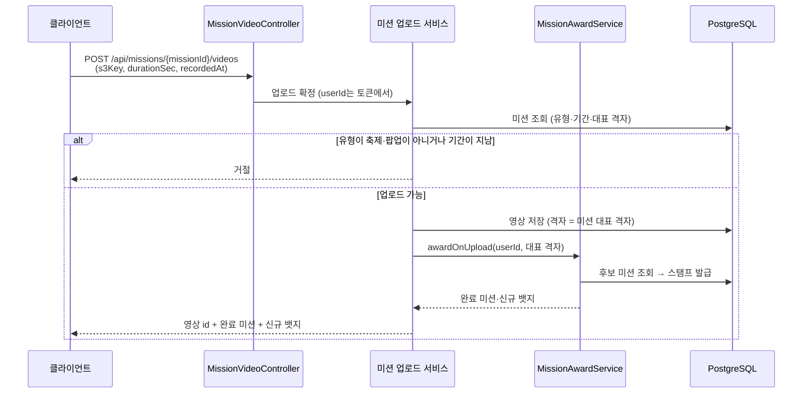
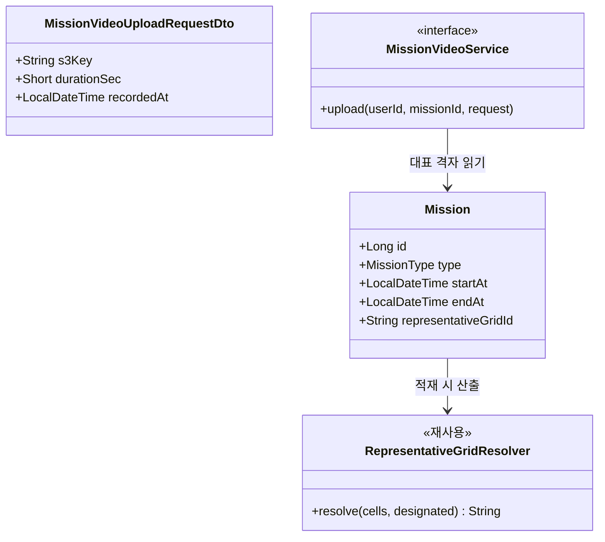

# PRD: 축제·팝업 미션 영상을 대표 격자에 올리기

> 티켓: MSG-459 · 작성일: 2026-08-22 · 작성: prd-writer
> 상태: 초안

## 1. 문제 상황

축제와 팝업 미션은 판정 범위가 여러 격자에 걸쳐 있고, 지금은 사용자가 그중 한 칸을 골라 영상을 올린다. 축제는 중심 좌표 기준 9×9, 즉 81칸이다[^1]. 같은 축제를 다녀온 사람들의 영상이 81곳에 흩어지고, 어느 칸이 그 축제를 대표하는지 화면도 서버도 알지 못한다.

행사방은 같은 문제를 이미 한 번 풀었다. 위치마다 대표 격자를 하나 정해 영상을 그 칸에만 저장하고, 위치에 연결된 어느 격자를 눌러도 같은 피드를 보여준다. 사용자는 격자를 고르지 않고 장소를 고른다.

미션도 같은 모양이어야 하는데 지금은 갈라져 있다. 사용자는 축제방에서는 장소를 고르고 미션에서는 격자를 고른다. 서버 쪽 격차가 더 크다. `missions` 테이블에는 대표 격자 컬럼 자체가 없고, 시더는 적재할 때 원본 좌표를 격자로 바꾼 뒤 좌표를 버린다.

## 2. 목적 · 목표

- **목적**: 축제와 팝업 미션의 영상을 한 칸에 모아, 미션 하나가 지도에서 하나의 자리로 읽히게 한다. 사용자가 격자를 고르는 부담도 없앤다.
- **목표**
  - 사용자는 축제·팝업 미션에서 격자를 고르지 않고 영상을 올린다. 어디에 저장할지는 서버가 정한다.
  - 같은 미션에 올라온 영상은 전부 같은 격자에 모인다.
  - 기존 미션 판정과 스탬프 규칙은 그대로 동작한다. 이번 변경은 저장 위치를 정하는 방식만 바꾼다.
- **비목표**
  - 코스(COURSE) 미션. 여러 포토스팟을 도는 것이 미션의 내용이라 대표 격자 하나로 묶으면 미션 자체가 성립하지 않는다.
  - 화면에 칩이 없는 세 유형(AREA·THEME·CONTINUOUS). 조회 경로가 없어 업로드 진입점도 없다.
  - 일반 영상 업로드(`POST /api/videos`)의 좌표 기반 격자 매핑. 그대로 둔다.
  - 이미 올라온 영상의 격자를 옮기는 소급 이동.
  - 미션 영상 목록 화면의 개편. 목록 조회 경로는 이미 있다.

## 3. 기능 요구사항

| ID | 요구사항 | 우선순위 |
|----|----------|----------|
| FR-1 | 축제·팝업 미션은 각각 대표 격자 하나를 가지며, 그 값은 미션 데이터를 적재할 때 정해져 저장된다 | Must |
| FR-2 | 사용자는 미션을 지목해 영상을 올릴 수 있고, 요청에 좌표나 격자를 담지 않는다 | Must |
| FR-3 | 미션 경유로 올린 영상은 그 미션의 대표 격자에 저장된다. 사용자의 실제 위치는 저장 위치를 바꾸지 않는다 | Must |
| FR-4 | 코스·구역·테마·상시 유형은 미션 경유 업로드를 받지 않고, 요청이 오면 거절한다 | Must |
| FR-5 | 대표 격자는 그 미션의 판정 범위 안에 있어야 한다. 범위 밖 값은 저장 단계에서 막힌다 | Must |
| FR-6 | 미션 경유 업로드가 확정되면 기존 판정이 그대로 돌아 스탬프와 뱃지가 발급된다. 판정 규칙 자체는 바뀌지 않는다 | Must |
| FR-7 | 같은 업로드 요청을 다시 보내도 영상이 중복 생성되지 않는다 | Must |
| FR-8 | 기간이 지난 미션에는 새 영상을 올릴 수 없다. 무기간 미션은 이 제한을 받지 않는다 | Must |
| FR-9 | 비로그인 사용자는 미션 경유 업로드를 할 수 없다 | Must |
| FR-10 | 없는 미션을 지목하면 실패하고, 그 응답으로 미션의 존재 여부를 구분할 수 없다 | Should |
| FR-11 | 대표 격자 산출은 결정적이다. 같은 미션 데이터를 다시 적재해도 같은 값이 나온다 | Must |
| FR-12 | 미션 데이터를 다시 적재해도 이미 저장된 대표 격자와 이미 올라온 영상은 영향을 받지 않는다 | Must |

## 4. 비기능 요구사항

| 분류 | 요구사항 |
|------|----------|
| 데이터 정합 | 대표 격자는 그 미션의 판정 격자 집합에 속한 값이어야 하고, 이 관계는 애플리케이션 검사가 아니라 저장 계층이 보장한다 |
| 데이터 정합 | 이미 발급된 스탬프는 이번 변경으로 회수되거나 재계산되지 않는다. 스탬프 비회수는 기존 규칙이다[^2] |
| 운영 | 마이그레이션 하나로 컬럼을 추가하고, 이미 적재된 축제·팝업 미션의 값은 같은 산출 규칙으로 채운다. 채우지 못한 미션이 남으면 그 미션은 미션 경유 업로드를 받지 않는다 |
| 운영 | 미션 적재는 상시 스케줄러 없이 수동 실행이다. 이번 변경도 그 실행에 얹히고, 실패해도 기존 미션은 유지된다 |
| 보안·인가 | 업로드는 로그인 필수다. 사용자 식별은 인증 토큰에서만 얻고 요청 본문으로 받지 않는다 |
| 성능 | 업로드 확정 경로에 미션 조회 한 번이 늘어난다. 판정 쿼리 수는 기존과 같아야 한다 |

## 5. 시퀀스 다이어그램

## 6. 클래스 다이어그램

`RepresentativeGridResolver`는 행사방이 쓰는 기존 클래스다. 산출 규칙을 새로 만들지 않고 그대로 쓰되, 지금 위치가 `event/seed` 아래라 공용으로 옮길지는 스펙에서 정한다.

## 7. 변경 파일 목록

| 파일 | 변경 | Owner |
|------|------|-------|
| `src/main/resources/db/migration/V{n}__mission_representative_grid.sql` | 신규. `missions`에 대표 격자 컬럼 추가, 판정 격자 집합 소속을 보장하는 제약, 기존 축제·팝업 행 백필 | - |
| `src/main/java/com/msg/fillmap/mission/entity/Mission.java` | 수정. 대표 격자 필드와 산출값 반영 메서드 | B |
| `src/main/java/com/msg/fillmap/mission/seed/FestivalMissionSeeder.java` | 수정. 적재 시 대표 격자 산출·저장 | B |
| `src/main/java/com/msg/fillmap/mission/seed/PopupMissionSeeder.java` | 수정. 같음 | B |
| `src/main/java/com/msg/fillmap/mission/controller/MissionVideoController.java` | 신규. 미션 경유 업로드 엔드포인트 | B |
| `src/main/java/com/msg/fillmap/mission/dto/MissionVideoUploadRequestDto.java` | 신규 | B |
| `src/main/java/com/msg/fillmap/mission/service/MissionVideoService.java` (+impl) | 신규. 미션 조회·유형·기간 검사 후 영상 저장 위임 | B |
| `src/main/java/com/msg/fillmap/mission/exception/MissionErrorCode.java` | 수정. 유형 불가·기간 마감 등 실패 코드 추가 | B |
| `src/main/java/com/msg/fillmap/video/service/VideoServiceImpl.java` | 수정. 좌표 대신 격자를 직접 받는 저장 경로 분리 | B |
| `src/main/java/com/msg/fillmap/event/seed/RepresentativeGridResolver.java` | 이동 또는 참조. 미션과 공용으로 쓸 위치 결정은 스펙 몫 | B |
| `src/main/java/com/msg/fillmap/global/config/SecurityConfig.java` | 수정 없음 예상. 쓰기 경로는 기본이 인증 필수 | B |

`missions` 스키마 현황은 V6 신설, V13 `source`, V14 `source_key`와 POPUP 유형, V31 메타데이터 8컬럼이다. 좌표 컬럼은 없다.

## 8. 미해결 질문

- [ ] **팝업의 대표 격자를 어떻게 정하나.** 팝업 판정 범위는 좌표 사방 40m가 걸치는 격자라 1칸·2칸·4칸이 나오고, 실측 분포는 2×2가 66%, 두 칸이 31%, 한 칸이 3%다. 짝수 사각형이라 행사방의 첫 규칙(홀수 직사각형 정중앙)을 못 타고 무게중심 최근접으로 떨어지는데, 2×2는 네 칸이 전부 동률이라 남서 칸이 임의로 뽑힌다. 대안은 적재 시점에 원본 좌표가 속한 칸을 대표로 쓰는 것이다. 가게 위치와 일치해 더 정확하지만 산출 규칙이 행사방과 갈라진다.
- [ ] **미션 경유 업로드가 도감 점령을 만드나.** 행사방은 만들지 않기로 했다가 2026-08-20에 뒤집어 만드는 쪽으로 확정했다(도감 노출을 우선하고 위치 증거가 약해지는 것을 받아들였다). 미션도 같이 갈지, 아니면 미션은 스탬프로 충분하니 점령을 만들지 않을지 정해야 한다. SRS FR-MISSION-05가 "미션 완료가 가짜 점령을 만들지 않는다"고 적고 있어 문구 정리도 함께 필요하다.
- [ ] **기존 격자 선택 업로드를 축제·팝업에서 막을지.** 미션 경유 경로가 생겨도 일반 업로드로 미션 격자에 올리는 길은 그대로 열려 있다. 그 길을 남기면 같은 축제 영상이 여전히 흩어지고, 막으면 그 격자를 실제로 방문한 사람의 평범한 업로드까지 걸린다.
- [ ] **화면 흐름을 확인하지 못했다.** 격자 선택 UI가 사라지고 미션 카드에서 바로 촬영으로 넘어가는 흐름이 디자인에 있는지 확인이 필요하다. 이번 작성에서는 피그마를 조회하지 않았다(월 호출 한도를 아끼는 판단). FE와 구두 확인 후 확정한다.
- [ ] **기간이 지난 미션에 이미 스탬프가 있는 경우의 표시.** FR-8이 업로드를 막는데, 종료된 축제 미션은 스탬프가 남은 것만 보존되고 나머지는 정리된다. 정리된 미션을 지목한 요청과 종료된 미션을 지목한 요청의 응답을 구분할지 정해야 한다.
- [ ] **MSG-450과의 경계.** 그 티켓은 행사 영상을 미션 집계 여섯 쿼리에서 빼는 작업이고 아직 머지 전이다. 미션 경유 업로드는 행사 영상이 아니라 일반 영상이므로 집계에 들어가는 것이 맞는데, 두 변경이 같은 쿼리를 건드리므로 순서를 정해야 한다.

[^1]: 판정 범위. 그 미션을 완료한 것으로 인정하는 격자들. 축제는 중심 좌표 기준 9×9이고 팝업은 좌표 사방 40m가 걸치는 칸이다. 표시할 크기가 아니라 인정할 범위다.
[^2]: 비회수. 한 번 발급한 스탬프는 조건이 나중에 무너져도 회수하지 않는 규칙. 영상을 지워 조건이 미달이 돼도 스탬프는 남는다. 도감 점령이 영상 삭제로 롤백되는 것과 의도적으로 다르다.
