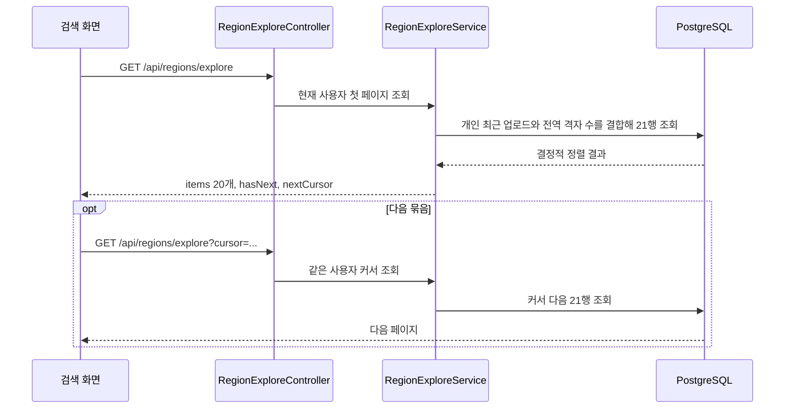
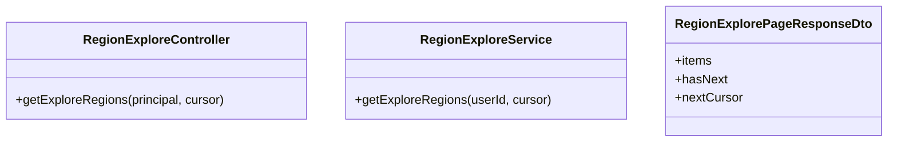

# PRD: 전체 지역 목록 개인화 커서 페이징

> 티켓: MSG-460 · 작성일: 2026-08-22 · 작성: prd-writer
> 상태: 검토됨 (2026-08-22 사용자 정정 승인)

## 1. 문제 상황

검색 화면의 무입력 상태에 표시되는 `전체 지역` 목록이 콘텐츠가 있는 전국 행정동을 한 번에 모두 내려준다. 현재 화면은 응답이 끝날 때까지 오래 기다리고, 데이터가 늘수록 조회와 전송 비용도 계속 커진다. 기존 MSG-460은 이 화면이 아닌 개인 도감의 행정동별 격자 목록을 대상으로 잘못 구현됐다.

## 2. 목적 · 목표

- **목적**: 전체 지역 목록의 한 번 조회 비용을 고정하고, 로그인 사용자가 직접 최근 업로드한 지역부터 탐색하게 한다.
- **목표**:
  - `GET /api/regions/explore`가 행정동을 한 번에 최대 20개씩 반환한다.
  - 사용자가 직접 업로드한 지역은 가장 최근 업로드 시각 순으로 먼저 보인다.
  - 나머지 지역은 전역 공개 콘텐츠 격자 수가 많은 순으로 보인다.
  - 다음 묶음을 커서로 이어서 조회할 수 있다.
- **비목표(스코프 제외)**:
  - 행정동별 격자 카드 API `GET /api/regions/{regionCode}/grids`는 바꾸지 않는다.
  - 개인 도감 격자 목록의 정렬, 상한, 응답 형상은 바꾸지 않는다.
  - 전체 지역에 콘텐츠가 없는 행정동을 새로 노출하지 않는다.

## 3. 기능 요구사항

| ID | 요구사항 | 우선순위 |
|----|----------|----------|
| FR-1 | 로그인 사용자는 전역 공개 콘텐츠가 있는 행정동을 한 번에 최대 20개씩 조회할 수 있다 | Must |
| FR-2 | 로그인 사용자가 직접 영상을 업로드한 적이 있고 현재 개인 점령이 남은 지역을 나머지 지역보다 먼저 표시한다 | Must |
| FR-3 | 우선 지역끼리는 사용자의 마지막 업로드 시각 내림차순으로 정렬하고, 같은 시각이면 전역 공개 격자 수 내림차순, 다시 같으면 행정동 코드 오름차순으로 고정한다 | Must |
| FR-4 | 사용자의 직접 업로드 이력이 없는 나머지 지역은 전역 공개 격자 수 내림차순, 같은 수면 행정동 코드 오름차순으로 정렬한다 | Must |
| FR-5 | 사용자가 직접 업로드한 지역이 하나도 없으면 전체 목록을 전역 공개 격자 수 내림차순으로 정렬한다 | Must |
| FR-6 | 응답은 현재 묶음, 다음 묶음 존재 여부, 다음 요청에 그대로 사용할 불투명 커서를 제공한다[^1] | Must |
| FR-7 | 데이터가 바뀌지 않는 동안 커서를 이어서 조회하면 행정동이 중복되거나 누락되지 않는다 | Must |
| FR-8 | 전역 공개 콘텐츠가 없으면 200과 빈 페이지를 반환한다 | Must |
| FR-9 | 기존에 잘못 추가한 개인 도감 페이지 API를 제거하고, 개인 도감의 기존 무제한 행정동 조회 계약을 복원한다 | Must |

## 4. 비기능 요구사항

| 분류 | 요구사항 |
|------|----------|
| 성능 | 집계 쿼리의 최종 결과를 21행으로 제한해 20행과 다음 묶음 존재 여부를 결정한다. 전체 건수 조회를 추가하지 않고 응답 본문은 최대 20개 항목으로 제한한다. 전역 집계 자체의 비용은 배포 전 실행 계획으로 확인한다. **확인 결과 이 조건은 충족하지 못했다** (2026-08-22 dev 실측: 첫 페이지 3,833 ms, 깊은 페이지 3,675 ms로 페이지 깊이와 무관하게 전역 집계가 매번 반복된다). 응답 본문 크기 제한은 달성했으나 집계 비용 제한은 달성하지 못했고, 그 부분은 [MSG-461](https://soma17-msg.atlassian.net/browse/MSG-461)로 분리했다 |
| 보안/인가 | 토큰이 필요하다. 정렬 개인화에는 로그인 사용자의 업로드 이력만 사용하며 다른 계정에서 발급된 커서는 거절한다 |
| 데이터 정합 | 전역 격자 수는 기존 ACTIVE, PUBLIC, READY 기준을 유지한다. 개인 우선순위는 `user_grids.last_uploaded_at`을 행정동별 최댓값으로 계산한다 |
| 운영 | 읽기 계약 변경이며 마이그레이션은 없다. 기존 배열 응답 소비자는 페이지 응답으로 전환해야 한다 |

## 5. 시퀀스 다이어그램

## 6. 클래스 다이어그램

## 7. 변경 파일 목록

| 파일 | 변경 | Owner |
|------|------|-------|
| `src/main/java/com/msg/fillmap/video/controller/RegionExploreController.java` | 전체 지역 API에 사용자와 커서 입력, 페이지 응답 적용 | B |
| `src/main/java/com/msg/fillmap/video/service/RegionExploreService.java` | 개인화 페이지 조회 계약 적용 | B |
| `src/main/java/com/msg/fillmap/video/service/RegionExploreServiceImpl.java` | 20개와 다음 커서 조립 | B |
| `src/main/java/com/msg/fillmap/video/repository/VideoRepository.java` | 사용자별 최근 업로드와 전역 격자 수를 결합한 키셋 조회 | B |
| `src/main/java/com/msg/fillmap/video/dto/RegionExplorePageResponseDto.java` | 페이지 응답 신규 | B |
| `src/main/java/com/msg/fillmap/video/support/RegionExploreCursor.java` | 사용자와 정렬 경계를 담는 커서 신규 | B |
| `src/test/java/com/msg/fillmap/video/**` | HTTP, 서비스, 커서, 쿼리 회귀 테스트 | B |
| `src/main/java/com/msg/fillmap/usergrid/**` | 잘못 추가된 개인 도감 페이지 계약 제거와 기존 동작 복원 | B |

## 8. 미해결 질문

없음. 대상 화면, 페이지 크기, 개인화 기준, 폴백 정렬과 커서 방식은 사용자 정정으로 확정됐다.

[^1]: 불투명 커서: 클라이언트가 내부 값을 해석하지 않고 서버가 준 문자열을 다음 요청에 그대로 보내는 토큰이다.
