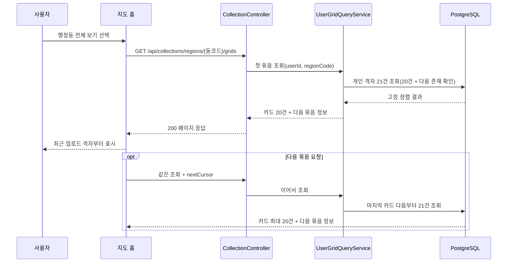
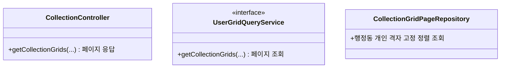

# PRD: 지도 홈 전체 보기 격자 목록 페이징

> 티켓: MSG-460 · 작성일: 2026-08-22 · 작성: prd-writer
> 상태: 검토됨 (2026-08-22 사용자 승인, 복합 커서 방식 확정)

## 1. 문제 상황

지도 홈에서 행정동의 격자 카드를 "전체 보기"로 열면 서버가 그 사용자의 격자를 제한 없이 한 번에 반환한다. 이 동작은 MSG-388에서 의도적으로 정한 계약이지만, 운영 QA에서 격자가 많은 지역의 응답과 화면 표시가 오래 걸리는 문제가 확인됐다. 데이터가 늘어날수록 데이터베이스 조회, 썸네일 임시 URL 발급, 네트워크 응답량이 함께 커지므로 전체 건수에 비례하는 현재 구조를 유지하기 어렵다.

## 2. 목적 · 목표

- **목적**: 전체 보기의 한 번 조회 비용을 일정하게 제한하고, 사용자가 의미 있는 격자부터 빠르게 볼 수 있게 한다.
- **목표**:
  - 행정동별 개인 격자 목록을 한 번에 최대 20개씩 받는다.
  - 첫 항목부터 최근 업로드 시각이 최신인 순서로 보이며, 같은 값에서도 순서가 흔들리지 않는다.
  - 다음 묶음을 이어 받아 전체 목록을 탐색할 수 있다.
- **비목표(스코프 제외)**:
  - 다른 사용자의 격자나 전역 공개 격자를 빈 목록의 대체 재료로 제공하지 않는다.
  - 전체 보기 화면의 디자인과 상호작용을 새로 정하지 않는다.
  - 파라미터 없는 전국 도감 갤러리의 최근 수집순 30개 규칙을 바꾸지 않는다.
  - 전역 조회 `GET /api/regions/{regionCode}/grids`의 계약을 바꾸지 않는다.

## 3. 기능 요구사항

| ID | 요구사항 | 우선순위 |
|----|----------|----------|
| FR-1 | 로그인 사용자는 행정동에 속한 본인의 격자 카드를 한 번에 최대 20개씩 조회할 수 있다 | Must |
| FR-2 | 격자 카드는 `lastUploadedAt` 내림차순으로 정렬한다. 같은 시각이면 `videoCount` 내림차순, 두 값도 같으면 `gridId` 내림차순으로 순서를 고정한다[^1] | Must |
| FR-3 | 응답은 현재 묶음의 카드와 다음 묶음 존재 여부를 알려 주는 정보를 함께 제공한다. 다음 묶음이 있으면 마지막 카드의 `lastUploadedAt`, `videoCount`, `gridId`를 묶은 불투명 커서로 이어서 요청한다[^2][^4] | Must |
| FR-4 | 조회 중 데이터가 바뀌지 않았다면 다음 묶음을 이어 받아도 같은 격자가 중복되거나 중간 격자가 빠지지 않는다 | Must |
| FR-5 | 해당 행정동에 본인의 격자가 없거나 존재하지 않는 행정동 코드면 404가 아니라 200과 빈 카드 목록을 반환하고, 다음 묶음은 없다고 표시한다 | Must |
| FR-6 | 카드 필드와 집계 기준은 기존 MSG-388 계약을 유지한다. 삭제되지 않은 본인의 영상은 공개 상태와 인코딩 상태에 관계없이 영상 수에 포함하고, 타인의 영상은 포함하지 않는다 | Must |
| FR-7 | 지도 홈 기본 사이드 패널은 같은 정렬의 첫 20개를 그대로 사용할 수 있고, 전체 보기에서만 다음 묶음을 이어서 요청한다 | Must |
| FR-8 | 파라미터 없는 `GET /api/collections/grids` 호출은 기존 전국 도감 갤러리 계약인 최근 수집순 최대 30개를 유지한다 | Must |
| FR-9 | 커버 썸네일이 없는 격자도 목록에서 빠지지 않고 썸네일만 null로 반환한다 | Must |

## 4. 비기능 요구사항

| 분류 | 요구사항 |
|------|----------|
| 성능 | 행정동별 조회의 데이터베이스 결과와 썸네일 임시 URL[^3] 발급 대상을 최대 20개 카드로 제한한다. 해당 행정동의 전체 격자 수가 늘어도 한 번의 응답 본문 크기는 카드 20개 범위에 머문다 |
| 보안/인가 | 토큰이 필요하며 로그인 사용자의 점령과 영상만 조회한다. 다른 사용자의 비공개 콘텐츠 존재가 응답에 드러나지 않는다 |
| 데이터 정합 | 영상을 모두 지워 점령이 취소된 격자는 이후 묶음에서 조회되지 않는다. 같은 정렬 값에는 격자 식별자를 마지막 기준으로 사용해 결정적인 순서를 만든다 |
| 운영 | 읽기 계약 변경이며 데이터 마이그레이션은 만들지 않는다. 기존 무제한 호출을 쓰는 클라이언트는 새 페이지 응답 계약에 맞춰 함께 전환해야 한다 |

## 5. 시퀀스 다이어그램

## 6. 클래스 다이어그램

페이지 응답과 커서의 구체적인 타입 이름은 개발 스펙에서 확정한다. 기존 조회 계층에서 바뀌는 책임은 아래와 같다.

## 7. 변경 파일 목록

| 파일 | 변경 | Owner |
|------|------|-------|
| `src/main/java/com/msg/fillmap/usergrid/controller/CollectionController.java` | 행정동별 전체 보기 요청과 페이지 응답 계약 수정 | B |
| `src/main/java/com/msg/fillmap/usergrid/service/UserGridQueryService.java` | 페이지 조회 계약으로 수정 | B |
| `src/main/java/com/msg/fillmap/usergrid/service/impl/UserGridQueryServiceImpl.java` | 20개 묶음 조립과 다음 묶음 판정 | B |
| `src/main/java/com/msg/fillmap/usergrid/repository/CollectionGridPageRepository.java` | 최근 업로드 시각, 영상 수, 격자 식별자 기준의 이어보기 쿼리 | B |
| `src/main/java/com/msg/fillmap/usergrid/dto/CollectionGridResponseDto.java` | 기존 카드 필드와 의미 유지 여부 확인 | B |
| `src/test/java/com/msg/fillmap/usergrid/controller/CollectionControllerTest.java` | 페이지 HTTP 계약 테스트 수정 | B |
| `src/test/java/com/msg/fillmap/usergrid/service/UserGridQueryServiceImplTest.java` | 20개 제한, 다음 묶음, 빈 목록 테스트 | B |
| `src/test/java/com/msg/fillmap/usergrid/repository/CollectionGridsFilterRepositoryTest.java` | 고정 정렬과 이어보기 통합 테스트 | B |
| `docs/srs.md` | FR-MAP-10 갱신, FR-COLLECT-13 등재 | - |
| 위키 `03-specs/지도 홈 API 연동 가이드 FE.md` | 무제한 전체 보기 안내를 페이지 조회 안내로 교체 | - |

Owner 판정: 조회의 기준 테이블과 카드 조립이 `usergrid` 영역이므로 Owner B가 맡는다. 행정동 귀속은 기존 MSG-388과 같이 격자의 `regionCode`를 읽으며 Owner A 인터페이스를 새로 늘리지 않는다.

## 8. 미해결 질문

제품 요구사항은 모두 확정됐다. 복합 커서의 인코딩과 응답 DTO 이름은 개발 스펙에서 코드 관례에 맞춰 정한다.

- [x] 최근 업로드 이력이 없는 사용자는 전역 격자로 대체하지 않고 200과 빈 목록을 받는다 (2026-08-22 사용자 확정).
- [x] 한 묶음은 최대 20개다 (2026-08-22 사용자 확정).
- [x] 정렬은 최근 업로드 시각, 영상 수, 격자 식별자 순이다 (2026-08-22 사용자 확정).
- [x] 다음 묶음은 마지막 카드의 세 정렬 값을 묶은 불투명 커서로 조회한다 (2026-08-22 사용자 확정).

[^1]: 결정적 정렬: 같은 데이터에는 언제나 같은 순서가 나오도록 마지막 비교 기준까지 정하는 방식이다.
[^2]: 페이지네이션: 긴 목록을 일정 개수씩 나눠 받고 다음 부분을 이어서 요청하는 방식이다.
[^3]: 임시 URL: 저장소 객체를 제한된 시간 동안만 열 수 있도록 서버가 서명해 발급하는 주소다.
[^4]: 불투명 커서: 클라이언트가 내부 값을 해석하거나 고치지 않고 다음 요청에 그대로 돌려주는 문자열이다.
