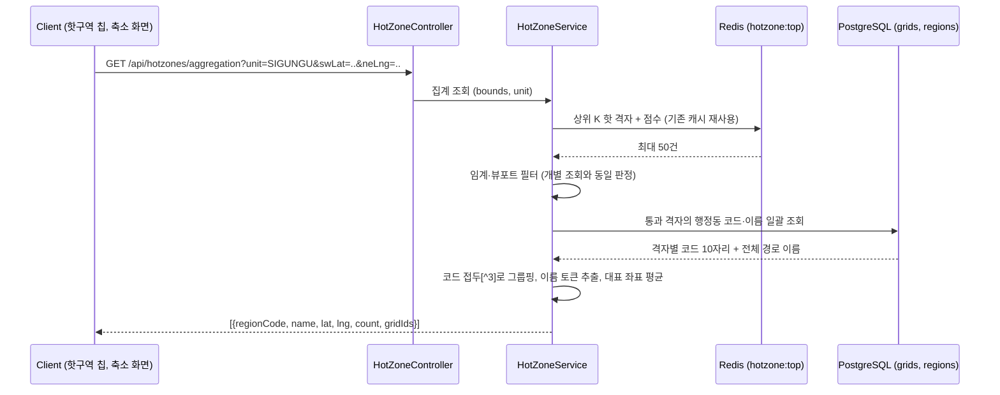
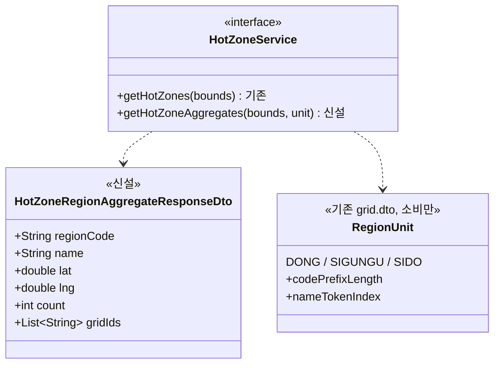

# PRD: 핫구역 줌아웃 행정 단위 집계

> 티켓: MSG-466 · 작성일: 2026-08-24 · 작성: prd-writer
> 상태: 검토됨  <!-- 2026-08-24 사용자 승인 (미해결 질문 4건 해소 반영) -->

## 1. 문제 상황

지도 홈에서 핫구역 칩을 켜면 최근 48시간 업로드 신호가 상위인 격자를 100m 격자 단위 마커로
보여준다. 확대 상태에서는 문제가 없지만, 부산 전체나 전국으로 축소하면 최대 50개의 격자
마커가 점으로 뭉쳐 어느 마커가 어디인지 읽을 수 없다. 같은 화면의 다른 레이어는 이미 이
문제를 풀었다. 도감 격자는 행정 단위 이름 마커("부전2동 31")로 묶어 내려주고(MSG-356),
지역축제와 팝업스토어 미션도 같은 방식의 집계 조회를 신설했다(MSG-437). 핫구역만 축소
화면에서 낱개 격자 마커로 남아 있어, 한 화면에 행정 단위 마커와 점 반죽이 섞인다.

핫구역 개별 조회는 뷰포트[^1] 면적 상한이 없어서(결과가 상위 50으로 이미 제한되므로,
FR-HOTZONE-09) 넓은 화면에서도 호출 자체는 성립한다. 즉 이 문제는 조회 불가가 아니라
표시 품질과 레이어 간 일관성의 문제다.

## 2. 목적 · 목표

- **목적**: 축소 화면에서 핫구역을 도감·미션과 같은 행정 단위 이름 마커로 보여줄 서버
  재료를 제공한다. 세 레이어가 같은 축척 사다리(동, 구, 시)와 같은 이름 규칙을 쓰게 해
  한 화면에서 마커 문법이 갈리지 않게 한다.
- **목표**:
  - 시, 전국 축척에서 핫구역이 "해운대구 3"처럼 지역 이름과 개수가 붙은 묶음으로 조회된다.
  - 같은 화면에 뜨는 도감 마커, 미션 마커와 지역 이름이 글자 단위로 같다.
  - 묶음을 선택하면 그 묶음에 속한 핫 격자로 좁혀 들어갈 수 있는 재료가 응답에 있다.
- **비목표(스코프 제외)**:
  - FE·모바일 렌더링(마커 모양, 색, 전환 애니메이션)은 별도 레인이다.
  - 핫 판정 규칙(상위 50, 최소 임계 3, 48시간 윈도우)은 바꾸지 않는다. 집계는 그 판정
    결과를 묶는 것뿐이다.
  - 핫스코어[^2] 신호 확장(좋아요 등)은 기존 예약(FR-HOTZONE-02) 그대로 이 범위 밖이다.
  - 개별 격자 조회(`GET /api/hotzones`)의 계약 변경은 없다.

## 3. 기능 요구사항

| ID | 요구사항 | 우선순위 |
|----|----------|----------|
| FR-1 | 사용자는 화면 뷰포트와 집계 단위(동, 구, 시)를 지정해 그 범위 안 핫 격자의 행정 단위 묶음을 조회할 수 있다 | Must |
| FR-2 | 집계 대상은 개별 조회와 같은 핫 판정 집합이다(상위 50 안이면서 최소 임계 3 이상, 최근 48시간). 개별 조회와 집계를 갈아타도 세는 대상이 달라지지 않는다 | Must |
| FR-3 | 묶음 항목에는 지역 이름, 그 단위 안 핫 격자 수, 마커를 찍을 대표 좌표가 담긴다 | Must |
| FR-4 | 지역 이름의 단위별 토큰 규칙(동은 "부전2동", 구는 "부산진구", 시는 "부산광역시")은 도감 집계(MSG-356), 미션 집계(MSG-437)와 동일하다. 같은 화면의 세 레이어 마커가 지역 이름에서 갈리지 않는다 | Must |
| FR-5 | 묶음 항목에 그 묶음에 속한 핫 격자 id 목록이 동봉된다. 묶음 선택은 다음 세부 축척으로의 줌인이고, 좁힘은 개별 조회 결과와 이 id 목록의 교집합으로 완결된다(미션 집계 MSG-437 D5와 같은 제품 계약) | Should |
| FR-6 | 어느 행정동에도 귀속되지 않는 핫 격자(해상 등)는 이름 없는 묶음 하나로 마지막에 실린다(도감, 미션 집계와 동일) | Must |
| FR-7 | 응답은 호출 사용자와 무관하다. 핫구역은 전역 데이터이고 누가 올렸는지는 실리지 않는다(FR-HOTZONE-10 승계) | Must |
| FR-8 | 비로그인으로도 조회할 수 있다(핫구역 칩의 비로그인 개방과 동일, NFR-SEC-01 예외 목록) | Must |
| FR-9 | 범위 안에 핫 격자가 없으면 오류가 아니라 빈 목록이다(FR-HOTZONE-08 승계) | Must |
| FR-10 | 뒤집힌 뷰포트, 좌표 범위 밖, 파라미터 누락, 지원하지 않는 집계 단위는 400으로 거부한다 | Must |
| FR-12 | 뷰포트 한 변에는 집계 단위별 상한을 두고 초과하면 400으로 거부한다. 상한 값은 미션 집계와 동일하다(동 1도, 구 4도, 시 10도. 정확히 상한값은 허용) | Must |
| FR-11 | 집계 저장소(Redis)가 유실되면 집계도 개별 조회처럼 비어 보이는 것을 허용한다(FR-HOTZONE-11 승계) | Must |

SRS 대조: 이 기능은 신규 요구다. 기존 FR-HOTZONE-01~12에 축소 화면 표현 요구가 없고,
FR-HOTZONE-01("인접 격자를 묶어 보여주는 것은 클라이언트 표현이다")은 확대 축척의 인접
격자 병합 표현을 말한 것이라 행정 단위 집계와 층위가 다르다. PRD 승인 후 srs-writer로
FR-HOTZONE 신규 항목을 등재한다.

## 4. 비기능 요구사항

| 분류 | 요구사항 |
|------|----------|
| 성능 | 집계 재료가 최대 50건(상위 K)이라 요청당 계산은 소규모다. 개별 조회의 캐시 특성(NFR-PERF-04, 캐시 만료 순간에도 실패 없음)을 집계도 유지한다 |
| 보안/인가 | GET 비로그인 허용. 쓰기 없음. 사용자 식별 정보 비노출(FR-7) |
| 데이터 정합 | 같은 시각의 개별 조회와 집계가 같은 핫 판정 집합을 봐야 한다(FR-2). 근사값 성질(삭제 미차감, 유실 허용)은 개별 조회와 동일하게 승계한다 |
| 운영 | DB 스키마 변경 없음이 기대된다. 행정 귀속 재료(격자의 행정동 코드)는 이미 저장돼 있다(grids.region_code, MSG-349에서 이름 동봉에 사용 중) |

## 5. 시퀀스 다이어그램

## 6. 클래스 다이어그램

## 7. 변경 파일 목록

| 파일 | 변경 | Owner |
|------|------|-------|
| `src/main/java/com/msg/fillmap/hotzone/controller/HotZoneController.java` | 수정: 집계 엔드포인트 추가 | A |
| `src/main/java/com/msg/fillmap/hotzone/service/HotZoneService.java` | 수정: 집계 메서드 추가 | A |
| `src/main/java/com/msg/fillmap/hotzone/service/HotZoneServiceImpl.java` | 수정: 집계 계산(기존 top 캐시와 판정 로직 재사용) | A |
| `src/main/java/com/msg/fillmap/hotzone/dto/HotZoneRegionAggregateResponseDto.java` | 신규 | A |
| `src/main/java/com/msg/fillmap/hotzone/exception/HotZoneErrorCode.java` | 수정: 집계 단위 오류 상수 추가(8xxx 대역, 기존 8400 유지) | A |
| `src/main/java/com/msg/fillmap/grid/repository/GridRepository.java` | 수정: 행정동 코드+이름 프로젝션 조회 추가(기존 findRegionNames는 이름만 반환) | A |
| `src/main/java/com/msg/fillmap/grid/repository/GridRegionCodeNameProjection.java` | 신규: 격자 id + 행정동 코드 + 이름 프로젝션(기존 GridRegionNameProjection 선례) | A |
| `src/main/java/com/msg/fillmap/grid/entity/Grid.java` | 수정: 읽기 전용 region_code 컬럼 매핑 추가(JPQL 조회 전제, 스키마 변경 아님) | A |
| `src/main/java/com/msg/fillmap/global/config/SecurityConfig.java` | 수정: 집계 GET permitAll 추가(MSG-454 목록) | - |
| `src/test/java/com/msg/fillmap/hotzone/...` | 신규: 집계 산술·경계·오류 테스트 | A |

전부 Owner A 도메인(hotzone, grid) 안이다. 다만 `HotZoneService`는 계약 인터페이스 4종 중
하나라(MSG-437 스펙의 계약 변경 절 기준) 집계 메서드 추가는 계약 변경에 해당한다. 기존
메서드의 Owner B 소비처가 하나 있다. 알림 도메인 HotZoneEntryDetector가 10분 주기로
getHotZones를 전국 범위로 호출한다(MSG-181). 신설 메서드는 추가일 뿐이라 B 코드 변경은
없지만, 기존 조회 경로의 동작은 그대로 유지돼야 하고 리뷰에서 상대 팀원 확인을 거친다. 그 외 계약
인터페이스(GridQueryService 등)는 불변이고, RegionUnit은 미션 집계와 같은 방식의 소비다.

## 8. 미해결 질문

없음. 초안의 질문 4건은 2026-08-24 사용자 확정으로 해소됐다.

- [x] **디자인**: 시안이 이미 있다고 확인받았다(사용자). 서버는 이 PRD의 응답 재료로
  진행하고 시안 대조는 FE 레인 몫이다.
- [x] **마커 숫자의 의미**: 핫 격자 수로 확정. 핫스코어 합산은 싣지 않는다.
- [x] **뷰포트 면적 상한**: 미션 집계와 같게 확정. 단위별 상한을 둔다(FR-12).
- [x] **개별↔집계 전환 축척**: 미션 집계와 같게 확정. 서버는 정하지 않고 클라이언트가
  축척에 맞춰 unit을 바꿔 부른다(MSG-356, MSG-437 D6 방식).

[^1]: 뷰포트: 지도 화면에 보이는 직사각형 범위. 남서 모서리와 북동 모서리의 위경도 4개 값으로 표현한다.
[^2]: 핫스코어: 격자별 최근 48시간 업로드 신호의 합. Redis에 6시간 단위 버킷으로 쌓고 조회 때 8개 버킷을 합산한다.
[^3]: 코드 접두: 행정동 코드 10자리의 앞부분. 앞 2자리가 시도, 5자리가 시군구, 10자리 전체가 동을 가리켜서 자르는 길이만 바꾸면 상위 단위 묶음이 된다.
