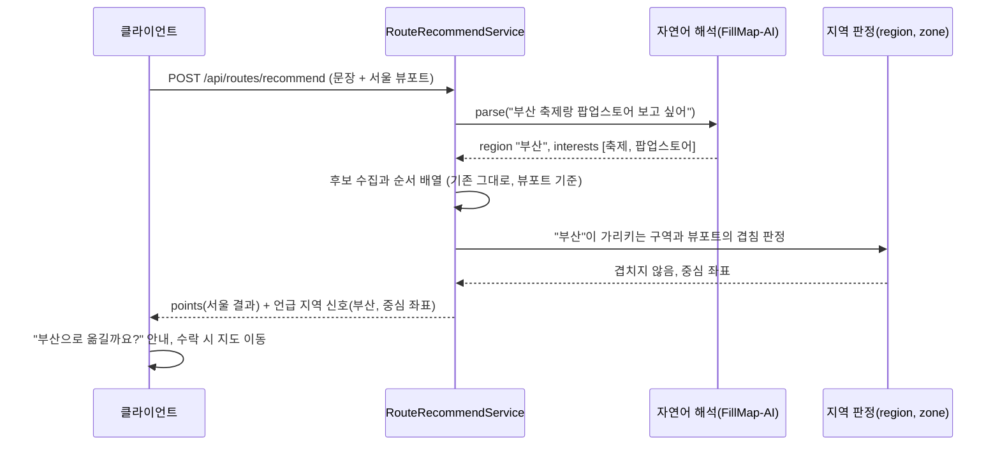

# PRD: AI 경로추천의 화면 밖 지역 안내

> 티켓: MSG-468 · 작성일: 2026-08-25 · 작성: prd-writer
> 상태: 검토됨 (2026-08-25 성민 승인)

## 1. 문제 상황

AI 경로추천은 지금 화면에 보이는 지도 범위, 곧 뷰포트[^1] 안에서만 갈 곳을 찾는다. 사용자가
문장에 다른 지역을 적어도 검색 범위는 옮겨가지 않는다. 서울 지도를 보면서 "부산 축제랑
팝업스토어 보고 싶어"라고 적으면 서울 안의 지점 여덟 곳이 아무 안내 없이 정상 응답으로
돌아온다(2026-08-24 dev 실측, MSG-457 검수 중 발견). 자연어 해석[^2]이 뽑아낸 지역 이름은 장소
검색어를 만드는 데만 쓰이고, 그 검색어로 찾아진 부산 장소들은 서울 뷰포트 밖이라 전부 걸러진다.

이 상태는 결과가 없는 것보다 나쁘다. 빈 결과라면 사용자가 뭔가 잘못됐다고 알아채지만, 지금은
그럴듯한 결과가 여덟 개나 나오니 서비스가 말을 알아듣고 골라 준 것처럼 보인다. "부산 여행
가는데 코스 짜 줘"처럼 지역을 먼저 말하는 문장은 이 기능에서 가장 자연스러운 말투라서, 드물게
밟는 구석이 아니라 첫 사용에서 바로 만나는 길이다.

이 동작 자체는 버그가 아니다. "지역이나 관심사를 말하지 않아도 지도에 보이는 범위를 기준으로
추천"(SRS FR-ROUTE-06)을 그대로 이행한 결과이고, 화면 밖 지역을 말한 경우를 다루는 조항이
설계에 없었던 것이 구멍이다.

어긋남에는 두 번째 형태가 있다(2026-08-25 성민 제기로 편입). 부산역에 도착해 역 근처만 보이는
좁은 화면에서 "부산 놀거리 보고 싶어"라고 물으면, 언급 지역이 화면과 겹치니 오답은 아니지만
부산 전역의 축제와 팝업 대신 화면에 담긴 부산역 근처만 뒤져 빈약한 결과가 나온다. 여행 도착
직후가 이 기능의 핵심 사용 순간인데 그때 화면은 거의 항상 좁다. 언급 지역과 화면이 어긋나는
같은 문제의 다른 모양이라 이 문서에서 함께 다룬다.

## 2. 목적 · 목표

- **목적**: 사용자가 화면 밖 지역을 말했을 때 그 사실을 알 수 있게 한다. 조용한 오답을 없앤다.
- **목표**:
  - 언급한 지역이 화면 밖이면 응답에 그 지역의 이름과 중심 좌표가 함께 실리고, 화면이 "지금
    서울 지도 기준으로 찾았어요. 부산으로 옮길까요?" 같은 안내를 만들 수 있다.
  - 화면이 언급한 지역의 일부만 담게 뚜렷이 좁으면(부산역만 보며 "부산 놀거리"를 물은 경우)
    같은 신호가 구분되는 종류로 실려, 화면이 더 넓게 볼지 안내할 수 있다.
  - 지역을 말하지 않은 요청과 화면이 언급 지역을 충분히 담은 요청은 지금과 완전히 같게
    동작한다.

### 해결 방향

티켓의 세 갈래를 검토해 A를 채택한다.

- **A. 서버가 불일치를 감지해 응답에 신호를 싣는다 (채택)**. 판정 재료가 이미 서버에 있다.
  자연어 해석 결과에 지역 이름이 오고 있고(`region` 필드), 행정구역 데이터[^3]가 이름과 경계
  도형을 갖고 있어 이름을 좌표로 되돌릴 수 있다. 응답 변경은 필드 추가뿐인 비파괴 확장[^4]이고,
  화면 기준 추천이라는 기존 요구(FR-ROUTE-06)도 그대로 지켜진다.
- **B. 서버가 언급 지역으로 뷰포트를 갈아끼워 추천한다 (기각)**. FR-ROUTE-06을 바꾸는 일이라
  요구사항 변경 폭이 크고, 사용자가 보는 화면과 추천 결과가 어긋나는 새 문제를 만든다.
- **C. 화면에 "지금 화면 기준으로 찾았어요" 고정 문구를 둔다 (기각)**. 서버 변경이 없어 가장
  싸지만, 사용자가 말한 지역을 짚어 주지 못한다. 지역을 말하지 않은 사용자에게도 늘 떠 있어
  안내 효과도 무뎌진다.

- **비목표(스코프 제외)**:
  - 추천 범위를 언급 지역으로 옮기지 않는다. 추천은 지금처럼 화면에 보이는 범위 기준이다.
  - 언급 지역의 결과를 미리 가져와 두 지역을 함께 보여주는 일은 하지 않는다. 지도를 옮긴 뒤의
    추천은 새 요청이다.
  - 지역 별칭 사전을 만들지 않는다. 서버가 가진 행정구역 이름과 구역(zone) 통칭에 맞는
    범위까지만 판정한다(2026-08-25 성민 확정으로 zones 대조 포함).
  - 화면 상한(뷰포트 한 변 0.5도)을 넘는 지역 전체 기준 추천은 하지 않는다. 축소를 제안해도
    추천은 여전히 상한 안의 화면 범위에서 돈다.

## 3. 기능 요구사항

| ID | 요구사항 | 우선순위 | SRS |
|----|----------|----------|-----|
| FR-1 | 문장에서 해석된 지역 이름이 서버가 아는 지역(행정구역 또는 구역 통칭) 하나를 짚고(같은 이름이 통칭과 행정구역 양쪽에 있으면 통칭을 짚는다) 그 지역이 요청 뷰포트와 겹치지 않으면, 응답에 언급 지역의 이름과 중심 좌표가 함께 실린다. 추천 지점 목록은 지금처럼 뷰포트 기준으로 그대로 온다 | Must | FR-ROUTE-14 |
| FR-2 | 지역 언급이 없는 요청, 같은 이름의 지역이 여럿이라 하나를 짚을 수 없는 요청, 언급 지역이 뷰포트에 걸치면서 축소 제안 조건(FR-6)에도 해당하지 않는 요청은 이 신호가 비어 있고 나머지 응답이 지금과 같다 | Must | FR-ROUTE-14 |
| FR-3 | 해석된 지역 이름을 서버가 아는 지역과 맞추지 못하면(오타, 해외 지명, 등재되지 않은 통칭) 신호 없이 지금과 같은 응답을 내린다. 판정이 안 된다고 추천이 실패로 바뀌지 않는다 | Must | FR-ROUTE-14 |
| FR-4 | 화면은 신호가 있으면 추천 결과와 함께 언급 지역을 짚어 주는 안내를 보여주고, 사용자가 수락하면 지도를 그 지역 중심으로 옮기거나 그 지역이 보이게 넓힌다 | Must (FE 몫) | FR-ROUTE-14 |
| FR-5 | 후보 선정, 순서 배열, 부족 안내 등 기존 추천 동작은 이 기능으로 달라지지 않는다 | Must | FR-ROUTE-06 |
| FR-6 | 언급 지역이 뷰포트와 겹치더라도 뷰포트가 그 지역의 일부만 담게 뚜렷이 좁으면, 응답에 같은 신호가 이동 제안과 구분되는 종류로 실린다. 화면은 이 종류로 안내 문구를 가른다 | Must | FR-ROUTE-14 |

## 4. 비기능 요구사항

| 분류 | 요구사항 |
|------|----------|
| 성능 | 판정은 서버 안 DB 조회로 끝나고 외부 왕복을 더하지 않는다. 기존 응답 시간 상한은 그대로다 |
| 데이터 정합 | 응답에 싣는 지역 이름과 좌표의 근거는 서버가 보유한 지역 데이터(행정구역과 구역 통칭)뿐이다. 자연어 해석이 만들어 낸 지명이나 좌표를 검증 없이 그대로 싣지 않는다(NFR-SEC-08과 같은 정신) |
| 호환 | 응답 변경은 필드 추가뿐인 비파괴 확장이다. 새 필드를 모르는 클라이언트는 무시하면 되고 기존 동작이 같다 |
| 운영 | 새 테이블과 마이그레이션이 없다 |

## 5. 시퀀스 다이어그램

지역 언급이 없으면 판정 단계가 신호 없음으로 끝나고 응답은 지금과 같다. 언급 지역이 뷰포트와
겹치는 경우는 뷰포트가 그 지역보다 뚜렷이 좁은지 한 번 더 보아, 좁으면 축소 제안 종류의
신호(FR-6)를 싣고 아니면 신호 없음이다. 판정 실패(FR-3)와 동명 다수(FR-2)도 신호 없음이다.

## 6. 클래스 다이어그램

신규 타입 없음. 기존 응답 DTO에 필드가 추가되고 region 쪽 조회 계약에 메서드가 늘어나는
정도라 변경 파일 목록으로 갈음한다.

## 7. 변경 파일 목록

| 파일 | 변경 | Owner |
|------|------|-------|
| `src/main/java/com/msg/fillmap/route/dto/RouteRecommendResponseDto.java` | 수정: 언급 지역 신호 필드 추가 | B |
| `src/main/java/com/msg/fillmap/route/service/RouteRecommendServiceImpl.java` | 수정: 판정 호출과 응답 조립 | B |
| `src/main/java/com/msg/fillmap/region/service/RegionQueryService.java` | 수정: 지역 이름으로 구역과 중심을 찾는 조회 계약 추가 (크로스오너 접점) | A |
| `src/main/java/com/msg/fillmap/region/service/impl/RegionQueryServiceImpl.java` | 수정: 이름 대조와 뷰포트 겹침 판정 | A |
| `src/main/java/com/msg/fillmap/region/repository/RegionRepository.java` | 수정: 이름 기반 조회 쿼리 | A |
| `src/main/java/com/msg/fillmap/zone/service/ZoneQueryService.java` | 수정: 통칭 이름으로 구역과 중심을 찾는 조회 계약 추가 (크로스오너 접점, zones에 한글 `name` 컬럼 보유) | A |
| route와 region 테스트 | 신규: 불일치 신호, 무신호, 판정 실패 각 시나리오 | A / B |

FE의 안내 표시와 지도 이동(FR-4)은 프런트 레포 몫이라 이 표에 없다.

## 8. 미해결 질문

작성 시점에 네 건이 있었고, 셋은 2026-08-25 성민이 확정해 해소됐다.

- [x] 동명 구역 규칙: 해석된 이름이 여러 지역에 걸리고 전부 화면 밖이면 신호를 싣지 않는다.
      이름이 하나를 짚을 수 있을 때만 신호를 만든다. 하나라도 화면과 겹치면 화면 안 지역을
      말한 것으로 보아 역시 신호가 없다(FR-1, FR-2에 반영).
- [x] 통칭과 행정구역의 이름 충돌: "서면"처럼 등재된 통칭이 행정 읍·면 이름(춘천·홍천·양양의
      서면)과도 겹치면 통칭을 짚는다(2026-08-25 성민 확정, 스펙 Codex 리뷰가 적발한 후속 결정).
      동명 무신호 규칙은 통칭끼리 또는 행정구역끼리 겹칠 때의 규칙이다. 등재 기준이 유명
      통칭이라 사용자 의도일 확률이 높고, 격자 표시명이 구역 이름을 행정동보다 앞세우는 기존
      선례와 같은 방향이다. 오판해도 안내 하나로 끝난다.
- [x] 통칭 매칭: 행정구역만이 아니라 zones 데이터(상권 통칭, 한글 이름과 격자 사각형 보유)도
      대조한다. "서면"처럼 행정동으로 표현되지 않는 지역 언급도 잡는다(FR-1, 비목표에 반영).
- [x] 재추천: 지도를 옮긴 뒤 재추천은 수동이다. 사용자가 버튼을 다시 누르고, 10초 요청
      제한(FR-ROUTE-12)에 예외를 만들지 않는다. FE의 기존 버튼 비활성 권고와도 맞는다.

남은 두 건은 각각 스펙과 FE·디자인 몫이라 이 문서에서 값을 정하지 않는다.

- [ ] 축소 제안 임계(FR-6). 언급 지역이 화면과 겹칠 때 어느 정도로 좁아야 제안을 띄울지는
      스펙에서 값을 정한다. 임계 없이는 서울 사용자가 "서울 맛집"을 물을 때마다 제안이 떠서
      안내가 무뎌진다. 예를 들어 언급 지역의 행정 단위와 뷰포트 한 변 폭을 조합하는 방식이
      후보다.
- [ ] 안내 UI 디자인 미확인. 앱 디자인 정본 ver 5에는 AI 입력 패널 화면 자체가 없다(2026-08-25
      대조). 안내 문구와 상호작용은 FE와 디자인에서 정한다.

[^1]: 뷰포트(viewport). 지금 화면에 보이는 지도의 사각형 범위. 추천 요청에 남서와 북동 두 좌표로 실려 온다.
[^2]: 자연어 해석. 사용자가 적은 문장을 FillMap-AI 서버가 지역, 기간, 관심사, 순서 힌트 네 값으로 구조화하는 단계(MSG-458). 여기서 나온 지역 이름이 이번 판정의 입력이다.
[^3]: 행정구역 데이터. regions 테이블. 전국 행정동 3,558건의 이름과 경계 도형을 갖고 있어 지역 이름을 좌표로 되돌릴 수 있다.
[^4]: 비파괴 확장. 기존 필드는 그대로 두고 새 필드만 더하는 API 변경. 옛 클라이언트는 모르는 필드를 무시하면 되므로 클라이언트와 서버의 배포 순서를 강제하지 않는다.
