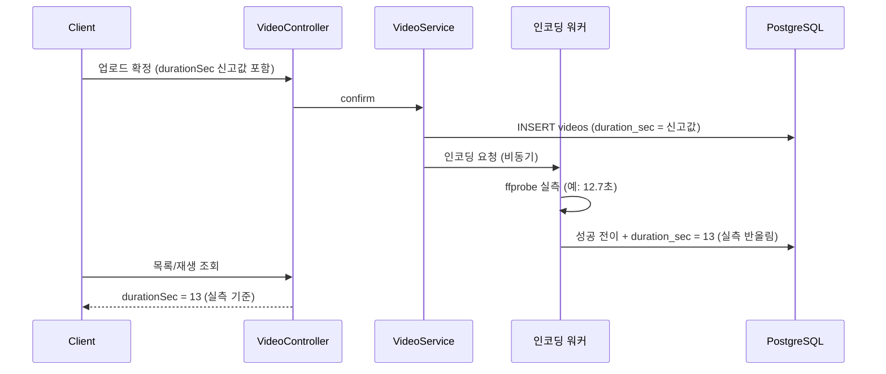

# PRD: 영상 길이 표시 정확성 (실측 길이 저장)

> 티켓: MSG-470 · 작성일: 2026-08-25 · 작성: prd-writer
> 상태: 검토됨 (2026-08-25 사용자 승인)

## 1. 문제 상황

QA에서 "실제 영상 시간이랑 화면에 떠있는 시간이랑 안 맞음" 결함이 등록됐다(QA 결함 리스트,
컨플루언스 41091074). 서버는 인코딩 과정에서 ffprobe[^1]로 영상 길이를 직접 재면서도, 저장은
업로드 확정 때 클라이언트가 신고한 값을 그대로 쓴다. 실측값은 30초 초과 판정에만 쓰고 버린다.
그래서 클라이언트가 값을 잘못 보내면 화면의 재생시간 배지("1:24" 같은 표기, FE 연동 가이드가
`coverDurationSec`으로 그리는 값)가 실제 재생 길이와 어긋난다. 길이를 내보내는 응답 필드
`durationSec`은 전부 이 저장값 하나를 읽으므로, 잘못 저장되면 모든 화면이 같이 틀린다.

## 2. 목적 · 목표

- **목적**: 화면에 표시되는 영상 길이가 실제 재생 길이와 일치하게 한다. 길이의 정본을
  클라이언트 신고값이 아니라 서버가 파일에서 실측한 값으로 둔다.
- **목표**:
  - 인코딩이 성공한 영상의 저장 길이는 서버 실측값 기준이다. 신고값이 틀려도 화면에는
    실제 길이가 뜬다.
  - 영상을 교체한 경우에도 새 파일의 실측 길이가 반영된다.
- **비목표(스코프 제외)**:
  - 소수점 초 단위 표시. `durationSec` 정수 초 계약은 그대로 둔다.
  - 이미 저장된 기존 영상의 길이 보정(백필[^2]).
  - 촬영 시각(`recordedAt`) 관련. QA 항목이 시각 어긋남(9시간 차이)을 뜻할 가능성은 별개
    사안으로 남긴다.

## 3. 기능 요구사항

| ID | 요구사항 | 우선순위 |
|----|----------|----------|
| FR-1 | 인코딩이 성공한 영상의 저장 길이는 클라이언트 신고값과 무관하게 서버가 실측한 재생 길이를 따른다 | Must |
| FR-2 | 저장 길이는 실측값을 정수 초로 반올림한 값이며, 1초 이상 30초 이하 범위를 벗어나지 않는다. 30초를 살짝 넘긴 허용 구간(FR-MEDIA-03의 30~31초) 영상은 30초로 저장된다 | Must |
| FR-3 | 서버가 아직 실측하지 못한 영상(업로드 직후, 인코딩 중, 실측 전 실패)의 길이는 종전대로 신고값이며 잠정 표시값으로 쓴다. 실측이 반영된 뒤 후속 처리(블러 등)가 실패해 최종 상태가 실패가 되어도 이미 반영된 실측 길이는 되돌리지 않는다. 실측값이 파일의 실제 길이라는 사실은 이후 처리 결과와 무관하기 때문이다 | Must |
| FR-4 | 영상 교체 후 재인코딩이 성공하면 새 파일의 실측 길이로 갱신된다 | Must |
| FR-5 | 실측 31초 초과 영상의 실패 처리(FR-MEDIA-03)는 종전 그대로다. 반올림이나 범위 보정으로 판정이 느슨해지지 않는다 | Must |
| FR-6 | 인코딩 완료와 사용자의 교체·삭제가 겹쳐도 옛 파일의 실측 길이가 새 파일에 붙지 않는다 | Must |

## 4. 비기능 요구사항

| 분류 | 요구사항 |
|------|----------|
| 데이터 정합 | 저장값은 DB의 길이 범위 제약(1 이상 30 이하)을 항상 만족한다. 제약 위반으로 인코딩 완료 처리가 실패하는 일이 없어야 한다 |
| 운영 | DB 스키마 변경과 마이그레이션 없음. API 응답 형태 불변이라 FE 수정 불요 |

## 5. 시퀀스 다이어그램

## 6. 클래스 다이어그램

신규 타입 없음. 기존 전이 메서드에 실측 길이 파라미터가 더해지는 변경뿐이라 생략한다.

## 7. 변경 파일 목록

| 파일 | 변경 | Owner |
|------|------|-------|
| `src/main/java/com/msg/fillmap/video/service/VideoEncodingServiceImpl.java` | 수정(실측값 반올림·범위 보정 후 성공 전이에 전달) | B |
| `src/main/java/com/msg/fillmap/video/service/VideoStatusWriter.java` | 수정(성공 전이 2종에 실측 길이 파라미터 추가) | B |
| `src/main/java/com/msg/fillmap/video/entity/Video.java` | 수정(전이 메서드에서 길이 갱신) | B |
| `src/test/java/com/msg/fillmap/video/**` | 전이·워커 테스트 증설 | B |

## 8. 미해결 질문

없음. 값 규칙(반올림, 1~30 범위)과 비범위(소수점, 백필, 촬영 시각)는 본문에서 확정했다.

[^1]: ffprobe: ffmpeg에 딸린 미디어 분석 도구. 영상 파일 메타데이터에서 재생 길이 등을 읽는다. 서버 인코딩 워커가 업로드된 원본을 검사할 때 쓴다.
[^2]: 백필(backfill): 규칙이 바뀐 뒤, 이미 저장된 과거 데이터에도 새 규칙을 소급 적용해 값을 채우는 작업.
