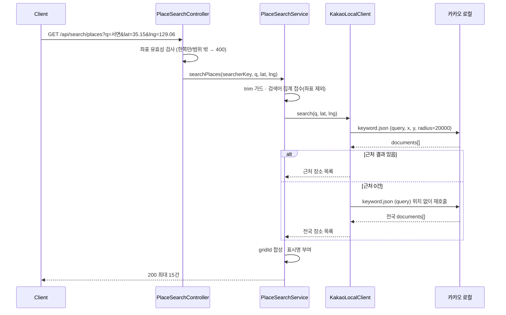
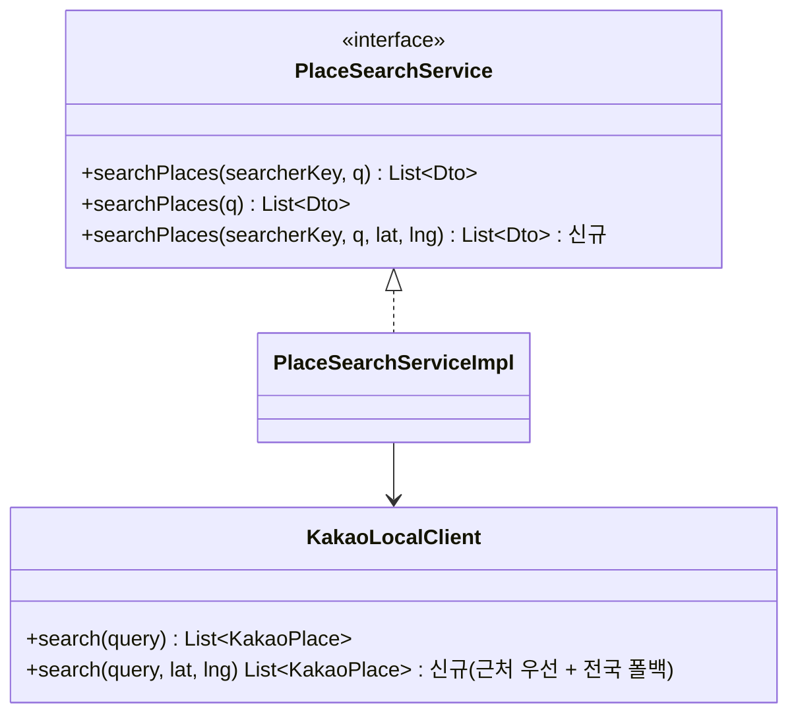

# PRD: 장소 검색 위치 기반 랭킹

> 티켓: MSG-481 · 작성일: 2026-08-26 · 작성: prd-writer
> 상태: 검토됨  <!-- 2026-08-26 정민 승인. 미해결 3건 모두 확정 반영 -->

## 1. 문제 상황

부산 서면을 보고 있는 지도에서 "서면"을 검색하면 결과 15건이 전부 전라남도 순천시 서면의 산골 장소다.
자연휴양림, 계곡, 저수지가 올라오고 사용자가 기대한 부산 서면 상권은 한 건도 없다. 2026-08-25 전역 QA에서
`GET /api/search/places?q=서면`을 직접 호출해 확인한 결과다.

원인은 화면 쪽이 아니다. 서버가 받는 파라미터가 검색어 하나뿐이라 위치를 반영할 방법 자체가 없다
(`PlaceSearchController.searchPlaces`의 `@RequestParam String q`). 카카오 로컬 키워드 검색은 정확도순[^1]으로
전국을 뒤지고, 우리는 그 순서를 그대로 넘긴다.

받아온 15건을 서버에서 거리순으로 다시 세워도 이 문제는 풀리지 않는다. 15건이 전부 순천이면 재정렬해도
순천이다. 부산 서면은 애초에 응답에 들어오지 않는다. 바꿔야 하는 것은 정렬이 아니라 카카오에 보내는 요청이다.

## 2. 목적 · 목표

- **목적**: 사용자가 보고 있는 지도와 검색 결과를 일치시킨다. 검색은 지도를 옮기기 위한 수단인데, 화면과 무관한
  전국 결과만 나오면 그 수단이 동작하지 않는다.
- **목표**
  - 부산 화면에서 "서면"을 검색하면 부산 서면 인접 결과가 상위에 나온다.
  - 위치를 붙였다는 이유로 결과가 사라지지 않는다. 20km 안에 아무것도 없으면 위치 없는 검색과 같은
    결과로 되돌아간다.
  - 다만 "먼 곳의 고유명사를 화면과 무관하게 찾아 준다"는 목표가 아니다. 아래 "알려진 한계" 참조.
  - 위치를 보내지 않는 요청은 지금과 완전히 같게 동작한다.
- **비목표(스코프 제외)**
  - 거리 필터. 사용자에게 보이는 결과에서 먼 장소를 영구히 지우는 규칙은 만들지 않는다.
  - 결과 건수 변경. 최대 15건은 그대로다.
  - 인기 검색어 집계(`GET /api/search/trending`) 규칙 변경.
  - 격자 표시명 역파싱 검색과 구역 이동. 이 둘은 클라이언트가 구역 캐시로 처리하는 별개 경로다.

## 3. 기능 요구사항

| ID | 요구사항 | 우선순위 |
|----|----------|----------|
| FR-1 | 사용자는 검색어와 함께 지금 보고 있는 지도의 중심 좌표를 보낼 수 있고, 그 좌표에서 20km 안에 있는 장소가 결과에 온다 | Must |
| FR-2 | 중심 좌표 20km 안에 검색어와 맞는 장소가 하나도 없으면 위치 없는 검색과 같은 결과를 준다. 빈 배열이 아니다 | Must |
| FR-3 | 좌표를 보내지 않은 요청은 지금과 같은 결과를 준다. 기존 클라이언트는 고치지 않아도 계속 동작한다 | Must |
| FR-4 | 위도와 경도 중 하나만 왔거나, 값이 대한민국 좌표 범위 밖이거나 숫자가 아니면 400(developCode 5400)으로 거절한다. 좌표를 조용히 무시하지 않는다 | Must |
| FR-5 | 결과 한 건의 구성(장소명, 주소, 좌표, 격자 ID, 구역 이름, 구역 내 위치)과 최대 15건 상한은 바뀌지 않는다 | Must |
| FR-6 | 비로그인 사용자도 좌표를 실어 검색할 수 있고 결과는 로그인 때와 같다 | Must |
| FR-7 | 검색어 집계는 지금 규칙 그대로다. 좌표는 집계 대상이 아니고 어디에도 저장되지 않는다 | Must |
| FR-8 | 검색어가 트림 후 비어 있으면 좌표가 함께 왔더라도 외부 호출 없이 200 빈 배열이다 | Must |
| FR-9 | 외부 공급자 실패는 좌표 유무와 관계없이 지금과 같은 단일 업스트림 오류(502, developCode 5502)로 수렴한다 | Must |

엣지 케이스를 요구사항으로 못 박은 것은 FR-2와 FR-4다. FR-2가 없으면 위치를 붙인 순간 "제주공항"이 0건이
되어 검색이 지금보다 나빠진다. FR-4는 좌표를 무시하고 200을 주면 클라이언트가 "왜 위치 랭킹이 안 먹지"를
추적할 단서가 없어서다. 이미 핫구역(8400), 미션(12400), 경로 추천(14400)이 같은 방식으로 뷰포트[^2]를 검증한다.

## 4. 비기능 요구사항

| 분류 | 요구사항 |
|------|----------|
| 성능 | 좌표가 있고 근처 결과가 있는 보통의 검색은 외부 호출 1회로 끝난다. 근처에 결과가 없어 전국으로 되돌아가는 경우에만 2회다. 사용자가 기다리는 시간은 이 경우 기존의 두 배까지 늘 수 있으므로, 외부 호출 타임아웃(연결 1초, 읽기 3초)은 그대로 두고 총 대기가 8초를 넘지 않아야 한다 |
| 보안/인가 | 비로그인 GET 개방(MSG-469)은 불변이다. 파라미터가 늘어도 인증 요구가 생기지 않는다 |
| 데이터 정합 | 공급자 결과 무저장, 무캐시라는 약관 제약(FR-SEARCH-03)은 그대로다. 좌표도 저장하거나 캐시하지 않는다 |
| 운영 | 마이그레이션 없음. 좌표는 사용자의 현재 위치에 준하는 값이므로 검색어와 마찬가지로 로그에 남기지 않는다(MSG-342 로그 정책) |

## 5. 시퀀스 다이어그램

## 6. 클래스 다이어그램

신규 타입은 없다. 기존 두 계약의 입력이 늘어난다.

경로 추천(Owner B)이 소비하는 1인자 `searchPlaces(q)`는 시그니처와 동작이 그대로여야 한다. 크로스오너 계약
경계면이라 여기서 깨지면 MSG-457이 함께 깨진다.

## 7. 변경 파일 목록

| 파일 | 변경 | Owner |
|------|------|-------|
| `src/main/java/com/msg/fillmap/search/controller/PlaceSearchController.java` | 수정(선택 파라미터 lat·lng 수용, 좌표 유효성 검사) | A |
| `src/main/java/com/msg/fillmap/search/service/PlaceSearchService.java` | 수정(좌표를 받는 메서드 추가, 기존 두 개는 보존) | A |
| `src/main/java/com/msg/fillmap/search/service/impl/PlaceSearchServiceImpl.java` | 수정(좌표를 클라이언트로 전달, 집계 접수 순서는 유지) | A |
| `src/main/java/com/msg/fillmap/search/service/KakaoLocalClient.java` | 수정(x·y·radius 전달, 0건이면 위치 없이 재호출) | A |
| `src/main/java/com/msg/fillmap/search/exception/SearchErrorCode.java` | 수정(좌표 형식 오류 상수 1개 추가, 5xxx 대역) | A |
| `src/test/java/com/msg/fillmap/search/service/KakaoLocalClientTest.java` | 수정(요청 파라미터 검증, 폴백 재호출 검증) | A |
| `src/test/java/com/msg/fillmap/search/service/PlaceSearchServiceTest.java` | 수정(좌표 전달·미전달 분기) | A |
| `src/test/java/com/msg/fillmap/search/controller/PlaceSearchControllerTest.java` | 수정(좌표 검증 400, 하위 호환 200) | A |
| `docs/srs.md` | 수정(FR-SEARCH-02 개정, 위치 랭킹 요구 신규 등재) | - |

마이그레이션과 신규 테이블은 없다.

## 8. 미해결 질문

- [x] 기준 범위: 지도 중심 좌표와 반경 20km 고정(2026-08-26 정민 확정). 클라이언트는 좌표 두 개만 보낸다.
      화면 사각형을 그대로 쓰는 안(카카오 `rect`)은 반려했다. 한 블록만 보이게 확대한 상태에서 화면 안
      결과가 0건이 되어 전국으로 되돌아가고, 그러면 이 티켓이 고치려는 증상이 그대로 재현된다. 검색은
      화면 밖으로 이동하려고 쓰는 기능이라 화면에 정확히 맞추는 것이 이득이 아니다. 남는 한계는 전국이
      보일 만큼 축소한 화면에서도 중심 20km만 본다는 점이고, 그 경우 근처 결과가 없으면 FR-2의 전국
      재호출이 받아 준다.
- [x] 좌표 형식 오류 developCode: 5400(2026-08-26 정민 확정). 기존 5502와 같은 search 대역이다.
- [x] FE 합의 시점: 응답과 요청 계약을 미리 공유한 뒤 서버 구현을 진행한다(2026-08-26 정민). 하위 호환(FR-3)이
      있어 FE가 좌표를 붙이기 전에도 검색은 그대로 동작하므로 배포 순서 제약은 없다.

## 9. 알려진 한계 (2026-08-26 실측)

**근처 결과가 0건이 아니면 폴백이 걸리지 않는다.** 실 카카오 키로 확인한 결과, 부산 좌표로 "제주공항"을
검색하면 근처 결과가 0건이 아니라 4건이다. 제주항공 카운터 김해국제공항국내선청사, 제주원렌트카 김해공항지점,
제주원렌트카 부산지점처럼 이름에 "제주"가 들어간 부산 업체들이 20km 안에 있기 때문이다. 그래서 전국
재호출이 일어나지 않고 제주국제공항은 결과에 들어오지 않는다.

이 상태를 그대로 두기로 했다(2026-08-26 정민 확정). 이 티켓이 고치려던 것은 보고 있는 화면과 결과가
어긋나는 문제이고 그것은 해결됐다. 먼 곳의 고유명사는 사용자가 지도를 옮기고 다시 검색하면 된다.

고치는 선택지는 검토 후 반려했다. 폴백 임계를 "N건 미만"으로 완화하는 안은 임계값이 임의라 4건 같은
사례에 계속 취약하다. 근처와 전국을 항상 두 번 불러 이어 붙이는 안은 두 목표를 다 만족하지만, 소수 사례를
위해 모든 위치 검색의 외부 호출과 사용자 대기가 두 배가 된다. 재검토 조건은 이 증상이 사용자 문의나 QA에서
반복 관측되는 것이다.

## 10. 참고

- 요구사항 정본 대조: `docs/srs.md` FR-SEARCH-01, FR-SEARCH-02, FR-SEARCH-03, NFR-SEC-01
- 이 PRD의 SRS 등재분(2026-08-26): FR-1과 FR-2와 FR-3은 **FR-SEARCH-16**, FR-4는 **FR-SEARCH-17**로
  등재했다. FR-SEARCH-02는 정렬을 조건 없이 공급자 정확도순으로 못 박고 있어 "위치 신호가 없는 검색은"으로
  한정하는 개정을 함께 넣었다. FR-5부터 FR-9까지는 기존 요구(FR-SEARCH-02, 03, 04, 05, 06)의 불변 확인이라
  새로 등재하지 않았다
- 공급자 결정 근거: 위키 `04-decisions/ADR 장소 검색 카카오 로컬 프록시.md` (혼용 허용, 무저장 조건)
- 화면: 검색 화면의 시각 요소는 바뀌지 않아 피그마 대조는 하지 않았다. 클라이언트 변경은 요청에 좌표를
  더하는 것뿐이다.

[^1]: 정확도순. 카카오 로컬 키워드 검색의 기본 정렬이며 검색어와 장소명의 일치도를 기준으로 삼는다. 거리는
      기본적으로 고려하지 않는다.
[^2]: 뷰포트. 지도 화면에 지금 보이는 사각형 영역.
[^3]: 반경 검색. 중심 좌표와 거리를 주면 그 원 안의 장소만 돌려주는 방식이다. 카카오 로컬은 최대 20km까지
      허용한다. 순수한 위치 편향(먼 결과를 지우지 않고 순위만 낮추는 방식)은 제공하지 않아, 이 PRD는 반경
      검색에 전국 재호출을 붙여 같은 효과를 낸다.
[^4]: 패스스루. 외부 공급자의 응답을 저장하거나 캐시하지 않고 그대로 전달하는 방식이다. 카카오 약관이
      요구하는 조건이라 검색 경로에는 저장소가 아예 없다.
[^5]: 폴백. 첫 시도가 원하는 결과를 못 낼 때 준비된 다른 경로로 넘어가는 것. 여기서는 근처 검색이 0건일 때
      위치 없이 다시 검색하는 것을 가리킨다.
