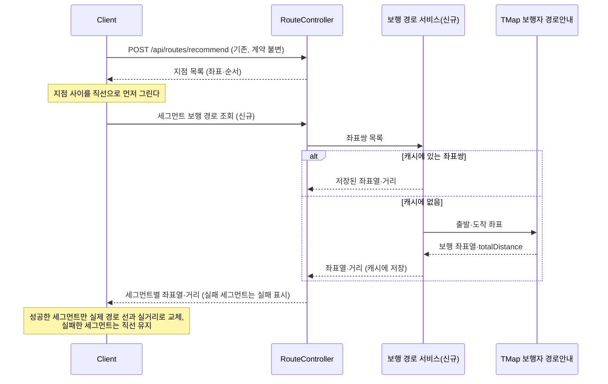

# PRD: AI 경로 추천 보행 경로 표시

> 티켓: MSG-483 · 작성일: 2026-08-26 · 작성: prd-writer
> 상태: 검토됨 (2026-08-26 성민 승인)  <!-- 수명주기: 초안 → 검토됨(사용자 승인 시 게이트가 갱신) → 확정 -->

## 1. 문제 상황

AI 경로 추천(MSG-457)의 결과 화면은 지점 사이를 직선으로 잇는다. 이 선은 지점끼리 기하학적으로
연결한 것이라 건물이나 길이 없는 곳을 그대로 가로지른다. 걷기 코스(두루누비)도 처음에는 같은
직선이었다가 실측 경로 선으로 바뀌었는데, 그쪽은 실측 GPX 데이터가 이미 있어 표시만 바꾸면 됐다.
AI 추천은 지점 조합이 요청마다 달라서 두 지점 사이 걷는 길을 그때그때 계산해야 하고, 그래서
MSG-457 스펙은 "도보 경로 계산은 비목표"로 남겨 뒀다.

선만의 문제가 아니다. 지점 카드에 적히는 "다음 지점까지 약 600m" 같은 안내는 하버사인[^1]
직선거리 기준이라, 선을 실제 경로로 바꾸면 선의 길이와 카드의 숫자가 서로 어긋난다. 선과 숫자를
함께 바꿔야 개선이 완성된다.

이 문서는 MSG-457 PRD의 비목표("실제 길찾기는 외부 지도 앱으로 넘긴다")를 뒤집는 요구사항
변경이다. 국내에서 도보 길찾기를 공개 API로 제공하는 곳은 SK TMap[^2]이 사실상 유일하고, 무료
한도(하루 1,000건)로 지금 규모를 감당할 수 있다는 것까지 확인해 뒀다(2026-08-26 성민 실측,
openapi.sk.com 요금 페이지).

## 2. 목적 · 목표

- **목적**: 추천 동선이 지도 위에서 실제로 걸을 수 있는 길로 보이게 한다. 길 없는 곳을
  가로지르는 선은 동선의 신뢰를 깎는다.
- **목표**:
  - 추천 결과 지도에서 지점 사이 선이 실제 보행로를 따라 그려진다.
  - 카드의 거리 안내가 실제 걷는 거리 기준으로 나온다.
  - 길찾기 호출이 실패하거나 무료 한도가 소진되면 지금처럼 직선으로 보여주고, 추천 기능
    자체는 죽지 않는다.
- **비목표(스코프 제외)**:
  - 자동차와 대중교통 경로는 다루지 않는다. 보행 경로뿐이다.
  - 턴바이턴 안내("50m 앞에서 좌회전" 류)는 하지 않는다. 선의 모양과 거리 숫자까지다.
  - 걷기 코스(두루누비)의 경로는 다시 계산하지 않는다. 실측 GPX가 이미 정본이다.
  - 지점 방문 순서를 정하는 로직은 바꾸지 않는다. 순서는 지금처럼 하버사인 최근접 이웃으로
    정한다. 순서까지 보행 거리로 정하려면 지점 쌍 전부를 조회해야 해서 무료 한도가 감당하지
    못한다.
  - 추천 API `POST /api/routes/recommend`의 요청과 응답 계약은 바꾸지 않는다.

## 3. 기능 요구사항

| ID | 요구사항 | 우선순위 |
|----|----------|----------|
| FR-1 | 추천 결과 지도에서 이웃한 두 지점을 잇는 선이 실제 보행로를 따르는 좌표열로 그려진다 | Must |
| FR-2 | 클라이언트는 추천 결과에서 얻은 좌표쌍으로 서버에 세그먼트[^3]의 보행 경로를 조회할 수 있다. 응답에는 보행로를 따르는 좌표열과 실제 걷는 거리가 실린다 | Must |
| FR-3 | 추천 API의 응답 계약은 바뀌지 않는다. 클라이언트는 추천 응답만으로 지금처럼 직선을 먼저 그리고, 보행 경로가 도착한 세그먼트부터 실제 경로 선으로 바꾼다 | Must |
| FR-4 | 카드의 "다음 지점까지" 거리 안내는 보행 경로를 받은 세그먼트에서 실제 걷는 거리로 표시된다 | Must |
| FR-5 | 보행 경로 조회가 실패한 세그먼트는 직선 연결과 직선거리 안내로 남고, 다른 세그먼트와 추천 기능은 영향을 받지 않는다 | Must |
| FR-6 | 출발지가 반영된 추천이면 출발지에서 첫 지점까지 구간도 같은 규칙으로 그려진다 | Must |
| FR-7 | 외부 길찾기 인증 키는 서버에만 둔다. 클라이언트는 서버를 거쳐서만 보행 경로를 얻는다 | Must |
| FR-8 | 같은 좌표쌍의 보행 경로를 다시 조회하면 외부 호출을 반복하지 않고 응답한다. 받은 데이터의 보관과 사용은 24시간을 넘기지 않는다(TMap 약관 준수사항, 2026-08-26 원문 확인) | Must |
| FR-9 | 하루 외부 호출량이 무료 한도 안에 머물도록 서버가 방어한다. 한도에 닿으면 그날의 보행 경로 조회는 실패 응답으로 떨어지고 클라이언트는 별도 안내 없이 직선 폴백[^4]으로 동작한다(2026-08-26 성민 확정) | Must |
| FR-10 | 지점별 추천 이유를 만드는 사실 문장 조립에서 직전 지점까지의 직선거리 항목을 뺀다. 카드의 실제 걷는 거리와 이유 문장 속 직선거리가 나란히 보이며 어긋나는 상황을 없앤다(2026-08-26 성민 확정) | Must |

FR-5와 FR-9의 폴백은 티켓 완료 조건("추천 기능 자체는 죽지 않는다")의 이행이다. 보행 경로는
있으면 좋아지는 장식이고, 없어도 추천은 성립한다.

SRS 연결(2026-08-26 등재): FR-1~6은 FR-ROUTE-16, FR-5와 FR-9의 폴백은 FR-ROUTE-17,
FR-7은 NFR-SEC-10, FR-8~9의 한도 방어와 캐시 상한은 NFR-OPS-09, FR-10은 FR-ROUTE-05
개정에 해당한다. 관련 기존 요구는 FR-ROUTE-10(결정적 순서), FR-ROUTE-11(출발지),
FR-ROUTE-13(지점 상한 8)이고 외부 비용 방어 선례는 FR-ROUTE-12다.

## 4. 비기능 요구사항

| 분류 | 요구사항 |
|------|----------|
| 성능 | 추천 응답 시간은 이 기능 도입 전과 같다. 보행 경로는 추천 응답과 분리해 따로 조회하므로 추천을 기다리게 하지 않는다 |
| 보안/인가 | 보행 경로 조회는 추천과 같은 로그인 필수 API다(비로그인 개방 6종에 포함되지 않는다, MSG-469 확정). 외부 인증 키는 환경변수로 서버에만 둔다 |
| 운영 | 무료 한도는 하루 1,000건이고 초과 시 차단이라 과금 사고가 없다. 요금표에서 보행자가 "경로안내" 그룹 한 행에 묶여 있어 그룹 합산 1,000건으로 보수적으로 계획한다. 지점 상한이 8개(FR-ROUTE-13)라 추천 1회의 세그먼트는 최대 7개, 출발지 구간까지 8개다. 캐시(FR-8)가 반복 조회를 흡수한다 |
| 데이터 정합 | 서버가 계산한 값(좌표, 격자, 표시명)은 기존대로 서버 데이터에서만 나온다. 외부 응답에서 화면으로 가는 것은 보행 경로 좌표열과 거리뿐이다 |
| 약관 준수 | TMap 약관 준수사항이 "얻어진 데이터는 저장 후 24시간 이상 사용할 수 없습니다"라고 정한다(tmapapi.tmapmobility.com/terms.html, 2026-08-26 원문 확인). 캐시(FR-8)는 이 상한 안에서만 성립한다. 장소 검색의 전면 미저장(FR-SEARCH-03, 카카오 약관)과 달리 기간부 저장이 명시적으로 허용된 경우다 |

## 5. 시퀀스 다이어그램

점진 렌더 흐름 하나로 충분하다. 직선을 먼저 그리고 보행 경로가 도착한 세그먼트부터 바꾼다.

## 6. 클래스 다이어그램

신규 타입은 스펙에서 정한다. 기존 타입의 변경이 없고(추천 응답 계약 불변) 신규 조회의 형태가
미해결 질문에 걸려 있어 여기서 그리지 않는다.

## 7. 변경 파일 목록

route 패키지는 MSG-457로 서버 몫이 완성돼 있고(`RouteController`, `RouteRecommendService`,
`RouteAiProperties`, `RouteErrorCode` 14xxx), 이번 변경은 그 옆에 붙는다.

| 파일 | 변경 | Owner |
|------|------|-------|
| `src/main/java/com/msg/fillmap/route/controller/RouteController.java` | 수정(세그먼트 보행 경로 조회 엔드포인트 추가) 또는 신규 컨트롤러 분리 | B |
| `src/main/java/com/msg/fillmap/route/service/` | 신규(보행 경로 서비스, TMap 클라이언트, 좌표쌍 캐시) | B |
| `src/main/java/com/msg/fillmap/route/dto/` | 신규(세그먼트 조회 요청·응답 DTO) | B |
| `src/main/java/com/msg/fillmap/route/config/` | 신규(TMap 접속 설정, `RouteAiProperties` 선례) | B |
| `src/main/java/com/msg/fillmap/route/exception/RouteErrorCode.java` | 수정(필요 시 상수 추가, 14xxx 대역) | B |
| `src/main/java/com/msg/fillmap/route/service/RouteRecommendServiceImpl.java` | 수정(사실 문장 조립에서 직전 거리 항목 제거, FR-10) | B |
| `src/main/resources/application*.yml` | 수정(TMap 인증 키 환경변수, 기능 플래그) | - |

Flyway 마이그레이션은 캐시 저장소 결정(스펙 몫)에 따라 생길 수도 있다. 확정 전이라 표에 넣지
않는다.

## 8. 미해결 질문

- [ ] **디자인 미확인.** 현 피그마 정본의 경로추천 화면(웹 `14599:4415`)은 번호 마커를 직각
  꺾인 선으로 잇는 구 컨셉이라 실제 경로 선이 반영된 화면이 없다. 실제 경로 선의 스타일,
  직선 폴백 세그먼트를 시각적으로 구분할지(점선 등)는 디자인 확정 대기다. 서버 몫 구현에는
  걸리지 않는다.

해소된 질문 3건(2026-08-26 성민 확정): 캐시 약관은 원문 확인으로 24시간 상한 저장 허용(FR-8,
비기능 약관 준수 절), 추천 이유 속 직선거리는 제거(FR-10), 한도 소진은 별도 안내 없이 직선
폴백(FR-9).

[^1]: 하버사인 거리: 두 좌표를 지구 곡면 위 직선으로 잰 거리. 지금 카드의 "약 600m"와 지점
    방문 순서 결정이 이 값을 쓴다.
[^2]: TMap 보행자 경로안내 API: SK가 제공하는 도보 길찾기 API. 출발과 도착 좌표를 주면
    보행로를 따르는 좌표열과 실제 걷는 거리를 돌려준다. 카카오와 네이버의 공개 길찾기는
    자동차용뿐이라 국내 도보는 이쪽이 사실상 유일하다.
[^3]: 세그먼트: 추천 동선에서 이웃한 두 지점 사이 구간. 지점 상한이 8개라 추천 1회의
    세그먼트는 최대 7개다.
[^4]: 폴백: 주 방식이 실패했을 때 대신 쓰는 예비 동작. 여기서는 길찾기를 못 받으면 지금의
    직선 연결로 되돌아가는 것.
