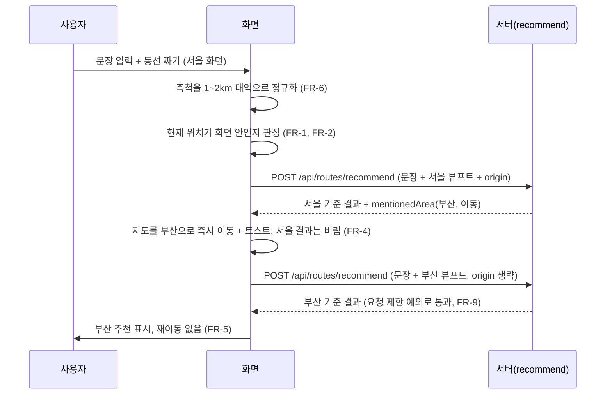

# PRD: AI 경로추천 사용 흐름 자동화

> 티켓: MSG-487 · 작성일: 2026-08-26 · 작성: prd-writer
> 상태: 검토됨 (2026-08-26 성민 승인)

## 1. 문제 상황

AI 경로추천의 사용 흐름에는 사용자가 정하거나 확인해야 하는 단계가 세 개 끼어 있다. 경쟁
서비스(Mindtrip, Layla)를 실제로 써 보면 문장 하나만 치면 목적지 인식부터 지도 이동까지
알아서 이어지는데, 우리 흐름은 그 사이사이에 조작을 요구한다(2026-08-26 성민 비교 실측).

1. **출발 토글.** 입력 카드의 "출발 · 현재 위치" 토글을 사용자가 직접 켜야 요청에
   origin[^1]이 실린다. 토글을 껐을 때 무엇이 달라지는지 화면이 설명하지 못해, 켜야 할지
   말지 사용자가 판단할 근거가 없다.
2. **지역 이동 확인.** 문장에 적은 지역이 화면과 다르면 서버가 mentionedArea 신호[^2]를
   내려주고(MSG-468, 서버 구현 완료), 화면이 "옮길까요?" 안내를 띄워 수락을 받는
   설계였다(MSG-468 PRD FR-4). 그런데 부산 코스를 짜 달라고 적은 사용자가 부산 이동을
   거절할 일은 없다. 어차피 승낙할 단계라 마찰만 만든다.
3. **축척 무관 요청.** 화면 축척이 어떻든 그대로 요청이 나간다. 추천은 뷰포트[^3] 기준이라
   확대 정도에 따라 품질이 널뛴다. 부산역 앞 200m만 보이는 화면과 부산 전역이 보이는
   화면은 같은 문장에 전혀 다른 결과를 준다.

## 2. 목적 · 목표

- **목적**: 문장을 적고 동선 짜기를 누르면 나머지는 서비스가 알아서 처리한다. 사용자가
  정하거나 확인하는 단계를 없앤다.
- **목표**:
  - 사용자는 문장 입력과 동선 짜기 실행 외에 아무 조작 없이, 출발지 반영과 언급 지역
    반영이 끝난 추천 결과를 받는다.
  - 서울 화면에서 "내일 부산 코스 짜 줘"라고 치면 추가 확인 없이 부산 기준 추천이 표시된다.
  - 같은 자리에서 같은 문장으로 실행하면 화면을 얼마나 확대해 뒀든 같은 범위 기준의
    추천이 나온다.

### 개정 요약

이 PRD는 기존 확정 두 건을 고치고 한 건을 새로 올린다.

- **FR-ROUTE-11 개정**: 출발 지점을 "지정할 수 있다"에서 화면이 자동 판정한다로 바꾼다.
  MSG-457 PRD가 미해결로 남겼던 입력 방식(지도에서 찍기, 검색, 현재 위치)을 "입력 없음"으로
  닫는 결정이기도 하다.
- **FR-ROUTE-14 개정**: 이동을 "제안한다"에서 확인 없이 자동으로 옮긴다로 바꾼다. MSG-468
  PRD의 확정(제안 후 수락, 재추천은 수동)을 부분 번복하는 것이고, 번복 근거는 경쟁
  서비스에서 자동 이동이 기본 동작이라는 실측이다. 서버 몫(신호 생성)은 그대로고 화면의
  소비 방식만 바뀐다. 재추천이 자동이 되면서 반복 요청 제한에도 예외 한 번이 함께
  신설된다(FR-9, 2026-08-26 성민 확정).
- **축척 정규화[^5] 신설**: 요청 시점에 화면 축척을 정해진 대역으로 맞추는 요구를 새로 올린다.

- **비목표(스코프 제외)**:
  - 추천 기준을 화면 범위 밖으로 바꾸지 않는다(FR-ROUTE-06 유지). 지역 자동 이동도 화면을
    옮긴 뒤 그 화면 기준으로 다시 찾는 것이지, 화면과 다른 범위에서 찾는 것이 아니다.
  - 출발지를 현재 위치가 아닌 임의 지점으로 지정하는 기능은 만들지 않는다.
  - 경로선을 보행 실경로로 바꾸는 일은 MSG-483 별도 티켓이다.
  - POST /api/routes/recommend의 요청과 응답 구조는 바꾸지 않는다. origin은 원래 선택
    필드고 mentionedArea 신호도 이미 내려온다.

## 3. 기능 요구사항

| ID | 요구사항 | 우선순위 | SRS |
|----|----------|----------|-----|
| FR-1 | 동선 짜기를 실행하는 시점에 현재 위치가 화면 안이면 요청에 출발지가 자동으로 실리고 동선이 그 지점에서 시작한다. 입력 카드에는 "현재 위치에서 출발" 상태 표시만 남고, 이 표시는 누르는 조작이 아니다 | Must | FR-ROUTE-11 개정 |
| FR-2 | 현재 위치가 화면 밖이거나 위치를 알 수 없으면(권한 거부, 측위 실패) 출발지 없이 요청이 나가고 상태 표시도 없다. 어느 경우에도 추천이 실패로 바뀌지 않는다 | Must | FR-ROUTE-11 개정 |
| FR-3 | 출발지를 켜고 끄는 토글을 비롯해 출발지 관련 사용자 조작이 화면에 없다 | Must | FR-ROUTE-11 개정 |
| FR-4 | 문장에 적은 지역이 화면과 달라 이동 신호가 오면 화면이 확인 없이 지도를 그 지역으로 옮기고 토스트("{지역명}으로 이동했어요")로만 알린다. 원래 화면 기준으로 나온 결과는 보여주지 않고, 옮긴 화면 기준의 추천이 사용자 개입 없이 이어서 표시된다 | Must | FR-ROUTE-14 개정 |
| FR-5 | 자동 이동은 한 번의 실행에서 한 번만 일어난다. 이동 뒤 이어지는 요청의 응답에 신호가 또 실려도 다시 옮기지 않는다 | Must | FR-ROUTE-14 개정 |
| FR-6 | 동선 짜기를 실행하는 시점에 화면 축척이 정해진 대역(1~2km)을 벗어나 있으면 대역 안으로 맞춘 뒤 요청한다. 자동 이동 뒤의 요청도 같은 대역이다 | Must | 신설 |
| FR-7 | 결과 부족 안내는 화면을 넓히라는 제안을 담지 않는다. 넓혀도 다음 실행에서 도로 정규화되기 때문이다. 문장을 바꾸거나 다른 지역에서 다시 시도하라는 방향으로 안내한다 | Must | FR-ROUTE-07 관련 |
| FR-8 | 지역 언급이 없거나 신호가 없는 요청은 자동 이동 없이 지금과 같게 동작한다 | Must | FR-ROUTE-14 개정 |
| FR-9 | 자동 이동에 이어지는 재요청 한 번은 반복 요청 제한에 막히지 않는다. 그 외의 요청은 지금처럼 제한된다(한 번의 실행이 쓰는 외부 호출은 최대 두 번) | Must | FR-ROUTE-12 관련 |

## 4. 비기능 요구사항

| 분류 | 요구사항 |
|------|----------|
| 호환 | 서버 API 계약(요청·응답 구조)은 그대로다. 서버 코드 변경은 두 가지다. 결과 부족 안내 문구 상수 교체(결과 부족 배너는 서버 notice[^4] 값을 그대로 표시하는 계약이라 문구를 바꾸려면 서버 상수를 바꿔야 한다. FE 연동 가이드 명문)와 반복 요청 제한의 예외 한 번(FR-9)이다. 티켓의 "서버 무변경" 전제에 이 두 예외가 있다 |
| 비용 | 자동 이동이 일어나면 한 번의 실행에 외부 해석과 추천 호출이 두 번 쓰인다. 반복 요청 제한의 취지인 외부 비용 통제는 예외를 이동 신호 직후의 한 번으로 한정해 유지한다(FR-9) |
| 프라이버시 | 현재 위치가 사용자 조작 없이 요청에 실린다. 기존에도 토글을 켜면 실리던 값이라 새로 수집하는 정보는 아니고, 실리는 경우에는 상태 표시가 화면에서 알린다 |
| 운영 | 새 테이블과 마이그레이션이 없다 |

## 5. 시퀀스 다이어그램

자동 이동이 일어나는 흐름 하나로 세 변경이 모두 지나간다. 서울 화면에서 "내일 부산 코스 짜
줘"를 실행한 경우다.

지역 언급이 없으면 첫 응답에 신호가 없어 그대로 결과가 표시되고, 요청은 한 번으로
끝난다(FR-8). 두 번째 요청은 반복 요청 제한(10초) 안에 들어오지만 이동 신호 직후의 한
번이라 예외로 통과한다(FR-9). 예외를 어떻게 식별하는지는 스펙에서 정한다.

## 6. 클래스 다이어그램

신규 타입 없음. 화면 동작 변경이 대부분이고 서버는 문구 상수 하나라 변경 파일 목록으로
갈음한다.

## 7. 변경 파일 목록

| 파일 | 변경 | Owner |
|------|------|-------|
| `src/main/java/com/msg/fillmap/route/service/RouteRecommendServiceImpl.java` | 수정: 결과 부족 notice 문구 상수 교체(임계 3개, 조건, 응답 구조는 불변)와 반복 요청 제한의 이동 신호 직후 1회 예외(FR-9) | B |
| `docs/srs.md` | 수정: FR-ROUTE-11과 FR-ROUTE-14 개정, 축척 정규화 등재(srs-writer) | - |

토글 제거와 상태줄, 자동 이동과 토스트, 축척 정규화, 배너 반영은 프런트 레포 몫이라 이
표에 없다. LLM-WIKI의 지도 홈 FE 연동 가이드가 origin을 토글 기준으로 설명하고 있어 확정
후 함께 갱신해야 한다.

## 8. 미해결 질문

작성 시점에 네 건이 있었고, 한 건은 2026-08-26 성민이 확정해 해소됐다.

- [x] **자동 재추천과 반복 요청 제한의 충돌.** 자동 이동 흐름은 한 번의 실행에서 요청이 두
      번 나가는데, 서버의 반복 요청 제한(FR-ROUTE-12, 사용자당 10초)이 두 번째 요청을
      막는다(첫 응답이 실측 4~7초라 재요청은 거의 항상 10초 안이다). 이동 신호를 받은
      직후의 재요청 한 번을 제한에서 빼 주는 쪽으로 확정했다(2026-08-26 성민, FR-9와
      비기능 호환에 반영). MSG-468 PRD의 "재추천은 수동이고 제한에 예외를 만들지
      않는다"(2026-08-25) 확정의 번복이다. 당시 예외를 두지 않은 근거는 수동 재추천
      전제였고, 자동 이동이 기본이 되면서 그 전제가 사라졌다. 화면이 10초를 채울 때까지
      기다렸다 재요청하는 안(서버 무변경)은 자동 이동 경로의 체감 대기가 15초 안팎이 되어
      기각했다.

남은 세 건은 스펙과 디자인 몫이라 이 문서에서 값을 정하지 않는다.

- [ ] **축소 신호의 화면 소비 (스펙 몫, 2026-08-26 성민 위임).** 정규화 뒤에도 부산처럼 큰
      지역을 언급하면 서버는 축소 신호(ZOOM_OUT)를 계속 만든다. 1~2km 화면은 그 지역의
      일부만 담기 때문이다. "더 넓게 볼까요" 안내는 넓혀도 다음 실행에서 도로 좁아지니
      자기모순이라 폐기가 자연스러운데, 화면이 이 신호를 무시하는 것으로 확정할지, 그때
      FR-ROUTE-14의 축소 안내 조항을 삭제 개정할지는 스펙 단계에서 정한다.
- [ ] **결과 부족 문구 확정값.** 시안(피그마 제안 5)은 "조건에 맞는 곳을 2곳만 찾았어요.
      문장을 바꾸거나 다른 지역에서 다시 짜 보세요"다. 현재 서버 상수는 두 개다. 0곳이면
      "지도 범위를 옮기거나 문장을 바꿔보세요", 1~2곳이면 "찾은 만큼만 보여드려요". 둘 다
      바꾸는지, 0곳 문구는 유지하는지 디자인 확정과 함께 정한다.
- [ ] **정규화 대역의 정의.** "1~2km"가 화면 한 변 길이인지 지도 축척 단계인지, 1km보다
      좁을 때 넓히기만 하는지 양방향으로 맞추는지는 스펙과 FE에서 정한다. 시안 주석은 "약
      2km"로 맞춘 예를 그렸다.

[^1]: origin. 추천 요청에 실어 보내는 출발 지점 좌표. 처음부터 선택 필드라 안 보내도 동작하고, 보내면 동선이 그 지점에서 시작한다.
[^2]: mentionedArea 신호. 문장 속 지역이 화면과 어긋날 때 서버가 응답에 실어 주는 안내 신호(MSG-468). 지역 이름과 중심 좌표가 담기고, 이동(MOVE)과 축소(ZOOM_OUT) 두 종류가 있다.
[^3]: 뷰포트(viewport). 지금 화면에 보이는 지도의 사각형 범위. 추천은 이 범위 안에서만 후보를 찾는다.
[^4]: notice. 추천 응답에 실리는 결과 부족 안내 문구. 지점이 3개 이상이면 비어 있고 0~2개면 문구가 실린다. 화면의 결과 부족 배너는 이 값을 그대로 표시한다.
[^5]: 축척 정규화. 요청 직전에 지도 확대 수준을 정해진 대역(1~2km)으로 맞추는 일. 추천 품질이 화면 크기에 따라 널뛰지 않게 한다.
