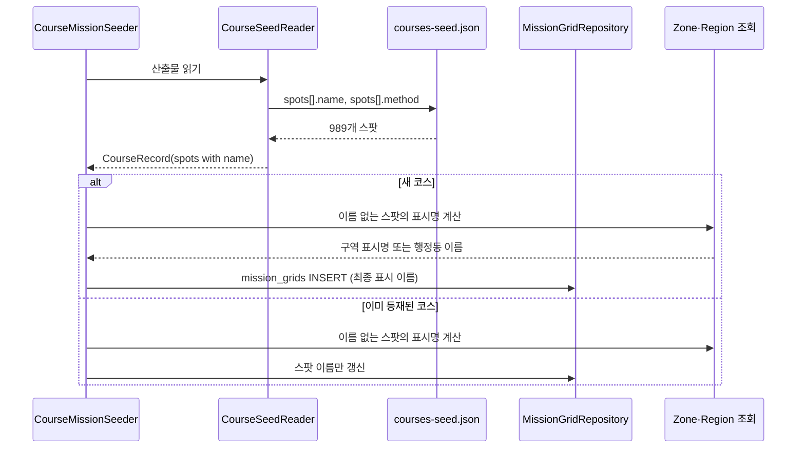
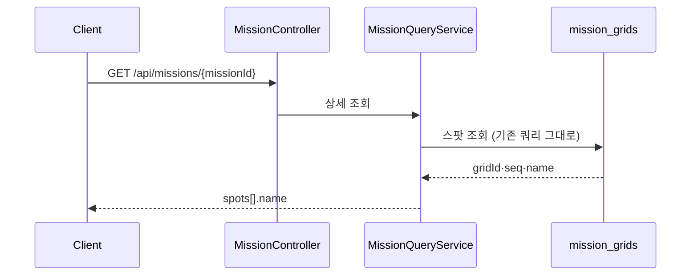
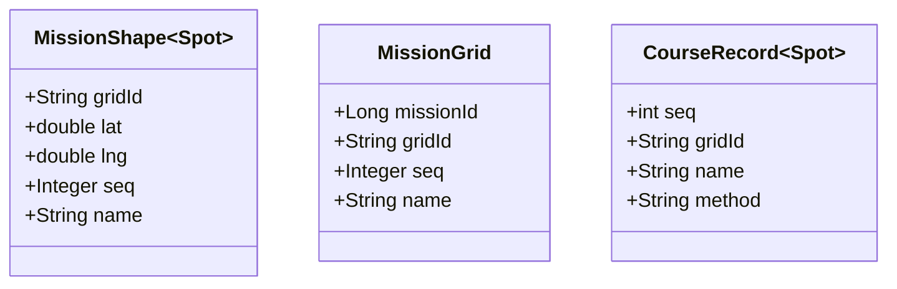

# PRD: 코스 미션 포토스팟 표시 이름

> 티켓: MSG-492 · 작성일: 2026-08-26 · 작성: prd-writer
> 상태: 검토됨 (2026-08-26 정민 승인)  <!-- 수명주기: 초안 → 검토됨(사용자 승인 시 게이트가 갱신) → 확정 -->
>
> SRS 대조: **FR-MISSION-19**(계획, 2026-08-13 확정)를 상세화하는 PRD다. 신규 요구가 아니라
> 이미 등재된 요구의 구현 범위를 정한다. 다만 그 요구의 뒷 문장("정식 명소가 아님을 구분한다")은
> **부분 충족으로 남는다.** 대체 이름이 행정동 형태라 이름만으로 구분이 서지만 서버가 명시
> 신호를 주지는 않는다(2026-08-26 결정). 구현 뒤 요구 상태를 올릴 때 이 차이를 함께 적는다.
> 원본 명소 이름을 적재해 보여주는 부분(FR-2)은 SRS 어디에도 없어 별도 등재가 필요하다.

## 1. 문제 상황

지도 홈에서 코스 미션을 열면 포토스팟[^1] 목록이 나오는데, 지금은 항목 제목이 전부
"이름 없는 경유 지점"이다. 2026-08-26 운영 화면(해파랑길 1코스)에서 7곳 전부가 그랬다.
사용자는 어디로 가야 하는지 알 수 없고, 옆에 붙은 "영상 9" 같은 숫자만 보고 찍어야 한다.

원인은 두 겹이다.

첫째, **서버가 이름을 아예 안 보낸다.** 미션 응답의 스팟 항목은 `gridId`와 좌표와 순번뿐이라
화면이 쓸 이름 재료가 없다. FE가 격자 이름을 따로 조회해도 소용이 없는데, 코스 스팟 972칸 중
**951칸(98%)은 `grids` 테이블에 행 자체가 없기 때문이다.** 격자 행은 누군가 영상을 올릴 때
비로소 만들어지는 구조라, 아무도 안 다녀간 경유 지점은 조회할 대상이 존재하지 않는다.

둘째, **이름이 이미 손에 있는데 버리고 있다.** 코스 산출물 `courses-seed.json`의 스팟 989개는
전부 `name`을 갖고 있는데 적재 단계에서 읽지 않는다. 그중 417개는 "다대포 꿈의 낙조분수",
"광안리해수욕장" 같은 실제 명소 이름이다. 화면에서 본 해파랑길 1코스 7곳도 전부 여기 해당해서,
읽기만 했으면 오륙도해맞이공원부터 송림공원까지 그대로 나왔을 자리다.

나머지 572개는 원본에 명소가 없어 기하 폴백[^2]으로 좌표만 잡은 지점이고, 이름이 "경유점 3"
같은 자리표시다. 두루누비 원본과 GPX 파일을 전수로 뒤졌지만 지점 이름은 어디에도 없었고,
POI 검색 반경을 넓히는 우회로도 닫혀 있다. 이 572개의 최근접 POI 거리를 재보니 반경 안(400m)이
34개뿐이고 절반이 1.5km 밖이라, 반경을 늘리면 엉뚱한 이름이 붙는다.

다만 이 지점들도 **자리 자체는 이름을 갖고 있다.** 스팟 좌표를 역지오코딩[^3]하면 972칸 중
910칸(94%)이 곧바로 행정동으로 떨어진다. 나머지 62칸은 해안선 바깥이라 어떤 행정동에도 안
들어가는데, 그중 55칸은 경계에서 300m 안이고 300m를 넘는 지점은 7칸뿐이다(최대 2.2km).
두루누비 걷기길이 해안을 따라 나 있어 격자 중심이 물 쪽으로 떨어지는 경우다.

## 2. 목적 · 목표

**목적**: 코스 미션의 모든 경유 지점이 사람이 읽고 찾아갈 수 있는 이름을 갖게 한다.

**목표**

- 코스 포토스팟 972칸 전부가 빈 이름 없이 표시된다(지금은 0칸)
- 원본에 명소 이름이 있는 417칸은 그 이름을 그대로 보여준다
- 명소가 없는 555칸은 격자 표시명[^4]으로 대신한다. 대체 이름은 형태만으로 명소가 아님이 드러난다
- 목록에서 보든 상세에서 보든 같은 지점은 같은 이름이다

**비목표(스코프 제외)**

- 코스 미션의 대표 격자 업로드는 이번 범위가 아니다. 축제와 팝업에는 좌표 없이 올리는 경로가
  있지만(FR-MISSION-22) 코스는 대상에서 빠져 있고, 그 확장은 이름 문제와 독립이라 별도로 판단한다
- POI 재수집과 검색 반경 조정은 하지 않는다. 위에 적은 실측으로 효과가 없다는 것이 닫혔다
- 축제와 팝업 미션의 이름은 건드리지 않는다. 둘은 미션 제목이 곧 장소라 같은 문제가 없다
- 영상이 올라온 일반 격자의 행정동 라벨 공백은 다루지 않는다. dev에 7,470칸이 있지만 원인도
  해법도 다른 문제다
- 지점 이름을 사용자나 운영자가 고치는 기능은 만들지 않는다
- 이름 출처를 별도 필드로 내려주지 않는다(2026-08-26 정민 결정). 대체 이름이 행정동 형태라
  이름만으로 구분이 서고, 화면이 둘을 시각적으로 가를지는 디자인이 아직 정하지 않았다. 필요해지면
  그때 필드를 더한다

## 3. 기능 요구사항

| ID | 요구사항 | 우선순위 |
|----|----------|----------|
| FR-1 | 사용자는 코스 미션의 포토스팟 목록에서 지점마다 표시 이름을 본다. 이름이 빈 지점이 없다 | Must |
| FR-2 | 원본 산출물이 명소 이름을 가진 지점은 그 이름을 글자 그대로 보여준다. 서버가 다듬거나 자르지 않는다 | Must |
| FR-3 | 명소 이름이 없는 지점은 그 격자의 표시명으로 대신한다. 구역 안이면 구역 이름과 칸 번호이고, 밖이면 행정동 이름이다. 순번은 붙이지 않는다 | Must |
| FR-4 | 대체 이름은 그 형태만으로 정식 명소가 아님이 드러난다. 서버가 출처를 별도 필드로 주지는 않는다 | Must |
| FR-5 | 어떤 행정동에도 속하지 않는 지점(해안·해상)은 가장 가까운 행정동 이름을 받는다 | Must |
| FR-6 | 같은 지점은 미션 목록과 미션 상세 어디서 조회해도 같은 이름이다. 예외는 시더가 이름을 갱신한 직후 최대 1시간이다. 목록은 조립된 결과를 그 주기로 캐시하는데, 이 창은 미션 제목·기간·이미지 등 캐시가 담는 모든 값이 이미 갖고 있는 성질이라 이름 때문에 새로 생기는 것이 아니다 (2026-08-26 스펙 리뷰에서 명시) | Must |
| FR-7 | 이름을 아직 채우지 못한 지점은 응답에서 빈 값으로 오고, 화면은 기존 안내 문구를 그대로 쓸 수 있다. 오류가 아니다 | Must |
| FR-8 | 이미 등재된 코스 148개에도 이름이 채워진다. 코스를 지웠다 다시 넣지 않아도 된다 | Must |
| FR-9 | 이름은 표시 전용이다. 미션 판정, 진행도, 스탬프, 뱃지 어디에도 영향을 주지 않는다 | Must |
| FR-10 | 산출물과 구역·행정동 데이터가 그대로면 적재를 다시 돌려도 이름이 달라지지 않는다. 구역이나 행정동이 바뀌면 재실행이 그 변경을 이름에 반영하는 것이 정상 동작이다 | Must |
| FR-11 | 한 코스가 같은 행정동을 여러 번 지나 대체 이름이 겹쳐도 화면이 순번으로 지점을 가릴 수 있다 | Should |

## 4. 비기능 요구사항

| 분류 | 요구사항 |
|------|----------|
| 성능 | 미션 상세 조회의 왕복 쿼리 수가 스팟 개수에 비례해 늘지 않는다. 지금은 5회 고정이다 |
| 성능 | 미션 목록 조회는 뷰포트에 코스가 여러 개 걸려도 이름 때문에 응답이 느려지지 않는다. 목록은 스냅숏을 재계산할 때만 비용을 치른다 |
| 데이터 정합 | 격자 표시명 규칙은 기존 정본을 그대로 따른다. 명명 규칙의 실행형 정본은 `src/test/resources/fixtures/zone-naming.json`이고 코스라고 다르게 짓지 않는다 |
| 데이터 정합 | 이름이 바뀌어도 이미 발급된 스탬프와 진행도는 영향을 받지 않는다 |
| 운영 | 마이그레이션 한 건이 필요하고, 반영 뒤 코스 시더를 한 번 돌려야 기존 148개가 채워진다 |
| 운영 | 되돌리면 이름만 사라지고 미션 동작은 그대로다 |
| 보안/인가 | 미션 상세와 목록은 이미 비로그인에 열려 있다. 이름도 같은 공개 범위이고 사용자에 따라 달라지지 않는다 |

## 5. 시퀀스 다이어그램

적재 시점에 이름 재료를 채우는 흐름이다.

조회 시점에는 저장된 값을 통과시키기만 한다. 쿼리가 늘지 않는다.

## 6. 클래스 다이어그램

## 7. 변경 파일 목록

| 파일 | 변경 | Owner |
|------|------|-------|
| `src/main/resources/db/migration/V43__mission_grid_spot_name.sql` | 신규. `mission_grids`에 이름 컬럼 추가 | - |
| `src/main/java/com/msg/fillmap/mission/entity/MissionGrid.java` | 수정. 이름 필드와 시드 생성자 | B |
| `src/main/java/com/msg/fillmap/mission/seed/CourseRecord.java` | 수정. 스팟에 이름과 선정 방식 추가 | B |
| `src/main/java/com/msg/fillmap/mission/seed/CourseSeedReader.java` | 수정. 산출물에서 이름과 방식을 읽는다 | B |
| `src/main/java/com/msg/fillmap/mission/seed/CourseMissionSeeder.java` | 수정. 이름 없는 스팟의 표시명을 계산해 채우고, 이미 등재된 코스는 이름만 갱신한다 | B |
| `src/main/java/com/msg/fillmap/mission/dto/MissionShape.java` | 수정. 스팟에 이름 필드 하나 추가 | B |
| `src/main/java/com/msg/fillmap/mission/service/impl/MissionQueryServiceImpl.java` | 수정. 저장된 이름을 응답에 통과 | B |
| `src/main/java/com/msg/fillmap/zone/service/ZoneNameQueryService.java` | 소비만(시더에서). 기존 계약 그대로 | A |
| `src/main/java/com/msg/fillmap/region/service/RegionQueryService.java` | **수정.** 최근접 행정동 조회 메서드 추가 (기존 `resolveByPoint`의 "없음" 의미를 보존하려면 폴백을 안에 넣을 수 없다) | A |
| `src/main/java/com/msg/fillmap/region/service/impl/RegionQueryServiceImpl.java` | **수정.** 위 메서드 구현 | A |
| `src/main/java/com/msg/fillmap/region/repository/RegionRepository.java` | **수정.** 최근접 KNN 조회 추가 (동률은 `region_code`로 단일화) | A |
| `src/main/java/com/msg/fillmap/mission/seed/CourseSpotNameResolver.java` | 신규. 이름 결정 사다리를 담는 순수 로직 | B |
| `.claude/rules/glossary.md` | 수정. 표시명 항목에 코스 스팟 예외와 해상 최근접 폴백 등재 | - |

`ZoneNameQueryService`는 변경하지 않는다. `RegionQueryService`에는 최근접 조회 메서드가 하나
늘어 **Owner A 합의가 필요하다.** 기존 `resolveByPoint`에 폴백을 얹지 않는 이유는 그 계약의
"포함하는 행정동 없음" 신호를 지금 다른 소비처가 쓰고 있기 때문이다.

## 8. 미해결 질문

- [x] **대체 이름의 형태.** 행정동 이름만 쓰고 순번은 붙이지 않는다(2026-08-26 정민 확정).
      화면이 이미 항목 부제로 "3번째 스팟"을 찍고 있어 순번을 붙이면 같은 말이 두 번 나온다
- [x] **이름 출처 필드.** 내려주지 않는다(2026-08-26 정민 확정). 위 비목표 참조
- [x] **대체 이름을 언제 계산할지.** 적재 때 굳혀 저장한다(2026-08-26 스펙 D-2에서 확정).
      조회 때 계산하는 초안은 스팟마다 행정동 판정 왕복이 붙어 위 성능 요구를 깼고, 그걸 막으려
      메모와 TTL을 넣자 목록·상세 이름 불일치가 새로 생겼다. 대가는 구역·행정동 데이터가 바뀌면
      시더 재실행이 필요하다는 것인데, 그 재실행은 이미 운영 절차에 있다
- [ ] 기하 폴백 지점 34곳은 POI가 반경 안(400m)에 있는데도 명소로 안 잡혔다. 산출 파이프라인의
      타입 필터나 지점 간 최소 간격 때문으로 보이는데, 이번 범위에서 들여다볼지
- [ ] 코스 경유 지점을 눌러 그 자리에 영상을 올리는 동선. 지금은 화면이 스팟 좌표를 업로드
      요청에 그대로 실으면 되지만, 축제·팝업처럼 서버가 격자를 정해 주는 경로를 코스에도 열지는
      정하지 않았다. 비목표로 뺐으나 화면 설계와 함께 결정될 사안이다

[^1]: 포토스팟. 코스 미션의 판정 대상 격자다. 코스 하나에 5~8곳을 두고 그중 3곳에 영상을 올리면 완료다. 표시용 경로(폴리라인)와 판정용 스팟을 따로 저장하는 구조에서 판정 쪽에 해당한다.
[^2]: 기하 폴백. 코스 경로 위에서 관광 API로 명소를 못 찾았을 때 시작점과 끝점과 중간점을 기계적으로 골라 지점을 만드는 방식이다. 좌표만 있고 이름이 없다.
[^3]: 역지오코딩. 위도와 경도를 받아 그 자리가 어느 행정동인지 알아내는 조회다. 필맵은 행정동 경계 도형에 점이 들어가는지 보는 방식으로 판정한다.
[^4]: 표시명. 격자를 사람이 읽는 이름이다. 구역 안이면 "서면 A-14"처럼 구역 이름과 칸 번호로, 구역 밖이면 행정동 이름으로 정한다. 계산 주체는 서버다.
