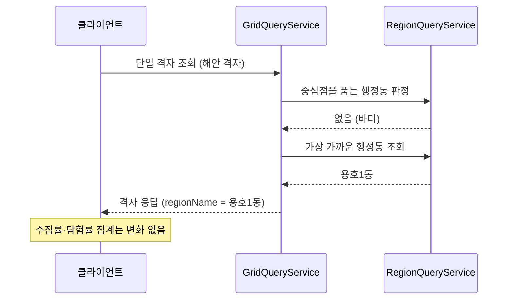

# PRD: 바다에 걸친 격자의 표시 이름

> 티켓: MSG-493 · 작성일: 2026-08-27 · 작성: prd-writer
> 상태: 검토됨 (2026-08-27 정민 승인)

## 1. 문제 상황

해안선에 걸친 격자는 어느 행정동에도 속하지 않는다. 격자의 행정동은 격자 중심점을 품는
행정동 폴리곤으로 정하는데[^1], 중심점이 바다 위면 품는 폴리곤이 없어 행정동 이름이 빈다.

그 격자를 화면에서 열면 이름 대신 `16855_11487` 같은 격자 번호가 그대로 뜬다. 코스 경유
지점에서 실측했을 때 해파랑길 1코스 7곳 중 3곳(이기대공원, 민락수변공원, 마린시티)이 이
상태다. MSG-492가 경유 지점 목록의 이름은 채웠지만, 지점을 눌렀을 때 열리는 격자 화면은
다른 조회 경로라 그대로 남았다. 같은 자리가 목록에서는 "용호1동"인데 눌러 들어가면 격자
번호가 되는, 두 화면이 어긋나는 상태다.

규모는 코스 경유 지점 기준 972칸 중 62칸이다. 그중 55칸은 행정동 경계에서 300m 안이고,
밖은 7칸(최대 2,189m)이다. 코스 경유 지점은 사람이 실제로 밟도록 안내하는 좌표라 코스
이용이 늘면 노출도 그대로 늘어난다.

## 2. 목적 · 목표

- **목적**: 서비스가 가라고 안내한 자리(해안 산책 코스)를 연 사용자가 이름 대신 격자
  번호를 보는 일이 없게 한다.
- **목표**: 어느 행정동에도 속하지 않는 격자를 화면에서 열면, 가장 가까운 행정동의
  이름이 표시 재료로 내려온다.
- **비목표(스코프 제외)**:
  - **집계 귀속. 하지 않는다** (2026-08-27 정민 확정). 바다 격자의 업로드는 도감에는
    남지만 어느 행정동의 수집률에도, 전국 탐험률 분자에도 들어가지 않는다. 이것은
    버그가 아니라 의도된 동작이다. 화면에는 "용호1동"이라 보여도 그 동의 수집률에
    잡히지 않으며, 이 어긋남은 경유 지점 목록(MSG-492)이 이미 채택한 방식과 같아
    두 화면이 일관된다
  - `grids.region_code` 저장 라벨. 무귀속(NULL)을 유지한다(ADR MSG-167 결정 존치)
  - 수집률 분모, 전국 탐험률 분모 정의(FR-REGION-14). 변경 없음
  - 기존 무귀속 격자의 소급 처리. 저장값이 안 바뀌므로 대상이 없다

## 3. 기능 요구사항

| ID | 요구사항 | 우선순위 |
|----|----------|----------|
| FR-1 | 어느 행정동에도 속하지 않는 격자를 단일 조회하면, 응답의 행정동 이름 자리에 가장 가까운 행정동의 이름이 실린다. 서비스 범위(한국) 밖 좌표는 예외로 종전대로 빈 이름이다(기존 가드 유지, 새 에러를 새게 하지 않는다) | Must |
| FR-2 | 가장 가까운 행정동 판정은 결정적이다. 경계에서 거리가 같은 행정동이 여럿이어도 같은 격자는 언제나 같은 이름을 받는다 | Must |
| FR-3 | 거리 상한을 두지 않는다. 실측 최대 2,189m를 포함해 서비스 범위 안의 무귀속 격자가 전부 이름을 받는다 (MSG-492 경유 지점 이름과 같은 규칙) | Must |
| FR-4 | 행정동에 속하는 격자의 응답은 바뀌지 않는다. 폴백은 품는 행정동이 없을 때만 돈다 | Must |
| FR-5 | 이 폴백은 표시 이름에만 관여한다. 수집률, 탐험률, 동 단위 영상 조회의 귀속은 변하지 않는다 | Must |
| FR-6 | 명소 이름도 구역 표시명도 없이 최근접 행정동으로 적재된 경유 지점(MSG-492 사다리 ④)에 한해, 목록과 격자 화면이 같은 행정동을 가리킨다. 최근접 판정 규칙이 같고 결정적이라 행정동이 갈리지 않는다. 문자열은 다르다 — 목록은 마지막 토큰("다대2동"), 격자 화면은 전체 경로 재료다. 명소나 구역 이름이 붙은 경유 지점은 목록이 그 이름을 우선하므로 이 요구의 대상이 아니다 | Must |

## 4. 비기능 요구사항

| 분류 | 요구사항 |
|------|----------|
| 성능 | 폴백은 무귀속 격자에서만 추가 조회 1회다. 최근접 조회는 dev 실측 20.7ms[^2]이고, 정상 격자 경로에는 비용이 붙지 않는다 |
| 데이터 정합 | 저장값 변경이 없다. 마이그레이션도 백필도 없어 롤백이 자유롭다 |

## 5. 시퀀스 다이어그램

## 6. 클래스 다이어그램

신규 타입 없음. MSG-492가 만든 계약 `RegionQueryService.resolveNearestByPoint`의 소비
지점이 하나 늘어날 뿐이다.

## 7. 변경 파일 목록

| 파일 | 변경 | Owner |
|------|------|-------|
| `grid/service/impl/GridQueryServiceImpl.java` | 단일 격자 조회의 행정동 판정에 최근접 폴백 (품는 행정동 없을 때만) | A |

한 파일이다. 조회 재판정 경로(MSG-349)가 이미 `resolveByPoint`를 부르고 있어, 빈 결과일
때 `resolveNearestByPoint`를 잇는 변경이다[^3].

## 8. 미해결 질문

없음. 전부 확정됐다(아래 기록).

## 확정 결정 기록

- **바다 격자를 행정동에 귀속시키지 않는다** (2026-08-27 정민). 수집률·탐험률 누락은
  의도된 동작으로 확정. 검토했던 대안(가장 가까운 동에 귀속)은 수집률 분자에만 들어가
  100% 초과가 가능해지고(FR-REGION-04 위반 위험), 분모 정의(FR-REGION-01·14)까지
  손봐야 해 파급이 컸다
- **표시 이름은 가장 가까운 행정동으로 채운다** (2026-08-27 정민). 화면 이름과 집계
  귀속이 어긋나는 것을 받아들인다. 경유 지점 목록(MSG-492)이 이미 같은 방식이라 두
  화면이 일관된다
- **범위는 단일 격자 조회 하나다** (2026-08-27 정민, "보이는 문제가 있는 데만").
  뷰포트 목록과 핫구역 응답의 무귀속 격자는 이름이 빈 채로 남는다. 그 화면들은 격자
  번호를 노출하지 않아 사용자에게 보이는 문제가 없고, 폴백을 넣으면 요청마다 무귀속
  격자 수만큼 공간 조회가 붙는다

[^1]: 중심점 귀속. 격자의 행정동은 격자 중심 좌표 한 점을 품는 행정동 폴리곤으로 정한다.
    한 격자가 정확히 한 행정동에 속하게 하는 규칙으로, 경계 격자의 이중 카운트를 막는다
    (FR-REGION-03, ADR MSG-167).
[^2]: 최근접 행정동 조회. MSG-492가 만든 `resolveNearestByPoint`. 공간 인덱스의 최근접
    이웃 탐색을 쓰며, 정렬 키를 잘못 얹으면 인덱스를 잃어 128배 느려지는 함정이 있어
    2단 쿼리로 고정되어 있다.
[^3]: 단일 격자 재판정. 격자를 하나 조회할 때는 저장 라벨 대신 중심점을 그 자리에서
    판정한다(MSG-349). 아무도 영상을 올리지 않아 격자 행이 없어도 이름이 나오게 하기
    위한 기존 예외 경로라, 폴백을 여기 얹는 것은 예외의 연장이지 새 예외가 아니다.
