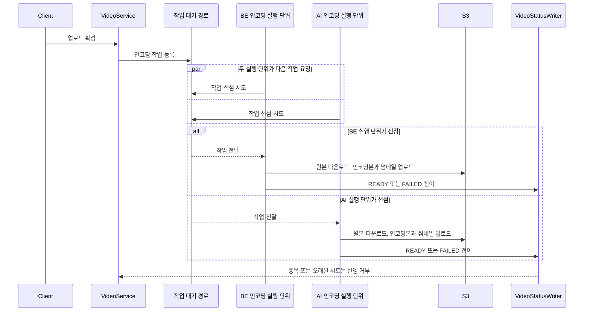

# PRD: 두 실행 노드로 영상 인코딩 분산

> 티켓: MSG-494 · 작성일: 2026-08-27 · 작성: prd-writer
> 상태: 검토됨  <!-- 수명주기: 초안 → 검토됨(사용자 승인 시 게이트가 갱신) → 확정. 2026-08-27 성민 승인 -->

## 1. 문제 상황

영상 업로드가 확정되면 BE 애플리케이션의 단일 인코딩 스레드가 작업을 순서대로 처리한다. 2026-08-27
dev에서 영상 세 개를 연속 업로드했을 때 준비 완료까지 각각 9.4초, 15.8초, 30.4초가 걸렸고 세 번째
영상은 30초 목표를 넘겼다.

같은 t3.small에서 FFmpeg 두 개를 병렬로 실행해도 순차 20.38초가 병렬 19.60초로 줄어드는 데 그쳤다.
스레드 수만 늘리면 같은 CPU와 메모리를 나눠 써야 해서 처리량이 거의 늘지 않는다. BE EC2는 가용
메모리가 약 543MB이고 스왑을 523MB 사용하지만, AI EC2는 최근 3시간 CPU 평균 0.66%와 가용 메모리
약 1.1GB를 기록해 남는 자원이 있다.

현재 인코딩 대기는 애플리케이션 메모리에만 쌓인다.[^1] 앱이 재시작되면 아직 실행하지 않은 작업을
복구할 근거가 없고 영상이 UPLOADED에 남을 수 있다. 실행 노드를 늘리려면 처리량뿐 아니라 작업 유실과
중복 완료도 함께 막아야 한다.

## 2. 목적 · 목표

- **목적**: BE EC2와 AI EC2의 자원을 함께 사용해 동시 업로드가 앞선 영상의 인코딩을 기다리는 시간을
  줄이고, 어느 노드가 처리하더라도 작업이 한 번의 결과로 수렴하게 한다.
- **목표**:
  - 10초에서 20초 길이의 MP4 세 개를 동시에 업로드하는 시험을 3회 반복하고, 아홉 편 모두 업로드
    확정 뒤 30초 안에 READY가 된다(NFR-PERF-08).
  - 실행 노드가 둘이어도 작업 유실과 중복 완료가 0건이며, 처리할 수 없는 작업은 FAILED로 끝난다
    (NFR-OPS-10).
  - 블러 작업 한 개와 인코딩 작업 두 개를 겹쳐 실행해 모든 작업이 READY 또는 FAILED로 끝난다.
  - 변경 전후의 노드별 처리 건수, CPU, 가용 메모리와 스왑 사용량을 비교할 수 있다.
- **비목표(스코프 제외)**:
  - EC2 인스턴스 증설이나 인스턴스 사양 변경.
  - CPU와 메모리를 실시간으로 비교해 작업을 밀어 주는 별도 로드 밸런서. 각 실행 노드는 비어 있을 때
    다음 작업을 가져가며, 블러와 인코딩이 겹치면 한쪽이 기다려도 된다.
  - HLS 전환, 영상 화질 변경, CDN 또는 재생 정책 변경.
  - AI 탐지 모델과 블러 알고리즘 최적화.

## 3. 기능 요구사항

| ID | 요구사항 | 우선순위 |
|----|----------|----------|
| FR-1 | 업로드 확정 뒤 생성된 인코딩 작업은 BE EC2와 AI EC2의 인코딩 실행 단위가 함께 가져갈 수 있는 대기 경로에 들어간다 | Must |
| FR-2 | 한 작업은 한 실행 노드만 선점[^2]해 처리하며, 재전달이나 지연된 완료 신호가 와도 같은 영상 시도를 두 번 완료 처리하지 않는다 | Must |
| FR-3 | 실행 노드 중단으로 끊긴 작업은 다시 처리하고, 입력이나 변환 오류로 처리할 수 없는 작업은 FAILED로 끝낸다. 어떤 경우에도 UPLOADED나 ENCODING에 영구히 남지 않는다 | Must |
| FR-4 | 교체되거나 삭제된 영상의 늦은 작업은 현재 영상 상태와 산출물을 덮어쓰지 않는다 | Must |
| FR-5 | 어느 노드가 처리해도 결과는 720p H.264와 AAC MP4 한 편, 썸네일 한 장이며 기존 길이 판정과 상태 전이를 따른다(FR-MEDIA-01~03) | Must |
| FR-6 | 실행 노드가 달라도 기존 S3 객체 키 규칙, 재생 주소와 공개 범위 판정은 바뀌지 않는다 | Must |
| FR-7 | 블러 작업 한 개와 인코딩 작업 두 개가 겹쳐도 작업이 사라지거나 같은 영상을 중복 완료하지 않고 각각 종료 상태로 수렴한다 | Must |

## 4. 비기능 요구사항

| 분류 | 요구사항 |
|------|----------|
| 성능 | 10초에서 20초 길이의 MP4 세 개를 동시에 업로드하는 시험을 3회 반복했을 때, 아홉 편 모두 업로드 확정 뒤 30초 안에 READY가 된다(NFR-PERF-08) |
| 데이터 정합 | 재전달과 실행 노드 장애를 포함한 시험에서 작업 유실과 중복 종결이 각각 0건이어야 한다. 같은 작업을 다시 받아도 현재 영상 시도에는 한 번만 반영하는 멱등성[^3]을 유지한다(NFR-OPS-10) |
| 운영 | 변경 전후로 노드별 인코딩 처리 건수, 대기 작업 수, 성공과 실패, CPU, 가용 메모리와 스왑 사용량을 남긴다. 블러와 인코딩이 겹친 횟수와 각 작업의 대기 시간도 확인할 수 있어야 한다 |
| 라이선스 | BE 저장소의 MIT 코드와 AI 저장소의 AGPL-3.0 코드는 HTTP 경계를 유지한다. 한 저장소의 코드를 다른 저장소로 복사하거나 import하지 않는다 |
| 비용 | 기존 BE EC2와 AI EC2 안에서 수평 분산[^4]하며 새 인스턴스 비용을 만들지 않는다 |

## 5. 시퀀스 다이어그램

구체적인 대기열 제품과 배포 단위는 스펙에서 정한다. PRD에서는 두 실행 노드가 같은 작업을 경쟁해
하나만 가져가고, 기존 상태 기록 경로로 결과를 모은다는 동작만 고정한다.

## 6. 클래스 다이어그램

대기 경로와 두 번째 실행 단위의 형태가 정해지기 전에는 신규 타입을 확정할 수 없어 생략한다. 기존
`VideoEncodingServiceImpl`의 변환 로직과 `VideoStatusWriter`의 시도 가드를 재사용하는 것을 우선한다.

## 7. 변경 파일 목록

아래는 현재 인코딩 진입점과 상태 기록 경로라 구현 방식과 무관하게 영향을 받는 파일이다. 새 어댑터나
배포 파일은 스펙에서 실행 방식을 고른 뒤 확정한다.

| 파일 | 변경 | Owner |
|------|------|-------|
| `src/main/java/com/msg/fillmap/video/service/VideoServiceImpl.java` | 커밋 뒤 로컬 비동기 호출을 유실 복구 가능한 작업 등록으로 교체 | B |
| `src/main/java/com/msg/fillmap/video/config/AsyncConfig.java` | 단일 JVM 인코딩 큐의 역할 조정 | B |
| `src/main/java/com/msg/fillmap/video/service/VideoEncodingService.java` | 작업 등록과 실행 경계 분리 | B |
| `src/main/java/com/msg/fillmap/video/service/VideoEncodingServiceImpl.java` | 기존 FFmpeg 변환 흐름을 두 실행 노드에서 재사용하고 재처리 결과를 한 번만 반영 | B |
| `src/main/java/com/msg/fillmap/video/service/VideoStatusWriter.java` | 작업 선점과 종결 시 현재 영상 시도 확인, 중복과 지연 완료 차단 | B |
| `src/main/java/com/msg/fillmap/video/service/VideoProcessingMetrics.java` | 작업 등록, 선점, 재처리와 노드별 처리 결과 관측 보강 | B |
| `src/main/resources/application.yml` | 실행 단위와 작업 대기 경로 설정 추가 | B |
| `.github/workflows/cd-dev.yml` | 선택한 실행 방식에 맞춰 AI EC2의 인코딩 실행 단위 배포 보장 | B |
| `src/test/java/com/msg/fillmap/video/service/VideoEncodingTriggerTest.java` | 작업 등록 실패와 재전달 시나리오 검증 | B |
| `src/test/java/com/msg/fillmap/video/service/VideoEncodingServiceTest.java` | 두 실행 노드 결과와 기존 인코딩 계약 회귀 검증 | B |
| `src/test/java/com/msg/fillmap/video/service/VideoStatusWriterTest.java` | 중복 선점, 지연 완료와 교체 및 삭제 경합 검증 | B |

## 8. 미해결 질문

- [ ] AI EC2에 BE 인코딩 실행 단위를 별도 프로세스로 배포할지, AI 서버에 내부 인코딩 HTTP 계약을
  추가할지 스펙에서 비교한다. 라이선스 경계와 장애 격리가 판단 기준이다.
- [ ] 작업 대기 경로는 현재 운영 중인 Kafka를 우선 검토하되, DB 선점 방식과 AWS 관리형 큐를 함께
  비교한다. 새 인프라는 기존 구성으로 유실과 중복 제어를 충족하지 못할 때만 추가한다.
- [ ] 자동 재처리 횟수와 작업 회수 제한 시간을 실측으로 정한다. 무한 재처리는 금지하고 마지막 실패는
  FAILED로 남겨야 한다.

[^1]: 인메모리 대기열: 실행 중인 애플리케이션 메모리에만 작업을 보관하는 큐. 프로세스가 종료되면 아직 처리하지 않은 작업도 함께 사라질 수 있다.
[^2]: 작업 선점: 여러 실행 노드가 같은 대기 작업을 보더라도 한 노드만 처리 권한을 얻는 절차. 같은 영상을 동시에 변환하는 일을 막는다.
[^3]: 멱등성: 같은 작업을 여러 번 받아도 최종 결과가 한 번 처리한 것과 같은 성질. 재전달이 발생해도 상태와 산출물이 중복 반영되지 않는 근거다.
[^4]: 수평 분산: 한 서버의 스레드를 늘리는 대신 여러 서버가 작업을 나눠 처리하는 방식. 여기서는 기존 BE EC2와 AI EC2를 사용한다.
