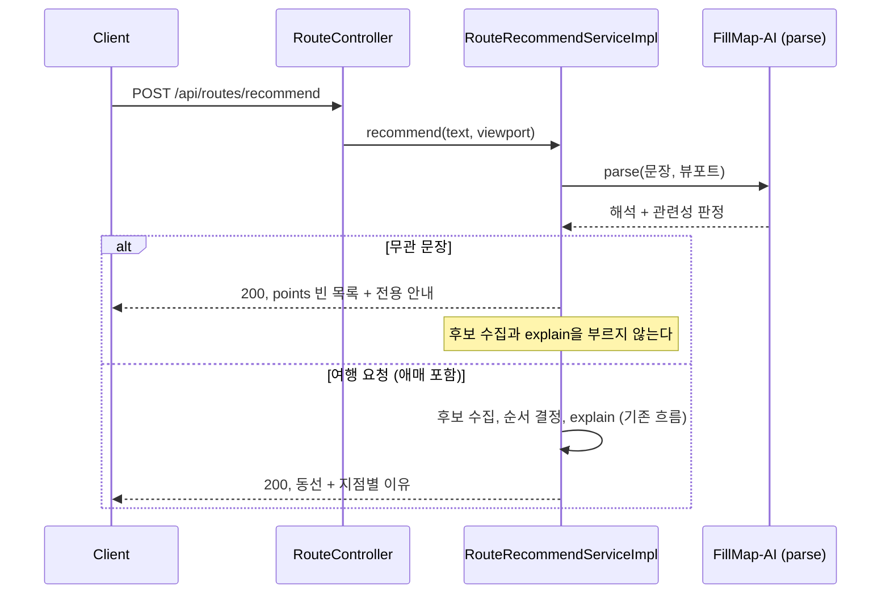
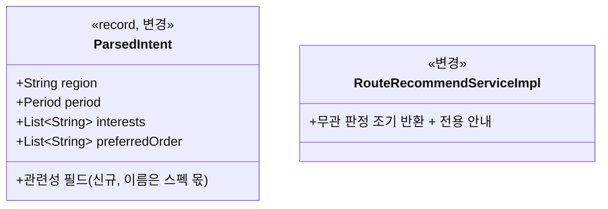

# PRD: 여행 요청이 아닌 문장에 동선이 나오지 않게 막는다

> 티켓: MSG-513 · 작성일: 2026-08-31 · 작성: prd-writer
> 상태: 검토됨 (2026-08-31 성민 승인, 미해결 4건 동시 확정)

## 1. 문제 상황

AI 경로 추천이 서비스와 상관없는 문장을 받아도 그럴싸한 동선을 돌려준다. "롤 정글 동선 짜 줘"를
넣어도 지도에 지점 여덟 개가 순서대로 찍히고 지점마다 추천 이유까지 붙는다.

원인은 구조에 있다. AI 해석 결과[^1]는 지역, 기간, 관심사, 방문 순서 네 필드가 전부라서 관련
없는 문장은 빈 해석[^2]으로 돌아오고, 서버는 빈 해석을 정상으로 규정한다(FR-ROUTE-06). 그래서
해석이 실패한 경우와 "이 근처 아무거나"를 서버가 구분하지 못한 채, 뷰포트[^3] 안의 미션과 행사를
거리순으로 여덟 개 채워 내보낸다. "이 요청은 우리가 답할 수 있는 종류가 아니다"라고 말할 자리가
지금 구조에는 아예 없다. 시연에서 아무 문장이나 넣어 보는 사람에게 가장 먼저 들키는 지점이고,
답이 성의 없어 보이는 인상도 여기서 시작된다.

## 2. 목적 · 목표

- **목적**: 범위 밖 요청을 알아보고 동선 대신 안내로 돌려줘서, 서비스가 무엇에 답하는 기능인지가
  응답에서 드러나게 한다.
- **목표**:
  - 장소 방문과 무관한 문장에는 지점 없는 응답과 전용 안내가 온다.
  - 지역만 적은 문장("부산")이나 관심사만 적은 문장("맛집"), 정보가 없는 여행 문장("이 근처
    아무거나")은 지금처럼 정상 추천이 나온다.
- **비목표(스코프 제외)**:
  - 서버 추정 방식은 쓰지 않는다. 빈 해석과 후보 수 조합으로 무관을 추정하는 안은 "볼 것이 없는
    지역"과 구분되지 않아 기각했다 (2026-08-31 성민 확정, 판정 위치는 AI).
  - 새 developCode[^4]를 만들지 않는다. 무관 판정은 요청이 성립한 뒤의 정상 응답이라 에러가
    아니다 (2026-08-31 성민 확정).
  - FR-ROUTE-06은 개정하지 않는다. 빈 해석은 여전히 유효한 해석이고, 관련성은 별도 축으로
    신규 등재한다 (2026-08-31 성민 확정).
  - 화면이 안내를 어디에 어떻게 표시할지는 이 PRD가 정하지 않는다. 경로추천 화면 디자인 자체가
    미확정이다 (미해결 질문 참조). 서버 몫 착수는 이것에 막히지 않는다.
  - 욕설이나 부적절 문장의 차단은 다루지 않는다. 이 기능은 관련성 판정이지 콘텐츠 검열이 아니다.

## 3. 기능 요구사항

| ID | 요구사항 | 우선순위 |
|----|----------|----------|
| FR-1 | 장소 방문 동선과 무관한 문장(게임 속 동선, 코드 작성 요청, 일반 잡담 등)으로 추천을 요청하면 지점 없는 결과와 왜 동선이 없는지 알리는 전용 안내가 온다. 후보 없음 안내(FR-ROUTE-07)와 문구가 다르다 | Must |
| FR-2 | 지역만 적은 문장, 관심사만 적은 문장, 정보가 없는 여행 문장("이 근처 아무거나")은 무관으로 처리되지 않고 지금처럼 화면 범위 기준 추천이 나온다 (FR-ROUTE-06 유지) | Must |
| FR-3 | 여행 요청인지 애매한 문장은 추천을 시도한다. 안내로 돌리는 것은 확실히 무관한 문장뿐이다. 여행 요청을 잘못 거부하는 것이 무관 문장에 추천이 나가는 것보다 나쁘다 | Must |
| FR-4 | 관련성 판정은 AI 해석 계약에 실려 오고, 서버는 그 값을 소비만 한다. 판정을 포함한 해석이 실패하거나 정해진 형태를 벗어나면 기존 규칙(FR-ROUTE-08) 그대로 실패를 알린다 | Must |
| FR-5 | 무관 안내로 끝나는 요청도 요청 제한(FR-ROUTE-12)을 소모한다. 외부 호출이 실제로 나가기 때문이다 | Must |

FR-1, FR-3, FR-4, FR-5는 SRS `FR-ROUTE-19`로 등재됐다(2026-08-31, 상태 계획). FR-2는 기존
`FR-ROUTE-06`의 유지 확인이라 신규 등재가 없다.

## 4. 비기능 요구사항

| 분류 | 요구사항 |
|------|----------|
| 보안/인가 | 문장 안에 숨긴 지시가 관련성 판정을 뒤집어도 후보 선정에는 영향을 주지 못한다(NFR-SEC-08 유지, FR-ROUTE-03이 후보를 서버 데이터로 한정). 관련성 값도 형태 검증 대상이다 |
| 운영 | 무관 판정으로 끝난 요청이 지표 로그에 별도 결과값으로 남아 빈도를 실측할 수 있다. 무관 판정 처리로 한 번의 실행에 나가는 외부 AI 호출 수는 늘지 않는다 |

## 5. 시퀀스 다이어그램

## 6. 클래스 다이어그램

## 7. 변경 파일 목록

| 파일 | 변경 | Owner |
|------|------|-------|
| `FillMap-AI/route_ai.py` (별도 레포) | 수정: 해석 출력에 관련성 필드 추가(구조화 출력 스키마[^5]와 프롬프트, 검증). 티켓 분리 | - |
| `src/main/java/com/msg/fillmap/route/service/RouteIntentClient.java` | 수정: ParsedIntent 관련성 필드, 응답 형태 검증 | B |
| `src/main/java/com/msg/fillmap/route/service/RouteRecommendServiceImpl.java` | 수정: 무관 판정 조기 반환, 전용 안내 문구, 지표 결과값 | B |
| `src/test/java/com/msg/fillmap/route/service/RouteIntentClientTest.java` | 수정: 관련성 필드 파싱과 형태 위반 테스트 | B |
| `src/test/java/com/msg/fillmap/route/service/RouteRecommendServiceTest.java` | 수정: 무관 안내와 경계 사례 테스트 | B |

Flyway 마이그레이션과 신규 테이블은 없다. 저장하는 것이 없다.

## 8. 미해결 질문

- [ ] **화면 안내 표시 위치.** 결과 부족 배너와 같은 자리인지 별도 상태인지는 디자인 확인이
  필요한데, 경로추천 화면(웹 노드 `14599:4415`)은 AI 입력 패널 자체가 아직 없는 미확정 상태다
  (2026-08-31 실측, MSG-457 PRD가 기록한 "디자인 변경 선행 필요" 그대로). FE 몫이라 서버 착수는
  막지 않는다.
- [ ] **화면의 무관 상태 기계 구분.** 지금 계약으로 화면이 무관 안내와 후보 없음 안내를 구분할
  재료는 안내 문구뿐이다. 디자인이 두 상태를 다르게 그리기로 확정되면 응답에 구분 신호 추가가
  필요해진다 (계약 추가라 그때 논의).
- [ ] **FillMap-AI 쪽 티켓 번호.** 계약 개정은 별도 티켓으로 분리한다 (완료 조건 명시 사항).

[^1]: AI 서버(FillMap-AI)가 사용자 문장을 구조화한 결과. 지역, 기간, 관심사, 방문 순서 힌트
    네 필드로 온다 (MSG-458 계약).
[^2]: 문장에서 아무 정보도 못 읽었을 때의 해석 결과. 지역은 null, 관심사는 빈 배열이 된다.
    지금은 정상 응답으로 취급하고, 이 PRD 이후에도 그 지위는 바뀌지 않는다.
[^3]: 사용자가 지금 지도에서 보고 있는 사각형 범위. 추천 후보는 이 안에서만 찾는다.
[^4]: 응답 본문에 싣는 앱 내부 코드. 경로 추천 도메인은 14xxx 대역을 쓴다.
[^5]: OpenAI 구조화 출력(json_schema strict). 정의 밖 필드를 모델이 내보낼 수 없게 API 수준에서
    강제하므로, 필드 추가는 스키마와 서버 검증 양쪽의 동시 개정이다.
