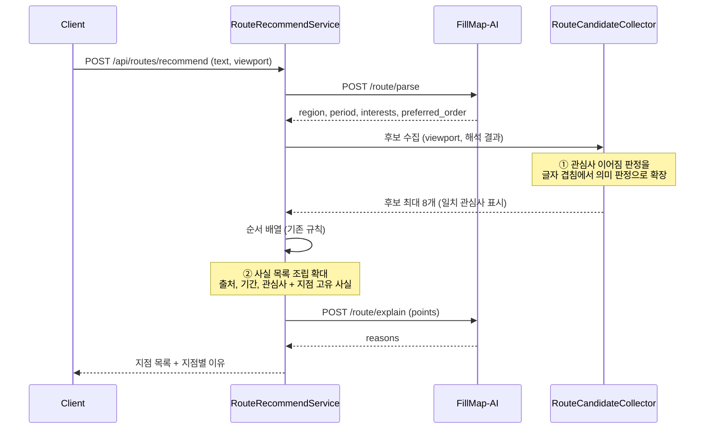
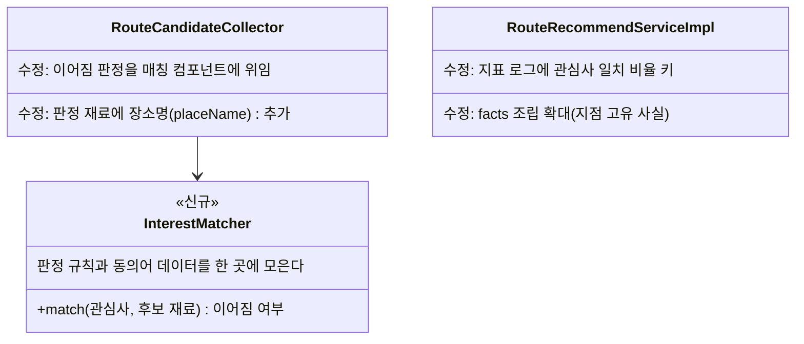

# PRD: AI 경로 추천의 관심사 반영과 추천 이유 개선

> 티켓: MSG-514 · 작성일: 2026-08-31 · 작성: prd-writer
> 상태: 검토됨 (2026-08-31 성민 승인)

## 1. 문제 상황

같은 지도 화면에서 문장만 바꿔 요청해도 거의 같은 지점 여덟 개가 거의 같은 이유와 함께 돌아온다.

원인은 두 가지다. 첫째로 관심사[^1] 반영이 글자 겹침 판정 하나뿐이다. "맛집"이라고 적어도 미션
제목이나 소개문에 그 두 글자가 그대로 없으면 반영되지 않고, 그때 선정 기준은 화면 중심에서
가까운 순서로 내려앉는다. 화면이 같으면 문장이 달라도 같은 결과가 나오는 이유가 이것이다.
둘째로 추천 이유를 만드는 재료가 빈약하다. 이유를 쓰는 AI는 지점마다 사실 목록[^2]을 다섯
칸까지 받을 수 있는데 서버는 세 칸만 채우고, 그중 두 칸은 출처("축제 미션 후보")와 기간이라
요청이 달라도 내용이 바뀌지 않는다. 그래서 어떤 요청에 붙여도 말이 되는 일반론이 나오고, 읽는
사람은 자기 말을 안 들은 답이라고 느낀다.

추천 이유가 이 기능의 인상을 만든다고 보고 외부 왕복을 두 번으로 유지했는데(MSG-457 PRD 확정),
지금은 그 비용만큼의 값을 내지 못하고 있다.

## 2. 목적 · 목표

- **목적**: 사용자가 적은 문장이 지점 선정과 추천 이유에 실제로 반영되게 해서, 자연어로
  요청받는 이 기능의 존재 이유를 살린다.
- **목표**:
  - 같은 화면에서 관심사가 다른 문장 두 개를 보내면 지점 구성이나 순서가 달라진다. 테스트로 고정한다.
  - 관심사 일치가 붙은 후보의 비율을 지표 로그로 잴 수 있게 되고, 개선 전보다 오른다.
  - 지점마다 추천 이유가 그 지점 고유의 사실을 담는다. 여덟 지점의 이유가 출처 문구만 다른
    복제가 되지 않는다.
- **비목표(스코프 제외)**:
  - 여행과 무관한 문장을 알아보고 거부하는 일. MSG-513이 다룬다.
  - 동선의 총 이동 거리와 시간 제약. MSG-515가 다룬다.
  - FillMap-AI 계약 변경. 해석과 이유 문장화의 요청·응답 형태는 그대로 두고, AI 서버 배포 없이
    이 서버 안에서 끝낸다.
  - 사용자 원문을 이유 문장화에 통째로 넘기는 방식. "받은 사실만 쓴다"는 환각[^3] 방어를 스스로
    푸는 셈이라 하지 않는다.
  - 사용자 이력 기반 개인화, 추천 결과 저장.

## 3. 기능 요구사항

| ID | 요구사항 | 우선순위 |
|----|----------|----------|
| FR-1 | 사용자가 적은 관심사는 표기가 달라도 뜻이 통하면 후보와 이어진다. "맛집"이라고 적으면 이름과 소개에 그 글자가 없는 음식점 장소 후보와도 이어진다 | Must |
| FR-2 | 이어짐 판정의 재료는 서버가 가진 값(제목, 소개문, 장소명, 미션 유형, 장소 검색 결과)뿐이다. 판정이 넓어져도 서버가 확인하지 않은 장소는 후보가 되지 않는다 | Must |
| FR-3 | 관심사와 이어진 후보는 이어지지 않은 후보보다 먼저 뽑힌다. 관심사를 안 적으면 지금처럼 화면 범위 기준으로 뽑힌다 | Must |
| FR-4 | 같은 화면에서 관심사가 다른 두 문장을 보내면, 각 관심사에 맞는 후보가 화면 안에 실제로 있는 한 두 결과의 지점 구성이나 순서가 달라진다 | Must |
| FR-5 | 뜻이 통하지 않는 후보에 관심사가 억지로 이어지지 않는다. "맛집"을 적었는데 음식과 무관한 해안 산책 코스가 관심사 일치로 표시되면 잘못이다 | Must |
| FR-6 | 지점의 추천 이유에는 출처와 기간 말고도 그 지점 고유의 사실이 실린다. 코스는 길이와 걸리는 시간과 난이도, 축제와 팝업은 장소나 소개가 재료가 된다 | Must |
| FR-7 | 관심사가 이어진 지점의 이유에는 어떤 관심사와 이어졌는지가 나타난다 | Must |
| FR-8 | 관심사가 반영된 정도(일치가 붙은 후보 비율)를 지표 로그로 남겨 개선 전후를 비교할 수 있다 | Should |

SRS 연결: FR-2는 FR-ROUTE-03의 유지 확인이고, FR-3은 FR-ROUTE-06의 유지 확인이다. FR-1과
FR-4~7은 신규 요구라 승인 후 srs-writer로 등재해 ID를 받는다. FR-6은 FR-ROUTE-05("지점마다 왜
추천됐는지 한 줄 설명")의 상세화이자 개정 후보다.

엣지 케이스: 관심사가 있는데 어떤 후보와도 이어지지 않으면 지금처럼 그 관심사로 장소 검색을
한 번 시도하고, 그래도 없으면 화면 범위 기준 추천으로 내려간다(FR-ROUTE-06, FR-ROUTE-07 유지).
빈 해석(관심사 없음)의 동작은 바뀌지 않는다.

## 4. 비기능 요구사항

| 분류 | 요구사항 |
|------|----------|
| 성능 | 한 번의 추천이 부르는 외부 호출 수는 지금과 같다. 해석 한 번, 이유 문장화 한 번, 장소 검색 최대 한 번이다. 이어짐 판정과 사실 목록 조립은 서버 안 계산이라 응답 시간 설계 예산(25초, MSG-457 상한 확정 절)에 보태는 시간이 사실상 없어야 한다 |
| 결정성[^4] | 같은 해석 결과와 같은 후보면 이어짐 판정도 같다(FR-ROUTE-10 유지). 판정에 난수나 호출 시점이 끼지 않는다 |
| 보안 | AI로 나가는 사실 목록은 기존 계약 상한(지점당 다섯 건, 각 100자) 안이다. 관심사는 판정과 검색어 재료일 뿐 후보를 직접 만들지 못한다(NFR-SEC-08 유지) |
| 운영 | FillMap-AI 배포가 필요 없다. 동의어 데이터를 두는 방식에 따라 마이그레이션 유무가 갈리고, 그 선택은 스펙 몫이다 |

## 5. 시퀀스 다이어그램

변경 지점은 두 곳이다. 후보 수집의 이어짐 판정(①)과 이유 문장화 입력의 조립(②). 나머지 흐름은
MSG-457 그대로다.

## 6. 클래스 다이어그램

컴포넌트 이름과 데이터를 두는 자리(리소스 파일, 코드 상수)는 스펙에서 정한다. 여기서는 판정
규칙이 한 곳에 모인다는 구조만 확정한다.

## 7. 변경 파일 목록

route 패키지는 Owner 공동에 주 구현 B다(MSG-457 Owner 판정).

| 파일 | 변경 | Owner |
|------|------|-------|
| `src/main/java/com/msg/fillmap/route/service/RouteCandidateCollector.java` | 수정: 이어짐 판정 위임, 재료에 placeName 추가 | B |
| `src/main/java/com/msg/fillmap/route/service/RouteRecommendServiceImpl.java` | 수정: facts 조립 확대, 지표 로그 키 추가 | B |
| `src/main/java/com/msg/fillmap/route/service/` 매칭 컴포넌트 | 신규: 이어짐 판정 한 곳 | B |
| 동의어 데이터 (자리 미정: `src/main/resources/` 또는 코드 상수) | 신규 | B |
| `src/test/java/com/msg/fillmap/route/service/` 테스트 4종 | 갱신·신규: FR-4 고정 테스트 포함 | B |

계약 인터페이스(GridQueryService, ZoneNameQueryService, PlaceSearchService)와 Flyway는 변경이
없을 것으로 본다. 동의어 데이터를 DB에 두기로 하면 마이그레이션이 생기는데, 그 결정은 스펙에서
한다.

## 8. 미해결 질문

- [ ] **이어짐 판정 방식.** 동의어·카테고리 사전(서버 안 계산)이 우선 후보다. 임베딩[^5]은 외부
      호출이 늘고 결정성 재계산이 따라와 이번 비기능 요구(외부 호출 불변)와 부딪힌다. 스펙에서
      확정하되, 사전 방식으로 부족하다는 실측이 나오기 전까지 임베딩은 꺼내지 않는 쪽을 권한다.
- [ ] **동의어 데이터의 관리 주체와 갱신 방법.** 누가 항목을 늘리고, 갱신에 배포가 필요한 구조로
      둘지. 초기 항목 수와 커버리지 기준도 스펙에서 정한다.
- [ ] **사실 목록 다섯 칸의 우선순위.** 출처, 기간, 관심사에 지점 고유 사실을 더하면 칸이 모자랄
      수 있다. 무엇을 먼저 싣고 무엇을 미루는지 순서를 스펙에서 정한다.
- [ ] **방문 순서 힌트(preferred_order)에도 같은 확장을 적용할지.** 지금은 이름 부분 일치다.
      관심사와 성질이 같아 함께 고치는 것이 자연스럽지만 범위가 늘어난다.
- [ ] **지표 기준선.** 현재 관심사 일치 비율의 실측값이 없다. 개선 전 dev에서 기준선을 먼저 재고
      들어갈지, 배포 후 로그로 소급 비교할지.

[^1]: 관심사: 사용자 문장에서 AI가 뽑아낸 하고 싶은 일의 목록. "맛집", "야경" 같은 짧은 말이 배열로 온다.
[^2]: 사실 목록(facts): 이유 문장화 요청에 지점마다 실어 보내는 사실 문장들. AI는 이 목록에 적힌 것만으로 이유를 쓴다.
[^3]: 환각: AI가 받은 재료에 없는 내용을 사실처럼 지어내는 현상. 이 기능은 "받은 사실만 쓴다"는 규칙으로 막고 있다.
[^4]: 결정성: 같은 입력에 항상 같은 출력이 나오는 성질. 짧은 간격의 재요청에서 결과가 흔들리지 않아야 한다는 요구(FR-ROUTE-10)가 걸려 있다.
[^5]: 임베딩: 문장이나 단어를 숫자 벡터로 바꿔 뜻이 가까운 정도를 계산하는 기법. 모델 호출이 필요해 외부 의존이 생긴다.
