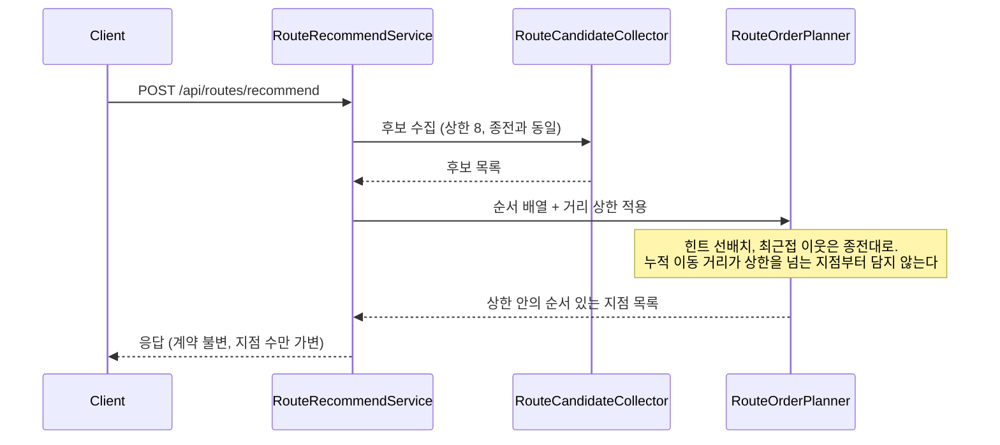

# PRD: 경로 추천 거리 제약 (하루에 다닐 수 있는 동선)

> 티켓: MSG-515 · 작성일: 2026-08-31 · 작성: prd-writer
> 상태: 검토됨 (2026-08-31 성민 승인, 미해결 4건 동시 확정)

## 1. 문제 상황

경로 추천(MSG-457)은 화면 안 후보를 지점 여덟 개까지 골라 가까운 순으로 잇기만 한다. 지점 수
상한(8)은 있지만 총 이동 거리를 보지 않아서, 화면을 넓게 잡으면 지점 사이가 몇 km씩 떨어져
있어도 그대로 여덟 개가 채워진다. 요구사항 FR-ROUTE-13은 "하루에 다닐 수 없는 분량을 돌려주지
않는다"인데, 현재 구현은 그 절반(지점 수)만 지키고 총량은 지키지 못한다. 순서를 정하는 최근접
이웃[^1] 방식은 다음 지점이 얼마나 멀든 개의치 않기 때문에, 카드에 적히는 실제 보행
거리(MSG-483)와 추천된 순서가 서로를 설명하지 못하는 결과가 된다.

## 2. 목적 · 목표

- **목적**: 추천 동선이 실제로 하루에 소화할 수 있는 묶음이 되게 한다. FR-ROUTE-13의 취지
  가운데 구현되지 않은 총량 제약을 채우는 작업이다.
- **목표**:
  - 어떤 화면 크기로 요청해도 추천 동선의 총 이동 거리가 상한을 넘지 않는다.
  - 볼 것이 몰려 있는 화면에서는 종전과 같은 결과가 나온다. 제약은 넓은 화면에서만 지점을 줄인다.
- **비목표(스코프 제외)**:
  - **시간대 고려는 이번 범위에서 뺀다.** 티켓이 "운영 시간 정보가 있는지 확인이 선행되고
    없으면 뺀다"고 정했고, 확인 결과가 그렇다. 축제 시드에는 구조화된 시각 필드가 없고
    (description 자연어에만 간헐적으로 등장), 팝업만 `operationTime`을 전건(2,804건) 갖지만
    "월-목 10:30 ~ 20:00 / 금-일 10:30 ~ 20:30" 같은 자유 문자열이라 기계 판정에는 별도
    파서가 필요하다. 코스는 무기간 상시다. 세 유형 중 하나만 반쪽 구조화된 상태로 "밤에만
    여는 곳" 판정을 넣으면 유형별로 기준이 달라져 오히려 결과를 설명하기 어려워진다.
  - **순서 결정과 제약 판정에 외부 보행 경로 호출을 추가하지 않는다.** FR-ROUTE-16이
    2026-08-26에 확정한 대로 순서는 직선거리 기준이다. TMap 보행자 경로[^2]의 하루 무료
    한도(900건)로는 추천마다 구간별 호출을 감당할 수 없고, 응답 시간 설계 예산 25초의 전제
    (외부 호출은 AI 두 번에 장소 검색 최대 한 번)도 깨진다. 이번 티켓은 이 확정을 유지한다.
  - **시간 모델(총 소요 시간 상한, 지점당 체류 시간 기본값)은 도입하지 않는다**(2026-08-31
    성민 확정). 지점 유형별 체류 시간을 정할 실측 근거가 없고, 이동 시간은 거리 상한이 보속
    전제(시속 4km)로 이미 흡수한다. 거리 하나로 제약하면 검증도 설명도 단순해진다.
  - **제약으로 지점이 줄어도 별도 안내(notice)를 띄우지 않는다**(2026-08-31 성민 확정).
    다닐 수 있는 묶음 자체가 정상 결과라서 부족 안내(FR-ROUTE-07)와 성격이 다르다.
  - **지점 수 상한 8은 유지한다**(2026-08-31 성민 확정). 거리 상한이 실질 제약이 되면 8은
    몰린 화면에서의 최대 밀도로만 남는다.
  - 결과 저장, FE 화면 변경(응답 계약이 그대로라 화면 몫 없음).

## 3. 기능 요구사항

| ID | 요구사항 | 우선순위 |
|----|----------|----------|
| FR-1 | 추천 동선의 총 이동 거리(지점을 방문 순서대로 이었을 때의 합)에 상한이 있다. 상한은 도보 환산 10km다(2026-08-31 성민 확정). 상한을 넘는 동선은 반환되지 않는다 | Must |
| FR-2 | 총 이동 거리가 상한을 넘게 되면 지점 수를 줄인다. 여덟 개를 채우는 것보다 다닐 수 있는 묶음이 우선이다. 줄어든 결과도 정상 응답이고 응답 계약은 바뀌지 않는다(FR-ROUTE-07의 가변 길이 계약 그대로) | Must |
| FR-3 | 후보가 몰려 있어 전부 담아도 상한 안이면 지점이 줄어들지 않는다. 제약 도입 전과 같은 지점 구성과 순서가 나온다 | Must |
| FR-4 | 상한 판정에 쓰는 거리는 실제 걷는 거리를 근사한다. 직선거리[^3]를 그대로 쓰면 실보행 거리보다 짧게 재서 상한이 이름값을 못 하므로, 보정 없이 직선거리 합을 상한과 비교하지 않는다 | Must |
| FR-5 | 같은 해석 결과와 같은 후보면 같은 지점 구성과 순서가 나온다(FR-ROUTE-10 유지). 제약 판정에 난수나 시각 의존을 넣지 않는다 | Must |
| FR-6 | 출발지가 반영된 추천(FR-ROUTE-11)이면 출발지에서 첫 지점까지 거리도 총 이동 거리에 든다 | Must |

## 4. 비기능 요구사항

| 분류 | 요구사항 |
|------|----------|
| 성능 | 외부 호출 수 불변(AI 두 번, 장소 검색 최대 한 번). 제약 판정은 서버 안 산술로만 하고, 응답 시간 설계 예산 25초의 전제를 바꾸지 않는다 |
| 데이터 정합 | Flyway 마이그레이션 없음. 신규 테이블·컬럼 없음 |
| 운영 | 지표 로그 한 줄에 제약으로 줄어든 지점 수가 남아, 상한 값이 실사용에서 얼마나 발동하는지 실측할 수 있다 |

## 5. 시퀀스 다이어그램

## 6. 클래스 다이어그램

신규 타입 없음. `RouteOrderPlanner`의 순서 배열이 거리 예산을 함께 보도록 바뀌는 것이
구조 변경의 전부라 생략한다.

## 7. 변경 파일 목록

| 파일 | 변경 | Owner |
|------|------|-------|
| `src/main/java/com/msg/fillmap/route/service/RouteOrderPlanner.java` | 수정 (순서 배열에 누적 거리 상한 적용) | B |
| `src/main/java/com/msg/fillmap/route/service/RouteRecommendServiceImpl.java` | 수정 (상한 전달, 지표 로그에 축소 지점 수) | B |
| `src/test/java/com/msg/fillmap/route/service/RouteOrderPlannerTest.java` | 수정 (넓은 화면 상한 준수, 몰린 화면 무축소 시나리오) | B |
| `src/test/java/com/msg/fillmap/route/service/RouteRecommendServiceTest.java` | 수정 (통합 경로 검증) | B |

`RouteCandidateCollector`는 후보 선별(상한 8)이 종전과 같으면 수정이 없을 수 있다.
확정은 스펙 몫이다.

## 8. 미해결 질문

없음. 초안의 4건(거리 상한 값, 시간 모델 도입 여부, 축소 안내 여부, 지점 수 상한 유지)은
2026-08-31 성민이 전부 확정해 본문에 반영했다. 총 이동 거리 상한의 판정 보정 방식(직선거리에
도보 우회 계수를 곱하는 등)만 스펙에서 정한다.

[^1]: 최근접 이웃(nearest neighbor). 지금 위치에서 가장 가까운 다음 지점을 계속 골라 잇는 순서 정하기 방식. 전체를 놓고 최선의 순서를 찾지는 않는다.
[^2]: TMap 보행자 경로안내. 두 지점 사이를 실제 보행로로 이은 좌표열과 거리를 주는 외부 API. MSG-483이 지도의 연결선과 카드 거리에 쓰고, 하루 무료 한도는 900건이다.
[^3]: 하버사인(haversine) 거리. 지구를 구로 보고 두 지점 사이를 재는 직선 거리. 실제 걷는 길보다 짧게 나온다.
[^4]: 도보 우회 계수(detour factor). 직선거리 대비 실제 보행 거리의 비율. 도시 보행 연구에서 통상 1.2에서 1.4 사이로 잰다.
