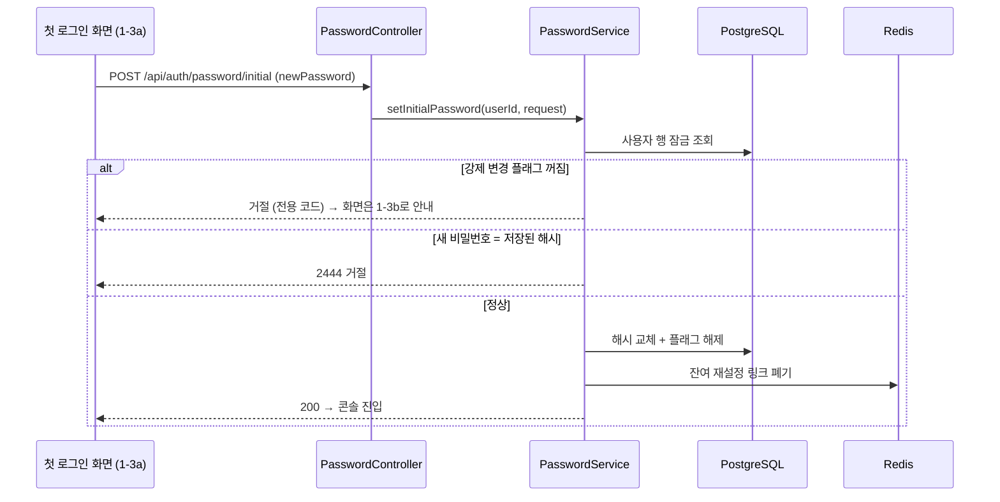

# PRD: 행사 운영자 첫 로그인 비밀번호 설정 API

> 티켓: MSG-537 · 작성일: 2026-09-01 · 작성: prd-writer
> 상태: 검토됨 (2026-09-01 사용자 승인)  <!-- 수명주기: 초안 → 검토됨(사용자 승인 시 게이트가 갱신) → 확정. 생성 시엔 항상 '초안' 단일값 -->

## 1. 문제 상황

행사 운영자[^1]가 처음 로그인하면 비밀번호 설정 화면이 뜨는데, 지금 서버에는 이 화면이 부를 API가 없다.
웹 시안 1-3a("첫 로그인 · 비밀번호 설정 (강제)", 피그마 노드 `15836:357`)는 새 비밀번호와 확인 입력
두 칸만 두고 현재 비밀번호를 받지 않는다. 그런데 기존 비밀번호 변경 API(`POST /api/auth/password/change`,
MSG-497)는 현재 비밀번호가 필수 입력이라 이 화면에서는 호출 자체가 안 된다.

화면을 살리려면 프런트가 로그인 때 쓴 초기 비밀번호를 몰래 보관했다가 채워 보내야 하는데, 이는
비밀번호를 클라이언트 저장소에 남기는 일이라 이 기능이 막으려는 것과 정반대다. 남은 길은 시안을
버리고 첫 로그인에도 현재 비밀번호 입력을 요구하는 것뿐이었다.

## 2. 목적 · 목표

- **목적**: 첫 로그인 화면(시안 1-3a)이 서버 계약과 맞아떨어지게 한다. 초기 비밀번호 상태에서만
  통하는 설정 전용 API를 하나 추가한다.
- **목표**:
  - 행사 운영자가 첫 로그인 직후 새 비밀번호만 입력해 설정을 마치고 콘솔에 진입할 수 있다.
  - 이미 설정을 마친 계정은 이 API를 다시 쓸 수 없다.
- **비목표(스코프 제외)**:
  - 기존 변경(`change`) 계약 수정 없음. 재변경 화면(시안 1-3b)은 기존 API를 그대로 쓴다.
  - 재설정 2종(`reset-request`, `reset`) 수정 없음.
  - 비밀번호 정책 변경 없음. 서버 현행(영문과 숫자 각 1자 이상, 8~64자)을 유지하고, 시안의 강도
    문구("영문·숫자·기호 중 3종 이상, 10자 이상")는 디자인 쪽에서 수정한다(2026-09-01 결정).
  - 강도 미터 계산은 화면 표시용이라 서버 계약이 아니다.

## 3. 기능 요구사항

SRS 대조: 첫 로그인 강제 변경 자체는 FR-AUTH-15(구현됨)가 이미 정본이다. 이 PRD는 그 요구를
"현재 비밀번호 없이 설정한다"로 상세화하는 신규 요구라, 작성 후 srs-writer로 등재해 ID를 받는다.

| ID | 요구사항 | 우선순위 |
|----|----------|----------|
| FR-1 | 초기 비밀번호 상태(강제 변경 플래그가 켜진 계정)의 로그인 사용자는 현재 비밀번호 입력 없이 새 비밀번호 하나로 비밀번호를 설정할 수 있다 | Must |
| FR-2 | 설정에 성공하면 기존 변경과 같은 효과가 난다. 강제 변경 플래그가 풀려 콘솔 접근 차단이 즉시 해제되고, 남아 있던 재설정 링크는 폐기되며, 현재 로그인 세션은 유지된다 | Must |
| FR-3 | 강제 변경 플래그가 꺼진 계정(이미 설정을 마쳤거나 애초에 대상이 아닌 계정)의 요청은 거절된다. 이때 화면이 재변경 화면(1-3b)으로 안내할 수 있게 전용 오류 코드로 응답한다 | Must |
| FR-4 | 새 비밀번호가 저장된 비밀번호(초기 비밀번호)와 같으면 거절된다. 발급자가 아는 값을 그대로 쓰면 강제 변경의 목적이 무산되기 때문이다 | Must |
| FR-5 | 비밀번호가 없는 소셜 계정의 요청은 기존 변경과 같은 오류(2445)로 거절된다 | Must |
| FR-6 | 새 비밀번호는 기존 변경·재설정과 같은 정책(영문과 숫자 각 1자 이상, 8~64자)으로 검증된다 | Must |

## 4. 비기능 요구사항

| 분류 | 요구사항 |
|------|----------|
| 보안/인가 | 로그인 필수(액세스 토큰). 첫 로그인 게이트 차단 경로(`/api/org/**`) 밖에 있어야 설정 자체가 가능하다. 현재 비밀번호 생략은 "이미 초기 비밀번호로 로그인에 성공한 사용자"라는 전제 위에서 수용한 결정이다(2026-09-01 사용자 확정) |
| 데이터 정합 | 비밀번호를 쓰는 다른 경로(초기 비밀번호 재발송, 변경, 재설정 확정)와 같은 행 잠금 계약을 따른다. 잠그지 않으면 재발송과의 경합에서 낡은 스냅숏이 최신 커밋을 덮는다(MSG-499에서 실측된 유실 시나리오) |
| 운영 | DB 마이그레이션 없음. 기존 컬럼(`password_must_change`)과 Redis 키만 쓴다 |

## 5. 시퀀스 다이어그램

## 6. 클래스 다이어그램

신규 타입은 요청 DTO 하나뿐이라 생략한다. 컨트롤러와 서비스는 기존 클래스에 메서드가 추가된다.

## 7. 변경 파일 목록

| 파일 | 변경 | Owner |
|------|------|-------|
| `auth/controller/PasswordController.java` | `POST /initial` 엔드포인트 추가 | B |
| `auth/service/PasswordService.java` | 설정 메서드 추가 (`changePassword`와 같은 잠금·후처리, 대조만 플래그 확인으로 교체) | B |
| `auth/dto/PasswordInitialRequestDto.java` | 신규 (newPassword 하나, 기존 정책 어노테이션 재사용) | B |
| `auth/exception/AuthErrorCode.java` | 플래그 꺼짐 거절 코드 추가 (2446 후보) | B |
| `global/config/SecurityConfig.java` | `/api/auth/password/initial` authenticated 등록 | B |
| `auth/controller/PasswordControllerTest.java` | 신규 API 테스트 추가 | B |

## 8. 미해결 질문

- [x] 2441 메시지를 시안 뱃지에 맞춰 "초기 비밀번호를 설정해야 이용할 수 있습니다"로 교체한다. 코드값 불변, 이 티켓에 포함 (2026-09-01 승인 시 기본안 채택).
- [x] 시안의 비밀번호 강도 문구 수정은 디자인 레인 전달 사항으로 확정. 서버 범위 아님 (2026-09-01).

[^1]: 행사 운영자: 행사를 등재하는 외부 주체(지자체·팝업 운영사 등). 관리자가 발급한 이메일·비밀번호 계정으로 로그인한다. 필맵 내부 인력을 가리키는 맨 "운영자"와 다르다.
