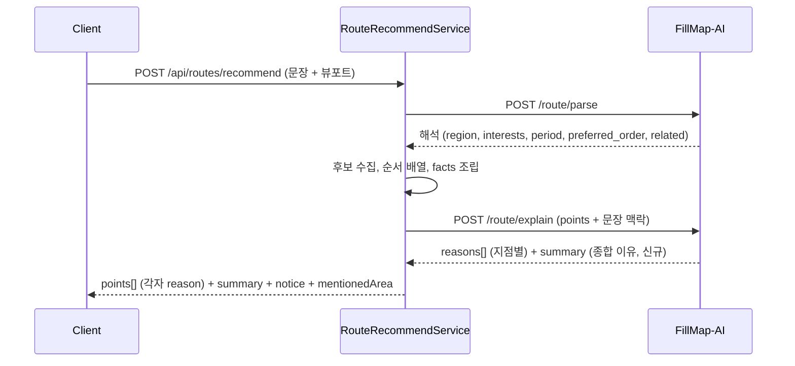

# PRD: 경로 추천 종합 이유

> 티켓: MSG-539 · 작성일: 2026-09-01 · 작성: prd-writer
> 상태: 검토됨 (2026-09-01 성민 승인)

## 1. 문제 상황

AI 경로 추천은 지점마다 "왜 이 지점인가"를 한 줄로 설명한다(FR-ROUTE-05). 그런데 사용자가 적은
문장 전체에 대한 답, 그러니까 "내가 이렇게 적었는데 왜 이 조합과 이 동선이 나왔는가"를 설명하는
자리는 없다. 지점별 이유는 각 지점의 고유 사실을 담을 뿐이라, 문장의 조건(지역, 관심사, 기간,
순서 희망)과 동선 전체의 구성이 어떻게 이어졌는지는 사용자가 지점 이유들을 읽고 스스로 재구성해야
한다. 추천을 받아든 첫 화면에서 "이 동선이 내 요청을 이해한 결과"라는 신뢰를 주지 못한다.

## 2. 목적 · 목표

- **목적**: 추천 결과 상단에서 사용자가 적은 문장과 이번 동선의 연결을 한눈에 설명해, 추천이
  요청을 이해한 결과임을 보여준다.
- **목표**: 추천 응답에 동선 전체의 종합 추천 이유가 실리고, 클라이언트가 그 문장을 그대로
  표시할 수 있다.
- **비목표(스코프 제외)**:
  - 지점별 이유(FR-ROUTE-05)의 변경. 지점별 이유는 그대로 두고 종합 이유를 더한다.
  - 화면 표시 방식의 확정. 서버는 문장을 실어 보내고 표시는 FE 몫이다(MSG-513 무관 안내와 같은 분담).
  - 추가 AI 호출의 도입. 기존 이유 문장화[^1] 호출 하나에 얹는다.
  - 추천 결과 자체(지점 선정, 순서)의 변경. 이 기능은 설명만 더한다.

## 3. 기능 요구사항

SRS 등재: 이 기능은 FR-ROUTE-20으로 등재됐다(2026-09-01, 상태 계획). 아래 FR-1~5가 그 한 항목의 상세다.

| ID | 요구사항 | 우선순위 |
|----|----------|----------|
| FR-1 | 지점이 1개 이상 실리는 추천 응답에는 동선 전체의 종합 추천 이유가 함께 온다. 종합 이유는 사용자가 적은 문장을 근거로 이번 지점들이 왜 골라졌는지 설명한다 | Must |
| FR-2 | 문장에 지역, 관심사, 기간이 하나도 없어도(빈 해석[^2]) 종합 이유는 온다. 이때는 지금 보고 있는 화면 범위를 기준으로 골랐다는 설명이 된다(FR-ROUTE-06 유지) | Must |
| FR-3 | 종합 이유에는 이번 결과에 실린 지점과 사용자 문장에서 확인되는 내용만 담긴다. 결과에 없는 장소나 서버가 확인하지 않은 사실이 종합 이유에 등장하지 않는다(FR-ROUTE-03과 같은 원칙) | Must |
| FR-4 | 빈 목록 응답(후보 없음 FR-ROUTE-07, 무관 문장 FR-ROUTE-19, 도보 거리 절단으로 빈 동선 FR-ROUTE-13)에는 종합 이유가 없다. 그 자리는 기존 안내 문구(notice)가 맡는다 | Must |
| FR-5 | 종합 이유가 정해진 형태를 벗어나면 채택하지 않는다(FR-ROUTE-08, NFR-SEC-08과 같은 원칙). 잘못 만들어진 설명을 그대로 내보내지 않는다 | Must |

## 4. 비기능 요구사항

| 분류 | 요구사항 |
|------|----------|
| 성능 | 외부 AI 호출 수 불변(자연어 해석[^3] 1회, 이유 문장화 1회 그대로). 추가 지연은 이유 문장화 응답에 문장 하나가 늘어나는 수준이다 |
| 보안 | 이 기능으로 외부 모델에 새로 나가는 정보가 없어야 한다. 사용자 문장은 이미 해석 단계에서 같은 AI 서버로 나가고 있다(NFR-SEC-08 전제 유지) |
| 운영 | DB 변경 없음. FillMap-AI 계약 개정이 따라오므로 두 시스템의 배포 순서 조율이 필요하다(related 필드 선례 MSG-513/533) |

## 5. 시퀀스 다이어그램

## 6. 클래스 다이어그램

신규 타입 없음. `RouteRecommendResponseDto`에 종합 이유 필드 하나가 늘어나는 변경이라 생략한다.

## 7. 변경 파일 목록

| 파일 | 변경 | Owner |
|------|------|-------|
| `src/main/java/com/msg/fillmap/route/dto/RouteRecommendResponseDto.java` | 수정(종합 이유 필드 추가) | B |
| `src/main/java/com/msg/fillmap/route/service/RouteIntentClient.java` | 수정(explain 요청에 문장 맥락 동봉, 응답의 종합 이유 검증) | B |
| `src/main/java/com/msg/fillmap/route/service/RouteRecommendServiceImpl.java` | 수정(응답 조립에 종합 이유 연결) | B |
| `src/test/java/com/msg/fillmap/route/**` | 수정(계약, 조립, 빈 목록 분기 테스트) | B |
| FillMap-AI `route_ai.py`, `server.py`, `route_experiment.py`, `docs/MSG-458.md`, `README.md` | 별도 레포, 분리 티켓 MSG-540(explain 계약 개정) | AI |

## 8. 미해결 질문

- [ ] 화면 표시 위치와 방식(디자인 미확인). 서버는 문장만 실어 보내고 FE 티켓에서 확정한다.
- [ ] 이유 문장화 입력에 사용자 문장 원문을 실을지, 해석 결과(지역, 관심사, 기간, 순서 희망)만
      실을지. 원문 동봉이 유력하다(해석 결과만으로는 "문장에 대한" 설명이 재구성이 된다). 스펙 몫.
- [ ] 종합 이유의 길이 상한 값. 지점별 이유(1~120자)보다 여유를 둘지 스펙에서 정한다.
- [ ] 구계약 AI(종합 이유 없는 explain)와 신계약 서버가 섞이는 전환 구간의 처리와 배포 순서.
      related 선례(서버 한시 수용 후 필수 승격)를 참조해 스펙에서 정한다.
- [x] FillMap-AI 쪽 분리 티켓 번호: MSG-540 (2026-09-01 생성, BE 티켓은 MSG-539).

[^1]: 이유 문장화(explain): 서버가 정한 지점 목록과 지점별 사실(facts)을 AI 서버에 보내 사람이 읽는 이유 문장을 받아 오는 호출. 지점 선정은 서버가 하고 AI는 문장만 만든다.
[^2]: 빈 해석: 문장에서 지역, 관심사, 기간, 순서 희망이 하나도 안 나온 해석 결과. 실패가 아니라 화면 범위 기준 추천으로 이어지는 정상 경로다(FR-ROUTE-06).
[^3]: 자연어 해석(parse): 사용자가 적은 문장을 AI 서버가 구조화된 조건(지역, 관심사, 기간, 순서 희망, 관련성)으로 바꾸는 호출.
