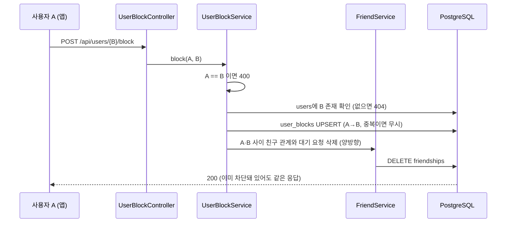
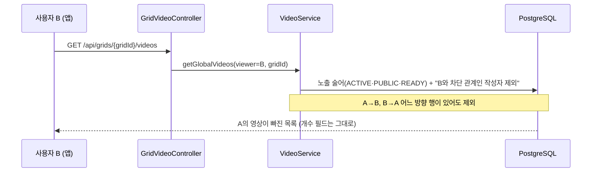
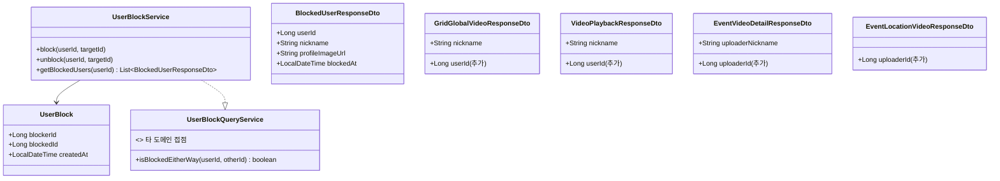

# PRD: 사용자 차단 (차단·해제·목록과 콘텐츠 상호 비노출)

> 티켓: MSG-569 (모바일 화면은 MSG-570, 에픽 MSG-174) · 작성일: 2026-09-08 · 작성: prd-writer
> 상태: 검토됨 (2026-09-08 사용자 승인, 미해결 질문 4건 전부 답변 반영)
> 관련 SRS: FRIEND 영역(FR-FRIEND-04, FR-FRIEND-13 번복) · MOD 영역(신규 등재 대상) · NFR-SEC-02, NFR-SEC-06

## 1. 문제 상황

FillMap은 회원이 올리는 영상과 댓글, 즉 사용자 생성 콘텐츠[^1]로 이루어진 서비스다. 애플 앱스토어
심사 지침 1.2는 이런 앱에 신고 수단과 함께 **다른 사용자를 차단하는 수단**을 요구하고, 둘 중
하나라도 없으면 반려한다. 구글 플레이의 사용자 생성 콘텐츠 정책도 같은 취지의 조항을 두고 있어
안드로이드 출시에도 걸릴 가능성이 크다.

지금 서버에는 영상 신고(`POST /api/videos/{videoId}/reports`, MSG-192)와 관리자 처리(MSG-195)만
있고 차단은 없다. 차단 티켓 MSG-194는 2026-08-06에 "MVP 범위 제외"로 종결됐고, 그 결정이 SRS
FR-FRIEND-13("차단은 도입하지 않는다")과 친구·신고 공유 PRD에 그대로 남아 있다. 스키마에는
`friendships.status`에 BLOCKED 값이 있지만 쓰는 코드가 없다.

또 하나의 구멍은 작성자 식별이다. 격자 영상 목록·재생·이벤트 영상 상세 응답은 작성자를 닉네임으로만
내려준다(MSG-371). 닉네임은 바뀔 수 있고 유일하지도 않아서, 앱이 "이 영상의 작성자를 차단"이라는
요청을 보낼 대상 식별자가 없다.

## 2. 목적 · 목표

- **목적**: 스토어 심사를 통과할 수 있도록 사용자가 다른 사용자를 차단하고, 차단한 뒤에는 서로의
  콘텐츠를 보지 않게 한다.
- **목표**:
  - 로그인 사용자가 다른 사용자를 차단·해제하고, 자기가 차단한 사용자 목록을 볼 수 있다
  - 차단 관계에 있는 두 사용자는 요청자를 아는 조회 경로[^2] 전부에서 서로의 영상과 댓글을 보지 못한다
  - 영상·댓글 응답에 작성자 식별자가 실려 앱이 차단 대상을 지정할 수 있다
  - 후속 MSG-570(앱 화면)이 이 API만으로 차단 흐름 3곳(⋯ 메뉴, 확인, 목록·해제)을 붙일 수 있다
- **비목표(스코프 제외)**:
  - 요청자를 받지 않는 전역 경로의 필터: 격자 대표 영상(`GET /api/grids/{gridId}/cover`), 탐색 집계
    (`/api/regions/explore`), 핫구역 집계, 격자·행사 위치의 영상 개수. MSG-194 리서치대로 시그니처와
    쿼리 9곳 이상이 바뀌어야 해서 심사에서 지적되면 후속으로 연다
  - 관리자 블랙리스트(서비스 아키텍처의 Moderation "블랙리스트"), 차단 사유 입력, 차단 사실 알림
  - 웹·모바일 화면(MSG-570과 별도 웹 티켓)
  - 차단당한 쪽에 차단 사실을 알려주는 어떤 응답도 만들지 않는다
  - 차단 관계에서 상대가 보내는 친구 요청을 막는 것(2026-09-08 사용자 결정으로 제외. 친구 관계 삭제(FR-5)는 티켓 요구라 유지)

## 3. 기능 요구사항

| ID | 요구사항 | 우선순위 |
|----|----------|----------|
| FR-1 | 로그인 사용자는 다른 사용자를 식별자로 지정해 차단할 수 있다. 자기 자신을 지정하면 400, 존재하지 않는 사용자면 404로 거부한다 | Must |
| FR-2 | 이미 차단한 사용자를 다시 차단해도 오류 없이 성공 응답이고 저장 결과는 한 건이다(멱등[^3]). 같은 요청이 동시에 두 번 들어와도 한 건만 남는다 | Must |
| FR-3 | 차단을 해제할 수 있다. 차단하지 않은 사용자를 해제해도 성공 응답이다(멱등) | Must |
| FR-4 | 내가 차단한 사용자 목록을 최신 차단 순으로 한 번에 전부 조회할 수 있다(페이지 없음, 친구 목록과 같은 방식). 항목은 사용자 식별자, 닉네임, 프로필 이미지 주소(없으면 null), 차단 시각이다 | Must |
| FR-5 | 차단하면 두 사람 사이의 친구 관계와 대기 중 친구 요청(어느 쪽이 보냈든)이 즉시 삭제된다. 해제해도 친구 관계는 되살아나지 않는다 | Must |
| FR-6 | 차단 관계(내가 차단했든 상대가 나를 차단했든)에 있는 사용자의 영상은 격자 전역 영상 목록(`GET /api/grids/{gridId}/videos`)과 미션 영상 목록(`GET /api/missions/{missionId}/videos`)에서 빠진다 | Must |
| FR-7 | 차단 관계에 있는 사용자의 영상을 재생 요청(`GET /api/videos/{videoId}`)하면 삭제된 영상과 같은 404 응답이고 재생 주소는 발급되지 않는다 | Must |
| FR-8 | 차단 관계에 있는 사용자의 행사 영상은 행사 위치 영상 목록에서 빠지고, 상세(`GET /api/event-videos/{videoId}`)는 노출 술어 밖 영상과 같은 404다. 그 사용자의 댓글은 댓글 목록에서 빠진다 | Must |
| FR-9 | 상호 비노출[^4]은 양방향이다. A가 B를 차단하면 A에게 B의 콘텐츠가 안 보이는 것과 똑같이 B에게도 A의 콘텐츠가 안 보인다. 적용 범위는 FR-6~8의 경로다. 차단 뒤 차단한 쪽이 상대의 친구 요청을 직접 수락해 다시 친구가 된 경우의 친구 전용 조회(친구 프로필, 친구 격자 영상)는 범위 밖이다 | Must |
| FR-10 | 차단은 신고에 영향을 주지 않는다. 차단한 사용자의 영상도 식별자를 알면 신고할 수 있다 | Must |
| FR-11 | 격자 전역 영상 목록, 영상 재생, 행사 위치 영상 목록, 행사 영상 상세 응답에 작성자 사용자 식별자를 추가한다. 기존 닉네임 필드는 그대로 둔다. 행사 영상 댓글 응답은 이미 `authorId`가 있어 변경하지 않는다 | Must |
| FR-12 | 차단 관계는 요청 시점에 실시간으로 판정한다. 해제 직후의 다음 요청부터 콘텐츠가 다시 보인다(친구 판정 FR-FRIEND와 같은 원칙, 캐시 없음) | Must |
| FR-13 | 사용자가 탈퇴하면 그 사용자가 걸었거나 당한 차단 행은 함께 사라진다 | Must |

## 4. 비기능 요구사항

| 분류 | 요구사항 |
|------|----------|
| 성능 | 차단 필터가 붙는 목록 조회 6종의 응답 시간이 기존 대비 눈에 띄게 늘지 않는다. 차단 행은 사용자당 수십 건 수준을 가정한다. 실측은 스펙 단계에서 실행 계획으로 확인한다 |
| 보안/인가 | 차단·해제·목록은 본인 토큰으로만 동작하고 요청자 식별은 토큰에서만 얻는다(NFR-SEC-02). 목록 경로는 `/api/users/me/blocks`처럼 대상 식별자를 경로에 두지 않는다 |
| 보안/은닉 | 차단당한 사용자가 차단 사실을 응답으로 알아낼 수 없다. 재생 404와 목록 누락은 기존 실패 응답과 같은 모양이다(NFR-SEC-06) |
| 데이터 정합 | 같은 두 사용자 사이의 같은 방향 차단은 한 행만 존재한다. 차단 저장은 `friendships`의 BLOCKED 상태가 아니라 별도 테이블로 한다. `friendships`는 "대칭 쌍 최대 1행" 유니크 인덱스(V19)[^5]가 있어 친구이면서 차단인 상태를 한 테이블로 담을 수 없다 |
| 데이터 정합 | 차단과 친구 관계 삭제는 한 트랜잭션 안에서 함께 반영된다. 차단만 남고 친구가 남는 중간 상태가 관측되지 않는다 |
| 데이터 정합 | 영상 개수 필드(격자·행사 위치)는 필터하지 않으므로 목록의 행 수보다 클 수 있다. MSG-390이 BLINDED 영상에서 같은 차이를 이미 허용했다 |
| 운영 | 신규 테이블 마이그레이션 1건. 기존 데이터 백필 없음. 롤백은 테이블 DROP으로 가능하고 다른 테이블을 바꾸지 않는다 |

## 5. 시퀀스 다이어그램

차단 요청과, 차단 뒤 격자 영상 목록에서 콘텐츠가 빠지는 흐름 두 가지.

## 6. 클래스 다이어그램

신규 타입과 기존 타입의 변경점.

## 7. 변경 파일 목록

전부 Owner B 도메인이다. 새 코드는 `user` 패키지 아래 두는 것을 전제로 적었다(경로가 `/api/users`
아래고 developCode 대역 1xxx를 그대로 쓴다). 별도 `block` 패키지로 뺄지는 스펙 몫이다.

| 파일 | 변경 | Owner |
|------|------|-------|
| `src/main/resources/db/migration/V53__user_blocks.sql` | 신규. `user_blocks(blocker_id, blocked_id, created_at)`, 복합 유니크, 양쪽 FK ON DELETE CASCADE, 피차단자 기준 역조회 인덱스 | - |
| `src/main/java/com/msg/fillmap/user/entity/UserBlock.java` | 신규 | B |
| `src/main/java/com/msg/fillmap/user/repository/UserBlockRepository.java` | 신규. 멱등 저장, 삭제, 목록, 양방향 존재 판정 | B |
| `src/main/java/com/msg/fillmap/user/service/UserBlockService.java` (+Impl) | 신규. 차단·해제·목록, 친구 관계 정리 호출 | B |
| `src/main/java/com/msg/fillmap/user/controller/UserBlockController.java` | 신규. `POST/DELETE /api/users/{userId}/block`, `GET /api/users/me/blocks` | B |
| `src/main/java/com/msg/fillmap/user/dto/BlockedUserResponseDto.java` | 신규 | B |
| `src/main/java/com/msg/fillmap/user/exception/UserErrorCode.java` | 자기 차단 400 상수 추가 | B |
| `src/main/java/com/msg/fillmap/friend/service/FriendService.java` (+Impl) | 두 사용자 사이 관계·요청 일괄 삭제 메서드 추가 | B |
| `src/main/java/com/msg/fillmap/friend/repository/FriendshipRepository.java` | 쌍 기준 삭제 쿼리 추가 | B |
| `src/main/java/com/msg/fillmap/video/repository/VideoRepository.java` | `findGlobalVideos`·`findGlobalVideosAfter`·`findMissionVideos`·`findMissionVideosAfter`에 요청자 기준 차단 제외 | B |
| `src/main/java/com/msg/fillmap/video/service/VideoServiceImpl.java` | 목록 4종에 viewer 전달, `getVideoPlayback` 차단 판정 404 | B |
| `src/main/java/com/msg/fillmap/video/dto/GridGlobalVideoResponseDto.java` | `userId` 추가 | B |
| `src/main/java/com/msg/fillmap/video/dto/VideoPlaybackResponseDto.java` | `userId` 추가 | B |
| `src/main/java/com/msg/fillmap/event/repository/EventVideoRepository.java` | `findVisibleByLocationId`·`findVisibleByLocationIdAfter`·`findVisibleWithOccurrence`에 차단 제외, 프로젝션에 uploader id | B |
| `src/main/java/com/msg/fillmap/event/repository/EventVideoCommentRepository.java` | `findPageByVideoId`·`findPageByVideoIdAfter`에 차단 제외 | B |
| `src/main/java/com/msg/fillmap/event/service/EventVideoServiceImpl.java`, `EventVideoInteractionServiceImpl.java` | viewer 전달과 404 판정 | B |
| `src/main/java/com/msg/fillmap/event/dto/EventVideoDetailResponseDto.java`, `EventLocationVideoResponseDto.java` | `uploaderId` 추가 | B |
| `src/main/java/com/msg/fillmap/global/config/SecurityConfig.java` | 신규 경로 3종은 로그인 필수. 목록 경로는 비로그인 개방 목록에 넣지 않는다 | B |
| `.claude/docs/status.md`, `docs/srs.md` | 구현 현황·요구사항 등재(FR-FRIEND-13 번복) | - |

비로그인 조회 경로(MSG-469·491로 열린 격자 목록·재생 등)는 요청자가 없으므로 필터 없이 지금
그대로 응답한다. 앱은 로그인 필수(MSG-561)라 심사 대상 화면에는 영향이 없다.

## 8. 미해결 질문

없음. 아래 결정 이력으로 전부 해소됐다.

### 결정 이력 (2026-09-08 사용자 답변)

- 차단 관계에서 상대의 친구 요청을 막는 것은 이번 범위에서 뺀다. 리서치에서 나온 구멍이지만
  티켓 범위를 넘고, 친구 축은 이번에 건드리지 않는다.
  따라서 차단한 쪽이 상대의 요청을 스스로 수락해 다시 친구가 되면 친구 전용 조회 경로에서는 상대
  콘텐츠가 보인다. 재친구는 차단한 사람 본인의 수락이 있어야만 성립하므로 받아들이고, 요청 거부와
  친구 전용 경로 가드는 후속 티켓 후보로 남긴다.
- 차단 목록은 페이지 없이 전부 준다(FR-4).
- 존재하지 않는 사용자는 티켓대로 404다. 사용자 식별자가 영상·댓글 응답으로 노출되므로 계정 존재
  은닉 대상이 아니다.
- 행사 위치 카드의 영상 수는 차단 기준으로 줄이지 않는다. 집계 쿼리는 그대로 두고, 차단한
  사람에게만 카드 숫자와 목록 행 수가 어긋날 수 있음을 허용한다(격자 영상 개수와 같은 취급).

### 결정 이력 (2026-09-08 스펙 Codex 리뷰에서 드러난 빈칸, 요구사항 범위 안에서 확정)

- 차단 관계에 있는 사용자의 행사 영상에 대한 댓글 목록 조회, 댓글 작성, 도움돼요는 상세와 같은
  404다(FR-8의 상세 404를 그 영상에 딸린 상호작용 경로 전부로 넓힌 것). 앱에서는 상세가 404라 도달할
  수 없고, 식별자를 알고 직접 부르는 경우까지 같은 응답으로 맞춘다.
- 행사 영상의 댓글 수는 차단 기준으로 줄이지 않는다. 영상 수와 같은 취급이라 차단한 사람에게만
  댓글 수와 목록 행 수가 어긋날 수 있다.
- 서로 차단한 상태(A→B, B→A 둘 다)에서 한쪽만 해제하면 상대 콘텐츠는 계속 안 보인다. 해제는 자기
  방향 한 행만 지우고, 역방향 행이 남아 있으면 상호 비노출이 유지된다.

[^1]: 사용자 생성 콘텐츠(UGC): 회원이 직접 올리는 영상·댓글. 애플과 구글은 이런 콘텐츠가 있는 앱에 신고·차단 수단을 요구한다.
[^2]: 요청자(viewer)를 아는 경로: 로그인 사용자의 식별자가 컨트롤러에서 서비스, 쿼리까지 전달되는 API. 차단 필터는 "누가 보는가"를 알아야 걸 수 있어서, 식별자를 받지 않는 전역 경로(격자 대표 영상 등)는 이번 범위에서 뺐다.
[^3]: 멱등: 같은 요청을 두 번 보내도 결과가 한 번 보낸 것과 같다. 연타나 재시도로 차단 요청이 중복돼도 409 대신 200으로 흡수하는 근거다.
[^4]: 상호 비노출: A가 B를 차단하면 A에게 B 콘텐츠가 안 보일 뿐 아니라 B에게도 A 콘텐츠가 안 보이는 것. 차단당한 사람이 차단 사실을 눈치채고 괴롭힘을 이어가는 경로를 막는다.
[^5]: V19 대칭 쌍 유니크 인덱스: `friendships`에서 (A,B)와 (B,A)를 같은 쌍으로 보고 한 행만 허용하는 제약(MSG-185). 친구이면서 차단인 상태를 한 행에 담을 수 없어 차단은 별도 테이블이 된다.
