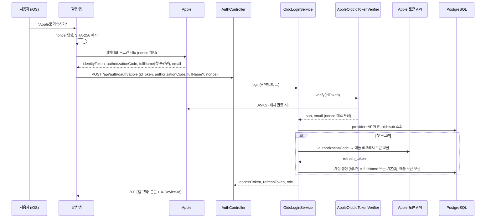
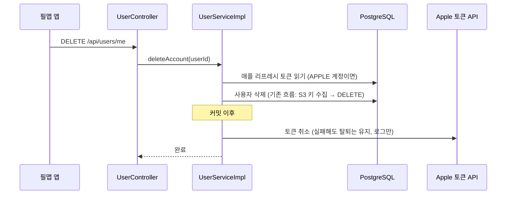
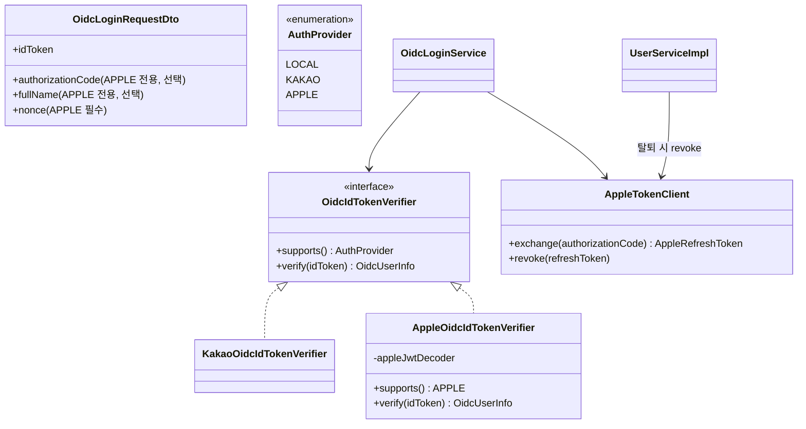

# PRD: iOS 애플 로그인

> 티켓: MSG-594 · 작성일: 2026-09-10 · 작성: prd-writer
> 상태: 검토됨 (2026-09-10 성민 승인, nonce는 Must로 확정)
> 관련 SRS: FR-AUTH-12(진행 중), FR-AUTH-01, FR-AUTH-05, FR-AUTH-08, FR-USER-03, NFR-SEC-07
> 선행 결정: [인증과 계정 PRD](auth-user-prd.md) §5.1 (2026-08-10 성민 확인, "iOS 출시 시점에 필요")

## 1. 문제 상황

필맵 앱은 카카오 계정 하나로 가입하고 로그인한다. 웹과 안드로이드에서는 이걸로 충분했다.
그런데 iOS를 앱스토어에 내려면 사정이 다르다. 앱스토어 심사 지침 4.8[^1]은 카카오 같은
제3자 로그인을 제공하는 앱에 애플 로그인도 함께 제공하라고 요구한다. 이건 취향이 아니라
통과 조건이라, 없으면 심사에서 반려된다.

2026년 8월 10일에 이 사실을 확인하고 "iOS를 낼 때 붙인다"고 미뤄 뒀다. 지금 iOS 출시가
다가와 그 결정을 실행할 차례다.

코드는 아직 애플을 모른다. 제공자 열거형은 `LOCAL`과 `KAKAO` 둘뿐이고, 같은 값이 DB 제약
`chk_users_provider`에도 박혀 있다. ID 토큰 검증기도 카카오용 하나만 있다. 다만 검증기
계약(`OidcIdTokenVerifier`)이 처음부터 제공자별 구현체를 꽂는 구조로 설계돼 있어, 애플용
구현체와 검증 설정을 추가하면 로그인 서비스 본체는 손대지 않아도 된다.

앱 쪽에는 빌드가 하나라는 사정이 있다. React Native 코드 한 벌로 iOS와 안드로이드를 같이
만들기 때문에, 애플 버튼을 그냥 넣으면 안드로이드에도 같이 나간다. 안드로이드에는 이
요건이 없고, 애플이 제공하는 안드로이드용 경로는 웹 로그인 방식이라 별도 설정이 든다.
그래서 iOS에서만 보이게 갈라야 한다.

## 2. 목적 · 목표

- **목적**: iOS 앱이 앱스토어 심사를 통과할 수 있도록 애플 로그인을 카카오와 같은 수준으로
  제공하고, 그러면서 안드로이드와 웹의 로그인 경험은 그대로 둔다.
- **목표**:
  - iOS 사용자가 애플 계정으로 처음 가입하고, 다시 들어와 로그인하고, 발급받은 토큰으로
    기존 API를 전부 쓸 수 있다.
  - 같은 앱 빌드를 안드로이드에서 실행하면 애플 버튼이 보이지 않는다.
  - 애플이 첫 로그인에만 주는 이름과 이메일을 그때 저장한다. 두 번째 로그인부터는 안 줘도
    계정이 흔들리지 않는다.
  - 회원 탈퇴 때 애플 쪽 연결(토큰)도 함께 끊어, 애플 로그인 사용자의 탈퇴가 심사 요건을
    만족한다.
- **비목표(스코프 제외)**:
  - 웹 애플 로그인. 웹은 심사 대상이 아니고, 웹용은 별도의 서비스 ID와 리다이렉트 설정이
    필요해 다른 티켓으로 뗀다.
  - 안드로이드 애플 로그인. 위와 같은 웹 경로라 빼고, 필요해지면 그때 판단한다.
  - 카카오 계정과 애플 계정의 연동. 같은 사람이 두 방식으로 가입하면 다른 계정이다. 이메일이
    겹치면 기존 규칙(1409, 이미 사용 중인 이메일)이 그대로 적용된다.
  - 애플이 서버로 보내는 계정 상태 알림(사용자가 아이폰 설정에서 앱 연결을 끊었을 때 등)의
    수신. 미해결 질문 5로 남긴다.

## 3. 기능 요구사항

| ID | 요구사항 | 우선순위 |
|----|----------|----------|
| FR-1 | iOS 사용자는 로그인 화면에서 "Apple로 계속하기" 버튼을 카카오 버튼과 같은 폭과 높이로 본다. 애플 규정이 자기 버튼을 다른 소셜 버튼보다 작거나 덜 두드러지게 두는 것을 금지하기 때문이다 | Must |
| FR-2 | 같은 앱 빌드를 안드로이드에서 실행하면 애플 버튼이 렌더되지 않고, 로그인 화면은 지금과 동일하다 | Must |
| FR-3 | 사용자가 애플 버튼을 누르면 iOS 네이티브 애플 로그인 시트가 뜨고, 승인하면 앱이 애플 ID 토큰[^2]을 받아 서버에 보낸다. 카카오와 같은 엔드포인트(`POST /api/auth/oauth/{provider}`)를 `provider=apple`로 쓴다 | Must |
| FR-4 | 서버는 애플 ID 토큰의 서명, 발급자(`https://appleid.apple.com`), 대상(aud)[^3]이 우리 iOS 번들 ID인지, 만료 여부를 검증한다. 하나라도 어긋나면 2421(유효하지 않은 소셜 로그인 토큰)로 거절한다 | Must |
| FR-5 | 검증을 통과하면 애플이 준 사용자 식별자(sub)와 제공자 `APPLE`로 계정을 찾고, 없으면 만든다. 이후 액세스 토큰 1시간, 리프레시 토큰 2주를 카카오와 같은 규약(앱은 응답 본문, 기기 식별자 헤더)으로 발급한다 | Must |
| FR-6 | 애플은 이름을 ID 토큰에 넣지 않고 첫 승인 때 한 번만 앱에 준다. 앱은 첫 로그인 요청에 그 이름을 함께 보내고, 서버는 계정을 새로 만들 때만 그것을 닉네임으로 쓴다. 이미 있는 계정에 온 이름은 무시한다(사용자가 바꾼 닉네임을 덮어쓰지 않는다) | Must |
| FR-7 | 이름이 오지 않으면(사용자가 공유를 껐거나 두 번째 로그인) 서버가 기본 닉네임을 붙여 가입이 실패하지 않게 한다. 형식은 미해결 질문 2 | Must |
| FR-8 | 이메일은 ID 토큰의 클레임을 저장한다. 사용자가 "이메일 가리기"를 골라 릴레이 주소[^4]가 오면 그대로 저장한다. 다른 계정이 같은 이메일을 쓰고 있으면 기존 규칙대로 1409로 거절한다 | Must |
| FR-9 | 애플 계정 사용자가 회원 탈퇴를 하면 서버는 애플에 토큰 취소[^5]를 요청한다. 취소 호출이 실패해도 탈퇴 자체는 완료되고 실패는 로그에 남는다. 탈퇴가 애플 장애에 막히면 안 되기 때문이다 | Must |
| FR-10 | 취소 요청에 쓸 자격을 얻기 위해, 서버는 첫 로그인 때 앱이 보낸 인가 코드를 애플 토큰 엔드포인트에서 교환해 애플 리프레시 토큰을 보관한다. 보관 위치와 암호화는 미해결 질문 3 | Must |
| FR-11 | 앱은 로그인 요청마다 임의 값(nonce)[^6]을 만들어 해시를 애플에 넘기고 원문을 서버에 보낸다. 서버는 ID 토큰의 nonce 클레임과 대조해 재사용된 토큰을 거절한다 | Must |
| FR-12 | 개발 환경의 모의 소셜 로그인(`POST /api/auth/dev/social-login`)이 `APPLE`도 받아, 맥 없이도 애플 계정 흐름을 로컬에서 시험할 수 있다 | Should |
| FR-13 | 사용자가 애플 시트에서 취소하면 앱은 아무 안내 없이 로그인 화면에 머문다. 네트워크나 서버 오류는 카카오와 같은 실패 안내를 보여 준다 | Must |

## 4. 비기능 요구사항

| 분류 | 요구사항 |
|------|----------|
| 보안/인가 | 애플 공개키(JWKS)[^7]는 서버가 주기적으로 받아 캐시하고, 키가 바뀌면 재조회한다. 토큰 교환과 취소에 쓰는 클라이언트 비밀은 애플 개발자 계정의 서명 키(.p8 파일)로 서버가 생성하는 짧은 수명의 JWT이며, 서명 키는 코드나 저장소에 넣지 않고 환경 설정으로만 주입한다 |
| 보안/인가 | 애플 리프레시 토큰은 로그인 발급에는 쓰지 않고 탈퇴 시 취소 용도로만 쓴다. 유출되면 우리 서비스 세션이 열리지는 않지만 애플 쪽 권한 취소가 가능하므로 저장 시 암호화한다 |
| 성능 | 애플 로그인 응답 시간은 카카오 로그인과 같은 수준을 목표로 한다. JWKS 캐시가 있으면 로그인 한 번에 애플 서버를 부르는 것은 첫 로그인의 인가 코드 교환 한 번뿐이다 |
| 데이터 정합 | 제공자 값 `APPLE`을 열거형과 DB CHECK 제약에 함께 추가한다. 둘 중 하나만 바꾸면 가입이 DB에서 터진다 |
| 운영 | 애플 개발자 콘솔에서 앱 ID에 Sign in with Apple 기능을 켜고, 서버용 키를 발급받아야 한다. dev와 prod가 같은 번들 ID를 쓰는지 확인이 필요하다(미해결 질문 6). 마이그레이션은 CHECK 개정과 토큰 보관 컬럼 추가라 롤백은 역방향 ALTER로 가능하다 |
| 심사 | 애플 로그인을 붙이면 계정 삭제 기능이 앱 안에 있어야 하고(이미 있음, MSG-205), 삭제 시 토큰 취소를 호출해야 한다(FR-9). 둘 다 앱스토어 심사가 본다 |

## 5. 시퀀스 다이어그램

첫 로그인(가입)과 회원 탈퇴 두 흐름이다. 재로그인은 첫 로그인에서 계정 생성과 인가 코드
교환이 빠진 것과 같다.

## 6. 클래스 다이어그램

기존 검증기 계약에 애플 구현체를 꽂고, 토큰 교환과 취소를 맡는 클라이언트를 하나 둔다.
요청 DTO에는 애플에만 있는 선택 필드가 붙는다.

## 7. 변경 파일 목록

리서치 기준: `.claude/docs/status.md` auth 절, 실제 코드 확인(2026-09-10). 마이그레이션
번호는 현재 최신 V53 다음이다.

| 파일 | 변경 | Owner |
|------|------|-------|
| `src/main/java/com/msg/fillmap/user/entity/AuthProvider.java` | `APPLE` 추가 | B |
| `src/main/resources/db/migration/V54__apple_provider.sql` | 신규. `chk_users_provider` CHECK에 APPLE 추가, 애플 리프레시 토큰 보관 컬럼 또는 테이블(미해결 질문 3) | - |
| `src/main/java/com/msg/fillmap/auth/oidc/AppleOidcIdTokenVerifier.java` | 신규. `OidcIdTokenVerifier` 구현, nonce 대조 | B |
| `src/main/java/com/msg/fillmap/auth/oidc/AppleOidcProperties.java` | 신규. issuer, JWKS URI, 번들 ID, 팀 ID, 키 ID, 서명 키 | B |
| `src/main/java/com/msg/fillmap/auth/oidc/AppleTokenClient.java` | 신규. 인가 코드 교환과 토큰 취소, 클라이언트 비밀 JWT 생성 | B |
| `src/main/java/com/msg/fillmap/auth/oidc/OidcDecoderConfig.java` | `appleJwtDecoder` 빈 추가 (카카오와 같은 issuer·audience 검증 조립) | B |
| `src/main/java/com/msg/fillmap/auth/dto/OidcLoginRequestDto.java` | `authorizationCode`, `fullName`, `nonce` 선택 필드 | B |
| `src/main/java/com/msg/fillmap/auth/service/OidcLoginService.java` | 닉네임 부재 시 기본값, 첫 로그인 시 애플 토큰 교환·보관 | B |
| `src/main/java/com/msg/fillmap/auth/controller/AuthController.java` | 변경 없음 확인 대상. 기존 `/oauth/{provider}`가 DTO 확장만으로 동작하는지 검증 | B |
| `src/main/java/com/msg/fillmap/user/service/UserServiceImpl.java` | `deleteAccount` 커밋 이후 정리에 애플 토큰 취소 추가 | B |
| `src/main/resources/application*.yml`, `.env.example` | 애플 설정 키 추가 | - |
| `docs/srs.md` | FR-AUTH-12 상태와 정본 PRD 링크 갱신 (srs-writer) | - |
| `docs/prd/auth-user-prd.md` | §2 비목표의 "Apple 로그인 범위 밖" 문구에 이 PRD 링크 병기 | - |
| `fillmap-FE/apps/mobile/src/features/auth/ui/login-screen.tsx` | iOS에서만 애플 버튼 렌더 (`Platform.OS === "ios"`) | FE |
| `fillmap-FE/apps/mobile/src/features/auth/ui/apple-login-button.tsx` | 신규. 검정 pill, 카카오 버튼과 같은 규격 | FE |
| `fillmap-FE/apps/mobile/src/features/auth/api/apple-adapter.ts` | 신규. `expo-apple-authentication` 지연 로드 격리 (카카오 어댑터와 같은 이유) | FE |
| `fillmap-FE/apps/mobile/src/features/auth/api/apple-login-mutation.ts` | 신규 또는 카카오 mutation 일반화. `provider=apple`, 첫 로그인 fullName 전달 | FE |
| `fillmap-FE/apps/mobile/app.config.js`, `package.json` | `ios.usesAppleSignIn`, `expo-apple-authentication` 플러그인 | FE |

## 8. 미해결 질문

- [x] **1. 버튼 순서.** 시안(피그마 `16015:540`)은 카카오 위, 애플 아래다. 애플 규정은 크기만
  요구하고 순서는 강제하지 않는 것으로 알고 있으나 원문 확인이 필요하다. 국내 앱은 대개
  카카오를 먼저 둔다.
- [x] **2. 기본 닉네임 형식.** 이름이 안 올 때 붙일 닉네임. 후보는 "필맵러" 뒤에 짧은 무작위
  숫자. 닉네임은 중복 허용(FR-USER-03)이라 충돌 걱정은 없고, 2~20자 제약만 지키면 된다.
- [x] **3. 애플 리프레시 토큰 보관.** `users`에 암호화 컬럼을 두는 안과 제공자 자격을 담는
  별도 테이블을 두는 안 중 택일. 지금은 애플뿐이라 컬럼이 단순하지만, 앞으로 구글 등이
  붙으면 테이블이 낫다. 암호화 키 관리도 함께 정한다(스펙 몫이나 방향은 여기서).
- [x] **4. nonce 도입 범위.** 이번에 넣는다(2026-09-10 성민 확정, FR-11 Must). 웹 카카오는
  이미 쓰고(MSG-345) 모바일 카카오는 안 쓰는데, 애플은 네이티브 흐름에서도 nonce를 지원해
  비용이 작다. 모바일 카카오 도입은 별도 판단으로 남긴다.
- [x] **5. 애플 서버 알림 수신.** 사용자가 아이폰 설정에서 앱 연결을 끊거나 이메일 릴레이를
  바꾸면 애플이 등록된 엔드포인트로 알려 줄 수 있다. 받으면 그 사용자의 세션을 끊거나
  이메일을 갱신할 수 있다. 심사 필수는 아닌 것으로 알고 있어 비목표로 뒀다.
- [x] **6. dev와 prod의 번들 ID.** 애플 ID 토큰의 aud는 번들 ID다. dev 빌드가 다른 번들
  ID를 쓰면 dev 서버 설정에 그 값을 따로 넣어야 한다. 현재 `app.config.js`는
  `kr.fillmap.app` 하나만 보인다.
- [x] **7. 디자인 정본 승격.** 이 PRD가 참조하는 iOS 화면은 2026-09-10 시안이라 아직 정본
  페이지("필맵 앱 디자인 MVP ver 6")에 반영되지 않았다. 디자이너 확인 후 승격이 필요하다.

[^1]: 앱스토어 심사 지침 4.8(Login Services). 앱이 제3자 소셜 로그인(카카오, 구글 등)을 쓰면 사용자 데이터 수집을 이름과 이메일로 제한하고, 이메일을 숨길 수 있으며, 광고 추적 없이 쓸 수 있는 로그인 방식을 함께 제공해야 한다는 규정이다. 애플 로그인이 이 조건을 만족하는 대표 수단이다.
[^2]: ID 토큰. 로그인 제공자가 "이 사용자가 방금 인증됐다"를 증명하려고 서명해 주는 JWT다. 안에 사용자 식별자(sub), 이메일, 발급자, 대상, 만료 시각이 들어 있고, 서버는 서명만 확인하면 제공자에게 다시 묻지 않아도 된다. 카카오 로그인도 같은 방식이다.
[^3]: aud(audience). ID 토큰이 "누구에게 발급됐는가"를 적은 클레임이다. 애플은 여기에 앱의 번들 ID를 넣는다. 다른 앱에 발급된 토큰을 우리 서버에 들이미는 것을 막는 검사다.
[^4]: 릴레이 주소. 애플 로그인의 "이메일 가리기"를 고르면 애플이 `xxx@privaterelay.appleid.com` 형태의 대리 주소를 만들어 준다. 우리가 그 주소로 메일을 보내면 애플이 실제 주소로 전달한다. 사용자마다 앱마다 다른 값이라 우리 쪽 유니크 제약과 충돌하지 않는다.
[^5]: 토큰 취소(revocation). 애플의 `/auth/revoke` 호출로 우리 앱에 준 권한을 거둬들이는 것이다. 2022년부터 앱스토어는 계정 삭제를 제공하는 앱이 삭제 시 이 호출을 하도록 요구한다. 호출하려면 애플이 준 토큰이 필요해서 첫 로그인 때 인가 코드를 토큰으로 바꿔 둬야 한다(FR-10).
[^6]: nonce. 요청마다 새로 만드는 일회용 임의 값이다. 앱이 해시를 애플에 넘기면 애플이 ID 토큰 안에 그 해시를 넣어 돌려주고, 서버는 앱이 보낸 원문의 해시와 대조한다. 가로챈 토큰을 다른 요청에 다시 쓰는 것을 막는다.
[^7]: JWKS(JSON Web Key Set). 제공자가 토큰 서명에 쓰는 공개키 묶음을 내려주는 주소다. 서버는 이 공개키로 ID 토큰 서명을 검증한다. 애플은 키를 주기적으로 바꾸므로 캐시하되 모르는 키 ID가 오면 다시 받아야 한다.

질문 1, 2, 3, 5, 6, 7은 스펙 `docs/spec/MSG-594.md`의 결정 항목 D-1, D-2, D-3, D-5, D-6, D-7로 닫혔다(2026-09-10 구현 착수 승인). 4는 PRD 승인 때 닫혔다.
