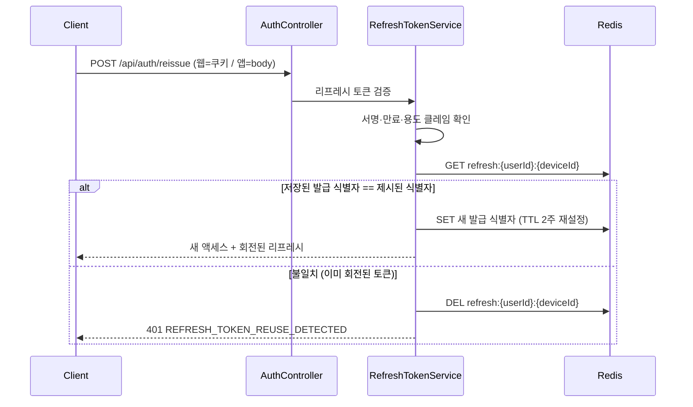

# PRD: 인증과 계정

> 작성일: 2026-08-10 · 작성: prd-writer (MSG-359 역산)
> 상태: 역산 (사후 문서. 구현이 이미 끝난 기능의 요구사항을 스펙과 위키 결정에서 복원했다)
> 커버 티켓: MSG-42, MSG-43, MSG-44, MSG-47, MSG-38, MSG-78, MSG-135, MSG-345, MSG-310, MSG-203, MSG-205, MSG-360(미착수)
> 관련 SRS: AUTH 영역 (FR-AUTH-01 ~ 11), USER 영역 (FR-USER-01 ~ 11), 보안 (NFR-SEC-01·02·05·07), 데이터 정합 (NFR-DATA-01)

이미 개별 PRD가 있는 티켓은 여기서 되풀이하지 않고 링크로 넘긴다. 웹 카카오 인가 코드 교환은
[MSG-345](MSG-345-prd.md), 카카오 가입 이메일 미수집은 [MSG-310](MSG-310-prd.md), 프로필 조회와
닉네임 수정은 [MSG-203](MSG-203-prd.md), 계정 삭제는 [MSG-205](MSG-205-prd.md)가 정본이다.
이 문서는 그 넷을 하나의 흐름으로 잇고, PRD가 없는 채로 구현된 토큰 체계(MSG-135)와 초기 인증
골격(MSG-38 계열)의 요구사항을 복원하는 몫을 맡는다.

## 1. 문제 상황

FillMap의 모든 데이터는 사람에게 묶여 있다. 어느 격자를 채웠는지, 어떤 영상을 올렸는지, 뱃지를
몇 개 받았는지가 전부 계정 단위로만 의미를 갖는다. 그래서 로그인이 없으면 서비스가 성립하지
않고, 반대로 계정을 지울 방법이 없으면 개인 위치 기록이 영원히 남는다.

인증 영역은 세 가지를 동시에 요구받았다. 첫째, 가입 마찰을 최소로 줄여야 한다. 짧은 영상을
올리려고 들어온 사람에게 이메일 인증 절차를 요구하면 그 자리에서 이탈한다. 둘째, 한 번 로그인한
세션이 자연스럽게 이어져야 한다. 액세스 토큰만으로 운영하면 만료 주기마다 재로그인을 강요하게
된다. 셋째, 그러면서도 토큰이 유출됐을 때 세션을 끊을 수단이 있어야 한다. 이 셋은 서로 당기는
방향이 달라서, 어느 하나를 편하게 만들면 다른 하나가 나빠진다.

계정 축에는 별도의 문제가 있었다. 초기 스키마에서 `reports` 테이블의 외래키가 연쇄 삭제로 걸려
있지 않아, 신고 이력이 있는 사용자는 물리적으로 지울 수 없었다. 위키의 프로필 API 초안이 계정
삭제를 "스키마에 막혀 있음"으로 표시한 채 몇 주간 열려 있던 것이 이 때문이다.

## 2. 목적 · 목표

- **목적**: 소셜 로그인 한 번으로 서비스에 들어오고, 세션이 끊기지 않게 이어지며, 나갈 때는 자기
  데이터를 남김없이 지울 수 있게 한다.
- **목표**:
  - 카카오 계정 하나로 웹과 앱 모두에서 가입과 로그인이 성립한다.
  - 액세스 토큰이 만료돼도 재로그인 없이 세션이 이어지고, 디바이스마다 세션이 독립이다.
  - 리프레시 토큰[^1]이 탈취되면 서버가 그 사실을 감지해 해당 디바이스 세션을 끊는다.
  - 탈퇴 요청 한 번으로 개인 데이터와 스토리지 객체와 전 디바이스 세션이 함께 사라진다.
- **비목표**:
  - 카카오 외 제공자. Apple 로그인은 iOS 앱을 낼 때 필요하고 그때까지는 범위 밖이다
    (2026-08-10 성민 확인, 5.1절).
  - 프로필 이미지 업로드, 이메일 변경, 도감 색상 변경. 셋 다 디자인 정본에 화면이 없다.
  - 탈퇴 유예 기간과 복구. 5.9절에서 기각 근거를 남긴다.

## 3. 기능 요구사항

문장의 정본은 SRS다. 여기서는 어느 요구가 어느 결정에서 나왔는지를 잇는다.

### AUTH: 인증

| SRS ID | 요지 | 상태 | 어디서 정해졌나 |
|--------|------|------|----------------|
| FR-AUTH-01 | 카카오 소셜 로그인으로 가입하고 로그인한다. 미지원 제공자는 400 | 구현됨 | MSG-38, 5.1절 |
| FR-AUTH-02 | 웹은 서버가 조립한 인가 URL로 시작해 인가 코드[^2]를 서버에 넘긴다 | 구현됨 | [MSG-345 PRD](MSG-345-prd.md), 5.7절 |
| FR-AUTH-03 | 서버가 nonce[^3]를 발급해 쿠키로 결속하고 ID 토큰[^4] 클레임과 대조한다 | 구현됨 | MSG-345 PRD FR-8, 5.7절 |
| FR-AUTH-04 | redirect URI는 요청 본문으로 받고 서버 화이트리스트를 두지 않는다 | 구현됨 | MSG-345 PRD FR-4 |
| FR-AUTH-05 | 액세스 1시간, 리프레시 2주를 함께 발급한다 | 구현됨 | MSG-135, 5.3절 |
| FR-AUTH-06 | 리프레시 세션은 디바이스별로 독립이다 | 구현됨 | MSG-135, 5.4절 |
| FR-AUTH-07 | 재발급마다 토큰을 회전[^5]하고 회전된 토큰의 재제시는 탈취로 판정한다 | 구현됨 | MSG-135, 5.6절 |
| FR-AUTH-08 | 리프레시 전달은 웹이 HttpOnly 쿠키, 앱이 응답 본문이다 | 구현됨 | MSG-135, 5.5절 |
| FR-AUTH-09 | 로그아웃하면 액세스 토큰이 잔여 만료까지 차단되고 그 디바이스 세션이 지워진다 | 구현됨 | MSG-47, MSG-135 |
| FR-AUTH-10 | 인가 코드 교환 실패는 사용자 재시도로 풀리는 401과 제공자 오류 5xx로 갈린다 | 구현됨 | MSG-345 PRD FR-5·FR-7 |
| FR-AUTH-11 | 이메일 가입과 로그인은 로컬 테스트 용도로만 유지한다 | 부분 | MSG-43, MSG-44, 5.2절 |

FR-AUTH-11만 상태 표기를 SRS와 다르게 적었다. SRS는 이 항목을 구현됨으로 두고 있는데, 검증 규칙과
엔드포인트가 있다는 뜻에서는 맞지만 "로컬 테스트 용도로만"이라는 조건 절은 아직 성립하지 않는다.
그 조건을 강제하는 것이 NFR-SEC-07이고 그쪽은 미충족이다. 5.2절에 사실관계를 정리했다.

### USER: 사용자와 프로필

| SRS ID | 요지 | 상태 | 어디서 정해졌나 |
|--------|------|------|----------------|
| FR-USER-01 | 자기 프로필(이메일, 닉네임)을 조회한다 | 구현됨 | [MSG-203 PRD](MSG-203-prd.md) |
| FR-USER-02 | 닉네임을 2자에서 20자 범위로 바꾸고 즉시 반영된다 | 구현됨 | MSG-203, 5.10절 |
| FR-USER-03 | 닉네임 중복을 허용한다 | 구현됨 | MSG-203, 5.10절 |
| FR-USER-04 | 카카오 가입은 이메일 없이 성립한다 | 구현됨 | [MSG-310 PRD](MSG-310-prd.md), 5.8절 |
| FR-USER-05 | 도감 색상은 생성 시 BLUE로 부여되고 사용자 변경은 범위 밖이다 | 계획 | MSG-203, 5.11절 |
| FR-USER-06 | 요청 한 번으로 계정을 즉시 비가역 삭제한다 | 구현됨 | [MSG-205 PRD](MSG-205-prd.md), 5.9절 |
| FR-USER-07 | 탈퇴 시 개인 데이터 9종이 연쇄 제거된다 | 구현됨 | MSG-205, 5.9절 |
| FR-USER-08 | 탈퇴 시 영상 스토리지 객체가 제거되고 개별 실패는 삭제를 막지 않는다 | 구현됨 | MSG-205, 6절 |
| FR-USER-09 | 탈퇴 후 전 디바이스 세션이 무효화된다 | 구현됨 | MSG-205 |
| FR-USER-10 | 탈퇴한 계정으로 다시 로그인하면 신규 가입이다 | 구현됨 | MSG-205, 5.9절 |
| FR-USER-11 | 신고 이력이 있어도 삭제되고 검토자 기록은 비워진다 | 구현됨 | MSG-205, 5.9절 |

## 4. 비기능 요구사항

| SRS ID | 요지 | 상태 |
|--------|------|------|
| NFR-SEC-01 | 모든 API가 인증 필수이고 예외는 명시 목록뿐이다 | 구현됨 |
| NFR-SEC-02 | 사용자 식별은 토큰 principal에서만 얻고 본인 대상 경로에 대상 식별자를 두지 않는다 | 구현됨 |
| NFR-SEC-05 | 자격 정보는 환경변수로만 주입하고 토큰 원문은 로그에 남기지 않는다 | 구현됨 |
| NFR-SEC-07 | 이메일 가입과 로그인은 개발 환경에서만 열린다 | **미충족** |
| NFR-DATA-01 | 탈퇴의 DB 연쇄 제거는 단일 트랜잭션이고 스토리지 정리는 커밋 이후 best-effort다 | 구현됨 |

NFR-SEC-02는 경로 설계로 실현했다. 프로필 조회도 닉네임 수정도 계정 삭제도 전부 `/me`이고 대상
사용자 식별자를 경로에 두지 않는다. 다른 사람을 지정할 문법 자체가 없으면 인가 검사를 빠뜨려서
생기는 사고가 원천에서 사라진다.

## 5. 왜 이렇게 정했나

### 5.1 로그인 수단을 카카오 하나로 좁힌 것

코드가 아는 제공자는 `LOCAL`과 `KAKAO` 둘뿐이고, 이것은 애플리케이션 열거형만이 아니라 DB 제약
(`chk_users_provider`)에도 박혀 있다. 제공자를 하나 늘리려면 마이그레이션과 해당 제공자용 ID 토큰
검증기가 함께 필요하다는 뜻이다. 위키 갭 분석도 Apple 추가 비용을 정확히 그 두 가지로 산정했다.

**카카오를 고른 근거는 국내 사용자 커버리지다** (2026-08-10 성민 확인). 타겟 사용자 대부분이 이미
카카오 계정을 갖고 있으니 가입 장벽이 가장 낮다는 판단이었다. 1절이 인증 영역의 첫 요구로 적은
"가입 마찰을 최소로 줄인다"를 제공자 선택에 그대로 적용한 셈이다.

다만 커버리지 판단이 근거였다는 것과 그 판단을 뒷받침하는 자료가 남아 있다는 것은 다른 이야기다.
**다른 제공자와 정량으로 비교한 기록은 레포에도 위키에도 없다.** 카카오 OIDC 검증 인프라를 넣은
MSG-38이 인증 영역의 첫 소셜 티켓이고, 그 이후 논의는 전부 "카카오는 되어 있다"를 전제로
이어졌다. 지도 SDK를 카카오에서 네이버로 바꾼 ADR이 있어 카카오 의존이 검토된 흔적처럼 보이지만
그것은 프론트엔드 지도 영역의 결정이라 로그인과 무관하다. 7절에 남긴다.

**Apple 로그인은 iOS 앱을 낼 때 필요하고 지금은 범위 밖이다** (2026-08-10 성민 확인). 근거는
제품 선호가 아니라 심사 규정이다. 앱스토어는 다른 소셜 로그인을 제공하는 앱에 Apple 로그인을
함께 제공하도록 요구하므로, iOS 출시 시점에는 선택지가 아니라 통과 조건이 된다. 웹과 안드로이드가
먼저인 지금은 붙일 이유가 없고, 붙일 때 드는 비용은 위 문단이 적은 그대로다. 제공자 제약을 푸는
마이그레이션 하나와 Apple ID 토큰 검증기 하나.

이 확인으로 문서 셋이 서로 다르게 적고 있던 상태가 정리된다. 위키 갭 분석(2026-07-17)은
"필요 확정", 같은 위키의 IA 초안은 "미구현·결정필요", 레포 `ia.md`는 "미정"이었다. 어느 쪽이
최신인지 가릴 수 없어 미확인으로 남아 있던 것인데, 셋 다 "iOS 출시 시점에 필요"라는 한 결론의
서로 다른 시점 표기였던 셈이다. 표기 정정은 각 문서 몫이다.

### 5.2 이메일 가입 경로를 남긴 대가

이메일 가입과 로그인은 소셜 로그인 인프라가 없던 시절(MSG-43, MSG-44)에 먼저 만들어졌고, 소셜이
들어온 뒤에도 지워지지 않았다. 지우지 않은 이유는 분명하다. 로컬과 테스트에서 카카오 왕복 없이
계정을 만들 수단이 필요하다.

문제는 그 의도가 코드로 강제되지 않았다는 것이다. 2026-08-10 기준 사실은 이렇다.

- `DevAuthController`(ID 토큰 검증을 건너뛰는 모의 로그인)는 `@Profile({"local","dev"})`로 분리돼
  있어 운영에 빈 자체가 없다. 이쪽은 안전하다.
- `AuthController`의 `/signup`과 `/login`에는 프로파일[^6] 제한이 없고, `SecurityConfig` 70행이
  두 경로를 permitAll로 연다. 운영에서도 이메일 가입이 그대로 동작한다.
- 인증 메일 절차가 없어서 존재하지 않는 주소로도 계정이 만들어진다.

위키 갭 분석이 2026-07-17에 이미 "의도됨(로컬 전용)인데 프로파일 분리 안 됨"으로 지적했고,
2026-08-10 SRS 역산에서 코드로 재확인했다. 닫는 티켓은 MSG-360이며 아직 착수하지 않았다.
**이 항목을 구현된 요구로 읽으면 안 된다.** 지금 운영 환경의 로그인 수단은 소셜 하나가 아니다.

### 5.3 액세스 토큰을 짧게 두고 리프레시를 얹은 것

액세스 토큰 하나로 운영하면 수명을 정할 때 딜레마가 생긴다. 짧게 잡으면 사용자가 주기적으로
재로그인해야 하고, 길게 잡으면 유출된 토큰이 그 기간 내내 유효하다. 어느 쪽도 받아들일 수 없어서
수명이 다른 토큰 둘로 나눴다. 액세스는 1시간을 유지하고, 2주짜리 리프레시로 조용히 갱신한다.

MSG-135는 액세스 토큰 수명 변경을 명시적으로 스코프 밖에 뒀다. 리프레시가 들어오면 1시간이라는
값이 사용자 눈에 보이지 않게 되므로 굳이 건드릴 이유가 없다는 판단이다.

리프레시 토큰의 형식으로는 서명된 JWT를 골랐다. 재발급 시점에는 액세스 토큰이 이미 만료돼 있어서
요청자가 누구인지 알려 줄 다른 재료가 없다. 토큰 자체에서 사용자와 디바이스를 복원할 수 있어야
회전과 재사용 감지가 성립한다. 대신 Redis에는 토큰 원문을 저장하지 않고 현재 유효한 발급
식별자(`jti`)만 둔다. 저장소가 유출돼도 그것만으로는 토큰을 만들 수 없다.

### 5.4 세션을 디바이스 단위로 나눈 것

사용자 하나에 리프레시 세션 하나를 두면 웹에서 로그인하는 순간 앱 세션이 끊긴다. 웹과 앱을 함께
쓰는 것이 기본 사용 형태라서 이 동작은 그대로 결함이다. 그래서 Redis 키를 사용자와 디바이스의
쌍으로 잡았고, 한쪽의 재발급이나 로그아웃이 다른 쪽에 닿지 않는다.

디바이스 식별자는 클라이언트가 헤더로 보내되 없으면 서버가 만들어 응답 헤더로 돌려준다. 클라이언트
구현이 늦어도 로그인이 실패하지 않게 하려는 선택이다. 대신 식별자를 보내지 않는 클라이언트는
로그인할 때마다 새 세션을 만들게 되고, 로그아웃에서 식별자가 없으면 그 사용자의 전 디바이스
세션을 지우는 쪽으로 폴백한다. 안전한 쪽으로 넘어지게 두었다.

### 5.5 리프레시 토큰을 웹과 앱에 다르게 전달하는 것

웹 브라우저에서 토큰을 자바스크립트가 읽을 수 있는 곳에 두면 스크립트 삽입 한 번에 세션이
넘어간다. 그래서 웹에는 HttpOnly 쿠키[^7]로 내려 스크립트 접근을 차단했다. 반대로 앱에는 쿠키가
자연스러운 저장소가 아니고 운영체제가 제공하는 보안 저장소가 따로 있어서 응답 본문으로 내린다.
클라이언트 유형은 `X-Client-Type` 헤더로 구분한다.

쿠키를 쓰면 교차 사이트 요청 위조를 방어해야 하는데, 별도 CSRF 토큰 스킴을 도입하는 대신 방금 그
커스텀 헤더 요구로 대체했다. 브라우저는 커스텀 헤더가 붙은 교차 출처 요청에 사전 확인 요청을
강제하므로, 서버의 출처 정책을 통과한 도메인에서만 요청이 성립한다. 방어 수단 하나를 추가하는
대신 이미 필요한 헤더에 역할을 하나 더 얹은 셈이다.

이 선택에는 알려진 대가가 있다. 교차 출처 쿠키는 HTTPS에서만 브라우저가 저장하고 보내므로,
평문 HTTP로 도는 로컬 웹 개발에서는 쿠키 경로를 쓸 수 없다. 로컬은 앱 모드로 개발하거나 로컬
HTTPS를 붙여야 한다.

### 5.6 회전과 재사용 감지를 MVP에 넣은 것

리프레시 토큰은 2주를 산다. 그 사이 한 번 유출되면 공격자가 조용히 세션을 이어 갈 수 있고, 정상
사용자는 아무 이상을 느끼지 못한다. 회전은 이 상황을 관찰 가능하게 만든다. 재발급마다 새 토큰을
주고 직전 것을 즉시 죽이므로, 이미 회전된 토큰이 다시 들어왔다는 것은 같은 토큰을 두 곳에서
쓰고 있다는 뜻이다. 서버는 그 시점에 해당 디바이스의 세션 체인 전체를 폐기해 양쪽 모두 재로그인
하게 만든다. 공격자만 끊을 방법은 없으므로 둘 다 끊는 쪽을 택했다.

기능 하나를 더 얹는 판단이라 남겨 둘 수도 있었지만, 나중에 붙이면 토큰 형식과 저장 구조를 다시
설계해야 해서 처음부터 포함했다.

알려진 취약점도 함께 기록돼 있다. 네트워크 재시도로 같은 리프레시가 짧은 간격에 두 번 들어오면
정상 요청이 재사용으로 오판될 수 있다. 조회와 갱신을 원자적으로 처리하는 것이 정답이라고 스펙이
지목했고, 최소 구현은 그렇게 하지 않은 채 위험을 열린 질문으로 남겼다.

### 5.7 웹 로그인의 교환 구간을 서버가 대행하게 된 것

모바일은 네이티브 SDK가 내부에서 인가 코드를 ID 토큰까지 바꿔 주지만, 웹은 브라우저에 인가
코드까지만 돌아온다. 코드를 토큰으로 바꾸는 호출에는 서비스 서버의 비밀 키가 필요하고 그 키는
프론트 번들에 넣을 수 없다. 그래서 교환만 서버가 대행하는 엔드포인트를 열었다.

이 과정에서 검토하고 버린 대안이 둘 기록돼 있다. 하나는 스프링의 OAuth2 클라이언트를 도입해
서버가 리다이렉트 로그인 전체를 주도하는 방식이다. 프론트가 콜백을 받는 지금 구조를 바꾸게 되어
채택하지 않았다. 다른 하나는 재생 공격을 막는 nonce를 클라이언트가 만들어 요청 본문에 실어
보내는 방식인데, 검증하는 쪽과 만드는 쪽이 같아 자기 증명이 되므로 배제했다. 서버가 발급해
HttpOnly 쿠키로 브라우저에 묶는 지금 방식이 그 자리를 대신한다. 상세는
[MSG-345 PRD](MSG-345-prd.md)에 있다.

### 5.8 카카오에서 이메일을 받지 않기로 한 것

카카오 로그인에서 이메일 동의 항목을 쓰려면 비즈 앱 전환이 선행돼야 하는데, MVP에 이메일의 실제
용도가 없었다. 알림은 푸시로 나가고 비밀번호 재설정은 소셜 계정에 존재하지 않는다. 쓰지 않을
개인정보를 받으려고 심사 절차를 밟을 이유가 없어서 수집하지 않기로 했다(2026-08-03 확정).

그 결과 이메일 컬럼의 NOT NULL 제약을 풀었다. 여기서 눈여겨볼 것은 유니크 제약을 함께 풀지
않았다는 점이다. PostgreSQL의 유니크 제약은 NULL을 서로 다른 값으로 취급하므로, 카카오 사용자
여럿이 이메일 없이 공존하면서도 이메일이 있는 사용자끼리의 중복은 계속 막힌다. 제약 하나를
살려 두는 것으로 두 요구를 동시에 만족시켰다.

### 5.9 탈퇴를 즉시 물리 삭제로 정한 것

위키 초안이 올려 둔 선택지는 셋이었다. 소프트 삭제, 참조를 NULL로 미는 것, 익명화. 셋 다
`reports` 테이블의 외래키가 연쇄 삭제로 걸려 있지 않다는 제약을 우회하려는 안이었다.

실제 채택된 것은 그 셋 밖의 네 번째 안이다. 우회하는 대신 제약 자체를 고쳤다. 마이그레이션으로
신고자 참조에는 연쇄 삭제를, 검토자 참조에는 NULL 설정을 부여해 하드 삭제를 막던 원인을 없앴다.
신고자와 검토자에 다른 정책을 준 것은 둘의 의미가 다르기 때문이다. 신고자가 사라지면 그 신고는
남을 이유가 없지만, 검토 기록은 대상 영상 쪽의 이력이라 검토자만 비우고 신고 자체는 남긴다.

소프트 삭제를 기각한 근거는 두 가지로 기록돼 있다. 미출시 서비스라 복구 요구가 없었고, 행을
남기면 이메일과 소셜 식별자의 유니크 제약이 재가입을 막는다. 지우지 않기로 하는 순간 "탈퇴한
사람이 돌아올 수 없는" 더 나쁜 문제가 생기는 구조였다. 지금은 행이 사라지면서 제약도 함께 풀려
재가입이 신규 가입으로 성립한다.

한 가지 경합은 알면서 수용했다. 삭제 트랜잭션 직전에 발급된 액세스 토큰이 밀리초 단위 창에서
살아남을 수 있다. 그 토큰의 권한과 수명이 삭제 직전 토큰과 동일하고 발생 조건이 본인 기기로
국한된다는 판단으로 잠금을 걸지 않았다. 완전 무효화는 별도 기능으로 분류돼 있다.

### 5.10 닉네임을 중복 허용으로 둔 것

닉네임을 유일하게 만들면 카카오 가입이 실패한다. 카카오가 주는 자동 닉네임은 그 자체로 중복이
가능하고, 서버가 유니크를 강제하는 순간 그 충돌이 가입 실패로 사용자에게 튄다. 로그인 첫 화면에서
"닉네임이 이미 있습니다"를 보게 되는 흐름은 받아들일 수 없어서 중복을 허용했다. 사용자를 구분하는
값은 별도의 친구 코드가 맡는다.

길이는 20자다. 문서마다 20자와 50자가 섞여 있었고 구현이 20자를 따랐다. 어느 쪽이 맞는지 정한
문서는 없어서 SRS 미해결 질문에도 그대로 올라가 있다.

수정 엔드포인트를 부분 수정이 아니라 닉네임 전용 경로로 잡은 판단도 기록돼 있다. 부분 수정은
"보내지 않은 필드는 바꾸지 않는다"는 의미론인데 수정 가능한 필드가 하나뿐이면 그 의미가 사라지고
사실상 필수 필드 갱신이 된다. 나중에 필드가 늘면 같은 엔드포인트의 검증이 바뀌게 되어 더
나쁘다. 자세한 근거는 스펙 `docs/spec/MSG-203.md` D1에 있다.

### 5.11 도감 색상이 8종인데 바꿀 수 없는 것

색상 값은 여덟 개로 정의돼 있고 계정을 만들 때 BLUE가 부여된다. 그런데 사용자가 색을 고르는
기능은 MVP에 없다. 디자인 정본(ver 9)에 색을 바꾸는 화면이 없다는 것이 이유이고, 2026-08-03에
범위 제외로 확정했다.

여덟 개를 정의해 둔 것이 낭비처럼 보이지만 값 자체는 지금도 쓰인다. 친구 목록과 친구 프로필
응답에 실려 나가기 때문이다. 다만 친구 도감 레이어는 단일색으로 확정돼 있어서 그 색이 지도
색칠에 쓰이지는 않는다. 지금 이 값의 용도는 내 도감 표시와 프로필 노출이다.

### 5.12 전역 노출 카드에 작성자 닉네임을 표시하기로 뒤집은 것

초기 방침은 정반대였다. 전역에 노출되는 영상은 남의 영상일 수 있고, 작성자를 표시하면 누가 어디에
갔는지가 드러난다는 프라이버시 논리로 작성자 식별 정보를 담지 않기로 했다(`docs/spec/MSG-87.md`).

2026-08-04 디자인 ver 9 대조에서 이 방침이 뒤집혔다. 지도 홈 카테고리 패널의 영상 카드에 작성자
닉네임이 들어가 있었고, 성민이 표시하는 쪽으로 확정했다. 판단의 근거는 노출 대상이 이미 전체
공개로 선택된 영상이라는 점이다. 공개를 고른 사람의 이름을 가리는 것은 프라이버시 보호가 아니라
정보 손실에 가깝다는 정리다.

이 결정은 요구사항 문서가 실물 디자인과 어긋난 채로 남아 있던 사례이기도 하다. 방침은 스펙
주석에, 실제 화면은 피그마에 있었고 둘을 대조하기 전까지 아무도 충돌을 몰랐다. 확정 시점에
전역 영상 응답의 닉네임 필드는 아직 없었고 후속 티켓으로 넘어갔으므로, 이 절이 가리키는 것은
"결정은 뒤집혔고 구현은 뒤따라간다"는 상태다.

## 6. 재발급과 세션 폐기 흐름

인증 영역에서 말로 설명하기 가장 번거로운 지점이 회전과 재사용 감지다.

탈퇴 쪽 흐름은 순서가 요구사항이다. 삭제 트랜잭션 안에서 스토리지 키를 먼저 모으고 DB 행을 지운
다음, 커밋이 끝난 뒤에 스토리지 객체 제거와 세션 무효화를 각각 독립적으로 시도한다. 스토리지
삭제가 실패해도 계정 삭제는 이미 확정돼 있고 남은 객체는 로그로만 남는다. 사용자 입장에서 탈퇴가
스토리지 사업자의 사정으로 실패하지 않게 하려는 순서다.

## 7. 미확인

근거를 찾지 못했거나 지금도 확정되지 않은 항목이다. 지어내지 않고 그대로 남긴다.

- **카카오 선정을 뒷받침하는 정량 자료.** 왜 카카오였는지 자체는 확인됐다. 국내 사용자
  커버리지가 근거였고, 타겟 사용자 대부분이 카카오 계정을 갖고 있어 가입 장벽이 가장 낮다는
  판단이었다 (2026-08-10 성민 확인, 5.1절). 남은 공백은 그 판단의 재료다. 제공자별 점유율이나
  전환율을 비교한 자료, 다른 제공자를 후보로 올렸던 기록이 레포와 위키 어디에도 없다.
  MSG-38이 첫 구현이라는 사실만 확인된다.
- **Apple 로그인 지원 여부 (해소됨, 2026-08-10 성민 확인).** iOS 앱을 낼 때 필요하고 지금은
  범위 밖이다. 앱스토어 심사가 소셜 로그인을 쓰는 앱에 Apple 로그인을 요구하는 것이 근거다
  (5.1절). 세 문서가 제각각이던 상태(위키 갭 분석 2026-07-17 "필요 확정", 같은 위키 IA 초안
  "미구현·결정필요", 레포 `ia.md` "미정")는 확정일로 우열을 가릴 수 없어 미확인이었는데, 이
  확인으로 한 결론에 수렴한다. `ia.md`와 SRS 미해결 질문의 표기 정정은 각 문서 몫이다.
- **닉네임 길이 20자와 50자.** 구현은 20자인데 어느 쪽이 기획 확정인지 정한 문서가 없다.
- **리프레시 서명 키 분리.** 액세스와 다른 키를 쓰는 것이 권장으로만 적혀 있고 실제로 분리했는지는
  스펙의 열린 질문에 남아 있다. 분리하지 않아도 용도 클레임 검증으로 상호 오용은 막힌다.
- **재발급 동시 요청의 오판.** 네트워크 재시도로 정상 요청이 재사용으로 판정될 수 있다는 위험이
  스펙에 기록돼 있고, 원자적 처리를 적용했는지 확인되지 않았다.
- **탈퇴 사유 수집.** 기획이 없어 하지 않았다는 기록만 있고 필요 여부는 논의된 적이 없다.
- **이메일 인증 절차.** MSG-360이 운영 차단으로 문제를 닫으려 하는데, 이메일 가입을 개발 환경에
  남길 때 인증 절차 자체가 필요한지는 다뤄지지 않았다.

## 8. SRS 갱신 후보

SRS에 없어서 요구사항 표에 넣지 않은 새 요구는 없었다. 대신 표기 정합 세 건을 발견했다.

- **FR-AUTH-11의 상태.** "이메일 가입과 로그인은 로컬 테스트 용도로만 유지한다"가 구현됨으로
  적혀 있는데, 문장의 조건 절인 "로컬 테스트 용도로만"은 NFR-SEC-07이 미충족이라 지금 성립하지
  않는다. 같은 사실이 한 문서 안에서 서로 다른 상태로 읽히므로, FR-AUTH-11을 부분으로 낮추거나
  문장에서 조건 절을 떼어 NFR-SEC-07 한 곳으로 모으는 편이 낫다. MSG-360이 끝나면 둘 다
  구현됨으로 수렴하므로 그때 함께 정리해도 된다.
- **전역 영상 카드의 작성자 닉네임.** glossary 정책 결정 이력(2026-08-04)에 표시하기로 뒤집힌
  결정이 있고 `docs/spec/MSG-87.md`의 미표시 방침은 아직 그대로다. VIDEO 영역 요구로 등재할지는
  그쪽 묶음의 판단이지만, 결정과 코드 주석이 어긋난 상태라는 사실은 어딘가에 기록돼야 한다.
- **SRS 미해결 질문의 Apple 로그인 항목.** "지원 여부 미정"으로 올라가 있는데 2026-08-10에
  닫혔다. iOS 출시 시점에 필요하고 그전까지 범위 밖이라는 결론이므로, 미해결 질문에서 내리고
  범위 밖 항목으로 옮기는 편이 맞다 (5.1절, 7절).

[^1]: 리프레시 토큰. 액세스 토큰이 만료됐을 때 재로그인 없이 새 액세스 토큰을 받기 위해서만 쓰는 긴 수명의 토큰. 일반 API 호출에는 쓰지 않는다.
[^2]: 인가 코드. 소셜 로그인에서 사용자가 동의를 마쳤다는 것을 증명하는 일회용 짧은 문자열. 이것만으로는 신원을 알 수 없고 서비스 서버가 토큰으로 바꿔야 쓸모가 생긴다.
[^3]: nonce. 요청 한 번에만 유효하도록 발급하는 임의 값. 가로챈 응답을 나중에 다시 제출하는 재생 공격을 막는다.
[^4]: ID 토큰. 소셜 제공자가 서명해서 내려주는 신원 증명. 누가 로그인했는지를 담고 있어 서비스 서버가 서명을 검증해 가입과 로그인 판정에 쓴다.
[^5]: 토큰 회전. 재발급할 때마다 새 리프레시 토큰을 주고 직전 것을 즉시 무효로 만드는 방식. 같은 토큰이 두 번 쓰이면 유출로 판정할 수 있게 된다.
[^6]: 프로파일. 실행 환경(로컬, 개발, 운영)별로 다른 설정과 빈 구성을 적용하는 스프링 기능. 특정 컨트롤러를 개발 환경에만 존재하게 만들 수 있다.
[^7]: HttpOnly 쿠키. 브라우저가 저장하고 자동으로 실어 보내되 페이지의 자바스크립트가 읽을 수 없는 쿠키. 스크립트 삽입 공격으로 값이 빠져나가는 경로를 막는다.
