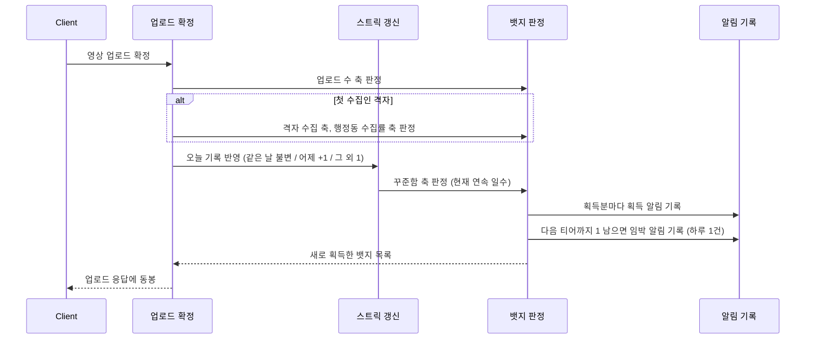

# PRD: 뱃지와 스트릭

> 작성일: 2026-08-10 · 작성: prd-writer (MSG-359 역산)
> 상태: 역산 (사후 문서. 구현이 이미 끝난 기능의 요구사항을 스펙과 위키 결정에서 복원했다)
> 커버 티켓: MSG-239, MSG-200, MSG-201, MSG-181, MSG-314, MSG-363
> 관련 SRS: BADGE 영역 (FR-BADGE-01 ~ 13), STREAK 영역 (FR-STREAK-01 ~ 08)

## 0. 이 문서가 채우는 공백

이 묶음에는 이미 PRD가 둘 있다. `docs/prd/MSG-239-prd.md`가 뱃지 시스템 MVP(마스터 시딩과 지급
엔진)를, `docs/prd/MSG-363-prd.md`가 미션 뱃지 종류별 재편과 뱃지 그림을 다룬다. 두 문서의 범위는
여기서 다시 쓰지 않고 필요한 자리에서 링크한다.

알림 쪽도 절반은 덮여 있다. 스트릭 리마인드(MSG-181)는 `docs/prd/MSG-178-prd.md`의 FR-11로,
뱃지 임박(MSG-314)은 `docs/prd/MSG-313-prd.md`의 FR-3, FR-4, FR-9로 등재돼 있다. 다만 두 문서 모두
알림 파이프라인 관점이라, "왜 그 축만 임박으로 치는가"나 "왜 이미 끊긴 사용자에게는 안 보내는가"
같은 뱃지와 스트릭 쪽 판단은 스펙에만 남았다.

남은 공백은 셋이다. 첫째, 스트릭(MSG-200)은 PRD 없이 스펙부터 시작했다. 둘째, 내 뱃지 조회
(MSG-201)도 마찬가지다. 셋째, 두 축을 가로지르는 원칙들, 그러니까 비회수와 소급 지급, 획득 불가
뱃지 금지, 넛지[^5]의 손실 허용치가 여러 스펙에 흩어져 있어 한 번에 읽을 곳이 없다. 이 문서는
그 셋을 채운다.

## 1. 문제 상황

격자를 수집해도 지도에 색이 채워지는 것 말고는 돌아오는 것이 없었다. 도감 화면에는 뱃지 탭과
스트릭 자리가 이미 그려져 있는데, 서버에는 빈 테이블만 있었다. `badges`와 `user_badges`는
`V1__init.sql`부터 존재했지만 엔티티도 시딩도 지급 로직도 없었고, `streaks`는 스키마만 있고 자바
코드가 한 줄도 없었다.

같은 도메인의 선행 사례인 그라운드 플립도 "많은 땅을 차지해도 보상받는 느낌이 부족"을 뱃지 도입
배경으로 들었다. 팀 위키 `06-research/그라운드 플립 뱃지 시스템 사례`에 그 기획 과정이 정리돼
있고, MSG-239가 카테고리 축과 이벤트 기반 지급, 그리고 "뱃지 목록을 클라이언트에 하드코딩하지
않는다"는 교훈을 가져왔다.

데이터가 쌓이는데 볼 API가 없다는 지적은 위키 `03-specs/Collection API 예정`에도 남아 있다.
그 문서가 열린 질문으로 적어 둔 네 가지, 즉 뱃지 마스터 데이터 부재, 진행률 포맷 미정, 지급 주체가
배치인지 동기인지, 스트릭 갱신 주체와 타임존이 이 묶음에서 차례로 닫혔다.

## 2. 목적과 목표

**목적**: 수집, 기록, 꾸준함, 미션 참여에 눈에 보이는 보상 축을 만들고, 그 보상을 사용자가 모아
볼 수 있게 한다.

**목표**

- 대상 행동을 하는 순간 그 축의 뱃지가 판정되고 같은 응답으로 돌아온다.
- 사용자가 획득과 미획득을 한 화면에서 보고, 새로 받은 것이 무엇인지 안다.
- 종류별 미션 뱃지는 상세에서 그 종류로 다녀온 곳 목록까지 보여준다 (2026-08-10 성민 확인,
  후속 티켓 MSG-369, 4.6절).
- 매일 기록하는 행동 자체가 별도의 축으로 집계되고 보상된다.
- 목표까지 하나 남은 순간과 스트릭이 끊기기 직전에 앱 밖의 사용자를 부른다.

**비목표**

- 랭킹과 경쟁 뱃지. MVP에 리더보드 개념이 없다.
- 뱃지에 딸린 보상(재화, 아이템). 뱃지 자체가 보상이다.
- 미획득 뱃지의 진행률 노출. 아래 4.4에 근거가 있다.
- 스트릭의 사용자 노출. 집계와 저장까지만 했고 조회 경로는 도감 요약 티켓으로 넘겼다
  (FR-STREAK-08). MSG-363 PRD도 같은 이유로 이 화면을 비목표로 뒀다.
- 실시간 푸시 채널(SSE, WebSocket). 획득 인지는 행동 응답 동봉과 미확인 표시로 충분하다고 보고,
  상시 연결은 친구 활동 피드가 생기는 Phase 2로 미뤘다.

## 3. 기능 요구사항

요구사항 문장의 정본은 `docs/srs.md`다. 여기서는 이 묶음이 무엇을 덮는지 보이는 지도만 둔다.

### 뱃지

| 요구 | SRS | 근거 티켓 |
|------|-----|-----------|
| 마스터 데이터[^1]는 서버가 갖고 목록을 동적으로 내린다 | FR-BADGE-01 | 239, 200, 223, 363 |
| 행동이 끝난 같은 흐름에서 그 축만 판정한다 | FR-BADGE-02 | 239 |
| 중복 지급 없음, 여러 티어 동시 충족 시 전부 지급 | FR-BADGE-03 | 239 |
| 조건이 다시 미달이 돼도 회수하지 않는다 | FR-BADGE-04 | 239, 200 |
| 획득은 그 행동의 응답에 실려 즉시 연출된다 | FR-BADGE-05 | 239, 200 |
| 새 뱃지 시딩 시점에 조건 충족자에게 소급 지급[^2] | FR-BADGE-06 | 239, 200 |
| 획득과 미획득 전체 목록을 한 번에 조회한다 | FR-BADGE-07 | 201 |
| 미확인 표시는 목록 조회 시점에 자동 해제된다 | FR-BADGE-08 | 201 |
| 대표 뱃지 최대 2개 지정과 해제 | FR-BADGE-09 | 239, 201 |
| 다음 티어까지 정확히 1 남으면 임박 알림 | FR-BADGE-10 | 314, 313 |
| SPECIAL 축은 뱃지별 규칙을 개별 명시 (계획) | FR-BADGE-11 | 239 |
| 미션 뱃지는 축제, 코스, 팝업 종류별로 독립 지급 | FR-BADGE-12 | 363 |
| 모든 뱃지에 그림 (계획) | FR-BADGE-13 | 363 |

### 스트릭

| 요구 | SRS | 근거 티켓 |
|------|-----|-----------|
| 업로드한 날의 연속 일수, 재방문 업로드도 인정 | FR-STREAK-01 | 200 |
| 일 경계는 KST 자정 고정 | FR-STREAK-02 | 200 |
| 같은 날 재업로드는 불변, 어제 기록이 있으면 +1, 그 외 1로 리셋 | FR-STREAK-03 | 200 |
| 갱신 직후 꾸준함 뱃지 판정 | FR-STREAK-04 | 200, 239 |
| 삭제와 롤백으로 소급 차감하지 않는다 | FR-STREAK-05 | 200 |
| 끊김 유예[^4] 미도입 | FR-STREAK-06 | 200 |
| 끊기기 전 리마인드 푸시 | FR-STREAK-07 | 181, 178 |
| 사용자 노출 경로 없음 (계획) | FR-STREAK-08 | 200 |

## 4. 결정과 근거

이 절이 역산의 본체다. 결론은 스펙과 SRS에 이미 있고, 여기 남기는 것은 그렇게 판단한 이유와
검토했다가 버린 대안이다.

### 4.1 획득 이력은 되돌리지 않는다

**결정**: 뱃지는 비회수다. 영상을 지워 격자 수가 줄어도, 스트릭이 끊겨 일수가 0이 돼도 받은 뱃지는
남는다. 스트릭 자체도 마찬가지여서 삭제로 그날 업로드가 0건이 돼도 연속 일수를 되돌리지 않는다.

**근거**: 뱃지와 스트릭이 기록하는 것은 지금 상태가 아니라 과거에 한 행동의 사실이다. "3일 연속
기록했다"는 사실은 나중에 영상을 지운다고 없던 일이 되지 않는다. 회수를 하려면 삭제 때마다 날짜별
업로드 존재 여부를 역산해야 하는데(그날 다른 영상이 남아 있으면 유지해야 한다), 그 복잡도로 얻는
것이 없다.

**함의**: 이 원칙 때문에 폐지된 뱃지도 지울 수 없다. MSG-363이 미션 합산 뱃지 3종을 종류별 9종으로
갈아치울 때, 이미 받은 사람의 이력을 지우면 비회수와 정면으로 부딪힌다. 그래서 행을 삭제하는 대신
은퇴 표시를 달아 신규 지급만 끊고, 목록에서는 획득자에게만 남기고 미획득자에게는 행째 숨겼다.
영원히 못 받는 회색 칸을 남기지 않으려는 것이다. 기각한 대안(SPECIAL 축으로 전환, 도달 불가능한
임계값 부여)은 `docs/spec/MSG-363.md` D2에 있다.

### 4.2 획득할 수 없는 뱃지를 화면에 두지 않는다

**결정**: 뱃지 시딩과 지급 훅 배선은 항상 한 세트로 나간다. 훅이 없는 축은 CHECK 제약만 미리
넓혀 두고 시딩하지 않는다. 그리고 새 뱃지를 시딩할 때는 그 시점에 이미 조건을 충족한 사용자에게
소급 지급을 함께 한다.

**근거**: 훅 없이 시딩만 하면 조회 목록에 영원히 미획득인 뱃지가 뜬다. 도달할 수 없는 목표가
보이는 것은 보상 시스템의 신뢰를 깎는다. 소급을 시딩과 같은 배포에 묶는 이유도 비슷하다. "뱃지는
생겼는데 아직 소급 전"인 중간 상태가 있으면 기존 사용자가 다음 업로드 때 하위 티어를 우르르 받는
어색한 경험이 생긴다.

**기각한 대안**: 소급을 별도 관리자 잡이나 재실행 가능한 배치로 빼는 안. 트리거와 인가, 플래그
게이트가 따라붙고 실행 순서도 스스로 보장해야 하는데, 시딩 자체가 이미 배포 절차 안에 있으므로
얻는 것이 없다고 봤다. 재실행 안전성은 멱등[^3] 설계로 대신 확보했다.

**예외 하나**: 스트릭 뱃지(3, 7, 30일)는 소급 없이 전원 0부터 시작했다. 소급의 재료가 되는 스트릭
집계 자체가 그 티켓에서 처음 생기는 것이라 역산할 원천이 없었다. 출시 전이라 역산 대상 사용자도
없었다. 이 예외는 마이그레이션 파일 주석에도 남겼는데, 다음 시딩이 이 파일을 "소급 생략 선례"로
잘못 읽지 않게 하기 위해서다.

### 4.3 스트릭의 하루는 KST 자정이고, 서버가 받은 시각으로 센다

**결정**: 일 경계는 Asia/Seoul 자정 고정이다. 사용자별 타임존은 두지 않는다. 그리고 어느 날로
셀지는 영상 촬영 시각이 아니라 서버가 업로드를 처리한 시각으로 판정한다.

**근거**: 타임존을 고정한 것은 전제가 둘이기 때문이다. `users`에 타임존 컬럼이 없고, MVP는 한국
사용자만 본다. 둘 중 하나가 바뀌면 이 결정도 다시 봐야 한다.

촬영 시각을 쓰지 않은 이유는 조작 가능성이다. 갤러리에서 과거 영상을 골라 올릴 수 있으므로,
촬영 시각 기준이면 지난주 영상 다섯 개를 오늘 몰아 올려 연속 5일을 만들 수 있다. 스트릭은 "찍은
날"이 아니라 "기록한 날"의 연속이라는 정의가 이 판단의 근거다.

**인정 이벤트의 변경 이력**: 원래 정의는 "매일 새 격자를 점령한 날"이었는데 2026-07-29에 "아무
업로드(재방문 포함)"로 바뀌었다. 티켓 제목("매일 연속 점령")과 `grid-system.md`의 옛 서술이 한동안
남아 있었고, glossary가 그것을 폐기 처리했다. 바꾼 이유는 매일 새 격자를 찾아야 한다는 조건이
꾸준함이라는 축의 취지보다 훨씬 무겁기 때문이다. 이 변경이 구현에 남긴 흔적은 훅의 위치다.
업로드 처리 안에서 "첫 점령인가" 분기 바깥에 붙어 있다.

**끊김 유예 미도입**: 하루라도 빠지면 즉시 1로 리셋한다. 유예권이나 복구 아이템은 없다. glossary가
"미확정, MVP 미도입 제안"으로 남겨 둔 것을 결정으로 승격했다. 나중에 도입하더라도 "어제" 판정을
"어제 또는 유예 소진"으로 넓히면 되므로 지금 구조가 확장을 막지 않는다는 점을 확인하고 닫았다.

### 4.4 뱃지 탭은 목록 API 하나로 전부 그린다

**결정**: 획득과 미획득을 한 배열로 내리는 조회 하나만 만들었다. 진열장(최근 획득 4개)은 별도
응답을 두지 않고 클라이언트가 그 목록에서 파생하고, 대표 뱃지도 별도 조회 없이 목록 행의 순번
필드로 표현한다. 목록 순서는 시딩 순서로 고정해 매번 같다.

**근거**: 뱃지 탭은 어차피 전체 목록을 받는 화면이다. 진열장을 서버 필드로 내리면 같은 정보가
두 번 표현되고, "4개에서 6개로" 같은 표시 규칙 변경이 서버 배포가 된다. 진열장은 저장된 상태가
아니라 표시 규칙이라는 것이 이 분담의 기준이다. 순서를 고정한 것은 도감이 "빈 칸이 늘 그 자리에
보이는" 화면이기 때문이다.

**기각한 대안**: 위키 초안의 `earnedOnly` 파라미터와 획득/미획득 분리 배열. 뱃지 탭은 미획득
실루엣까지 그리는 화면이라 필터가 필요 없고, 나눠 내리면 클라이언트가 도로 합쳐 정렬해야 한다.
경로도 위키 초안은 `/api/collections/badges`였으나 이미 있던 뱃지 리소스 루트를 재사용했다.

**진행률을 빼기로 한 것**은 포맷 문제에서 출발했다. 조건 값이 JSON 컬럼이라 진행률을 내리려면
포맷을 먼저 정해야 했는데, 위키가 "빼는 게 안전"으로 판단했고 MSG-239 PRD가 비목표로 확정했다.
조건 수치 자체도 노출하지 않는다.

**미확인 표시의 해제 시점**: 목록을 조회하는 순간 해제한다. 사용자는 그 응답에서 새 뱃지 표시를
한 번 보고, 다음 조회부터는 보지 않는다. 뱃지 탭 진입을 곧 인지로 본 것인데, 별도의 확인 처리
호출을 만들지 않아 클라이언트 요청이 늘지 않는다. 기획이 "새 뱃지 모달을 닫을 때"로 확정하면 그때
별도 경로로 옮기면 되고, 저장 구조는 그대로라 데이터 이전이 필요 없다는 점을 확인해 뒀다.

### 4.5 넛지는 보장이 아니라 기회다

임박 알림과 스트릭 리마인드는 둘 다 앱 밖의 사용자를 부르는 넛지다. 이 성격이 아래 판단들을
관통한다.

**임박은 정수로 세는 축에만 건다**: 업로드 수, 격자 수집 수, 스트릭 일수, 미션 종류별 스탬프 수가
대상이고 행정동 수집률은 제외한다. 수집률은 소수 비율이라 "정확히 1 남았다"는 등식이 사실상
성립하지 않고, 어쩌다 성립해도 그 1이 1퍼센트포인트라서 "딱 하나 남았어요"라는 문구가 거짓이 된다.
이 범위는 2026-08-05 성민 확정이다. 구현 초안은 반대로 "수집률만 건너뛴다"는 제외 목록이었는데,
그러면 앞으로 축이 추가될 때 기본값이 "포함"이 되어 SPECIAL 같은 비개수 축까지 숫자 판정에 흘러
들어간다. 교차 리뷰에서 이 점을 지적받아 포함 목록으로 뒤집었다.

**같은 뱃지는 생애 1회**: 점령이 롤백돼 격자 수가 줄었다가 다시 임박 구간에 들어와도, 스트릭이
끊겼다 같은 일수에 다시 도달해도 두 번 보내지 않는다. 같은 자극을 반복하면 넛지가 아니라 소음이
된다.

**하루 전체로는 1건**: 축이 여섯이라 하루에 여러 축이 동시에 임박할 수 있다. 상한에 밀린 임박은
다음으로 미루지 않고 버린다. 다음 진행 변화 시점에는 대부분 티어에 도달해 획득 알림으로 넘어가므로
임박이라는 순간 자체가 사라지기 때문이다. 동시 업로드가 겹쳐 한쪽 임박이 통째로 빠지는 경우도
같은 손실 정책으로 허용했다. 넛지는 놓쳐도 사용자가 잃는 것이 없다는 판단이다.

**리마인드는 지킬 스트릭이 있는 사람에게만**: 대상은 어제 기록이 있고 오늘 아직 안 올린 사용자
하나뿐이다. 이미 이틀 이상 쉰 사용자는 오늘 올려도 1로 리셋되므로 지킬 스트릭이 없다. "다시
시작해보세요" 같은 재획득 넛지는 성격이 다른 기획이라 비목표로 뒀다.

**보낼 시각**: KST 20시에 처음 보내고 자정 전까지 매시 다시 시도한다. 20시인 이유는 끊김 경계까지
네 시간이 남아 받고 행동할 여유가 있고, 저녁 여가 시간대라 푸시를 확인할 확률이 높으며, 기존 새벽
배치와 시간대가 겹치지 않아서다. 23시가 마지막인 것도 자정 직전 발화는 행동할 여유가 없기
때문이다. 매시 재발화는 재시도 장치를 따로 만들지 않으려는 선택이다. 알림 기록이 이미 멱등이라
이미 보낸 사람은 조용히 걸러진다. 초안은 20시 단발이었는데, 그러면 그 한 번이 실패했을 때 당일
재실행 주체가 없어 시간에 민감한 알림이 영영 유실된다는 지적을 받아 창으로 바꿨다.

### 4.6 뱃지 상세가 스탬프 원장을 담는다

**결정**: 미션 스탬프 목록을 별도 스탬프북 화면으로 만들지 않고 뱃지 상세에 붙인다. 도감 뱃지
탭에서 종류별 뱃지(축제 단골 등)를 누르면 그 종류로 다녀온 곳 목록이 열린다. 2026-08-10 성민
확인이고 후속 티켓은 MSG-369다.

**이 문서 관점에서 달라지는 것**: 뱃지 화면의 역할이 넓어진다. 지금까지 뱃지는 획득 여부와
개수만 보여주는 화면이었고 4.4절의 목록 조회 하나가 그 전부를 그렸다. 종류별 미션 뱃지는 여기에
"어디를 다녀왔는지"라는 목록이 하나 더 붙는다. 뱃지는 조건을 만족한 횟수의 집계이고 스탬프는
그 집계를 만든 원장이라, 상세를 열면 집계 뒤의 원장이 나오는 배치다. 4.4절이 목록 하나로 화면
전체를 그린다고 적어 둔 전제는 이 상세가 붙는 시점에 다시 봐야 한다.

**적용 범위**: 종류별 미션 뱃지(축제, 코스, 팝업)에만 해당한다. 격자 수집, 업로드, 꾸준함,
행정동 수집률 축의 상세는 지금 그대로다. 스탬프라는 원장이 미션 축에만 있어서 나머지 축에는
같은 방식으로 펼칠 목록이 없다.

**기각한 대안**: 도감에 스탬프 탭을 하나 더 두는 안과 도감 요약 카드에 스탬프 칸을 더하는 안.
화면 구조를 바꾸지 않고 이미 있는 자리에 얹는 쪽을 골랐다. 미션 쪽에서 본 같은 결정은
`docs/prd/collection-mission-prd.md` 5.15절에 있다.

## 5. 비기능 요구사항

| 분류 | 요구사항 |
|------|----------|
| 성능 | 뱃지와 스트릭 판정이 업로드 응답 체감을 바꾸지 않는다. 판정 범위를 그 행동으로 도달 가능한 축 하나로 한정하고 전수 스캔을 하지 않는 것이 이 요구의 실현 방식이다. 미션 축이 1개에서 3개로 늘어난 뒤에도 같다 |
| 데이터 정합 | 동시 업로드에서도 같은 뱃지가 두 번 지급되지 않고, 소급 지급은 여러 번 실행해도 결과가 같다. 스트릭도 같은 날 동시 업로드가 연속 일수를 두 번 올리지 않는다 |
| 전달 보장 | 알림 기록은 업로드 트랜잭션과 같은 커밋에 묶인다. 업로드가 성공했는데 알림 기록만 사라지는 상태를 만들지 않는다[^3] |
| 보안 | 대표 뱃지 지정은 본인이 획득한 뱃지에 대해서만 가능하고, 목록 조회는 자기 획득 상태만 반영한다. 타인의 획득 여부는 어느 응답에도 담기지 않는다 |
| 운영 | 뱃지 마스터 변경(신규 축, 티어 추가, 은퇴)은 마이그레이션으로만 한다. 관리자 화면이나 런타임 편집 경로를 두지 않는다. 티어 수치가 아직 잠정값이라(7절) 출시 후 조정도 이 경로를 탄다 |

## 6. 업로드 한 번에 일어나는 일

두 축과 알림이 한 트랜잭션에 어떻게 얹히는지가 이 묶음에서 가장 이해하기 어려운 부분이라 그것만
그린다.

미션 완료 판정도 같은 트랜잭션에 붙어 종류별 축을 판정한다. 그 흐름은 `docs/prd/MSG-363-prd.md`에
따로 그려져 있다.

## 7. 미확인

근거를 찾지 못했거나, 근거가 될 재료가 아직 없어서 정하지 못한 것들이다. 지어내지 않고 남긴다.

- **티어 수치**. 지금 값은 격자 수집 1, 10, 50, 100, 500과 업로드 10, 50, 100, 행정동 수집률
  10, 25, 50퍼센트, 스트릭 3, 7, 30일, 미션 종류별 1, 3, 10이다. MSG-239 PRD가 "BE 제안값,
  확정 전"으로 적은 그 값이 그대로 시딩돼 운영에 들어가 있다. **잠정값이 사실상 확정처럼 동작하는
  상태**라는 뜻이다.

  미확정인 이유는 컨펌이 누락돼서가 아니다. 난이도를 가늠할 근거가 없어 올려야 할지 내려야 할지
  판단이 서지 않는다는 것이 2026-08-10 성민 확인이다. 그래서 이 항목이 기다리는 것은 결재가 아니라
  관측값이고, 축마다 봐야 할 값이 다르다.

  - **격자 수집과 업로드**: 배포 후 사용자당 첫 주 점령 격자 수와 업로드 수의 분포. 대다수가
    첫날 10을 넘기면 1, 10, 50은 촘촘해서 보상이 한꺼번에 쏟아지고, 다수가 10 근처에서 멈추면
    50과 100은 사실상 도달 불가 구간이 된다. 어느 쪽인지가 분포 하나로 갈린다.
  - **스트릭**: 연속 일수가 끊기는 지점의 분포. 이탈이 3일에 몰리는지 7일에 몰리는지에 따라
    3, 7, 30이 끊기기 직전을 붙잡는 목표인지, 이미 떠난 뒤에야 도달하는 목표인지가 정해진다.
  - **행정동 수집률**: 행정동 하나의 전체 격자 수가 지역마다 크게 다르다는 점이 먼저 걸린다.
    같은 10퍼센트라도 격자가 적은 동과 많은 동의 체감 난이도가 균일하지 않으므로, 수치를 고치기
    전에 비율 고정 자체가 옳은지를 행정동별 격자 수 분포로 판단해야 한다.
  - **미션 종류별**: 종류마다 참여 기회 자체가 다르다. 축제와 팝업은 지역과 계절에 묶여 있고
    코스는 상시라, 종류별 스탬프 수의 분포를 봐야 세 축에 같은 1, 3, 10을 쓰는 것이 맞는지
    말할 수 있다.

  아직 출시 전이라 이 관측값은 하나도 없다. 값 조정은 마이그레이션 경로가 있으므로(5절 운영)
  출시 후에 고칠 수 있다.
- **스트릭 3, 7, 30일의 근거**. 위와 같고, 무엇을 보면 정할 수 있는지도 위 항목에 함께 적었다.
- **대표 뱃지 상한이 2인 이유**. 2026-07-29 확정 이력에 "닉네임 옆 최대 2개"로만 남아 있고, 왜
  2인지는 디자인 시안의 자리 수 때문으로 짐작되나 확인하지 못했다.
- **임박 알림 하루 1건이라는 값의 근거**. PRD가 1건으로 확정했다는 기록만 있고 그 수치를 정한
  과정은 없다.
- **스트릭 뱃지 이름과 설명 문구의 컨펌 여부**. 스펙이 "BE 제안값으로 시딩, 컨펌 시 수정"으로
  남겼는데 이후 컨펌 기록이 없다.

## 8. SRS 갱신 후보

SRS에 대응 문장이 없어 요구사항 표에 넣지 않은 것들이다.

- **임박 판정 대상 축의 범위**. FR-BADGE-10은 "진행 수치가 정확히 1 남으면"까지만 적고 어느 축이
  대상인지 말하지 않는다. 실제로는 정수로 세는 축만 대상이고 행정동 수집률은 제외한다(4.5).
  제외 근거가 요구사항 수준의 판단이라 등재할 값어치가 있다.
- **은퇴한 뱃지의 노출 규칙**. 지급이 끊긴 뱃지는 이미 받은 사람의 목록에는 남고 못 받은 사람의
  목록에서는 행째 사라진다. FR-BADGE-04(비회수)와 FR-BADGE-12(종류별 재편) 어느 쪽도 이 노출
  규칙을 담고 있지 않다.
- **뱃지 목록 순서의 결정성**. 목록이 매 호출 같은 순서로 오고 그 순서가 축별 티어 오름차순이라는
  것은 도감 화면이 의존하는 계약인데 SRS에 없다.

[^1]: 마스터 데이터. 뱃지의 종류, 이름, 조건처럼 사용자와 무관하게 서비스가 통째로 갖는 기준
      데이터. 이것을 서버가 갖고 목록으로 내려야 뱃지를 추가할 때 앱 배포가 필요 없다.
[^2]: 소급 지급. 새 뱃지를 도입하는 시점에 이미 조건을 충족한 사용자에게 한꺼번에 지급하는 것.
      안 하면 기존 사용자는 그 뱃지를 영원히 못 받는다.
[^3]: 멱등. 같은 작업을 여러 번 해도 결과가 한 번 한 것과 같은 성질. 소급 지급이 다시 실행돼도
      뱃지가 두 번 붙지 않고, 리마인드 배치가 같은 날 네 번 돌아도 알림이 한 번만 가는 근거다.
[^4]: 끊김 유예(freeze). 하루를 빠뜨려도 연속 기록을 지켜주는 장치. 여러 습관 앱이 유예권이나
      복구 아이템 형태로 제공하는데 FillMap은 도입하지 않았다.
[^5]: 넛지. 강제하지 않고 살짝 밀어 행동을 유도하는 설계. 임박 알림과 스트릭 리마인드가 여기
      해당하며, 놓쳐도 사용자가 잃는 것이 없다는 성격이 상한과 손실 허용의 근거가 된다.
