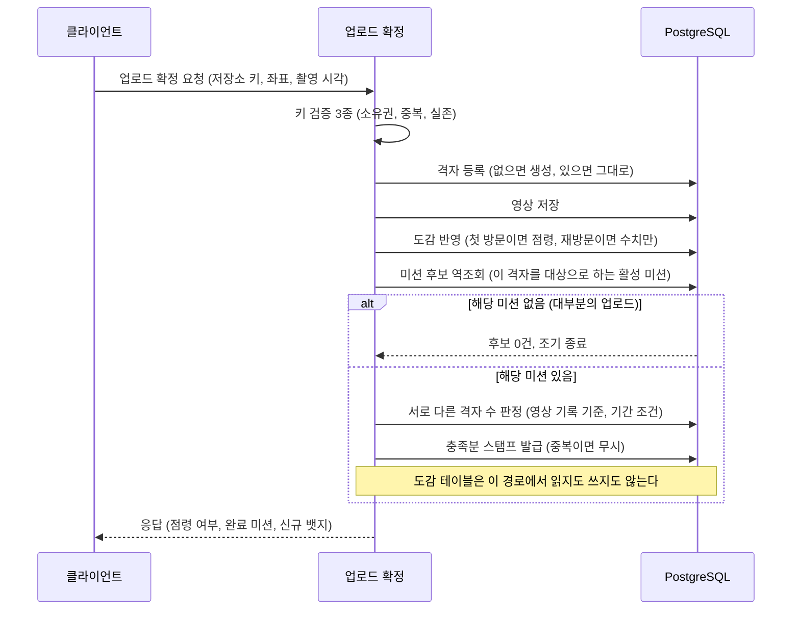

# PRD: 도감과 미션

> 작성일: 2026-08-10 · 작성: prd-writer (MSG-359 역산)
> 상태: 역산 (사후 문서. 구현이 이미 끝난 기능의 요구사항을 스펙과 위키 결정에서 복원했다)
> 커버 티켓: MSG-66, MSG-71, MSG-72, MSG-127, MSG-132, MSG-152, MSG-153, MSG-167, MSG-243, MSG-246, MSG-166, MSG-222, MSG-223, MSG-224, MSG-225, MSG-235, MSG-219(에픽)
> 관련 SRS: COLLECT 영역 (FR-COLLECT-01 ~ 12), MISSION 영역 (FR-MISSION-01 ~ 13)

## 1. 문제 상황

FillMap에는 사용자가 무언가를 모으는 축이 둘 있다. 하나는 도감이고 하나는 스탬프북이다. 둘 다
"영상을 올리면 늘어난다"로 보이기 때문에 처음 보는 사람은 같은 것의 두 표현이라고 읽는다. 실제로는
반대로 설계돼 있다. 도감은 지금 내가 가진 영상이 만드는 **상태**라서 영상을 다 지우면 되돌아가고,
스탬프는 그때 거기서 찍었다는 **사실 기록**이라서 영상을 지워도 남는다.

이 비대칭은 실수가 아니라 두 번의 명시적 판단에서 나왔다. 미션 판정을 도감 테이블이 아니라 영상
테이블로 하기로 한 2026-07-20 설계검토, 그리고 스탬프를 비회수로 못박은 2026-07-23 결정이다. 둘 다
"작년 기록으로 올해 스탬프가 자동 발급되는 결함"과 "미션이 끝나면 다시 계산할 수 없다"는 서로 다른
문제를 각각 막으려고 내린 결정이었다.

그런데 지금 레포에는 결론만 남아 있다. 스키마에는 `user_missions`가 `user_grids`와 따로 있고,
판정 쿼리는 `videos`를 보고, 삭제 경로에는 스탬프 회수 훅이 없다. 왜 그런지는 위키의 결정 문서와
회의록에 흩어져 있어서, 새로 합류한 사람이 "미션을 깼는데 왜 도감이 안 늘지"를 물으면 코드를
역독해해야 답이 나온다. 도감 쪽도 사정이 같다. 점령 롤백에 24시간 제한을 두려다 폐기한 이력,
동시 삭제가 남의 격자를 지운 사건, 갤러리에 행정동 이름을 붙일지를 놓고 축이 세 번 바뀐 과정이
전부 스펙 본문의 정정 문단에만 있다.

## 2. 목적 · 목표

- **목적**: 도감과 미션이 왜 분리된 축인지, 그리고 두 축의 규칙이 왜 서로 다른지를 근거와 함께
  한 문서에서 따라갈 수 있게 한다.
- **목표**:
  - 도감 규칙(점령, 롤백, 대표 영상, 요약과 갤러리)이 어느 판단에서 나왔고 무엇을 검토하다
    버렸는지가 남는다.
  - 미션 규칙(판정 근거, 스탬프 비회수, 유형별 적재)이 도감 규칙과 어디서 갈라지는지가 드러난다.
  - 지금도 확정되지 않은 항목과, 확정처럼 적혀 있지만 사실은 시작안인 항목이 구분된다.
- **비목표**:
  - 요구사항 문장의 정본이 되는 것. 그것은 `docs/srs.md`이고 이 문서는 ID로 참조만 한다.
  - 구현 방법. 쿼리 형태, 인덱스, 트랜잭션 경계는 각 스펙 문서와 `.claude/docs/status.md`가 정본이다.
  - 친구 도감 레이어. 남의 도감을 보는 기능은 FRIEND 영역이고 `docs/prd/MSG-187-prd.md`가 다룬다.
  - 미션 적재 3종의 상세 요구사항. 축제와 코스는 `docs/prd/MSG-219-mission-prd.md`, 팝업은
    `docs/prd/MSG-235-prd.md`가 이미 정본이라 여기서는 결정의 맥락과 기각한 대안만 다룬다.
  - 뱃지와 스트릭. 미션 스탬프가 뱃지 축을 건드리는 접점만 5.15절에서 짧게 잇는다.
  - 격자 바텀시트의 길찾기 버튼. 넣지 않는다. 2026-07-23 기획회의의 "필요 없다"가 유효하고
    설계검토 문서의 길찾기 CTA를 폐기한다는 것이 2026-08-10 성민 확인이다. 지도 앱으로 넘기는
    버튼은 체류 시간을 깎고 사용자를 서비스 밖으로 내보낸다는 판단이다. 두 문서가 어긋난 채
    미해소로 남아 있던 배치도 이것으로 풀렸다.

## 3. 기능 요구사항

문장의 정본은 SRS다. 여기서는 어느 요구가 어느 결정에서 나왔는지를 잇는다.

### COLLECT: 점령과 개인 도감

| SRS ID | 요지 | 상태 | 어디서 정해졌나 |
|--------|------|------|----------------|
| FR-COLLECT-01 | 첫 영상이 격자를 점령하고 재방문은 수치만 올린다 | 구현됨 | MSG-66 D3, 5.1절 |
| FR-COLLECT-02 | 영상을 다 지우면 점령이 풀린다. 시간 제한 없음 | 구현됨 | 2026-07-16 확정, 5.3절 |
| FR-COLLECT-03 | 교체는 도감을 바꾸지 않는다 | 구현됨 | MSG-71 D2, 5.1절 |
| FR-COLLECT-04 | 대표 영상이 지워지면 가장 먼저 모은 영상으로 다시 뽑는다 | 구현됨 | MSG-72 D4 |
| FR-COLLECT-05 | 전역 격자 등록은 영구다 | 구현됨 | MSG-72 D5, 5.1절 |
| FR-COLLECT-06 | 동시 삭제가 점령을 잘못 풀지 않는다 | 구현됨 | MSG-243 (2026-07-30), 5.4절 |
| FR-COLLECT-07 | 도감 요약 세 지표를 한 번에 준다 | 구현됨 | MSG-152, MSG-246, 5.7절 |
| FR-COLLECT-08 | 갤러리는 최근 30칸에서 멈춘다 | 구현됨 | 2026-07-22 PO 확정, 5.5절과 5.6절 |
| FR-COLLECT-09 | 갤러리 각 칸에 행정동 이름이 실린다 | 구현됨 | MSG-167 D4, 5.7절 |
| FR-COLLECT-10 | 행정동 단위로 내 영상 전체를 본다 | 구현됨 | MSG-167 D3 |
| FR-COLLECT-11 | 격자 하나의 내 영상 목록을 본다 | 구현됨 | MSG-127, 5.6절 |
| FR-COLLECT-12 | 도감은 본인 데이터만 반영한다 | 구현됨 | MSG-152 성공기준 6 |

### MISSION: 미션과 스탬프

| SRS ID | 요지 | 상태 | 어디서 정해졌나 |
|--------|------|------|----------------|
| FR-MISSION-01 | 활성 미션 전체를 한 번에 받아 지도에 그린다 | 구현됨 | MSG-222 D1과 D2, 5.12절 |
| FR-MISSION-02 | 기간 양끝을 따로 보고 비면 상시다. 없으면 빈 목록 | 구현됨 | MSG-222 도메인 2 |
| FR-MISSION-03 | 판정 근거는 영상 기록이지 도감이 아니다 | 구현됨 | 2026-07-20 설계검토, 5.9절 |
| FR-MISSION-04 | 스탬프는 사용자당 하나고 회수되지 않는다 | 구현됨 | 2026-07-23 결정, 5.10절 |
| FR-MISSION-05 | 스탬프는 도감과 완전히 분리된다 | 구현됨 | MSG-166 D8, 5.9절 |
| FR-MISSION-06 | 완료 미션은 업로드 응답에 실린다 | 구현됨 | 2026-07-30 성민 확정 |
| FR-MISSION-07 | 스탬프 발급 시 합산 미션 뱃지 판정 | 폐기됨 | FR-BADGE-12가 대체, 5.15절 |
| FR-MISSION-08 | 축제는 9×9 격자에 목표 1이고 좌표와 기간으로 중복을 가른다 | 구현됨 | MSG-224 D3, 5.14절 |
| FR-MISSION-09 | 코스는 표시 경로와 판정 스팟을 나눠 저장하고 5~8곳 중 3곳이면 완료다 | 구현됨 | 2026-07-23 결정, 수치는 2026-08-10 성민 확인으로 확정, 5.13절 |
| FR-MISSION-10 | 팝업은 주 1회 수동 갱신이고 종료분은 스탬프만 남긴다 | 구현됨 | MSG-235 D3과 D4, 5.14절 |
| FR-MISSION-11 | 갱신은 수동이고 실패해도 기존 미션이 남는다 | 구현됨 | 2026-07-30 성민 확정, 5.15절 |
| FR-MISSION-12 | 스탬프 목록은 별도 화면이 아니라 뱃지 상세에 붙는다 | 계획 | 2026-08-10 성민 확인, 후속 티켓 MSG-369, 5.15절 |
| FR-MISSION-13 | 미션은 지도에 보이는 영역 안의 것만 노출하되 거리 반경은 종류마다 다르게 잡는다 | 계획 | 2026-07-20 설계검토. 종류별 반경 방식은 2026-08-10 성민 확정, 구현은 MSG-368. 반경 값 자체는 미정(7절) |

## 4. 비기능 요구사항

이 묶음에 실제로 걸린 것만 적는다. 전역 항목은 SRS 5장이 정본이다.

| 분류 | 요구사항 | 근거 |
|------|----------|------|
| 성능 | 미션 판정이 업로드 응답 경로에 얹히므로, 미션과 무관한 격자(대부분의 업로드)는 역조회 한 번으로 끝나야 한다 | MSG-223 성공기준 2 |
| 성능 | 도감 조회 경로에서 공간 연산을 하지 않는다. 행정동 라벨은 쓰기 시점에 확정한 값을 읽는다 | NFR과 FR-REGION-12, 5.7절 |
| 데이터 정합 | 같은 격자의 영상을 동시에 지워도 영상 수 감소는 정확히 한 번이다 | NFR-DATA-04, 5.4절 |
| 데이터 정합 | 미션 시드 적재는 여러 번 실행해도 같은 상태로 수렴한다 | NFR-DATA-03 |
| 보안 | 스탬프 발급을 클라이언트가 직접 요청하는 API는 없다. 업로드 확정의 서버 내부 파생만 존재한다 | MSG-219 PRD 4장 |
| 보안 | 업로드 확정은 저장소에 실제로 올라온 파일인지, 그 파일이 요청자 소유인지를 확인한 뒤에만 점령을 반영한다 | MSG-132, 5.2절 |
| 운영 | 미션 데이터 적재는 설정 플래그로 닫혀 있고 평시 기동에 영향을 주지 않는다 | NFR-OPS-06 |

## 5. 왜 이렇게 정했나

### 5.1 도감은 상태고 방문은 이벤트다

가장 먼저 정한 것은 테이블을 나눈다는 것이다. `videos` 한 행이 방문 한 번이고, `user_grids`
한 행이 "이 사람이 이 칸을 가졌다"는 상태다. 영상 다섯 개를 같은 칸에 올려도 도감은 한 칸만 는다.

이 분리가 있어야 성립하는 규칙이 셋이다. 첫째, 교체는 도감을 건드리지 않는다. MSG-71이 새 행을
만드는 대신 기존 행의 파일 참조만 갈아 끼우는 방식(스펙 표현으로 정책 B)을 택한 것도 같은 이유다.
행이 그대로면 영상 수와 점령 여부가 자연히 불변이라 도감 쪽에 예외 처리가 필요 없다. 이력 보존이
되는 방식은 MVP에 쓸 데가 없어 버렸다.

둘째, 격자 자체의 등록과 개인의 점령이 갈라진다. `grids` 행은 누군가 처음 그 칸에 영상을 올릴 때
생기고 이후 지워지지 않는다. 개인이 영상을 다 지워 점령이 풀려도 격자 등록은 남는다. 격자는 좌표만
있으면 계산되는 논리적 개념이라 행의 존재 여부가 "누군가 왔다 갔다"는 사실 이상을 뜻하지 않기
때문이다.

셋째, 미션이 도감을 건드리지 않고도 판정될 수 있다. 이건 5.9절에서 따로 다룬다.

### 5.2 파일 없이 지도를 칠할 수 있었던 사건

2026-07-16에 발견된 결함이다. 업로드 확정 API가 클라이언트가 보낸 저장소 키를 검증 없이 저장했고,
점령 반영이 인코딩 트리거보다 먼저 일어났다. 그래서 파일을 한 번도 올리지 않고 좌표만 반복해서
보내면 지도 전체를 자기 색으로 칠할 수 있었다. 인코딩이 실패해도 점령은 이미 남은 뒤였다.

수정은 확정 진입부에 검증 셋을 두는 것이었다. 키 앞부분으로 소유권을 보고, 중복 여부를 보고,
저장소에 실제로 객체가 있는지 확인한다. 앞부분 검사만으로는 못 막는다는 것이 조사에서 나온 결론이다.
공격자가 자기 사용자 번호를 알고 있어서 형식만 맞춘 키를 얼마든지 만들 수 있기 때문이다. 앱 쪽
중복 검사와 DB 유니크 제약을 둘 다 둔 것도 역할이 달라서다. 앱 검사는 사용자에게 4xx를 돌려주는
용도이고, 제약은 동시 요청에 대한 마지막 방어선이다.

이 사건이 도감 요구사항에 남긴 것은 "점령은 검증된 업로드의 결과여야 한다"는 순서다. MSG-71 교체
경로에도 같은 검증을 넣은 것이 그 연장이다. 교체에 검증이 없으면 아무 영상이나 하나 올린 뒤
가짜 키로 바꿔치기하는 옆문이 열린다.

### 5.3 점령 롤백에 시간 제한을 두려다 폐기했다

초기 설계에는 "삭제 24시간 규칙"이 있었다. 업로드 후 24시간 안에 지우면 즉시 점령이 풀리고,
그 이후는 미확정으로 남겨 둔 상태였다. 2026-07-16에 이 규칙을 폐기했다.

폐기 이유는 두 가지다. 하나는 규칙이 코드에 존재한 적이 없다는 것이다. 구현은 처음부터 시간 분기
없이 언제 지우든 롤백했고, MVP는 동일 처리라고 적혀 있었다. 남아 있던 것은 문서뿐이었다. 다른
하나는 규칙 자체가 다른 확정과 충돌한다는 것이다. 용어집은 영상을 "업로드 후 수정과 삭제 자유"로
정의하는데, 삭제에 시간 제한을 걸면 24시간이 지난 영상은 지울 수 있지만 도감에서는 빠지지 않는
상태가 된다. 사용자가 지운 기록이 지도에 남는 셈이라 자유롭게 지운다는 정의와 어긋난다.

그래서 결론은 시간 제한 없음이고, 교체도 같다. 이 시점에 용어집의 24시간 서술과 에이전트 정의
문서의 "24시간 교체" 표현을 함께 정리했다. 지라 티켓 본문에는 아직 옛 서술이 남아 있는데,
레포 문서가 정본이라는 판정도 이때 같이 적어 뒀다.

같은 날 삭제된 파일의 처리도 뒤집혔다. 원래는 "즉시 지우지 않고 정리는 별도 배치"였는데, 다시
보니 배치를 만들 이유가 없었다. 되살리기 기능이 없어서 남길 이유가 없고, 오히려 사용자가 지운
영상이 저장소에 영원히 남는 것이 문제였다. 커밋 직후 한 번 지우는 쪽이 스케줄러와 실패 처리와
모니터링을 전부 없앤다. 실패하면 로그만 남긴다. 이미 커밋된 삭제를 500으로 되돌릴 수는 없고
남은 객체는 비용 문제일 뿐이기 때문이다.

### 5.4 동시 삭제가 남의 격자를 지웠다

2026-07-24 교차 리뷰에서 나온 결함이다. 같은 영상에 삭제 요청이 두 건 동시에 들어오면 둘 다
"아직 안 지워졌다"는 스냅숏을 보고 통과해서 영상 수가 두 번 줄었다. 그 격자에 다른 영상이 살아
있는데도 수치가 0이 되어 점령이 풀렸다. 사용자 입장에서는 영상 하나를 지웠는데 도감에서 칸이
사라지는 데이터 유실이다.

수정안은 둘이었다. 조건부 갱신으로 "아직 살아 있는 행만 바꾼다"를 쓰거나, 행 잠금[^1]으로 전이
자체를 한 줄로 세우거나. 조건부 갱신을 버린 이유가 이 결정의 값어치다. 티켓 문구대로 "상태가
활성인 행만"이라고 쓰면 새 결함이 생긴다. 블라인드 처리된 영상도 삭제할 수 있는데, 그 영상은
업로드 때 수치를 올렸으므로 지울 때 내려야 한다. 조건에 걸러지면 감소가 누락되고, 남은 유령
수치 때문에 점령이 영원히 풀리지 않는다. 올바르게 쓰려면 "삭제된 것이 아닌 행만"이라고 써야
하는데, 잠금 방식은 이 함정 자체가 없다. 기존 멱등[^2] 가드가 그대로 경합에 안전해진다.

이미 같은 행을 같은 방식으로 잠그는 코드가 AI 처리 폴러에 있어서 새 쿼리도 필요 없었다. 저장소
작업은 전부 커밋 이후로 밀려 있어 잠금 구간이 길어지지도 않는다.

### 5.5 도감 첫 화면을 격자 목록으로 정했다

2026-07-22 PO 확정이다. 도감에 들어가면 최근에 모은 격자 목록이 먼저 나오고, 현재 위치 기준
수집률 패널이 함께 뜬다. 검토했다가 버린 안이 셋이다.

첫째, 행정동이나 시군구 목록을 첫 화면에 나열하는 안. 디자인 시안 4판의 "지역별 수집 현황"이 이
형태였는데 격자 중심 UX로 대체했다. 시안 갱신이 필요하다는 것도 이때 함께 기록됐다. 둘째,
시군구 상위 집계 API. 재료가 되는 상위 코드 연결은 준비돼 있지만 MVP 이후로 미뤘다. 셋째,
수집률 응답에 지도 이동용 좌표를 싣는 안. 격자 목록 항목이 이미 행과 열 번호를 갖고 있어 지도
이동은 그쪽이 담당하면 된다.

수집률 조회 형태에서도 한 번 갈렸다. 프론트가 좌표를 행정동으로 바꾸고 다시 통계를 부르는 두 번
호출 방식과, 서버가 좌표든 격자든 받아서 한 번에 답하는 방식이 후보였다. 후자를 택한 결정적
이유는 격자 클릭을 프론트가 재현할 수 없다는 것이다. 격자가 어느 행정동인지는 격자 중심점을 기준으로
판정하는데, 그 규칙과 동점 처리 순서는 서버 내부 규칙이라 클라이언트가 흉내 내면 어긋난다.

### 5.6 최근 30칸에서 멈추고 페이지네이션을 붙이지 않았다

갤러리는 30칸 고정이고 더 보기가 없다. 31번째 격자는 이 목록에 나오지 않는 것이 정상 동작이다.
이건 성능을 위한 안전 상한이 아니라 의도한 "최근" UX라는 점이 스펙에 명시돼 있다. 정렬되지 않은
데이터를 조용히 잘라내는 상한과는 성격이 다르다는 뜻이다. 전체 도감을 훑는 화면은 별도 티켓으로
남겼다.

정렬 축에서 한 번 고민이 있었다. 최초 수집 시각으로 정렬할지, 마지막 업로드 시각으로 정렬할지다.
후자를 버린 이유는 용어 정의다. 수집은 첫 업로드를 뜻하므로 재방문은 새 수집이 아니고, 활동순으로
정렬하면 재방문할 때마다 갤러리 순서가 흔들려 "언제 모았나"라는 축이 무너진다. 다만 "최근"을
활동순으로 읽을 여지가 있어 스펙은 이 항목을 확인 요청으로 남겨 뒀고, 이후 뒤집힌 기록은 없다.

격자 하나를 눌렀을 때 나오는 내 영상 목록에도 페이지네이션을 넣지 않았다. 뷰포트 조회에 커서
방식을 도입한 이유는 화면 하나에 격자가 수만 개까지 들어올 수 있어서였는데, 100m짜리 칸 하나에
같은 사람이 올린 영상은 현실적으로 수 개에서 수십 개다. 그 압력이 없으니 전체를 한 번에 준다.
잘못된 격자 번호를 보내도 오류를 만들지 않고 빈 목록을 돌려주는데, 이건 "격자는 언제나 존재하는
논리적 개념"이라는 규칙과 맞물린 처리다. 아직 아무도 안 간 칸을 조회하는 것과 결과가 같다.

### 5.7 행정동 라벨의 축이 세 번 바뀌었다

도감이 보여 주는 "역삼1동" 같은 이름을 어디서 가져올지가 세 번 뒤집혔다. 이 이력이 남을 값어치가
있는 이유는, 뒤집힌 이유가 매번 다르고 그 각각이 다음 판단의 근거가 됐기 때문이다.

처음(MSG-152)에는 영상의 업로드 좌표에 붙은 행정동 코드를 세기로 했다. 다음(MSG-153)에는 갤러리
목록에서 라벨을 아예 빼기로 했다. 30칸마다 공간 연산을 돌리면 조회 경로에서 공간 연산을 하지
않는다는 원칙을 정면으로 어기고, 그때 영상 좌표 축은 값을 채우는 코드가 없어 전부 비어 있어서
쓸 수조차 없었기 때문이다. 그 다음(MSG-167)에 라벨이 필요하다고 확정되면서 격자 자체에 행정동
코드를 붙이는 쪽으로 갔다. 저장 위치를 사용자별 점령 행이 아니라 격자 행으로 정한 근거가 명확하다.
격자 번호가 정해지면 행정동도 정해지므로, 점령 행에 넣으면 그 칸을 가진 사람 수만큼 같은 값이
중복된다.

마지막(MSG-246)은 결함 수정이었다. 도감 요약의 "방문한 행정동 수"가 모든 사용자에게 항상 0이었다.
세고 있던 컬럼을 채우는 코드가 없었기 때문이다. 이때 라벨을 채우는 대신 세는 축을 격자 쪽으로
옮겼다. 축을 둘로 두면 경계 근처에서 "라벨은 역삼1동인데 수집률은 역삼2동에 잡히는" 어긋남이
생기는데, 하나로 통일하면 그 문제가 아예 사라진다. 이 정정으로 위키의 데이터 축 표가 낡았다는
사실도 함께 기록됐다.

### 5.8 도감 요약에서 게임화 지표를 뺐다

요약 응답은 점령한 칸 수, 올린 영상 총합, 방문한 행정동 수 셋뿐이다. 스트릭이나 뱃지 수치는 필드
자체를 두지 않았다. 지금 스트릭은 집계와 저장까지만 구현돼 있고 노출 경로가 없는데(FR-STREAK-08),
그 노출을 도감 요약이 맡을지는 정해지지 않았다. 요약에 자리만 만들어 두면 비어 있는 필드가
계약이 되므로 만들지 않았다.

### 5.9 미션이 도감을 건드리지 않는 이유

미션 판정의 근거는 `videos`이고 `user_grids`가 아니다. 2026-07-20 설계검토에서 정한 것이고,
스키마 티켓은 이 원칙을 "가짜 격자 삽입 절대 금지"라고 적어 뒀다.

두 가지를 동시에 막는 결정이다. 하나는 오발급이다. 도감으로 판정하면 작년에 그 동네를 지나며
찍어 둔 기록만으로 올해 축제 스탬프가 자동으로 나온다. 점령은 한 번 생기면 남는 상태라 "언제"라는
정보가 없기 때문이다. 영상 기록에는 촬영 시각이 있어 기간 조건을 걸 수 있다. 다른 하나는 도감
오염이다. 미션을 깼다고 도감에 칸을 채워 주면 사용자가 가지 않은 칸이 자기 색으로 칠해진다.
도감은 내가 찍은 영상이 만든 것이라는 정의가 그 순간 깨진다.

그래서 완료 판정은 도감 상태를 읽지도 쓰지도 않는다. 대상 격자 중 서로 다른 칸 몇 곳에 내 영상이
있는지만 센다. 같은 칸을 여러 번 찍어도 진행이 늘지 않는 것은 이 "서로 다른"에서 나온다.

### 5.10 스탬프는 회수되지 않고 점령은 풀린다

같은 영상을 지웠을 때 도감에서는 칸이 빠지고 스탬프는 남는다. 2026-07-23에 명시적으로 정한
비대칭이다.

이유는 두 축이 답하는 질문이 다르기 때문이다. 도감은 "지금 내가 가진 것"이라 현재 상태를 반영해야
하고, 스탬프는 "그때 거기 갔었다"는 사건 기록이라 사후에 바뀌면 뜻이 없어진다. 여기에 복원
불가능성이 하나 더 얹힌다. 축제 미션은 기간이 끝나면 판정 자체가 다시 돌지 않으므로, 한 번 회수한
스탬프는 다시 계산해서 되살릴 방법이 없다. 도감은 언제든 영상을 다시 올리면 복구되는 것과 다르다.

이 원칙이 스키마에도 박혀 있다. 스탬프 행이 미션 정의를 참조하는 외래 키가 연쇄 삭제가 아니라
제한이라서, 누군가 스탬프를 받은 미션은 데이터베이스가 하드 삭제를 막는다. 팝업 정리 배치가
"종료됐지만 스탬프가 남은 것은 지우지 않는다"로 동작하는 것도 이 제약을 그대로 따른 결과다.

동시 업로드로 같은 미션이 두 번 판정돼도 스탬프가 하나인 것은 복합 기본 키가 보장한다. 발급
로직은 충돌 시 무시하는 삽입을 쓰고, 실제로 삽입에 성공한 것만 응답에 담는다.

### 5.11 판정 시각은 업로드 시각이 아니라 촬영 시각이다

티켓 본문에는 "업로드 시각"이라고 적혀 있었는데 그런 컬럼이 없었다. 후보는 촬영 시각과 서버
저장 시각 둘이었고 촬영 시각으로 확정했다.

근거는 미션의 의미다. 작년 축제 때 찍은 갤러리 영상을 올해 축제 기간에 올리면 저장 시각 기준으로는
통과하지만 촬영 시각 기준으로는 걸러진다. "그 기간에 그곳에서 찍었다"가 축제 미션이 뜻하는 바다.
한계는 그대로 수용했다. 촬영 시각은 갤러리 메타데이터에서 온 클라이언트 신고값이라 위조할 수
있는데, 이건 좌표를 믿는 것과 같은 등급의 문제라 MVP에서는 받아들였다. 보안 요구는 "발급을 직접
호출하는 API를 두지 않는다"까지다.

트리거도 업로드 확정 하나로 좁혔다. 삭제는 회수가 없으니 훅이 필요 없고, 교체는 격자가 바뀌지
않으므로 판정 대상이 아니다. 갱신된 촬영 시각은 다음 업로드가 부른 판정이 읽는다.

### 5.12 유형이 여섯인데 판정 쿼리는 하나다

미션 유형은 코스, 구역, 축제, 테마, 지속, 팝업 여섯이다. 설계검토가 처음부터 못박은 것이
"유형별 전략 클래스 금지"였다. 판정은 유형과 무관하게 "대상 격자 중 서로 다른 칸에 목표 수만큼
영상이 있는가" 하나로 끝나고, 유형이 하는 일은 목표 수와 대상 격자 집합을 다르게 채우는 것뿐이다.
축제와 팝업은 목표가 1이고, 코스는 3이다.

조회 응답에서만 유형이 갈린다. 지도에 무엇을 그릴지가 다르기 때문이다. 축제와 팝업은 사각형,
코스는 경로, 테마와 지속은 격자 점 배열, 구역은 행정동 코드다. 이것도 유형별 클래스가 아니라
응답 형태 네 가지를 담는 봉인된 타입으로 처리했다. 로직은 서비스 한 곳의 분기 하나다.

여기서 버린 것이 둘이다. 응답을 유형별 그룹 맵으로 주는 안은 유형이 늘 때마다 최상위 형태가
바뀌고 빈 그룹 키가 남아서 버렸다. 구역 미션에 행정동 경계 도형을 실어 주는 안은 경계가
수백 킬로바이트에서 메가바이트에 이르러 전역 캐시 응답에 담을 수 없어 코드만 준다.

팝업 표시 방식은 회의와 스펙이 한 번 어긋났다. 2026-07-23 회의는 팝업을 마커로 그리자고 했는데
서버 응답은 사각형으로 통일했다. 사각형의 중심은 산술 평균으로 즉시 나오므로 마커로 그릴지 면으로
그릴지는 화면 쪽 선택이고, 서버에 점 형태를 하나 더 만들면 응답 계약과 렌더러 계약을 둘 다
넓히면서 얻는 것이 없다는 판단이었다.

### 5.13 코스 미션은 완주를 요구하지 않는다

처음 설계는 코스가 지나는 격자를 전부 대상으로 넣고 그중 10퍼센트를 채우면 완료였다. 남파랑길
3코스를 실측하니 14.7킬로미터에 166칸이었다. 2026-07-23에 이 방식을 폐기하고 포토스팟[^3]
방식으로 바꿨다.

바꾼 이유는 프레이밍이다. "166칸 중 17칸"은 걷기를 증명하라는 요구로 읽히는데, FillMap이 하려는
것은 장면 수집이다. 그래서 명소 성격의 스팟만 5곳에서 8곳 사이로 골라 대상 격자에 넣고, 그중
3곳에서 찍으면 완료로 친다. 완주를 강요하지 않는다는 것이 이 결정의 요지다.

여기서 저장이 둘로 갈린다. 지도에 그리는 경로는 미션 행의 폴리라인[^4]으로 두고, 판정에 쓰는
격자는 스팟 5곳에서 8곳만 별도 테이블에 넣는다. 코스가 지나는 격자 전체는 어디에도 저장하지
않는다. 그 집합은 스팟을 경로 위로 붙이는 계산의 중간 산출물일 뿐이다.

경로를 도형 타입이 아니라 JSON으로 저장한 것도 같은 맥락이다. 경로는 표시용이라 공간 연산을 하나도
쓰지 않는데, 도형 타입의 유일한 가치가 공간 연산과 그 인덱스다. 프론트가 GeoJSON을 그대로
소비하므로 JSON으로 두면 읽을 때 변환이 없다.

스팟 선정에서 수동 큐레이션을 0으로 둔 것도 명시적 결정이다. 관광 API로 주변 명소를 교차하고,
그 좌표를 경로 위 가장 가까운 점으로 붙이고, 명소가 없는 구간은 시작점과 끝점과 균등 중간점으로
채운다. 사람이 고르기 시작하면 148개 코스에 스케일이 안 나온다.

5곳에서 8곳, 그중 3곳이라는 수치는 확정이다(2026-08-10 성민 확인). 원래는 "일단 이걸로 착수하고
나중에 기획이 조정하는 전제"로 잡은 시작안이었는데, 두루누비 148개 코스가 이미 그 기준으로 적재를
마친 상태라 그대로 확정으로 굳었다. 스펙과 PRD에 달려 있는 기획 조정 전제 단서는 이제 유효하지
않다. 나중에 조정할 일이 생기면 미션 행의 목표 수만 바꾸면 되고 스키마와 코드는 그대로라는 점은
변함이 없다.

무기간으로 둔 것도 코스의 성격에서 나왔다. 둘레길은 언제 가도 거기 있어서 기간을 걸 이유가 없고,
기간이 없으면 과거에 찍어 둔 영상도 판정에 들어온다. 판정 쿼리가 기간 조건을 "비어 있으면 생략"
형태로 갖고 있어서 코드는 한 줄도 바뀌지 않았다. 다만 시드를 넣는 순간 전 사용자를 다시 판정하는
소급 발급은 하지 않기로 했다. 판정 트리거는 업로드 확정 하나뿐이라는 계약을 지키기 위해서다.
과거 영상만으로 이미 3곳을 채운 사람은 다음 스팟에 올리는 순간 스탬프를 받는다.

### 5.14 축제와 팝업이 같은 계열인데 출처 컬럼이 생겼다

축제와 팝업은 둘 다 한시 이벤트라 처음에는 같은 유형 하나로 묶었다. 2026-07-20 설계검토가
"팝업은 이벤트형에 통합, 별도 타입도 칩도 없음"으로 정했었다. 이 결정이 뒤집힌 계기는 미션 쪽이
아니라 지도 홈 개편이다. 2026-07-25에 상단 칩 네 개가 확정되면서 팝업 스토어가 독립 칩이 됐고,
"별도 칩이 없다"는 전제가 사라지자 유형 통합의 근거도 함께 사라졌다. 그래서 팝업 유형을 신설했다.

그런데 유형을 나누기 전에 이미 문제가 드러나 있었다. 2026-07-31 교차 리뷰에서 지적된 두 건이다.
축제 적재 러너가 종료된 축제를 정리할 때 유형으로만 자기 산출물을 찾으면 팝업까지 지운다.
그리고 축제의 중복 판정은 9×9 블록의 최소 좌표에 4를 더해 중심을 복원하는데, 격자 하나짜리
팝업에 이 계산을 하면 가짜 중심이 나와 진짜 축제를 건너뛴다. 유형만으로는 "이건 내가 넣은 것"을
가릴 수 없다는 것이 공통 원인이었다.

그래서 적재 출처 컬럼을 뒀다. 값이 비어 있으면 수동으로 넣은 것이고 어떤 러너의 정리 대상도
아니다. 안전한 기본값이다. 값에 CHECK 제약을 걸지 않은 것은 소스가 늘 때마다 마이그레이션을
강제하지 않기 위해서고, 엔티티에서 열거형이 아니라 문자열로 둔 것은 나중에 추가한 소스를 상수에
등록하는 것을 잊으면 조회 경로 전체가 역직렬화에서 터지기 때문이다. 미션 행은 여러 러너가
공유하는 데이터라 문자열이 안전하다.

팝업은 여기에 외부 식별자 컬럼을 하나 더 얹었다. 축제식 "좌표와 기간" 키를 쓰지 않은 이유가
분명하다. 팝업은 같은 건물에서 다른 팝업이 연달아 열리는 것이 일상이라 좌표와 기간으로 묶으면
서로 다른 팝업이 하나로 흡수된다. 수집 원본에 안정적인 식별자가 있으니 그것을 쓰고, 부분 유니크
인덱스[^5]로 데이터베이스가 한 번 더 받친다. 값이 없는 행(수동, 축제, 코스)은 인덱스 밖이라
영향이 없다.

정리와 적재의 순서도 축제와 팝업이 반대다. 축제는 적재하고 정리하지만 팝업은 정리하고 적재한다.
팝업은 식별자 하나가 키라서, 기간이 연장된 팝업을 먼저 지워 두면 같은 실행에서 새 기간으로 다시
들어와 노출 공백이 생기지 않는다.

### 5.15 미션 뱃지가 합산에서 종류별로 갈라졌다

스탬프를 받을 때 미션 뱃지 판정이 함께 돈다. 처음(2026-07-30)에는 종류를 가리지 않고 스탬프
총수 1개, 5개, 10개에 뱃지를 줬다. 2026-08-10에 축제, 코스, 팝업 종류마다 따로 세는 방식으로
바뀌었고 합산 뱃지 셋은 은퇴했다. 이 변경의 요구사항과 근거는 `docs/prd/MSG-363-prd.md`가 정본이라
여기서는 미션 쪽에 남은 사실만 적는다. 스탬프 발급 시점에 뱃지 판정이 붙는다는 구조 자체는
그대로 이어졌고, 화면에 대응 칩이 없는 구역, 테마, 지속 유형은 스탬프만 발급되고 어느 뱃지에도
집계되지 않는다.

스탬프를 사용자에게 어디서 보여줄지도 이 종류별 재편에 붙었다. 별도 스탬프북 화면을 만들지 않고,
도감 뱃지 탭에서 종류별 뱃지(축제 단골 등)를 누르면 그 종류로 다녀온 곳 목록이 열리는 형태다
(2026-08-10 성민 확인, 후속 티켓 MSG-369). 뱃지는 조건을 만족한 횟수의 집계이고 스탬프는 그 집계를
만든 원장이라, 상세를 열면 집계 뒤의 원장이 나오는 배치다. 탭을 하나 늘리는 안과 도감 요약 카드에
칸을 더하는 안은 기각했다. 화면 구조를 건드리지 않고 이미 있는 자리에 얹는 쪽을 골랐다. 뱃지 화면
쪽에서 본 같은 결정은 `docs/prd/badge-streak-prd.md` 4.6절에 있다.

### 5.16 미션 데이터 갱신에 스케줄러를 두지 않았다

축제는 2주에 한 번, 팝업은 주 1회, 코스는 분기에 한 번 갱신한다. 셋 다 사람이 실행한다. 앱에
상시 스케줄러를 두지 않기로 한 것은 2026-07-30 확정이다.

이유는 갱신의 성격이다. 원본 수집이 레포 밖 파이썬 파이프라인이고, 관광 API 키 관리와 호출량
분할이 필요하고, 결과 검수가 사람 눈을 거친다. 이 과정을 앱 기동 경로에 넣으면 외부 API 장애가
곧 기동 실패가 된다. 그래서 앱은 완성된 산출물 파일을 읽어 적재만 하고, 그 적재조차 설정
플래그가 꺼진 상태가 기본이다. 플래그를 켜고 한 번 띄우면 끝난다.

갱신 실패가 기존 미션을 지우지 않는 것도 같은 맥락이다. 한 실행이 통째로 하나의 트랜잭션이라
중간에 실패하면 아무것도 바뀌지 않는다. 부분 삭제로 지도에 공백이 생기는 상황을 만들지 않는다.

## 6. 업로드 하나가 두 축을 어떻게 나눠 건드리는가

도감과 미션이 같은 업로드에서 갈라지는 지점이다.

## 7. 미확인

근거를 찾지 못했거나 문서끼리 어긋나 있어 이 문서가 답을 만들지 않은 항목이다. 이후 확인으로
답이 정해진 것은 행을 지우지 않고 상태를 해소로 바꿔 결론과 출처를 그 자리에 남긴다.

| 무엇 | 상태 | 근거 |
|------|------|------|
| 미션 노출 반경과 정렬 기준 | 해소(방식) · 미정(값) | 지도에 보이는 영역으로 자르되 종류마다 다른 반경을 쓰는 것으로 확정했다(2026-08-10 성민 확인). 팝업은 도심에 밀집해 가까운 것만 의미가 있고, 코스는 하나가 수 킬로미터에 걸쳐 있어 같은 기준으로 자르면 경로 중간만 걸린 코스가 통째로 사라진다. 구현은 MSG-368이다. **반경 값과 정렬 기준은 여전히 미정**이고 FE와 상의해 정한다. 설계검토가 적었던 10~20킬로미터는 종류 구분이 없던 시절의 값이다 |
| 격자 밖에서 보이는 행동 버튼 | 해소 | 길찾기 버튼은 넣지 않는다. 2026-07-23 회의의 "필요 없다"가 유효하고 설계검토 쪽을 폐기한다는 2026-08-10 성민 확인으로 두 문서의 배치가 풀렸다. 2절 비목표 |
| 스탬프 목록을 어디에 둘지 | 해소 | 별도 스탬프북 화면 대신 뱃지 상세에 붙인다(2026-08-10 성민 확인). 후속 티켓 MSG-369, 5.15절 |
| 코스 스팟 수와 목표 수 | 해소 | 5~8곳 중 3곳으로 확정했다(2026-08-10 성민 확인). 두루누비 148개 코스가 이미 그 기준으로 적재돼 있다. 5.13절 |
| 지속 유형의 표시 형태 | 스펙 판단 | 격자 점 배열로 두었으나 기획 확인을 거치지 않았다. 지금 이 유형의 데이터가 0건이라 드러나지 않는다 |
| 코스 경로가 개편됐을 때의 갱신 | 한계 수용 | 제목으로 중복을 가르므로 기존 미션의 경로와 스팟은 자동으로 갱신되지 않는다. 스탬프가 걸린 미션은 구버전이 남는다 |
| 도감 화면의 지표 문구 | 미정 | 시안의 "담수율 73%"가 시안 오류로 확인됐고 대체 지표가 정해지지 않았다 |

## 8. SRS 갱신 후보

SRS에 없는 요구를 발견한 것이다. 이 문서는 표에 넣지 않았고 등재 여부는 `srs-writer`가 판단한다.

1. **갤러리 대표 썸네일은 유효기간 10분의 사전서명 URL[^6]이다.** FR-COLLECT-08은 "대표 썸네일과
   함께 준다"까지만 적고 있는데, 실제로는 저장소 키가 아니라 서명된 임시 주소가 내려간다. 버킷이
   비공개라 서명이 유일한 열람 수단이라는 것이 근거다. 만료가 있으므로 클라이언트 캐시 정책에
   영향을 준다.
2. **미션 판정에는 블라인드 처리된 영상도 집계된다.** 판정 쿼리는 삭제된 영상만 제외한다.
   FR-MOD-08이 "블라인드는 점령과 영상 수에 영향을 주지 않는다"까지 정해 뒀지만 스탬프 판정에
   대해서는 어느 요구도 말하지 않는다. 운영 조치가 스탬프에 영향을 주지 않는다는 것이 의도된
   동작인지 확인이 필요하다.
3. ~~코스 미션의 스팟 수와 목표 수가 시작안이라는 사실.~~ **철회한다.** FR-MISSION-09가
   "5~8곳 중 3곳"을 확정 요구로 적은 것이 맞다. 2026-08-10 성민 확인으로 이 수치가 확정돼 SRS에
   시작안 표기를 더할 이유가 사라졌다. 남은 일은 스펙과 PRD에 달린 기획 조정 전제 단서를 걷는
   것이고, 이 문서 5.13절은 처리했다.
4. **미션 유형 6종 중 실제로 데이터가 있는 것은 3종이다.** 스키마는 6종을 수용하고 조회는 6종을
   그릴 수 있지만, 시더는 축제와 코스와 팝업만 있어 구역, 테마, 지속은 데이터가 0건이다. SRS
   미해결 표의 "미션 MVP 범위"는 이 사실을 미정으로 적고 있는데, 스키마 티켓에서는 2026-07-23에
   "당시 5종 그대로 간다"로 해소된 것으로 기록돼 있다(팝업은 이후 신설이라 6종이 됐다). 스키마
   수용 범위와 실제 서비스 범위가 다른 것을 구분해 적을 필요가 있다.

---

[^1]: 행 잠금. 데이터베이스가 특정 행을 읽으면서 다른 트랜잭션이 그 행을 건드리지 못하게 붙잡는 것. 같은 행을 동시에 고치려는 요청을 한 줄로 세운다.
[^2]: 멱등. 같은 요청을 여러 번 보내도 결과가 한 번 보낸 것과 같은 성질. 재시도와 재실행이 안전해진다.
[^3]: 포토스팟. 코스 위에서 사진이나 영상을 찍을 만한 명소로 고른 지점. 코스 전체가 아니라 이 지점들만 완료 판정의 대상이 된다.
[^4]: 폴리라인. 좌표 여러 개를 순서대로 이어 만든 선. 지도에 코스 경로를 그릴 때 쓴다.
[^5]: 부분 유니크 인덱스. 특정 조건을 만족하는 행에만 중복 금지를 거는 인덱스. 값이 비어 있는 행은 제약을 받지 않는다.
[^6]: 사전서명 URL. 비공개 저장소의 파일을 정해진 시간 동안만 열 수 있게 서버가 서명해 발급하는 주소.
