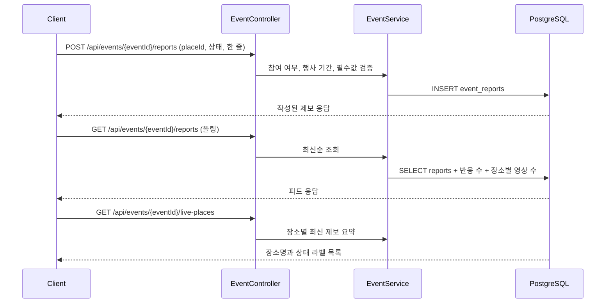
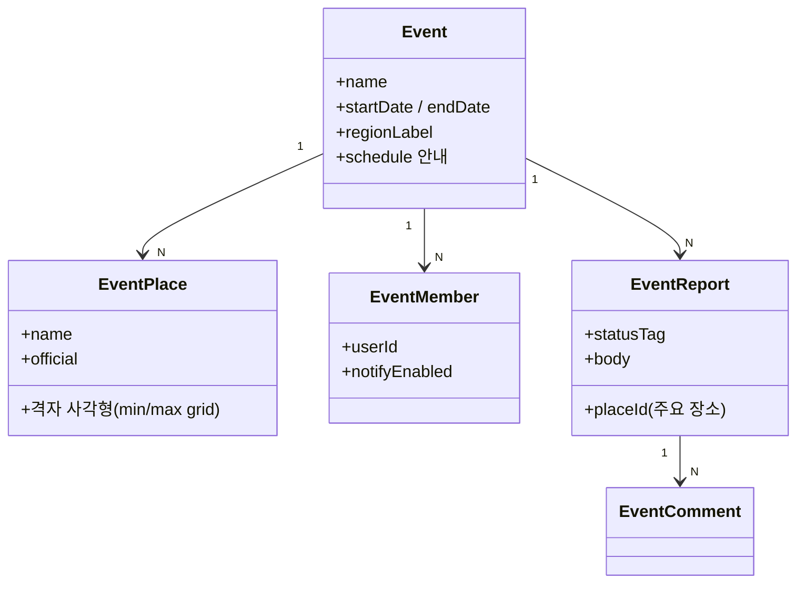

# PRD: 행사방 (행사 지도 모드)

> 티켓: MSG-436 (2026-08-20 발행) · 작성일: 2026-08-19 · 작성: prd-writer
> 상태: **폐기 — 정본 전환** (2026-08-20 정민 확정)
>
> 이 문서의 제보·참여 모델은 폐기됐다. 행사방 정본은
> [event-room-location-videos.md](event-room-location-videos.md)(위치별 영상 모델)이고, 세부
> 티켓은 MSG-438~443이다. 뷰포트 기준 행사 칩 노출과 시 칩 묶음(FR-1), 수동 시드 등재, 미션 축
> 연계 비목표 결정은 새 정본에 그대로 승계됐다. 이 문서는 결정 이력으로만 남긴다.

## 1. 문제 상황

포켓몬 메가페스타 부산처럼 한 도시에서 몇 주씩 열리는 대형 행사 기간에는 현장 정보 수요가
폭증한다. 어느 포토존이 덜 붐비는지, 굿즈샵 재고가 남았는지, 드론쇼 대기 줄이 얼마나 긴지는
공식 안내가 알려주지 못하고, 지금은 SNS 검색으로 흩어진 글을 뒤지는 수밖에 없다.

필맵은 이 수요와 정확히 맞는 자산을 이미 갖고 있다. 위치가 격자[^1]로 특정되고, 그 자리에서
찍은 영상이 올라온다. 그런데 행사를 담는 자리가 없다. 기존 미션의 축제(EVENT)는 격자에 영상을
올려 스탬프를 받는 보상 장치라서, 정보를 전하거나 사용자끼리 소통하는 흐름이 전혀 없다.

디자인 정본(웹 ver 13, 페이지 `14599:3501`)에 행사방 시안 3장이 올라와 있다(섹션
`14599:10560`). 시안이 그리는 흐름은 이렇다.

- **[A] 기본 지도, 행사 칩[^2] 노출** (`14599:10561`): 지도 홈 상단 칩 4종(핫구역, 지역축제,
  팝업스토어, 경로추천) 옆에 다섯 번째로 "포켓몬 부산 D-7" 행사 칩이 나타난다.
- **[B] D-7, 정보와 참여 준비** (`14599:10802`): 칩을 열면 좌측 패널이 행사방이 된다. 행사
  개요(기간 7.17~8.9, 부산 전역), 주요 행사 장소 5곳(부산역, 서면, 광안리, 센텀)과 "지도에서
  한눈에 보기", 행사 일정과 프로그램(공식 정보), "행사방 참여(질문, 동행, 동선을 함께
  나눠요)"와 알림 받기 토글, 그리고 사용자 글이 보인다. "같이 갈 사람 구해요(댓글 12)" 같은
  동행 글과 "부산역 출발 추천 동선(저장 31)" 같은 동선 글이다. 지도에는 행사 장소 영역이
  보라색 사각형으로 얹힌다.
- **[C] LIVE, 실시간 현장 제보** (`14599:11091`): 행사 기간이 되면 칩이 "포켓몬 부산 LIVE"로
  바뀐다. 패널은 행사정보, 실시간, 동선 탭으로 나뉘고 실시간 탭에 현장 제보가 흐른다. "부산역
  포토존(대기 20분, 영상 8)", "서면 굿즈샵(피카츄 키링이 품절됐어요, 공감 42, 댓글 11)",
  "센텀 체험존(여유, 3분 전)" 같은 카드다. 지도에는 제보가 붙은 격자마다 "광안리 드론쇼 ·
  20분" 같은 상태 라벨이 뜬다.

2026-08-20에 상단 칩 영역이 디자인 정본에 정식 편입됐다(같은 페이지, 노드 `14981:3278` 부근
행사방 프레임 — 정민 공유). 칩 행은 기본 4종(핫구역, 지역축제, 팝업스토어, 경로추천) 뒤에
**시 칩("부산")이 붙고 그 시의 행사 칩들이 나열**되는 구조다 — 시안에서는 "포켓몬 부산
D-7"(선택 상태)과 "부산국제영화제" 두 개가 부산 칩 뒤에 붙어 있다. 행사가 도시마다 여러 개
등재돼도 시 칩이 묶음 단위가 되어 칩 행이 성립한다. 행사방 패널의 주요 행사 장소 카드에는
장소별 영상 수("영상 12")가 붙고, "행사 위치에서 영상 보기" 버튼이 있다(FR-10의 화면 근거).

이 흐름을 받치는 서버가 지금 하나도 없다. 행사라는 엔티티도, 게시글과 댓글도, 제보 피드도
없다. 지라 전수 확인(2026-08-19) 결과 발행된 티켓도 없다.

## 2. 목적 · 목표

**목적**: 대형 행사 기간에 필맵을 현장 지도 허브로 만든다. 행사 전에는 정보와 참여 준비를,
행사 중에는 격자에 붙는 실시간 현장 제보를 제공해서, 격자와 영상이라는 필맵 자산이 행사
수요와 만나게 한다.

**목표**

- 보고 있는 지역에 예정 또는 진행 중인 행사가 있으면 지도 홈에 행사 칩이 나오고, 시작
  전에는 남은 일수(D-n)가, 기간 중에는 LIVE가 표시된다. 지도를 다른 도시로 옮기면 칩이 그
  지역 행사로 바뀐다 (2026-08-20 정민 확정)
- 행사방에서 공식 정보(개요, 주요 장소, 일정과 프로그램)를 본다
- 참여한 사용자가 행사 전부터 글을 올려 질문과 정보를 나누고, 행사 기간에는 상태가 붙은 현장
  제보를 올리고, 댓글로 묻고 답한다
- 행사 기간 중 제보가 격자에 붙어, 지도 위 해당 격자에 장소명과 상태가 라벨로 보인다

**비목표(스코프 제외)**

- 동행(같이 갈 사람 모집)과 동선(추천 경로) 글은 만들지 않는다. 시안 [B]와 [C]에 있던 해당
  카드와 탭은 범위에서 뺐고, 사용자 글은 제보 하나다. 행사 전 대화는 별도 유형 없이 시작 전
  제보(상태 태그 없는 글)와 댓글이 담당한다 (2026-08-19 정민 확정)
- 공감(좋아요) 반응은 두지 않는다. 제보에 대한 반응은 댓글 하나다 (2026-08-19 정민 확정)
- 상단 칩에 올릴 대형 행사만 등재하고 그 행사에 관련된 것만 다룬다. 행사 탐색 목록 같은 별도
  진입점은 만들지 않는다 (2026-08-19 정민 확정)
- 운영자용 행사 등록 화면은 만들지 않는다. 행사 등재는 시드 파일과 멱등 UPSERT[^3] 방식이다
  (zones, missions 선례)
- 행사 참여에 대한 스탬프나 뱃지 보상은 이번 범위 밖이다. 미션 축과의 연계도 비목표로
  확정했다 (2026-08-20 정민, §8)
- 쪽지나 1:1 채팅은 없다. 동행 모집은 게시글과 댓글로만 이뤄진다
- 웹 좌측 패널, 앱 바텀시트 같은 화면 배치는 FE 몫이다

## 3. 기능 요구사항

SRS 등재: FR-EVENT-01~06 (2026-08-19, 계획 상태). 아래 FR 번호는 이 문서 안의 세부 번호이고,
전역 추적은 SRS ID를 쓴다.

| ID | 요구사항 | 우선순위 |
|----|----------|----------|
| FR-1 | 사용자는 예정(시작 전 노출 기간 이내) 또는 진행 중인 행사 목록을 조회할 수 있다. 조회는 지도 뷰포트 기준이다. 행사마다 노출 영역(격자 정수 사각형)을 시드로 갖고, 뷰포트와 겹치는 행사만 목록에 담긴다. 지도를 서울에서 부산으로 옮기면 칩이 부산 행사로 바뀌는 동작의 재료다. 각 행사에는 이름, 기간, 대상 지역, 상태(시작까지 남은 일수 또는 진행 중)가 담긴다. **대상 지역은 시 단위 이름("부산")이고 칩을 시별로 묶는 기준이다** — 칩 행이 시 칩 뒤에 그 시의 행사 칩들을 나열하는 구조(2026-08-20 디자인, §1)라, 한 뷰포트에 여러 시·시당 여러 행사가 잡혀도 응답 하나로 묶음이 성립해야 한다. 겹치는 행사가 없으면 실패가 아니라 빈 목록이다. 등재는 상단 칩에 올릴 대형 행사만이며 도시별(서울, 부산)로 유명 행사 한두 개씩 선등재한다. 행사 추가는 시드 행 추가만으로 끝나야 한다 — 특정 행사 이름이나 개수를 가정한 구조를 만들지 않는다 (2026-08-20 정민 확정) | Must |
| FR-2 | 사용자는 행사 하나의 상세(행사방)를 열어 개요, 주요 행사 장소 목록, 일정과 프로그램 안내(공식 정보)를 본다 | Must |
| FR-3 | 주요 행사 장소는 각각 이름과 격자 영역(정수 사각형)을 가지며, 지도에 영역을 그릴 재료가 응답에 담긴다. 이름은 "광안리 피카츄 퍼레이드"처럼 그 행사 소속 프로그램임이 드러나는 이름으로 등재한다. 행사와 무관한 기존 명소(광안리 드론쇼 등)의 이름을 빌리지 않는다 | Must |
| FR-4 | 사용자는 행사방에 참여할 수 있고, 참여할 때 알림 받기를 함께 켜거나 끌 수 있다. 참여하지 않아도 열람은 된다 | Must |
| FR-5 | 참여한 사용자는 행사방에 제보를 올릴 수 있다. 사용자 글은 제보 하나다 | Must |
| FR-6 | 제보는 행사 시작 전에도 쓸 수 있고, 대상은 그 행사의 주요 행사 장소 중 하나다. 혼잡도 같은 상태 표시는 행사 기간(LIVE) 중에만 필수이며 시작 전 제보에는 붙지 않는다. 행사와 무관한 임의 격자에는 제보를 붙일 수 없다 | Must |
| FR-7 | 사용자는 제보에 댓글을 달 수 있다. 댓글 수가 목록 카드에 담긴다 | Must |
| FR-8 | 행사방 피드는 행사정보와 실시간(제보) 탭으로 나눠 조회할 수 있고 실시간 탭은 최신순이다 | Must |
| FR-9 | 행사 기간 중, 주요 행사 장소별로 상태가 있는 최신 제보 요약(장소명과 상태)을 조회할 수 있다. 지도 라벨의 재료이고, 상태 없는 시작 전 제보는 라벨에 잡히지 않는다 | Must |
| FR-10 | 제보 카드에는 그 장소의 격자 영역에서 행사 기간 중 올라온 전역 노출 영상 수가 함께 담긴다 (미션 영상 목록의 게이트와 같은 기준) | Should |
| FR-11 | 행사가 끝나면 행사 칩 노출 대상에서 빠진다. 행사방 데이터는 삭제하지 않는다 | Must |
| FR-12 | 참여하며 알림을 켠 사용자에게 행사가 LIVE로 바뀔 때 알림이 발송된다. 알림 카테고리를 켜고 끌 수 있어야 한다 | Should |
| FR-13 | 제보와 댓글은 작성자 본인만 삭제할 수 있다 | Must |
| FR-14 | 종료된 행사에는 새 제보와 댓글을 쓸 수 없다. 조회는 된다 | Must |

엣지 케이스

- 같은 시기에 행사가 두 개 이상 활성이어도 목록과 칩 재료가 성립한다 (칩 배치는 FE 몫)
- 참여하지 않은 사용자가 제보를 쓰려 하면 참여를 요구하는 실패 응답을 받는다
- 종료된 행사에 대한 제보 작성 요청은 거부된다. 시작 전에는 허용된다
- 시작 전 제보에 상태 표시가 실려 오면 거부하거나 무시한다. 상태는 기간 중에만 유효하다
- 주요 행사 장소가 아닌 격자를 대상으로 한 제보 요청은 거부된다

## 4. 비기능 요구사항

| 분류 | 요구사항 |
|------|----------|
| 성능 | 실시간 피드는 폴링[^4]으로 갱신한다(푸시 없음). 폴링 주기에 견딜 응답이어야 하고, 규모 전제는 동시 활성 행사 1~2개, 행사당 참여자 수천 명 수준이다 |
| 보안/인가 | 전 API 로그인 필수(기존 정책 그대로). 글과 댓글 삭제는 작성자 본인만 가능하다 |
| 데이터 정합 | 영상 수는 별도 집계 없이 조회 시점 실측이다(진행도 선례, FR-MISSION-18) |
| 운영 | 행사와 주요 장소 등재는 시드 파일 재실행이 멱등이어야 한다. 신규 테이블 마이그레이션이 필요하고, 롤백 시 기존 테이블에는 영향이 없어야 한다 |

## 5. 시퀀스 다이어그램

제보 작성부터 피드와 지도 라벨 노출까지.

## 6. 클래스 다이어그램

신규 도메인 개념 수준. 세부 필드와 저장 구조는 스펙 몫이다.

## 7. 변경 파일 목록

리서치 기준(status.md, 2026-08-19 코드 확인). 행사 도메인은 전부 신규 패키지다.

| 파일 | 변경 | Owner |
|------|------|-------|
| `src/main/java/com/msg/fillmap/event/**` (entity, repository, service, controller, dto, exception, seed) | 신규 패키지 | 미정(§8) |
| `src/main/java/com/msg/fillmap/notification/entity/NotificationCategory.java` | EVENT 카테고리 추가 (FR-12 채택 시) | B |
| `src/main/resources/db/migration/V{n}__events.sql` | 신규 테이블(행사, 장소, 참여, 글, 댓글, 반응) + 알림 카테고리 CHECK 재정의 | - |
| `.claude/rules/response-pattern.md` | developCode 대역표에 event 행 추가 (배정 커밋 선행 규칙) | - |
| `seed/events.json` (가칭) | 행사 시드 데이터 | - |

## 8. 미해결 질문

- [ ] **MVP 편입 여부와 착수 시점.** 시안의 포켓몬 메가페스타(7.17~8.9)는 이미 지난 예시라,
  실제 목표 행사가 무엇이고 언제인지에 따라 우선순위가 갈린다. 성민 확정 필요
- [ ] **제보 상태 표시의 구조화 수준.** "대기 20분", "품절", "여유"가 자유 텍스트인지, 정해진
  태그에서 고르고 대기 시간만 숫자로 받는지. 지도 라벨과 필터 품질이 여기 달렸다
- [ ] **글과 댓글의 신고, 블라인드.** 현행 moderation은 영상 전용이라, 텍스트 게시글로 확장할지
  이번엔 삭제(작성자, 운영자 SQL)로만 갈지
- [x] **행사 등재 데이터의 출처. → 수동 시드로 확정** (2026-08-20 정민). 등재 대상이 상단 칩에
  올릴 초대형 행사 도시별 한두 개(서울, 부산)뿐이라 자동 수집은 비용을 회수하지 못하고, 행사방이 담는 핵심이 본
  행사의 부산물(부산역 팝업, 연계 이벤트처럼 도시에 흩어진 파생 장소)이라 이를 묶어 주는 API가
  없다. 본 행사 정보만 주는 TourAPI는 쓰지 않고, SNS와 보도자료 기반 수동 큐레이션으로
  `seed/events.json`을 작성한다 (행사당 장소 5~10곳 수준)
- [ ] **알림 범위.** LIVE 전환 1건만인지, 내 글에 댓글이 달릴 때도 보낼지. 후자는 발송 상한
  정책(FR-NOTI-07)과 함께 정해야 한다
- [ ] **Owner 판정.** 신규 event 도메인은 지도 노출(A 성격)과 커뮤니티(B 성격)가 섞여 있어
  협업 원칙 표에 배정이 필요하다
- [x] **미션과의 연계. → 이번 비목표로 확정** (2026-08-20 정민). 행사 장소 인증에 스탬프를 주지
  않는다. 같은 장소(예: 행사 파생 팝업)가 팝업스토어 칩의 POPUP 미션과 행사방 장소 양쪽에
  등재될 수 있는데, 성격이 다르므로(미션은 스탬프 보상, 행사방 장소는 정보와 제보 허브) 중복
  등재를 막지 않고 공존을 허용한다
- [ ] **종료된 행사방의 노출 위치.** 칩에서 빠진 뒤 다시 들어갈 진입점을 둘지(예: 도감이나
  검색), 아예 숨길지

[^1]: 격자: 전국을 100×100m로 나눈 필맵의 기본 단위. 영상 업로드와 점령 판정이 모두 격자
  단위로 이뤄진다.
[^2]: 칩: 지도 홈 상단의 둥근 필터 버튼. 지금은 핫구역, 지역축제, 팝업스토어, 경로추천 4종이
  있고 하나만 선택된다.
[^3]: 멱등 UPSERT: 같은 시드 파일을 여러 번 실행해도 결과가 한 번 실행한 것과 같도록, 있으면
  갱신하고 없으면 넣는 적재 방식.
[^4]: 폴링: 서버가 밀어주는 대신 클라이언트가 주기적으로 다시 조회해 갱신을 반영하는 방식.
  핫구역 순위 화면이 같은 방식을 쓴다.
