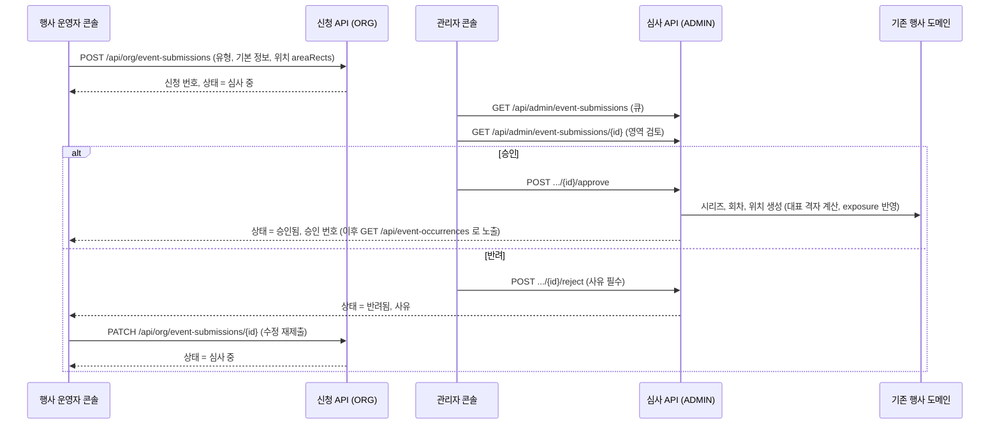
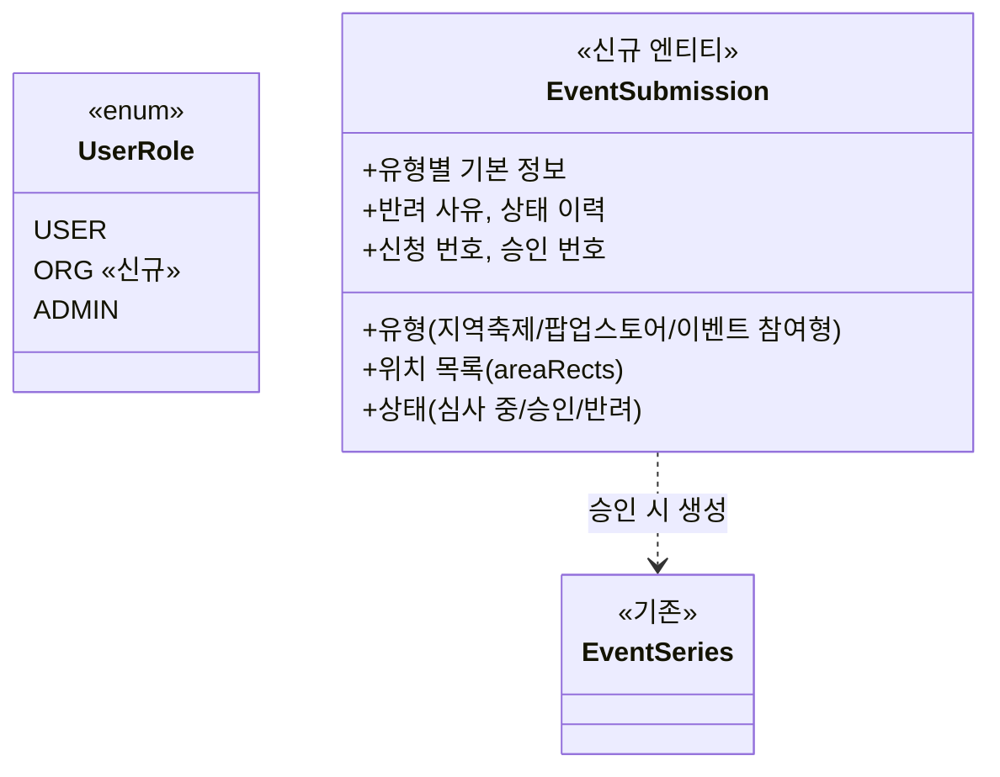

# PRD: 행사 등재 (행사 운영자 콘솔과 관리자 심사)

> 티켓: 미발행 · 작성일: 2026-08-27 · 작성: prd-writer
> 상태: 검토됨 (2026-08-28 승인. ver 14 v2 시안 `15525:8613`과 피그마 댓글, 게이트 문답 4건 반영) (2026-08-28 MSG-501 최소 개정: 모달 조회 FR·API 표면 추가)
> 개정: 2026-08-28 v2.1. 세 번째 등록 유형을 이벤트 참여형으로 재편했다(승인 이벤트 선택 후
> 참여 신청, MSG-501·MSG-502 분리. MSG-498은 지역축제·팝업스토어 한정). 근거는 지라 MSG-498
> 코멘트, 사용자 승인. 개정 범위는 유형 재편 반영에 한정한다

## 1. 문제 상황

지금 행사를 필맵에 올리는 방법은 수동 시드뿐이다. 팀원이 `seed/events.json`에 행을 추가하고
배포해야 행사가 지도에 노출된다(SRS FR-EVENT-01). 이 구조는 첫 시드 3개(부산국제영화제,
부산불꽃축제, 서울불꽃축제)처럼 팀이 직접 고른 초대형 행사에는 맞지만, 사설 팝업 운영사나
축제 대행사가 자기 행사를 올리고 싶어도 받을 창구가 없다. 요청이 늘수록 등재가 전부 팀의
배포 작업으로 쌓인다.

웹 디자인 ver 13의 "행사 운영자 시안 - 행사 등재 v2 (운영도구 개선안)"(섹션 `15473:3730`,
프레임 22장)이 이 문제를 콘솔 흐름으로 풀었고, ver 14 "필맵 웹 디자인 ver 14_최종 버전(수정 X)"
페이지가 같은 이름의 섹션(`15525:8613`)으로 다시 그렸다. **ver 14 시안이 판독 정본인데, 그
자체로 확정은 아니다.** 확정값은 시안 위 피그마 댓글(2026-08-27, 강정민 작성)에 있고, 이 개정판이
그 댓글들을 본문에 반영했다. ver 14는 관리자 화면 5장을 다시 그렸고(2026-08-27의 "관리자 디자인
재작업" 대상), 첫 로그인·비밀번호 재설정(운영자 1-3·1-4·1-5), 계정 설정(운영자 11), 신청 전 최종
확인(운영자 6-1), 비로그인 진입점 섹션(`/ops` 랜딩·지도 홈 레일 슬롯)이 새로 생겼다. 행사 운영자가 직접 신청하고 관리자가 심사해
승인하는 구조다. 이 방향은 구 행사방 PRD(`docs/prd/event-room.md`)의 "운영자용 행사 등록
화면은 만들지 않는다" 결정을 뒤집는다. 그 결정의 전제는 등재 대상이 초대형 행사 몇 개뿐이라는
것이었는데, 시안은 등록 유형을 지역축제와 팝업스토어와 이벤트 참여형까지 넓혔다.

용어는 glossary.md "행사 등재" 항목을 따른다. 행사를 등록하는 외부 주체는 언제나 두 단어를
붙여 "행사 운영자"라 부르고, 필맵 쪽은 사용자 대면 문구에서 운영팀, 심사와 계정 발급 주체로는
관리자다.

## 2. 목적 · 목표

- **목적**: 행사 등재를 팀 배포 작업에서 떼어내, 행사 운영자가 신청하고 관리자가 심사하는
  셀프서비스 흐름으로 바꾼다.
- **목표**:
  - 관리자가 행사 운영자 계정을 발급하고, 행사 운영자가 그 계정으로 콘솔에 로그인할 수 있다
  - 행사 운영자가 유형을 골라 행사를 신청하고, 심사 상태와 반려 사유를 확인하고, 반려본을
    수정해 재제출할 수 있다
  - 관리자가 신청을 심사해 승인하거나 반려하고, 승인된 행사는 기존 노출 채널로 지도에 실린다
- **비목표(스코프 제외)**:
  - 회원가입 기반 자체 가입. 계정은 관리자 수동 발급을 유지한다(MSG-484 확정)
  - 신청 폼의 임시 저장(2026-08-28 미포함 확정. ver 13 폼에 있던 버튼은 v2 화면에서 빠졌고,
    반려 후 재제출 흐름이 있어 없어도 완주가 된다)
  - 승인 후 행사 운영자의 직접 수정(정책 유보가 풀릴 때까지, 미해결 질문 참조)
  - 기존 수동 시드 경로의 폐기. 시드는 그대로 두고 두 경로가 병행한다
  - 콘솔 화면(FE) 구현. 이 PRD는 서버 몫만 다룬다
  - 통계, 정산 같은 콘솔 확장 기능

## 3. 기능 요구사항

### 계정과 권한

| ID | 요구사항 | 우선순위 |
|----|----------|----------|
| FR-1 | 관리자는 기관명, 담당자, 공식 이메일을 받아 행사 운영자 계정을 발급할 수 있다. 계정은 이메일과 비밀번호로 로그인하는 자체 계정[^1]이다 | Must |
| FR-2 | 초기 비밀번호는 발급 시 서버가 생성해 공식 이메일로 직접 발송하고, 관리자가 재발송할 수 있다. 평문은 어떤 API 응답에도 싣지 않는다(관리자 화면 노출 금지) | Must |
| FR-3 | 행사 운영자는 발급받은 이메일과 비밀번호로 기존 로그인 API를 통해 로그인할 수 있다 | Must |
| FR-4 | 로그인한 사용자는 자신의 역할(role)을 조회할 수 있다. 화면이 일반 사용자, 행사 운영자, 관리자 진입을 가르는 재료다 | Must |
| FR-5 | 행사 운영자 권한은 등재 콘솔 기능에만 미친다. 행사 운영자가 관리자 기능에 접근하거나, 일반 사용자가 콘솔 기능에 접근하면 거부된다 | Must |
| FR-6 | 계정이 없는 행사 운영자는 비로그인 공개 폼으로 계정 발급을 요청할 수 있다(기관명, 담당자명, 연락처, 공식 이메일, 예정 행사명, 요청 내용). 관리자는 요청 큐에서 검토해 승인(계정 생성과 초기 비밀번호 발송)하거나 반려한다. 반려됐다는 사실을 요청자에게 알리는 일은 당분간 수기다(피그마 댓글 #108) | Must |
| FR-21 | 첫 로그인 시 비밀번호 변경이 강제다. 건너뛰기가 없다. 발급자(관리자)가 초기 비밀번호를 아는 상태가 유지되면 행사 등록·수정 기록의 행위자를 특정할 수 없기 때문이다(피그마 댓글 #103) | Must |
| FR-22 | 행사 운영자는 로그인 상태에서 비밀번호를 바꿀 수 있고, 비밀번호를 잊었으면 공식 이메일로 받은 재설정 링크(유효 30분)로 스스로 재설정할 수 있다(피그마 댓글 #103) | Must |
| FR-23 | 담당자 이름과 연락처는 행사 운영자가 자체 수정할 수 있다. 아이디(공식 이메일)는 기관 인증의 근거라 자체 변경이 불가하고, 변경 요청을 관리자가 승인해야 바뀐다 | Should |

진입 구조는 별도 화면을 늘리지 않는다(2026-08-28 확정). 기존 fillmap.kr 공용 로그인 모달을
그대로 쓰고, 로그인 결과의 role에 따라 화면 경로만 바뀐다(USER는 기존 화면, ORG는
`fillmap.kr/organizer`, ADMIN은 `fillmap.kr/admin`). 역할 판별은 이메일 문자열 파싱이 아니라
JWT role 클레임 또는 로그인 응답의 role 필드로 한다. 서버 몫은 두 가지다. API 프리픽스별 역할
강제(관리자 API에 ADMIN, 콘솔 API에 ORG)와, ORG가 자기 기관·자기 신청만 조작할 수 있게 하는
소유권 검사(FR-14)다. `admin.fillmap.kr` 같은 서브도메인 분리는 하지 않는다. 로그인 후 이동
과정에서 액세스 토큰 저장소가 공유되지 않아 재발급 처리, CORS, DNS 인증서 설정이 따라오기
때문이고, 관리자 화면을 별도 배포하거나 사내 접근 제한을 붙일 때 분리하면 된다.

### 신청 (행사 운영자 콘솔)

| ID | 요구사항 | 우선순위 |
|----|----------|----------|
| FR-7 | 행사 운영자는 등록 유형(지역축제, 팝업스토어, 이벤트 참여형) 중 하나를 골라 행사를 신청할 수 있다. 유형마다 기본 정보 항목이 다르다(아래 표). 이벤트 참여형은 독립 행사를 새로 만드는 신청이 아니라 승인된 이벤트를 골라 참여를 신청하는 구조다(2026-08-28 v2.1 재편, 표 아래 설명) | Must |
| FR-8 | 행사 위치는 주소가 아니라 지도 위 격자 사각형 영역으로 지정한다. 신청 하나에 위치 여러 개, 위치 하나에 사각형 여러 개를 담을 수 있다. 형식은 기존 행사 시드의 areaRects[^2]와 같다. 위치에 이름을 붙이지 않고, 순번과 지역 라벨(격자 표시명 재료)로만 식별한다(피그마 댓글 #102) | Must |
| FR-24 | 위치 하나가 쓸 수 있는 격자는 사각형들을 합쳐 최대 81칸(9×9 유래)이다. 초과는 제출에서 막는다(피그마 댓글 #106·#109 "1km로 합의", v2 시안 반영 완료. 미해결 질문 2 해소) | Must |
| FR-9 | 위치의 대표 격자[^3]는 신청자가 정하지 않고 서버가 계산한다 | Must |
| FR-10 | 신청이 접수되면 심사 중 상태가 되고 신청 번호가 부여된다 | Must |
| FR-11 | 행사 운영자는 자기 신청 목록과 상태별 건수를 조회할 수 있다 | Must |
| FR-12 | 신청 상세에서 상태, 상태 변경 이력, 반려 사유를 확인할 수 있다 | Must |
| FR-13 | 반려된 신청은 수정해 재제출할 수 있고, 재제출하면 심사 중 상태로 돌아간다. 반려 상태가 아닌 신청은 수정할 수 없다 | Must |
| FR-14 | 행사 운영자는 다른 운영자의 신청을 조회할 수 없다. 없는 신청과 남의 신청의 실패 응답이 같다(존재 은닉) | Must |
| FR-26 | 행사 운영자는 등록 유형 "이벤트"에서 참여할 승인 이벤트를 시·도 필터와 이벤트 이름 검색으로 고를 수 있다. 목록은 이벤트 카테고리(지역축제와 팝업스토어를 제외한 큰 행사)의 종료 전 회차만 담는다(v2.1 [행사 운영자 3-1] 이벤트 선택 모달, MSG-501, SRS FR-EVENT-16) | Must |

유형별 기본 정보(시안 실측):

| 유형 | 항목 |
|------|------|
| 지역축제 | 축제명, 주최 기관, 축제 기간, 주요 프로그램, 축제 소개, 대표 이미지 |
| 팝업스토어 | 팝업명, 브랜드/운영사, 운영 기간, 운영 시간, 팝업 소개, 대표 이미지 |
| 이벤트 참여형 | 이름(참여로 생기는 하위 실체의 명칭은 용어 정리 중), 운영 주체, 공개 기간, 참여 방식, 소개, 커버 이미지. 입력 전에 시·도 칩과 승인 이벤트 목록 모달([3-1] 신규)에서 부모 이벤트를 고른다 |

이미지는 권장 16:9, JPG 또는 PNG, 최대 10MB(시안 문구). 주요 프로그램 같은 서술 항목은
구조화하지 않고 자유 문자열로 받되 최소 10자를 요구한다(피그마 댓글 #100 "String으로 받고
최소 10자 제한", [4A] 주요 프로그램 필드 앵커).

등록 유형 재편(2026-08-28 v2.1, 사용자 승인): 세 번째 유형이 구 "행사방"에서 **이벤트
참여형**으로 바뀌었다. 이벤트는 지역축제와 팝업스토어를 제외한 큰 행사 카테고리를 가리키는
확정 용어다(MSG-503). 유형 카드를 누르면 페이지 이동 대신 모달이 뜨고, 시·도 칩과 승인 이벤트
목록(건수, 유형 배지, 기간, 장소 라벨, 이름 검색)에서 부모를 고른 뒤 입력을 계속한다. 티켓
배분은 승인 이벤트 목록 조회가 MSG-501, 참여 신청이 MSG-502이고, MSG-498은 지역축제와
팝업스토어 2개 독립 유형만 다룬다.

### 심사 (관리자)

| ID | 요구사항 | 우선순위 |
|----|----------|----------|
| FR-15 | 관리자는 신청 목록을 상태별로 조회할 수 있다. 심사 중, 승인됨, 반려됨 건수가 함께 온다 | Must |
| FR-16 | 관리자는 신청 상세에서 기본 정보, 위치 사각형, 노출 영역[^4]을 확인할 수 있다 | Must |
| FR-17 | 관리자가 승인하면 기존 행사 도메인에 행사(시리즈, 회차, 위치)가 생성되고 기존 노출 채널(`GET /api/event-occurrences`)로 지도에 노출된다. 승인 번호가 부여된다 | Must |
| FR-18 | 승인으로 생성된 행사는 시드로 등재한 행사와 같은 규칙을 따른다. 대표 격자 3단 결정, 회차 미혼합, 생명주기 4단계(예정, 진행 중, 업로드 유예, 아카이브)가 그대로 적용된다 | Must |
| FR-19 | 관리자가 반려할 때는 사유가 필수이고 두 벌로 받는다. 반려 항목 코드(reasonCodes: PERIOD 행사 기간, AREA 위치 영역, IMAGE 홍보 이미지, INFO 행사 정보 중 1개 이상)와 자유 서술(reasonText). 행사 운영자 화면의 "반려 항목"은 이 코드를 라벨로 그린다 | Must |
| FR-20 | 승인된 행사는 종료일까지 자동으로 노출된다(기존 생명주기 재사용). 다만 관리자는 문제가 있는 행사의 노출을 중지할 수 있다. 중지하면 유저 지도와 행사방에서 즉시 사라지고 행사 운영자에게 사유가 통지된다(v2 [관리자 5] 시안. 초안의 "내리기 조작 없음" 서술을 대체) | Must |
| FR-25 | 관리자는 승인 행사를 노출 중, 예정, 종료 상태별로 목록 조회할 수 있다 | Should |

## 4. 비기능 요구사항

| 분류 | 요구사항 |
|------|----------|
| 보안/인가 | 비밀번호는 해시로만 저장한다(기존 passwordEncoder 경로 재사용). 초기 비밀번호 평문은 어떤 API 응답에도 싣지 않는다. 서버가 공식 이메일로 직접 발송하고 API는 발송 성공 여부만 돌려준다. 발송 후 24시간 내 변경, 첫 로그인 시 변경 강제(mustChange 게이트). 콘솔 API는 ORG, 심사 API는 ADMIN 역할이 필수이고 역할 검사는 서버가 한다 |
| 데이터 정합 | 승인 시 생성되는 행사 데이터는 기존 DDL 제약(회차 미혼합 복합 FK, 격자 단일 귀속, 대표 격자 소속)을 그대로 통과해야 한다. 승인 반영과 신청 상태 갱신은 함께 성공하거나 함께 실패한다 |
| 운영 | users 역할 CHECK 제약[^5] 변경과 신청 테이블 신설 마이그레이션이 필요하다. 기존 사용자 행은 변경되지 않는다. 서버가 메일을 직접 보내는 지점이 처음 생긴다(초기 비밀번호 발송, 재설정 링크). 발신 주소는 서비스 공식 이메일 contact@fillmap.kr(2026-08-28 확정)이고, 발송 수단 선정이 스펙 몫이다 |
| 성능 | 콘솔과 심사는 내부 소수 사용자 대상이라 별도 성능 목표를 두지 않는다. 일반 사용자 노출 경로는 기존 API 재사용이라 영향이 없다 |

## 5. 시퀀스 다이어그램

신청부터 승인 노출까지의 주 흐름:

## 6. 클래스 다이어그램

세부 필드와 테이블 설계는 스펙 몫이다.

## 7. 변경 파일 목록

리서치로 확인한 현재 코드 기준. 전부 Owner B 도메인이다.

| 파일 | 변경 | Owner |
|------|------|-------|
| `src/main/resources/db/migration/V45__users_role_org.sql` | 신규. `chk_users_role` CHECK에 ORG 추가 (V1이 USER, ADMIN만 허용 중) | B |
| `src/main/resources/db/migration/V46__event_submissions.sql` | 신규. 신청 테이블(들) 신설, 스키마는 스펙에서 확정 | B |
| `user/entity/UserRole.java` | 수정. ORG 상수 추가 (현재 USER, ADMIN) | B |
| `user/dto/UserProfileResponseDto.java` | 수정. role 필드 추가 (`GET /api/users/me` 응답, 현재 미노출) | B |
| `user/service/impl/UserServiceImpl.java` | 수정. 프로필 응답에 role 채움 | B |
| `global/config/SecurityConfig.java` | 수정. 콘솔 프리픽스에 ORG matcher 추가. `/api/admin/**`의 ADMIN matcher는 MSG-195부터 있음 | B |
| `event/` 하위 신규 (submission 엔티티, 리포지토리, 서비스, 컨트롤러, DTO) | 신규. 패키지 배치와 에러코드 대역(13xxx 잔여 또는 신설)은 스펙에서 확정 | B |
| 관리자 발급, 심사 컨트롤러 (`AdminReportController` 선례 위치 참고) | 신규 | B |
| 계정 발급 요청 (`org-account-requests` 엔티티, 공개 접수 API + 관리자 큐·승인·반려) | 신규. 비로그인 접수라 SecurityConfig permitAll 경로 추가 | B |
| 비밀번호 흐름 (`auth/` 아래 status·change·reset-request·reset 4개 API, mustChange 게이트) | 신규. 재설정 토큰(30분)·메일 발송 수단은 스펙에서 확정 | B |
| 승인 행사 관리 (`admin/events` 목록·unpublish) | 신규. unpublish의 기존 회차 생명주기 접점은 스펙에서 확정 | B |

Flyway 번호는 이 표의 값을 그대로 쓰지 말고 **각 티켓 구현 시점에 워크트리
`src/main/resources/db/migration` 최신 번호를 재실측해 배정한다**(초안의 V44 배정이 이미 붙은
`V44__video_encoding_jobs.sql`과 충돌해 2026-08-28에 V45·V46으로 정렬한 전례. 표의 번호는
그 시점의 실측일 뿐이라 병렬 티켓이 먼저 번호를 쓰면 또 밀린다).

로그인(`POST /api/auth/login`)과 비밀번호 해시 경로(`AuthService`, passwordEncoder)는 이미
있어서 변경이 없거나 확인만 한다. 대표 격자 계산은 `global.geo.RepresentativeGridResolver`
(MSG-459에서 공용 승격)를 재사용한다.

v2 [관리자 4] 서버 재료 프레임이 명시한 신규 API 전체(21개): event-submissions
4개(ORG, `/api/org/event-submissions`) +
admin/event-submissions 4개(ADMIN), org-account-requests 1개(비로그인 접수) +
admin/org-account-requests 4개 + `POST /api/admin/organizations`(공문 선행 건 직접 발급),
admin/events 2개(목록·unpublish), auth/password 4개(status·change·reset-request·reset),
`GET·PATCH /api/org/profile`·`POST /api/org/email-change-request`. 계정 설정 화면([운영자 11])의
초기값 조회용 `GET /api/org/profile`은 시안 서버 재료에 없던 것을 2026-08-28 확정으로 추가해
신규 API는 22개가 됐다(내 프로필 조회 `GET /api/users/me`는 네 응답이 공유하는 DTO라 연락처를
싣지 않는다. 채택 근거는 `docs/spec/MSG-497.md` 미해결 질문의 결정 기록 참조). 기존 재사용은
로그인, `GET /api/event-occurrences`, 장소 검색이다. 여기에 더해 MSG-501이 승인 이벤트 목록
조회 `GET /api/org/events` 1개를 신설한다(FR-26. [관리자 4] 서버 재료 프레임은 이 API 미반영
구판이라 계약은 MSG-501 스펙이 정본이다). MSG-499 스펙은 관리자 계정 목록 조회
`GET /api/admin/organizations` 1개를 23번째로 더한다(재발송 대상 식별, [관리자 1] 최근 발급
목록, 직접 발급 크래시 복구 확인 재료. 2026-08-29 승인, 계약은 MSG-499 스펙이 정본).

행사 운영자 콘솔 API의 경로는 `/api/org/**` 프리픽스 하나로 통일이 확정됐다(2026-08-28 사용자
확정. 후보 비교와 채택 근거는 `docs/spec/MSG-496.md` 미해결 질문의 결정 기록 참조). 시안 서버
재료의 `POST /api/event-submissions` 표기는 이 확정으로 `POST /api/org/event-submissions`가
됐고, 위 시퀀스 다이어그램에 반영돼 있다. 비로그인 접수 `POST /api/org-account-requests`는
로그인 없는 공개 폼이라 이 프리픽스 밖에 그대로 남는다.

## 8. 미해결 질문

2026-08-28 개정에서 초안의 6건 중 3건이 ver 14 시안과 피그마 댓글로 해소됐고, 같은 날
작성자(강정민) 확인으로 2건이 더 닫혔다. 남은 미확정은 2건이며 각각 게이트가 걸린 티켓을
명시했다.

- [ ] **승인 행사 노출 방식과 이벤트 참여형의 세부** (시안 열린 판단 1, 미확정 유지):
  2026-08-28 v2.1 디자인 개정으로 입력 구조는 잡혔다. 세 번째 유형은 독립 행사를 새로 만드는
  게 아니라 시·도와 승인 이벤트를 모달([3-1] 신규)에서 고른 뒤 그 아래 참여를 신청하는
  구조다. 지역축제와 팝업스토어 승인분의 노출 형태(이벤트 편입 / 칩 / 규모별 분기)와 참여로
  이벤트 아래 생기는 하위 실체의 명칭은 여전히 열려 있다. **MSG-502(참여 신청)와
  MSG-500(approve) 스펙 착수 전 확정이 게이트다.** v2.1 재편으로 이벤트 참여형이 빠진
  MSG-498에는 이 게이트가 걸리지 않는다. 확정되면 SRS FR-EVENT-01의 등재 기준 서술을 함께
  고친다
- [ ] **승인 후 일정 수정 정책** (시안 열린 판단 3): 2026-08-28 유보 확정. MVP에서는 구현하지
  않고 시안대로 "운영팀에 문의"로 안내한다. A 재신청 재심사 / B 관리자 직접 수정 / C 항목별
  분리 중 후속 결정이 나면 그때 티켓을 새로 판다
- [x] ~~"승인 여부 상태값 추가"(#107)의 뜻~~ → **신청 전체 상태로 충분** (2026-08-28 작성자
  확인). 위치 단위 승인 여부는 만들지 않는다. 댓글은 신청 상태(심사 중/승인/반려)를 가리킨
  메모였고 그 상태는 FR-10~12에 이미 있다
- [x] ~~임시 저장~~ → **미포함 확정** (2026-08-28). 비목표로 옮겼다
- [x] ~~위치당 영역 크기 상한~~ → **위치당 총 81칸(9×9 유래)으로 확정** (피그마 댓글 #106·#109
  "1km로 합의", v2 [행사 운영자 5]에 9/81 카운터로 반영, [주석] 프레임에 확정 라인 추가). FR-24로 등재
- [x] ~~계정 발급 요청의 접수 방식~~ → **API 접수로 확정** (v2 [행사 운영자 1-1] 공개 폼 +
  [관리자 1-1] 요청 큐 + 서버 재료의 `POST /api/org-account-requests`). 반려 통보만 수기(#108). FR-6으로 등재
- [x] ~~초기 비밀번호 전달 방식~~ → **서버가 공식 이메일로 직접 발송, 평문은 어떤 응답에도
  비노출**로 확정 (v2 [관리자 4] 서버 재료 명문). FR-2로 등재

참고: 피그마 댓글 #105 "영상 개수는 20개 까지만 보이게"는 행사방 시안(포켓몬 메가페스타)의 영상
목록에 달린 것이라 이 PRD 범위 밖이다. 행사방 조회 레인에서 따로 다룬다.

[^1]: 자체 계정: 카카오 소셜 로그인이 아니라 서버가 직접 이메일과 비밀번호를 확인하는 계정.
    코드로는 `provider=LOCAL`이고, 로그인 API와 비밀번호 해시 저장 경로가 이미 구현돼 있다.
[^2]: areaRects: 격자 인덱스로 표현한 사각형 배열. 사각형 하나는 (minGridY, maxGridY,
    minGridX, maxGridX) 네 정수다. 기존 행사 시드 `seed/events.json`이 쓰는 형식 그대로다.
[^3]: 대표 격자: 위치의 영상이 실제로 연결되는 격자 하나. 홀수 행렬 직사각형이면 정중앙,
    아니면 영역 중심에 가장 가까운 포함 격자를 계산한다(기존 3단 결정 규칙).
[^4]: 노출 영역(exposure): 지도 뷰포트와 겹침 판정에 쓰는 사각형. 행사 위치 사각형들을 감싸는
    범위로, 상단 행사 칩이 어느 지역에서 보일지를 정한다.
[^5]: CHECK 제약: 컬럼에 들어갈 수 있는 값을 DB가 직접 제한하는 규칙. 지금 `users.role`은
    USER와 ADMIN만 허용해서, ORG 값을 넣으려면 제약 재정의 마이그레이션이 필요하다.
