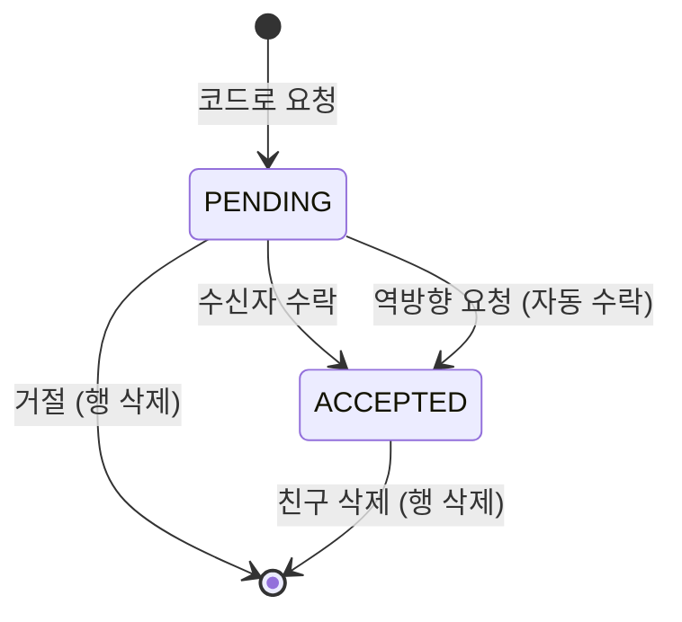

# PRD: 친구와 신고 (사람 사이의 관계, 그리고 그 관계가 어긋날 때)

> 작성일: 2026-08-10 · 작성: prd-writer (MSG-359 역산)
> 상태: 역산 (사후 문서. 구현이 이미 끝난 기능의 요구사항을 스펙과 위키 결정에서 복원했다)
> 커버 티켓: MSG-185, MSG-186, MSG-187, MSG-192, MSG-193, MSG-195 (인접: MSG-205 신고 FK 분, MSG-285 친구 판정 소비 분, MSG-312 구조 정리, 범위 소멸 종결 MSG-188·MSG-194)
> 관련 SRS: FRIEND 영역 (FR-FRIEND-01 ~ 13) · MOD 영역 (FR-MOD-01 ~ 14) · NFR-SEC-02, NFR-SEC-03, NFR-SEC-06 · NFR-DATA-04

### 이 문서와 기존 PRD의 관계

티켓 단위 PRD가 이미 여섯 편 있다. 각 기능의 요구사항 목록과 화면 계약은 그쪽이 정본이고,
이 문서는 그것들을 다시 쓰지 않는다. 여기서 다루는 것은 여섯 편에 흩어져 있어 한 번에 읽히지
않는 것, 즉 두 축을 관통하는 프라이버시 판단과 기각된 대안이다.

| 티켓 | 문서 | 다루는 범위 |
|------|------|------------|
| MSG-185 | [MSG-185-prd.md](MSG-185-prd.md) | 친구 코드, 요청과 수락, 거절, 삭제 |
| MSG-186 | [MSG-186-prd.md](MSG-186-prd.md) | 친구 목록, 친구 프로필과 도감 요약 |
| MSG-187 | [MSG-187-prd.md](MSG-187-prd.md) | 친구 도감 뷰포트 레이어, 친구 격자 영상 목록 |
| MSG-192, MSG-193 | [MSG-192-prd.md](MSG-192-prd.md) | 신고 접수, 블라인드 전환과 해제 |
| MSG-195 | [MSG-195-prd.md](MSG-195-prd.md) | 관리자 신고 처리 |
| MSG-205 | [MSG-205-prd.md](MSG-205-prd.md) | 계정 삭제 (신고 이력 FK 결정이 이 묶음과 맞물린다) |

## 1. 문제 상황

FillMap은 개인 도감으로 출발했다. 내가 간 곳을 내가 채우고 내가 본다. 그런데 지도를 채우는
재미는 혼자 보면 절반이라, 기획은 처음부터 친구에게 보여주는 축을 상정했다. 문제는 그
축을 여는 순간 지금까지 없던 질문이 한꺼번에 생긴다는 것이다. 누구에게까지 보여줄지, 상대를
어떻게 지목할지, 관계가 끊기면 무엇이 언제 막히는지.

동시에 반대 방향의 구멍도 있었다. 다른 사람의 영상이 보이기 시작하면 보이면 안 되는 영상도
같이 보인다. 불법 촬영, 사생활 침해, 스팸이 올라와도 서비스가 할 수 있는 일이 하나도 없었다.
피그마 격자 상세에는 신고 메뉴가 그려져 있는데 대응 API가 0건이었고, `reports` 테이블은 V1
스키마부터 있었지만 읽거나 쓰는 코드가 한 줄도 없었다. 영상 상태값 `BLINDED`는 재생 경로와
전역 노출 경로가 이미 대비하고 있는데, 정작 영상을 그 상태로 만드는 수단이 DB 수동 UPDATE뿐이었다.

두 축을 한 문서에 묶은 이유는 여기에 있다. 둘 다 "다른 사람이 보인다"는 같은 변화에서 나왔고,
둘 다 같은 종류의 판단을 반복해서 내렸다. 무엇을 보여줄지보다 **무엇을 숨길지를 먼저 정하는
방식**이다. 친구가 아닌 사람에게는 관계는 물론 계정 존재 자체를 숨겼고, 신고 경로가 영상의
존재를 알아내는 우회 창구가 되지 않도록 재생 경로와 글자 단위로 같은 실패 응답을 돌려줬다.

## 2. 목적, 목표, 비목표

**목적**: 사용자가 서로를 지목해 관계를 맺고 상대의 도감을 볼 수 있게 하되, 관계가 없는
사람에게는 아무것도 새지 않게 한다. 그리고 관계 밖에서 올라온 문제 콘텐츠를 사용자가 알리고
운영이 내릴 수 있는 최소 루프를 연다.

**목표**

- 사용자가 상대를 정확히 한 명 지목해 친구가 되고, 어느 쪽이든 관계를 끊을 수 있다.
- 친구의 프로필, 도감 요약, 지도 위 격자, 그 격자의 영상을 볼 수 있다.
- 친구가 아닌 사람의 어떤 조회 시도도 관계와 계정 존재를 구분해 알려주지 않는다.
- 관계 판정이 요청 시점에 이뤄져, 친구를 끊으면 다음 요청부터 즉시 막힌다.
- 사용자가 남의 영상을 사유와 함께 신고하고, 같은 영상을 두 번 신고할 수 없다.
- 관리자가 접수된 신고를 열람하고 승인 또는 기각으로 종결하며, 승인된 영상은 즉시 내려간다.
- 영상을 내려도 그 사람이 그곳에 갔다는 기록(점령, 도감, 스트릭)은 흔들리지 않는다.

**비목표**

- 차단. 스키마에 `BLOCKED` 값이 있지만 쓰지 않는다. 거절한 상대의 재요청도 허용한다.
- 사용자 신고. 신고 대상은 영상 하나뿐이고, 사용자 축 대응이던 MSG-194는 제품 범위 밖으로
  종결됐다 (2026-08-06).
- 그룹과 일회성 초대 링크. MSG-188에서 미도입으로 확정되며 티켓 자체가 종결됐다.
- 전체 친구 합산 레이어. 지도에는 항상 친구 한 명의 격자만 올린다.
- 도감 공개 범위 설정. 친구면 요약 전부 공개이고 사용자가 조절하는 손잡이는 없다.
- 친구 코드 재발급, 친구 목록 페이지네이션, 친구 수 상한.
- 자동 블라인드 임계. 신고가 몇 건 쌓여도 자동으로 내려가지 않는다.
- 신고자에게 처리 결과 알림, 신고 남용 방지 상한.
- 관리자 계정을 만드는 API나 시드. 승격은 DB 수동 절차다.

## 3. 기능 요구사항

요구사항 문장의 정본은 `docs/srs.md`다. 여기서는 같은 문장을 옮기지 않고 주제별로 묶어
어느 ID가 무엇을 보장하는지만 가리킨다.

### 친구

| 주제 | 무엇을 보장하는가 | SRS |
|------|------------------|-----|
| 상대 지목 수단 | 가입 시점부터 전역 유일한 고정 코드가 붙고, 그 코드가 유일한 지목 경로다 | FR-FRIEND-01 |
| 요청 전 확인 | 코드로 상대 닉네임을 미리 보고 나서 요청을 보낸다 | FR-FRIEND-02 |
| 요청 실패 경계 | 자기 코드, 없는 코드, 이미 친구, 내가 보낸 대기 요청은 전부 실패한다 | FR-FRIEND-02 |
| 엇갈린 요청 | 서로 보낸 요청은 자동 수락으로 수렴한다 | FR-FRIEND-03 |
| 권한과 해소 | 수락과 거절은 수신자만, 삭제는 당사자만 한다. 거절은 통지하지 않고 재요청을 막지 않는다 | FR-FRIEND-04 |
| 계정 소멸 연쇄 | 계정이 사라지면 얽힌 관계와 대기 요청도 함께 사라진다 | FR-FRIEND-05 |
| 목록 | 방향 무관 전체를 정렬 두 가지로 본다. 없으면 실패가 아니라 빈 목록이다 | FR-FRIEND-06 |
| 프로필과 요약 | 프로필, 도감 요약, 최근 수집 격자를 본다. 수치는 본인이 볼 때와 같다 | FR-FRIEND-07 |
| 존재 은닉[^hide] | 비친구, 본인 ID, 대기 중 상대, 없는 사용자가 전부 같은 실패 응답을 받는다 | FR-FRIEND-08 |
| 실시간 판정 | 캐시가 없어 친구 삭제가 다음 요청부터 즉시 반영된다 | FR-FRIEND-09 |
| 지도 레이어 | 친구 한 명의 격자를 뷰포트로 본다. 응답 계약은 내 뷰포트 조회와 같고 색상 필드는 없다 | FR-FRIEND-10 |
| 친구 격자 영상 | 그 격자의 PUBLIC과 FRIENDS 영상만 나오고, 보인 영상은 재생도 된다 | FR-FRIEND-11 |
| 썸네일 누설 차단 | 최근 격자 썸네일은 재생 허용 영상에서만 고르고 없으면 격자 사실만 준다 | FR-FRIEND-12 |
| 범위 밖 | 합산 레이어, 공개 범위 설정, 차단, 코드 재발급, 목록 페이지네이션은 없다 | FR-FRIEND-13 |

### 신고와 운영

| 주제 | 무엇을 보장하는가 | SRS |
|------|------------------|-----|
| 접수 | 사유 5종 중 하나와 함께 남의 영상을 신고하고 접수 확인을 받는다 | FR-MOD-01 |
| 상세 설명 | OTHER는 상세 설명이 필수, 나머지는 선택이며 500자를 넘으면 거부한다 | FR-MOD-02 |
| 중복 방지 | 같은 사람이 같은 영상을 두 번 신고할 수 없고, 동시 요청 경쟁에서도 한 건만 남는다 | FR-MOD-03 |
| 대상 은닉 | 없는 영상, 삭제된 영상, 이미 블라인드[^blind]된 영상은 존재를 숨기는 404다. 자기 영상은 못 신고한다 | FR-MOD-04 |
| 전환과 해제 | 운영 판단으로 내리고 되돌린다. 잘못된 전이를 조용히 넘기지 않는다 | FR-MOD-05 |
| 노출 차단 범위 | 전환 즉시 재생, 전역 노출, 개인 목록에서 사라지고 소유자도 재생 URL을 못 받는다 | FR-MOD-06 |
| 대표 재선정 | 도감 대표였으면 남은 정상 영상으로 바꾸고 해제해도 되돌리지 않는다 | FR-MOD-07 |
| 기록 불변 | 블라인드는 점령과 영상 수를 건드리지 않는다. 롤백은 삭제 전용이다 | FR-MOD-08 |
| 관리자 목록 | 상태 필터와 함께 최신 접수 순 페이지 단위로 보고, 판단에 필요한 항목이 다 담긴다 | FR-MOD-09 |
| 관리자 확인 | 공개범위와 상태에 무관하게 단건으로 확인하고 조회수는 오르지 않는다 | FR-MOD-10 |
| 종결 | 승인은 신고 종결과 영상 전이를 한 트랜잭션으로 묶고, 기각은 영상을 건드리지 않는다 | FR-MOD-11 |
| 경합과 선행 상태 | 이미 내려갔거나 지워진 영상은 신고만 종결한다. 동시 처리는 한 명만 성공한다 | FR-MOD-12 |
| 인가[^authz] | 관리자 경로는 ADMIN만 통과한다. 해제는 신고 상태를 되돌리지 않는다 | FR-MOD-13 |
| 범위 밖 | 신고자 결과 알림, 신고 남용 상한은 없다 | FR-MOD-14 |

## 4. 비기능 요구사항

| 분류 | 요구사항 | 근거 |
|------|----------|------|
| 보안 | 두 축의 모든 API가 인증 필수다. 본인 대상 경로에는 대상 식별자를 두지 않는다 | NFR-SEC-02 |
| 보안 | 관리자 기능은 경로 프리픽스 하나로 묶이고 ADMIN 토큰만 통과한다. 관리자를 만드는 코드나 시드는 두지 않는다 | NFR-SEC-03 |
| 보안 | 접근 거부 응답이 대상의 존재를 알려주지 않는다. 친구 프로필 실패는 원인 구분 없는 단일 응답이고, 신고 대상 은닉은 재생 경로와 같은 응답이다 | NFR-SEC-06 |
| 데이터 정합 | 같은 자원에 대한 동시 쓰기는 행 잠금으로 직렬화한다. 상호 친구 요청과 동시 신고, 동시 신고 처리가 모두 여기에 해당한다 | NFR-DATA-04 |
| 데이터 정합 | 친구 도감 요약 수치는 본인이 볼 때와 친구가 볼 때 같은 산식이어야 한다 | FR-FRIEND-07 |
| 데이터 정합 | 신고 종결과 영상 전이는 하나의 트랜잭션이다. 신고만 끝나고 영상은 남는 상태가 생기지 않는다 | FR-MOD-11 |
| 성능 | 친구 격자 뷰포트 조회는 내 뷰포트 조회와 동급 목표를 따른다. 친구 판정 추가 비용은 요청당 존재 확인 1회다 | MSG-187 PRD 4절 |
| 성능 | 관리자 목록에는 수치 목표를 두지 않되 전체를 한 번에 반환하지 않는다. MVP 신고량이 소규모라 오프셋 페이징으로 충분하다 | MSG-195 D5 |
| 운영 | 관리자 승격은 DB 수동 UPDATE 절차이며 `deploy.md`에 절차 문서만 둔다. 재로그인 전에는 새 권한이 반영되지 않는다 | MSG-195 D8 |

## 5. 친구 축: 왜 그렇게 정했나

### 5.1 상대를 지목할 방법이 없다는 블로커

위키 초안 `03-specs/Social API 예정`(2026-07-17)은 친구 기능의 최대 블로커를 이렇게 적었다.
상대 userId를 알 방법이 없다. 이게 없으면 소셜 전체가 동작하지 않는다. 관계 테이블은 V1부터
있었지만 "누구와" 관계를 맺을지 입력할 수단이 없었다는 뜻이다.

검토하고 버린 안이 넷이다.

| 안 | 왜 버렸나 |
|----|-----------|
| 닉네임 검색 | 닉네임은 중복을 허용한다 (MSG-203). 동명이인 중 누가 그 사람인지 고를 근거가 없다 |
| 이메일 지목 | 상대의 이메일을 이미 알아야 하고, 이메일이 새는 경로를 새로 만든다 |
| 카카오 친구 연동 | 비즈 앱 전환이 선행돼야 한다. 제품 일정 밖의 심사 절차에 기능이 묶인다 |
| 일회성 초대 링크 | 만료 토큰 발급과 폐기 관리가 붙는다. 고정 코드로 같은 목적을 달성할 수 있다 |

남은 것이 **고정 친구 코드**다 (2026-08-03 확정, MSG-172 코멘트). 가입 시점에 한 번 붙고
바뀌지 않으며 전역 유일하다. QR과 공유 링크는 별도 기능이 아니라 이 코드의 클라이언트 표현형이라
서버 작업이 없다.

고정 코드의 대가는 유출 대응이다. 코드가 퍼지면 원치 않는 요청이 들어오는데 재발급이 없으니
막을 수단은 거절뿐이다. 이걸 알면서도 재발급을 넣지 않은 이유는, 재발급이 들어오면 이미 코드를
공유한 기존 친구들의 연결 경로가 같이 끊기고 "예전 코드로 요청하면 어떻게 되나"라는 상태가
하나 더 늘기 때문이다. MVP 규모에서 거절 한 번으로 끝나는 문제에 상태를 늘리지 않기로 했다.

### 5.2 코드에서 문자 네 개를 뺀 이유

코드 문자 집합은 대문자와 숫자에서 I, O, 0, 1을 뺀 32종이고 길이는 8자다. 두 가지를 동시에
노린 값이다.

**읽어서 옮겨 적을 수 있어야 한다.** 코드는 화면에서 눈으로 읽고 손으로 입력하거나 말로
불러주는 물건이다. 대문자 I와 숫자 1, 대문자 O와 숫자 0은 폰트에 따라 구분이 안 되고, 그
혼동은 그대로 "코드가 틀렸다"는 실패로 나타난다. 애초에 만들지 않는 편이 안내 문구로 설명하는
것보다 싸다.

**계정 목록을 긁어낼 수 없어야 한다.** 코드는 입력하면 상대 닉네임을 돌려주는 미리보기 경로를
가진다. 편의를 위한 기능이지만 동시에 "이 코드가 실재하는가"를 알려주는 판정기이기도 하다.
32의 8제곱은 약 1.1조라, 무작위로 찍어서 유효한 코드를 맞히는 일이 실질적으로 성립하지 않는다.
혼동 문자를 뺀 탓에 문자 집합이 36종에서 32종으로 줄어 공간이 작아지지만, 8자 기준으로는
여전히 조 단위라 가독성과 맞바꿀 만했다.

충돌 재시도 루프는 두지 않았다. 32의 8제곱 공간에서 수십 명 규모의 충돌 확률이 10억분의 1
수준이고, 만에 하나 부딪히면 DB 유일 제약이 가입 트랜잭션을 실패시켜 사용자 재시도로 수렴한다.
루프를 미리 짜는 것보다 실측 충돌이 관측되면 그때 넣는 편이 코드가 적다.

### 5.3 행이 있으면 친구다

관계 테이블의 상태 CHECK는 V1부터 네 값(PENDING, ACCEPTED, REJECTED, BLOCKED)을 허용한다.
구현은 그중 둘만 쓴다. **거절과 친구 삭제를 모두 행 삭제로 처리했기 때문이다.**

REJECTED를 남기면 무엇이 달라지는지 보면 이 선택의 이유가 보인다. 거절 이력 행이 남아 있는
상태에서 상대가 다시 요청하면, 새 행을 넣을 수 없으니 기존 행을 되살리는 갱신 경로가 필요하다.
그러면 중복 검사도 "행이 있는가"가 아니라 "행이 있는데 어떤 상태인가"로 갈라진다. 거절 후
재요청을 허용하기로 한 이상 (차단을 도입하지 않았으므로 막을 근거가 없다) 이력 행은 아무것도
보장하지 않으면서 분기만 늘린다.

그래서 불변식을 하나로 정했다. **행이 존재한다는 것이 곧 관계가 살아 있다는 뜻이다.** 이
불변식 덕에 거절 후 재요청 허용이 코드 없이 성립하고, 중복 검사가 상태 분기 없는 존재 확인
하나로 끝난다. DB CHECK는 넓은 채로 두었다. 좁은 값만 쓰는 것은 위반이 아니라서 마이그레이션이
필요 없고, 나중에 차단이 들어오면 그때 값을 쓰면 된다.

응답 시각(`responded_at`)을 수락에만 기록하는 것도 같은 결의 귀결이다. 거절은 행이 사라지므로
기록할 자리 자체가 없다.

### 5.4 상호 요청 경합을 DB 제약으로 막기까지

두 사람이 서로의 코드를 거의 동시에 입력하면 어떻게 되는가. 애플리케이션은 요청 전에
"이미 관계가 있는가"를 확인하지만, 두 요청이 같은 순간에 그 확인을 통과하면 양방향 행 두 개가
들어간다. A에서 B로 한 줄, B에서 A로 한 줄. 이후 관계 조회는 방향 무관 조회라 짝을 하나만
기대하는데 두 개가 나온다.

**초판은 이걸 알면서 받아들였다.** 상호 요청이 밀리초 단위로 겹칠 확률이 MVP 규모에서 무시할
만하고, 겹쳐도 사용자에게는 "이미 친구"로 보여 눈에 띄는 고장이 아니라는 판단이었다. 코드로
막으려면 요청 경로에 잠금이 하나 더 붙는다.

교차 리뷰(Codex 스톱 게이트 2라운드)가 이 판단을 다시 걸었다. 확률이 낮다는 것은 발생하지
않는다는 뜻이 아니고, 발생하면 조회 계약(짝 하나를 기대하는 반환 형태)이 깨진다는 지적이었다.
받아들인 대신 대응 방식은 바꿨다. 애플리케이션에 잠금을 더 거는 대신 **DB에 대칭 유일
인덱스[^symuniq]를 하나 두는 쪽**을 택했다.

이 선택의 값어치는 비용 대비다. 두 사용자 ID의 작은 쪽과 큰 쪽을 키로 삼으면 방향이 뒤집혀도
같은 키가 되므로, 늦게 도착한 삽입이 DB에서 거부된다. 애플리케이션 경로는 한 줄도 바뀌지
않고 검사 순서를 고민할 일도 없다. 늦은 요청은 서버 오류 한 번으로 끝나고 사용자가 다시
누르면 그때는 이미 친구다. 신고 쪽에서 같은 종류의 경합을 다르게 처리한 이유는 6.4에 적었다.

### 5.5 실패 응답을 하나로 모은 이유

친구 프로필 조회가 실패하는 경우는 넷이다. 상대가 친구가 아니거나, 아직 대기 중이거나, 내가
내 ID를 넣었거나, 그런 사용자가 아예 없거나. 넷을 구분해서 알려주면 친절하지만, 그 친절이
곧 조회 도구가 된다. "이 사용자는 없습니다"와 "친구가 아닙니다"가 다르면, 남의 사용자 ID를
순서대로 넣어보는 것만으로 어느 번호에 계정이 있는지 알아낼 수 있다.

그래서 넷 전부에 **같은 실패 응답 하나**를 돌려준다. 관계 존재와 계정 존재를 함께 숨기는
것이라서, "친구가 아니다"라는 메시지조차 사실은 "친구가 아니거나 계정이 없거나 둘 중 하나"를
뜻한다. 새 에러 코드를 만들지 않고 기존 코드 하나로 수렴시킨 것도 같은 이유다. 코드가 갈리면
응답 형상이 갈리고, 형상이 갈리면 은닉이 뚫린다.

본인 ID를 넣는 경우에 별도 분기를 두지 않은 것은 우아한 부수 효과다. 자기 자신에게 요청하는
것이 애초에 막혀 있으므로 나와 나의 관계 행은 존재할 수 없고, 존재 확인이 자연히 실패해
같은 응답으로 흘러간다.

같은 은닉 정책이 친구 도감 레이어와 친구 격자 영상 목록에도 그대로 적용된다. 세 경로가 같은
판정을 세 벌 갖지 않도록 판정 지점 하나로 모아 두었다.

### 5.6 친구에게 보이는 것과 보이지 않는 것

프라이버시 결정 가운데 가장 늦게까지 열려 있던 것이 "친구에게 도감을 어디까지 보여줄지"였다.
2026-08-03에 확정된 답은 단순하다. **친구면 요약 전부 공개, 사용자가 조절하는 설정 없음.**
설정을 넣으면 화면과 API가 늘어나는데, 친구를 맺는 행위 자체가 이미 동의라서 그 위에 손잡이를
하나 더 얹을 근거가 약했다. 공개 범위 설정은 Phase 2 이후로 미뤘다.

전부 공개라고 해서 아무거나 보이는 것은 아니다. 경계가 두 군데 있다.

**썸네일**은 재생이 허용되는 영상에서만 고른다. 본인이 보는 도감 갤러리는 공개범위를 따지지
않고 대표 영상의 썸네일을 붙이는데, 그 조회를 친구에게 그대로 재사용하면 비공개 영상의
썸네일이 새어 나간다. 썸네일 자체가 영상 내용의 일부이므로 이건 실질적인 유출이다. 그래서
친구용 조회를 따로 만들되 정렬과 개수는 본인용과 똑같이 두고 **썸네일을 고르는 규칙 한
군데만** 갈랐다. 조건에 맞는 영상이 없으면 실패가 아니라 썸네일 없이 격자 사실만 내려준다.
격자를 빼버리면 "여기 뭔가 있는데 안 보여준다"가 아니라 "여기는 안 갔다"가 되어 사실이
왜곡되고, 반대로 썸네일을 채우면 비공개 영상의 존재가 샌다. 격자는 남기고 그림만 비우는
쪽이 둘 다 피한다.

**친구 격자 영상 목록**은 그 친구의 PUBLIC과 FRIENDS 영상만 담는다. 이 목록이 생긴 계기가
공개범위 FRIENDS의 구멍이었다. 친구만 보기로 올린 영상의 재생 판정은 먼저 구현됐는데
(MSG-285), 정작 그 영상이 목록에 실려 나오는 경로가 하나도 없어서 친구에게 보여주려고 올린
영상을 친구가 발견할 방법이 없었다. 전역 노출 경로(격자 대표 영상, 전역 목록, 탐색 집계)를
FRIENDS까지 넓히는 안은 기각했다. 전역 경로에 관계 판정이 들어가면 사용자마다 결과가 달라져
집계와 캐시가 성립하지 않는다. 대신 친구 축에 목록 하나를 신설해 노출 범위를 그 친구의
격자 안으로 가뒀다.

여기서 지킨 규칙이 하나 더 있다. **목록에 보인 영상은 반드시 재생도 된다.** 목록의 필터와
재생 판정이 어긋나면 눌렀는데 안 열리는 항목이 생긴다.

### 5.7 친구 격자 지도는 왜 새 계약을 만들지 않았나

친구 도감 레이어를 열 때 서버는 "그 친구가 채운 격자를 뷰포트 범위로" 돌려줘야 한다. 이건
내 격자를 뷰포트로 조회하는 기능과 요청도 응답도 같은 모양이다. 다른 것은 사용자 ID 하나뿐이다.

그래서 지도 도메인의 기존 조회를 그대로 쓰고 사용자 ID 자리에 친구 ID를 넣었다. 격자 식별자,
좌표 인덱스, 커서 페이지네이션, 검증 규칙, 오류 코드가 전부 같다. 클라이언트 입장에서는 이미
구현한 지도 렌더 코드를 그대로 재사용할 수 있다는 뜻이고, 이건 계약을 아끼는 것 이상의 이득이다.

색상 필드는 넣지 않았다. 친구 격자를 친구별 색으로 칠할지 논의가 있었는데 **단일색으로
확정**했다 (2026-08-04). 한 번에 한 친구의 레이어만 여는 구조라 색으로 구분할 대상이 애초에
없고, 서버가 색을 내려주기 시작하면 디자인이 색을 바꿀 때마다 서버 배포가 필요해진다. 색값은
클라이언트와 디자인의 몫으로 남겼다. 내 격자와 친구 격자가 겹칠 때 친구 색을 위에 올리는
것도 클라이언트 그리기 순서로 해결해 서버는 관여하지 않는다.

## 6. 신고 축: 왜 그렇게 정했나

### 6.1 신고 대상을 영상 하나로 좁힌 이유

지라 티켓 제목은 "영상/사용자 신고"였다. 확정된 범위는 영상뿐이다 (2026-08-06).

근거가 셋이다. 신고 테이블이 V1부터 영상 식별자 전용이라 사용자 신고를 받으려면 스키마부터
바꿔야 한다. 피그마에도 영상 신고 화면만 있다. 그리고 사용자 축 대응이던 차단(MSG-194)이
같은 날 제품 범위 밖으로 종결됐다. 사용자를 신고받아 놓고 사용자에게 할 수 있는 조치가 없으면
접수함만 만드는 셈이다.

사유는 5종(부적절, 사생활 침해, 스팸, 저작권, 기타)이고 상세 설명을 함께 받는다. 기타를
고르면 상세 설명이 필수다. 기타는 그 자체로 아무 정보가 없어서, 설명 없이 접수되면 관리자가
영상을 처음부터 다시 판단해야 한다. 나머지 사유는 이미 판단 축을 알려주므로 선택으로 뒀다.

**그 다섯 값과 상세 설명 500자 상한에는 근거가 없다.** 다른 서비스를 참고한 것도, 기획에서
받은 값도, 법적 분류를 옮긴 것도 아니다. 구현하면서 정했고 그게 전부다 (2026-08-10 성민 확인).

이걸 그대로 적어 두는 이유는 나중에 값을 만질 사람 때문이다. 지키려는 제약이 없으니 사용자
데이터나 운영 경험을 보고 조정할 때 망설일 이유가 없다. 사유를 늘리거나 줄이는 것도, 글자
수를 올리거나 내리는 것도 기존 판단을 뒤집는 일이 아니다. 남는 비용은 사유 목록을 바꿀 때
스키마 CHECK 제약 마이그레이션이 따라붙는다는 것 하나뿐이다. 반대로 값에 근거가 있는 줄
알고 손대지 못하는 상황을 막자는 것이 이 문단의 목적이다.

### 6.2 블라인드를 만들고도 HTTP에 걸지 않은 이유

블라인드 전환과 해제(MSG-193)는 서비스 계층까지만 만들고 엔드포인트를 열지 않았다. 기능은
완성됐는데 아무도 호출할 수 없는 상태로 한 티켓을 끝낸 것이다.

이유는 하나다. 그 시점에 **관리자라는 행위자가 API에 존재하지 않았다.** 역할 배관은 이미
있었다. 역할 enum과 컬럼이 V1부터 있고 토큰에 역할이 실리며 인증 필터가 관리자 권한까지
심는다. 그런데 그 권한을 실제로 검사하는 지점이 코드 전체에 0곳이었다. 이 상태에서 전환
엔드포인트를 열면 로그인한 아무나 남의 영상을 내릴 수 있다.

선택지는 둘이었다. 관리자 인가를 이 티켓에서 같이 만들거나, 전이 로직만 만들고 노출을 다음
티켓으로 미루거나. 후자를 택한 이유는 전이 규칙과 인가가 서로 독립이라 한 티켓에 묶을 이득이
없고, 묶으면 리뷰 단위가 커지기 때문이다. 다음 티켓(MSG-195)이 이 인터페이스를 호출하는
유일한 소비자가 됐다.

### 6.3 블라인드가 건드리지 않는 것들

블라인드는 삭제가 아니다. 이 문장을 지키기 위해 삭제 경로가 하는 뒷정리 대부분을 **의도적으로
하지 않았다.**

| 하지 않는 것 | 이유 |
|--------------|------|
| 점령 롤백과 영상 수 감소 | 영상을 내리는 것과 그 사람이 거기 갔다는 사실은 별개다. 롤백은 삭제 전용 규칙이다 |
| 수집률 재계산 | 점령 격자 집합이 안 변하니 분자도 분모도 그대로다 |
| 스토리지 객체 삭제 | 해제로 되돌릴 수 있어야 하므로 파일을 지우지 않는다 |
| 핫스코어 차감 | 핫스코어는 근사값이라 삭제조차 차감하지 않는다. 같은 정책을 따른다 |
| 스트릭과 뱃지 회수 | 둘 다 업로드 시점 훅만 있고 소급 차감이 없다. 블라인드에 훅을 새로 달지 않는다 |

이 목록이 요구사항인 이유는, 반대로 했을 때 벌어지는 일이 사용자에게 부당하기 때문이다.
신고 한 건이 승인됐다고 100일 스트릭이 끊기거나 도감에서 격자가 사라지면, 콘텐츠 조치가
기록 처벌로 번진다. 조치의 효과는 노출 차단에서 멈춰야 한다.

**하는 것은 하나다.** 내려간 영상이 도감 격자의 대표였으면 남은 정상 영상으로 대표를 다시
고른다. 안 그러면 도감에 내려간 영상의 썸네일이 계속 걸려 있게 된다. 해제할 때 원래 대표로
되돌리지는 않는다. 되돌리려면 "원래 무엇이 대표였는지"를 어딘가 저장해야 하는데, 대표는 어느
영상이 와도 되는 자리라 그 상태를 늘릴 값어치가 없다.

노출 차단 자체는 새로 짠 것이 없다. 재생, 전역 대표, 전역 목록, 탐색 집계, 개인 목록이
전부 이미 활성 상태만 거르고 있어서 상태 값을 바꾸는 순간 모든 경로에서 동시에 사라진다.
그래서 이 기능의 핵심 검증은 새 필터가 맞는지가 아니라 **기존 경로들이 실제로 즉시 반응하는지**의
회귀 테스트다.

### 6.4 중복 신고를 두 겹으로 막은 이유

같은 사람이 같은 영상을 두 번 신고할 수 없다. 이걸 애플리케이션 검사와 DB 유일 제약 두
겹으로 막았다. 애플리케이션 검사는 정상 경로에서 깔끔한 실패 응답을 주기 위한 것이고, DB
제약은 두 요청이 같은 순간에 검사를 통과했을 때의 최종 방어선이다.

친구 축과 다르게 처리한 지점이 여기다. 5.4의 상호 요청 경합은 DB가 거부하면 서버 오류 한
번으로 끝내고 사용자 재시도에 맡겼는데, 신고는 제약 위반을 잡아서 "이미 접수된 신고"라는
정상 실패로 바꿔 준다. 차이는 비용이다. 친구 요청은 방향이 두 개라 어느 쪽이 늦었는지에 따라
의미가 갈리는데, 신고는 단방향 단건이라 변환에 예외 처리 하나면 된다.

제약을 상태와 무관하게 걸었다는 점이 중요한 결정이다. 처리가 끝난 뒤에도 같은 사람은 같은
영상을 다시 신고할 수 없다. 대기 중인 신고에만 제약을 거는 방식(부분 인덱스)으로 바꾸면
처리 후 재신고가 열리는데, 그건 요구사항 변경이라 필요해지면 PRD부터 다시 거치기로 했다.
기각이 아니라 **문을 닫아 두고 여는 절차를 정해 둔 것**이다.

### 6.5 신고 접수가 영상 행을 잠그는 이유

신고 접수는 겉보기에 삽입 한 번이다. 그런데 대상 영상을 확인할 때 잠금 없이 읽지 않고 쓰기
잠금[^lock]을 건다. 교차 리뷰에서 나온 지적을 받아들인 결과다.

잠금이 없으면 이런 창이 열린다. 신고 대상 영상이 정상임을 확인한 직후, 저장하기 전 사이에
그 영상을 지우거나 내리는 트랜잭션이 커밋된다. 그러면 이미 사라진 영상에 신고 행이 하나
남는다. "없는 영상은 404로 숨긴다"는 규칙이 타이밍으로 우회되는 셈이다.

이 잠금이 값싼 이유는 이미 같은 규칙이 깔려 있어서다. 삭제 경로와 블라인드 경로가 같은 지점을
같은 방식으로 잠그고 있었으므로, 신고가 합류해도 세 경로가 같은 순서로 같은 행을 잡는다.
순서가 하나뿐이면 서로 기다리다 멈추는 교착이 성립하지 않는다. 잠그는 행도 하나뿐이라 비용이
사실상 없다.

### 6.6 관리자라는 행위자를 여는 가장 싼 방법

관리자 API는 이 프로젝트 최초의 역할 검사 지점이다. 인증(누구인지)은 처음부터 있었지만
인가(그 행동을 해도 되는지)는 한 번도 필요한 적이 없었다.

새 인증 체계를 만들지 않았다. 토큰에 이미 역할이 실려 있고 필터가 이미 권한을 심고 있어서,
경로 프리픽스 하나에 역할 조건을 거는 것으로 끝났다. **관리자 계정을 만드는 수단도 만들지
않았다.** API도 시드도 없고, 승격은 DB에서 역할 값을 직접 바꾸는 운영 절차다.

이건 게으름이 아니라 공격면 계산이다. 관리자를 만드는 엔드포인트는 그 자체로 최고 권한을
발급하는 문이라, 그 문 하나를 지키는 비용이 문을 안 만드는 비용보다 훨씬 크다. 승격이 몇
달에 몇 번 있는 일이라면 문서화된 수동 절차가 맞는 답이다. 절차 문서에는 승격 후 재로그인이
필요하다는 점(토큰에 역할이 박혀 있으므로 기존 토큰은 옛 권한 그대로다)과 강등도 같은 이유로
즉시 반영되지 않는다는 점을 함께 적었다.

인가 실패 응답은 별도로 손봐야 했다. 인가 지점이 없었으므로 권한 거부 응답을 다듬은 적도
없었고, 실측해 보니 프레임워크 기본 오류 형식이라 이 프로젝트의 공통 응답 형식을 지키지
않았다. 클라이언트가 응답 형식 하나만 알면 되도록 거부 응답을 공통 형식으로 맞췄다.

### 6.7 관리자 경로에서만 은닉을 푼 이유

이 묶음의 다른 모든 조회는 존재를 숨긴다. 관리자 경로만 반대로 간다.

신고 자체가 없을 때는 존재를 숨기지 않고 그냥 없다고 알려준다. 관리자 전용 자원이라 숨길
상대가 없기 때문이다. 여기서 은닉을 하면 보호받는 사람은 없고 관리자만 "왜 안 되는지 모르는"
상태가 된다.

영상 확인은 한 걸음 더 나간다. 관리자는 공개범위와 상태에 무관하게 신고된 영상을 볼 수 있다.
당연한 필요다. 이미 내려간 영상을 다시 판단하려면 봐야 하는데 일반 재생 경로는 그 영상을
404로 숨긴다. 다만 방식에 조건 두 개를 걸었다.

**목록과 분리한 단건 요청으로 뒀다.** 목록에 재생 URL을 함께 실으면 발급 시점과 실제 보는
시점이 벌어져 만료가 문제가 되고, 관리자가 열어보지도 않은 영상의 URL까지 무더기로 발급된다.
확인을 누르는 그 시점에 하나만 발급하는 편이 낫다.

**기존 사용자 재생 경로에 관리자 예외를 넣지 않았다.** 넣었다면 그 경로 하나에 조회수 증가와
은닉 판정과 관리자 우회가 뒤엉킨다. 조회수는 사용자 지표인데 관리자 검토로 올라가면 오염되고,
은닉 로직에 예외가 생기면 그 예외가 다른 경로로 새는지 매번 확인해야 한다. 별도 경로를 하나
더 만드는 비용이 기존 경로를 오염시키는 비용보다 싸다.

승인 처리는 신고 종결과 영상 전이를 한 트랜잭션으로 묶는다. 잠금 순서는 신고 행을 먼저,
영상 행을 나중으로 고정했다. 기존 경로가 전부 영상만 잠그고 있어서 역순이 존재하지 않으므로
교착이 성립하지 않는다. 이미 내려갔거나 지워진 영상은 예외를 잡아서 넘기는 대신 잠금을 쥔
상태에서 상태를 먼저 확인하고 전이를 건너뛴다. 예외 코드를 비교해 흐름을 가르면 전환 쪽
가드가 바뀔 때 조용히 깨지기 때문이다.

## 7. 두 축이 만나는 곳: 계정이 사라질 때

계정 삭제(MSG-205)는 이 묶음의 티켓이 아니지만 결정 하나가 여기 걸려 있다.

원래 계정을 하드 삭제할 수 없었다. 신고 테이블이 사용자를 참조하는데 그 외래 키에 삭제
정책이 없어서, 신고 이력이 있는 사용자를 지우려 하면 제약 위반이 났다. 위키 `06-research/ERD
정렬 디자인 기준 데이터모델`은 이 문제를 A-1로 적고 **소프트 삭제를 권장**했다. 행을 남기고
삭제 표시만 하는 방식이다.

기각했다 (2026-08-01). 행을 남기면 이메일과 소셜 식별자의 유일 제약이 그대로 살아 있어서
**같은 계정으로 재가입이 막힌다.** 미출시 서비스라 복구 요구가 없는데 재가입이 막히는 대가만
남는 셈이다. 대신 외래 키에 삭제 정책을 부여하는 마이그레이션으로 하드 삭제를 열었다.

정책을 두 갈래로 나눈 것이 이 묶음에 닿는 판단이다.

- **그 사람이 한 신고는 함께 사라진다.** 신고는 신고자의 주장이고 주장한 사람이 떠나면
  다툴 당사자가 없다.
- **그 사람이 검토자로 기록된 신고는 검토자 칸만 비고 신고는 남는다.** 처리됐다는 사실 자체는
  운영 기록이라 남아야 하고, 그걸 누가 했는지는 그 사람이 떠나면 지워도 되는 정보다.

친구 관계는 애초에 계정 삭제 시 함께 사라지도록 V1부터 되어 있었다. 관계는 양쪽이 다 있어야
성립하는 것이라 한쪽이 없어지면 남길 이유가 없다.

## 8. 알려진 한계

- **친구 코드가 유출되면 되돌릴 수 없다.** 재발급이 없어 원치 않는 요청을 거절로만 막는다.
  차단도 없으므로 같은 상대가 반복 요청하면 반복 거절해야 한다.
- **친구 목록에 페이지네이션이 없다.** 1인당 수십 명 규모를 전제로 전체를 한 번에 내려준다.
  규모가 커지면 후속 작업이 필요하다.
- **관리자 목록이 오프셋 페이징이다.** 사용자향 목록은 전부 커서 방식인데 여기만 예외다.
  신고량이 소규모라는 전제 위에 있어서, 신고가 많아지면 뒤쪽 페이지가 느려진다.
- **블라인드 해제 이력이 남지 않는다.** 신고 처리자와 처리 시각은 기록되지만 해제는 별도
  감사 기록 없이 접근 로그로 갈음한다.
- **신고자는 처리 결과를 알 수 없다.** 접수 확인만 받고 그 뒤 승인됐는지 기각됐는지 알 방법이
  없다.
- **신고 남용을 막는 상한이 없다.** 유일 제약은 같은 영상의 재신고만 막으므로, 한 사람이
  여러 영상을 연달아 신고하는 것은 제한되지 않는다.

## 9. 미확인

역산으로 복원하지 못한 것들이다. 스펙에도 위키에도 근거가 없어 추측으로 채우지 않았다.

- **친구 수 상한을 두지 않기로 한 근거.** 위키 초안이 열린 질문으로 남겼고 이후 문서가
  "미도입" 결과만 적었다. 논의 자체가 있었는지 확인되지 않는다.
- **검토 중(REVIEWING) 상태를 쓰지 않기로 한 근거.** 스키마에 값이 있고 처리 흐름을 2액션으로
  확정했다는 사실만 있다. 왜 중간 상태가 불필요한지의 판단은 남아 있지 않다.
- **거절을 요청자에게 통지하지 않기로 한 근거.** 차단 미도입과 함께 확정됐다고만 적혀 있다.
  통지가 재요청을 유도해 갈등을 키운다는 판단이었을 수 있으나 기록이 없어 적지 않는다.

## 10. SRS 갱신 후보

SRS에 대응 항목이 없어 3절 표에 넣지 못한 요구다.

| 후보 요구 | 근거 | 왜 요구사항인가 |
|-----------|------|----------------|
| 사용자는 자신이 받은 친구 요청 목록을 조회할 수 있고, 항목에 보낸 사람을 식별할 정보가 담긴다 | MSG-185 PRD FR-9, 구현된 API | FR-FRIEND-04가 수락과 거절 권한만 다뤄 목록 조회 자체가 어느 ID에도 없다. 요청을 처리하려면 먼저 봐야 하므로 빠지면 흐름에 구멍이 난다 |
| 친구 목록 항목에는 사용자 식별자, 닉네임, 프로필 이미지, 도감 색상이 담긴다 | MSG-186 PRD FR-3 | FR-FRIEND-06은 목록과 정렬만, FR-FRIEND-07은 프로필 화면 필드만 다룬다. 목록 항목의 구성은 클라이언트 계약인데 어느 쪽에도 없다 |
| 친구 격자 영상 목록은 최신순으로 정렬한다 | MSG-187 D5 (기본 최신순 제안이 확정으로 굳음) | FR-FRIEND-11이 포함 범위만 정하고 순서를 안 정한다. 전역 목록은 인기순이라 관례가 갈리는 지점이므로 명시가 필요하다 |

## 11. 발견한 문서 불일치

이 문서를 쓰면서 확인한 것으로, 조치는 이 티켓 밖이다.

1. **위키 `03-specs/FillMap API 스펙 통합`의 열린 질문 목록이 낡았다.** 최종 갱신이 2026-08-09이고
   상태도 활성인데, 열린 결정 4번 "계정 삭제 방식 (reports FK 제약)"과 5번 "Social Owner 미정
   + 친구 찾기 수단 부재", 8번의 "영상 신고 플로우(UI 존재, API 스펙 0건)"가 그대로 남아 있다.
   셋 다 해소됐다. 계정 삭제는 2026-08-01에 하드 삭제로 확정됐고, 친구 찾기는 2026-08-03에
   고정 코드로 해소됐으며, 신고 API는 2026-08-06에 접수부터 관리자 처리까지 구현됐다. 같은
   문서 소셜 절의 "상대 userId를 알 방법이 없음, Social 전체 블로커" 배너도 마찬가지다.
2. **위키 `03-specs/FillMap DB 자료형·ENUM·GeoJSON 기준`의 공개범위 enum이 2값이다.**
   `video_visibility(PUBLIC/PRIVATE)`로 적혀 있는데 지금은 FRIENDS를 포함한 3값이다.
   친구 축의 노출 범위가 이 값에 걸려 있어 오독하면 계약이 어긋난다.
3. **지라 MSG-192 제목이 "영상/사용자 신고 접수 API"로 남아 있을 가능성.** 사용자 신고는
   제품 범위 밖으로 확정됐고 스펙 미해결 질문에 제목 정정이 올라와 있는데, 반영 여부가 문서에
   기록돼 있지 않다.

셋 다 판정은 레포가 맞다. 무엇이 구현됐는지는 검증 가능한 사실이라 코드와 `status.md`를 따른다.

---

[^hide]: 존재 은닉. 권한이나 관계가 없어서 막을 때 "권한 없음" 대신 "없음"을 돌려줘 대상이
    실재하는지 자체를 숨기는 응답 방식이다. "권한 없음"을 주면 "그건 있긴 있다"는 정보가 함께
    새기 때문에, 식별자를 순서대로 넣어보는 것만으로 목록을 긁어낼 수 있게 된다.
[^blind]: 블라인드. 영상 상태값 하나로, 신고 조치로 가려진 상태다. 삭제와 달리 데이터와 파일이
    남아 있고 운영 판단으로 되돌릴 수 있다. 전환 즉시 재생과 모든 노출 경로에서 사라진다.
[^authz]: 인가. 인증(누구인지 확인)과 구분되는 개념으로, 확인된 사용자가 이 행동을 해도 되는지
    판단하는 것이다. 이 프로젝트는 오래 인증만 있었고 역할을 검사하는 인가 지점이 관리자
    API에서 처음 생겼다.
[^symuniq]: 대칭 유일 인덱스. 두 값의 순서가 뒤집혀도 같은 것으로 보게 만드는 유일 제약이다.
    작은 값과 큰 값을 뽑아 키로 삼으면 (A, B)와 (B, A)가 같은 키가 되므로, 방향만 다른 중복
    행이 DB 단계에서 거부된다.
[^lock]: 쓰기 잠금. 한 트랜잭션이 특정 행을 읽으면서 다른 트랜잭션이 그 행을 바꾸지 못하게
    붙잡아 두는 것이다. 확인과 저장 사이에 남이 끼어들어 전제가 무너지는 상황을 막는다.
