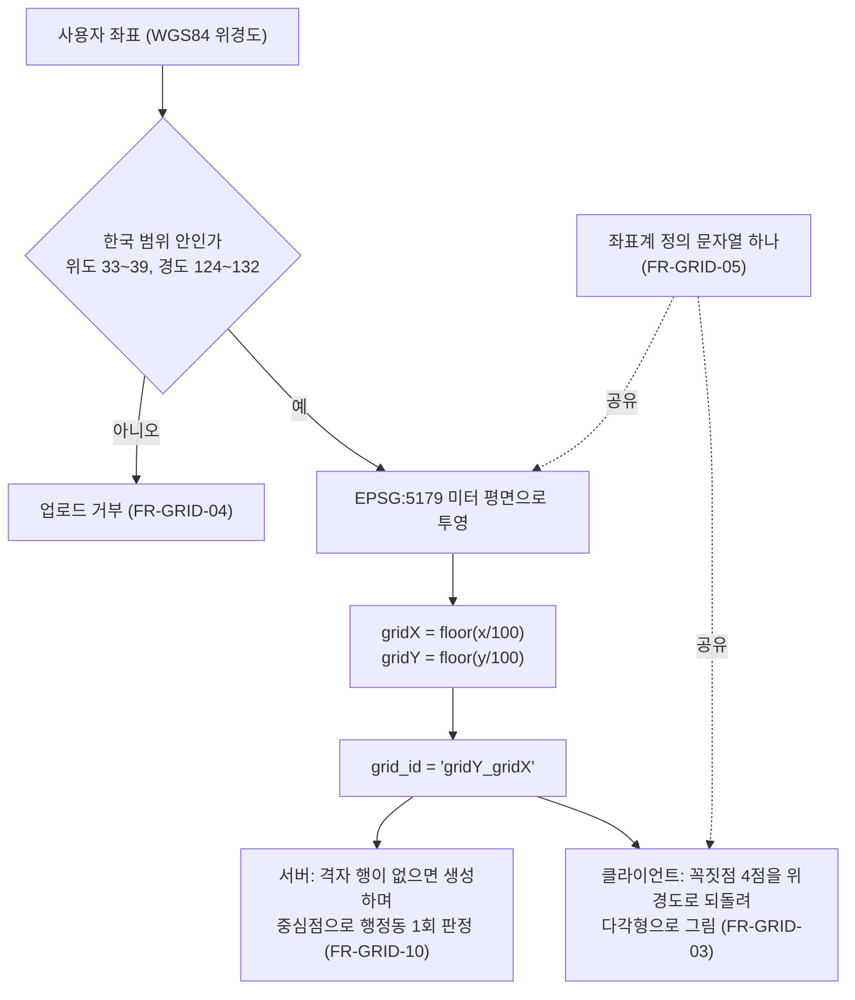

# PRD: 지도와 격자

> 작성일: 2026-08-10 · 작성: prd-writer (MSG-359 역산)
> 상태: 역산 (사후 문서. 구현이 이미 끝난 기능의 요구사항을 스펙과 위키 결정에서 복원했다)
> 커버 티켓: MSG-78, MSG-73, MSG-90, MSG-134, MSG-167, MSG-238, MSG-347, MSG-349, MSG-248(미구현), MSG-189(폐지)
> 관련 SRS: MAP 영역 (FR-MAP-01 ~ 04), GRID 영역 (FR-GRID-01 ~ 12)

## 1. 문제 상황

FillMap의 다른 기능은 전부 격자 위에 얹혀 있다. 영상이 어느 칸에 속하는지, 도감이 몇 칸인지,
행정동 수집률이 몇 퍼센트인지, 뱃지를 줄지 말지가 모두 "이 좌표는 어느 격자인가" 하나의 답에서
갈라져 나온다. 그래서 격자 정의가 흔들리면 그 위의 모든 수치가 함께 흔들린다.

문제는 이 정의가 한 번 바뀌었다는 점이다. 초기 구현은 위도와 경도를 고정 상수로 나누는
등간격 양자화였고, 그것이 근사라는 사실은 처음부터 알고 채택한 것이었다. 실제로 셀의 동서 폭이
서울에서 약 101.6m, 부산에서 약 104.7m로 지역마다 달랐다. 2026-08-08 멘토링에서 이 방식을
지적받아 미터 단위 평면 좌표계 위에서 다시 정의했고, 저장된 데이터를 전량 다시 계산해 옮겼다.

지도 화면 쪽도 한 번 뒤집혔다. 전체 도감과 개인 도감을 오가는 모드 토글을 없애고 상단 칩 네 개로
바꾼 개편이 2026-07-25에 확정되면서, 그 토글을 위해 열려 있던 서버 API 하나가 근거를 잃었다.
미점령 격자를 지도에 어떻게 그릴지도 "표시하지 않는다"에서 "격자망을 항상 깔아 둔다"로 바뀌었다.

이 문서가 없으면 이런 전환의 이유가 어디에도 이어져 있지 않다. 레포에는 결론만 남고, 무엇을
검토하다 버렸는지는 위키의 결정 문서에만 흩어져 있다.

## 2. 목적 · 목표

- **목적**: 100m 격자를 어떻게 정의하고 지도에 어떻게 보여주기로 했는지, 그리고 그 판단이
  무엇을 근거로 어떻게 뒤집혔는지를 한 문서에서 따라갈 수 있게 한다.
- **목표**:
  - 격자 계산 규칙 전환의 앞뒤 사정을 재구성할 수 있다. 전환 전 방식이 무엇을 못 지켰고,
    무엇을 검토했다가 왜 버렸는지가 근거와 함께 남는다.
  - 지도 홈 표현 정책 중 서버 계약을 결정한 것과 화면에만 머무는 것을 구분해 읽을 수 있다.
  - 근거가 없어서 지금도 확정되지 않은 항목이 무엇인지 드러난다.
- **비목표**:
  - 요구사항 문장 자체의 정본이 되는 것. 그것은 `docs/srs.md`이고 이 문서는 ID로 참조만 한다.
  - EPSG:5179 전환의 상세 요구사항. 그 티켓은 이미 `docs/prd/MSG-347-prd.md`를 갖고 있어
    여기서는 결정의 맥락과 기각 대안만 다룬다.
  - 구현 방법. 쿼리 형태, 인덱스, 마이그레이션 순서는 각 스펙 문서와 `.claude/docs/status.md`가
    정본이다.
  - 구역과 표시명(ZONE), 행정동 수집률(REGION), 핫구역(HOTZONE), 장소 검색(SEARCH). 지도 위에
    함께 그려지지만 별도 영역이고 별도 문서가 다룬다.

## 3. 기능 요구사항

문장의 정본은 SRS다. 여기서는 어느 요구가 어느 결정에서 나왔는지를 잇는다.

### MAP: 지도 홈과 표현 정책

| SRS ID | 요지 | 상태 | 어디서 정해졌나 |
|--------|------|------|----------------|
| FR-MAP-01 | 진입 화면은 내 격자, 모드 토글은 없앤다 | 계획 | 지도 홈 개편 확정 (2026-07-25), 5.6절 |
| FR-MAP-02 | 상단 칩 네 개는 한 번에 하나만 켜진다 | 계획 | 같은 확정, 5.6절 |
| FR-MAP-03 | 미션 종류마다 지도에 그리는 모양이 다르다 | 계획 | 기획회의 (2026-07-23), 5.6절 |
| FR-MAP-04 | 베이스맵의 장소 표시를 전부 끈다 | 계획 | 지도 SDK 전환 ADR (2026-07-17), 5.8절 |

MAP 네 건이 모두 계획 상태인 것은 화면 구현 티켓(MSG-248)이 아직 열려 있기 때문이다. 서버는
FR-MAP-01의 부수 효과로 API 하나를 폐지한 것 외에 이 영역에서 할 일이 없다.

### GRID: 격자 시스템

| SRS ID | 요지 | 상태 | 어디서 정해졌나 |
|--------|------|------|----------------|
| FR-GRID-01 | 미터 평면 위에서 100으로 나눈 칸이 격자다 | 구현됨 | MSG-347, 5.1절 |
| FR-GRID-02 | 경계선 위의 좌표가 두 칸에 걸치지 않는다 | 구현됨 | MSG-347 |
| FR-GRID-03 | 칸의 경계는 꼭짓점 네 점으로 표현한다 | 구현됨 | MSG-347, 5.1절 |
| FR-GRID-04 | 한국 밖 좌표의 업로드는 거부한다 | 구현됨 | MSG-93에서 이미 구현, MSG-347이 확인 (8절 참조) |
| FR-GRID-05 | 좌표계 정의 한 줄을 서버와 클라이언트가 공유한다 | 구현됨 | MSG-347, 5.1절 |
| FR-GRID-06 | 아직 채우지 않은 칸을 눌러도 정상 응답이 온다 | 구현됨 | MSG-73 |
| FR-GRID-07 | 뷰포트 응답에는 내가 채운 칸만 담는다 | 구현됨 | MSG-73, MSG-90, 5.7절 |
| FR-GRID-08 | 뷰포트 응답은 커서로 이어 받는다 | 구현됨 | MSG-90, 5.3절 |
| FR-GRID-09 | 잘못된 뷰포트 요청은 모두 같은 방식으로 거절한다 | 구현됨 | MSG-73, MSG-90 |
| FR-GRID-10 | 칸마다 행정동을 한 번 판정해 붙여 둔다 | 구현됨 | MSG-167, 5.5절 |
| FR-GRID-11 | 규칙이 바뀌면 원본 좌표에서 다시 계산해 옮긴다 | 구현됨 | MSG-347, 5.1절 |
| FR-GRID-12 | 규칙이 바뀌어도 API 모양은 그대로다 | 구현됨 | MSG-347 |

## 4. 비기능 요구사항

| SRS ID | 요지 | 어디서 정해졌나 |
|--------|------|----------------|
| NFR-PERF-01 | 뷰포트 조회의 응답 목표와 데이터 신선도 | MSG-134, 5.4절 |
| NFR-PERF-02 | 부하 임계점을 동시 연결이 아니라 초당 요청으로 정의 | MSG-134, 5.4절 |
| NFR-PERF-03 | 지연 백분위를 낼 수 있는 히스토그램 경계 | MSG-321 |

좌표계 정의 문자열을 서버와 클라이언트, 이행 SQL이 글자 단위로 공유해야 한다는 조건은
SRS 2.4절의 제약으로 올라가 있다. 성능 목표가 아니라 정합성의 전제라서 그 자리가 맞다.

## 5. 왜 이렇게 정했나

역산 문서의 값어치가 있는 부분이다. 결론만으로는 복원되지 않는 판단 근거와 버린 대안을 모았다.

### 5.1 100m를 무엇으로 정의할 것인가

처음 채택한 것은 위경도 등간격 양자화였다(MSG-78 D1). 위도를 0.0009도, 경도를 0.00115도로
나눈 칸이다. 이때도 정사각형이 아니라는 사실은 문서에 적혀 있었다. "한국 위도에서 대략
100×102m, 위도가 낮아질수록 가로로 긴 직사각형"이라고 명시하고, 위도 보정과 투영 격자는 하지
않기로 함께 정했다. MVP 범위가 한국이면 근사로 충분하다는 판단이었다.

2026-08-08 멘토링에서 지적을 받고 다시 봤을 때 편차는 서울 약 101.6m, 부산 약 104.7m였다.
같은 서비스 안에서 지역마다 칸 크기가 다르면 "몇 칸을 모았다"는 수치가 지역마다 다른 것을
세는 셈이 된다. 세 가지를 놓고 판단했다.

| 선택지 | 판정 | 이유 |
|--------|------|------|
| 위경도 근사 유지 | 기각 | 문제 자체 |
| EPSG:5179[^1]로 투영한 뒤 100으로 나누기 | 채택 | 좌표가 미터라서 "100으로 나누면 100m"가 정의상 성립한다 |
| H3 같은 육각 격자로 저장 단위를 교체 | 기각 | 멘토도 저장용 기본 격자보다는 조회와 집계용 보조 인덱스에 어울린다고 봤고, 사각형 칸을 색으로 채우는 제품 화면과 모양이 어긋난다 |

파생 효과가 본체보다 컸다는 점이 이 결정의 특징이다. 새 칸은 위경도 축과 평행하지 않아서
(자오선 수렴[^2]이 최대 약 1.6도) 화면에 사각형으로 그릴 수 없고 꼭짓점 네 점의 다각형이 된다.
뷰포트 범위를 낼 때도 남서와 북동 두 점으로는 가장자리 칸이 빠져서 네 점의 최소최대를 써야
한다. 그래서 FR-GRID-03이 별도 요구사항으로 서 있다. 서버와 클라이언트가 각자 변환하면
경계 근처에서 한 칸씩 어긋날 수 있어, 좌표계 정의 문자열[^3] 하나를 글자 단위로 공유하는 것을
계약으로 삼았다(FR-GRID-05).

바꾸지 않은 것도 분명히 해 뒀다. grid_id 포맷, DB 스키마 형태, API 경로와 응답 구조,
표시명 명명 규칙은 그대로이고 값만 교체됐다. 기존 데이터는 영상에 보존된 원본 좌표에서 전량
다시 계산했다(FR-GRID-11). 셀이 재편되면서 사용자별 격자 수가 줄어들 수 있는데, 이미 준 뱃지를
회수하지 않기로 한 것은 정식 배포 전이라 소급 조정할 사용자가 없기 때문이다.

재검토 트리거가 하나 명시돼 있다. 서비스 범위가 한국을 벗어나면 EPSG:5179 자체가 부적합하다.
투영 원점이 한국 기준이라 그렇다.

상세한 요구사항과 이행 범위는 `docs/prd/MSG-347-prd.md`에 있다. 판단 근거의 정본은 위키
`04-decisions/ADR 격자 계산 EPSG5179 전환`이다.

### 5.2 격자 ID를 문자열로 둘 것인가 정수로 바꿀 것인가

같은 멘토링에서 grid_id를 단일 정수로 바꾸자는 제안이 있었다. 인덱스 비용이 근거였다.
기각했고, 근거는 이미 있던 실측이다. 성능이 걸리는 뷰포트 조회는 문자열 키가 아니라 정수 컬럼
두 개의 범위 스캔으로 돌아간다(5.3절). 그래서 얻을 이득은 MVP 규모에서 측정되지 않는 반면,
전 계층 타입 변경과 클라이언트 계약 파괴는 확실하다. 남는 실이득은 키 컬럼 세 곳에서 바이트
몇 개를 줄이는 것뿐이다.

2026-08-10에 Morton 부호화[^4]로 다시 제안됐을 때도 판정은 같았다. 뷰포트는 이미 두 컬럼의
btree 범위 조건이 최적이고, Morton은 사각 범위가 여러 구간으로 쪼개져 오히려 복잡해진다.
구역 매칭은 DB를 타지 않는 메모리 안의 부등식 48건이라 이길 대상이 없다. 다만 재검토 트리거가
발동하면(격자 테이블이 수천만 행이 되어 인덱스가 메모리를 압박한다는 실측) 그때는 순번 정수가
아니라 Morton이 맞다는 것까지 결론에 포함돼 있다.

### 5.3 뷰포트 조회를 어느 경로로 돌릴 것인가

MSG-73은 답을 미리 고르지 않고 두 경로를 다 구현한 뒤 실측으로 골랐다. 접근 A는 격자 인덱스
정수 컬럼의 범위 스캔이고, 접근 B는 경계 도형에 건 GiST 공간 인덱스[^5] 조회다. 서울 대략
경계를 채운 11만여 격자에서 같은 뷰포트로 잰 결과는 이랬다.

| 항목 | 접근 A | 접근 B |
|------|--------|--------|
| 반환 행 | 675 | 675 |
| 실행 시간 | 5.765ms | 88.604ms |
| shared buffers hit | 504 | 1,378 |

두 경로가 같은 675행을 냈다는 점이 먼저 중요하다. 결과가 같으니 남는 것은 비용 비교뿐이다.
차이의 원인은 인덱스가 아니라 재검사였다. B도 인덱스로 후보는 빠르게 좁히지만, 경계 도형이
GEOGRAPHY 타입이라 교차 판정이 구면 연산으로 돌아가고 그것이 실행 시간을 지배했다. A에는
도형 연산 자체가 없다.

MSG-90에서 A를 고정하고 전략 선택 파라미터를 API에서 제거했다. 이 실측은 나중에 5.2절의
정수 ID 기각 근거로 다시 쓰였다. 한 번 제대로 재 둔 값이 두 번 결정을 지탱한 사례다.

페이지네이션은 커서 방식[^6]으로 정했다. OFFSET을 쓰지 않은 이유는 깊은 페이지에서 비용이
선형으로 늘고, A 경로가 이미 쓰는 btree 정렬 순서를 그대로 활용할 수 있기 때문이다.

### 5.4 지도를 실시간으로 밀 것인가 당겨 갈 것인가

뷰포트 조회는 지도를 움직일 때마다 호출되는 최고 트래픽 지점이라, 구현 전에 전송 방식을
먼저 못박았다(MSG-134). 폴링으로 확정하고 웹소켓은 Phase 2로 미뤘다.

근거는 상태를 바꾸는 주체가 누구냐였다. 개인 도감의 색칠은 내가 올릴 때만 바뀐다. 서버가 먼저
밀어 줄 사건이 없는데 연결을 상시 유지하면 연결마다 메모리와 파일 디스크립터를 붙잡고 인스턴스가
늘면 발행 구독 계층까지 필요해진다. 내가 방금 올린 칸이 바로 칠해져야 하는 문제는 서버 푸시가
아니라 클라이언트가 업로드 응답으로 미리 칠하는 방식으로 풀었다.

응답 목표를 p95 300ms로 잡은 근거도 남아 있다. 지도를 멈춘 뒤의 요청이라 결제 수준인 150ms는
과하다고 봤다. 신선도 30초는 캐시 수명과 같은 값이고, 색칠이 몇 초 늦어도 무해하다는 판단에서
공격적인 캐싱을 허용하려고 느슨하게 뒀다. 임계점을 동시 연결 수가 아니라 목표를 깨는 초당 요청
수로 정의한 것도 폴링이기 때문이다.

줌 레벨 파라미터를 두지 않기로 한 것은 별도 결정이다. 뷰포트 범위가 이미 줌을 담고 있고, 한 변
0.5도라는 상한이 줌 아웃 폭주를 막는다. 낮은 줌에서 칸을 개별로 내리는 대신 묶어서 내리는
집계 응답은 실측으로 무거움이 확인되거나 축소 뷰 기획이 확정될 때 다시 꺼내기로 했다.

### 5.5 격자에 행정동 이름을 어디에 붙일 것인가

도감 갤러리에 "역삼1동" 같은 이름을 붙이려면 격자가 어느 행정동인지 알아야 한다. 조회할 때마다
공간 연산으로 판정하지 않고 격자 테이블에 컬럼으로 저장하기로 했다(MSG-167). 핵심 논리는 행정동이
격자 중심점만으로 정해지는 격자 자체의 속성이라는 것이다. 사용자별 도감 테이블에 두면 그 칸을
채운 사람 수만큼 같은 값이 중복된다.

버린 대안이 셋이다.

| 대안 | 기각 이유 |
|------|----------|
| 사용자별 도감 테이블에 저장 | 함수 종속을 어겨 점령자 수만큼 중복된다 |
| 행정동 이름 자체를 복사해 두기 | 행정동 개편 시 두 곳을 함께 고쳐야 한다 |
| 조회할 때마다 공간 연산으로 판정 | 조회 경로에 공간 연산을 두지 않는다는 기존 결정과 충돌한다 |

기입 시점도 따로 골랐다. 격자 행이 태어나는 그 문장 안에서 한 번만 판정한다. 재방문 업로드에서는
판정 자체가 일어나지 않는다. 수집률 갱신 경로에서 갱신하는 안은 호출 조건과 라벨이 필요한 조건이
어긋나서 기각했다. 수집률 갱신은 사용자마다 첫 점령과 롤백마다 도는데 라벨은 격자 생애에 한 번이면
충분하다.

멘토가 제안한 "영상을 행정동에 직접 연결하자"도 기각됐다. 저장하는 값이 포함 관계 전체가 아니라
격자 중심점 하나로 정해지는 대표 귀속이라, 영상마다 복사하면 드리프트가 생긴다. 이 판단 덕에
도감 갤러리 라벨, 행정동별 영상 모아보기, 칸을 눌렀을 때 나오는 수집률이 항상 같은 축으로 귀속된다.

한 가지는 나중에 뒤집혔다. 처음에는 이 컬럼에 인덱스를 만들지 않기로 했다. 어떤 조회도 행정동
코드가 주도하지 않는다는 근거였고, 실제로 그때는 맞았다. MSG-238에서 행정동 코드가 주도하는 탐색
조회가 처음 생기면서 예약해 둔 대로 인덱스를 추가했다. 조건이 바뀌어 결정이 바뀐 경우라 번복이
아니다.

### 5.6 지도 홈을 무엇으로 채울 것인가

원래 구조는 나, 친구, 전체, 핫을 오가는 탐색 모드 토글이었다. 2026-07-24에 핫구역이 MVP로
들어오고 축제와 팝업, 코스까지 지도 홈에 올라오면서 이 구조가 맞지 않게 됐다. 2026-07-25에
정리했다.

전체 모드는 Phase 2로 미룬 것이 아니라 기획에서 삭제했다. 이 결정의 부수 효과로 전체 축 뷰포트
API(MSG-189)가 근거를 잃고 폐지 후보가 됐다. 화면 정책이 서버 API 하나를 없앤 사례라, 화면
표현이지만 SRS의 요구사항으로 올려 둔 이유가 여기에 있다.

진입 기본값은 내 격자이고, 상단에 칩 네 개(핫구역, 지역 축제, 팝업 스토어, 코스 추천)를 둔다.
칩은 한 번에 하나만 켜지고 켜진 칩을 다시 누르면 꺼져서 기본 화면으로 돌아온다.

미션을 지도에 그리는 방식은 2026-07-23 기획회의에서 수렴했다. 축제를 9×9 격자 81칸으로 노출하면
"한 칸만 찍었다"는 인상을 주는 프레이밍 문제가 있어 격자를 감추고 큰 면이나 원으로 그린다.
코스는 격자를 따라 그리면 계단 모양이 되고 실제 보행 경로는 추적하지 않아서 모르기 때문에 직선으로
잇되 통과 판정만 격자로 한다. 팝업은 면보다 핀이 낫다고 보고 마커와 정보 카드로 정리했다.

격자를 눌렀을 때 뜨는 바텀시트에 길찾기 버튼을 두자는 설계검토 안은 폐기했다(2026-08-10 성민
확인). 같은 2026-07-23 회의에 필요 없다는 발언이 이미 나와 있었고, 지도 앱으로 넘기는 버튼은
체류 시간을 깎고 사용자를 서비스 밖으로 내보낸다는 것이 판단 근거다.

### 5.7 아직 채우지 않은 칸을 지도에 그릴 것인가

이 항목은 뒤집힌 이력이 요구사항보다 중요하다.

2026-07-05에는 표시하지 않기로 했다. 2026-07-23 회의에서는 점선으로 깔지 실선으로 깔지를 두고
전체 점선은 과하다는 의견이 나와 토글로 비교해 보기로 하고 미결로 남았다. 2026-08-04에 디자인
시안을 실측해 격자망을 항상 점선으로 깔고 채운 칸에만 색을 올리는 것으로 확정했다.

서버 계약은 이 뒤집힘에 영향받지 않았다. 뷰포트 응답은 여전히 채운 칸만 담는다(FR-GRID-07).
격자가 서버가 관리하는 리소스가 아니라 전역에 고정된 눈금이기 때문이다. 클라이언트가 계산 규칙
산술만으로 칸 경계를 그릴 수 있어서, 화면에 점선을 까는 일에 서버가 관여할 이유가 없다. 이
구분은 2026-07-23 프론트와의 합의에서 "격자 사전 생성"이라는 표현을 정정하면서 명확해졌다.
격자를 미리 만들어 두는 것이 아니라, DB에는 영상이 올라온 칸만 기록된다.

### 5.8 지도 SDK를 무엇으로 쓸 것인가

서버 변경이 없는 결정이지만 FR-MAP-04의 근거라서 남긴다. 카카오맵에서 네이버 지도로 옮겼다.
카카오는 베이스맵의 장소 표시를 끌 수 없어서 격자가 주인공이라는 화면 정책과 도구 자체가
충돌했고, 앱 확장 계획에 필요한 공식 SDK도 없었다. 네이버는 스타일 편집으로 심볼을 전부 끌 수
있고 무료 한도가 월 600만 건이다. 구글은 무료 한도가 월 1만 지도 로드라 사용자 100명이 하루 세
번만 열어도 소진되고, 한국 지도 품질도 검증되지 않아 기각했다.

## 6. 격자 판정 흐름

좌표 하나가 격자 ID가 되기까지의 경로다. 서버와 클라이언트가 갈라지는 지점과 공유하는 계약이
어디인지가 이 그림의 요점이다.

## 7. 미확인

근거를 찾지 못했거나 지금도 확정되지 않은 항목이다. 지어내지 않고 그대로 남긴다. 이후 확인으로
답이 정해진 항목은 지우지 않고 결론과 출처를 그 자리에 남긴다.

- **칩을 켠 동안 내 격자 색칠을 유지할지.** 지도 홈 개편 확정 문서의 열린 질문 그대로다.
  SRS 미해결 질문에도 같은 항목이 올라가 있다.
- **미션 노출 반경의 값과 정렬 기준.** 방식은 정해졌다. 지도에 보이는 영역으로 자르되 종류마다
  다른 반경을 쓴다(2026-08-10 성민 확인, 구현은 MSG-368). 남은 것은 축제와 코스와 팝업 각각의
  값이고 FE와 상의해 정한다. 회의에서 언급된 10~20km는 종류 구분이 없던 시절의 범위다.
- **코스의 시작점과 순번 표기.** 필요하다는 논의만 있었다.
- **바텀시트의 길찾기 버튼. 넣지 않기로 확정했다(2026-08-10 성민 확인).** 2026-07-23 회의의
  "필요 없다"가 유효하고 설계검토 문서의 길찾기 CTA를 폐기한다. 지도 앱으로 넘기는 버튼은 체류
  시간을 깎고 사용자를 서비스 밖으로 내보낸다는 판단이다. 어느 쪽이 최신인지 가리지 못해
  미해소로 두었던 배치가 이것으로 풀렸다. 5.6절에 근거를 적었다.
- **뷰포트 응답 캐시.** MSG-134가 부하 임계점을 늘릴 첫 번째 수단으로 지목했고 신선도 30초라는
  목표도 그 캐시의 수명을 전제로 잡혔는데, 해당 티켓(MSG-89)의 스펙 문서가 레포에 없고
  `.claude/docs/status.md`에도 구현 기록이 없다. 미구현으로 보이지만 확정하지 못했다.
- **줌 아웃 집계와 클러스터링의 도입 시점.** 실측이 임계를 넘거나 축소 뷰 기획이 확정될 때
  다시 본다는 조건만 있고 그 실측이 언제 이뤄지는지는 정해져 있지 않다.

## 8. SRS 갱신 후보

SRS에 없어서 요구사항 표에 넣지 않은 새 요구는 없었다. 대신 근거 표기 오류 한 건을 발견했다.

- **FR-GRID-04의 근거에 적힌 MSG-193은 MSG-93의 오기로 보인다.** 좌표 범위 상수
  (`KoreaCoordinates`)를 공용화한 커밋은 `MSG-93 fix: 한국 좌표 범위 상수 global 공용화`이고,
  MSG-193 스펙은 신고 블라인드 처리라 좌표와 무관하다. `docs/prd/MSG-347-prd.md` 8절에 같은
  표기가 있어 그쪽에서 옮겨온 것으로 보인다. 두 문서를 함께 고치는 것이 맞다.

[^1]: EPSG:5179. 한국 전역을 하나의 원점으로 미터 단위로 다루는 국가 표준 평면 좌표계. 좌표가 미터라서 100으로 나누면 100m 칸이 정확히 성립한다.
[^2]: 자오선 수렴. 평면 좌표계의 세로축과 실제 북쪽 방향이 이루는 각도 차이. 원점 경도에서 멀어질수록 커져서, 미터 평면에서 반듯한 사각형이 위경도 지도 위에서는 살짝 기울어져 보인다.
[^3]: 좌표계 정의 문자열. 투영법과 원점, 타원체 같은 좌표계의 수학적 정의를 한 줄로 적은 것(proj4 형식). 서버와 클라이언트가 이 문자열이 글자 단위로 같아야 같은 계산 결과가 나온다.
[^4]: Morton 부호화. 2차원 좌표의 비트를 번갈아 끼워 하나의 정수로 만드는 방식. 가까운 위치가 비슷한 값을 갖게 되어 공간 지역성이 생긴다.
[^5]: GiST 인덱스. PostgreSQL이 도형처럼 크기와 범위를 가진 값을 색인할 때 쓰는 구조. 후보를 빠르게 좁히지만 실제 포함 여부는 다시 계산해서 확인해야 한다.
[^6]: 커서 페이지네이션. 몇 번째부터 건너뛰라고 지시하는 대신 "직전에 어디까지 봤다"는 위치 값을 주고받는 방식. 뒤쪽 페이지에서도 비용이 늘지 않는다.
