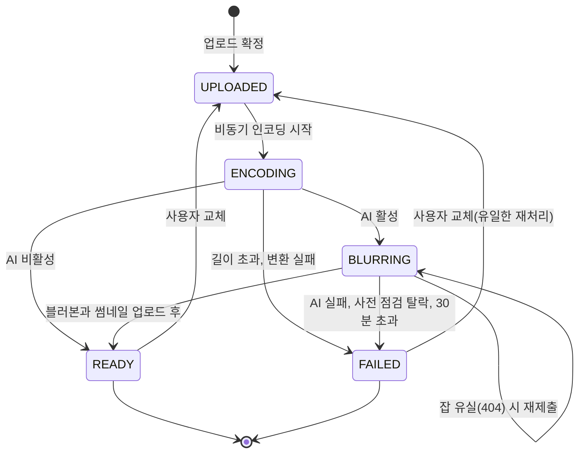

# PRD: 영상 처리 파이프라인

> 작성일: 2026-08-10 · 작성: prd-writer (MSG-359 역산)
> 상태: 역산 (사후 문서. 구현이 이미 끝난 기능의 요구사항을 스펙과 위키 결정에서 복원했다)
> 커버 티켓: MSG-65, MSG-142, MSG-143, MSG-144, MSG-145, MSG-149/150, MSG-241, MSG-283, MSG-286, MSG-313(영상 종결 통지 부분), MSG-350, MSG-351
> 관련 SRS: MEDIA 영역 (FR-MEDIA-01 ~ 17), NFR-PERF-08, NFR-OPS-06, NFR-OPS-07, NFR-SEC-04

## 0. 이 문서의 범위

업로드가 확정된 다음부터 영상이 재생 가능해질 때까지가 범위다. 변환, 블러, AI 분석, 실패
수렴, 재처리를 다룬다. 업로드 확정 자체(사전서명 URL 발급, 키 소유권 검증, 격자 귀속)와
재생 시 접근 제어는 VIDEO 영역 문서가 담당한다. 예외로 선분석(MSG-351)은 확정 전에 도는
기능이지만 계산 주체가 같은 AI 서버라 여기 둔다.

## 1. 문제 상황

FillMap은 사용자가 방문한 자리에서 찍은 짧은 영상으로 격자를 채우는 서비스다. 그런데 올라온
파일을 그대로 다시 내려주는 것으로는 서비스가 성립하지 않았다. 세 가지 압력이 동시에 있었다.

첫째, 원본이 제각각이다. 기기와 촬영 앱에 따라 해상도, 코덱, 회전 정보가 전부 다르다. 웹과
앱 양쪽에서 같은 플레이어로 재생하려면 서버가 한 형식으로 맞춰야 한다.

둘째, 프라이버시가 기능의 전제다. 길에서 찍은 영상에는 지나가는 사람의 얼굴과 주차된 차의
번호판이 그대로 담긴다. 이 영상은 지도 위에서 남에게 공개되는 콘텐츠라, 미처리본이 한 번
나가면 회수가 되지 않는다. 얼굴과 번호판 블러를 사람 손에 맡길 수 없어서 자동 처리가
필요했다.

셋째, 처리가 오래 걸린다. 실측으로 한 건에 분 단위가 걸린다(1080p 30초 기준 3분에서 4분,
MSG-142). 사용자를 그만큼 기다리게 할 수 없으니 확정 응답과 처리를 떼어놓아야 했고, 떼는
순간 "떼어놓은 작업이 유실되면 어떻게 되는가"가 설계의 중심 문제가 됐다.

여기에 자원 제약이 겹친다. MVP 기간의 인프라는 EC2 t3.small 한 대였고(2 vCPU, 1.9GB), 그
위에서 애플리케이션과 DB와 Redis와 ffmpeg와 AI 추론이 같은 CPU를 나눠 썼다. 아래 결정
대부분은 "이 상자 안에서 유실 없이 돌아가는가"를 기준으로 갈렸다.

## 2. 목적과 목표

- **목적**: 사용자가 올린 영상이 재생 가능한 상태 아니면 정당한 실패 상태 둘 중 하나로
  반드시 수렴하게 한다. 그 사이에 미처리본이 남에게 노출되지 않는다.
- **목표**:
  - 업로드 확정 응답이 처리 시간과 분리된다. 사용자는 올리고 화면을 떠날 수 있다.
  - 처리 결과가 어떻게 끝났든 영상이 중간 상태에 영구히 갇히지 않는다.
  - 얼굴과 번호판이 가려지기 전의 픽셀은 스토리지에 저장되지 않는다.
  - 처리가 끝나면 소유자가 앱을 다시 열지 않아도 결과를 안다.
  - AI 서버가 없거나 죽은 환경에서도 서비스가 돈다(로컬, CI, AI 장애 시).
- **비목표**:
  - 처리 실패에 대한 서버 자동 재시도. 사용자가 영상을 교체하는 것이 유일한 재처리 경로다
    (5.12절).
  - 다중 인스턴스 수평 확장. 단일 인스턴스 전제가 폴러 설계 전반에 깔려 있다(5.3절).
  - AI 판정을 백엔드가 재검증하는 것. 탈락 판정은 AI 임계값을 그대로 신뢰한다.
  - 실패 사유를 사용자에게 노출하는 API. 사유는 저장하지만 조회 경로를 만들지 않았다.

## 3. 기능 요구사항

요구사항 문장 정본은 `docs/srs.md`의 MEDIA 절이다. 여기서는 이 PRD가 근거를 대는 대상만
한 줄로 가리킨다.

| SRS ID | 이 문서가 근거를 대는 요구 | 근거 티켓 |
|--------|---------------------------|-----------|
| FR-MEDIA-01 | 확정본을 720p H.264와 AAC로 표준화하고 썸네일 1장을 뽑는다 | MSG-65 |
| FR-MEDIA-02 | 처리 상태가 단계별로 진행하고 조회 응답에 노출된다 | MSG-65, MSG-149 |
| FR-MEDIA-03 | 실측 길이 30초 초과는 신고값과 무관하게 실패로 끝난다 | MSG-65 |
| FR-MEDIA-04 | 얼굴과 번호판을 자동으로 가리고, 가리기 전 프레임은 스토리지에 남기지 않는다 | MSG-145, MSG-149 |
| FR-MEDIA-05 | AI 처리를 설정으로 끌 수 있고 끄면 인코딩 완료가 곧 준비 완료다 | MSG-149 |
| FR-MEDIA-17 | 블러는 전 프레임을 처리한다 (프레임 스킵 기각) | MSG-142, MSG-144, MSG-207 |
| FR-MEDIA-06 | 30분 안에 결과가 없으면 실패로 확정하되, 살아 있는 잡은 기다리고 사라진 잡은 재제출한다 | MSG-149, MSG-283 |
| FR-MEDIA-07 | 못 쓸 영상은 타임아웃을 기다리지 않고 다음 주기에 실패하며 사유가 구분되게 남는다 | MSG-286 |
| FR-MEDIA-08 | 처리 종결을 소유자에게 통지하되 실패 사유는 문구에 싣지 않는다 | MSG-313 |
| FR-MEDIA-09 | 하이라이트를 최대 3구간 계산해 보관하고 배열 순서가 추천 우선순위다 | MSG-145, MSG-350 |
| FR-MEDIA-10 | 단건 재생 응답에 하이라이트를 싣고 없음은 null 하나로 통일한다 | MSG-350 |
| FR-MEDIA-11 | 확정 전 원본에 대해 하이라이트를 미리 받을 수 있고 결과는 저장하지 않는다 | MSG-351 |
| FR-MEDIA-12 | 선분석 구간은 최소 5초이고 시작점 간격도 5초 이상이다 | MSG-351, MSG-353 |
| FR-MEDIA-13 | 선분석 원본은 3분 이하만 허용하고 판정은 실측 길이로 한다 | MSG-351 |
| FR-MEDIA-14 | 선분석 업로드에만 2GiB 상한을 따로 적용한다 | MSG-351 |
| FR-MEDIA-15 | 동시 선분석은 2건까지이고 초과는 즉시 거절하며 실패해도 위저드는 계속된다 | MSG-351 |
| FR-MEDIA-16 | 선분석 응답 목표는 30초 1080p 기준 p50 5초, p95 10초다 | MSG-351, MSG-353 |

## 4. 비기능 요구사항

| 분류 | 요구사항 | SRS 참조 |
|------|----------|----------|
| 성능 | 확정부터 재생 준비까지 30초 목표. 단독 처리는 마진 25%로 들어오지만 동시 2건부터 목표를 넘는다 | NFR-PERF-08 |
| 운영 | AI 연동은 설정 플래그로 게이트하고 기본은 꺼둔다. 꺼진 환경에서 서비스가 정상 동작해야 한다 | NFR-OPS-06 |
| 운영 | ffmpeg 같은 런타임 의존의 설치를 사람 기억이 아니라 배포 절차가 멱등하게 보장한다 | NFR-OPS-07 |
| 보안 | 선분석용 업로드도 사전서명 URL 경로를 그대로 쓴다. 영상 바이트가 서버로 직접 들어오는 두 번째 경로를 만들지 않는다 | NFR-SEC-04 |
| 데이터 정합 | 선분석 결과와 확정본의 저장 하이라이트는 독립이다. 원본을 잘라 올리면 값이 달라지는 것이 정상이다 | (MSG-351) |

## 5. 왜 그렇게 정했나

이 절이 역산 문서의 본론이다. 결론은 스펙과 코드에 남아 있지만 검토했다가 버린 쪽은
어디에도 이어져 있지 않아서, 지금 구조를 처음 보는 사람이 "왜 이렇게 복잡한가"를 되묻게
된다.

근거가 어디에 있는지를 먼저 밝혀 둔다. 팀 위키에 정식 결정 기록으로 남아 있는 것은 5.1의
실행 환경 하나뿐이고, 모델 선정과 최적화 기각은 실측 노트로 남아 있다. 반면 **운영 신뢰성
영역(전달 방식, 재시도, 타임아웃, 재처리, 동시성 제어, 사전 점검)은 위키에 근거가 없다.**
그쪽은 전부 레포의 스펙 문서와 교차 리뷰 이력에서 복원했다. 이 비대칭 자체가 이 문서를 쓴
이유이기도 하다. 위키만 읽은 사람은 파이프라인의 절반을 못 본다.

### 5.1 AI를 어디서 돌릴 것인가

**정한 것**: dev EC2에 Docker 컨테이너를 하나 더 붙이는 상시 Python FastAPI 서버.
`c7g.medium`(1 vCPU, 2GB) 이상. 처리 요청은 반드시 비동기. 파이프라인 첫 단계에 1080p
30fps 다운스케일을 넣는 것이 전제 조건이다. (MSG-143, 2026-07-21 확정)

**기각한 대안 1: AWS Lambda.** 비용만 보면 월 1,000건에서 $4.5 대 $29.8로 Lambda가 6배
싸다. 손익분기가 월 6,650건이라 MVP 규모에서는 Lambda가 유리한 구간이었다. 그런데도 버린
이유는 셋이다. 처리 시간이 3분에서 10분이라 Lambda의 15분 제한과 모양이 안 맞고(4K가 제한의
64.5%인데 이 측정에는 S3 왕복과 이미지 pull이 빠져 있어 실제로는 11분에서 13분까지 갈 수
있다), 막혔을 때 빠져나갈 카드가 없으며(보통은 메모리를 올려 vCPU를 늘리는데 실측상 2 vCPU와
1 vCPU 차이가 1%에서 10%뿐이었다. 추론이 병렬화되지 않는다), torch 때문에 zip이 아니라 ECR
컨테이너 이미지가 필요해 배포 파이프라인을 새로 만들어야 했다. 월 $25의 차이로 이 위험을
사는 편이 쌌다.

**기각한 대안 2: GPU 인스턴스.** `g4dn.xlarge` 월 $384. CPU로 제한 안에 들어오는 것이
확인돼 MVP 트래픽에 과하다고 봤다. GPU 실측은 아예 생략했다(7절 미확인).

**기각한 대안 3: 노트북 벤치마크로 판단하기.** 이건 대안이라기보다 하마터면 결론을 뒤집을
뻔한 함정이라 기록에 남았다. 개발 노트북(M5)에서 잰 값이 Graviton3 대비 4.1배에서 4.5배
낙관적이었다. 스레드 수를 1로 묶어 저사양을 흉내 내는 방법도 무효였다. 행렬 곱 20회를
비교했더니 1스레드 0.15초, 4스레드 0.14초로 차이가 없었는데, Apple Silicon의 PyTorch가
전용 가속 백엔드를 타면서 스레드 설정을 무시하기 때문이다. 여기서 "리눅스 인스턴스 실측 외에
방법이 없다"가 팀의 원칙으로 굳었다.

**재검토를 여는 조건**을 그때 함께 못 박았다. 월 처리량이 6,650건에 가까워질 때, 트래픽이
평소 0에 가끔 폭증하는 간헐 스파이크 형태로 굳을 때, 다운스케일해도 처리 시간이 10분을
넘을 만큼 모델이 무거워질 때다.

**전제 조건이 왜 필수인가**: 프레임당 추론 시간이 해상도와 무관하다(227ms에서 230ms).
ultralytics가 어차피 내부에서 640px로 리사이즈하기 때문이다. 그래서 4K가 느린 건 해상도가
아니라 프레임 수(60fps) 탓이고, 1080p 30fps로 낮추면 프레임이 1800에서 900으로 줄어 9.7분이
3분에서 4분이 된다. 정확도 손실은 사실상 없다.

### 5.2 어떤 모델을 쓰고 라이선스를 어떻게 감당할 것인가

**정한 것**: 얼굴은 `AdamCodd/YOLOv11n-face-detection`, 번호판은
`morsetechlab/yolov11-license-plate-detection`, 하이라이트는 PySceneDetect와 프레임 차분을
쓰는 룰 기반. 둘 다 YOLOv11n이라 ultralytics 런타임 한 벌을 공유한다. (MSG-144, 2026-07-20)

**라이선스 판단이 이 결정의 실제 무게였다.** Ultralytics YOLOv11은 AGPL-3.0[^1]이라 배포
없이 네트워크 서비스로만 제공해도 소스 공개 의무가 발동한다. 그런데 FillMap에는 실질 비용이
거의 없었다. 백엔드 레포가 이미 공개된 MIT이고, AI 서버는 별도 레포에 별도 프로세스로 떠서
HTTP로만 통신하므로 전염 경계가 거기서 끊긴다. 그래서 AI 레포만 AGPL-3.0으로 만들고
백엔드는 MIT를 유지했다.

**기각한 대안 1: YuNet과 OpenVINO OMZ barrier-0123 조합**(MIT와 Apache-2.0). 라이선스는
자유롭지만 정확도가 열세다. YuNet은 작은 얼굴과 측면 얼굴에 약하고, barrier-0123은 중국
BIT-Vehicle 데이터로 학습됐다.

**기각한 대안 2: Ultralytics 상용 라이선스.** AGPL 조건을 지킬 수 있는 상황이라 살 이유가
없었다.

**기각한 대안 3: 하이라이트에 CLIP 붙이기.** 30초 영상에 CLIP 프레임 스코어링은 과하다고
봤고, 상위 티켓이 이미 룰 기반으로 확정한 상태였다.

이 결정에는 명시된 유효 기간이 있다. "상업화와 창업 연계 계획 없음"이 전제이고, 이 전제가
바뀌면 AI 레포를 permissive 스택으로 갈아엎어야 한다.

한국 번호판 데이터셋이 사실상 없다는 리스크는 낮게 봤다. 우리는 블러만 하고 문자 인식을
하지 않는데, 국가별 차이는 번호판 위의 문자에 있지 사각형 검출에 있지 않기 때문이다.

**탐지 임계값은 과검출 쪽으로 튜닝한다**(MSG-158, 2026-07-20). 처음 설정에서 정면 얼굴이
여럿 잡히지 않아 자동 블러 요구가 충족되지 않았다. 얼굴 확신도 기준을 0.25에서 0.05로 내리자
재현율이 0.72에서 0.980으로 올랐고 처리 시간은 1.01배로 사실상 그대로였다. **기각한 대안은
더 큰 모델로 바꾸기와 입력 해상도 올리기 둘**인데, 시간을 늘리지 않고 같은 재현율이 나오는
방법이 있는데 무겁게 풀 이유가 없다는 것이 근거다. 번호판은 기존 기준을 유지했다. 이 조정의
바탕에는 "블러가 과하게 걸리는 손해는 작고 미탐지는 프라이버시 사고"라는 비대칭 판단이 있다.

### 5.3 백엔드와 AI를 무엇으로 잇는가

**정한 것**: 큐도 웹훅도 아니고 HTTP 폴링이다. `@Scheduled(fixedDelay)` 폴러[^2] 하나가
30초마다 처리 중인 영상을 일괄 조회해서, 아직 제출 안 된 건은 제출하고 제출된 건은 상태를
물어본다. (MSG-149 D3)

**핵심은 상태를 어디에 두느냐였다.** 처리 중이라는 사실을 DB의 `processing_status`에 두면
서버가 재시작해도 다음 폴 주기에 그 행이 그대로 다시 잡힌다. 재시작 복구가 공짜로 따라온다.
잡별로 메모리에 비동기 루프를 띄우는 방식은 코드가 짧지만 재시작 한 번에 진행 중인 작업이
전부 증발한다.

**기각한 대안: Kafka 도입.** 이건 추측이 아니라 실측으로 닫은 결정이다(MSG-151, 2026-07-22).
동시 3건과 6건을 실제 사용자 경로 그대로 태워 본 결과, 확정 API 응답은 부하와 무관하게 2초
안쪽이었고 전 건이 유실 없이 준비 완료로 수렴했다. 큐 적체 중 타임아웃 오탐도 0건이었다.
판단은 이랬다. 큐잉 자체는 DB 상태 기반 폴러로 이미 성립하고, 문제는 큐 인프라가 아니라
처리량이다. Kafka를 넣어도 AI 워커가 하나면 시간당 20건이라는 상한은 그대로다. 처리량을
올리려면 AI 서버 증설이 먼저이고, 그때 잡을 여러 컨슈머에 나눠야 하면 DB의 `SKIP LOCKED`로
충분하다. 재평가 트리거는 시간당 업로드가 지속적으로 20건을 넘거나 AI 워커를 수평 확장할 때로
남겼다.

여기서 파생된 전제 하나가 코드베이스 전반에 깔려 있다. **단일 인스턴스다.** 폴러의 잡
정체성 가드도, ffmpeg를 스레드 풀 1개로 직렬화한 것도 이 전제 위에 있다. 다중 인스턴스로
가면 완료 경합과 제출 경합 두 지점이 열린다는 것을 검토한 뒤, 투기적 분산 설계를 넣지 않고
천장만 주석으로 명시하기로 했다(MSG-149 리뷰 8라운드).

**이 결정의 기록 상태를 짚어 둘 필요가 있다.** 팀 위키의 API 스펙 통합 문서는 이 항목을
아직 "AI 연동 계약 세부(콜백 방식인지 폴링인지, 폴링 주기, 실패 재시도)는 미정"으로 적어
두고 있다. 즉 폴링 채택은 레포 스펙에서만 결론이 났고 위키로 올라가지 않았다. AI 파이프라인
다이어그램은 한술 더 떠서 이 구간을 Kafka 컨슈머로 그려 놓았는데, 그림이 구현보다 앞서
그려진 뒤 2026-07-26부터 동결됐기 때문이다. `architecture.md`의 SysA v2도 같은 이유로 Kafka
점선을 유지하고 있다. **그림만 보고 큐가 있다고 판단하면 안 된다.**

### 5.4 인코딩은 어디서 도는가

**정한 것**: 별도 워커도 Lambda도 아니고 애플리케이션 안의 `@Async`다. 업로드 메타 저장
트랜잭션이 커밋된 직후에 비동기로 호출한다. ffmpeg는 EC2에 직접 설치한 바이너리를
`ProcessBuilder`로 부른다. (MSG-65 D1, D3)

근거는 단순하다. MVP 트래픽에 충분하고, 이 프로젝트에는 Dockerfile이 없어서 "런타임 이미지에
포함"이라는 선택지 자체가 성립하지 않았다. 배포는 CD가 jar를 복사하고 systemd가 실행하는
구조다.

여기서 한 번 사고가 났고 요구사항이 하나 늘었다. ffmpeg 설치를 "인프라 담당이 1회 실행"으로
뒀더니 인스턴스가 교체될 때 유실됐다. 2026-08-10에 CD의 재시작 단계로 옮겨 매 배포마다 멱등
설치를 보장하게 바꿨다(NFR-OPS-07). 사람의 기억에 의존하는 설치 절차는 인스턴스 수명보다
짧다는 것이 이 항목의 교훈이다.

CI에는 ffmpeg를 설치하지 않기로 했다. 실제 ffmpeg를 쓰는 테스트는 바이너리가 없으면 전부
건너뛰게 해서 CI가 깨지지 않는다.

### 5.5 실패가 어떻게 수렴하는가

**정한 것**: 명시적 백오프도 재시도 횟수 카운터도 죽은 편지함도 없다. 대신 불변 원칙 하나를
세웠다. **모든 폴 주기의 결말은 성공, 가드 거부, 타임아웃 검사 셋 중 하나여야 한다.**
(MSG-149 D4, 리뷰 7라운드에서 원칙으로 승격)

이 원칙이 필요했던 이유가 이 파이프라인의 성격을 잘 보여준다. 처음에는 예외를 잡아서
로그만 남기고 다음 주기로 넘기는 자리가 여럿 있었다. 그런데 그 자리들은 예외가 아니라 값의
형태로 실패가 돌아올 때(연결 실패로 상태를 못 만든 경우, 200 응답인데 본문이 깨진 경우,
완료라는데 결과물을 못 받는 경우) 조용히 무한 재시도가 됐다. 영상은 처리 중 상태에 영원히
갇히는데 로그만 쌓인다. 그래서 실패의 종류를 늘려 잡는 대신, 빠져나갈 문을 셋으로 줄이고
나머지를 전부 타임아웃 검사로 라우팅하는 쪽을 택했다.

타임아웃 기준에서도 한 번 방향을 바꿨다. 처음엔 영상 생성 시각 기준이었는데, 영상을 교체하면
재인코딩이 도는 동안에도 생성 시각은 옛날 그대로라 100% 결정적으로 오탐이 났다. 기준을
"이번 처리 시도가 시작된 시각"으로 옮겨 컬럼을 새로 만들었다. 이 값이 시도 넌스[^3] 역할도
겸한다.

또 하나. 큐에 살아 있는 잡은 타임아웃 검사에서 제외한다. AI가 순차 처리라 적체가 생기면
정상 대기 중인 잡을 타임아웃이 죽이는 오탐이 났다. 지금은 제출된 잡을 먼저 조회해서 대기
중이거나 처리 중이면 시간 검사를 건너뛴다. 대신 처리 중 상태로 멈춰 선 잡은 무한 대기가
되는데, AI 재시작이나 AI 쪽 실패가 결국 정리한다고 보고 상한을 두지 않았다.

### 5.6 잡이 사라진 것과 실패한 것을 어떻게 가르는가

**정한 것**: AI 서버가 404를 주면 실패가 아니라 미제출로 되돌린다. 잡 식별자만 지우고 다음
주기에 기존 제출 경로가 자동으로 다시 올린다. AI가 명시적으로 실패라고 답한 경우만 즉시
실패다. (MSG-283, 2026-08-03)

발단은 운영 사고였다. AI 서버의 잡 저장소가 메모리라 컨테이너가 재시작하면 진행 중인 잡이
사라진다. 그런데 AI 레포는 main에 머지될 때마다 컨테이너가 교체되도록 배포가 자동화돼 있어서,
그 순간 처리 중이던 사용자 영상이 "AI 처리 실패"로 죽는 것이 정례화됐다. 404는 "이 잡은
없다"이지 "처리에 실패했다"가 아닌데 한 분기에서 같이 처리하고 있었던 것이다.

**의도적으로 하지 않은 것**이 둘 있다. 새 재제출 경로를 만들지 않았다. 잡 식별자를 비우면
"아직 제출 안 됨" 상태와 완전히 같아져서 기존 경로가 그대로 처리한다. 그리고 시도 시작
시각을 갱신하지 않았다. 갱신하면 AI가 재시작을 반복할 때마다 30분 창이 리셋돼 영원히 안
끝난다. 재제출은 새로운 시도가 아니라 같은 시도의 계속이라고 정의한 것이다. 무한 재제출을
막는 것은 이 하나다.

### 5.7 못 쓸 영상을 30분 기다릴 이유가 없다

**정한 것**: AI가 사전 점검에서 탈락시킨 영상은 타임아웃을 기다리지 않고 다음 폴링 주기에
바로 실패로 끝낸다. 탈락 사유 코드를 `videos.fail_reason`에 남기고, 이 컬럼이 비어 있으면
시스템 오류로 인한 실패라는 뜻이다. (MSG-286, 2026-08-03)

배경은 두 레포의 계약이 어긋난 자리였다. AI에 사전 점검[^4]이 붙어서 암흑이나 렌즈 가림
영상을 추론 없이 5초 만에 걸러내게 됐는데, 이 경우 블러 결과물을 만들지 않으니 결과물
요청에 409로 답한다(원본 유출을 막는 의도된 동작이다). 그런데 백엔드는 409를 "아직 처리 중"
신호로 읽고 있었다. AI에서 5초에 끝난 판정을 사용자는 30분 뒤에야 받았다. 3분이면 볼 실패를
30분 침묵 뒤에 보면 시스템 오류로 오해되고 재업로드를 유도할 수도 없다.

**기각한 대안 1: 새 처리 상태 신설.** 탈락도 실패로 수렴시키고 사유 코드로만 구분하기로
했다. 상태 기계를 하나 더 만들면 전이 가드와 조회 필터가 전부 늘어난다.

**기각한 대안 2: 사유 코드 화이트리스트나 enum 매핑.** 백엔드에 코드 목록을 두지 않고 AI가
준 문자열의 안정 식별자 부분만 잘라 그대로 저장한다. 매핑이 없으니 매핑 실패로 실패 처리가
막히는 일도 없다. 코드 목록 관리는 AI 레포 소관으로 남겼다.

**판정 불능은 통과로 보낸다.** 사전 점검 필드가 없거나 형태가 깨졌으면 판정하지 않고 기존
경로로 보낸다. 여기서 기본값을 탈락으로 잡으면 정상 영상이 즉시 실패하는데, AI 쪽 임계값이
오탐 0을 우선해 보수적으로 잡혀 있다는 점(샘플 14종에서 오탐 0, 미탐 0)과 방향을 맞춘 것이다.
AI 구버전이 떠 있는 배포 시차 구간도 이 규칙이 함께 흡수한다.

### 5.8 블러 전 프레임은 스토리지에 닿지 않는다

**정한 것**: AI가 켜진 환경에서 인코딩 단계는 썸네일을 아예 만들지 않는다. 썸네일은 블러
결과물에서 다시 뽑아 올리고, 올린 직후에 그 키를 DB에 기록한다. (MSG-149 D8, 리뷰 3~5라운드)

상위 원칙은 프런트와의 격자 계약 합의에 이미 있었다. "준비 완료 전에는 원본을 노출하지
않고, 미처리 썸네일도 만들지 않는다." 처리 중인 영상의 썸네일이 빈 값인 것은 구현 사정이
아니라 이 원칙의 결과다. 다만 그 원칙을 실제로 지키는 구조는 처음부터 나온 것이 아니라 교차
리뷰 세 라운드에 걸쳐 밀려 올라갔다.

처음 구조에서는 인코딩이 썸네일을 뽑아 올리고 블러 결과가 나중에 덮어썼다. 문제는 인코딩
썸네일이 블러 전 원본 프레임이라는 것이다. 영상을 교체하면 재인코딩이 이미 살아 있는 공개
키를 미처리 프레임으로 덮어쓰는 노출 창이 생긴다. 그래서 덮어쓰기를 고치는 대신 미처리
바이트가 스토리지에 닿지 않게 업로드 시점 자체를 뒤로 옮겼다.

그 다음 라운드에서 한 겹이 더 드러났다. 업로드는 생략했는데 DB에는 썸네일 키를 여전히
기록하고 있어서, 처리 중인 동안 목록 API가 존재하지 않는 객체에 대한 URL을 발급했다. 깨진
이미지가 뜨거나 교체 전의 옛 썸네일이 보일 수 있었다. 그래서 "썸네일 키가 있다는 것은 곧 그
객체가 실제로 있다는 뜻"이라는 불변식을 세우고, 처리 중에는 값을 비워 두기로 했다. 화면은
프런트가 자리표시자로 그린다.

썸네일 재추출도 인코딩과 같은 스레드 풀 하나에 태워 직렬화했다. t3.small에서 ffmpeg가 동시에
두 개 돌면 메모리가 터진다.

### 5.9 블러를 빠르게 하려던 시도 셋의 기각

건당 3분을 1분으로 줄이려는 시도가 세 번 있었고 전부 채택되지 않았다. 각각 왜 아닌지가
남아 있어야 같은 제안이 되돌아오지 않는다.

**프레임 스킵 기각(MSG-207, 2026-07-23).** 프레임을 건너뛰고 직전 박스를 조금 키워 가리는
정책을 시뮬레이션했다. 사람이 빽빽한 고정 카메라 영상에서는 얼굴 커버리지가 96%로 버틸
만했다. 그런데 도로 정면 영상에서는 stride[^5] 2일 때 번호판 커버가 62.3%, stride 3일 때
46.1%로 무너졌다. 접근하는 차량의 번호판은 프레임마다 수십 픽셀씩 이동하고 커져서 박스
재사용이 못 따라간다. 속도는 예측대로 절반이 됐지만, **번호판 블러가 가장 중요한 장면이
바로 도로 장면이다.** 미탐지가 곧 프라이버시 사고라는 원칙에서 채택 불가로 닫혔다.

**OpenVINO 변환 기각(같은 실험).** 검출 동등성은 확인됐는데 속도 이득이 5%뿐이었다. torch가
이미 2 vCPU를 포화시키고 있어 변환할 여지가 없었다. 의존성과 이미지 100MB 증가 대비
무가치하다고 판단했다.

**배치 추론 기각(MSG-339, 2026-08-07).** 프레임을 묶어 한 번에 추론하면 호출당 오버헤드가
줄 것으로 봤는데, 배치 2는 4.34%, 배치 4는 3.94% 오히려 느렸다. 단계별 게이트에 따라 워커
2 실험은 실행하지 않고 배포값을 워커 1, 배치 1로 확정했다. 같은 티켓에서 얻은 것은 속도가
아니라 자원 격리다. AI를 전용 EC2로 분리해서, DB와 Redis와 인코딩과 AI 추론이 같은 2 vCPU를
다투는 상태를 끝냈다.

세 기각의 결론은 하나로 모인다. **건당 3분은 t3.small 2 vCPU에서 YOLOv11n 두 모델의 정직한
비용이다.** 속도가 정말 필요해지면 소프트웨어가 아니라 하드웨어가 다음 레버다. 실측 노트는
검증된 유일한 경로로 GPU를 다시 지목한다(스팟 기준 시간당 0.2달러 수준에서 3분이 30초 아래로).
5.1절에서 과하다고 접었던 선택지가 최적화를 다 시도한 뒤 돌아온 셈이다.

**전용 서버 분리는 성능이 아니라 격리를 산 것이다.** 그 전까지 dev의 AI 서버는 애플리케이션,
PostgreSQL, Redis와 t3.small 한 대를 나눠 쓰고 있었다. 확정부터 준비 완료까지 30초 목표가
동시 2건부터 깨지는 원인이 이 경합이었다.

### 5.10 옛 처리 작업이 새 파일의 상태를 덮지 않게

**정한 것**: 인코딩 작업에 원본 키를 함께 넘겨 시도 정체성으로 삼고, 상태를 쓰는 시점에 행을
잠근 뒤 키가 일치할 때만 반영한다. (MSG-241)

영상 교체가 이 문제를 만들었다. 이전 파일의 인코딩이 아직 돌고 있을 때 사용자가 교체하면,
옛 작업이 완료되면서 새 영상의 상태를 옛 파일 기준으로 되돌린다. 사용자가 지우려던 영상이
준비 완료로 되살아나 잠시 노출되거나, 옛 작업의 다운로드 실패가 새 시도를 실패로 밀어버린다.
AI 모드에서는 더 고약해서, 옛 작업이 만든 시도 시각이 가드의 기준값이 되기 때문에 옛 파일의
AI 잡 식별자가 새 시도에 정상적으로 붙는다.

**기각한 대안: 시도 넌스 컬럼 신설.** 원본 키가 이미 완성된 시도 식별자였다. 업로드와 교체
모두 새 키를 받고 DB 유니크 제약이 재사용을 막으므로 "키가 다르면 다른 시도"가 스키마 차원에서
보장된다. 인코딩 작업은 그 키를 다운로드에 쓰느라 이미 들고 있어서 전달 비용도 0이다. 새
컬럼과 마이그레이션이 같은 판별력을 더 비싸게 살 뿐이었다.

### 5.11 하이라이트를 언제 계산할 것인가

이 항목은 같은 기능이 두 시점에서 각각 필요하다는 것을 뒤늦게 안 사례다.

**계산 방식부터.** 장면 전환 감지를 쓰기로 한 것은 5.2절에서 룰 기반을 택한 결과인데, 장면
전환이 없는 영상에서는 구간이 0개로 나온다는 문제가 바로 드러났다. 단일 장면 영상에서
추천이 아예 안 나오는 것을 결함으로 보고 **균등 3분할 폴백**을 넣었고, 5초 미만 구간은
버리기로 했다(MSG-159, 2026-07-21). 나중에 선분석에서 최소 길이와 시작점 간격 규칙이
붙는 것은 이 폴백이 짧은 영상에서 만들어 내던 조각 구간을 정리한 것이다.

**확정 후 노출(MSG-350).** 하이라이트는 처음부터 블러 파이프라인 안에서 계산되고 DB에
저장되고 있었는데, 꺼내 주는 조회 API가 없었다. 상위 스토리의 완료 조건 절반이 빠진 채로
남아 있었고 프런트 화면은 가짜 데이터로만 돌았다. 여기서 정한 것은 표현 계약 하나다.
**없음은 전부 null로 통일한다.** 저장 값이 null과 빈 배열로 섞여 있어도 응답은 한 가지로
고정한다. "계산이 안 된 것"과 "계산했는데 구간이 0개인 것"을 저장 계약이 구분해 주지 못하기
때문에, 구분을 약속하지 않는 쪽으로 수렴시켰다. 프런트가 "짧아서 없음"을 알고 싶으면 같은
응답의 영상 길이로 판단할 수 있다.

**확정 전 선분석(MSG-351).** 디자인의 업로드 위저드는 확정 전에 추천 구간을 보여주고 고르게
하는 화면인데, 시점도 대상도 어긋나 있었다. 시점은 확정 후 4분이라 위저드 안에서 기다릴 수
없고, 대상은 이미 30초로 잘린 확정본이라 "긴 원본에서 어디를 자를까"에 답하지 못한다. 원본의
하이라이트는 아무도 계산하지 않고 있었다.

**선분석을 확정 전에 두기로 한 판단의 근거는 시간 분해다.** 확정 후 4분 중 대부분이 얼굴과
번호판 블러 추론이고 하이라이트 계산은 2% 수준이다. 그 조각만 떼면 30초 1080p 기준 3초에서
5초다(EC2 실측 중앙값 5.28초). 블러를 확정 전으로 당기는 것이 아니라 하이라이트만 떼는
것이라 위저드 안에서 몇 초 기다리는 UX가 성립한다.

이어지는 결정들:

- **동기 응답, 폴링 기각.** AI 쪽 계약 자체가 동기 즉답이고, 폴링을 하려면 잡 상태를 어딘가
  저장해야 하는데 "선분석 결과는 저장하지 않는다"가 이 기능의 전제라 저장소를 만들 수 없다.
  동기 사용자 경로에 전용 시한과 단일 실패 코드를 붙이는 선례도 이미 있었다(카카오 검색 프록시).
- **전달은 기존 사전서명 업로드 경로 재사용, 직접 전송 기각.** 프런트가 원본을 S3에 올리고
  키만 넘기면 서버가 받아 AI에 전달한다. 서버가 영상 바이트를 직접 받는 두 번째 경로를 열지
  않는 것이 확립된 패턴이고, 임시 경로를 쓰면 선분석 원본 정리가 기존 1일 만료 규칙에 그냥
  얹힌다. 청소 코드를 따로 쓸 필요가 없다.
- **3분 상한은 실측 판정.** 요청 필드로 받는 길이는 위조 가능해서 "서버 방어선"이라는 요구
  자체를 충족하지 못한다. 어차피 AI에 보내려고 파일을 받아야 하므로 검증만을 위한 추가
  비용도 없다.
- **선분석 업로드에만 2GiB, 전역 상한 상향 기각.** 확정 업로드 상한 100MB는 30초 확정본
  기준이라 3분 원본과 충돌한다(3분 1080p가 200MB에서 400MB, 4K는 1GB 초과). 전역 상한을
  올리면 확정 업로드의 크기 방어선까지 20배로 허문다. 30초 영상에 2GiB를 허용할 이유가 없다.
- **동시 2건 상한.** 이 API는 요청 스레드를 붙잡고 최대 210초까지 갈 수 있어서(다운로드 60초,
  길이 측정 30초, AI 교환 120초) 상한 없이 열어 두면 스레드 점유가 무제한이다. 세마포어[^6]
  하나로 2건까지만 통과시키고 초과는 즉시 거절한다. 대기열을 만들어 줄을 세우지 않은 이유는
  AI가 순차 처리라 뒤에 선 요청이 결국 시한 초과로 떨어지기 때문이다. 그럴 바에는 즉시
  거절하고 프런트가 직접 구간 지정으로 넘어가는 편이 낫다.
- **실패는 하나로 수렴.** AI 다운, 시한 초과, 5xx, 파싱 불능, AI 비활성 환경이 전부 같은
  코드로 나간다. 프런트 대응이 전부 "직접 지정으로 폴백"이라 원인을 세분화해도 쓸 곳이 없다.
  예외는 파일 자체가 불량한 경우 하나인데, 이건 재시도가 무의미하고 안내 문구가 달라질 수
  있어서 따로 뺐다.

계약 확인은 실영상으로 했다. 29초 클립에서 구간 3개가 나왔고 전부 5초 이상, 시작점 간격도
전부 5초 이상이었다(MSG-353).

### 5.12 재처리는 어디까지 허용하는가

**정한 것**: 서버 자동 재시도는 없다. 실패는 종결 상태이고, 사용자가 영상을 교체하는 것이
유일한 재처리 경로다. 교체하면 처리 상태가 처음으로 돌아가고 파이프라인이 다시 돈다.
(MSG-65 D8, MSG-286 D4)

여기서 헷갈리기 쉬운 구분이 하나 있다. **AI 잡 재제출은 재시도가 아니다.** 5.6절의 404
복귀는 같은 시도 안에서 잃어버린 잡을 다시 올리는 것이고, 시도 시작 시각이 유지되므로 30분
예산 안에서만 반복된다. 실패로 확정된 뒤에는 어떤 자동 경로도 그 영상을 다시 처리하지 않는다.

교체가 재처리 경로라는 점 때문에 파생 값들을 초기화하는 대열이 생겼다. 블러 결과물 키,
하이라이트, AI 잡 식별자, 실패 사유는 전부 원본 파일에서 나온 값이라 교체 시 같이 비운다.
실패 사유를 이 대열에 넣은 근거가 명시적이다. 실패가 종결 상태라 교체 말고는 재진입 경로가
없으므로 이 한 곳만 초기화하면 충분하다.

수동 재처리 API는 처음부터 백로그로 미뤘고 지금도 없다.

### 5.13 처리 종결을 어떻게 알리는가

**정한 것**: 준비 완료와 실패 모두 소유자에게 푸시로 알린다. 실패 문구는 재업로드를 유도하되
탈락 사유는 싣지 않는다. (MSG-313, 2026-08-05)

업로드 UX가 "올리면 끝, 확인은 나중에"로 정리됐는데 정작 그 나중이 왔음을 알려줄 수단이
없었다. 사용자가 앱을 다시 열어야 결과를 아는 상태였다.

**실패도 알린다**는 것이 논의된 결정이다. 실패 화면과 사유 노출 API가 없는 상태라 문구가
안내를 전담해야 했고, 사유를 구분해 보여주는 것(촬영이 잘못됐는지 시스템 오류인지)은 이
티켓 밖으로 뺐다. 사유 자체는 5.7절에서 저장하고 있으므로 노출 경로만 나중에 붙이면 된다.

배선 위치도 결정 사항이었다. 상태를 바꾸는 호출자가 아니라 **상태를 쓰는 계층 안쪽에** 붙였다.
호출자 쪽에 붙이면 새 호출자가 생길 때마다 누락이 생긴다. 이 위치 덕분에 전이가 커밋되는
것과 알림이 기록되는 것이 같은 트랜잭션 안에서 묶이고, 스테일 가드에 걸려 전이가 무시되면
알림도 함께 무시된다.

### 5.14 이중 인코딩이라 불러 온 것의 실태

2026-07-25 멘토 리뷰가 "이중 인코딩"으로 지목한 구조를 2026-08-10에 코드로 확인했다.
**두 번이 아니라 네 번이었다.** `ai.enabled=true` 기준이고, 꺼져 있으면 1번뿐이다.

| # | 위치 | 하는 일 | 코덱 |
|---|------|---------|------|
| 1 | BE `FfmpegRunner.encode720p()` | 원본을 720p로 | libx264 + aac |
| 2 | AI `server.py`의 `downscale()` | 720p를 같은 규격으로 다시 | libx264 + aac |
| 3 | AI `bench.py`의 `cv2.VideoWriter` | 블러 프레임 쓰기 | MPEG-4 Part 2, 무음 |
| 4 | AI `server.py` 병합 | 영상에 오디오 붙이기 | libx264 |

**2번은 하는 일이 없다.** `downscale()`은 스케일 필터를 긴 변이 1920을 넘을 때만, fps 감쇠를
30fps를 넘을 때만 붙이는데 `-c:v libx264 -c:a aac`는 조건 없이 붙인다. 들어오는 파일이 이미 BE가
만든 720p라 두 필터가 걸리지 않고, 결국 같은 규격으로 재인코딩만 하고 끝난다.

**블러는 검출과 같은 패스 안에서 입혀진다.** `bench.py`의 `run()` 루프가 디코딩, 추론, 블러,
쓰기를 한 바퀴에 끝내서 박스 좌표가 프로세스 밖으로 나가지 않는다. 그러니 문제는 좌표가 흩어져
있는 것이 아니라, 이미 블러된 픽셀을 그 뒤에 두 번 더 굽는다는 것이다.

**멘토 지시는 한 덩어리가 아니라 네 조각이고 판정이 각각 다르다.**

| 조각 | 판정 |
|------|------|
| 인코딩 통합 | **유효하고 미이행.** 지시 이후 이 축의 커밋이 없다 |
| 검출을 저해상도 프록시로 | **실측으로 닫힌 레버.** 프레임당 추론 시간이 해상도와 무관하고(1080p 227ms에서 230ms, 4K 229ms) ultralytics가 어차피 내부에서 640으로 리사이즈한다. 더 낮추는 안은 MSG-281이 측정하고 기각했다(작은 얼굴 64%에서 91% 미탐) |
| 블러 좌표만 최종 인코딩 한 번에 | 좌표는 이미 한 패스 안에 있다. 남는 문제는 산출물을 두 번 더 굽는 것이다 |
| 단계별 지연 예산 실측 | **절반.** `results/MSG-142-report.md`의 비중표는 `bench.run` 내부만 잰 값이라 `server.py`의 ffmpeg 패스 2번과 4번이 통째로 빠져 있다. 업로드 확정부터 READY까지의 엔드투엔드 예산도 없다 |

**지시의 근거는 반증됐다.** 멘토는 이 중복을 건당 4.3분의 병목으로 봤는데, 팀 자체 실측에서
1080p 기준 추론이 78%에서 87%이고 인코딩 전체는 10%에서 15%다. 네 번을 한 번으로 줄여도 4.3분이
3.9분쯤 된다. **실행 항목 자체는 옳지만 기대 효과는 속도가 아니라 화질과 코드 단순함이다.**
같은 영상을 네 번 재인코딩하면 세대 손실이 쌓이고, 하는 일 없는 패스가 끼어 있는 코드는 읽는
사람을 매번 헷갈리게 한다.

정리는 **MSG-367**로 분리했다. 대상은 AI 레포 안의 3겹(패스 2·3·4)이다. BE의 720p 정규화는
남긴다. 그것은 중복이 아니라 AI 박스가 받는 파일의 디코딩 비용에 상한을 걸어 주는 장치다.

## 6. 상태 전이

두 경로가 하나의 상태 기계를 공유한다. AI가 꺼져 있으면 가운데 단계를 건너뛴다.

## 7. 미확인

근거를 찾지 못한 항목이다. 지어내지 않고 남긴다.

### 근거 자체가 없는 결정

- **720p를 고른 이유.** 위키에도 스펙에도 값만 있고 1080p나 480p와 비교한 기록이 없다.
  H.264 선택 근거도 한 줄 언급뿐이고, AAC는 위키 전체에 등장하지 않는다. 코덱과 해상도는
  지금 사실상 관례로만 유지되고 있다.
- **썸네일 정책의 근거.** 몇 장을 어느 지점에서 뽑는지가 결정으로 남아 있지 않다. 유일하게
  근거가 있는 정책은 "미처리 썸네일을 만들지 않는다"뿐이다.

### 답이 정해지지 않은 채 열려 있는 것

- **이중 인코딩 제거 (실태는 확인됨, 남은 것은 이행).** 2026-07-25 멘토 리뷰의 최우선 지시였다.
  2026-08-10 코드 조사로 실제 패스가 둘이 아니라 넷이라는 것, 지시 네 조각의 판정이 갈린다는
  것이 밝혀졌다 (5.14절). 인코딩 통합은 유효하고 미이행이라 **MSG-367**로 분리했고 대상은 AI
  레포 안의 3겹이다. 저해상도 프록시 조각은 실측으로 닫혔고, 지시의 근거였던 "여기가 4.3분의
  병목"은 반증됐다. 즉 남은 것은 속도가 아니라 화질과 코드 단순함을 위한 정리다. 같은 문서가
  "멘토가 함께 제안한 프레임 샘플링 후 보간은 이미 기각된 프레임 스킵과 구분해서 검토하라"고
  미리 경고해 둔 점은 그대로 유효하다.
- **파일이 BE 프로세스를 네 번 통과하는 비용.** 확정 한 건에 파일이 S3에서 BE로, BE에서 S3로,
  다시 S3에서 BE로, 마지막으로 BE에서 AI로 multipart로 흐른다. 이 네 번의 전송에 걸리는 시간을
  잰 기록이 없다. 인코딩 통합보다 큰 항목일 수 있는데도 측정 자체가 비어 있다.
- **블러 기능의 수요 자체.** 2026-07-26 멘토링에서 "블러 처리에 수요가 있는지부터 확인하라"는
  질문이 나왔고 후속 기록이 없다. 기술이 아니라 제품 관점의 질문이라 여기 남긴다.
- **단일 가용 영역 단일 장애점.** 같은 멘토 리뷰의 두 번째 지시로 AI 서버의 단일 장애점
  설명과 재생 경로의 CDN 경유 검토가 있었고, 둘 다 이행 기록이 없다.
- **GPU 실측 없음.** CPU로 충분하다는 결론이 나와 측정을 생략했다고 MSG-143에 명시돼 있다.
  그런데 5.9절에서 소프트웨어 최적화가 전부 기각되면서 GPU가 다시 유일한 검증된 경로로
  지목됐다. 재검토 조건은 걸려 있지만 측정은 여전히 없다.
- **동시 처리 상한의 이론값과 실측의 관계.** "1 vCPU 시간당 17건"은 단일 요청 처리 시간에서
  나눈 값이고, 이후 실측에서 20건에서 23건이 나왔다. 동시 요청 시 성능 저하를 반영한
  본격적인 상한 측정은 하지 않았다.
- **처리 중 상태로 멈춘 잡의 상한.** 대기 중이거나 처리 중인 잡은 타임아웃 검사에서 제외되므로
  AI가 응답만 하면서 끝내지 않으면 무한 대기다. AI 재시작이나 AI 쪽 실패가 정리한다고 보고
  상한을 두지 않았는데, 이 가정이 실제로 유지되는지 검증한 기록은 없다.
- **30.0초 근처 영상의 처리 정책.** 부하 측정 중에 촬영이나 트림 UI가 30초 정각을 만들면
  프레임 경계 때문에 30.03초가 나와 실패한다는 것이 발견됐고 "프런트와 백엔드에 공유 필요"로
  남았다. 확정 단계는 2026-08-10에 "여유를 두고 통과시킨다"로 정리됐으나(성민 확인,
  `video-upload-playback-prd.md` 3.2절) 그것은 신고 정수값만 보는 확정 게이트 이야기다. 실측
  길이로 30.0초를 자르는 이쪽 게이트(FR-MEDIA-03)에 같은 여유를 줄지, 아니면 프런트 트림
  정책으로 막을지는 여전히 결정된 기록이 없다.
- **다이어그램과 구현의 불일치를 어떻게 할 것인가.** AI 파이프라인 다이어그램은 Kafka
  컨슈머와 CLIP 하이라이트 스코어링, 중복 검사를 그리는데 셋 다 구현에 없다. 다이어그램이
  2026-07-26부터 동결됐고 위키의 API 스펙은 연동 방식을 아직 미정으로 적어 둔 상태라, 세
  문서와 코드가 서로 다른 그림을 말한다. 어느 쪽을 정본으로 고칠지 결정된 기록이 없다.

## 8. SRS 갱신 후보

이 묶음을 훑으며 발견한, 지금 SRS에 없는 요구다. 표에 넣지 않고 여기 모은다.

1. **처리 결과의 스테일 반영 금지.** 영상을 교체하면 이전 파일의 처리 작업이 새 파일의 상태를
   덮지 않아야 한다. 구현과 근거는 MSG-241에 있는데 SRS의 어느 영역에도 대응 항목이 없다.
   FR-MEDIA 계열이 자연스럽다.
2. **블러의 실효성.** "가린 척"이 아니라 실제로 판독 불가해야 한다. MSG-280에서 번호판 블러가
   글자를 못 지우던 결함이 발견돼 커널 기준을 고쳤다. 탐지는 정상이었고 마스킹 강도만
   부족했던 사례라, 탐지율과 별개의 요구로 세울 값어치가 있다.
3. **처리 자원의 격리.** AI 추론을 애플리케이션과 같은 인스턴스에서 돌리지 않는다(MSG-339로
   전용 서버 분리 완료). NFR-OPS 계열 후보다.
4. **AI 처리 능력의 상한 명시.** 단일 워커 기준 시간당 20건에서 23건이 실측 상한이라는 사실이
   여러 결정의 전제인데 요구사항으로는 어디에도 없다. NFR-PERF-08이 단독 처리 시간만 다룬다.
5. **선분석의 동시 상한이 곧 스레드 예산.** FR-MEDIA-15가 "2건, 초과는 429"를 담고 있지만,
   그 숫자가 나온 근거인 "요청당 최대 점유 시간 210초"는 비기능 요구로 남을 값이다.
6. **얼굴 탐지 재현율 목표.** 확신도 기준을 낮춰 0.980을 확보한 것이 자동 블러 요구를 실제로
   충족시킨 조치인데(5.2절), SRS에는 "자동으로 블러 처리한다"만 있고 어느 수준으로 잡아야
   충족인지가 없다. 프라이버시 기능의 합격선이라 수치로 세울 값어치가 있다.

---

[^1]: AGPL-3.0: 오픈소스 라이선스의 하나. 일반적인 GPL과 달리 소프트웨어를 배포하지 않고
  네트워크 서비스로만 제공해도 소스 공개 의무가 발동한다. AI 서버를 별도 프로세스로 떼면
  의무가 그 경계에서 끊긴다는 것이 5.2절 판단의 핵심이다.
[^2]: 폴러(poller): 주기적으로 상대 서버에 "그 작업 끝났나"를 물어 결과를 가져오는 백그라운드
  작업. 상대가 완료를 통보해 주는 웹훅 방식과 대비된다.
[^3]: 시도 넌스(attempt nonce): 같은 대상에 대한 여러 번의 처리 시도를 서로 구별하기 위해
  시도마다 새로 찍는 값. 옛 시도가 뒤늦게 돌아와 새 시도의 결과를 덮는 것을 막는 데 쓴다.
[^4]: 사전 점검(precheck): 무거운 추론을 돌리기 전에 값싼 지표로 "이 영상은 처리할 가치가
  있는가"를 먼저 판정하는 단계. 화면이 거의 검은 영상이나 렌즈가 가려진 영상을 몇 초 만에
  걸러낸다.
[^5]: stride(프레임 스킵): 모든 프레임을 추론하지 않고 n개마다 하나씩만 추론해 속도를 버는
  기법. 건너뛴 프레임은 직전 결과를 재사용한다.
[^6]: 세마포어(semaphore): 동시에 특정 구간에 들어갈 수 있는 실행 흐름의 수를 정해진 개수로
  제한하는 장치. 정원이 차면 뒤에 온 쪽은 기다리거나 즉시 거절된다.
