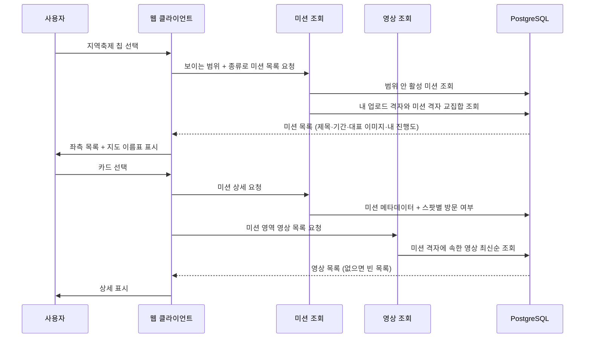
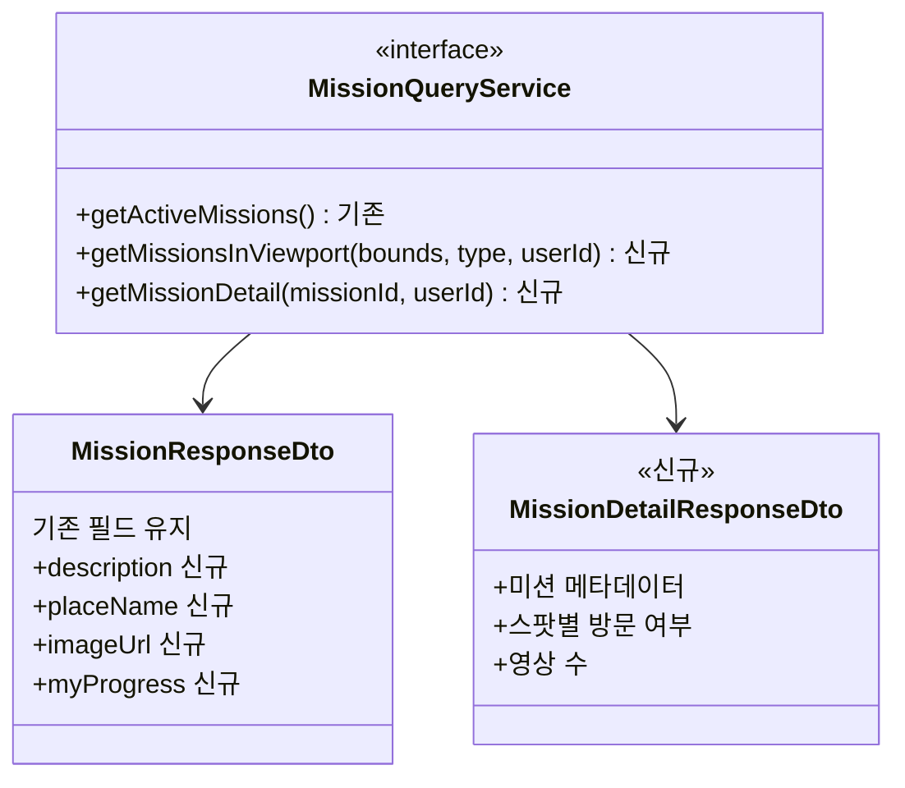

# PRD: 미션 지도 탐색 개편

> 티켓: 미발행 (관련 MSG-368) · 작성일: 2026-08-13 · 작성: prd-writer
> 상태: 검토됨 (2026-08-13 성민 승인)

## 1. 문제 상황

지도 홈 상단에는 칩이 넷 있다. 핫구역, 지역축제, 팝업스토어, 경로추천이다. 뒤의 셋이 미션인데
화면 구조를 핫구역에서 그대로 물려받았다. 칩을 누르면 좌측 패널에 격자별 영상 목록이 뜬다.

핫구역에서는 이 구조가 맞다. 핫구역의 정의 자체가 "업로드 신호가 많은 격자"라서 격자를 나열하면
곧 영상이 나열된다. 미션은 반대다. 미션 격자는 축제 반경이나 코스 경로를 격자로 양자화한
것이라 영상 유무와 상관이 없다. **dev 실측으로 미션이 덮은 격자 21,529칸 중 영상이 하나라도
있는 칸은 24칸, 0.1%다.** 지역축제 칩을 누르면 좌측 패널이 사실상 항상 비어 있다.

더 큰 문제는 미션이 화면에 없다는 것이다. 축제 이름도, 언제까지인지도, 내가 얼마나 했는지도
나오지 않는다. 지도에는 보라색이나 주황색으로 칠해진 영역만 있어서 그게 무슨 축제인지 알 수
없다. 데이터베이스에는 제목과 기간과 목표 칸 수가 다 있고 API도 그걸 내려주는데 화면이 쓰지
않는다. 사용자 입장에서는 이게 미션인 줄 알 방법이 없다.

쓸 수 있는데 안 쓰는 데이터가 더 있다. 수집 원본에는 축제 설명과 장소, 팝업 운영시간과 주소,
코스 거리와 소요시간과 난이도가 들어 있다. 적재하지 않은 이유는 MSG-224와 MSG-235가 "missions에
컬럼이 없어 미적재, 신규 DDL 금지"로 정했기 때문이다. 그때는 미션이 판정용이라 이름과 좌표면
충분했다. 보여주는 화면이 생기면서 사정이 달라졌다.

## 2. 목적 · 목표

**목적**: 미션을 "영상이 걸린 격자 묶음"이 아니라 "가야 할 곳"으로 읽히게 한다. 영상이 아직 한
편도 없는 미션이 대다수인 초기 상태에서도 화면이 성립해야 한다.

**목표**

- 칩을 누르면 지금 지도에 보이는 범위의 미션 목록이 나오고, 영상이 0개여도 카드가 제 역할을 한다
- 카드 한 장에서 무슨 미션인지, 언제까지인지, 어디인지, 내가 얼마나 했는지를 안다
- 미션을 선택하면 상세에서 그 미션의 정보와 다른 사람이 올린 영상을 본다
- 지도에서 어느 영역이 어느 미션인지 이름으로 구분한다

**비목표**

- 미션을 만들거나 고치는 운영 도구는 만들지 않는다
- 스탬프북 조회 화면은 이번 범위가 아니다 (FR-MISSION-12, MSG-219)
- 앱 바텀시트 레이아웃은 다루지 않는다. 이번 시안은 웹 1440 기준이다
- AREA, THEME, CONTINUOUS 유형은 대응 칩이 없어 노출하지 않는다. 현재 적재 데이터도 0건이다

## 3. 기능 요구사항

| ID | 요구사항 | 우선순위 |
|----|----------|----------|
| FR-1 | 사용자가 미션 칩을 선택하면 지금 지도에 보이는 범위 안의 해당 종류 미션 목록을 본다 (SRS FR-MISSION-13 상세화) | Must |
| FR-2 | 미션 카드는 제목, 남은 기간 또는 상시 여부, 위치, 목표 대비 내 진행도를 담는다 | Must |
| FR-3 | 그 미션 영역에 영상이 하나도 없어도 카드는 온전히 표시된다. 영상 수는 있을 때만 덧붙는다 | Must |
| FR-4 | 보이는 범위에 미션이 없으면 오류가 아니라 빈 목록과 안내 문구를 보여준다 | Must |
| FR-5 | 카드를 선택하면 미션 상세를 열고, 선택된 카드는 목록에서 구분 표시된다 | Must |
| FR-6 | 상세는 미션 영역을 지도 미리보기로 보여준다. 축제와 팝업은 경계 사각형, 코스는 경로와 스팟 순서를 표시한다 | Must |
| FR-7 | 코스 상세는 포토스팟 목록을 순서대로 보여주고 스팟마다 방문 여부를 구분한다 | Must |
| FR-8 | 상세 하단에서 그 미션 영역에 올라온 영상을 최신순으로 본다. 영상이 없으면 첫 영상을 유도하는 빈 상태를 보여준다 | Must |
| FR-9 | 영상 카드에는 작성자 닉네임을 표시한다 (glossary 2026-08-04 확정) | Must |
| FR-10 | 지도에 표시된 미션 영역마다 미션 이름표가 함께 보이고, 그 이름은 목록 카드의 제목과 같다 | Must |
| FR-11 | 미션 상세에서 미션 설명과 장소를 본다. 원본 출처가 있으면 출처를 함께 표기한다 | Must |
| FR-12 | 코스 미션은 거리, 소요시간, 난이도를 본다 | Must |
| FR-13 | 팝업 미션은 운영시간과 주소를 본다 | Must |
| FR-14 | 미션에 대표 이미지가 있으면 목록 카드와 상세에 표시하고, 없으면 빈 자리로 두되 레이아웃이 무너지지 않는다 | Must |
| FR-15 | 이름이 없는 코스 경유 지점은 격자 표시명으로 대신 보여주고, 정식 명소가 아님을 구분한다 | Should |
| FR-16 | 완료한 미션은 목록과 상세에서 완료 상태로 구분된다. 완료 이후에도 목록에서 사라지지 않는다 | Must |
| FR-17 | 기간이 끝난 미션은 목록에 나오지 않는다. 다만 이미 받은 스탬프는 영향받지 않는다 (FR-MISSION-04) | Must |
| FR-18 | 세 종류 모두 상세의 주 행동은 촬영 유도로 같다. 길찾기처럼 앱 밖으로 나가는 행동은 두지 않는다 (SRS FR-MISSION-13) | Must |
| FR-19 | 축제 소스 전환 후에도 이미 발급된 스탬프가 가리키는 미션이 사라지지 않는다 | Must |
| FR-20 | 축제와 팝업은 지도에 점 마커로 표시한다. 판정 범위를 상시 도형으로 그리지 않는다 | Must |
| FR-21 | 마커가 서로 겹칠 만큼 가까우면 하나로 묶어 개수를 보여준다. 묶인 것을 선택하면 목록이 그 미션들로 좁혀진다 | Must |
| FR-22 | 미션을 선택했을 때만 그 미션의 판정 범위를 지도에 표시한다 | Must |
| ~~FR-23~~ | ~~칩마다 지금 보이는 범위의 미션 개수를 배지로 보여주고, 0이면 칩을 숨긴다~~ **폐기** (2026-08-14, §8 참조). 칩은 종류를 고르는 역할만 하고 항상 표시된다 | 폐기 |
| FR-24 | 목록 카드와 지도 마커는 서로 연동된다. 카드를 가리키면 해당 마커가 강조되고, 마커를 선택하면 목록이 그 카드로 이동한다 | Should |
| FR-25 | 코스는 마커로 묶지 않고 경로선으로 표시한다 | Must |
| FR-26 | 팝업의 판정 범위는 좌표에서 반경 40m 안에 걸치는 격자다. 팝업 위치에 따라 1칸에서 4칸 사이가 된다 | Must |
| FR-27 | 상세의 미리보기는 실제 지도 위에 미션 영역이나 경로를 얹어 보여준다. 주변 지형과 지명이 함께 보여야 위치를 가늠할 수 있다 | Must |
| FR-28 | 미리보기 배율은 미션 종류와 크기에 맞춘다. 코스는 경로 전체가 들어오고, 팝업은 범위가 화면을 채울 만큼 당겨진다 | Should |

엣지 케이스

- 미션 영역이 화면 경계에 걸쳐 일부만 보이는 경우에도 목록에 포함한다. 코스는 하나가 수 킬로미터에
  걸쳐 있어 경로 중간만 걸린 코스가 통째로 사라지면 안 된다 (MSG-368 완료 조건)
- 대표 이미지 원본이 사라졌거나 형식을 읽을 수 없으면 이미지 없는 미션과 같게 처리한다
- 비로그인 상태에서는 진행도 없이 미션 정보만 보여준다

## 4. 비기능 요구사항

| 분류 | 요구사항 |
|------|----------|
| 성능 | 칩 전환과 지도 이동에서 목록이 300ms 안에 갱신된다. 현재 활성 미션은 축제 385건, 코스 148건, 팝업 157건이고 미션 격자는 32,903행이다 |
| 성능 | 미션 목록 응답은 지금 지도에 보이는 범위로 제한된다. 전국 전량을 내려보내지 않는다 |
| 성능 | 밀집 지역에서도 지도가 읽혀야 한다. 실측으로 뷰포트 하나에 팝업 미션이 38개까지 걸린다 |
| 데이터 정합 | 팝업 판정 범위 축소는 이미 발급된 스탬프를 회수하지 않는다 (FR-MISSION-04) |
| 데이터 정합 | 외부에서 받아 온 이미지는 원본이 사라져도 화면이 깨지지 않아야 한다. 팝업은 기간이 끝나면 원본 페이지가 없어진다 |
| 데이터 정합 | 진행도는 조회 시점의 실제 업로드 기록과 일치한다. 별도 집계 값을 두고 어긋나게 하지 않는다 |
| 운영 | 미션 메타데이터 추가는 기존 미션 데이터를 지우지 않고 채우는 방향이어야 한다. 이미 발급된 스탬프에 영향이 없어야 한다 |
| 운영 | 외부 데이터 재수집은 하루 안에 1회로 끝나야 한다. TourAPI 일 쿼터가 1,000콜이다 |

## 5. 시퀀스 다이어그램

미션 목록을 열고 상세로 들어가는 흐름이다. 진행도가 사용자마다 다르다는 점이 지금 구조와
가장 크게 부딪히는 지점이라 그것을 드러냈다.

## 6. 클래스 다이어그램

변경되는 타입만 적는다. 상세 조회와 영역 영상 조회가 새로 생기고, 미션 응답에 메타데이터와
진행도가 붙는다.

## 7. 변경 파일 목록

| 파일 | 변경 | Owner |
|------|------|-------|
| `src/main/java/com/msg/fillmap/mission/controller/MissionController.java` | 수정: 뷰포트 목록·상세 엔드포인트 추가 | B |
| `src/main/java/com/msg/fillmap/mission/service/MissionQueryService.java` | 수정: 조회 메서드 2종 추가 | B |
| `src/main/java/com/msg/fillmap/mission/service/impl/MissionQueryServiceImpl.java` | 수정: 뷰포트 필터·진행도 결합·캐시 키 재설계 | B |
| `src/main/java/com/msg/fillmap/mission/dto/MissionResponseDto.java` | 수정: 메타데이터·진행도 필드 추가 | B |
| `src/main/java/com/msg/fillmap/mission/dto/MissionDetailResponseDto.java` | 신규 | B |
| `src/main/java/com/msg/fillmap/mission/entity/Mission.java` | 수정: 신규 컬럼 매핑 | B |
| `src/main/java/com/msg/fillmap/mission/repository/MissionRepository.java` | 수정: 뷰포트 조회·상세 조회 | B |
| `src/main/java/com/msg/fillmap/mission/repository/MissionGridRepository.java` | 수정: 스팟별 방문 여부·영상 수 집계 | B |
| `src/main/java/com/msg/fillmap/mission/seed/FestivalRecord.java` | 수정: TourAPI 필드로 교체(설명·장소·이미지) | B |
| `src/main/java/com/msg/fillmap/mission/seed/FestivalJsonlReader.java` | 수정: TourAPI 응답 형식 수용 | B |
| `src/main/java/com/msg/fillmap/mission/seed/FestivalMissionSeeder.java` | 수정: 소스 전환·기존 스탬프 보존 이행 | B |
| `src/main/java/com/msg/fillmap/mission/seed/PopupRecord.java` | 수정: 운영시간·주소·원문 링크 수용 | B |
| `src/main/java/com/msg/fillmap/mission/seed/PopupMissionSeeder.java` | 수정: 신규 컬럼 적재, 판정 격자를 9×9 고정에서 반경 40m 산출로 교체 | B |
| `src/main/java/com/msg/fillmap/mission/seed/CourseRecord.java` | 수정: 거리·소요시간·난이도·설명 수용 | B |
| `src/main/java/com/msg/fillmap/mission/seed/CourseMissionSeeder.java` | 수정: 신규 컬럼 적재 | B |
| `src/main/java/com/msg/fillmap/video/repository/VideoRepository.java` | 수정: 미션 격자 영역 영상 목록 조회 | B |
| `src/main/resources/db/migration/V31__mission_metadata.sql` | 신규: missions 메타데이터 컬럼 추가 | - |

Owner는 전부 B다. `com.msg.fillmap.mission`과 `com.msg.fillmap.video`가 콘텐츠 도메인이다.
격자 표시명이 필요한 부분은 `ZoneNameQueryService`를 통해 받는다. Owner A 코드는 고치지 않는다.

## 8. 확정 사항 (2026-08-13 성민, 2026-08-14 추가)

### 2026-08-14 추가

- **칩 개수 배지를 폐기한다(FR-23).** 지도를 움직일 때마다 종류 넷의 개수를 다시 세어 칩 상태를
  맞춰야 하는데, 그 상태 관리 비용이 배지가 주는 값어치보다 크다고 보았다. 개수가 없어지므로
  "0이면 칩을 숨긴다"도 함께 사라지고 칩은 항상 표시된다. 서버 쪽에서는 목록 조회가 종류별 개수를
  따로 셀 필요가 없어진다

### 2026-08-13 확정

- **축제 소스를 TourAPI로 전환한다.** TourAPI 축제는 461건이고 그중 456건(98%)이 이미지를 갖고
  있다. 지금 소스인 공공데이터 표준데이터와는 이름 기준 38%만 매칭되고, TourAPI에만 있는 축제가
  347건이다(강릉단오제 같은 큰 축제 포함). 전환하면 이미지가 98% 따라오고 건수도 385건에서
  461건으로 는다. 다만 축제 미션의 자연키가 바뀌므로 **이미 발급된 스탬프가 가리키는 미션이
  사라지지 않게 하는 것이 전환의 전제 조건이다.** 구체적 이행 방식은 스펙에서 정한다
- **진행도는 미션 목록과 분리해 조회한다.** 미션 목록은 지금처럼 전역 캐시를 유지하고 내
  스탬프와 방문 격자만 따로 받아 화면에서 합친다. 요청이 두 번 나가지만 캐시 전제를 지키는 쪽을
  택했다
- **코스 상세의 주 버튼도 촬영 유도로 통일한다.** 세 종류 모두 "이 미션 지역에서 촬영하기"다.
  길찾기 버튼은 2026-08-10에 미도입으로 확정한 그대로 두었다 (SRS FR-MISSION-13)
- **팝업의 판정 범위를 좌표에서 반경 40m 안에 걸치는 격자로 좁힌다.** 지금은 9×9, 반경 450m다.
  팝업스토어는 가게 하나라 실제 위치가 점인데 옆 블록 카페에서 찍어도 스탬프가 나오므로
  "그 팝업에 갔다"는 증명이 성립하지 않는다. 칸 수를 N×N으로 고정하지 않고 반경으로 정하는 것은
  팝업이 격자 안 어디에 떨어지느냐가 제각각이기 때문이다. 가운데면 한 칸, 경계에 걸치면 두 칸,
  모서리면 네 칸이 자연스럽게 나온다. 팝업 600곳 좌표 실측으로 2×2가 66%, 두 칸이 31%,
  한 칸이 3%다. 반경을 30m 아래로 내리면 한 칸인 경우가 15%를 넘는데, 도심 위치 오차가
  10~30m라 가게 안에 있어도 옆 칸으로 찍혀 인정이 안 되는 일이 생긴다. 축제는 행사장이 실제로
  넓어 9×9를 유지한다. 이미 발급된 스탬프는 비회수 원칙대로 유지되고(FR-MISSION-04), 축소는
  앞으로의 판정에만 적용된다
- **축제와 팝업을 지도에서 점 마커로 그린다.** 밀집 지역 실측으로 뷰포트 하나(가로 1.5km)에
  팝업 미션이 38개까지 걸린다. 900m 사각형 38장을 겹쳐 그리면 화면이 색으로 뭉개지고 이름표도
  읽히지 않는다. 마커로 바꾸면 클러스터링이라는 표준 해법을 그대로 쓸 수 있다. 코스는 이미
  표시(경로선)와 판정(스팟)이 분리돼 있어 그대로 둔다
- **코스 대표 이미지는 TourAPI 스팟 사진만 쓴다.** 코스 위 포토스팟 중 사진이 있는 첫 스팟의
  것을 쓴다. 결과가 사용자와 무관하게 항상 같아 미션 목록 캐시에 그대로 실을 수 있다. 사진이
  있는 스팟이 하나도 없는 코스는 이미지 없이 표시한다. 사용자 영상 썸네일을 대표로 올리는 안은
  값이 사람마다·시점마다 달라져 캐시를 깨므로 채택하지 않았다
- **외부 소개문은 원문 그대로 보여주고 화면에 출처를 표기하지 않는다.** 축제 설명과 팝업 소개문을
  줄이거나 다시 쓰지 않는다. 다만 TourAPI와 공공데이터 이용약관이 출처 표기를 조건으로 두는
  경우가 있어 확인이 필요하고, 필요하면 화면 대신 서비스 약관 페이지에 일괄 표기한다

## 9. 미해결 질문

- [ ] **종류별 노출 반경 값.** MSG-368의 미확정 사항이 그대로 걸린다. 축제와 코스와 팝업 각각의
      값은 FE와 상의해 정한다 (SRS 미해결 표 등재)
- [ ] **외부 데이터 이용약관의 출처 표기 조건.** TourAPI와 공공데이터가 출처 표기를 조건으로
      두는지 확인한다. 조건이 있으면 화면이 아니라 서비스 약관 페이지에 일괄 표기하는 방식으로
      푼다 (위 확정 사항의 단서)

## 10. 참고

시안 9장이 피그마 "필맵 웹 디자인 ver 12_미션디자인" 페이지의 섹션
"🗺️ 미션 지도 탐색 개편"에 모여 있다. 실제 dev 데이터와 실제 포스터 이미지로 만들었다.

| 화면 | 노드 |
|------|------|
| 목록 · 지역축제 | `14449:1477` |
| 목록 · 팝업스토어 | `14456:1525` |
| 목록 · 경로추천 | `14456:11931` |
| 상세 · 축제 (영상 있음) | `14463:1703` |
| 상세 · 축제 (빈 상태) | `14460:1621` |
| 상세 · 팝업 | `14473:1744` |
| 상세 · 코스 | `14461:1669` |
| 밀집 · 마커와 클러스터 | `14486:1785` |
| 미션 선택 · 판정 범위 | `14487:1833` |

관련 요구사항은 SRS의 FR-MISSION-01, FR-MISSION-02, FR-MISSION-09, FR-MISSION-13이다.
이 PRD가 승인되면 FR-MISSION-13을 상세화하고, 진행도 노출이 FR-MISSION-02의 "응답에 사용자별
진행도는 없다"와 부딪히므로 그 항목을 함께 정리한다.

[^1]: 뷰포트: 지도에서 지금 화면에 보이는 경위도 범위. 전국 데이터를 다 내려보내는 대신 이 범위로
    잘라 응답 크기를 줄인다.
[^2]: 전역 캐시: 모든 사용자에게 똑같은 응답이라 한 벌만 저장해 두고 돌려쓰는 방식. 사용자마다
    다른 값이 응답에 끼는 순간 이 전제가 깨진다.
[^3]: 양자화: 연속된 좌표나 도형을 격자 같은 이산 단위로 바꾸는 것. 축제의 원형 반경이나 코스의
    선을 100m 칸 집합으로 옮기는 작업이 여기 해당한다.
[^4]: og:image: 웹페이지가 공유 미리보기용으로 스스로 선언해 두는 대표 이미지 주소. 팝업 포스터를
    이 값에서 얻는다.
[^5]: 핫링크: 남의 서버에 있는 이미지를 내 화면에서 주소로 직접 불러 쓰는 것. 원본이 내려가면
    화면이 깨지고 상대 서버에 트래픽을 떠넘기게 된다.
[^6]: 폴백: 원래 쓰려던 값이 없을 때 대신 쓰는 값. 이름 없는 경유 지점에 격자 표시명을 넣는 것이
    그 예다.
