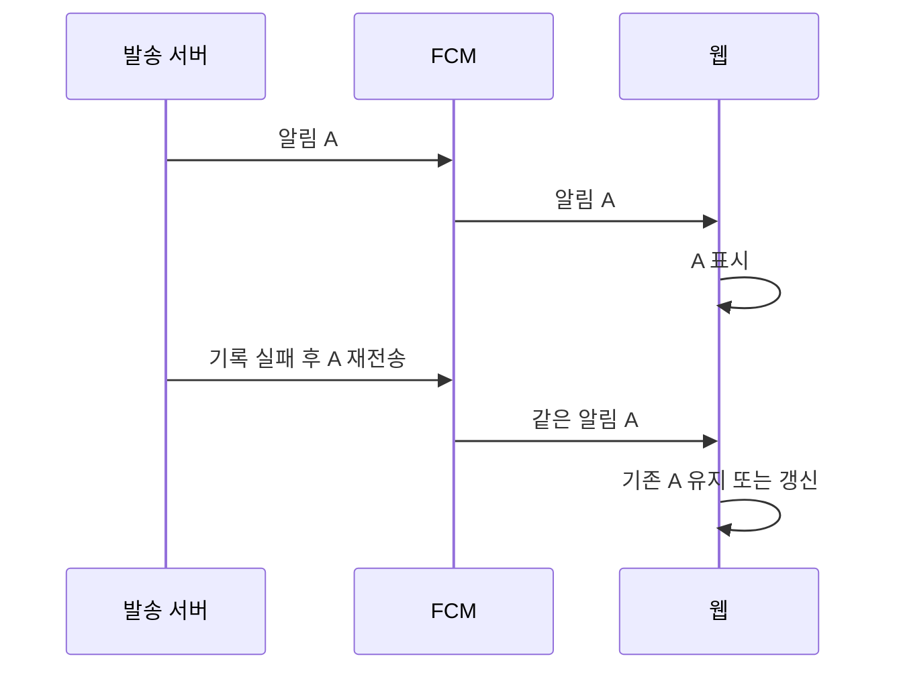

# PRD: 웹 푸시 재전달 시 중복 표시 줄이기

> 티켓: 미발행 · 작성일: 2026-09-17 · 작성: prd-writer
> 상태: 검토됨
> 승인: 2026-09-17 성민. 웹 중복 표시 억제 범위 승인. 별도 DLQ 도입은 이 승인에 포함하지 않는다.

## 1. 문제 상황

발송 성공 직후 DB 기록에 실패시키자 같은 알림이 두 번 발송됐다. FCM 전송과 DB 커밋은 원자적[^1]이지 않다. 기존 알림 PRD 5.2절도 이 구간의 중복을 허용한다.

웹은 수신할 때마다 새 토스트를 만들고, 백그라운드에서는 FCM 자동 표시와 직접 표시가 겹칠 수 있다. 서버 재시도를 없애면 미전달 알림까지 버릴 수 있으므로 재시도는 유지한다.

SRS의 FR-NOTI-03·NFR-DATA-03은 중복 푸시가 없다고 기술하지만 기존 PRD와 실측은 다르다. 웹 중복 표시 억제 범위는 승인됐다. SRS FR-NOTI-03·NFR-DATA-03에 승인된 보장 범위를 반영했다. 실제 OS 표시·FCM 수신 검증이 남아 FR-NOTI-03은 진행 중이다.

## 2. 목적 · 목표

- 목적: 같은 사건의 재전달이 웹 화면에 여러 알림으로 쌓이는 것을 줄인다.
- 목표: 같은 알림을 100회 재전달했을 때, 열린 탭의 토스트와 브라우저에 남아 있는 알림은 각각 최대 1개다. 서로 다른 알림 두 개는 모두 남는다.
- 비목표: 외부 전송 횟수 1회 보장, 모든 장애에서 정확히 한 번 표시, 닫은 알림의 영구 재표시 금지, 모바일 앱 변경. 실단말 확인 전에는 운영에서 중복 0이라고 주장하지 않는다.

## 3. 기능 요구사항

| ID | 요구사항 | 우선순위 |
|---|---|---|
| FR-1 (FR-NOTI-03 상세화 제안) | 서버가 같은 알림을 재시도해도 수신 측은 같은 사건으로 구별할 수 있다 | Must |
| FR-2 | 열린 웹 탭은 같은 알림을 반복 수신해도 같은 토스트를 여러 개 쌓지 않는다 | Must |
| FR-3 | 백그라운드 알림 한 번 수신에 자동 표시와 수동 표시가 동시에 발생하지 않는다 | Must |
| FR-4 | 같은 알림이 아직 브라우저 알림 목록에 있으면 재전달은 그 항목을 갱신하며 새 항목을 쌓지 않는다 | Must |
| FR-5 | 서로 다른 사건은 제목·본문이 같아도 각각 표시한다 | Must |
| FR-6 | 식별자가 없는 이전 서버 메시지도 기존처럼 표시한다. 중복 억제 보장은 식별자가 있는 메시지에 한정한다 | Must |

## 4. 비기능 요구사항

| 분류 | 요구사항 |
|---|---|
| 데이터 정합 | 발송 실패 재시도와 outbox[^2] 보존은 유지한다. 표시 중복을 줄이려고 발송 전에 성공 처리하지 않는다 |
| 호환성 | 현재 notification 메시지 표시를 유지한다. data-only 전환으로 구형 클라이언트의 표시를 끊지 않는다 |
| 검증 | 서버 장애 재전달에서 동일 식별자 유지, 웹 반복 100회·다른 사건 2건·구형 메시지 처리를 자동 검증한다 |
| 운영 | 실제 브라우저에서 전경·배경·재전달을 확인해야 종단 간[^3] 검증 완료로 표시한다 |

## 5. 시퀀스 다이어그램

## 6. 클래스 다이어그램

새 도메인 타입은 필요하지 않다. 구체적 메서드 계약은 승인 후 스펙에서 정한다.

## 7. 변경 파일 목록

| 파일 | 변경 | Owner |
|---|---|---|
| BE `notification/consumer/NotificationConsumer.java` | 재시도에도 동일한 알림 식별자 전달 | B |
| BE `notification/sender/NotificationSender.java`, `FcmNotificationSender.java` | 식별자와 웹 표시 옵션 전송 | B |
| FE `apps/web/public/firebase-messaging-sw.js` | 자동 표시와 수동 표시 중복 제거 | FE |
| FE `apps/web/src/features/notifications/api/messaging.ts`, `use-foreground-messages.ts` | 식별자 전달 및 전경 중복 억제 | FE |
| 관련 서버·웹 테스트 | 반복 전달 및 호환성 회귀 검증 | BE·FE |
| BE `docs/srs.md` | 승인 후 FR-NOTI-03·NFR-DATA-03 보장 범위 정합화 | B |

FE 작업 트리는 원격 추적 develop보다 224커밋 뒤에 있다. 구현 전 최신 원격 기준 격리 작업 공간을 사용한다. 새로운 UI 배치·문구 변경은 없으며 피그마 화면 검증은 수행하지 않았다.

## 8. 미해결 질문

- [x] **재전송은 유지하고 웹의 중복 표시를 억제하는 범위**로 진행한다. 2026-09-17 성민 승인.
- [ ] 실제 FCM 수신 가능한 테스트 브라우저가 없으면 실단말 검증은 미완료로 남긴다.
- [ ] 닫은 뒤 재전달, 여러 탭·재시작을 통틀어 영구 1회 표시가 필요하면 별도 요구가 필요하다. 저장과 OS 표시 사이에도 장애 구간이 있어 단순 수신 이력만으로 유실과 중복을 모두 제거할 수 없다.

근거: [기존 알림 PRD](notification-prd.md), [장애 실측](../audit/2026-09-17-performance-verification.md), [FCM 웹 수신 규칙](https://firebase.google.com/docs/cloud-messaging/web/receive-messages), [FCM 메시지 API](https://firebase.google.com/docs/reference/fcm/rest/v1/projects.messages).

[^1]: 원자성은 여러 작업이 모두 성공하거나 모두 실패하는 성질이다. 외부 전송과 서버 DB 기록은 함께 되돌릴 수 없다.
[^2]: outbox는 업무 처리와 함께 저장하는 발송 대기 기록이다. 전송 장애가 나도 다시 보낼 근거가 남는다.
[^3]: 종단 간 검증은 서버의 발송부터 실제 사용자 기기의 수신·표시까지 확인하는 시험이다.
