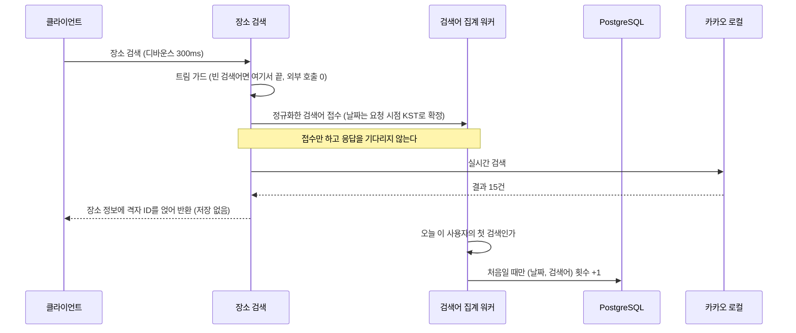
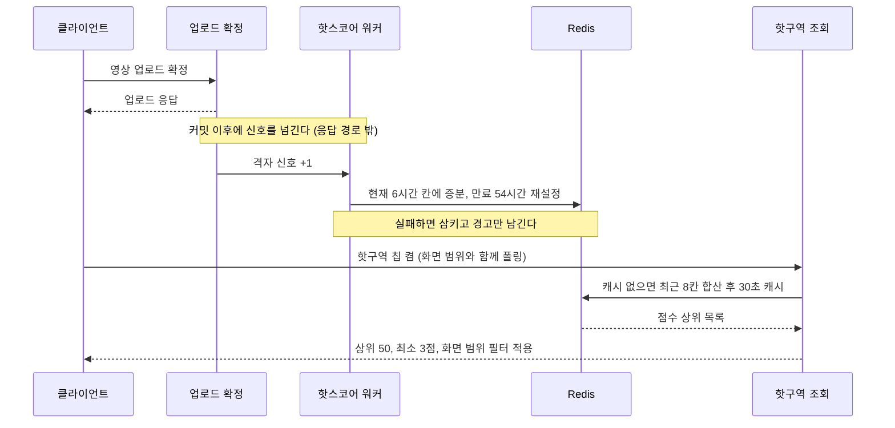

# PRD: 장소 검색과 핫구역

> 작성일: 2026-08-10 · 작성: prd-writer (MSG-359 역산)
> 상태: 역산 (사후 문서. 구현이 이미 끝난 기능의 요구사항을 스펙과 위키 결정에서 복원했다)
> 커버 티켓: MSG-251, MSG-258 (검색) / MSG-233, MSG-183, MSG-184, MSG-321, MSG-330, MSG-347 (핫구역)
> 관련 SRS: SEARCH 영역 (FR-SEARCH-01 ~ 14), HOTZONE 영역 (FR-HOTZONE-01 ~ 12)

## 0. 두 기능을 한 문서에 담은 이유

검색과 핫구역은 지도 홈 상단에서 나란히 진입한다. 검색바에 장소명을 치는 것과 상단 칩에서
"핫구역"을 켜는 것은 둘 다 "다음에 어디로 갈까"에 답하는 동선이다. 신호의 성질은 반대다.
검색은 사람들이 **궁금해하는 곳**을 알려주고 핫구역은 실제로 **채워지는 곳**을 알려준다.
이 둘이 갈릴 수 있다는 점이 인기 검색어를 별도 신호로 남긴 이유이기도 하다(MSG-258 PRD).

이 문서는 기능마다 절을 나눠 다룬다. 요구사항 자체는 `docs/srs.md`가 정본이고, 여기서는
**그 요구가 왜 그렇게 정해졌는지와 무엇이 기각됐는지**를 복원한다.

---

## 1. 문제 상황

### 1.1 검색

사용자는 행정동 이름("장전2동")으로 장소를 찾지 않는다. "부산대", "광안리" 같은 장소명으로
찾는다. 그런데 우리가 가진 위치 데이터는 행정동 폴리곤 3,558건과 사용자가 채운 격자뿐이라
장소명 질의에 답할 재료가 없다. 지도 SDK를 네이버로 옮기면서(2026-07-17 ADR) 키워드 검색
기능도 함께 사라졌고, 그때는 "행정동 검색은 우리 DB로 완결된다"로 정리했지만 구역 작업
(MSG-234)이 보류되면서 랜드마크 검색의 공백이 그대로 드러났다.

두 번째 문제는 그다음이다. 검색이 동작하기 시작해도 사용자가 입력한 검색어라는 관심 신호가
아무 데도 남지 않고 버려졌다. 검색창을 눌렀는데 아직 아무것도 입력하지 않은 화면에는 보여줄
것이 없었다.

### 1.2 핫구역

미션에 쓸 외부 데이터를 조사한 결과가 나빴다(설계검토 2026-07-20). 팝업 스토어 정보를 모으는
민간 애그리게이터는 88%가 서울이고 부산은 6%였다. 공연행사 표준데이터에서 지금 살아 있는
야외 행사는 0.3%였다. **외부 데이터로 지역의 실시간 상황을 커버하는 것은 구조적으로 불가능**
하다는 결론이었다.

한편 FillMap에는 위치가 검증된 업로드 이벤트가 격자 단위로 쌓인다. 팝업이 열리면 사람들이
가서 찍고 그 격자의 업로드가 튄다. 팝업 정보를 수집하는 대신 **팝업을 감지할 수 있는** 유일한
자체 신호원인데 이 신호를 아무 데도 쓰지 않고 있었다. 지도 홈 개편(2026-07-25 확정)으로 상단
칩 4종 중 하나가 핫구역으로 정해졌지만 "업로드된 것 기준"이라는 방향만 합의됐을 뿐 무엇이
핫인지, 점수를 어떻게 매기는지, 어디에 저장하는지가 비어 있어 구현 티켓이 착수 불가였다.

## 2. 목적과 목표

### 2.1 검색

- **목적**: 장소명 한 번 입력으로 그 자리의 격자까지 데려간다. 그리고 그 과정에서 생기는
  검색어를 발견 동선의 재료로 축적한다.
- **목표**: 장소 검색은 선택 즉시 지도 이동과 격자 강조가 한 번에 끝난다. 검색어는 일별로
  쌓여 나중에 임의 기간을 다시 집계할 수 있다. 공급자 약관 경계를 코드 구조로 지킨다.

### 2.2 핫구역

- **목적**: 사용자 업로드 신호로 "요즘 뜨는 격자"를 감지해 지도 홈 칩에 노출한다. 발견의
  재미와 함께, 외부 데이터의 한계를 자체 신호로 돌파했다는 서사를 만든다.
- **목표**: 업로드가 확정되면 그 격자 점수가 즉시 반영되고 오래된 신호는 저절로 사라진다.
  칩을 켜면 화면 범위 안의 핫구역이 보인다. 집계는 업로드 응답에 영향을 주지 않는다.

### 2.3 비목표

- 화면 표현 전반. 칩 UI, 색과 배지, 인기 검색어 노출 위치는 디자인과 프론트 몫이다.
- 좋아요를 신호에 합류시키는 일. 좋아요 API(MSG-275) 자체가 없어 데이터가 없다.
- 실시간 푸시. 서빙은 폴링[^polling]이고 websocket은 Phase 2로 유예했다.
- 검색어 기반 주간 집계와 트렌드 계산 배치. 이번 범위는 재료가 되는 일별 이력까지다.
- 도배 방어. 핫구역과 인기 검색어에서 서로 다른 판단을 내렸다(§6.2, §5.5).

---

## 3. 기능 요구사항

요구사항 문장의 정본은 `docs/srs.md`다. 여기서는 ID와 이 문서의 근거 절만 연결한다.

### 3.1 SEARCH

| SRS ID | 다루는 것 | 근거 절 |
|--------|----------|---------|
| FR-SEARCH-01 | 장소명 검색 결과에 격자 ID를 실어 보낸다 | §5.3 |
| FR-SEARCH-02 | 결과 15건 상한, 빈 검색어와 무매치 처리 | §5.3, §5.4 |
| FR-SEARCH-03 | 저장도 캐시도 없는 실시간 전달 | §5.2 |
| FR-SEARCH-04 | 외부 공급자 실패를 하나의 오류로 수렴 | §5.4 |
| FR-SEARCH-05 | 외부 호출이 실패해도 검색어는 집계한다 | §5.5 |
| FR-SEARCH-06 | 검색어 정규화와 하루 한 번 집계 | §5.5 |
| FR-SEARCH-07 | 인기 검색어 상위 10개 조회 | §5.5 |
| FR-SEARCH-08 | 순위 응답에 장소 정보를 붙이지 않는다 | §5.2 |
| FR-SEARCH-09 | 집계 데이터가 없으면 빈 목록 | §5.4 |
| FR-SEARCH-10 | 집계 실패가 검색을 실패시키지 않는다 | §5.5 |
| FR-SEARCH-11 | 저장 범위를 검색어와 날짜와 횟수로 한정 | §5.2 |
| FR-SEARCH-12 | 일별 집계를 지우지 않고 축적 | §5.5 |
| FR-SEARCH-13 | 영상 검색은 범위 밖 (계획) | §5.6 |
| FR-SEARCH-14 | 격자 이름 역파싱은 클라이언트 몫 (계획) | §5.6 |

### 3.2 HOTZONE

| SRS ID | 다루는 것 | 근거 절 |
|--------|----------|---------|
| FR-HOTZONE-01 | 범위 단위는 격자다 | §6.1 |
| FR-HOTZONE-02 | 신호는 업로드뿐이고 도배 방어를 두지 않는다 | §6.2 |
| FR-HOTZONE-03 | 배치가 아니라 이벤트 시점 증분 | §6.5 |
| FR-HOTZONE-04 | 최근 48시간만 반영 | §6.3 |
| FR-HOTZONE-05 | 집계 실패가 업로드를 실패시키지 않는다 | §6.5 |
| FR-HOTZONE-06 | 상위 50 안에서 최소 3점 이상 | §6.3 |
| FR-HOTZONE-07 | 화면 뷰포트로 조회 | §6.4 |
| FR-HOTZONE-08 | 없으면 빈 목록 | §6.3 |
| FR-HOTZONE-09 | 뒤집힌 뷰포트만 거부, 면적 상한 없음 | §6.4 |
| FR-HOTZONE-10 | 응답에 작성자를 담지 않는다 | §6.4 |
| FR-HOTZONE-11 | 점수는 근사값이고 유실을 허용한다 | §6.4 |
| FR-HOTZONE-12 | 격자 규칙이 바뀌면 이전 신호를 버린다 | §6.6 |

## 4. 비기능 요구사항

| SRS ID | 이 묶음에서의 의미 |
|--------|-------------------|
| NFR-PERF-01, NFR-PERF-02 | 핫구역 조회는 지도 뷰포트 조회의 응답 목표를 그대로 상속한다. 폴링 서빙이라 같은 트래픽 성격이다 |
| NFR-PERF-04 | 목록 캐시가 만료되는 순간에도 실패 없이 응답해야 한다. 재계산이 30초마다 한 번 몰리는 구조라 그 위상만 꼬리가 길어진다 |
| NFR-PERF-05 | 업로드 응답 경로에 얹히는 적재 비용과, 대기열이 넘칠 때 폐기 경로가 요청 스레드를 붙잡지 않는 것 |
| NFR-SEC-01 | 검색과 핫구역 모두 인증 필수다. 전역 기본 정책을 그대로 따르고 예외 목록에 없다 |
| NFR-DATA-05 | 두 기능의 실패 코드는 도메인 대역을 쓴다. 검색 5xxx, 핫구역 8xxx |

핫구역 조회의 부하 실측은 MSG-321에서 나왔다. 2,000 RPS를 유지한 구간에서 213,998건 실패가
0건이었고, 캐시 만료 위상의 p99가 56.18ms인 반면 나머지 위상은 3.22ms였다. 이 절대 수치는
노트북 한 대에서 잰 값이라 서버 목표치로 옮기지 않았다.

---

## 5. 검색: 왜 그렇게 정했는가

### 5.1 공급자를 카카오로 고른 이유와 기각한 대안

정본은 위키 `04-decisions/ADR 장소 검색 카카오 로컬 프록시`(2026-07-28, 정민)다.

| 후보 | 판정 | 근거 |
|------|------|------|
| 카카오 로컬 키워드 검색 | **채택** | 일 10만, 월 300만 무료. 좌표가 WGS84 직결이라 변환이 없다. 페이지당 15건. OAuth 로그인이 이미 쓰는 "필맵" 앱의 REST 키를 그대로 쓸 수 있어 신규 시크릿이 0이다 |
| 네이버 지역검색 오픈API | 기각 | 일 25,000건 합산 한도에 한 번에 5건까지고, 좌표를 1천만으로 나눠 변환해야 한다. 폴백 후보로만 기록 |
| 자체 구역 데이터로 대체 | 기각 | 지도 SDK 전환 ADR이 "자체 zones가 랜드마크 검색도 해결한다"로 정리했으나 MSG-234 보류로 성립하지 않았다. 같은 ADR이 남긴 재검토 트리거("랜드마크를 외부 API 의존으로 결정하면 카카오 Local 재평가")가 실제로 발동한 사례다 |

지도는 네이버인데 검색은 카카오라는 혼용이 걸렸다. 카카오 데브톡 150397의 스태프 공식 답변
("타사 지도 SDK와 혼용하여 사용하셔도 약관상 이슈 없음")으로 허용을 확인했고, 답변에 붙은
조건이 그대로 §5.2의 설계 제약이 됐다.

좌표가 실제로 우리 격자에 맞는지는 스모크로 확인했다. 부산대, 서면역, 홍대입구역, 광안리
네 곳의 카카오 좌표를 변환 없이 우리 행정동 폴리곤과 격자 산술에 넣어 전건 적중했다.
홍대입구역은 법정동(동교동)을 행정동(서교동)으로 정확히 변환한 사례라 매핑 신뢰도의 근거로
남겨 뒀다.

### 5.2 캐시를 못 쓰는 것이 아니라 안 쓰는 것

약관 조건은 "실시간 호출 기반만, 저장 목적 호출 불가"다. 그래서 검색 결과의 캐시와 DB 저장을
금지하고 패스스루[^passthrough]로만 전달한다. 이 제약을 주석이 아니라 **구조로** 강제했다.
검색 패키지에 저장소 관련 import가 0이면 위반할 경로 자체가 없다.

성능을 포기한 것이 아니라 측정하고 남겼다. MSG-251에서 캐시 도입 시의 이득을 로컬에서 재
보고 수치만 기록한 뒤 임시 코드를 폐기했다(우리 API 패스스루 p50 60ms, p95 128ms. 카카오
직접 호출 p50 91ms, p95 176ms). 프록시를 한 겹 끼웠는데 오히려 빨랐다. 커넥션 재사용이
프록시 왕복 비용을 상쇄했기 때문이다. 약관 해석이 바뀌거나 제휴가 생기면 이 수치가 판단
재료가 된다.

인기 검색어를 만들면서 이 경계가 한 번 시험대에 올랐다. 결론은 **금지 대상이 검색 결과의
저장이지 사용자가 입력한 검색어의 저장이 아니다**였다. 그래서 지키는 선을 둘로 명문화했다.
순위 응답에 장소 정보를 미리 붙여 두면 그게 곧 캐시라서 안 되고(클릭 후 결과는 매번 실시간
호출로 얻는다), 저장하는 것은 검색어 텍스트와 날짜와 횟수까지다. 이 결정으로 기존 코드의
"저장소 무접점이 약관 준수의 증거"라는 주석이 사실과 어긋나게 되어 "카카오 응답 무저장이
준수의 실체"로 함께 고쳤다.

### 5.3 응답에 무엇을 싣고 무엇을 뺐는가

격자 ID를 즉석에서 계산해 결과에 실었다. 이게 이 API의 존재 이유에 가깝다. 프론트가 결과를
선택하면 지도 이동과 격자 강조를 한 번에 처리할 수 있고, 지도가 옮겨 가는 좌표와 격자를
판정하는 좌표가 같은 값 하나라서 내부 일관성이 보장된다.

반면 **행정동 이름 합성은 기각했다.** 세 가지 이유였다. 카카오가 이미 사람이 읽는 주소를
주므로 표시 정보가 겹친다. 결과 하나마다 공간 질의가 한 번씩 붙는데 300ms 디바운스[^debounce]
자동완성 경로에 타이핑마다 실릴 비용으로는 과하다(요청당 최대 15회). 선택 후 동선이 격자
ID로 완결되니 소비처도 없다. 부수 효과도 있었다. 행정동 질의는 서비스 범위 밖 좌표에 예외를
던지는데, 쓰지 않으니 그 실패 경로가 아예 생기지 않았다.

건수와 페이지 파라미터도 노출하지 않았다. 카카오 한 페이지(15건)를 그대로 넘긴다. 자동완성
UI는 상위 몇 건만 소비하고 디자인에 검색 결과 페이지네이션이 없어서, 파라미터를 열면 값 검증과
테스트 표면만 늘어난다.

### 5.4 실패를 하나로 모은 이유

카카오가 죽었든, 느려서 타임아웃이 났든, 키가 막혔든, 쿼터를 넘겼든, 응답이 파싱되지 않든
전부 하나의 업스트림 오류[^upstream]로 낸다. **프론트의 대응이 어차피 같기 때문이다**(잠시 후
다시 시도해 달라는 안내). 429나 타임아웃을 따로 코드로 나누는 것은 프론트의 행동이 갈릴 때만
값이 있는데 지금은 소비처가 없다. 무료 한도가 일 10만이라 쿼터 초과는 사실상 이론적이기도
하다. 원인 구분은 로그로 남겨 운영 진단에 쓴다. 쿼터 초과가 실제로 관측되면 상수 하나를 더해
분리하면 된다.

실패가 아닌 것도 분명히 했다. 검색어를 아무리 쳐도 결과가 없는 것은 오류가 아니라 빈 배열이고,
공백만 입력한 경우도 마찬가지다. 다만 빈 검색어는 **외부 호출 자체를 하지 않는다.** 빈 질의를
그대로 흘리면 카카오가 400을 돌려주면서 쿼터만 깎인다. 반대로 검색어 파라미터가 아예 없는
것은 클라이언트 실수라 400이다.

### 5.5 검색어를 남기기로 한 판단

집계를 붙일 때 정한 것이 일곱 가지였다(2026-08-04 확정).

| 항목 | 결정 | 왜 |
|------|------|-----|
| 저장 위치 | DB 일별 카운트 테이블 | 순위 이력이 영구히 남아 나중 배치가 임의 기간을 다시 집계할 수 있다. Redis만 쓰면 순위는 나오지만 이력이 사라진다 |
| 노출 기준 | 오늘과 어제 합산 상위 10개 | 오늘만 쓰면 자정 직후에 순위가 텅 빈다. 2일 창이면 단순 질의 하나로 최근 신선도를 유지한다 |
| 응답 형태 | 순위와 검색어만 | 검색 횟수를 노출하면 숫자를 올리려는 어뷰징을 유도한다 |
| 도배 방어 | 사용자와 검색어당 하루 1회 | 한 사람이 같은 말을 반복해 순위를 만들 수 없어야 한다 |
| 정규화 | 트림, 연속 공백 압축, 소문자화 | "홍대  카페"와 "홍대 카페"가 갈리면 순위가 흩어진다 |
| 실패 검색 | 외부 호출 전에 집계 | **검색 의도 자체가 신호**다. 카카오가 죽은 동안의 검색어도 관심 데이터로는 유효하다. 장애 중 특정 검색어가 과대 대표될 가능성은 수용했다 |
| 노출 위치 | 서버는 API만 | 화면 배치는 디자인 후속 |

여기서 핫구역과 정반대 판단이 나왔다는 점이 눈에 띈다. 핫구역은 도배 방어를 두지 않았고
인기 검색어는 하루 1회로 막았다(§6.2). 갈린 이유는 신호를 만드는 비용이다. 업로드는 그 자리에
가서 찍어야 하지만 검색어는 글자만 치면 되기 때문이다.

집계는 검색 응답과 완전히 분리했다. 동기로 붙이면 정상일 때도 왕복 두 번이 응답에 얹히고,
저장소가 느려지면 그만큼 검색이 붙잡힌다. 그래서 요청 스레드에서는 날짜만 확정해 큐에 넣고
워커가 처리하며, 어느 단계에서 터지든 삼키고 경고만 남긴다. 신호 한 건을 잃는 쪽을 택한
자리가 하나 더 있다. 중복 판정용 표식[^dedupe]을 저장하는 Redis가 죽으면 집계를 진행하지 않고
통째로 건너뛴다. 그 상태에서 카운트만 올리면 하루 1회 방어가 뚫리기 때문이다.

날짜 경계는 KST 자정이다. 큐 지연이 자정을 넘겨도 접수 시점의 날짜로 기록한다.

### 5.6 검색이라 불리지만 이 API가 아닌 것

검색 화면에는 성격이 다른 네 가지가 섞여 있어 경계를 못 박아 뒀다.

| 기능 | 어디서 처리하나 |
|------|----------------|
| 자유 텍스트 장소 검색 | 이 문서의 API (MSG-251) |
| 무입력 상태의 "전체 지역" 목록 | 행정동 탐색 API (MSG-238) |
| 최근 방문과 최근 검색 | 클라이언트 로컬 저장, 서버 없음 |
| 격자 이름 역파싱("서면 A-14"로 이동) | 클라이언트가 구역 목록 48건 캐시를 로컬 필터 |
| 영상 검색 | **범위에서 제외 확정** (2026-08-07, 정민과 백엔드) |

영상 검색 제외는 화면에도 영향이 있다. 검색바 안내 문구에서 "영상"을 빼야 한다는 요청이
위키 `03-specs/지도 홈 API 연동 가이드 FE`에 함께 적혀 있다.

---

## 6. 핫구역: 왜 그렇게 정했는가

### 6.1 새 개념을 만들지 않았다

이름이 "핫구역"이지만 범위 단위는 기존 격자를 그대로 쓴다. 별도의 구역 개념을 만들지 않았고
인접한 격자를 하나로 묶어 보여주는 것은 클라이언트의 표현이다. 새 단위를 만들면 격자와의 대응
규칙, 저장, 이름, 경계 판정이 통째로 따라붙는데 사용자에게 돌아오는 것은 렌더링 모양뿐이다.

용어도 함께 정리했다. 핫구역의 신호는 **방문**(업로드 이벤트)이지 첫 업로드 상태를 뜻하는
점령이 아니다. 재방문도 전부 신호로 세기 때문에 코드와 문서에서 점령 계열 표현을 쓰지 않는다.

### 6.2 재방문을 세고 도배는 막지 않았다

신호는 업로드 이벤트뿐이다. 좋아요를 넣고 싶었지만 API 자체가 없어 데이터가 없다. 산식에
자리만 예약해 뒀고, 나중에 좋아요 이벤트에서 같은 증분을 부르면 구조 변경 없이 합류한다.
가중치는 그때 정할 값이라 지금 정하지 않았다.

**도배 방어는 의도적으로 넣지 않았다**(2026-07-31 확정). 같은 사람이 같은 격자에 반복 업로드해도
전부 인정한다. 스트릭이 재방문 업로드를 인정하기로 한 결정(2026-07-29)과 결이 같다. 방어를
넣으려면 사용자별 식별을 집계에 끌어들여야 하는데, 그러면 응답에 작성자를 담지 않겠다는
원칙(§6.4)과 저장 구조가 동시에 복잡해진다. 도배가 실제로 관측되면 그때 설계한다는 조건부
보류다.

### 6.3 48시간, 상위 50, 최소 3의 근거

| 값 | 근거 |
|----|------|
| 윈도우 48시간 | 사용자 확정값이다. 팝업이나 행사처럼 이틀 안에 뜨고 지는 대상을 잡으려는 목적에서 나왔다 |
| 상위 50 | 전국 상위 50을 뽑아 화면 범위로 거르면 화면당 몇 개 수준이 된다. 목록이 50으로 이미 잘려 있어 클라이언트 필터 비용도 무시할 수 있다 |
| 최소 3점 | "업로드 한 건이 핫이 되면 안 된다"에서 2 이상이 필요했다. 그런데 도배 방어를 뺐기 때문에 2는 한 사람이 두 번 다녀오면 도달한다. 우연으로 도달하기 어려운 첫 값이 3이다 |

두 값 다 초기 데이터를 보고 조정할 것이 뻔해서 설정 파일로 뺐다. 기본값은 위 확정치다.

시간을 6시간 단위 버킷[^bucket]으로 잘라 담고 조회할 때 최근 8칸을 합산한다. 6시간을 고른
이유는 48시간이 정확히 8칸이 되어 합칠 키가 적기 때문이다. 3시간(16칸)이나 1시간(48칸)은
정밀도 이득보다 합산 비용이 크다. 대신 현재 칸이 부분적으로만 차 있어 실제 커버 구간이
42시간에서 48시간 사이로 흔들린다. 48시간을 **넘는** 신호는 절대 섞이지 않으므로 요구는
충족하고, 아래쪽 흔들림은 "점수는 근사값"이라는 전제로 받아들였다.

버킷 경계는 UTC 정수 나눗셈으로 계산한다. 스트릭과 달리 사용자에게 보여주는 날짜 개념이
아니라 흘러가는 창의 근사라서 KST 자정에 맞출 이유가 없고, 시간대 변환을 끼우면 MSG-222에서
실제로 겪은 종류의 시간대 어긋남 버그 표면만 늘어난다.

핫구역이 하나도 없는 것은 오류가 아니라 빈 목록이다. 데이터가 적은 초기에는 그게 정상 상태다.

### 6.4 저장소를 Redis 하나로 둔 이유

DB 테이블을 만들지 않았다. 마이그레이션이 없다. 점수는 정렬 집합[^zset]에 담고 만료 시간을
걸어 두면 오래된 칸이 저절로 사라진다. **판정에 필요한 데이터가 정확할 필요가 없다는 것이
이 선택의 전제다.** 세 가지를 근사로 받아들이면서 구조가 단순해졌다.

- 영상을 지워도 점수를 깎지 않는다. 방문은 있었던 사실이고, 창이 지나면 알아서 빠진다.
  미션 스탬프를 회수하지 않는 것과 같은 성격이다.
- Redis가 유실되면 핫구역이 최대 48시간 비어 보이는 것을 허용한다. 원본은 영상 테이블에
  있으니 데이터가 사라진 것은 아니고, 재적재 배치를 만들지 않는다.
- 만료도 배치로 청소하지 않는다. 48시간 판정은 **조회할 때 최근 8칸만 고르는 것**이 보장하고,
  만료 시간은 메모리 청소 전용이다. 두 역할을 분리해 뒀기 때문에 만료를 54시간으로 넉넉히
  잡아도(48시간에 버킷 폭 6시간을 더한 값) 판정에 영향이 없다.

합산 결과는 30초짜리 캐시에 담는다. 30초는 지도 뷰포트 조회의 신선도 목표와 맞춘 값이다.
동시에 여러 요청이 재계산해도 같은 소스에서 같은 결과가 나오므로 잠금을 두지 않았다.

조회에 화면 범위를 필수로 받되 **면적 상한은 두지 않았다.** 격자 조회 API는 범위가 넓으면
스캔이 폭발해서 상한을 걸지만, 핫구역은 결과가 상위 50으로 이미 잘려 있어 넓게 요청해도
비용이 늘지 않는다. 검증하는 것은 남북과 동서가 뒤집힌 좌표뿐이고 이때만 전용 400을 낸다.
파라미터가 아예 빠진 경우는 공통 400으로 흘린다.

응답에는 집계 결과만 담는다. 누가 올렸는지는 어디에도 싣지 않는다.

### 6.5 업로드를 붙잡지 않기

집계는 업로드 확정 훅 체인 맨 뒤에 한 줄로 붙는다. 세 가지를 지키려고 커밋 이후에 실행한다.
업로드 트랜잭션이 되돌아가면 유령 신호가 남지 않고, 저장소 왕복이 업로드 응답 시간에 들어가지
않으며, 다른 훅들과 달리 응답에 실을 결과가 없어 동기일 이유도 없다.

실패를 삼키는 위치를 호출부가 아니라 구현 안쪽에 뒀다. 호출부를 한 줄로 유지할 수 있고,
나중에 다른 곳(좋아요 등)에서 같은 함수를 불러도 자동으로 같은 보호를 받기 때문이다.

이 보호가 한 번 깨졌던 적이 있다. 대기열이 넘쳐 신호를 버릴 때마다 예외 스택을 통째로 로그에
남기고 있었는데, 그 로그를 쓰는 코드가 요청 스레드에서 돌아 업로드 응답이 로그 쓰는 시간만큼
늦어졌다(MSG-321 부하 측정에서 발견, MSG-330에서 수정). 대기열 포화는 사고가 아니라 설계가
예상하고 허용한 흐름이라 스택을 남길 이유가 없었다. 지금은 건수만 세서 60초마다 한 줄로
요약한다. 포화가 아닌 실패는 그대로 스택을 남긴다.

교체와 삭제에는 배선하지 않았다. 영상 교체는 새 방문이 아니라 파일 교체이고, 삭제는 §6.4의
차감 없음 원칙 그대로다.

### 6.6 격자 규칙이 바뀌었을 때

격자 계산을 EPSG:5179 평면으로 바꾸면서(MSG-347) 격자 ID 값이 전면 교체됐다. 핫구역 집계는
새 격자 기준으로만 하고 전환 이전 신호는 버리기로 했다. 48시간짜리 근사 신호를 보존하려고
이행 코드를 쓸 값이 없다는 판단이다. 배포 절차에 Redis 키 전체 삭제를 포함했다. 남겨 두면
옛 격자 ID로 쌓인 점수가 최대 48시간 동안 지도에 잘못된 위치로 뜬다.

---

## 7. 흐름

### 7.1 검색과 검색어 집계

### 7.2 핫구역 신호와 조회

## 8. 지금 코드에 있는 것

역산 문서라 "바꿀 파일"이 아니라 "결과가 어디에 있는지"를 적는다. 정본은
`.claude/docs/status.md`이며 아래는 이 문서가 다룬 결정이 착지한 자리다.

| 위치 | 무엇 | Owner |
|------|------|-------|
| `com.msg.fillmap.search.*` | 장소 검색 프록시와 인기 검색어 (MSG-251, MSG-258) | A |
| `com.msg.fillmap.hotzone.*` | 신호 집계와 핫구역 조회 (MSG-183, MSG-184) | A |
| `video/service/VideoServiceImpl` | 업로드 확정 훅에서 신호 한 줄 (MSG-183) | B |
| `V23__search_keyword_daily_counts.sql` | 검색어 일별 집계 테이블. 사용자 식별자와 공급자 응답 필드가 없다 | - |
| Redis `hotzone:*`, `searchdedupe:*` | 신호 원장과 합산 캐시, 중복 판정 표식 | A |

핫구역에는 이 문서 범위 밖의 소비자가 둘 붙어 있다. 알림(MSG-181)이 조회 계약을 그대로 써서
사용자가 채운 격자의 신규 진입을 검출하고, MSG-349가 응답에 행정동 이름을 함께 싣는다. 후자는
행정동 영역의 요구(FR-REGION-08)라 여기서 다루지 않는다.

## 9. 미확인

근거를 스펙에서도 위키에서도 찾지 못한 것들이다. 지어내지 않고 남겨 둔다.

- **인기 검색어가 왜 10개인가.** 확정 결정 표에 "TOP 10"이 값으로만 있고 그 개수를 고른 근거가
  없다. 오늘과 어제 2일 창의 상한도 같다. 자정 공백을 막는 이유는 기록돼 있지만 왜 3일이
  아닌지는 없다.
- **핫구역 칩의 빈 상태 문구와 최소 노출 개수.** 디자인과 프론트 몫으로 넘긴 뒤 확정 기록이
  없다. 서버는 빈 목록 응답만 보장한다.
- **칩을 켰을 때 사용자가 채운 격자 색칠을 유지할지.** 지도 홈 개편 ADR의 미해결 질문 그대로다.
  SRS 미해결 질문에도 같은 항목이 있다.
- **검색 결과의 주소 표기와 거리순 정렬.** 지번과 도로명 병기를 디자인이 요구하는지, 지도
  중심 기준 거리순 정렬을 넣을지 두 건이 MSG-251의 미해결 질문으로 남아 있고 이후 답이 없다.
- **좋아요 신호의 가중치.** 확장 지점만 예약돼 있고 값은 미정이다.

한 가지 사실관계 불일치를 발견했다. MSG-347 스펙이 배포 절차의 근거로 "`hotzone:top`은 TTL이
없어 영구 잔존한다"고 적었는데, 코드에는 30초 만료가 걸려 있다(`HotZoneServiceImpl`의
`TOP_TTL_SECONDS`). 원문 주석은 "원자적으로 실행하지 않으면 TTL 없는 키가 남을 수 있다"는
가정법이었고 그걸 현재 상태로 읽은 것으로 보인다. 조치 결론(전환 시 `hotzone:*` 전체 삭제)은
그대로 유효하다. 삭제가 필요한 진짜 대상은 옛 격자 ID로 쌓인 6시간 버킷들이기 때문이다.

## 10. SRS 갱신 후보

SRS SEARCH, HOTZONE 절에 없는데 스펙에는 확정으로 있는 것들이다. 요구사항으로 볼지는 판단이
필요해 표에 넣지 않았다.

| 후보 | 근거 | 왜 요구일 수 있나 |
|------|------|------------------|
| 인기 검색어 동점은 검색어 사전순으로 가른다 | MSG-258 §D6 | 순위가 호출마다 흔들리지 않는다는 사용자 관찰 가능한 성질이다. 구역 겹침의 결정론 규칙과 같은 성격 |
| 정규화 후 255자를 넘는 검색어는 집계에서 빼되 검색은 그대로 진행한다 | MSG-258 §D3 | 검색은 되는데 순위에는 안 오르는 관찰 가능한 분기다 |
| 격자 계산 규칙을 바꿔 배포할 때 핫구역 집계 키를 전량 삭제한다 | MSG-347 운영 절차 | 빠뜨리면 잘못된 위치가 최대 48시간 노출된다. 운영 비기능(NFR-OPS) 후보 |

---

[^passthrough]: 패스스루. 받은 요청을 외부 서비스에 그대로 넘기고 응답을 저장하지 않은 채 되돌려 보내는 방식. 중간에 남는 사본이 없다.
[^debounce]: 디바운스. 사용자가 글자를 칠 때마다 요청하지 않고 입력이 잠깐 멈춘 뒤에 한 번만 보내는 기법. 여기서는 300밀리초를 기다린다.
[^upstream]: 업스트림 오류. 우리 서버가 아니라 우리가 호출한 외부 서비스 쪽에서 생긴 실패를 뜻한다. HTTP로는 502로 낸다.
[^zset]: 정렬 집합(Sorted Set). Redis 자료구조로, 값마다 점수를 붙여 두면 점수순으로 상위 몇 개를 바로 꺼낼 수 있다.
[^bucket]: 시간 버킷. 시간을 일정 폭으로 잘라 각 조각에 데이터를 나눠 담는 방식. 오래된 조각을 통째로 버리면 그만큼의 과거가 사라진다.
[^dedupe]: 중복 제거 표식. "이 사용자가 오늘 이 검색어를 이미 썼다"를 기억해 두는 짧은 수명의 기록. 하루가 지나면 저절로 사라진다.
[^polling]: 폴링. 서버가 변화를 밀어 주는 대신 클라이언트가 필요할 때마다 물어보는 방식. 연결을 계속 붙들지 않아 서버 자원을 덜 쓴다.
