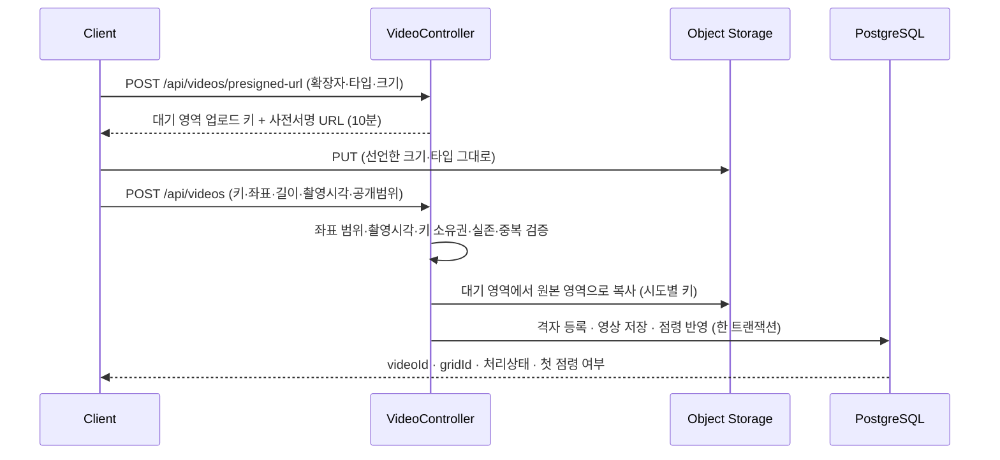
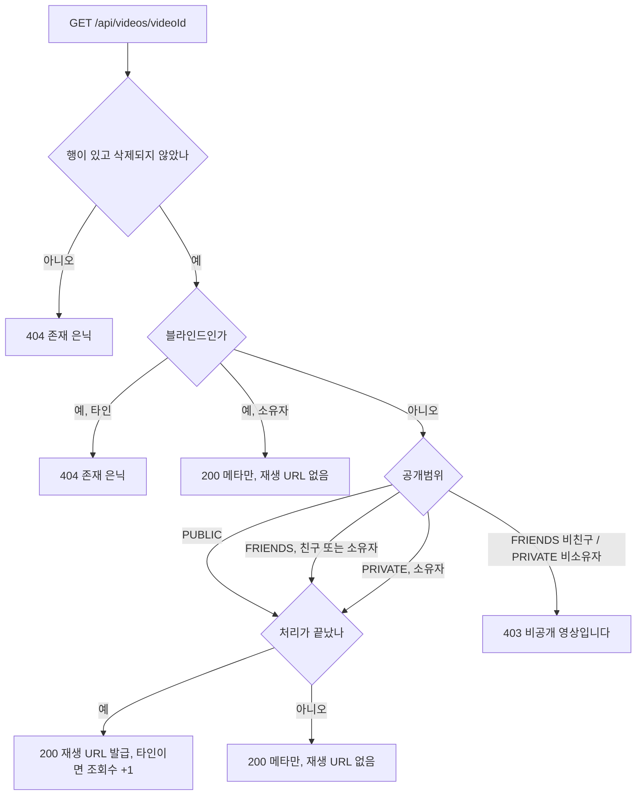

# PRD: 영상 업로드와 재생

> 작성일: 2026-08-10 · 작성: prd-writer (MSG-359 역산)
> 상태: 역산 (사후 문서. 구현이 이미 끝난 기능의 요구사항을 스펙과 위키 결정에서 복원했다)
> 커버 티켓: MSG-64, MSG-66, MSG-71, MSG-72, MSG-132, MSG-133, MSG-162, MSG-204, MSG-206, MSG-242, MSG-247, MSG-278, MSG-285, MSG-363 (접점: MSG-65 길이 실측 판정, MSG-193 블라인드 전이, MSG-347 격자 환산)
> 관련 SRS: VIDEO 영역 (FR-VIDEO-01 ~ 17)

## 1. 문제 상황

FillMap에서 영상은 콘텐츠이기 전에 기록의 증거다. 영상 한 편이 올라와야 그 격자가 도감에 들어오고,
스트릭과 뱃지와 핫스코어가 함께 움직인다. 그래서 이 묶음은 "영상을 저장한다"가 아니라 "무엇을
기록으로 인정할 것인가"를 정하는 자리였다.

문제는 이 판단이 열다섯 개 티켓에 나뉘어 들어갔고, 그중 셋은 처음 정한 것을 나중에 뒤집었다는
점이다. 영상 길이는 5초 고정에서 자유 길이로 바뀌었고, 삭제와 교체에 걸려던 24시간 제한은 폐기됐고,
공개범위는 두 값에서 세 값이 됐다. 지금 코드에는 결과만 남아 있어서 새로 합류한 사람은 "왜 하필
30초인가", "왜 비친구에게 404가 아니라 403인가"를 스펙 열다섯 개를 역독해해야 알 수 있다.
이 문서는 그 역독해를 대신한다.

## 2. 목적 · 목표

- **목적**: 방문한 장소를 짧은 영상으로 기록하고, 그 영상을 정해진 사람만 다시 볼 수 있게 한다.
  기록의 진위와 노출 범위를 서버가 어디까지 책임지는지 선을 긋는 것이 이 묶음의 본질이다.
- **목표**
  - 영상 파일 바이트가 서버를 거치지 않고도 업로드가 안전하게 성립한다.
  - 확정된 영상은 실제로 존재하는 본인 파일이고, 같은 파일로 두 번 확정되지 않는다.
  - 올린 사람은 언제든 영상을 바꾸거나 지울 수 있고, 지운 흔적이 저장소에 남지 않는다.
  - 재생 요청 하나가 접근 권한 판정과 재생 URL 발급을 모두 끝낸다.
  - 공개범위가 노출만 통제하고 기록 사실에는 손대지 않는다.
- **비목표 (이 묶음에서 하지 않기로 한 것)**
  - **현장 촬영 증명**. 서버는 클라이언트가 보낸 좌표를 검증된 값으로 신뢰한다. 기기 무결성
    검증(Play Integrity, App Attest)은 범위 밖이다.
  - **입력 소스 구분**. 갤러리에서 고른 영상과 앱에서 찍은 영상을 서버가 가르지 않는다.
  - **인코딩과 AI 블러 파이프라인**. 처리 상태를 읽어 재생 가능 여부를 판정할 뿐, 처리 자체는
    MEDIA 영역이다.
  - **영상 이력 보존**. 교체는 기존 행을 덮어쓰고 이전 파일을 남기지 않는다.
  - **조회수 중복 방지와 미인증 재생**.

## 3. 기능 요구사항

요구사항 문장 자체는 `docs/srs.md`의 VIDEO 영역이 정본이다. 여기서는 묶음별로 무엇을 보장하는지와
그렇게 정한 이유를 적고, SRS 항목 번호로 연결한다.

### 3.1 업로드 권한 발급

파일 바이트는 서버를 통과하지 않는다. 서버가 하는 일은 "이 사람이 이 크기의 이 형식 파일을 10분
안에 올려도 된다"는 서명을 발급하는 것뿐이다. 서버를 경유시키면 업로드 트래픽이 애플리케이션
스레드를 잡고 타임아웃 관리가 따라붙는데, 30초짜리 영상 하나에 그 비용을 치를 이유가 없었다.

| 보장하는 것 | SRS |
|---|---|
| 유효기간 10분짜리 업로드용 사전서명 URL[^1]과 업로드 키만 서버가 발급한다 | FR-VIDEO-02 |
| 형식은 mp4와 mov뿐이고 확장자와 Content-Type 쌍이 어긋나면 거부한다 | FR-VIDEO-03 |
| 확정 업로드는 100MB를 넘을 수 없고, 선언한 크기와 실제 전송 크기가 다르면 저장소가 거부한다 | FR-VIDEO-04 |

크기 상한은 두 겹이다. 서버가 요청 시점에 100MB를 넘는 선언을 거절하고, 서명에 선언 크기를
함께 걸어 클라이언트가 다른 크기를 보내면 저장소가 서명 불일치로 막는다. 처음에는 크기 범위
조건을 서명에 걸 생각이었으나 그 조건은 POST 정책에서만 쓸 수 있고 PUT 서명에는 표현할 자리가
없어서, 범위 대신 정확 일치로 바꿨다.

### 3.2 업로드 확정

클라이언트가 저장소에 파일을 올린 뒤 서버에 "이 키로 확정해달라"고 알리는 단계다. 이 요청 하나가
격자 환산, 격자 등록, 영상 저장, 점령 반영을 한 트랜잭션으로 끝낸다.

| 보장하는 것 | SRS |
|---|---|
| 영상 한 편의 길이는 1초 이상 30초 이하다 | FR-VIDEO-01 |
| 촬영 좌표를 격자로 환산해 기록한다 | FR-VIDEO-05 |
| 실제로 그 격자에 있었는지는 증명하지 않는다. 현장 게이팅은 클라이언트 몫이다 | FR-VIDEO-06 |
| 촬영 시각은 현재 시각 + 5분을 넘을 수 없고, 과거 시각은 제한 없이 인정한다 | FR-VIDEO-07 |
| 본인이 방금 올린 실제 객체만 확정을 인정하며 교체 경로에도 같은 검증이 걸린다 | FR-VIDEO-08 |
| 같은 영상의 동시 확정은 하나만 성공하고, 확정이 롤백되면 복사된 원본도 함께 지운다 | FR-VIDEO-09 |

좌표는 서버가 한국 범위 안인지만 확인한다. 이 검증은 싸고 확실해서 서버가 맡았고, 그 이상은
포기했다. GPS를 속이거나 API를 직접 호출하면 어차피 우회되기 때문이다.

촬영 시각의 5분 여유는 단말 시계 오차를 덮는 값이다. 여유를 0으로 두면 시계가 조금 빠른 기기의
정상 업로드가 막히고, 크게 두면 미래 시각으로 종료된 축제의 스탬프를 딸 수 있다. 과거 시각을
막지 않는 것은 갤러리 업로드가 제품의 정식 입력 경로이기 때문이다.

**길이는 클라이언트가 신고한 정수값만 본다.** 확정 요청의 `durationSec`에 1 이상 30 이하 검증이
걸려 있을 뿐(`VideoUploadRequestDto`의 `@Min(1) @Max(30)`), 서버가 파일을 열어 실제 길이를 재지는
않는다. 그래서 30.4초짜리 파일이라도 클라이언트가 30을 보내면 확정을 통과한다.

**이 느슨함은 사고가 아니라 확정된 정책이다** (2026-08-10 성민 확인). 촬영 앱마다 길이를 재는
방식이 미세하게 달라 정확히 30.000초짜리 파일을 만드는 것 자체가 불가능하고, 사용자가 30초 영상을
올렸는데 소수점 뒷자리 때문에 거부당하는 쪽이 더 나쁘다는 판단이다. 30초 언저리는 여유를 두고
통과시킨다.

이 확인의 핵심은 **새로 만들 동작을 지시하는 결정이 아니라는 점**이다. 확정 단계의 코드는 이미
이 정책대로 움직인다. 다만 그것은 정책이 있어서가 아니라 정책이 없어서 우연히 그렇게 돌던 것이고,
이번 확인이 그 동작을 의도된 것으로 못 박았다. 확정 단계에 관한 한 고칠 코드는 없다.

여유가 확정 단계 밖까지 이어지지는 않는다. 처리 파이프라인은 인코딩 직전에 파일을 열어 실측
길이를 재고 30.0초를 넘으면 실패로 끝낸다(`VideoEncodingServiceImpl`의 `MAX_DURATION_SEC`,
FR-MEDIA-03). 신고값 30으로 확정을 통과한 30.03초 파일이 처리에서 실패하는 경로는 그래서 아직
살아 있다. 그 게이트에도 같은 여유를 줄지는 정해진 바가 없고 `media-pipeline-prd.md` 7절에 열린
항목으로 남아 있다.

### 3.3 교체와 삭제

| 보장하는 것 | SRS |
|---|---|
| 시간 제한 없이 교체할 수 있고, 다른 격자 좌표로는 교체할 수 없다 | FR-VIDEO-10 |
| 시간 제한 없이 삭제할 수 있고, 원본과 인코딩본과 썸네일이 저장소에서도 제거된다 | FR-VIDEO-11 |

교체를 같은 격자로 묶는 것은 격자가 영상의 속성이 아니라 기록의 좌표축이기 때문이다. 다른 격자로
교체하도록 두면 도감에서 격자 하나가 조용히 사라지고 다른 격자가 생기는데, 그것은 교체가 아니라
삭제 후 재업로드다.

삭제는 상태만 바꾸는 소프트 삭제[^2]로 하되, 저장소 객체는 커밋 직후 실제로 지운다. 이 조합은
"복구 기능이 없다"는 사실에서 나왔다. 복구가 없으면 파일을 남길 이유가 없고, 남기면 사용자가
지운 영상이 저장소에 영원히 머무는 프라이버시 문제가 된다.

### 3.4 재생과 공개범위

| 보장하는 것 | SRS |
|---|---|
| 단건 조회 하나가 재생을 처리하고, 유효기간이 있는 서명 URL을 요청 시점에 발급한다 | FR-VIDEO-12 |
| 접근 판정 순서는 삭제, 블라인드, 공개범위, 처리 상태다 | FR-VIDEO-13 |
| 조회수는 재생 URL이 실제로 발급된 타인 조회에서만 1 증가한다 | FR-VIDEO-14 |
| 공개범위는 PUBLIC, FRIENDS, PRIVATE 세 값이고 업로드 시 지정하며 이후에도 바꿀 수 있다 | FR-VIDEO-15 |
| 친구 공개 영상의 비친구 거부는 비공개 영상의 거부와 완전히 같은 응답이다 | FR-VIDEO-16 |
| 공개범위는 노출 정책일 뿐 점령과 도감과 스트릭과 핫스코어에 영향을 주지 않는다 | FR-VIDEO-17 |

**판정 순서가 곧 프라이버시 정책이다.** 네 축을 위에서부터 보고 처음 걸리는 것으로 결과를
확정하는[^3] 방식이라, 어떤 순서로 보느냐에 따라 같은 영상이 존재를
드러내기도 하고 숨기기도 한다. 공개범위를 블라인드보다 먼저 보면 신고로 내려간 공개 영상이
200으로 응답해 "이 영상은 있는데 지금 못 본다"를 알려주게 된다. 그래서 은닉이 필요한 축을 앞에
두고 접근 거부만 하면 되는 축을 뒤에 뒀다.

이 순서를 요구사항으로 못 박아 둔 이유는, 판정을 리팩터링할 때 순서가 구현 세부로 보여서 쉽게
흐트러지기 때문이다. 실제로 공개범위 값이 두 개에서 세 개로 늘 때 "PRIVATE만 막는다"는 부정형
분기가 새 값을 조용히 전원 공개로 흘려보낼 뻔했다.

## 4. 비기능 요구사항

| 분류 | 요구사항 |
|------|----------|
| 보안 | 업로드는 서버가 발급한 사전서명 URL로만 가능하다. 유효기간 10분, 크기 상한, 선언 길이 정확 일치를 서명에 함께 건다 (NFR-SEC-04) |
| 보안 | 접근 거부 응답은 대상의 존재를 알려주지 않는다. 비공개 영상과 비친구 영상은 같은 403 하나로 수렴한다 (NFR-SEC-06) |
| 데이터 정합 | 같은 자원에 대한 동시 쓰기는 행 잠금과 어드바이저리 락[^5]으로 직렬화한다 (NFR-DATA-04) |
| 데이터 정합 | 확정 트랜잭션이 롤백되면 그 트랜잭션이 복사한 저장소 객체도 함께 정리된다. 정리 실패는 로그만 남기고 요청을 실패시키지 않는다 |
| 성능 | 업로드 응답 경로에 얹히는 핫스코어 적재 비용은 건당 0.0015ms 수준이고, 대기열이 포화해도 요청 스레드를 붙잡지 않는다 (NFR-PERF-05) |
| 운영 | 재생 URL 발급은 저장소 호출이 아니라 로컬 서명 연산이라 호출 비용이 사실상 없다 |

## 5. 뒤집힌 결정 세 가지

이 묶음의 값어치는 여기 있다. 세 결정 모두 처음 정한 것을 나중에 폐기했고, 폐기한 쪽이 코드에는
남아 있지 않다.

### 5.1 5초 고정에서 자유 길이 최대 30초로

최초 기획에서 영상은 5초 고정이었다. 에픽 이름이 "5초 영상 기록"이었고 초기 스키마의 길이 컬럼은
기본값 5를 들고 있었다. 2026-07-13 스키마 개정에서 이 컬럼이 기본값 없는 값으로 바뀌고 1초 이상
30초 이하 제약이 붙으면서 자유 길이가 됐다.

지금 이 상한은 여러 곳의 전제가 됐다. 처리 파이프라인이 실측 길이 30초 초과를 신고 값과 무관하게
실패로 처리하고, 업로드부터 재생 준비까지 30초 이내라는 성능 목표도 30초 영상 한 편을 단위로 잡은
값이다. 디자인 시안에 42초 영상이 그려졌을 때도 시안 오류로 판정하고 30초를 유지했다.

**5초를 버린 이유는 길이가 모자랐기 때문이다. 5초로는 장소가 담기지 않았다** (2026-08-10 성민 확인).
방문한 장소를 남기는 것이 이 서비스의 기록 단위인데, 5초짜리 한 편으로는 그 장소가 무엇인지
보여주지 못했다는 것이다.

다만 **상한이 왜 하필 30초인지, 하한 1초가 의도한 최소 길이인지 0 방어인지는 여전히 확인되지
않았다.** 커밋 메시지가 멘토 피드백에 따른 스키마 개정이라고만 적고 있다. 이 둘은 §9에 미확인으로
남긴다.

### 5.2 삭제와 교체의 24시간 제한 폐기 (2026-07-16)

원래 삭제 정책에는 "24시간 이내면 즉시 롤백하고 그 이후는 미확정"이라는 단서가 붙어 있었다.
2026-07-16에 이 단서를 폐기하고 시간 제한을 없앴다.

폐기 근거가 흥미로운데, 새로 판단해서 뒤집은 것이 아니라 **문서만 낡아 있었다**는 것이다. 어차피
MVP는 두 경우를 같게 처리하기로 되어 있었고 코드에는 시간 분기가 처음부터 없었다. 시간 제한이
살아 있었다면 "24시간이 지난 영상은 지워도 격자가 남는다"는 상태가 생기는데, 그러면 도감에
파일 없는 격자가 남아 점령이 무엇의 결과인지 흐려진다.

이 결정은 확정 기획 목록에도 2026-07-16 항목으로 올라 있고, 격자 롤백 정책과 영상 수정 자유의
근거가 됐다. 지라 티켓 본문에는 아직 24시간 서술이 남아 있으니 티켓을 근거로 삼지 않도록 주의한다.

### 5.3 공개범위 두 값에서 세 값으로, 그리고 비친구를 숨기는 방식 (2026-08-03)

공개범위는 세 단계를 거쳐 지금 모양이 됐다.

1. **전환만 있던 시기.** 업로드는 항상 비공개로 저장되고 나중에 공개로 바꾸는 API만 있었다.
   업로드 화면의 공개 선택 UX가 확정되지 않아서, 확정 안 된 정책의 기본값을 요청 계약에 박지
   않겠다는 판단이었다.
2. **업로드 지정과 기본값 반전 (2026-08-01).** "올리면 지도에 게시된다"가 제품 기본 동작이라
   기본값을 공개로 뒤집었다. 앞 단계에서 안전값으로 골랐던 비공개 기본이 여기서 폐기됐다.
   반전 자체가 리스크였는데, 필드를 생략한 구버전 클라이언트 요청의 의미가 비공개에서 공개로
   바뀌기 때문이다. 하위 호환은 유지되지만 의미가 반전된다는 점을 계약 변경으로 명시했다.
3. **친구 공개 추가 (2026-08-03).** 친구 관계 기능이 완성되면서 세 값째를 붙였다.

**비친구 거부를 어떻게 할 것인가**가 이 티켓의 유일한 쟁점이었다. 처음 안은 404로 존재 자체를
숨기는 것이었다. 친구가 아닌 사람에게 "이 영상은 있고 너는 친구가 아니다"를 알려주지 않겠다는
취지였다.

이 안은 폐기됐다. 비공개 영상의 실제 동작이 이미 403이었기 때문이다. 비친구에게만 404를 주면
404와 403의 차이가 오히려 "친구 공개 영상이 있다"는 신호가 되어, 숨기려던 정보를 응답 코드로
누설한다. 그래서 **비친구 거부를 비공개 비소유자 거부와 완전히 같은 403 하나로 수렴**시켰다.
새 에러 코드를 만들지 않은 것도 같은 이유다. 코드가 다르면 클라이언트가 구분할 수 있다.

친구 여부는 요청할 때마다 실시간으로 본다. 캐시하거나 비정규화하지 않아서 친구를 끊으면 다음
요청부터 바로 막힌다. 노출 정책에서 지연 반영은 사고로 이어진다.

## 6. 그 밖의 결정과 기각된 대안

| 주제 | 채택 | 기각한 대안과 이유 |
|------|------|-------------------|
| 확정 시 파일 검증 | 소유권 접두어, 저장소 실존, 중복 사용 세 가지를 함께 본다 | 접두어 검사만으로는 못 막는다. 공격자가 자기 식별자를 알기 때문에 형식만 맞춘 가짜 키로 지도 전체를 칠할 수 있었다. 실제로 파일 없이 격자가 점령되던 결함이 이 검증으로 닫혔다 |
| 교체 경로 검증 | 확정과 똑같은 검증을 건다 | 교체를 열어두면 정면으로 막은 가짜 키 공격이 옆문으로 다시 열린다. 아무 영상이나 하나 올린 뒤 교체로 밀어넣으면 되기 때문이다 |
| 교체 방식 | 기존 행의 파일 참조만 갱신한다 | 새 행을 만들어 이력을 남기는 안은 기각했다. 점령과 영상 수가 자동으로 불변이 되는 이점이 크고, MVP에 이력 열람 요구가 없다 |
| 삭제한 파일 정리 | 커밋 직후 저장소 객체를 지운다 | 정리 배치를 따로 만드는 안은 기각했다. 복구 기능이 없어 남길 이유가 없고, 스케줄러와 실패 처리와 모니터링이 전부 따라붙는다. 정리 실패는 비용 문제일 뿐이라 로그만 남기고 삭제 자체는 성공으로 둔다 |
| 확정 전 임시 파일 | 발급 키를 대기 영역에 두고 확정 시 원본 영역으로 복사한다 | 처음에는 원본 경로로 바로 발급했다. 그러면 "올렸는데 확정하지 않은" 파일이 진짜 원본과 같은 경로에 섞여 만료 규칙을 걸 수 없다. 경로를 가르고 대기 영역에만 1일 만료를 건다 |
| 동시 확정 | 대기 키 단위로 확정을 직렬화하고 원본 키에 시도 식별자를 붙인다 | 하나의 원본 키를 공유하며 유니크 제약으로 경쟁을 거르는 안은, 진 쪽의 정리가 이긴 쪽의 파일을 지울 수 있어 기각했다. 시도마다 키가 달라지면 목적지 공유 자체가 사라진다 |
| 롤백 보상 | 복사 직후 롤백 보상을 등록해 실패 시 복사본을 지운다 | 보상이 없으면 원본 경로에 영구 고아 객체[^4]가 쌓인다. 대기 영역 만료 규칙은 원본 경로를 건드리지 않고, 삭제와 교체의 정리는 DB 행이 있는 것만 대상으로 한다 |
| 공개범위 전환 API | 별도 하위 경로에 부분 수정으로 둔다 | 파일 교체 경로를 재사용하는 안은 기각했다. 그 경로는 이미 "파일 전체 교체"로 점유돼 있어서 의미가 충돌한다 |
| 전환과 처리 상태 | 처리가 안 끝난 영상도 공개로 바꿀 수 있다 | 처리 완료를 전환 조건으로 거는 안은 기각했다. 공개범위는 의도이고 처리 상태는 준비도라 축이 다르다. 전환에 조건을 걸면 블러가 끝날 때까지 공개를 못 켜고 처리에 실패한 영상은 영영 못 켠다. 노출 차단은 조회 경로가 처리 완료를 강제하는 것으로 해결한다 |
| 같은 값으로 전환 | 성공으로 처리한다 | 부분 수정은 정의상 멱등이고, 중복 삭제를 멱등하게 받는 기존 태도와 같다. "이미 공개임" 전용 에러는 만들지 않았다 |
| 재생 소스 | 블러본이 있으면 블러본, 없으면 인코딩본을 서명해 준다 | 저장소 객체를 공개로 열어 영구 URL을 쓰는 안은 기각했다. 버킷 공개 차단을 유지하고, 썸네일 발급과 같은 방식으로 통일했다 |
| 조회수 | 재생 URL을 실제로 발급한 타인 조회만 1 증가 | 조회 요청마다 올리는 안은 재생하지 못한 요청까지 세어 격자 대표 영상 선정을 왜곡한다. 소유자 조회를 빼는 것은 자기 영상을 여닫아 조회수를 부풀리지 못하게 하려는 것이다. 중복 방지는 두지 않았다 |
| 블라인드 영상의 소유자 조회 | 메타는 보여주고 재생 URL은 주지 않는다 | 소유자에게도 404로 숨기는 안이 검토됐으나, 그러면 소유자가 "내 영상이 블라인드됐다"와 "아직 처리 중이다"를 구분할 수 없다. 응답에 상태를 실어 구분하게 했다 |
| 저장소 기본값 표기 | 스키마 기본값을 공개로 정정 (2026-08-10) | 서버가 저장할 때마다 값을 명시해서 이 기본값은 한 번도 발동한 적이 없다. 그래도 고친 이유는 스키마만 읽는 쪽(ERD, 덤프, 직접 SQL 시드)이 반대 결론을 내기 때문이다. 요구사항과 동작은 그대로다 |

## 7. 다이어그램

### 7.1 업로드 세 단계

### 7.2 재생 접근 판정 순서

## 8. 구현 위치

`.claude/docs/status.md`의 `video` 절이 정본이다. 이 표는 묶음 단위로 어디를 보면 되는지만 가리킨다.

| 관심사 | 위치 | Owner |
|---|---|---|
| 발급·확정·교체·삭제·재생 | `src/main/java/com/msg/fillmap/video/service/VideoServiceImpl.java` | B |
| 엔드포인트 | `video/controller/VideoController.java` | B |
| 상태값과 도메인 전이 | `video/entity/{Video,Visibility,VideoStatus,ProcessingStatus}.java` | B |
| 실패 코드 | `video/exception/VideoErrorCode.java` (3xxx 대역) | B |
| 블라인드 전이 | `video/service/VideoModerationService` (호출 주체는 관리자 API) | B |
| 친구 판정 소비 | `friend/service/FriendshipQueryService.isFriend` | B |
| 격자 환산 | `grid` 패키지의 격자 인코더 (계약 인터페이스 경유) | A |
| 스키마 | `V1__init.sql`, `V20`(공개범위 세 값), `V30`(기본값 정정) | - |

## 9. 미확인

근거를 찾지 못한 항목이다. 지어내지 않고 남긴다.

- **상한 30초라는 값의 근거와 하한 1초의 성격.** 5초 고정을 버린 이유 자체는 확인됐다. 5초로는
  장소가 담기지 않았다는 것이다 (2026-08-10 성민 확인, §5.1). 남은 것은 두 가지다. 왜 하필 30초에
  선을 그었는지, 하한 1초가 의도한 최소 길이인지 0 방어인지가 어느 문서에도 없다. 전환 시점인
  2026-07-13 스키마 개정 커밋 `a9591c2`가 길이 컬럼의 기본값 5를 지우고 1초 이상 30초 이하 제약을
  넣었는데, 커밋 메시지는 멘토 피드백이라고만 적혀 있다.
- **30초를 살짝 넘는 영상을 처리 단계에서 어떻게 할지.** 확정 단계는 정해졌다. 여유를 두고
  통과시키고, 지금 코드가 이미 그렇게 동작한다 (2026-08-10 성민 확인, 3.2절). 남은 것은 그다음
  단계다. 처리 파이프라인은 실측 길이 30.0초를 초과하면 실패로 끝내므로(FR-MEDIA-03) 확정을
  통과한 30.03초 파일이 거기서 죽는다. 그쪽 게이트에 같은 여유를 줄지, 아니면 프런트 트림
  정책으로 막을지는 결정된 기록이 없다. MEDIA 영역 판단이라 `media-pipeline-prd.md` 7절에 열린
  항목으로 있다.
- **조회수 중복 방지를 두지 않은 근거.** 스펙에 "Phase 2 후속"으로만 적혀 있고, 부풀리기가
  실제로 어떤 손해인지 판단한 기록이 없다. 격자 대표 영상 선정이 조회수를 참조하므로 노출
  품질에 닿는 값인데도 그렇다.
- **재생 URL 유효기간 10분이 재생 도중 만료될 때의 클라이언트 재발급 계약.** 스펙이 "30초 영상
  재생 시작에는 충분하다"고 판단하고 재생 전용 유효기간 분리를 유예했다. 버퍼링이 길어져
  만료되는 경우를 어떻게 처리할지는 정해진 바가 없다.

## 10. SRS 갱신 후보

스펙에는 확정으로 적혀 있으나 SRS VIDEO 영역에 항목이 없는 요구다. 등재 여부는 `srs-writer`가
판단할 몫이라 여기 모아만 둔다.

| 후보 | 근거 |
|------|------|
| 교체는 새 파일의 촬영 시각을 반영한다. 필수로 받은 값을 버리지 않는다 | MSG-242 결정 1. 반영하지 않으면 미션 기간 판정이 옛 시각으로 오판정된다 |
| 교체는 공개범위를 유지한다 | MSG-204 PRD FR-6 |
| 교체하면 처리 상태가 초기화되어 새 파일이 다시 처리된다 | MSG-71 D6. MEDIA 영역과 걸쳐 있어 소유 영역 판단이 필요하다 |
| 같은 값으로의 공개범위 전환은 실패가 아니라 성공이다 | MSG-162 M5 |
| 처리가 끝나지 않은 영상도 공개로 전환할 수 있고, 노출 차단은 조회 경로가 담당한다 | MSG-162 M4. 공개범위 요구(FR-VIDEO-15)가 지정과 변경만 말하고 처리 상태와의 관계는 비워 두었다 |
| 이미 삭제된 영상을 다시 삭제해도 오류로 끝나지 않는다 | MSG-72 D7 |

[^1]: 사전서명 URL(presigned URL). 저장소가 아니라 서버가 미리 서명해 발급하는 한시적 접근
    주소다. 이 URL을 가진 사람은 정해진 시간 동안 정해진 동작(여기서는 특정 키에 업로드,
    또는 특정 객체 재생)만 할 수 있고 별도 자격 증명이 필요 없다.

[^2]: 소프트 삭제(soft delete). 행을 실제로 지우지 않고 상태 컬럼만 삭제됨으로 바꾸는 방식이다.
    이 묶음에서는 DB 행은 소프트 삭제로 두되 저장소 파일은 실제로 지운다.

[^3]: first-match 판정. 조건을 정해진 순서로 위에서부터 보고 처음 걸리는 것으로 결과를 확정하는
    방식이다. 조건이 겹칠 때 어느 것이 이기는지가 순서로 결정되므로, 순서 자체가 정책이 된다.

[^4]: 고아 객체(orphan object). 저장소에는 파일이 남아 있는데 그것을 가리키는 DB 행이 없는 상태다.
    데이터 정합에는 무해하지만 지울 근거를 찾을 수 없어 비용이 계속 쌓인다.

[^5]: 어드바이저리 락(advisory lock). 특정 행이나 테이블이 아니라 애플리케이션이 정한 이름
    하나에 거는 데이터베이스 잠금이다. 아직 행이 없는 작업(여기서는 같은 업로드 키에 대한
    확정)을 직렬화할 때 쓴다.
