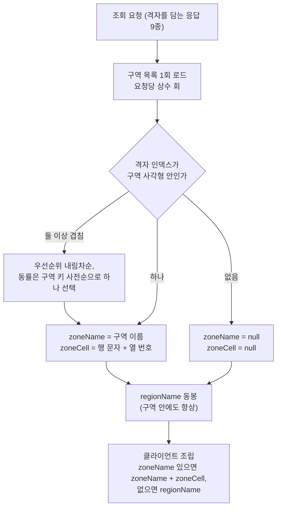

# PRD: 구역과 행정동 (격자를 사람이 읽는 이름으로 부르기)

> 작성일: 2026-08-10 · 작성: prd-writer (MSG-359 역산)
> 상태: 역산 (사후 문서. 구현이 이미 끝난 기능의 요구사항을 스펙과 위키 결정에서 복원했다)
> 커버 티켓: MSG-93, MSG-153, MSG-154, MSG-155, MSG-156, MSG-167, MSG-234, MSG-236, MSG-251(구역 관련분), MSG-259, MSG-341, MSG-347(구역 재산출분), MSG-349
> 관련 SRS: ZONE 영역 (FR-ZONE-01 ~ 14) · REGION 영역 (FR-REGION-01 ~ 13) · NFR-PERF-06 · NFR-DATA-03

## 1. 문제 상황

격자의 기계 식별자는 `19443_9582` 같은 숫자 두 개다. 사람은 자기가 있는 곳을 그렇게 부르지 않고,
디자인의 격자 카드 제목도 처음부터 "서면 A-14"였다. 그런데 사람이 쓰는 이름을 격자에 붙이는 일은
생각보다 까다롭다.

행정동 이름을 그대로 쓰면 통칭이 사라진다. "홍대"는 서교동과 동교동에 걸쳐 있고, "가로수길"이나
"황리단길"은 행정동에도 역 이름에도 없다. 사람들이 실제로 쓰는 지명은 행정 경계와 어긋나 있다.

동시에 다른 요구가 하나 더 있었다. "이 동네를 내가 얼마나 채웠나"를 보여주려면 격자를 행정동
단위로 묶어 세야 한다. 그러려면 어느 격자가 어느 행정동에 속하는지를 정하는 규칙이 필요하고,
그 판정을 언제 어디서 할지도 정해야 한다. 격자는 100m 정사각형이고 행정동은 임의 모양 폴리곤이라
경계에 걸친 격자를 양쪽에 다 세면 수집률이 100%를 넘어버린다.

그래서 이 묶음은 사실상 축이 둘이다. **구역(zone)** 은 사람이 부르는 이름을 붙이는 축이고,
**행정동(region)** 은 격자를 묶어 세는 축이면서 구역이 없는 곳의 이름을 대신 대는 축이다.
두 축이 서로를 필요로 해서 한 문서에 묶여 있다.

## 2. 목적, 목표, 비목표

**목적**: 격자에 사람이 읽는 이름을 붙이고, 격자를 행정동 단위로 묶어 수집 진행도를 보여준다.

**목표**

- 유명 통칭 안의 격자는 "서면 A-14"로, 그 밖의 격자는 행정동 이름으로 불린다. 이름 규칙은
  전 플랫폼이 같은 결과를 낸다.
- 아직 아무도 영상을 올리지 않은 격자에도 이름이 나온다. 이름은 저장된 데이터가 아니라 계산이다.
- 사용자가 행정동별 수집률을 보고, 지금 서 있는 곳이나 누른 격자의 수집률을 즉시 확인한다.
- 이름과 수집률을 얻는 실시간 경로에서 공간 연산이 돌지 않는다.

**비목표**

- 격자마다 구역 소속을 DB에 저장하는 일. 사각형 하나로 그 안 격자 수천 개가 결정되므로 저장은
  낭비이고, 구역 경계를 고치면 백필이 필요해진다.
- 조립까지 끝낸 이름 필드 하나(`displayName`)를 서버가 내려주는 일. 화면이 제목("서면 A-14")과
  위치줄("부산 부산진구 서면")을 다르게 조합해서 쓰기 때문에 조립본 하나로는 둘 다 못 만든다.
- 구역 밖 격자에 번호를 붙이는 일. 행렬 번호는 구역 사각형 안에서만 정의된다.
- 미수집 행정동까지 0%로 전부 나열하는 일. 전국 3,558개를 나열하면 리스트가 무의미해진다.
- 시/도 상위 집계("서울 34%"). MVP 이후 별도 티켓으로 미뤘다.

## 3. 기능 요구사항

요구사항 문장의 정본은 `docs/srs.md`다. 여기서는 같은 문장을 옮기지 않고 주제별로 묶어
어느 ID가 무엇을 보장하는지만 가리킨다.

### 구역과 표시명

| 주제 | 무엇을 보장하는가 | SRS |
|------|------------------|-----|
| 구역의 정의와 등재 기준 | 유명 통칭 하나가 격자 정수 사각형 하나가 된다. 지역 제한 없음 | FR-ZONE-01, FR-ZONE-02 |
| 이름 규칙 | 구역 안은 행렬 코드, 구역 밖은 행정동 이름, 둘 다 없으면 이름 없음 | FR-ZONE-03, FR-ZONE-04 |
| 계산 주체와 전달 | 서버가 계산해 격자를 담는 응답 9종에 두 필드로 싣는다 | FR-ZONE-05 |
| 저장 없는 계산 | DB에 격자 행이 없어도 이름이 나온다. 구역 데이터를 고치면 다음 응답부터 반영된다 | FR-ZONE-06, FR-ZONE-08 |
| 결정성 | 겹친 구역 중 하나를 항상 같은 규칙으로 고른다 | FR-ZONE-07 |
| 성능 형태 | 요청당 구역 로드는 항목 수와 무관하게 상수 회다 | FR-ZONE-09 |
| 빈 상태 내성 | 구역이 0건이어도 전 화면이 폴백으로 동작한다 | FR-ZONE-10 |
| 데이터 운영 | 시딩은 멱등[^idem]하고 확정본 48건은 겹치지 않는다 | FR-ZONE-12 |
| 규칙 드리프트 방어 | 언어 중립 픽스처가 규칙의 실행형 정본이다 | FR-ZONE-13 |
| 좌표계 전환 내성 | 격자 체계가 바뀌면 사각형만 재산출하고 규칙은 그대로다 | FR-ZONE-14 |
| 구역 이름으로 지도 이동 | 클라이언트가 구역 목록을 받아 검색바에서 쓴다 | FR-ZONE-11 |

### 행정동

| 주제 | 무엇을 보장하는가 | SRS |
|------|------------------|-----|
| 마스터 적재 | 전국 행정동 경계와 수집률 분모를 멱등하게 적재한다 | FR-REGION-01 |
| 좌표 판정 | 좌표 한 점의 행정동을 역지오코딩[^revgeo]으로 1건 반환한다 | FR-REGION-02 |
| 귀속 축 단일화 | 격자의 행정동은 중심점 하나로 정해진다. 경계 격자 이중 카운트가 없다 | FR-REGION-03 |
| 수집률 정의와 갱신 | 점령 격자 수를 전체 격자 수로 나눈 값이 점령과 롤백 시 같은 트랜잭션에서 갱신된다 | FR-REGION-04, FR-REGION-05 |
| 수집률 조회 | 목록 조회와 단건 조회(좌표 입력, 격자 입력)를 제공한다 | FR-REGION-06, FR-REGION-07 |
| 이름 재료 동봉 | 지도 응답 3종에도 행정동 이름을 싣는다. 구역 안 격자에도 항상 싣는다 | FR-REGION-08, FR-REGION-09 |
| 빈 값 허용 | 무귀속 격자는 이름이 비지만 응답 항목은 남는다 | FR-REGION-10 |
| 화면 간 일치 | 같은 격자의 행정동 이름은 어느 응답에서 보든 같다 | FR-REGION-11 |
| 조회 경로 규율 | 실시간 조회에서 공간 연산을 하지 않는다 | FR-REGION-12 |
| 범위 밖 | 시/도 상위 집계는 MVP 밖이다 | FR-REGION-13 |

## 4. 비기능 요구사항

| 분류 | 요구사항 | 근거 |
|------|----------|------|
| 성능 | 수집률 재계산이 사용자 점령 격자 수에 비례해 악화되지 않는다. 격자 1,000개 기준 p50 59.4ms에서 1.18ms로 개선됐다 | NFR-PERF-06, MSG-236 |
| 성능 | 이름 계산이 기존 응답 시간 목표를 흔들지 않는다. 뷰포트 최대 페이지 5,000건에서도 증가가 측정 오차 수준이어야 한다 | MSG-341 PRD 4절 |
| 성능 | 행정동 이름 동봉으로 늘어나는 응답 크기가 격자당 압축 후 10바이트 이내다. 부산 62칸 실측은 격자당 8.7바이트였다 | MSG-349 PRD 4절 |
| 데이터 정합 | 이름 규칙의 단일 정본은 픽스처 파일 하나다. 서버 테스트가 그 파일을 직접 소비한다 | FR-ZONE-13 |
| 데이터 정합 | 격자의 행정동 판정 술어는 저장 라벨을 쓰든 즉석 재판정을 쓰든 같다. 그래서 경계 격자에서도 답이 갈리지 않는다 | FR-REGION-11 |
| 운영 | 시드 적재는 여러 번 실행해도 같은 상태로 수렴한다 | NFR-DATA-03 |
| 운영 | 이름 관련 변경에는 DB 마이그레이션이 없다. 필드 가산이라 구버전 클라이언트와 함께 굴러간다 | MSG-341, MSG-349 |

## 5. 구역 축: 결정이 두 번 뒤집힌 경위

이 묶음에서 가장 값어치 있는 부분이다. 같은 문제를 세 번 다르게 풀었고, 그때마다 앞선 판단이
틀려서가 아니라 전제가 바뀌어서 뒤집혔다.

| 시점 | 무엇을 정했나 | 무엇이 바뀌어서 뒤집혔나 |
|------|--------------|------------------------|
| 2026-07-18 | 이름 체계 자체를 수동 지정 구역 + 좌표 산술로 확정 | (뒤집히지 않음. 규칙은 지금까지 불변) |
| 2026-07-28 | 이름 계산은 클라이언트가 한다 (MSG-234 D3) | 클라이언트가 셋(웹, Android, iOS)으로 늘면서 규칙을 세 벌 구현하게 됐다 |
| 2026-08-07 | 이름 계산을 서버로 옮긴다 (MSG-341) | 구역 밖 폴백 재료를 안 준 응답이 셋 남아 "규칙 없애기"가 절반만 됐다 |
| 2026-08-10 | 폴백 재료도 응답에 싣는다 (MSG-349) | (현행) |

### 5.1 왜 구역이라는 개념을 새로 만들었나

세 안을 놓고 봤다.

**행정동 이름만 쓰기**를 기각한 이유는 통칭이 안 나오기 때문이다. "홍대"를 서교동으로 부르면
사용자가 자기 위치를 못 알아본다.

**지하철역 반경 자동 판정**을 기각한 이유는 셋이다. 가로수길처럼 역과 무관한 통칭을 못 덮고,
반경 경계가 자의적이며, 역이 새로 개통하면 기존 격자의 이름이 바뀐다. 이름이 흔들리는 것은
격자를 모으는 서비스에서 특히 나쁘다.

**수동 지정 구역 + 좌표 산술**을 채택한 결정적 이유는 커버리지를 사람이 통제할 수 있다는 점과,
이름이 순수 산술이라 격자를 미리 만들어 두지 않아도 즉시 계산된다는 점이었다. 외부 데이터에
의존하지 않아 이름이 우리 손 밖에서 바뀌지 않는 것도 근거였다.

대가는 명시적으로 받아들였다. 행 라벨이 A부터 Z까지 26개라 구역의 남북 폭이 2.6km를 넘을 수
없다. 이 한계는 스키마 CHECK 제약으로 못박아 작도 단계에서 걸리게 했다.

### 5.2 왜 폴리곤이 아니라 정수 사각형인가

구역을 PostGIS 폴리곤으로 저장하는 안을 기각했다. 정수 사각형이면 소속 판정이 부등식 네 개라
공간 연산이 아예 필요 없다. "조회 경로에서 공간 연산을 하지 않는다"는 규율을 구조적으로 자동
충족하고, 작도도 훨씬 쉽다. 대신 대각선으로 긴 상권이 과대한 사각형이 되는 손실은 검수에서
조정하기로 했다.

격자마다 구역 소속을 저장하는 안도 기각했다. 초안 233건 기준으로 사각형 저장이 42배 압축이고,
구역 이름이나 경계를 고칠 때마다 백필이 필요해진다.

### 5.3 1차 결정: 이름은 클라이언트가 만든다 (2026-07-28)

당시 근거는 세 가지였고, 지금 읽어도 그 시점 기준으로는 타당하다.

1. 이름 계산이 순수 산술이라 서버가 유일한 계산자일 이유가 없었다. 구역 목록 40건을 한 번
   받으면 클라이언트가 어떤 격자든 즉시 이름을 만들 수 있다.
2. 서버가 계산하면 격자를 담는 모든 조회 응답에 필드가 붙고, 막 머지된 다른 도메인의 DTO를
   다시 열어야 했다. 클라이언트 계산이면 서버 변경이 구역 목록 API 하나로 끝나 티켓이 한
   오너 안에서 닫혔다.
3. 응답 크기 근거도 있었다. 위키 FE 계약 문서에 "서버가 모든 응답에 이름을 얹으면 지도 폴링
   응답이 화면당 9~23KB 커진다"는 계산이 적혀 있고, 클라이언트 계산 비용은 카드 30장에
   7.1마이크로초로 실측돼 있었다.

**뒤집힌 이유**는 응답 크기도 성능도 아니었다. 클라이언트가 웹 하나였으면 이 결정은 유지됐을
것이다. Android와 iOS가 예정되면서 같은 명명 규칙을 세 벌 구현하고 세 벌 다 픽스처로 검증해야
하는 상황이 됐고, MSG-325 진행 중 프론트가 "조립만 하고 규칙은 갖지 않게 해달라"고 직접
요청했다. 규칙의 사본 수가 늘어난 것이 전제 변화였다.

### 5.4 2차 결정: 서버 계산으로 전환 (2026-08-07, MSG-341)

바뀐 것은 계산 주체뿐이다. 행 A가 사각형 북단이고 열 1이 서단이라는 규칙, 구역 밖에는 번호를
붙이지 않는다는 규칙, 겹침을 우선순위와 키 사전순으로 푸는 규칙은 그대로 살아 있다. 픽스처
파일도 기존 기대값을 지우지 않고 분리 기대값을 덧붙이는 식으로 늘렸다.

이 단계에서 내린 부수 결정 두 개가 나중에 중요해진다.

**필드를 조립본이 아니라 둘로 쪼갰다.** 화면마다 "서면 A-14"(상세 제목)와 "A-14"(마커, 칩)를
다르게 쓰기 때문이다. 조립본 하나만 내려주면 프론트가 다시 쪼개야 한다.

**구역 데이터를 캐시하지 않고 매 요청 읽기로 했다.** 48행 정수 테이블이라 풀스캔이 밀리초
미만이고, 캐시가 아끼는 것은 요청당 쿼리 하나인데 치르는 비용은 무효화 설계다. 구역 삭제가
재기동 없이 일어나는 경로가 있어서, 무기한 캐시면 영영 반영이 안 되고 수명 기반 캐시면 반영이
그만큼 늦는다. 매 요청 읽기는 무효화라는 결정 자체를 없앴다.

계약 형태도 성능을 구조로 강제하는 쪽으로 잡았다. 격자 하나씩 이름을 묻는 메서드를 계약
최상위에 두지 않고, 요청당 한 번 구역 스냅샷을 받아 항목마다 산술하는 형태로 만들어 항목당
쿼리가 나가는 N+1[^nplus1] 사용법을 애초에 불가능하게 했다.

### 5.5 3차 결정: 폴백 재료 동봉 (2026-08-10, MSG-349)

MSG-341은 구역 밖 격자에 대해 "행정동 이름은 응답마다 있는 데서 쓰라"고 남겼고, 지도가 쓰는
응답 세 개(뷰포트, 단일 격자, 핫구역)에는 그 재료를 넣지 않았다. 오버레이라 라벨을 안 그린다는
판단이었다.

그 판단이 틀렸다는 것을 숫자가 보여줬다. 전국에 등재된 구역이 48개뿐이라 dev 시드 격자 109칸
중 90칸이 구역 밖이었다. 구역 밖은 예외가 아니라 다수였다. 프론트가 이름을 얻으려면 격자 하나를
누를 때마다 수집률 API를 추가로 부르거나, 여러 칸이 오는 화면에서는 칸마다 단건 조회를 돌려야
했다. 500칸이면 500번이다. "규칙을 서버로 옮긴다"고 해놓고 "이름이 없으면 다른 API를 불러라"는
더 무거운 규칙을 남긴 셈이었다.

**기각한 대안: 응답 상단 대응표.** 같은 동 이름이 항목마다 반복되니 응답 맨 위에 코드와 이름
대응표를 한 번 두고 항목에는 코드만 싣는 안을 검토했다. 압축 후 크기를 실측했더니 이득이
없었다. 격자 100칸이 동 3개에 뭉친 경우처럼 대응표가 가장 유리해야 할 조건에서도 차이가 2바이트고,
동이 흩어지면 오히려 최대 56% 커졌다. gzip이 반복 문자열을 이미 사전으로 잡기 때문에 대응표가
하려던 일을 압축이 먼저 해버리고, 항목마다 새로 붙는 10자리 숫자 코드는 압축이 잘 듣지 않는다.

**디자인 실측이 규칙 하나를 추가로 확정했다.** 앱 디자인 MVP ver 5를 보면 같은 화면에서 이름
조각이 두 조합으로 쓰인다. 제목은 "서면 A-14"이고 그 아래 위치줄은 "부산 부산진구 서면"이다.
위치줄의 시/구는 행정동 데이터에서만 나오므로, 행정동 이름은 구역 밖 폴백 전용이 아니라
**구역 안 격자에도 항상** 실려야 한다. 이 관찰이 조립본 필드를 기각한 판단(5.4)도 다시 확인해
준다. 필드 하나로는 제목과 위치줄 두 조합을 만들 수 없다.

결과적으로 프론트의 조립 규칙이 응답 종류와 무관하게 한 줄로 통일됐다.
`zoneName이 있으면 "zoneName zoneCell", 없으면 regionName`이다.

### 5.6 구역 데이터를 누가 그리나

기계장치를 다 만들어 놓고도 구역 데이터가 0행이라 화면에 "서면 A-14"가 안 나오는 기간이
있었다. 블로커는 코드가 아니라 "서면이 어디까지인가를 누가 정하나"였다. 이건 좌표 공식이
아니라 사람의 지역 지식이다.

- **순수 수동 작도** 기각: 며칠이 걸리고 경계 근거가 자의적이다.
- **AI 좌표 생성** 기각: 환각 위험이 있고 공공 실측 데이터에 열위다.
- **지도 API 활용** 원천 불가: 장소 검색 API는 범위 정보를 안 주고, 저장하는 순간 약관 위반이다.
- **채택: 공공데이터 자동 변환 후 사람 검수.** 소상공인시장진흥공단이 전국 상권 경계를
  이용허락 제한 없이 개방하고 있었다. 폴리곤 경계 상자를 격자 인덱스로 양자화해 초안 231건을
  자동 생성하고, 사람은 목록 선정과 이름 다듬기("서면역7번출구"를 "서면"으로)와 경계 조정만
  했다. 3인 분담 1~2시간으로 끝났다.

검수에서 확정한 규칙 몇 가지가 남아 있다. 같은 시/도 안에서만 이름이 같은 사각형을 합치고
(서울시청과 부산시청을 합치면 265km 사각형이 된다), 겹침은 침범한 쪽 좌표를 정수 단위로 조정해
분리했다. 우선순위 값은 전건 0으로 뒀다. 상권 사이에 서열을 매기는 기준을 만들지 않기 위해서고,
겹침을 데이터 단계에서 0으로 만들었으니 우선순위 규칙은 실수 대비 보험으로만 남긴다는 뜻이다.

공공데이터에 없는 유명지(가로수길, 연남, 광안리, 해운대 등)는 수동으로 그려 넣었다. 확정본
48건 중 공공 상권 유래가 17건, 수동 작도가 31건이다. 초기 물량이 서울과 부산에 몰린 것은
공공데이터 일괄 변환을 돌린 범위가 거기였기 때문이지 지역 제한이 아니다. 2026-07-31에
"유명하거나 특별한 통칭이면 지역 무관"으로 등재 기준을 확정하면서 경주 황리단길 같은 항목이
들어왔다.

### 5.7 이름이 만들어지는 흐름

## 6. 행정동 축: 왜 그렇게 정했나

### 6.1 수집률 분모를 면적으로 근사한 이유

행정동마다 "그 안에 격자가 몇 개인가"를 알아야 수집률의 분모가 나온다. 정확한 답은 격자를
전부 열거해 각각이 경계 안인지 판정하는 것인데, 전국 3,558개 행정동에 대해 셀마다 포함 판정을
돌리는 것은 금지하기로 한 "반복문 안 공간 연산"의 전형이다.

그래서 경계 면적을 셀 면적으로 나누는 근사를 택했다. 표시용 분모이지 정밀 카운트가 아니라는
판단이었고, 오차도 문서에 남겼다. 당시 격자가 위경도 등간격 근사라 실제 셀이 지역마다
10,150에서 10,470제곱미터였는데 나누는 값은 명목 10,000이라 분모가 서울 기준 1.5%, 부산 기준
4.7% 과대계상됐다. 서울 제한을 걸 이유였던 계산량 문제가 이 근사로 사라져서 범위를 전국으로
넓힐 수 있었던 것도 부수 효과다.

이 근사가 100%를 넘는 수집률을 만들 수 있어서, 저장은 원값으로 하고 표시할 때 100으로 자르는
쪽으로 역할을 나눴다. 디버깅용 원값을 잃지 않기 위해서다.

### 6.2 격자의 행정동을 중심점 하나로 정한 이유

격자는 정사각형이고 행정동은 임의 폴리곤이라 경계 격자는 여러 동에 걸친다. 걸친 만큼 다 세면
한 격자가 두 번 세어지고 수집률이 부풀려진다.

그래서 귀속 축을 격자 **중심점** 하나로 통일했다. 한 격자는 정확히 한 행정동에 속하고, 어느
행정동에도 안 속하면(바다, 국외) 속하지 않은 채로 둔다. 이 축은 라벨 저장, 수집률 재계산,
격자 클릭 수집률 조회 세 곳에서 같은 술어를 쓴다. 축이 갈리면 "라벨은 역삼1동인데 수집률은
역삼2동에 계산"되는 상황이 나오기 때문에, 세 곳이 같은 답을 내는지 확인하는 테스트로 고정해 뒀다.

**영상 좌표 축을 기각한 이유**가 둘 있다. 하나는 축이 갈리는 위 문제고, 다른 하나는 영상 좌표
라벨 컬럼이 실제로는 전부 비어 있어서(라벨러 구현이 유예됨) 쓸 수조차 없었다는 점이다.

멘토가 제안한 "영상을 행정동에 직접 연결하기"도 기각했다. 저장하는 것이 다대다 포함관계가
아니라 격자 중심점의 대표 귀속 하나, 그러니까 함수값[^fdep]이라서 영상 쪽에 복제하면 드리프트만
생긴다는 것이 근거였다.

### 6.3 라벨을 어디에 저장할지: 기각했던 안의 정당한 부활

수집률 재계산을 만들 때(MSG-155)는 격자의 행정동을 저장하지 않고 계산할 때마다 판정했다.
그때는 쓰기 경로에서만 필요했고 쓰기는 드물었으므로 저장할 이유가 없었다.

한 달 뒤 도감 갤러리 화면이 격자 30칸마다 행정동 이름을 요구하면서 상황이 바뀌었다. 조회
경로에서 30번 공간 연산을 돌리는 것은 규율 위반이라, 저장이 유일한 답이 됐다. 같은 안을 앞서
기각했다가 다시 채택한 것이 모순이 아닌 이유가 여기 있다. 기각 사유가 "필요 없다"였고 그
전제가 바뀌었다.

저장 위치를 격자 테이블로 잡은 근거는 함수 종속이다. 행정동은 격자 중심점만으로 정해지는
격자 자체의 속성이라 점령 테이블에 두면 점령자 수만큼 중복된다. 조회 비용은 기본 키 등치 조인
두 개로 0.4~0.5ms로 실측했고, 행정동 **이름**까지 격자에 복사해 두는 비정규화[^denorm]는
행정동 개편 시 이중 갱신 리스크 때문에 기각했다.

판정 시점은 격자가 태어나는 그 문장 안이다. 격자는 첫 영상이 올라올 때 한 번만 생기므로,
그 삽입문에서 함께 판정하면 격자 생애 1회로 끝난다. 재방문 업로드에서는 판정이 아예 평가되지
않게 조건을 걸어 뒀다.

이 결정 뒤에 예약해 둔 후속이 하나 실행됐다. 라벨이 저장되기 시작하자 수집률 재계산 쿼리의
공간 연산 두 개를 등치 조인으로 바꿀 수 있게 됐고(MSG-236), 점령과 롤백 쓰기 경로에서 공간
연산이 완전히 사라졌다. 격자 1,000개 사용자 기준 p50이 59.4ms에서 1.18ms가 됐다.

### 6.4 "조회 경로에서 공간 연산 금지"의 예외 두 개

이 규율은 멘토 피드백에서 나왔고 이 묶음 전체를 관통한다. 다만 예외를 두 번 명시적으로 허용했다.

**역지오코딩 단건**(현재 위치의 행정동 찾기)은 사전 계산이 불가능하다. 입력이 임의의 좌표라
컬럼으로 미리 라벨해 둘 수 없다. 라벨은 저장된 것에만 붙일 수 있기 때문이다. 규율이 겨눈
것은 반복문 안에서 도는 고빈도 공간 연산이고, 이것은 사용자가 명시적으로 트리거하는 저빈도
단건이라 예외로 허용했다.

**빈 격자 클릭 시 중심점 재판정**(MSG-349)도 같은 논리다. 아직 아무도 안 올린 격자는 저장된
라벨이 없어서 즉석 판정 말고는 방법이 없다. 이건 사후에 성능 실측으로 확인했다. dev 워밍 후
0.2~1ms이고 인덱스 버퍼 히트 4페이지다. 행정동 3,558행이 DB 공유 버퍼에 상주해서 사실상
인메모리라는 뜻이다. 자바 쪽에 폴리곤을 다시 구현해 캐시하는 안은 판정 술어가 둘로 갈려
경계 격자에서 저장 라벨과 어긋난다는 이유로 기각했다. 후속 트리거도 적어 뒀다. 이 쿼리가
DB CPU 병목으로 실측되면 술어를 DB 한 곳에 유지한 채 결과만 캐시한다.

### 6.5 수집률을 언제 갱신하나

배치와 지연 계산을 기각하고 **점령, 롤백과 같은 트랜잭션 안에서 동기 갱신**을 택했다.
점령과 롤백은 업로드당 최대 1회이고 영향 범위가 한 행이라 핫패스가 아니다. 쓰기 때 한 번
갱신해 두면 조회는 순수 SELECT가 된다. 스케줄러와 수명 관리와 동시성 복잡도를 이벤트
희소성이 정당화하지 못한다는 판단이었다.

증분(+1/-1)이 아니라 **재계산**을 택한 것도 결정이다. 증분은 재실행이나 중복 호출에서
드리프트가 쌓이는데, 영향받은 사용자와 행정동의 진값을 다시 세면 방향과 무관하게 항상 정확하다.

마지막 격자가 롤백돼 카운트가 0이 되어도 행을 지우지 않고 0으로 남긴다. 갱신 이력이 남고,
모든 이벤트가 같은 문장 하나를 타서 0 특례 분기가 없어진다.

수집률 목록 조회에는 페이지네이션을 두지 않았다. 사용자당 행 수가 전국 행정동 수 3,558을
구조적으로 넘을 수 없는 유한 집합이라, 커서 방식의 복잡도를 정당화하지 못한다. 초안에 있던
안전 상한 1,000건은 리뷰에서 제거됐다. 유효 데이터를 아무 신호 없이 자르는 반면 지키는 것이
없었기 때문이다.

## 7. 알려진 한계

결정과 함께 받아들인 것들이라 결함이 아니다. 다만 기록해 둔다.

- 구역의 남북 폭은 2.6km를 넘을 수 없다. 행 라벨이 알파벳 26개이기 때문이다.
- 구역 사각형은 폴리곤이 아니라 경계 상자라 대각선으로 긴 상권은 실제보다 넓게 잡힌다.
- 수집률 분모는 면적 근사값이라 정밀 카운트가 아니다.
- 행정동 경계가 개편돼도 이미 저장된 격자 라벨은 재판정되지 않는다. 운영 마이그레이션 소관으로
  남겨 뒀고 절차는 정해지지 않았다.
- 시드 파일에서 구역을 빼도 DB 행은 남는다. 시딩이 UPSERT라 삭제를 반영하지 못하기 때문에
  구역 제거는 해당 행 수동 삭제가 공식 절차다.

## 8. 미확인

근거를 찾지 못해 지어내지 않고 남긴 것들이다.

- **수집률 분모의 셀 면적 상수.** 코드에 10,000제곱미터로 고정돼 있고, MSG-154는 이 값이 실제
  셀보다 작아 분모가 1.5~4.7% 과대계상된다고 기록했다. 그런데 2026-08-08 격자 체계가
  EPSG:5179로 바뀌면서 셀이 전국 어디서나 실제 100m가 됐으므로 그 편향은 사라졌을 것이다.
  이 사실을 어디에도 기록해 두지 않았고, 행정동 마스터를 다시 시딩했는지도 확인하지 못했다.
  마이그레이션은 수집률만 재계산했고 분모 컬럼은 건드리지 않는다.
- **시/도 상위 집계를 MVP 밖으로 둔 근거.** 스펙에 "PO 확정"으로만 적혀 있고 왜 그렇게 정했는지는
  기록이 없다.
- **검색 화면의 "구별 격자 수" 의미.** MSG-234 미해결 Q2가 "그 구의 전체 격자 수인가, 등록된
  격자 수인가"를 열어 뒀는데 이후 확정 기록을 찾지 못했다.
- **"격자 검색" 역파싱과 영상 검색의 범위.** SRS 11절은 위키에 2026-08-07 제외 확정이 있다고
  적고 있으나 그 위키 항목을 직접 확인하지 못했고, MSG-234 스펙은 아직 미확정으로 남아 있다.

## 9. SRS 갱신 후보

SRS에 대응 ID가 없어 위 표에 넣지 못한 요구들이다.

| 후보 요구 | 근거 | 왜 요구사항인가 |
|-----------|------|----------------|
| 구역 목록은 앱 진입 시 1회 조회하고 세션 동안 재사용하며 재접속이 최신이다. 버전 필드나 조건부 요청을 두지 않는다 | MSG-259 D-5 (FR-15) | 클라이언트 동작을 규정하는 확정 계약인데 ZONE 영역에 대응 항목이 없다 |
| 구역 제거는 시드 파일 수정으로 반영되지 않는다. 해당 구역 키 행의 수동 삭제가 공식 절차다 | MSG-259 D-8 | FR-ZONE-12가 시딩 수렴만 다루고 삭제 경로를 안 담는다. MSG-341 FR-6이 이 절차의 존재를 전제로 삼고 있어 명시가 필요하다 |
| 행정동 경계가 개편돼도 저장된 격자 라벨은 자동 재판정되지 않는다 | 위키 `04-decisions/ADR MSG-167 후속 결정` | FR-REGION-03이 판정 규칙만 정하고 원천 데이터 변경 시 동작을 안 담는다. 알려진 한계로 등재하거나 미해결로 올릴 값이다 |

## 10. 발견한 문서 불일치

이 문서를 쓰면서 확인한 것으로, 조치는 이 티켓 밖이다.

1. **위키 `03-specs/zone 표시명 FE 계약`이 여전히 클라이언트 계산을 가르친다.** 문서 맨 위에는
   MSG-341과 MSG-349 정정 배너가 붙어 있으나, 요약과 본문("서버는 격자 이름을 만들지 않는다",
   "왜 FE가 계산하나", 뺄셈 두 번 절차)은 손대지 않은 상태다. 배너를 못 보고 본문부터 읽으면
   폐기된 계약을 구현하게 된다. MSG-361이 이 문서를 고치는 티켓이다.
2. **위키 `03-specs/지도 홈 API 연동 가이드 FE`에는 정정 배너조차 없다.** 최종 갱신이
   2026-08-09인데 MSG-341과 MSG-349 어느 쪽도 언급이 없다.
3. **MSG-156 미해결 질문 1번이 이미 해소됐는데 스펙에 남아 있다.** "방문 행정동 수(영상 좌표
   축)와 수집률(격자 중심 축)이 한 화면에서 어긋나 보인다"는 문제인데, MSG-246이 방문 행정동
   수를 격자 축으로 정정해 두 지표의 축이 같아졌다.

이 셋 다 판정은 레포가 맞다. 검증 가능한 사실(무엇이 구현됐나)이라 코드와 `status.md`를 따른다.

---

[^idem]: 멱등. 같은 작업을 여러 번 실행해도 결과가 한 번 실행한 것과 같은 성질이다. 시드 적재를 삽입이 아니라 "있으면 갱신, 없으면 삽입"으로 짜면 재실행해도 행이 늘지 않고 값이 수렴한다.
[^revgeo]: 역지오코딩. 좌표(위도, 경도)를 사람이 읽는 주소나 행정 구역 이름으로 바꾸는 일이다. 반대 방향(주소를 좌표로)이 지오코딩이다.
[^nplus1]: N+1. 목록을 얻는 쿼리 1회 뒤에 항목마다 추가 쿼리 N회가 따라붙는 성능 결함이다. 격자 500칸이면 501회가 된다.
[^fdep]: 함수 종속. 어떤 값이 정해지면 다른 값이 자동으로 하나로 정해지는 관계다. 격자 번호가 정해지면 중심점이 정해지고 그 중심점이 속한 행정동도 하나로 정해지므로, 행정동은 격자의 함수값이다. 그래서 격자마다 한 번만 저장하면 되고 점령 기록마다 복사할 이유가 없다.
[^denorm]: 비정규화. 조회를 빠르게 하려고 다른 테이블의 값을 복사해 두는 설계다. 읽기는 싸지지만 원본이 바뀔 때 사본까지 같이 고쳐야 하는 부담이 생긴다.
