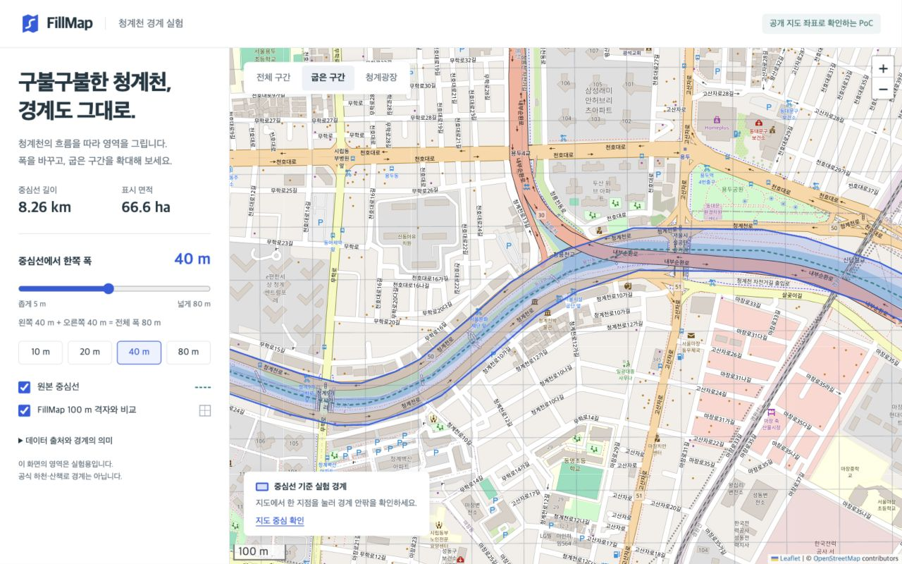

# 청계천 경계 표시 기술검증 보고서

검증일: 2026-09-13 / 기준 커밋: `02c89042` / PoC는 미커밋 워킹트리

## 판정

**청계천처럼 굽은 선을 따라 경계를 지도에 표시할 수 있습니다.**
기존 100m 격자를 바꾸지 않고, 별도 도형을 겹쳐 표시하는 방식으로 검증했습니다.
확인한 것은 경계의 생성·표시·안팎 판정입니다. 공식 하천 경계나 현장 산책로와의 일치는 확인하지 않았습니다.

## 검증 화면



위 화면은 실제 실행한 PoC입니다. 편측 40m의 경계와 현재 BE 기준 100m 격자를 겹쳤습니다.
[로컬 화면](http://127.0.0.1:8765/)에서 `굽은 구간`을 선택하고 폭을 조절할 수 있습니다.

## 방법과 결과

| 항목 | 검증 방법 | 결과 |
|---|---|---|
| 실제 청계천 형상 | OSM 상류·하류 중심선을 공통 끝점에서 연결 | 87좌표, 계산 길이 8.259km |
| 곡선 경계 | Turf 7.3.0 버퍼[^1]로 Polygon 생성 | 지도에 면적이 있는 영역으로 표시 |
| 폭 조절 | 편측 5~80m, 5m 간격 16종 | 유효 도형 생성, 자기 교차 없음, 폭에 따른 면적 증가 |
| 연속성 | 중심선 전체를 25m 간격으로 표본 확인 | 모든 표본과 마지막 끝점이 경계 안에 포함 |
| 거리 단위 | 실제 직선 구간의 수직 방향에서 폭의 80%·120% 지점 확인 | 80% 지점은 안, 120% 지점은 밖 |
| 기준 면적 | 편측 20m 계산 | 33.16ha |
| 기존 격자와 공존 | BE `GridConstants.java`의 EPSG:5179[^2] 정의로 비교 격자 생성 | 100m 간격 격자선 111개와 독립적으로 표시 |
| 격자 변환 정합 | 생성한 모든 꼭짓점을 미터 좌표로 역변환 | 최대 반올림 오차 0.000056m |
| 화면 조작 | 확대, 폭 조절, 중심선·격자 전환, 지도 클릭 | 동작 확인 |
| 반응형 화면 | 1280×800 데스크톱, 390×844 모바일 | 가로 넘침 없이 표시, 모바일은 지도 우선 배치 |

격자 변환 오차는 계산 정합성 수치입니다. 원본 지도의 위치 정확도나 측량 오차를 뜻하지 않습니다.
25m 간격 검사는 표본 검사이며 모든 공간 좌표에 대한 증명은 아닙니다.

## 현재 FillMap에 붙이는 방법

- 지도 위 경계 도형을 별도 표시 계층으로 추가할 수 있습니다. 기존 격자 계산을 바꿀 필요가 없습니다.
- 원본 선과 표시 경계를 GeoJSON[^3]으로 전달할 수 있습니다. 이번 PoC는 로컬 파일을 읽습니다.
- 화면은 Leaflet을 사용했습니다. 실제 서비스 지도 SDK로 옮기는 작업과 FE 계약 검증은 별도입니다.
- 서버 저장·검수는 기존 행사 구조와 연결해 설계해야 합니다. 이번 결과가 새 Venue 테이블의 필요성을 증명하지는 않습니다.

## 검증하지 않은 항목과 한계

- OSM의 **수로 중심선**에 일정한 폭을 줬습니다. 양쪽 산책로, 다리 위·아래, 폭이 달라지는 부지를 구별하지 않습니다.
- 운영자가 행사 경계를 직접 그리는 화면, 좌표 입력 검수, 공식 데이터 확보는 이번 범위 밖입니다.
- GPS 오차, 실제 현장 진입 판정, 행사 영상 귀속, 서버 공간 쿼리와 부하 성능은 미검증입니다.
- 지도 타일은 인터넷 연결이 필요합니다. 라이브러리와 좌표는 로컬 사본을 사용합니다.
- 초기 지도 생성 순서 오류는 수정 후 재검증했습니다. 다운로드 이벤트는 내장 브라우저에서 확인되지 않아 최종 화면에서 제외했습니다.

## 재현과 증거

```bash
python3 -m http.server 8765 --bind 127.0.0.1 --directory poc/cheonggyecheon-boundary
```

```bash
node poc/cheonggyecheon-boundary/check.mjs
```

```bash
python3 poc/cheonggyecheon-boundary/build-grid.py
```

- [실행 코드와 기록](../../poc/cheonggyecheon-boundary/README.md)
- [경계 생성 함수](../../poc/cheonggyecheon-boundary/geometry.mjs), [검사 코드](../../poc/cheonggyecheon-boundary/check.mjs)
- [BE 좌표계 정본](../../src/main/java/com/msg/fillmap/grid/GridConstants.java)
- [상류 원본](https://www.openstreetmap.org/way/368276771), [하류 원본](https://www.openstreetmap.org/way/769631455)
- OSM 스냅숏 시각: `2026-09-12T15:46:21Z`. 데이터: © OpenStreetMap contributors, ODbL-1.0.
- [Turf 버퍼 문서](https://turfjs.org/docs/api/buffer), [Leaflet 배포 문서](https://leafletjs.com/download.html)

기존 BE 코드·DB·Redis·S3는 수정하지 않았습니다. 후속 검증은 기존 행사·경로 구조에 추가할 수 있는 기능을 대상으로 합니다.
문서는 korean-humanizer·tech-term-footnotes를 적용하고 줄표·상투어 잔존을 검색했습니다.

[^1]: 버퍼는 선에서 일정 거리 안의 영역을 만드는 연산입니다. 화면에서 굵은 선을 그리는 것과 달리 실제 좌표로 된 면을 만듭니다.
[^2]: EPSG:5179는 한국에서 사용하는 미터 단위 평면 좌표계입니다. FillMap은 이 좌표를 100m 눈금으로 나눠 격자를 계산합니다.
[^3]: GeoJSON은 지도 위 점·선·면을 JSON으로 저장하는 형식입니다. 경도와 위도 순서를 통일해 클라이언트와 서버가 같은 도형을 주고받을 수 있습니다.
