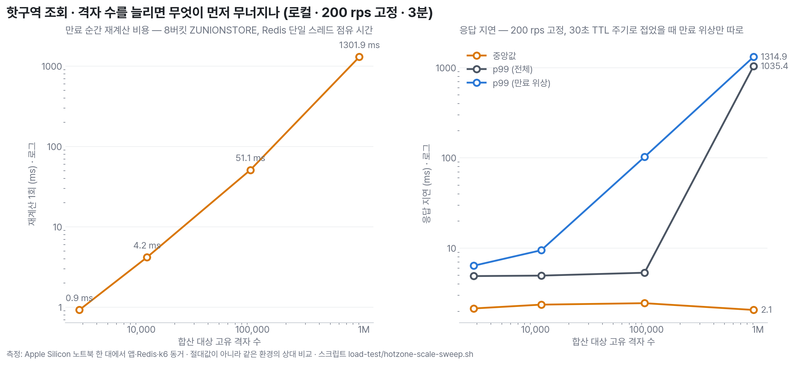

# 핫구역 조회 규모 감도 — 격자 수를 늘리면 무엇이 먼저 무너지나

MSG-321 은 "현재 규모(격자 수천)에서 조회 경로는 고칠 것이 없다. 격자가 만 단위로 늘면 재계산이 수십 ms 가 되고 그때는 다시 봐야 한다"로 끝났다. 이 측정은 그 "그때"가 어디인지를 잰다. 격자 수만 2,788 → 11,291 → 95,700 → 911,624 로 바꾸고 나머지(200 rps 고정, 3분, 30초 TTL)는 그대로 두었다.

결론부터: **격자 1만 개까지는 만료 주기가 응답에 보이지 않고, 10만 개에서 만료 위상의 p99 가 평시의 21배(102ms)로 튀며, 100만 개에서는 재계산 1회가 1.3초라 30초마다 모든 요청이 1초 넘게 멈춘다.** 중앙값은 네 규모 모두 2ms 대로 같다 — 처리량이 아니라 꼬리가 무너진다.

## 수치

| 고유 격자 | 재계산 1회 (Redis 점유) | 중앙값 | p99 (전체) | p99 (만료 위상) | 만료 위상 / 평시 위상 | 주기 재현 |
|---:|---:|---:|---:|---:|---:|:--|
| 2,788 | 0.9 ms | 2.15 ms | 4.9 ms | 6.4 ms | 1.3배 | 0/6 (무관) |
| 11,291 | 4.2 ms | 2.37 ms | 5.0 ms | 9.5 ms | 2.0배 | 5/6 |
| 95,700 | 51.1 ms | 2.46 ms | 5.4 ms | 102.6 ms | 20.8배 | 6/6 |
| 911,624 | 1,301.9 ms | 2.07 ms | 1,035.4 ms | 1,314.9 ms | 265.7배 | 5/5 |

재계산 횟수는 네 규모 모두 6회(180초 ÷ TTL 30초)로 만료 횟수와 같았다 — 중복 재계산은 없고, 지연은 재계산 1회가 Redis 를 붙잡는 동안 뒤에 줄선 요청이 밀리는 head-of-line 이다(MSG-321 3절과 같은 기제). 실패는 전 구간 0%. 100만 규모에서는 목표 도착률을 못 맞춘 iteration 이 213건 나왔다(36,001 중) — Redis 가 1.3초씩 멈추는 동안 VU 가 바닥났기 때문이다.

## 판단

| 격자 수 | 상태 | 조치 |
|---|---|---|
| ~1만 | 만료 위상 p99 < 10ms. 사용자가 느낄 수 없다 | 없음 |
| ~10만 | 만료 순간 100ms 급 꼬리. 30초에 한 번, 그 순간의 요청 몇 건만 | 관측 알람 (p99 > 50ms) — 고칠 시점은 아니다 |
| ~100만 | 30초마다 1초 이상 정지. 핫구역만이 아니라 같은 Redis 를 쓰는 인증(토큰 무효화 확인)까지 멈춘다 | 재계산을 요청 경로에서 뺀다 |

지금 운영 격자 수는 수천 단위로 추정(MSG-321 9절, 여전히 실측 아님)이라 조치 대상이 아니다. **다시 볼 조건은 "합산 대상 고유 격자가 5만을 넘을 때"** 다. 그때의 선택지는 이미 코드에 힌트가 있다: 재계산을 조회 요청이 아니라 집계 워커가 주기적으로 미리 해 두면(TTL 만료 전 갱신) 요청 경로는 ZREVRANGE 만 남는다. 버킷을 6시간 8개에서 더 잘게 쪼개는 것은 답이 아니다 — 비용은 합산 member 수에 비례하고 버킷 수는 상수다.

## 방법

- 실행: 앱 `bootRun` local 프로파일(단독 jar), redis:7-alpine 컨테이너, k6 v2. Apple Silicon 노트북 한 대에서 앱·Redis·k6 동거. 절대값이 아니라 같은 환경의 상대 비교다.
- 시드: `load-test/seed-hotzone.sh` 를 `AREA=wide` 로 전국 사각형(34.5~38.3, 126.0~129.5)에 뿌렸다. 서울 상자(37.45~37.65, 126.85~127.15)의 상한이 약 5.8만 칸이라 그 너머 규모가 필요했다. 핫구역 후보(점수 3 이상)는 규모와 무관하게 서울 상자에 2,000 표본으로 고정해 상위 50 집합이 같게 유지된다 — 규모만 변수다.
- 격자 id 는 PostGIS 로 EPSG:5179 변환 후 100m floor 로 만든다. 이전 awk 시드는 위경도 스텝 기반이라 MSG-347(미터 격자 전환) 이후 앱 필터와 어긋나 응답이 전부 비어 있었다(이번에 발견해 고쳤다).
- 재계산 비용: `measure-zunionstore.sh` — 빈 EVAL 기준선을 빼고 100회 평균, 3회 중앙값.
- 부하: `k6 hotzone-benchmark.js` expiry 시나리오, 200 rps constant-arrival-rate, 3분. `analyze-expiry.py` 로 TTL 30초 주기로 접어 만료 위상의 p99 와 주기별 재현율을 본다.
- 전체 자동화: `load-test/hotzone-scale-sweep.sh`. 원시 요약은 `load-test/results/hotzone-scale-sweep.tsv`.

## 한계

- 노트북 한 대. 서버 절대값이 아니다.
- 100만 규모의 재계산 비용 측정(1.3초 × 600회)이 Redis 를 13분간 독점했다. 그 사이 다른 클라이언트는 전부 대기한다 — 운영 Redis 에서는 이 스크립트를 돌리면 안 된다.
- 시드 점수 분포는 균등 난수라 실제 쏠림보다 평평하다. 합산 비용은 member 수에 좌우되므로 결론에는 영향이 없다.
