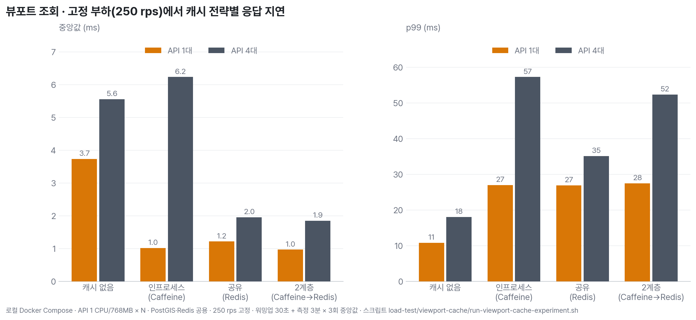
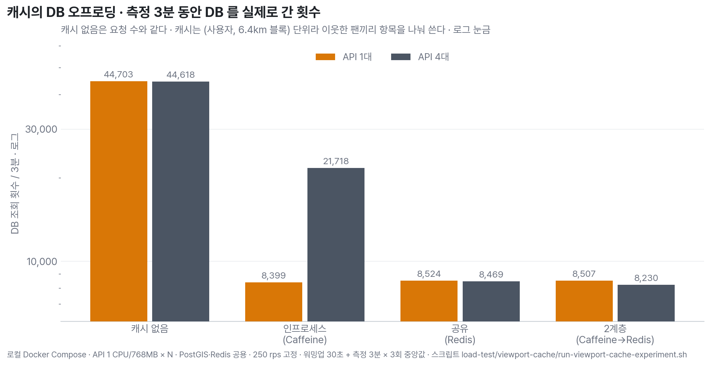
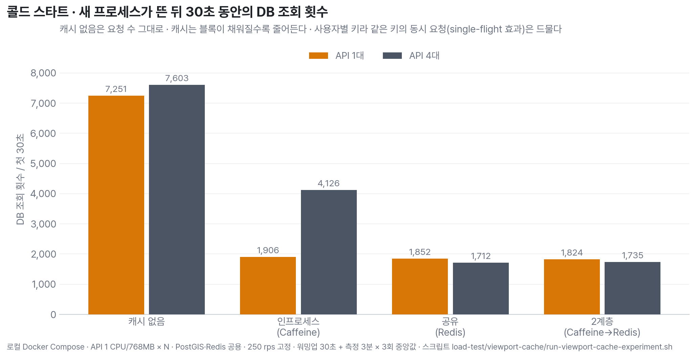

# 뷰포트 조회 캐시 전략 비교 — 캐시 없음 · Caffeine · Redis · 2계층

지도 홈의 최고 트래픽 경로인 뷰포트 점령 격자 조회(`GET /api/grids`)는 지금 캐시가 없다. MSG-134 는 "Redis 캐시(MSG-89)는 with/without 비교로 수치화한다"고 남겼고 MSG-89 는 착수되지 않았다. 이 실험이 그 비교다. 네 전략을 같은 코드에 스위치로 구현하고, 같은 부하(250 rps)를 API 1대와 4대에서 3분 × 3회씩 걸어 24회를 비교했다.

결론부터: **지금은 캐시를 넣지 않는다.** 캐시 없음의 p99 가 11~18ms 로 SLO(p95 300ms, MSG-134 D3)의 1/17 이고, 네 캐시는 DB 조회를 5분의 1로 줄이는 대신 p99 를 2.5~3배 늘린다. 그리고 다중 인스턴스에서는 인프로세스 캐시 단독이 기각된다 — 라운드로빈이 같은 사용자의 연속 요청을 흩어 적중률이 80% 에서 51% 로 떨어지고 꼬리는 캐시 없음보다 나빠진다. DB 가 병목이 되는 날 고를 것은 공유 캐시(Redis) 하나다. EDGE 가 같은 형식의 실험에서 Caffeine 을 고른 것과 반대 결론인데, 이유는 데이터 모양이다 — 종목 조회는 모든 사용자가 같은 키를 읽지만 도감 뷰포트는 사용자마다 키가 달라 인스턴스 사이에 나눠 쓸 것이 없다.

## 수치 (3회 중앙값)

| 전략 | API | 중앙값 | p95 | p99 | DB 조회 / 3분 | 콜드 30초 DB 조회 | 적중률 | 실패 |
|---|---:|---:|---:|---:|---:|---:|---:|---:|
| 캐시 없음 | 1 | 3.74 ms | 8.3 ms | 10.8 ms | 44,703 | 7,251 | — | 0% |
| Caffeine | 1 | 1.02 ms | 19.3 ms | 27.0 ms | 8,399 | 1,906 | 80.0% | 0% |
| Redis | 1 | 1.22 ms | 19.4 ms | 26.9 ms | 8,524 | 1,852 | 80.0% | 0% |
| Caffeine → Redis | 1 | 0.97 ms | 19.6 ms | 27.5 ms | 8,507 | 1,824 | 80.1% | 0% |
| 캐시 없음 | 4 | 5.56 ms | 11.2 ms | 18.1 ms | 44,618 | 7,603 | — | 0% |
| Caffeine | 4 | 6.24 ms | 29.6 ms | 57.3 ms | 21,718 | 4,126 | 50.7% | 0% |
| Redis | 4 | 1.96 ms | 22.5 ms | 35.1 ms | 8,469 | 1,712 | 80.6% | 0% |
| Caffeine → Redis | 4 | 1.85 ms | 23.2 ms | 52.4 ms | 8,230 | 1,735 | 80.9% (L1 59 · L2 22) | 0% |

요청은 회당 45,000건(3분), 응답당 격자 62개, 빈 응답 0%. 4대에서 캐시 없음의 중앙값이 1대보다 느린 것은 노트북 한 대에서 JVM 4개가 CPU 를 나눠 쓰기 때문이다 — 같은 조건에서의 상대 비교로만 읽는다.

## 실험에서 확인한 네 가지

1. **지연으로는 캐시가 이득이 아니다.** 중앙값은 3.7ms → 1.0ms 로 줄지만 p99 는 11ms → 27ms 로 는다. 캐시 단위가 요청 뷰포트가 아니라 6.4km 블록이라(이웃 팬이 항목을 나눠 쓰게 하려고) 미스 한 번이 뷰포트 조회 4배 크기의 범위를 읽는다. 적중 80% 의 빠른 응답과 미스 20% 의 느린 응답이 섞여 꼬리가 길어진다. 캐시 없음의 p99 11ms 는 이미 SLO 안쪽이라 줄일 것이 없다.
2. **DB 조회는 다섯 배 줄지만, 지금은 줄일 이유가 없다.** 3분 44,703회 → 8,400회. 250 rps 에서 DB 는 병목이 아니었다(캐시 없음 p95 8ms). 이 이득은 DB 가 병목이 되는 순간에만 값이 있다.
3. **다중 인스턴스에서 인프로세스 캐시는 기각.** 4대에서 적중률 51%, DB 조회 21,718회(캐시 없음의 절반뿐), p99 57ms(캐시 없음의 3배). 사용자별 키가 네 인스턴스에 각각 따로 채워지기 때문이다. 공유 캐시(Redis)만 4대에서도 80% 를 지켰다. 2계층은 Redis 단독과 DB 조회가 같고(8,230 대 8,469) 꼬리는 더 길다(p99 52ms 대 35ms) — L1 이 얹는 이득이 없다.
4. **콜드 스타트에 single-flight 이득이 없다.** EDGE 는 인프로세스 캐시가 같은 키의 동시 요청을 한 번의 적재로 합쳐 콜드 스타트 DB 피크를 막았다. 여기서는 키가 사용자별이라 같은 키에 동시 요청이 오는 일이 드물어 세 캐시의 첫 30초 DB 조회가 1,700~1,900회로 같았다.

## 무엇이 바뀌면 다시 잰다

- **DB 가 병목으로 잡힐 때** — 운영 관측에서 뷰포트 조회의 DB 시간 비중이 오르거나 DB CPU 가 피크에 60% 를 넘으면. 그때 선택은 **Redis 단독, TTL 30초, 블록 단위**다. 인프로세스 단독은 2대 이상에서 쓰지 않는다.
- **캐시 단위를 바꾸면 결과가 달라진다.** 블록(64칸)이 아니라 요청 범위 그대로를 키로 쓰면 미스 비용은 줄지만 적중은 재요청뿐이다. 팬 패턴(한 변의 35%씩 이동)이 실제 사용자와 다르면 적중률도 다르다 — 앱 로그의 실제 뷰포트 열을 시드로 다시 잰다.
- **stale 30초를 제품이 못 받아들이면** 캐시 자체가 무효다. 업로드 직후의 내 격자는 FE 낙관 색칠이 가리고 있다(MSG-134).

## 방법

- 코드: `fillmap.grid.viewport-cache.mode=none|local|redis|two-level` 스위치(`ViewportCacheProperties`), 구현 `grid/cache/ViewportCache`. 키 = (userId, 스냅 블록), 값 = 블록 안 내 점령 격자 전부, 페이지·커서 절단은 메모리. 응답은 캐시 없음과 글자 단위로 같다(정렬 키·keyset 판정 동일). Redis 장애는 캐시 없음으로 강등. 메트릭 `viewport_db_loads_total`, `viewport_cache_lookups_total{result}`.
- 환경: 로컬 Docker Compose(`load-test/viewport-cache/docker-compose.bench.yml`) — API 컨테이너 1 CPU/768MB × N 뒤에 nginx 라운드로빈, PostGIS·Redis 는 호스트 컨테이너 공용. Apple Silicon 노트북 한 대에 k6 까지 동거.
- 데이터: `seed-viewport-bench.sql` — 서울 상자 59,809칸 격자, 벤치 사용자 200명이 각각 3%(약 1,800칸) 점령. 격자 산술은 앱과 같은 EPSG:5179 100m floor.
- 부하: `k6/viewport-cache-benchmark.js` — VU 마다 사용자 한 명, 세션 = 임의 뷰포트(2~6km)에서 12번 팬(한 변의 35%), 250 rps constant-arrival-rate. 워밍업 30초 뒤 3분을 측정한다. 매 run 이 새 프로세스(콜드 스타트 포함)이고 1 CPU JVM 의 첫 몇 초 백로그가 p95 를 통째로 끌어올려서(150 rps 1분에서 med 4.9ms 인데 p95 814ms) 지연은 측정 위상만, 콜드 스타트는 서버 카운터 시계열로 본다.
- 임계점: 탐색 실행에서 1대는 400 rps 에서 무너지고(측정 위상 p95 3.1초, 버려진 iteration 1,060) 250 rps 는 정상이라 250 을 고정 부하로 잡았다. 4대도 같은 250 이다.
- 전체 자동화: `load-test/viewport-cache/run-viewport-cache-experiment.sh`. 요약 `load-test/results/viewport-cache-strategy.tsv`, 회차별 k6 요약과 1초 단위 카운터 `load-test/results/viewport-cache-runs/`.

## 한계

- 노트북 한 대. 4대 구성은 CPU 를 나눠 쓴 값이라 인스턴스를 늘렸는데 느려진 것처럼 보인다. 인스턴스 수의 효과는 절대값이 아니라 전략 간 차이(적중률·DB 조회)로만 읽어야 한다.
- 첫 실행에서 4대 구성의 캐시 3전략이 개발용 토큰 만료(1시간)로 실패율 100% 가 났다. 회차마다 토큰을 새로 받게 고치고 그 9회만 다시 돌렸다. 1대 12회와 캐시 없음 4대 3회는 첫 실행 값이다.
- Redis 장애 시나리오는 재지 않았다. 인증 필터가 요청마다 토큰 무효화 여부를 Redis 에 묻기 때문에 Redis 를 내리면 전략과 무관하게 전부 401 이 된다 — 캐시 장애가 아니라 인증 의존을 재는 실험이 된다.
- 팬 패턴과 점령 분포는 합성이다. 적중률 80% 는 이 패턴의 값이고, 실제 사용자는 더 좁게 머물면 높고 더 넓게 뛰면 낮다.
