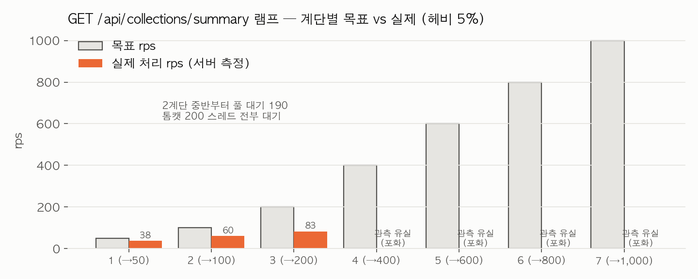
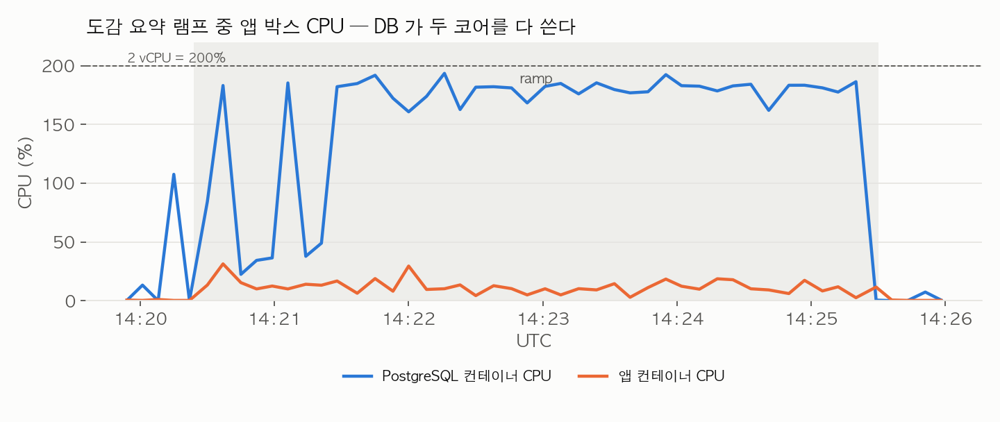

# 도감 요약 조회 부하 — t3.small 재실측

2026-09-29, MSG-609. MSG-596 에서 노트북으로 잰 `GET /api/collections/summary` 램프 부하를 dev 사양 임시 서버에서
다시 쟀다. 공통 조건은 [종합 문서](2026-09-29-cloud-load-test-t3small.md)에 있다. 로컬 회차 기록
(`docs/spec/MSG-596.md` "API 부하" 절)은 그대로 두었다.

## 결론

**t3.small 에서 이 API 는 헤비 사용자 5% 혼합 부하로 초당 60~80건에서 무너진다.** 노트북에서는 개선 후
1,000 rps 계단까지 통과했던 것이 같은 코드로 두 번째 계단(100 rps)에서 커넥션 풀 대기 190·톰캣 스레드 200 이
가득 찼고, 이후 계단은 전부 버려졌다. 원인은 헤비 사용자(격자 40만 개) 한 건이 DB CPU 를 0.4~0.5초 쓰는 것이다.
노트북에서 30ms 였던 그 요청이 여기서는 13배 느리고, 20건에 1건 섞이는 것만으로 DB 코어 두 개가 찬다.
5xx 는 0 이다.

## 로컬 회차와 무엇이 다른가

| 항목 | 로컬 (MSG-596, 2026-09-12~18) | 이번 (t3.small) |
|---|---|---|
| 배치 | 노트북 한 대 | 앱+DB 한 박스, k6 별도 박스 |
| 더미 | `bench-msg596.sql` keep=1 — 격자 61만, videos 135만, user_grids 52만 | 같은 스크립트 — 격자 **462,200**(벤치분) + 시드 18.6만, videos **1,471,000**, user_grids **862,684** |
| 벤치 사용자 | 보통 200명 + 규모 축 3명(최대 격자 40만) | 보통 100명 + 규모 축 4명(b596-0~3, 최대 격자 40만·영상 80만) |
| region_stats | 백필 스크립트로 채움 | 같음 (47,628행, 5.7초) |
| 부하 | ramping-arrival-rate 50→1,000 rps 7계단×40초, 헤비(b596-3) 5% | 같음 |
| 코드 | region_stats 로 바꾼 "after" | 같은 코드(develop `sha-ca51f34`) |

더미 적재는 t3.small 에서 10분 33초 걸렸다(격자 INSERT 157초, 영상 INSERT 68초, 내장 p50/p95 하네스가 나머지).
로컬 회차의 적재 시간은 기록에 없다.

## 결과

k6 요약 원본: `load-test/evidence/2026-09-29/collection-summary-ramp.summary.json`. 계단표(Prometheus 10초 창):
`collection-summary-ramp-stages.txt`. 앱 박스 자원: `app-box-samples.csv`.

**계단표** — 세 번째 계단부터는 앱이 Prometheus scrape 에도 응답을 못 해 빈칸이다.

| 계단 (목표 rps) | 실제 rps | p50 / p95 / p99 (서버 히스토그램) | Hikari 활성 / 대기 | 톰캣 busy | 비고 |
|---|---|---|---|---|---|
| 1 (50) | 38 | 400 / 545 / 1,000 ms | 4 / 0 | 5 | 이미 p95 가 0.5초. 헤비 1건이 0.4초라 그 뒤 요청이 밀린다 |
| 2 (→100) | 60 | 1,000 / 1,000 / 1,000 ms (히스토그램 상한) | **10 / 190** | **200** | 풀 10개 소진, 대기 190 = 톰캣 스레드 전부 |
| 3 (→200) | 83 | 〃 | 10 / 190 | 200 | 마지막 scrape |
| 4~7 (400→1,000) | — | — | — | — | scrape 유실. k6 쪽에서만 관측 |

**k6 전체(5분 6초)**: 요청 22,627건, 평균 73.9 rps, 버려진 iteration **84,470**, HTTP 실패 0, `summary_failed` 0.
지연 med 22.7초 / p95 26.4초 / p99 28.2초 — 포화 이후 대기열 값이라 계단 1의 서버 값(p95 545ms)과 함께 읽어야 한다.
k6 VU 는 1분 3초 시점(두 번째 계단 중반, 약 80 rps)부터 급증해 2분 4초에 상한 2,000 을 쳤다.

**앱 박스**: PostgreSQL 컨테이너 CPU 평균 **155%, 최대 193%**(2 vCPU 거의 전부), 앱 컨테이너 12~31%, load1 12.5,
PG 활성 세션 최대 14, 가용 메모리 최저 513MB. DB 가 두 코어를 다 쓰고 앱은 놀았다.

**서버 슬로우 로그(20ms 이상)**: 도감 요약 쿼리 **1,647회, 평균 1,390ms, 최대 3,825ms**. 한가할 때 헤비 사용자
단건은 0.37~0.50초(3회 curl), 보통 사용자는 20~40ms.

로컬 비교값(MSG-596): 개선 후 1,000 rps 계단까지 dropped 0·500 0·풀 대기 0, p50 1.6ms, 헤비 단건 약 30ms,
DB CPU 1.1코어. 개선 **전** 로컬은 50 rps 에서 p50 34초·풀 대기 190 으로 무너졌다 — 이번 t3.small 의 모양이
로컬의 "개선 전"과 같다.

## 왜 노트북 결과와 이렇게 다른가

- 헤비 사용자 요청의 남은 비용은 MSG-596 이 "다음 과제"로 남긴 부분이다: `totalGridCount`(user_grids 38만 행
  카운트)와 `SUM(video_count)`. 노트북에서 30ms 라 넘어갔는데, t3.small 에서는 같은 스캔이 400~500ms 다.
  이 차이는 인덱스나 계획이 아니라 코어당 처리 속도와 메모리 대역폭이다(shared_buffers 128MB 안에 다 못 들어가
  OS 캐시를 오간다).
- 5% 헤비 × 0.45초 = 요청당 평균 22ms 의 DB CPU. 코어 2개면 초당 약 90건이 산술 상한이고, 실제로는 풀 10개가
  헤비 요청에 잡히는 순간 보통 요청까지 뒤에 서서 60~80 rps 에서 무너진다.
- 로컬의 1,000 rps 통과는 "region_stats 가 방문 행정동 수 문제를 풀었다"는 증명이었지 "이 API 가 어떤 사양에서도
  1,000 rps 를 낸다"는 뜻이 아니었다. 사양을 바꾸니 다음 병목이 바로 드러났다.

## dev 서버에 대입하면

지금 dev 에는 격자 40만 개짜리 사용자가 없어서 이 붕괴가 안 보인다. 실사용자 분포에서 헤비 꼬리가 어디까지
갈지가 관건이다. 도감 요약은 도감 화면 진입마다 한 번 호출되므로 호출 빈도 자체는 낮다.

## 다음에 볼 것 (측정만, 코드 변경 없음)

1. `totalGridCount`·`totalVideoCount` 도 `region_stats` 의 `SUM(collected_count)` 처럼 미리 저장한 값을 읽는
   방향 — MSG-596 이 "다음 과제"로 적어 둔 그것이다. t3.small 측정으로 우선순위가 올라왔다.
2. 헤비 사용자 상한(격자 40만 개)이 현실적인지 — 100m 격자 40만 개는 4,000km² 라 실제로는 수천~수만 개가
   상한일 것이다. 규모 축 사용자를 1만·5만 개로 다시 두고 같은 램프를 돌리면 dev 에 맞는 숫자가 나온다.

## 원시 파일

| 파일 | 내용 |
|---|---|
| `load-test/evidence/2026-09-29/collection-summary-ramp.summary.json` | k6 요약 |
| `collection-summary-ramp-stages.txt` | 계단표 (Prometheus) |
| `collection-summary-smoke.summary.json` | 백필 전 스모크 (참고용 — visitedRegionCount 0 상태) |
| `seed596.log` | 더미 적재 로그와 내장 p50/p95 하네스 결과 (SQL 단위: 40만 격자 사용자 p50 3.8초) |
| `pg-slow-queries-20ms.txt` | 서버 슬로우 로그 집계 |
