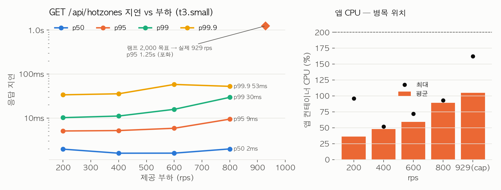

# 핫구역 조회 부하 — t3.small 재실측

2026-09-29, MSG-609. MSG-321 에서 노트북으로 잰 `GET /api/hotzones` 부하를 dev 사양 임시 서버에서 다시 쟀다.
공통 조건은 [종합 문서](2026-09-29-cloud-load-test-t3small.md)에 있다. 로컬 회차의 분석
(`docs/explainers/MSG-321-troubleshoot.md`)은 그대로 두었고, 이 문서는 같은 시나리오의 클라우드 값이다.

## 결론

**t3.small 에서 핫구역 조회는 초당 800건까지 실패·유실 없이 p95 9.5ms 로 처리한다.** 상한은 약 930 rps 이고,
그 위에서는 응답이 1초 안팎으로 밀리지만 5xx 는 한 건도 없다. 병목은 앱 JVM 의 CPU(직렬화·HTTP)이지
Redis 나 DB 가 아니다. 노트북에서 2,000 rps 를 버티던 API 가 t3.small 에서는 그 절반 조금 못 미치는 곳에서
멈춘다. 뷰포트 조회(약 90 rps)와 비교하면 열 배 넘게 여유가 있다.

## 로컬 회차와 무엇이 다른가

| 항목 | 로컬 (MSG-321, 2026-08-06) | 이번 (t3.small) |
|---|---|---|
| 배치 | 노트북 한 대(bootRun + redis:7-alpine + k6) | 앱+Redis 한 박스(t3.small), k6 별도 박스 |
| Redis 시드 | `seed-hotzone.sh` 좌표 표본 10만 → 고유 격자 46,697 (구 인코딩) | `seed-dev-data.sh` 의 최근 46시간 영상 6만 건에서 파생. 버킷 9개, 버킷당 1,273~2,569 격자(5179 인코딩) |
| 시드 분포 | 서울 도심 상자에 균등 | 전국 16개 도심 반경 약 500m 에 집중(서울 가중치 최대) |
| k6 뷰포트 | 서울 37.45~37.65 × 126.85~127.15 랜덤 | 같음 — 시드가 도심에 몰려 있어 **응답의 92%가 빈 뷰포트** |
| 시나리오 | expiry 200 rps 3분, cap 100→2,000 rps(2,000 을 60초 유지) | 같음 + scale 400/600/800 rps 각 45초 추가 |

빈 응답 92%는 지연 측정에 영향이 없다. 이 API 는 뷰포트와 무관하게 Redis 버킷을 합산해 전국 상위 50개를
구한 뒤 뷰포트로 거르므로, 비용은 합산·캐시 단계에 있고 필터는 마지막 한 줄이다. 로컬 회차도 같은
구조였다. 다만 `hotzone_empty_rate` 임계가 깨져 k6 종료 코드는 99 였다.

## 결과

k6 요약 원본: `load-test/evidence/2026-09-29/hotzone-*.summary.json`.

| 시나리오 | 목표 | 처리량 | 지연 med / p95 / p99 / p99.9 / max | 버려진 요청 | 앱 박스 |
|---|---|---|---|---|---|
| expiry (3분 고정) | 200 rps | 200 rps (36,001건) | 2.0 / 5.1 / 10.2 / 33.7 / 84 ms | 0 | api 36%(순간 96%), pg 4% |
| scale | 400 rps | 400 rps | 1.6 / 5.2 / 11.1 / 35.6 / 72 ms | 0 | api 48% |
| scale | 600 rps | 600 rps | 1.6 / 5.9 / 15.8 / 58.1 / 87 ms | 0 | api 59%(최대 72%) |
| scale | 800 rps | 800 rps | 2.0 / 9.5 / 29.6 / 52.5 / 89 ms | 0 | api **89%(최대 93%)** |
| cap (100→2,000, 2,000 을 60초) | 2,000 rps | **929 rps** (176,583건) | 875 / 1,246 / 1,326 / 1,375 / 1,476 ms | 37,416 | api 105%(최대 162%), load1 30.6, pg 12% |

로컬 비교값(MSG-321): 2,000 rps 60초 유지 실패 0%, 중앙값 1.77ms, p99 3.37ms. 만료 위상 p99.9 20~90ms.

- HTTP 실패는 모든 회차에서 0 이다. 상한을 넘겨도 죽지 않고 대기열이 늘어난다.
- 중앙값은 로컬과 같은 급(1.6~2.0ms vs 1.77ms)이다. **Redis 합산 자체는 사양을 안 탄다.** 차이는
  꼬리와 상한에서 난다. p99 가 로컬 3.4ms → 여기 10~30ms, 상한이 2,000+ → 약 930 rps.
- 만료 위상의 꼬리(p99.9 33~58ms, max 72~89ms)는 로컬에서 본 것과 같은 모양이다. 30초 캐시가 만료되는
  순간 재계산이 요청 하나를 잡고 나머지는 그 뒤에 선다(로컬 분석의 head-of-line 결론 그대로).
  t3.small 에서는 재계산 한 번이 더 오래 걸려 꼬리가 더 길다.
- cap 회차에서 앱 컨테이너 CPU 가 162%(2 vCPU 의 81%)까지 올랐고 load average 30 을 찍었다. Redis 는
  1% 남짓, PostgreSQL 은 행정동 이름 조회로 12%. **앱 JVM 이 요청을 받아 JSON 을 만드는 일이 코어를 다 쓴다.**
- 처리량 800 rps 에서 앱 CPU 89% 였으니 무릎은 그 바로 위다. cap 의 929 rps 는 대기열이 쌓이며 낸 평균이라
  "지속 가능한" 값은 800 rps 로 읽는다.

## dev 서버에 대입하면

dev 박스는 같은 사양에 AI·Kafka·워커가 동거해 앱에 남는 CPU 가 더 적다. 그래도 지도 홈의 핫구역 칩은
사용자당 몇 초에 한 번 호출되는 API 라, 동시 사용자 수백 명까지 이 경로는 문제가 안 된다. 같은 화면에서
같이 호출되는 뷰포트 조회가 열 배 먼저 막힌다.

## 다음에 볼 것 (측정만, 코드 변경 없음)

1. 만료 위상 꼬리는 로컬 분석이 제안한 "재계산을 요청 경로에서 분리"(MSG-89 보고서의 조건과 같은 방향)
   로만 줄어든다. t3.small 에서는 그 필요가 더 분명해졌지만 지금 트래픽에서는 급하지 않다.
2. 규모 감도(고유 격자 5만 → 10만 → 100만)는 이번에 안 돌렸다. MSG-89 로컬 스윕이 10만 개부터 p99 100ms 를
   봤는데 t3.small 에서는 그 임계가 더 낮을 것이다. 시드 규모를 키우려면 `seed-dev-data.sh` 의 핫 영상
   수를 올리면 된다(현재 6만).

## 원시 파일

| 파일 | 내용 |
|---|---|
| `load-test/evidence/2026-09-29/hotzone-expiry-200rps.summary.json` | 200 rps 3분 |
| `hotzone-scale-{400,600,800}rps.summary.json` | 고정 도착률 45초 |
| `hotzone-cap.summary.json` | 100→2,000 rps 램프 |
| `app-box-samples.csv` · `timeline.log` | 앱 박스 5초 샘플 · 회차 시각 |
