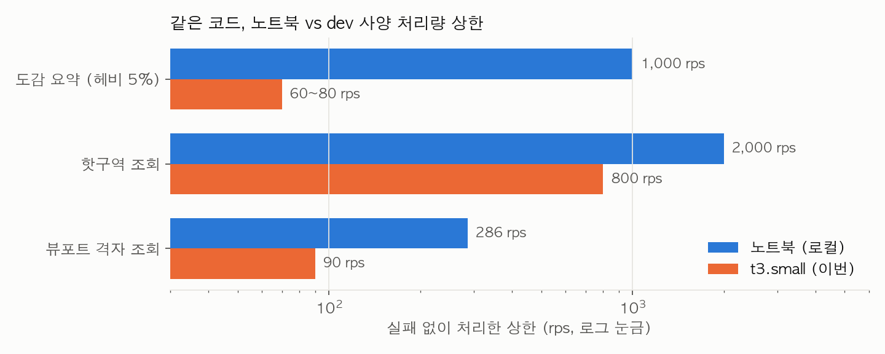

# 클라우드 부하테스트 — dev 사양(t3.small) 재실측 종합

2026-09-29, MSG-609. 지금까지의 HTTP 부하테스트는 전부 개발자 노트북 한 대에서 앱·DB·부하 발생기를
같이 띄우고 돌린 것이라(전수 조사는 아래 "이전 측정" 표) 실제 서버 사양에서의 한계를 몰랐다. 같은 VPC에
dev 서버와 같은 사양(t3.small)의 임시 앱 서버와 부하 발생기 서버를 띄워 같은 시나리오를 다시 쟀다.
**기존 로컬 보고서는 지우지 않았다.** 이 문서는 인프라·방법·비용·요약이고, 시나리오별 상세는 아래
보고서 3편에 있다.

- [뷰포트 격자 조회](2026-09-29-cloud-viewport-benchmark.md) — MSG-73/128 로컬 벤치의 클라우드판
- [핫구역 조회](2026-09-29-cloud-hotzone-benchmark.md) — MSG-321 로컬 벤치의 클라우드판
- [도감 요약 조회](2026-09-29-cloud-collection-summary-benchmark.md) — MSG-596 로컬 벤치의 클라우드판
- [핫구역 저장 구조 4단 비교](2026-09-29-hotzone-storage-evolution.md) — DB 집계 → 버킷 없는 Redis → 6h 버킷 → 캐시, 같은 날 로컬 격리 컨테이너에서 추가 실측 (설계 근거 검증용)
- [영상 인코딩 규모 회차](2026-09-30-video-pipeline-scaling.md) — dev 1노드 vs 2노드 × 동시 3·6·12건 (2026-09-30)
- [알림 발송 구조 3단 비교](2026-09-30-notification-dispatch-comparison.md) — 동기 / DB 폴링 / outbox+Kafka, 로컬 격리 컨테이너 (2026-09-30)

## 한 줄 결론

**세 API 모두 5xx 없이 버텼지만, 상한은 노트북 값의 1/2에서 1/12 이다.** 병목이 API 마다 다르다.

| API | 로컬 상한 | t3.small 상한 | 배율 | 병목 |
|---|---|---|---|---|
| 뷰포트 격자 조회 | 약 286 rps (40 VU p95 96ms) | **약 90 rps** (40 VU p95 651ms) | 1/3, 지연 6.7배 | PostgreSQL CPU 1코어 — 첫 페이지 쿼리 11ms/건 |
| 핫구역 조회 | 2,000 rps 유지 (p99 3.4ms) | **800 rps** 유지 (p95 9.5ms), 무릎 약 930 rps | 1/2.5 | 앱 JVM CPU — Redis 는 1% |
| 도감 요약 (헤비 5%) | 1,000 rps 통과 | **60~80 rps 에서 붕괴** | 1/12 이상 | PostgreSQL CPU 2코어 — 헤비 사용자 1건 0.45초 |



t3.small 은 dev 와 같은 unlimited 크레딧 모드였고, 벤치 중 CPU 크레딧 잔고는 0 이었다(초과분 31.7 크레딧 과금).
dev 도 같은 모드라 이 숫자는 dev 에 그대로 대입해도 낙관적이지 않다. 다만 dev 에는 AI 컨테이너·Kafka·워커가 같이
살아 여유 CPU 가 더 적다. prod 는 앱과 DB(RDS db.t4g.micro)가 분리돼 있어 별도 측정이 필요하다.

## 이전 측정 (전부 로컬)

| 티켓 | 대상 | 로컬 결과 | 로컬 시드 |
|---|---|---|---|
| MSG-73/128 (7/14~16) | `GET /api/grids` 뷰포트, k6 40~100 VU, 300 rps | 40 VU p95 96ms, 약 286 rps | 격자 114,192 |
| MSG-321 (8/6) | `GET /api/hotzones`, 200 rps 3분 + 2,000 rps 60초 | 2,000 rps 실패 0%, p99 3.4ms | 고유 격자 46,697 |
| MSG-596 (9/12~18) | `GET /api/collections/summary`, 50→1,000 rps 7계단 | 개선 후 1,000 rps 통과, p50 1.6ms | 격자 61만, 영상 135만 |

셋 다 Apple Silicon 노트북에서 앱·DB·k6가 한 기계에 있었다. dev 서버(t3.small, 2 vCPU 버스트, 2GB)와는
CPU·메모리·디스크가 다 다르다. dev 에서 실제로 잰 것은 영상 인코딩 E2E(MSG-494)와 EXPLAIN 몇 건뿐이다.

## 인프라

| 역할 | 인스턴스 | 구성 | 근거 |
|---|---|---|---|
| 앱 (`fillmap-bench-app`) | t3.small, 2 vCPU · 2GB · swap 2GB · gp3 30GB, 사설 10.0.1.106 | Docker: 앱(ECR `develop` = `sha-ca51f34`) + PostGIS 16 + Redis 7. dev 박스와 같은 배치(한 박스에 전부) | `load-test/bench-ec2/ud-app.sh`, `docker-compose.bench-app.yml`, `bench.env` |
| 부하 발생기 (`fillmap-bench-load`) | t3.medium, 2 vCPU · 4GB, 사설 10.0.1.151 | k6 v2.3.0 + `monitoring/` 스택(Prometheus 5초 scrape·Grafana·postgres-exporter) | `ud-load.sh`, `run-phase1.sh`, `run-phase2.sh` |
| 네트워크 | 같은 서브넷(10.0.1.0/24, 2a), SG `fillmap-bench-sg` | 부하는 사설 IP로만. 22·3000·9090만 성민 IP에 개방 | 인터넷 RTT가 섞이지 않는다(MSG-597의 노트북→dev 측정과 다른 점) |

dev 와 같게 둔 것: 이미지·프로파일(`dev`)·인스턴스 타입·swap·DB/Redis 동거. **dev 와 다르게 둔 것**: SQL 로그와
앱 DEBUG 로그를 INFO 로 내림(dev 도 SQL 로그는 꺼져 있다), 부트 워밍업 off(워밍업 사용자 id 가 시드에 없음),
AI·알림·CloudFront off, Kafka 미기동. 부하 대상 API 셋은 이 중 어느 것도 경로에서 쓰지 않는다.

## 데이터

| 테이블·키 | 건수 | 방법 |
|---|---|---|
| regions | 3,558 | dev DB `pg_dump -t regions` 그대로 |
| users | 501 | `seed-dev-data.sh 300000 60000 500` + 벤치 사용자 1명(dev 소셜 로그인 모의로 생성) |
| grids | 186,390 | 위 시드 (EPSG:5179 인코딩, V28 함수 재사용) |
| videos | 360,000 | 일반 30만(90일 분산) + 핫 6만(최근 46시간, 도심 반경 약 500m) |
| user_grids | 419,000 | 시드 356,838 + 벤치 사용자 62,134(격자의 1/3, `(y+x)%3=0`) |
| Redis `hotzone:*` | 버킷 9개, 버킷당 1,273~2,569 격자 | 시드가 최근 48시간 영상에서 파생 |
| MSG-596 더미 (2단계에서 추가) | 사용자 104, 격자 +462,200, videos 합계 1,471,000, user_grids 합계 862,684, region_stats 47,628 | `scripts/bench-msg596.sql` keep=1 (10분 33초) + `bench-msg596-region-stats-backfill.sql` |

로컬 회차와 규모가 같지 않다. 시드 크기는 t3.small 의 2GB 메모리와 적재 시간을 보고 정했고, 표마다
로컬 값을 나란히 적어 비교가 어디까지 성립하는지 밝혔다.

## 방법

- 부하는 부하 발생기 박스에서 `run-phase1.sh`(뷰포트 s1·s3·s4, 핫구역 expiry·cap) → `run-phase2.sh`
  (뷰포트 s1 재실행, 도감 요약 ramp) 순서로 회차 사이 60초 휴지.
- k6 요약은 `--summary-export` JSON 으로 남기고(`load-test/evidence/2026-09-29/`), 앱 박스는 5초 샘플러
  (`app-sampler.sh`: loadavg·컨테이너 CPU/메모리·PG 활성 세션·가용 메모리)로 같은 시간축을 남겼다.
- Prometheus 도 5초로 긁었지만 **포화 구간에서는 scrape 가 빠진다**(앱이 응답을 못 해서). 포화 구간 판정은
  샘플러 CSV 를 정본으로 썼다.
- `viewport-ab-benchmark.js` 의 응답 체크가 옛 응답 형태(`body` 배열)를 보고 있어 현재 계약(`data.grids`)으로
  고쳤다. 첫 s1·s3 회차는 고치기 전에 돌아 체크 실패율이 100%로 찍혔지만 HTTP 는 전부 200 이었고 지연
  수치는 유효하다. `strategy=A|B` 파라미터는 현재 컨트롤러에 없어 두 시나리오가 같은 쿼리를 두 번 재는
  반복 측정이 됐다.

## 비용

실측 시간 13:26~14:28 UTC(약 1시간 1분). 서울 리전 온디맨드 단가 기준, 세금 제외.

| 항목 | 계산 | 금액 |
|---|---|---|
| 앱 t3.small | $0.026/h × 1.02h | $0.03 |
| 부하기 t3.medium | $0.052/h × 1.02h | $0.05 |
| CPU 초과 크레딧 (앱, unlimited) | 31.7 크레딧 = 0.53 vCPU·h × $0.05 | $0.03 |
| gp3 50GB | $0.0912/GB·월 × 50GB × 1h | $0.01 |
| 데이터 전송 | 부하는 전부 사설망(무료). dev → 노트북 regions 덤프 24MB | $0.00 |
| **합계** | | **약 $0.12** |

사전 추산(하루 $5 미만)보다 훨씬 적었다. 시간이 아니라 크레딧이 변수였는데, 1시간 내내 코어를 두들겨도 30센트를
안 넘는다. 도감 요약 더미 적재 10분이 가장 긴 구간이었고, 그것도 t3.small 위에서 돌린 값이다.

## 정리

인스턴스 2대는 14:28 UTC 에 **중지(stop)** 했다 — 종료가 아니라서 EBS 50GB(월 약 $4.6)만 남고, 같은 시드로
다시 재려면 시작만 하면 된다. 다시 쓸 일이 없으면 아래로 완전히 지운다(런북 `load-test/bench-ec2/README.md` 5단계).

```bash
AWS_PROFILE=soma aws ec2 terminate-instances --instance-ids i-0f5a36e4d3ab52e9b i-056d11d9323b982d7
AWS_PROFILE=soma aws ec2 wait instance-terminated --instance-ids i-0f5a36e4d3ab52e9b i-056d11d9323b982d7
AWS_PROFILE=soma aws ec2 delete-security-group --group-id sg-0b8e4157bdc3b5350
```

dev·prod 서버·DB·Redis 는 이번 작업에서 읽기(regions pg_dump)만 했고 아무것도 바꾸지 않았다.

## 범위 밖으로 남긴 것

- **MSG-89 뷰포트 캐시 4전략 비교** — 미머지 브랜치(`feature/perf-cache-experiment`) 코드가 필요하다. 이번 뷰포트
  측정이 그 브랜치의 "캐시 없음" 기준선에 해당한다(로컬 1대 400 rps 붕괴 ↔ t3.small 90 rps).
- **MSG-585 fetch 3방식 비교** — k6 스크립트가 레포에 없다.
- **MSG-583 알림 기록 중 조회** — 부하기가 앱 JVM 안에 있는 방식이라 HTTP 부하가 아니다.
- **MSG-494 인코딩 E2E** — 이미 dev 에서 잰 것이라 대상이 아니었다.
