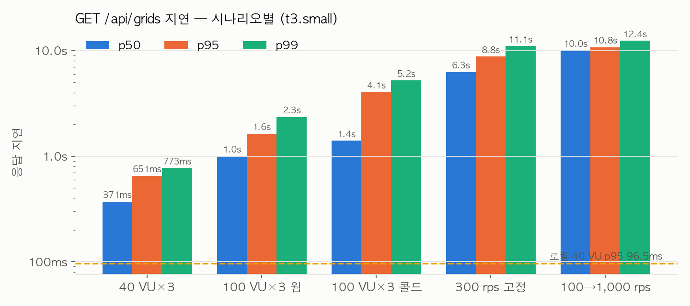
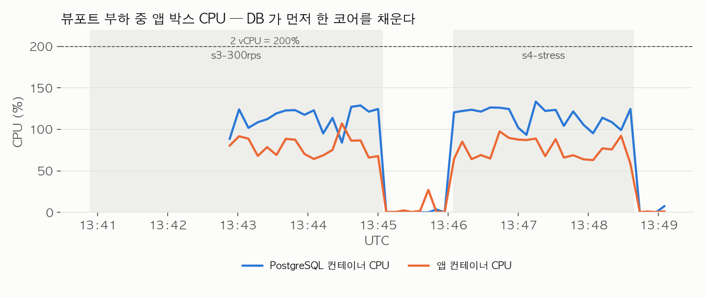

# 뷰포트 격자 조회 부하 — t3.small 재실측

2026-09-29, MSG-609. MSG-73/128 에서 노트북으로 잰 `GET /api/grids`(내 점령 격자 뷰포트 조회) 부하를
dev 사양 임시 서버에서 다시 쟀다. 인프라·데이터·방법의 공통 조건은
[종합 문서](2026-09-29-cloud-load-test-t3small.md)에 있고 여기에는 이 API 의 결과만 적는다.
로컬 회차 기록은 `docs/spec/MSG-90.md`·`MSG-128.md`·`MSG-134.md` 작업 로그에 그대로 남아 있다.

## 결론

**t3.small 에서 이 API 는 초당 약 90건이 한계다.** 그 이상을 넣으면 요청이 버려지고 응답이 10초를 넘는다.
동시 사용자 40명(닫힌 루프)에서 p95 651ms 로, 노트북의 96.5ms 보다 6.7배 느리다. 병목은 DB 다.
첫 페이지 쿼리 하나가 한가할 때 11ms 인데 CPU 1코어를 다 쓰고, 40명이 겹치면 평균 97ms 까지 늘어난다.
앱 JVM 이 아니라 PostgreSQL 컨테이너가 먼저 100%를 넘는다.

## 로컬 회차와 무엇이 다른가

| 항목 | 로컬 (MSG-73/128, 2026-07) | 이번 (t3.small) |
|---|---|---|
| 앱·DB·k6 배치 | 노트북 한 대 | 앱+DB 한 박스(t3.small), k6 는 별도 박스(t3.medium), 사설망 |
| 격자 인코딩 | 위경도 등간격(구 규칙) | EPSG:5179 100m (MSG-347 이후) |
| grids / 벤치 사용자 점령 | 114,192 / 약 1/3 | 186,390 / 62,134 (1/3, `(y+x)%3=0`) |
| 응답 | 격자 배열(구 계약, `body`) | 페이지 응답(`data.grids`, 커서), 격자마다 zoneName·zoneCell·regionName 동봉(MSG-341/349) |
| 쿼리 전략 | A(정수 범위) vs B(GiST) 비교 | 현재 코드는 A 하나. `strategy` 파라미터는 무시되어 두 시나리오가 같은 쿼리의 반복 측정 |
| 뷰포트 | 서울 37.42~37.70 × 126.76~127.18, 한 변 0.02~0.075° 랜덤 | 같음 (k6 스크립트 불변) |

k6 스크립트의 응답 체크가 구 계약(`body` 배열)을 보고 있어 현재 계약으로 고쳤다(`load-test/k6/viewport-ab-benchmark.js`).
고치기 전에 돈 s1·s3·s4 는 `viewport_failed` 가 100%로 찍혔지만 HTTP 는 전부 200 이었고(Prometheus
`http_server_requests` 로 확인) 지연 값은 그대로 쓴다.

## 결과

k6 요약 원본: `load-test/evidence/2026-09-29/viewport-*.summary.json`. 앱 박스 자원은 `app-box-samples.csv`.

| 시나리오 | 부하 | 처리량 | 지연 med / p95 / p99 | 버려진 요청 | 앱 박스 |
|---|---|---|---|---|---|
| s1 (40 VU × 3회) | 닫힌 루프 40명 | 240건 | 371 / 651 / 773 ms | 0 | 짧아서 샘플 없음 |
| s1 (100 VU × 3회, 콜드) | 닫힌 루프 100명 | 300건이 8.5초 → 약 35 rps | 1,401 / 4,053 / 5,230 ms | 0 | 〃 |
| s1 (100 VU × 3회, 웜) | 〃 | 〃 | 1,000 / 1,631 / 2,345 ms | 0 | 〃 |
| s3 (300 rps 고정, 2분×2) | 열린 루프 | **88 rps** | 6,267 / 8,782 / 11,085 ms | 49,934 (목표의 69%) | api 79%·pg **114%(최대 129%)**, load1 12.9, PG 활성 11 |
| s4 (100→1,000 rps) | 열린 루프 | **98 rps** | 10,045 / 10,772 / 12,365 ms | 44,901 | api 76%·pg 116%, load1 12.3 |

로컬 비교값(MSG-90 작업 로그): 40 VU 에서 전략 A p95 96.5ms, 약 286 rps. s4 무릎은 로컬에서 기록되지 않았다.





위 CPU 그래프는 앱 박스 5초 샘플러(`app-box-samples.csv`)다. 샘플러를 s3 시작 2분 뒤에 붙여 s3 앞부분은 비어 있다.
그래프 사이의 빈 구간은 회차 사이 60초 휴지다.

- HTTP 실패는 모든 회차에서 0 이다. 서버는 죽지 않고 느려지기만 했다.
- 300 rps 를 넣어도 88 rps 만 처리했고 k6 VU 600개가 전부 대기 상태로 붙었다. 1,000 rps 스트레스에서도
  98 rps 로 상한이 같다. **약 90 rps 가 이 사양의 처리량 상한**이다.
- 100 VU 첫 회차(콜드) p95 4.05초가 웜 회차에서 1.63초로 내려왔다. 첫 회차는 OS 페이지 캐시·JIT 가
  덜 데워진 상태였다. 지표는 웜 값을 기준으로 읽는다.
- 메모리는 문제가 아니었다. 가용 메모리 최저 443MB, swap 사용 6MB 로 끝까지 변동이 없었다.

## 병목: 쿼리 한 건이 CPU 를 11ms 쓴다

첫 페이지 쿼리(`GridRepository.findOccupiedPage`, `user_grids ⋈ grids ⋈ regions` 범위 조회)를 한가할 때
EXPLAIN 하면 이렇다(`load-test/evidence/2026-09-29/explain-viewport.txt`):

```text
Limit (actual time=11.013..11.060 rows=411)  Buffers: shared hit=6020
  -> Sort (quicksort 79kB)
     -> Nested Loop Left Join regions (rows=411)
        -> Nested Loop (rows=411)
           -> Bitmap Heap Scan on grids  Recheck (grid_y, grid_x 범위)  rows=1221  Heap Blocks: 1094
              -> Bitmap Index Scan on uq_grids_yx
           -> Index Only Scan user_grids_pkey (user_id, grid_id)  loops=1221  Heap Fetches: 0
Execution Time: 11.214 ms
```

- 계획은 건전하다(인덱스만 탄다, 힙 페치 0, 전부 shared hit). 그냥 **뷰포트 안 격자 1,221칸을 훑고
  칸마다 user_grids 를 1,221번 찍는 일 자체가 11ms 어치 CPU** 다. 디스크 I/O 는 없다.
- 노트북 코어 하나가 이 일을 2~3ms 에 끝내던 것을 t3.small 의 버스트 vCPU 는 11ms 에 끝낸다.
  CPU 1개가 초당 90건 남짓이고, PostgreSQL 이 실제로 코어 하나를 꽉 채웠다(pg_cpu 114~129%).
- 40 VU 회차 동안 `log_min_duration_statement=20ms` 로 잡은 서버 로그: **같은 쿼리 206회, 평균 97.3ms,
  최대 614.6ms.** 커넥션 풀 10개가 전부 이 쿼리로 차서(PG 활성 세션 최대 11) 나머지 요청은 풀 앞에서 기다린다.
- 앱 쪽은 결과 행마다 구역 이름을 메모리에서 계산하고 JSON 으로 직렬화하는 정도라(`toViews`), 앱 컨테이너
  CPU 76~79%는 DB 를 기다리며 요청을 받는 톰캣·직렬화 몫이다. 앱만 떼어 놓아도 이 API 는 빨라지지 않는다.

## dev 서버에 대입하면

dev 박스는 이 벤치 박스와 같은 t3.small 인데 AI 컨테이너·Kafka·인코딩 워커·관측 스크레이프가 같이 산다
(가용 메모리 약 480MB). 이 숫자보다 나쁘면 나빴지 좋을 수 없다. 현재 FE 개발 트래픽(초당 수 건)에서는
문제가 안 보이지만, 지도 홈을 동시에 여는 사용자가 수십 명만 돼도 뷰포트 응답이 초 단위로 밀린다.

## 다음에 볼 것 (이 문서는 측정만, 코드는 안 고쳤다)

1. **쿼리 방향 뒤집기 검토** — 지금은 `grids` 범위 1,221칸을 먼저 훑고 `user_grids` 를 찍는다. 점령률이
   낮은 일반 사용자(전체 격자의 1/3 이 아니라 1% 이하)라면 `user_grids(user_id)` 에서 시작해 범위를
   거르는 편이 훨씬 싸다. 플래너가 벤치 사용자(1/3 점령)에서 이 계획을 고른 건 합리적이지만, 실제 사용자
   분포에서 어떤 계획이 나오는지 실사용 규모의 사용자로 다시 EXPLAIN 해야 한다.
2. **prod 는 RDS db.t4g.micro** — 앱과 DB 가 CPU 를 나눠 쓰지 않는 대신 DB 코어가 Graviton 2 vCPU 하나
   급이다. 같은 벤치를 prod 구성(EC2 + RDS)으로 한 번 더 돌려야 이 문서의 90 rps 가 prod 에도 맞는지 안다.
3. 응답 크기(격자 400칸 ≈ 54KB)와 페이지 크기(501)는 이번 병목이 아니었다. 전송 시간(`http_req_receiving`)
   p95 는 49ms 로 대기 시간(4,030ms)에 비하면 무시할 만하다.

## 원시 파일

| 파일 | 내용 |
|---|---|
| `load-test/evidence/2026-09-29/viewport-s1.summary.json` | 100 VU 콜드 (체크 수정 전) |
| `viewport-s1-rerun.summary.json` · `viewport-s1-40vu.summary.json` | 100 VU 웜 · 40 VU (체크 수정 후) |
| `viewport-s3-300rps.summary.json` · `viewport-s4-stress.summary.json` | 300 rps 고정 · 100→1,000 rps |
| `explain-viewport.txt` | 첫 페이지 쿼리 EXPLAIN (ANALYZE, BUFFERS) |
| `app-box-samples.csv` · `timeline.log` | 앱 박스 5초 샘플 · 회차 시각 |
