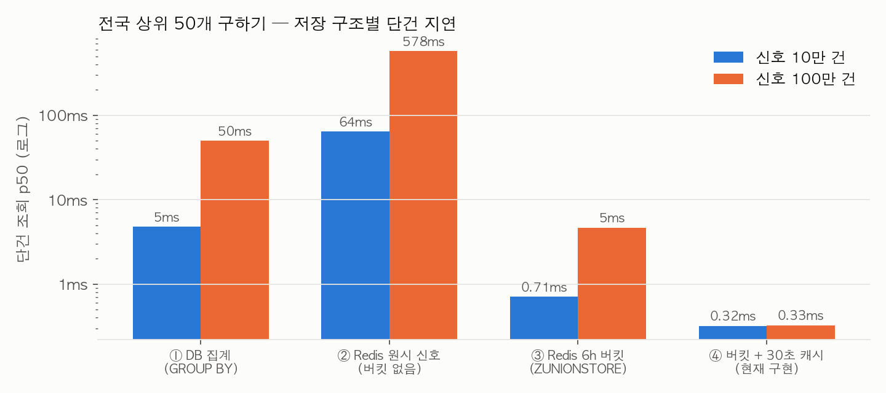
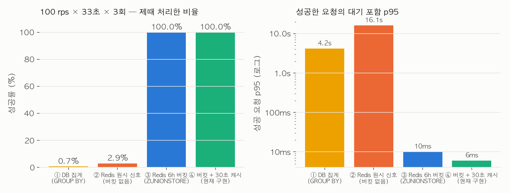
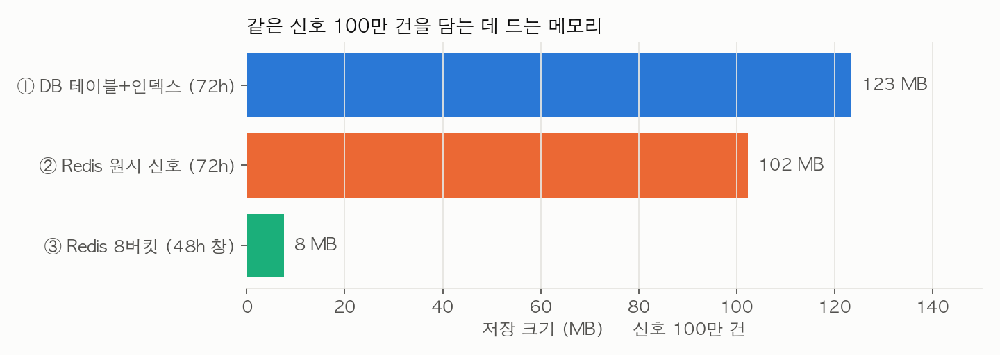

# 핫구역 저장 구조 4단 비교 — DB 집계 → Redis 원시 신호 → 6시간 버킷 → 버킷 + 캐시

2026-09-29, MSG-609. "최근 48시간 업로드가 많은 격자 상위 50개"를 구하는 저장 구조를 네 단계로 놓고 같은 데이터로
쟀다. **실제 코드는 처음부터 ③ 버킷(MSG-233 설계, MSG-183 구현)이었다.** 이 문서는 "그때 왜 그 선택이었나"를
사후에 실측으로 확인한 기록이지 구현을 바꿔 온 이력이 아니다. 2026-09-17 대안 비교(`2026-09-17-hotzone-alternatives.md`)에
없던 ②(버킷 없는 Redis)를 이번에 추가했다.

## 결론

| 단계 | 구조 | 단건 지연 (신호 100만) | 100 rps 에서 | 메모리 (신호 100만) | 다음 단계로 넘어가는 이유 |
|---|---|---|---|---|---|
| ① DB 집계 | `signals` 테이블, `GROUP BY grid_id` + 커버링 인덱스 | 49.6ms | **0.7% 성공** (2초 타임아웃 749건, 용량 초과 9,079건) | 123MB | 요청마다 100만 행 중 66만 행을 다시 센다. 코어 하나가 초당 20건 |
| ② Redis 원시 신호 | Sorted Set 1개, 신호 1건 = 멤버 1개(score=시각), 앱에서 집계 | **578ms** | **2.9% 성공** | 102MB | DB 보다 12배 느리다. 창 안 66만 멤버를 매번 앱으로 끌어와 센다 |
| ③ Redis 6h 버킷 | 버킷마다 Sorted Set(격자→누적), 조회는 8키 `ZUNIONSTORE` | 4.7ms | **100%**, p95 10ms | **7.6MB** | 쓰기 때 미리 격자별로 합쳐 두니 조회는 키 8개 합산이면 끝. 그래도 매 요청 합산 |
| ④ 버킷 + 30초 캐시 | ③ + 합산 결과 `hotzone:top` 30초 (현재 구현) | 0.33ms | **100%**, p95 6ms | 7.6MB + 상위 50 | 폴링 부하를 캐시가 흡수. 남는 문제는 만료 순간 꼬리(MSG-321) |

**"Redis 를 쓰면 빠르다"가 아니다. ②가 증명한다 — 저장소를 바꿔도 집계를 조회 시점에 하면 DB 보다 느리다.**
빠른 건 "쓰기 때 미리 합치고 시간을 버킷으로 잘라 둔 것"이고, Redis 는 그 구조(원자적 `ZINCRBY`·`ZUNIONSTORE`·키 TTL)를
싸게 주는 도구다. 같은 구조를 DB 에 만들면(`hot_scores(bucket, grid_id, score)` 테이블 + UPSERT) 비슷한 조회 속도가
나오지만, 업로드마다 UPSERT 한 줄과 오래된 버킷 삭제 배치가 붙는다 — 09-17 보고서가 "DB 도 30초 캐시와 락을 붙이면
100 rps 를 버틴다"고 적은 그 지점이다.

## 조건

09-17 실험과 같은 하네스(`load-test/hotzone-comparison.py`)에 비교군 하나를 더했다.

| 항목 | 값 |
|---|---|
| 기계 | Apple M5 노트북. PostgreSQL 16 전용 컨테이너 1 CPU/1GiB, Redis 7 전용 컨테이너 1 CPU/512MiB, 부하 발생기는 같은 노트북 |
| 데이터 | 고정 난수 183. 최근 72시간 업로드 신호 10만 건(격자 1천) / 100만 건(격자 1만). 신호 20%는 100개 격자에 집중 |
| 기준 시각 | 2026-09-17 03:00 UTC 고정. ①②는 정확한 48시간, ③④는 6h 버킷 8개(45시간) |
| 정확성 | 네 구조의 상위 50개를 Python 원본 집계와 대조해 일치 확인(②는 ①과 같은 48시간 창, `assert` 로 시드 직후 검증) |
| 부하 | 100 rps × 33초 × 3회, 실행 스레드 16·동시 상한 32, 넘치면 `dropped_capacity`. DB 쿼리 제한 2초 |
| 순서 | 회차마다 정방향·역방향·순환으로 바꿔 순서 편향을 줄임 |

②의 구현: `ZADD compare:naive:events {id}:{grid} ts` 로 신호를 그대로 쌓고, 조회는 `ZRANGEBYSCORE now-48h now` 로 창 안
멤버를 받아 앱에서 격자별로 센다. Lua 로 서버 안에서 세도 O(창 안 신호 수)인 건 같다 — 옮기는 비용만 줄지 세는 비용은
그대로다. 오래된 신호 삭제는 `ZREMRANGEBYSCORE` 배치가 따로 필요하다(③은 키 TTL 이 대신한다).

## 단계별로 무엇이 막혔나

**① DB 집계.** 계획은 건전하다(커버링 인덱스 Index Only Scan). 그냥 일이 많다 — 요청 하나가 창 안 66만 행을 읽어
집계한다. 단건 49.6ms 면 코어 하나로 초당 20건이 상한이고, 100 rps 를 넣으니 3,300건 중 24건만 제때 끝났다.
DB CPU 는 3회 합계 36.7초(거의 100%). 09-17 보고서의 "30초 캐시 + 단일 재계산 락"을 붙이면 100 rps 를 버티지만,
그건 ④와 같은 캐시 전략을 DB 앞에 둔 것이다.

**② Redis 원시 신호.** "Redis 는 메모리라 빠르겠지"의 반례. 창 안 66만 멤버를 네트워크로 옮겨(약 20MB) 앱이 센다.
578ms — DB 보다 12배 느리고, 100 rps 에서 3,300건 중 96건만 처리했다. 메모리도 102MB 로 DB 테이블과 같은 급이다.
신호 하나를 멤버 하나로 들고 있기 때문이다. 이 단계가 말해 주는 건 저장소가 아니라 **집계 시점**이 문제라는 것이다.

**③ 6시간 버킷.** 쓰기 때 `ZINCRBY hotzone:{bucket} 1 {grid}` 로 격자별 누적을 미리 만들어 두고, 조회는 최근 8개
버킷을 `ZUNIONSTORE` 한다. 창 안 신호 수와 무관하게 "활성 격자 수 × 8" 만큼만 일한다 — 1만 격자에서 4.7ms.
메모리는 신호 100만 건이 7.6MB 다(격자당 8개 슬롯). 버킷 폭 6h 는 48h 창을 8키로 덮는 타협이고(3h 면 16키, 1h 면 48키),
창 판정은 TTL 이 아니라 "최근 8버킷 선택"이 맡아서 TTL(54h)은 청소 전용이다. 이게 MSG-233 D2·D4 의 내용이다.
남는 비용은 요청마다 합산을 다시 한다는 것 — 100 rps 에서 Redis CPU 15.1초(3회 합계), 폴링이 늘면 그대로 는다.

**④ 버킷 + 30초 캐시.** 합산 결과를 `hotzone:top` 에 30초 두고, 없을 때만 Lua 한 번으로 재계산+캐시를 원자적으로 한다.
Redis CPU 가 15.1초 → 0.69초로 22분의 1, p95 6ms. 이것이 현재 코드다. 여기서 새로 생기는 문제가 "30초마다 한 번 오는
재계산 뒤에 요청들이 줄을 선다"이고(MSG-321 에서 p99.9 튐으로 발견), 같은 부하기 안에서 잰 만료 구간(29~32초) p99 는
6.6ms 라 이 규모에서는 안 보인다. 격자 10만 개부터 보인다(MSG-89 스윕).

## 이 문서를 포트폴리오에 쓸 때

이력 순서가 아니라 **설계 근거의 순서**로 써야 맞다. "처음엔 DB 로 했다가 느려서 Redis 로 바꿨다"는 레포 어디에도
없다(2026-09-17 보고서 첫 줄이 이를 명시). 맞는 문장은 이렇다: "48시간 창의 상위 K 는 집계를 조회 시점에 하면
저장소와 무관하게 무너진다는 걸 알고(①②) 쓰기 시점 버킷 누적(③)으로 설계했고, 폴링 부하는 30초 캐시(④)로 흡수했다.
나중에 DB 비교군과 버킷 없는 Redis 비교군을 만들어 그 판단을 숫자로 확인했다." 이어지는 이야기는 MSG-321(만료 순간
head-of-line)·MSG-330(포화 시 폐기 로그 170배 비용)·MSG-609(dev 사양에서 800 rps, 병목은 앱 CPU)다.

## 원시 파일

`load-test/evidence/2026-09-29/hotzone-story/` — `scale-*.json`(시드·정확성·단건 지연·메모리·EXPLAIN), `load-*.json(.gz)`
(요청 단위 원시 기록), `summary.json`, `writes.json`(쓰기 비용: SQL INSERT p50 1.4ms, Redis ZINCRBY, 둘 다), `accuracy.json`
(버킷 근사 vs 정확 48h 창의 순위 차이). 재현은 `hotzone-comparison.py --modes sql,redis_naive,redis,redis_cache`,
그래프는 `load-test/bench-ec2/hotzone-story-charts.py`.
