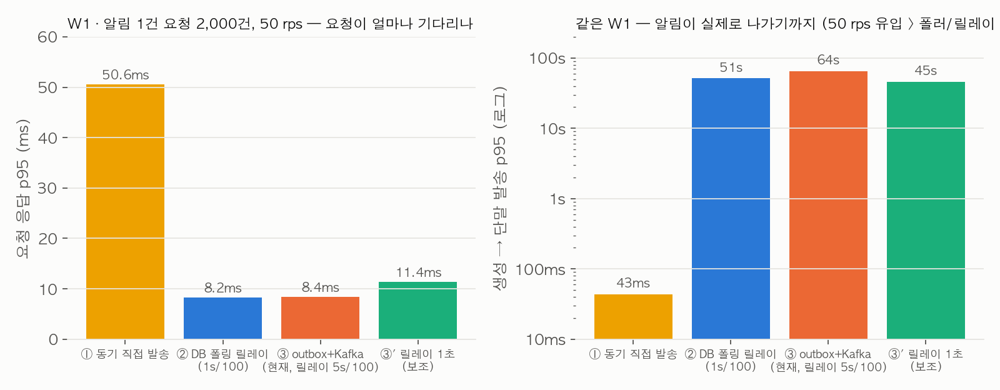
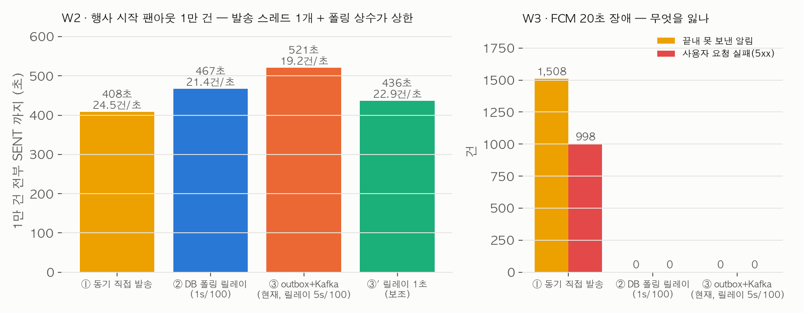
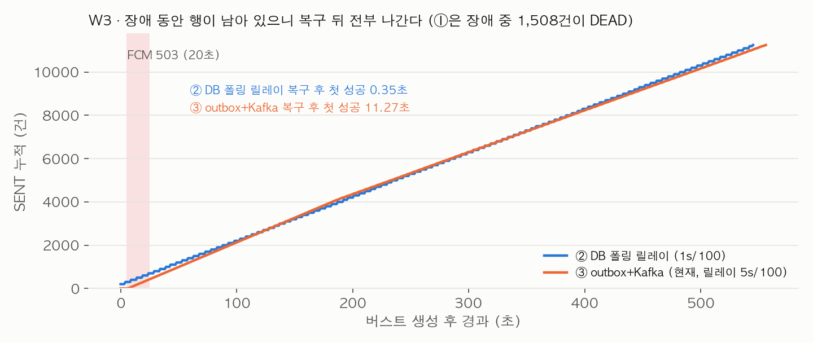

# 알림 발송 구조 3단 비교 — 동기 직접 발송 → DB 폴링 릴레이 → outbox + Kafka + 컨슈머

2026-09-30, MSG-609. "알림을 만든 요청이 어떻게 사용자 단말까지 가는가"의 구조를 세 가지로 놓고 같은 조건에서
쟀다. **실제 코드는 처음부터 ③ outbox → 릴레이 → Kafka → 컨슈머 → FCM 이었다** (MSG-179 설계 2026-08-03,
카테고리 5종 종결 2026-08-05). 이 문서는 "그때 왜 그 선택이었나"를 사후에 실측으로 확인한 기록이지 구현을 바꿔 온
이력이 아니다. 선례는 핫구역 저장 구조 4단 비교(`2026-09-29-hotzone-storage-evolution.md`)다.

한 가지를 먼저 적어 둔다. 알림 PRD(`docs/prd/notification-prd.md` 5.1)는 스스로 이렇게 썼다 — outbox 를 둔 이유는
이중 쓰기 문제 하나이고, **"Kafka 는 필요해서가 아니라 배우려고 넣었고" "발송량 자체는 DB 폴링과 직접 발송으로
충분한 규모"** 이며 "Kafka 를 넣어도 outbox 는 뺄 수 없다"는 조건부 승인이었다. 이번 실측은 그 판단을 뒤집지
않는다. 오히려 어느 부분이 outbox 의 몫이고 어느 부분이 Kafka 의 몫인지를 숫자로 가른다.

## 결론

| 단계 | 구조 | W1 요청 p95 (50 rps) | W1 생성→발송 p95 | W2 버스트 1만 건 소화 | W3 FCM 20초 장애 — 유실 / 요청 실패 / 복구 후 첫 성공 | 중복 (W4 크래시 창) | 운영 부담 |
|---|---|---|---|---|---|---|---|
| ① 동기 직접 발송 | 요청 안에서 FCM 호출 후 응답 | **50.6ms** (처리 47ms — FCM 30ms 를 요청이 기다린다) | 43ms | 408초 — 요청 하나가 6.8분간 응답 못 함. 간섭 요청 p95 50.5ms | **1,508건 유실 / 998건 요청 실패** / 즉시(다음 호출) — 대신 장애 중 건은 전부 DEAD | 1건 (클라이언트 재시도 시. 재시도 없으면 유실 1건) | 없음 — 표 하나. 대신 외부 지연·장애가 곧 API 지연·장애 |
| ② DB 폴링 릴레이 | 행만 넣고 응답, 폴러 1s/100건 `FOR UPDATE SKIP LOCKED` | **8.2ms** | 51.2초 (유입 50/s > 폴러 21/s 라 밀림) | 467초 (21건/초). 간섭 p95 9.5ms | **0 / 0** / 0.35초 | 1건 | 폴러 1개. 유휴 폴링은 30초에 커밋 32회·DB CPU 0.06초로 무시할 수준. 수평 확장은 `SKIP LOCKED` 에 의존 |
| ③ outbox + Kafka (현재 구현) | 행만 넣고 응답, 릴레이 5s/100건 → Kafka → 컨슈머 | **8.4ms** | 64.3초 (유입 50/s > 릴레이 20/s 라 밀림) | 521초 (19건/초). 간섭 p95 9.6ms | **0 / 0** / 11.3초 | 1건 (종결 후 재전달은 0건 재발송) | 브로커 1대(힙 256MB) + 릴레이 + 컨슈머. Kafka CPU 는 W1 3.7초(유휴 0.5초) |
| ③' 릴레이 1초 (보조) | ③에서 릴레이 주기만 1s | 11.4ms | 45.4초 (컨슈머 25건/초가 다음 상한) | 436초 (23건/초). 간섭 p95 14.0ms | 안 쟀다 | 안 쟀다 | ③과 같음 |

**요청 지연을 가르는 것은 "요청 안에서 FCM 을 기다리느냐"이지 Kafka 가 아니다.** ②와 ③의 요청 p95 는 8ms 대로
같고(둘 다 INSERT 한 문장 + 커밋), ①만 50ms 다 — FCM 스텁 지연 30ms 가 그대로 얹힌다. 장애 격리도 같다. FCM 이
20초 죽었을 때 ①은 1,508건을 잃고 요청 998건이 실패하지만 ②③은 0건이다 — 행이 남아 있고 재시도가 있기 때문이다.
이 두 성질은 **outbox(먼저 적는다)의 몫**이고, ②도 갖고 있다.

**처리량은 세 구조 다 "FCM 30ms 직렬"과 "폴링 상수"에 묶였다.** 발송 스레드가 하나라(①은 요청 스레드, ②는 폴러,
③은 파티션 1개의 컨슈머) 알림 하나에 FCM 30ms + DB 문장 5개 ≈ 40ms, 초당 25건 안팎이 어떤 구조든 상한이다. 그 위에
폴러 주기·배치가 덮인다 — ②는 1s/100건이라 실측 21건/초, ③은 코드 상수 5s/100건이라 **20건/초**. 그래서 50 rps 로
2,000건을 넣은 W1 에서 생성→발송 p95 가 ② 51초·③ 64초까지 밀렸고, 1만 건 버스트도 ① 408초 · ② 467초 · ③ 521초가
걸렸다(정상 구간 처리량 24.6 · 21.3 · 19.3건/초). 이건 Kafka 가 느린 게 아니라 릴레이 상수의 결과다 — ③'(릴레이 1초)
에서 버스트가 521초 → 436초, 정상 처리량이 19.3 → 22.7건/초가 됐다. 그 다음 상한은 컨슈머 하나의 FCM 직렬(약 25건/초)
이라 50 rps 유입의 W1 e2e p95 는 45초로 여전히 밀렸다 — 여기서부터는 파티션(= 컨슈머 병렬) 수의 문제다. 지금
서비스의 알림 발생률(사용자 액션 직결·희소)에서는 문제가 아니지만, 행사 시작 팬아웃처럼 1만 건이 한 번에 생기는
경로가 이미 있으므로(MSG-583) **이 상수가 첫 번째 튜닝 지점**이다.

## 조건

| 항목 | 값 |
|---|---|
| 기계 | Apple M5 노트북. PostgreSQL 16.14 전용 컨테이너 1 CPU/1GiB(`fillmap-notif-compare-pg`, 127.0.0.1:15439), Kafka 3.9.1 KRaft 단일 노드 1 CPU/1GiB·힙 256MB(`fillmap-notif-compare-kafka`, 127.0.0.1:19092). dev·prod·기존 fillmap-* 컨테이너는 건드리지 않았다 |
| 하네스 | `load-test/notification-comparison.py` — Python 3.13, psycopg 3.3.6, confluent-kafka 2.15.1(librdkafka 2.15.1). 요청 핸들러·폴러·릴레이·컨슈머를 Python 으로 모사했고 **Spring 앱은 띄우지 않았다.** HTTP·JSON·JPA 오버헤드가 없으니 절대값보다 구조 간 차이를 봐야 한다 |
| FCM | 하네스 안 스텁 HTTP 서버(별도 프로세스). 호출당 30ms 지연, `/control` 로 503 장애 창 주입, id 별 성공 횟수로 중복 집계 |
| 앱 상수 | 소스에서 파싱해 assert — 릴레이 `poll-interval-ms 5000`·`batch-size 100`·`stale-published-minutes 30`(`application.yml`), 컨슈머 백오프 초기 1s·배수 2·최대 128s·재시도 8회(합 255s), `max.poll.records 10`, 토픽 파티션 1(`NotificationConfig.java`). ②의 폴링 1s/100건은 코드에 없는 값(과제 조건)이고 재시도 상수는 컨슈머와 같은 값을 썼다 |
| 스키마 | `V21__notifications.sql` 사본(users FK 만 제외, `uq_notifications_user_event`·partial index 그대로). ②에만 `next_attempt_at` 컬럼을 더했다 — 폴링 방식이면 필요한 컬럼이고 V21 에는 없다 |
| 컨슈머 처리 순서 | `NotificationConsumer.consume` 축자 — 행 조회 → 종결 상태면 즉시 종료 → `retry_count+1` → 수신거부 조회 → 토큰 조회 → FCM → `markSent`(`status IN ('PENDING','PUBLISHED')` CAS). 세 구조 모두 같은 발송 단계를 밟는다(①은 요청 안에서, ②는 폴러가, ③은 컨슈머가) |
| 데이터 | 사용자 20,000명(토큰 1개씩). 1~10,000 은 행사 회차 1 구독자(W2·W3 버스트 대상), 10,001~ 은 W1 형 요청 대상 |
| 워크로드 | W1: 알림 1건 요청 2,000건을 50 rps 로, 3회. W2: `INSERT SELECT` 한 문장으로 1만 건 생성 + 직후 10초간 50 rps 요청(간섭), 1회. W3: W2 와 같되 5초 시점에 FCM 20초 503 + 25초간 50 rps 요청, 1회. W4: FCM 성공 직후·SENT 전 워커 사망 → 재기동, 20건, 3회. 유휴 30초 |
| 회차 | W1·W4 는 3회에 순서를 회차마다 바꿨다(정방향·역방향·순환). W2·W3 는 회차당 7~10분이라 1회로 잘랐다(조정자 지시). 회차 상한 600초, 넘으면 미완료로 표기 |
| 정확성 | 워크로드마다 대차 검증 assert — 생성 = SENT + SKIPPED + DEAD, `(user_id, event_key)` 중복 0, SENT 행은 전부 FCM 스텁에 성공 기록이 있음. 전부 통과 |

## 단계별로 무엇이 막혔나

**① 동기 직접 발송.** 가장 단순하다 — 표 하나, 워커 없음. 값은 정직하다: 요청 p50 45.9ms·p95 50.6ms 중 30ms 가
FCM 대기다. 문제는 지연이 아니라 결합이다. W3 에서 FCM 이 20초 죽자 그 사이 들어온 요청 998건이
그대로 실패했고(사용자에게 5xx), 버스트 안에서 그 창에 걸린 510건은 DEAD 로 남아 아무도 다시 보내지 않는다 —
재시도를 붙이면 요청이 더 오래 묶인다. 크래시 창(W4)도 다르게 나타난다: FCM 성공 직후 죽으면 행은
PENDING 인 채고, 클라이언트가 같은 요청을 다시 보내야 중복 1건으로 끝나지 안 보내면 유실 1건이다. 즉 ①에서 재시도
책임은 클라이언트에 있다. 이게 PRD 5.1 이 말한 이중 쓰기 문제의 실측 모습이다. 1만 건 팬아웃은 요청 하나가
408초 동안 응답을 못 한다(스레드 풀로 나누면 벽시계는 줄지만 결합은 그대로다).

**② DB 폴링 릴레이.** 요청은 8.2ms 에 끝나고(INSERT 한 문장), 장애 20초는 `next_attempt_at` 백오프로 흡수돼 유실
0·요청 실패 0 이다. **outbox 의 이득 대부분은 여기서 이미 나온다.** 남는 문제는 셋이다. (1) 폴링 주기가 곧 지연
하한이고 배치가 곧 처리량 상한이다 — 1s/100건이면 실측 21건/초라 50 rps 유입에서 밀렸다(e2e p95 51초). 주기를 줄이면
유휴 폴링 비용이 늘고(30초에 커밋 32회는 1s 주기의 값), 배치를 키우면 트랜잭션 하나가 FCM 호출 100번을 안은 채
잠금을 쥔다 — 이번 구현이 그 형태라 배치당 약 4초 동안 100행이 잠겨 있었다. (2) 수평 확장이 `FOR UPDATE SKIP LOCKED`
에 걸린다. 지금 앱은 단일 인스턴스라 릴레이가 클레임 잠금을 안 쓰는데(`NotificationRelay` 주석), 폴러를 늘리는 순간
잠금 경합과 배치 크기 튜닝이 DB 쪽 문제가 된다. (3) 재생이 없다 — 처리 이력이 행 상태뿐이라 "어제 발행분을 다시
흘려 보자"가 안 된다. 이 규모의 FillMap 에서는 셋 다 아직 안 아프다. PRD 가 "DB 폴링으로 충분한 규모"라고 쓴 게
맞다.

**③ outbox + Kafka + 컨슈머 (현재 구현).** 요청은 ②와 같은 8.4ms 다. 장애 창의 동작이 ②와 다르다: 컨슈머는
실패한 레코드 자리에서 백오프 sleep(1→2→4→8→16초)을 하므로 **파티션 전체가 멈춘다**(head-of-line). W3 에서 FCM
거절 횟수가 ②보다 훨씬 적은 이유가 이것이고(5회 vs ② 400회), 복구 뒤 첫 성공까지 11.3초가 걸린 이유도
이것이다(1+2+4+8+16초 백오프가 장애 종료 시각을 지나치면 남은 sleep 을 다 잔다). ②는 행별로 `next_attempt_at` 이
달라 장애 중에도 다른 행을 계속 시도한다. 버스트에서는 릴레이 상수 5s/100건이 20건/초 상한을 만들어 ②보다
느렸다(521초 vs 467초). Kafka 가 실제로 주는 것은 이번 워크로드 밖에 있다 — 발행분이 브로커에 남아 컨슈머를 죽였다 살려도 이어 받고(W4: 오프셋 미커밋분 재전달 →
중복 1건, 종결 행은 `terminal_replay_blocked` 로 0건 재발송), 컨슈머 그룹을 새로 붙여 재생할 수 있으며, 파티션을
늘리면 컨슈머 병렬화가 DB 잠금 없이 된다. DB 쪽 비용도 하나 적어 둔다: 컨슈머가 단계별 개별 트랜잭션
(`TransactionTemplate`, retry_count 가 롤백되지 않게 — D4)이라 1만 건 버스트에 커밋 65,641회가 났고, 배치 100건을
트랜잭션 하나로 묶은 ②는 2,527회였다(① 44,113회). PostgreSQL CPU 는 ① 23.9초 · ② 17.1초 · ③ 27.8초. 이 규모에선
1 CPU 컨테이너가 남아돌지만 커밋 수는 알림당 6.5회라 발생률이 오르면 먼저 보이는 지표다. 대가는 브로커 운영
(dev·prod 공유 1대, 힙 256MB, 보존기간·디스크),
at-least-once 중복(FR-NOTI-03 이 선언한 성질), 릴레이·컨슈머 두 구성요소, 그리고 이번에 잰 릴레이 상수의 처리량
상한이다.

**④ 컨슈머 병렬 2개는 빼놓았다.** 토픽 파티션이 1개라(`NotificationConfig.notificationTopic`, "단일 컨슈머·저처리량,
순서 보장 부수 획득") 두 번째 컨슈머는 파티션을 못 받고 유휴다. 잰다면 파티션 수를 바꾸는 실험이지 컨슈머 수
실험이 아니며, 그건 코드 상수를 바꾸는 일이라 이번 범위 밖으로 뒀다.

**W4 크래시 창은 세 구조 모두 중복 1건이다.** "외부 성공 직후·상태 기록 전에 죽으면 한 번 더 나간다"는 구조가 아니라
외부 호출과 DB 커밋을 한 트랜잭션에 못 묶는 데서 오는 성질이라 어느 구조도 못 피한다. Java 쪽 검증
(`load-test/tx-workload/NotificationCrashWindowTest.java`, 실제 DB 트리거로 첫 `markSent` 만 실패시킴)도 같은 값이다 —
`send_then_db deliveries=2 rows=1 final=SENT terminal_replay=0`, `kafka_then_db records=2 deliveries=1`
(`load-test/evidence/2026-09-17/faults-final.txt`). 차이는 재시도 주체다: ①은 클라이언트, ②는 폴러(트랜잭션 롤백으로
잠금 해제 후 재선택), ③은 브로커(오프셋 미커밋 재전달).

## 트레이드오프

| | ① 동기 직접 발송 | ② DB 폴링 릴레이 | ③ outbox + Kafka |
|---|---|---|---|
| 요청이 외부에 묶이나 | 예 — FCM 지연·장애 = API 지연·장애 | 아니오 | 아니오 |
| 커밋된 사건의 알림 유실 | 있음 (커밋 후 호출 전 사망, FCM 장애) | 없음 (행이 남고 재시도) | 없음 (행이 남고 재시도) |
| 재시도 책임 | 클라이언트 | 폴러 + `next_attempt_at` 컬럼 | 컨슈머 에러 핸들러 + 브로커 재전달 |
| 장애 중 다른 건 처리 | 해당 없음 | 계속됨 (행별 백오프) | 멈춤 (파티션 head-of-line) |
| 처리량 상한 | 요청 스레드 수 | 폴링 주기·배치 + `SKIP LOCKED` 경합 | 릴레이 주기·배치 (지금 20건/초), 파티션 수 |
| 수평 확장 | 앱 인스턴스만 | 폴러 늘리면 DB 잠금 경합 | 파티션 늘리면 브로커가 분배 |
| 재생·감사 | 없음 | 행 상태만 | 브로커 로그 + 행 상태 |
| 중복 | 크래시 창 1건 (클라이언트 재시도 시) | 크래시 창 1건 | 크래시 창 1건 + 재전달·리밸런스 (종결 가드가 재발송은 막음) |
| 운영 부담 | 없음 | 폴러 1개, 유휴 폴링 비용 | 브로커 1대 + 릴레이 + 컨슈머, 토픽·그룹·보존기간 |
| 필요한 스키마 | 상태 컬럼 | 상태 + `next_attempt_at` | 상태 + `published_at` (스테일 PUBLISHED 복구) |

## 클라이언트 전달 축 — 이번에 안 쟀다

위 세 구조는 서버 안의 "발송 구조" 축이다. 서버에서 단말로 어떻게 미느냐(전달 축)는 별개이고, 이번 실측 대상이
아니다. 코드는 FCM 웹푸시 하나다(`FcmNotificationSender`, `WebpushConfig`). PRD 5.1 이 적었듯 **FCM 과 SSE 는 정식으로
비교된 적이 없고** MSG-178 의 전제를 승계한 선택이다. 정성 비교만 남긴다.

| | FCM 웹푸시 (현재) | SSE | 롱폴링 | 웹소켓 |
|---|---|---|---|---|
| 앱이 닫혀 있을 때 | 도착 (서비스 워커·OS 알림) | 불가 | 불가 | 불가 |
| OS 알림 센터 표시 | 됨 (`tag` 로 같은 알림 교체) | 앱이 Notification API 를 따로 호출 | 같음 | 같음 |
| 서버 연결 유지 비용 | 없음 (푸시 서비스가 유지) | 사용자당 연결 1개 상시 | 요청 반복 | 사용자당 연결 1개 상시 |
| 전달 보장 | 푸시 서비스 큐(TTL), 서버는 발송 성공만 앎 | 연결 끊기면 그 사이 유실 — 재접속 시 재조회 필요 | 같음 | 같음 |
| 외부 의존 | Google (토큰 수명·무효화 규칙) | 없음 | 없음 | 없음 |
| 지금 코드에서 쓰는 곳 | 모든 알림 | 없음 | 없음 | 없음 |

FCM 을 고른 실질적 이유는 첫 줄이다 — "앱을 닫은 사용자를 부르는 것"이 알림의 목적이라 연결 기반 방식은 애초에
후보가 못 된다. 앱이 열려 있을 때의 즉시성이 필요해지면 SSE 를 **더하는** 것이지 FCM 을 대체하는 게 아니다.

## 이 문서를 포트폴리오에 쓸 때

이력 순서가 아니라 **설계 근거의 순서**로 써야 맞다. "처음엔 동기 발송/폴링으로 했다가 Kafka 로 바꿨다"는 문장은
레포 어디에도 없고 사실이 아니다 — 첫 스펙(MSG-179)이 이미 outbox + Kafka 였다. 맞는 문장은 이렇다:

"알림은 커밋과 외부 호출을 한 트랜잭션에 못 묶는다는 것(이중 쓰기)을 알고 처음부터 outbox 로 설계했다. 요청 지연과
장애 격리를 가르는 건 outbox 이지 Kafka 가 아니라는 걸 나중에 비교 하네스로 확인했다(동기 발송 p95 50ms·장애 20초에
1,508건 유실 vs outbox 8ms·유실 0, DB 폴링도 같은 값). Kafka 는 그 위에 재생과 파티션 병렬화를 얹으려고
넣은 것이고 PRD 에 학습 목적이라고 명시했다. 비교하면서 지금 구현의 처리량 상한이 브로커가 아니라 릴레이 상수
(5초/100건 = 20건/초)라는 것도 찾았다."

같이 쓸 수 있는 인접 숫자: 행사 시작 팬아웃의 기록 단계를 사용자별 반복 INSERT 에서 `INSERT SELECT` 한 문장으로 바꿔
1만 명 기록 중앙값 12.54초 → 0.173초(MSG-583, `docs/audit/2026-09-17-performance-verification.md`) — 이번 실측의
버스트 생성이 48~63ms로 끝나는 게 그 결과다. 크래시 창 중복은 `NotificationCrashWindowTest` 가 Java 로,
이번 하네스가 Python 으로 같은 1건을 냈다.

쓰면 안 되는 문장: "exactly-once", "중복 0"(FR-NOTI-03 이 명시적으로 at-least-once 다), "Kafka 라서 빠르다"(요청
p95 는 ②와 같고 버스트는 ②보다 느렸다), "폴링에서 Kafka 로 전환".

## 원시 파일

`load-test/evidence/2026-09-30/notification-story/` — `metadata.json`(컨테이너·라이브러리·git sha·소스 sha256·파싱한
상수·실행 인자, 실행을 나눠 돌린 만큼 `runs` 배열), `idle-{mode}.json`, `w1-{mode}-{r}.json`(+ `.jsonl.gz` 요청 단위
원시 기록), `w2-{mode}-0.json`·`w3-{mode}-0.json`(초 단위 상태 타임라인 포함), `w4-{mode}-{r}.json`, `summary.json`
(그래프용 수치 — 모드별 W1 백분위·e2e·CPU·커밋 수, W2·W3 소화 시간·처리량·간섭 p95·타임라인, W3 유실·실패·복구,
W4 중복). 재현은 `notification-comparison.py --workloads idle,w1,w4 --rounds 3` 뒤
`--workloads w2,w3`(W2·W3 는 기본 1회·600초 상한), 보조 비교군은 `--modes outbox_kafka_1s --workloads w1,w2 --rounds 1`,
마지막에 `--modes sync,db_poll,outbox_kafka,outbox_kafka_1s --summarize-only`.
venv 는 `psycopg[binary] confluent-kafka` 만 있으면 된다. 컨테이너 2개는 재현용으로 stop 상태로 남겨 뒀다(삭제 안 함).
