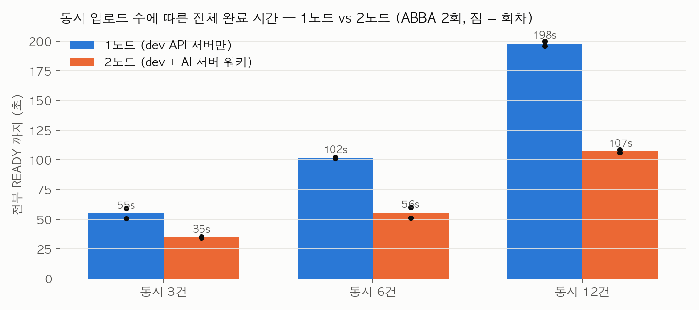
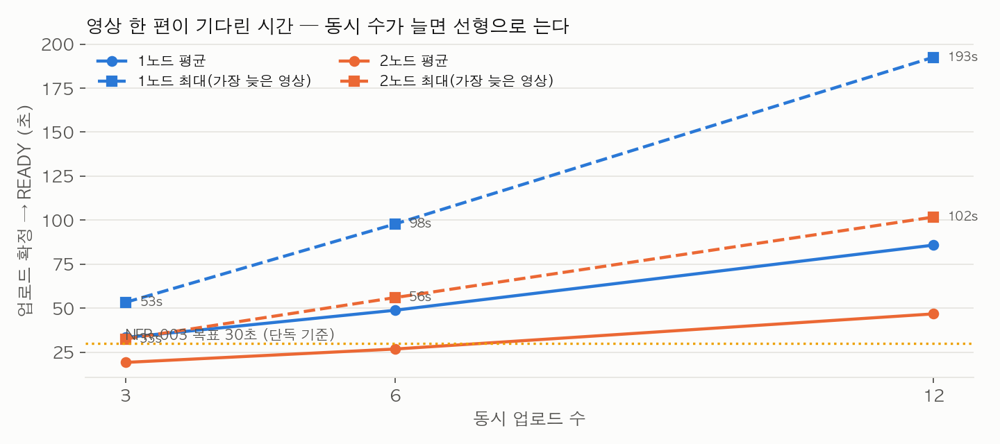

# 영상 인코딩 파이프라인 — 1노드 vs 2노드, 동시 3·6·12건 규모 회차

2026-09-30, MSG-609. 2026-09-17 성능 검증(`docs/audit/2026-09-17-performance-verification.md`)이 동시 3·6건에서
확인한 "DB 작업 선점으로 두 서버에 인코딩 분산" 효과를 동시 12건까지 넓혀 다시 쟀다. 목적은 두 가지다.
① 동시 건수가 늘 때 완료 시간이 어떻게 느는지(선형인지, 어디서 꺾이는지) ② 2노드의 이득이 규모에서도 유지되는지.
포트폴리오의 "왜 큐 제품이 아니라 DB 선점이었나"를 뒷받침하는 숫자다. **코드는 바꾸지 않았다.**

## 결론

**완료 시간은 동시 건수에 정확히 비례하고, 2노드는 모든 규모에서 약 45% 줄인다.** 동시 12건이 1노드에서 198초,
2노드에서 107초다. 가장 늦은 영상이 기다린 시간은 1노드 193초 → 2노드 102초다. 84편 전부 READY·시도 1회·오류 0.
즉 이 파이프라인의 병목은 작업 전달이 아니라 **인코딩 워커의 CPU**이고, 워커를 하나 더 붙이면 그만큼 는다.
동시 12건까지는 큐 인프라(Kafka 등) 없이도 적체가 폭주하지 않는다.

| 동시 건수 | 1노드 전체 완료 | 2노드 전체 완료 | 단축 | 가장 늦은 영상 (1노드 → 2노드) |
|---|---|---|---|---|
| 3 | 55.1초 (50.8~59.5) | 34.8초 (34.4~35.2) | 37% | 53.3초 → 32.5초 |
| 6 | 101.7초 (101.3~102.2) | 55.7초 (51.3~60.1) | 45% | 97.8초 → 56.0초 |
| 12 | **197.9초** (195.8~200.0) | **107.3초** (106.1~108.6) | 46% | 192.5초 → 101.7초 |

09-17 회차(3건 54.5→27.2초, 6건 100.7→60.1초)와 같은 값이 나왔다. 2주 사이 dev API 서버 이미지가 바뀌었는데도
(아래 조건) 결과가 재현된다.

- 1노드 완료 시간은 3→6→12건에서 55→102→198초, 정확히 2배씩이다. 워커 하나가 순차 처리하니 당연하지만,
  **적체가 폭주하지 않는다는 것**(대기 시간이 초선형으로 늘지 않음)이 확인 대상이었다.
- 2노드는 35→56→107초로 역시 선형이고 기울기가 절반이다. 작업이 be/ai 두 서버에 3건 1:2 또는 2:1, 6건 3:3,
  12건 5:7·6:6으로 나뉘었다. `SKIP LOCKED` 선점이 편중 없이 분배한다.
- 영상 한 편의 평균 대기(업로드 확정 → READY)는 1노드 12건에서 86초, 2노드 47초다. NFR-003(≤30초)은 단독 업로드
  기준이고 동시 3건부터 이미 넘는다. 09-17 문서가 적은 대로 "단독 충족·동시 초과"가 스케일아웃 논의의 출발점이다.

## 조건

| 항목 | 값 |
|---|---|
| 서버 | dev API(t3.small, `fillmap-api` 컨테이너 안 인코딩 워커) + AI 박스(t3.small, `fillmap-encoding-worker`). 실제 dev 인프라 |
| 이미지 | API `msg577-19035f5-cacheonly`(다른 실험 중인 브랜치 이미지, develop 기반), 워커 `sha-ca51f34`(develop). 09-17 회차는 양쪽 `sha-e30c586`. 인코딩 경로 코드는 두 이미지에서 같다 |
| 입력 | crowd 영상 한 편(SHA-256 `085fc6fc…`)에서 10·19·29초 구간을 `-c copy`로 잘라 2.6MB·4.7MB·7.3MB. 09-17과 같은 원본 |
| 회차 | 1노드(AI 워커 stop) → 2노드 → 2노드 → 1노드, 각각 동시 3·6·12건. ABBA로 순서 편향 완화. 84편 |
| 측정 | 업로드 확정 API 응답부터 DB `processing_status=READY`까지(`ready_ms`), 회차 첫 업로드부터 전부 READY까지(`wall_seconds`). 순수 인코딩 시간이 아니라 사용자가 기다리는 시간 |
| 블러 | dev 는 `AI_BLUR_ENABLED=false`라 AI 블러 없음(하이라이트 호출만). 블러가 켜지면 AI 단일 워커가 병목이 된다(MSG-151) |
| 정리 | 스크립트가 AI 워커를 자동 복구했고(healthy 확인) 전용 계정을 삭제해 영상 84편·S3 객체가 함께 정리됐다 |

## 이 숫자가 뒷받침하는 판단 (파이프라인 전체 이야기)

1. **큐를 넣기 전에 병목을 쟀다 (MSG-151, 7월).** 동시 3·6건에서 유실 0·타임아웃 오탐 0이었고, 대기 시간은 건당 약
   2.6분 선형이었다. 병목은 큐가 아니라 AI 단일 워커의 처리량이었으므로 Kafka 도입을 보류했다.
2. **큐 제품 대신 DB 작업 선점으로 분산했다 (MSG-494, 8~9월).** 이미 있는 PostgreSQL에 작업 행을 두고
   `FOR UPDATE SKIP LOCKED`로 워커가 서로 다른 행을 잡는다. 선점 트랜잭션(짧다)과 FFmpeg 실행(길다)을 분리하고
   임대 시간·시도 횟수·담당 워커를 기록한다. 이번 회차가 그 효과를 12건까지 확인했다.
3. **워커를 실제로 죽여 봤다 (MSG-494 후속).** 정상 종료(SIGTERM)는 작업을 PENDING·시도 0으로 반납해 다른 서버가
   완료했고, 강제 종료(SIGKILL)는 PROCESSING으로 남았다가 임대 만료 뒤 다른 서버가 시도 2로 완료했다. 6건 모두 완료.
   `load-test/evidence/2026-09-17/encoding-recovery.json`.
4. **남은 것**: 지속 처리량(시간당 N건)과 블러 포함 조건은 안 쟀다. CPU 크레딧(t3 버스트)이 12건 회차에서 소진됐는지는
   이번에 기록하지 않았다. 동시 24건 이상은 dev 서버를 실사용에서 떼어 놓고 해야 한다.

## 원시 파일

- `load-test/evidence/2026-09-30/encoding-scale.json` — 회차 12개, 영상 84편의 확정 시각·READY 시각·담당 워커·시도 횟수
- `load-test/encoding-ab.py` — 이번에 `CONCURRENCY`·`ROUND_TIMEOUT`·`ALLOW_IMAGE_MISMATCH` 환경변수를 추가(기본 동작 불변)
- 그래프: `load-test/bench-ec2/encoding-story-charts.py` → `docs/reports/assets/2026-09-30/encoding-*.png`
- 09-17 회차: `load-test/evidence/2026-09-17/encoding.json`, `docs/audit/2026-09-17-performance-verification.md`
