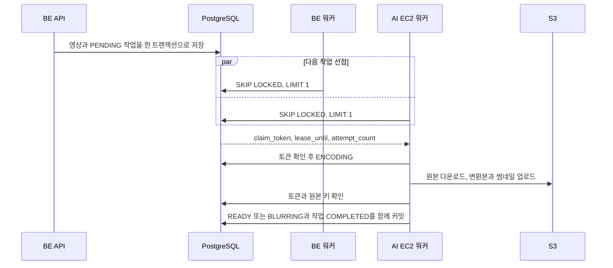

# MSG-494: 남는 AI 서버 자원으로 영상 인코딩 분산

- **PRD**: `docs/prd/MSG-494-prd.md` (`검토됨`, 2026-08-27 성민 승인)
- **상위 요구사항**: NFR-PERF-08, NFR-OPS-10
- **Owner**: B (video 패키지와 배포 설정)

## 1. 개요

업로드 확정 트랜잭션에 인코딩 작업을 함께 저장하고, BE EC2와 AI EC2에서 실행 중인 같은 BE JAR가
작업을 한 건씩 가져가 처리한다. 두 노드는 각각 FFmpeg 한 개만 실행한다. CPU나 메모리를 비교해 작업을
밀어 주는 별도 로드 밸런서는 만들지 않는다.

현재 `@Async` 메모리 큐는 프로세스가 내려가면 대기 작업도 사라지고 다른 EC2가 가져갈 수 없다. 이를
PostgreSQL 작업 테이블과 `FOR UPDATE SKIP LOCKED` 선점으로 교체한다.[^1] 업로드와 작업 등록이 한
트랜잭션에 들어가므로 영상만 남고 작업이 빠지는 커밋 창도 없어진다.

## 2. 배경과 목표

2026-08-27 dev에서 10초에서 20초 길이의 MP4 세 개를 연속 업로드했을 때 READY까지 각각 9.4초,
15.8초, 30.4초가 걸렸다. 같은 t3.small에서 FFmpeg 두 개를 병렬로 실행한 결과도 순차 20.38초,
병렬 19.60초라 한 호스트의 스레드만 늘려서는 처리량이 거의 늘지 않았다.

라이브 서버 재확인 결과는 다음과 같다.

| 노드 | 현재 역할 | 가용 메모리 | 참고 |
|---|---|---:|---|
| BE EC2 | API, PostgreSQL, Redis, Kafka, FFmpeg | 566MiB | Spring Boot RSS 563MiB, swap 459MiB 사용 |
| AI EC2 | FastAPI, Prometheus, Grafana, Alertmanager | 1,150MiB | FastAPI RSS 238MiB, swap 135MiB 사용 |

목표는 새 인스턴스 없이 두 노드가 인코딩을 나눠 세 영상의 대기를 30초 안으로 줄이는 것이다. 동시에
프로세스 재시작, 작업 재선점, 영상 교체와 삭제가 끼어도 현재 영상 시도만 한 번 종결돼야 한다.

## 3. 성공 기준

1. 같은 10초에서 20초 MP4 세 개를 동시에 업로드하는 시험을 3회 실행하고, 아홉 편 모두 업로드 확정
   뒤 30초 안에 READY가 된다.
2. 각 회차에서 `claimed`의 `node` 분포에 `be`와 `ai`가 모두 나타나고, 작업 유실과 영상의 중복 종결은
   각각 0건이다.
3. 첫 번째와 두 번째 시도에서 워커에 SIGTERM을 보내면 현재 claim을 즉시 PENDING으로 반납하고 다른
   노드가 가져간다. SIGKILL이나 EC2 중단은 임대 만료 뒤 회수한다. 세 번째 처리 시도까지 실패한 영상은
   FAILED가 되고 UPLOADED나 ENCODING에 남지 않는다.
4. 같은 작업을 재전달하거나 만료된 선점의 결과를 늦게 제출해도 현재 `claim_token`과 맞지 않으면 영상,
   알림, 작업 종결에 반영되지 않는다.
5. 인코딩 대기 중 영상을 교체하거나 삭제하면 옛 작업은 FFmpeg를 실행하지 않거나 결과 반영 단계에서
   종료되고, 새 원본 키와 산출물을 덮어쓰지 않는다.
6. 블러 작업 한 개와 인코딩 작업 두 개를 겹쳐 실행했을 때 세 작업이 READY 또는 FAILED로 끝난다.
   BE의 로컬 FFmpeg는 기존처럼 한 개만 실행되고, AI EC2의 FastAPI 블러와 Java FFmpeg는 동시에 실행될
   수 있다.
7. 기존 재생 API 응답, 공개 범위 판정, 720p H.264와 AAC MP4, 썸네일, S3 키 규칙이 바뀌지 않는다.
8. 변경 전후로 노드별 처리 건수, 대기 작업 수, 처리 시간, CPU, 가용 메모리와 swap을 비교한 실측값을
   이 문서의 작업 로그에 남긴다.

## 4. 결정

### D1. 작업 대기 경로는 PostgreSQL 테이블로 둔다

`video_encoding_jobs`를 추가하고 업로드 확정 또는 교체 트랜잭션 안에서 작업 행을 INSERT한다. 별도
메시지 브로커는 추가하지 않는다.

| 후보 | 판정 | 이유 |
|---|---|---|
| PostgreSQL 작업 테이블 | 채택 | 기존 저장소이며 영상과 작업 등록을 한 트랜잭션으로 묶을 수 있다. `SKIP LOCKED`로 두 소비자가 서로 기다리지 않고 다른 행을 가져갈 수 있다 |
| Kafka | 기각 | DB 커밋과 Kafka 발행 사이 유실 창을 닫으려면 outbox와 relay가 추가로 필요하다. 현재 dev broker의 외부 노드 접속 설정도 새로 열어야 한다 |
| SQS | 기각 | 관리형 큐 자체는 적합하지만 DB와 SQS를 한 트랜잭션으로 묶을 수 없어 outbox가 다시 필요하고 새 비용과 인프라가 생긴다 |
| Redis | 기각 | 현재 dev Redis는 BE 호스트의 단일 컨테이너이며 인코딩 정본을 맡길 내구성 근거가 없다 |
| AI FastAPI 내부 인코딩 API | 기각 | push 조정자와 별도 요청 계약이 필요하고 두 노드가 같은 변환 코드를 재사용하지 못한다 |

PostgreSQL 문서는 `SKIP LOCKED`가 일반 조회의 일관된 뷰에는 맞지 않지만 여러 소비자가 큐 형태의
테이블을 처리할 때 잠금 경합을 피하는 용도라고 명시한다.[^1] 이 작업의 대기 행은 바로 그 용도다.

### D2. 두 노드는 같은 BE JAR를 실행한다

새 워커 애플리케이션이나 별도 빌드 산출물을 만들지 않는다. BE EC2의 기존 `fillmap-dev`와 AI EC2의
신규 `fillmap-encoding-worker`가 같은 `app.jar`를 사용한다. AI 쪽 프로세스는 `dev,encoding-worker`
프로필로 실행하고 8081 포트에 바인딩한다. AI 보안그룹에는 8081 인바운드를 추가하지 않아 EC2 밖에서는
접근할 수 없게 한다. Spring Boot의 프로필별 설정 파일이 기본 설정을
덮는 방식을 그대로 쓴다.[^2]

`encoding-worker` 프로필은 다음 차이만 가진다.

- 행사 생명주기 스케줄러와 `AiBlurPoller`를 띄우지 않는다. 둘은 BE API 프로세스 한 곳에서만 돈다.
- `fillmap.notification.enabled=false`를 명시한다. 이 한 값으로 `NotificationConfig`,
  `NotificationRelay`, `NotificationConsumer`, `StreakRemindScheduler`, `WeeklySummaryScheduler`,
  `HotZoneEntryDetector`, `StaleTokenCleaner`, `NotificationBacklogMetrics`, `FcmNotificationSender`를
  전부 띄우지 않는다. 게이트 밖의 `NotificationCommandServiceImpl`은 유지해 워커가 기록한 outbox를
  BE 릴레이가 발송하게 한다.
- zone과 event 시더를 끈다.
- `spring.flyway.enabled=false`로 둔다. CD가 BE 기동과 Flyway 성공을 먼저 확인한 뒤 워커를 시작한다.
- Redis health를 끄고 Hikari 풀을 최대 2개, 최소 1개로 제한한다. 워커 처리 경로는 Redis를 사용하지 않는다.
- `AI_ENABLED`와 `AI_BLUR_ENABLED`는 BE와 같은 값을 쓴다. 블러를 끈 환경의 후행 하이라이트 호출은
  AI EC2의 `http://127.0.0.1:8000`으로 보낸다.
- JVM은 `-Xms128m -Xmx384m -XX:MaxMetaspaceSize=192m`로 시작한다. 실측에서 swap 증가나 OOM이
  나타나면 기능을 늘리지 않고 이 값부터 조정한다.

BE의 MIT JAR와 AI의 AGPL-3.0 FastAPI는 같은 호스트에 있을 뿐 코드를 복사하거나 import하지 않는다.
하이라이트와 블러 호출은 기존 HTTP 계약을 유지한다.

### D3. 각 노드는 인코딩 작업을 한 건만 소유한다

`EncodingJobPoller`는 1초마다 빈 실행 슬롯을 확인한다. 프로세스 안의 `AtomicBoolean`이 이미 선점한
작업이 있으면 이번 틱은 끝낸다. 비어 있으면 작업 한 건을 선점하고 기존 `encodingExecutor`에 제출한다.
실행기의 스레드 수는 계속 1이다.

poller 빈은 `fillmap.video.encoding-job.enabled=true`일 때만 뜨고 공통 기본값은 true다. 로컬 수동
업로드도 인코딩돼야 하므로 실행 환경에서 따로 켜는 방식으로 두지 않는다. 테스트 리소스만 false로
덮어 Spring 통합 테스트의 공유 DB를 백그라운드 poller가 바꾸지 못하게 한다.

BE의 `AiBlurPoller`도 이 실행기를 사용하므로 BE 안에서는 인코딩과 블러 후 썸네일 FFmpeg가 직렬화된다.
AI EC2에서는 Java FFmpeg 한 개와 FastAPI 블러가 서로 다른 프로세스로 겹칠 수 있다. 실시간 CPU를 읽어
작업을 반대 노드로 보내는 분기는 두지 않는다. 빈 노드가 다음 행을 먼저 가져가는 경쟁 자체가 분배다.

### D4. 선점은 토큰과 임대 시간으로 식별한다

선점하면 `claim_token`을 새 UUID로 바꾸고 `claimed_by`, `lease_until`, `attempt_count`를 기록한다.
영상 상태를 쓰는 모든 인코딩 경로는 다음 조건을 종결 UPDATE의 WHERE 절에서 확인한다.

```text
job.id = claim.jobId
job.status = PROCESSING
job.claim_token = claim.claimToken
job.lease_until > 현재 UTC 시각
```

ENCODING 시작과 알림이 없는 BLURRING 종결은 영상 행을 잠근 뒤 작업 행에 조건부 UPDATE를 실행한다.
READY와 FAILED 종결은 기존 순서대로 업로더 행과 영상 행을 잠그고, 작업 COMPLETED UPDATE를 트랜잭션
마지막 문장으로 실행한다. 조건부 UPDATE가 0행이면 `ClaimLostException`을 던져 앞선 영상 전이와 알림
INSERT까지 전부 롤백한다. 따라서 만료된 결과가 부분 반영되지 않는다.

작업 행을 마지막에 잠그므로 회원 탈퇴의 `users -> videos -> video_encoding_jobs` CASCADE 순서와
같아진다. 기존 `original_s3_key`와 처리 상태 가드도 그대로 적용한다. 토큰 가드는 실행 노드의 권한을
확인하고, 원본 키 가드는 영상 교체나 삭제로 현재 시도가 바뀌었는지 확인한다.

이 구조는 메시지를 정확히 한 번 전달한다고 가정하지 않는다. 재전달은 허용하되 상태 변경이 한 번의
결과로 수렴하는 멱등 처리[^3]를 보장한다.

### D5. 최대 세 번 처리하고 임대는 35분이다

재처리 상한은 코드와 DB 제약에서 3회로 고정한다. 실행 시간과 폴 주기는 물리 환경 실측에 따라 조정할
수 있도록 다음 설정으로 둔다.

```yaml
fillmap:
  video:
    encoding-job:
      enabled: true
      poll-interval: PT1S
      retry-delay: PT5S
      lease-duration: PT35M
```

35분은 `FfmpegRunner`의 호출별 10분 상한 세 번인 ffprobe, encode, thumbnail에 S3 입출력 여유 5분을
더한 값이다. 정상 10초에서 20초 영상의 회수 속도를 정하는 값이 아니라 프로세스가 강제 종료됐을 때만
쓰는 최후 상한이다. 구현 후 실제 최장 처리 시간을 기록하고, 35분의 절반을 넘는 정상 표본이 생기면
임대 갱신을 추가한다. 지금은 정상 처리가 수십 초라 heartbeat를 먼저 만들지 않는다.

실패 분류는 다음과 같다.

| 실패 | 처리 |
|---|---|
| 길이 31초 초과, `InvalidMediaException` | 재시도하지 않고 영상 FAILED, 작업 COMPLETED |
| S3, 임시 파일, FFmpeg 실행 환경, DB 오류 | 1회와 2회 실패는 5초 뒤 PENDING, 3회 실패는 영상 FAILED, 작업 COMPLETED |
| SIGTERM, systemd restart | 종료 훅이 즉시 PENDING으로 반납하고 다른 노드가 선점 |
| SIGKILL, OOM, EC2 강제 중단 | 임대가 끝난 PROCESSING을 다른 노드가 다시 선점 |
| 세 번째 시도 중 프로세스 중단 | 임대 만료 뒤 작업을 DEAD로 바꾸고, 다음 폴러가 영상 FAILED와 `completed_at`을 원자적으로 기록 |
| 영상 교체, 삭제, 이미 종결 | 작업 COMPLETED, 영상과 S3 현재 키는 변경하지 않음 |

재시도할 때 산출물 키는 기존 `VideoAssetKeys`의 시도별 결정적 키를 그대로 쓴다. 앞선 시도가 S3 업로드
뒤 DB 기록 전에 실패해도 다음 시도가 같은 키를 덮어쓰므로 새 고아 키가 늘지 않는다.

`EncodingJobPoller`는 실행 중인 claim을 `AtomicReference`로 보관한다. `ContextClosedEvent`를 받으면 새
선점을 막고 현재 token이 여전히 PROCESSING일 때만 즉시 PENDING으로 돌린다. 진행 중인 선점이 종료 이벤트
뒤에 돌아오는 경합은 `activeClaim` 등록 직후 종료 상태를 다시 확인해 실행 전에 반납한다. 반납 성공 뒤에만
참조를 비워 첫 DB 반납이 실패하면 `@PreDestroy`가 같은 claim을 다시 시도한다. 통제된 종료는 처리 실패가
아니므로 `attempt_count`를 1 줄여 다음 노드가 같은 시도 번호로 다시 시작하게 한다. 이미 COMPLETED이거나
token이 바뀌었으면 UPDATE 0행으로 끝난다. SIGKILL과 EC2 장애처럼 종료 이벤트를 처리하지 못한 경우에만
35분 임대가 최후 회수선으로 동작한다.

```sql
UPDATE video_encoding_jobs
SET status = 'PENDING',
    attempt_count = attempt_count - 1,
    claim_token = NULL,
    claimed_by = NULL,
    lease_until = NULL,
    available_at = statement_timestamp() AT TIME ZONE 'utc'
WHERE id = :jobId
  AND status = 'PROCESSING'
  AND claim_token = :claimToken
  AND attempt_count > 0
  AND lease_until > (statement_timestamp() AT TIME ZONE 'utc');
```

### D6. 업로드와 작업 등록은 함께 커밋한다

`VideoServiceImpl.confirmAndStore`와 `replaceVideo`가 `VideoEncodingJobRepository.enqueue`를 직접
호출한다. 현재 `triggerEncodingAfterCommit`, `submitEncoding`, `TaskRejectedException` 처리는 제거한다.

- 작업 INSERT가 실패하면 영상 트랜잭션도 롤백된다.
- 원본 S3 복사가 끝난 뒤 롤백되면 기존 `deleteOnRollback`이 original 객체를 지운다.
- 커밋된 영상에는 같은 트랜잭션에서 커밋된 작업 행이 반드시 있다.
- 교체 작업은 `(video_id, original_s3_key)`가 달라 새 행이 생기고 옛 행은 상태 가드에서 종료된다.

배포 시점에 이미 `UPLOADED` 또는 `ENCODING`인 ACTIVE 영상은 V44 마이그레이션이 현재
`original_s3_key`가 null이 아닌 경우에만 PENDING 작업을 한 번 보강한다. BLURRING, READY, FAILED 영상과
원본 키가 없는 레거시 행은 대상이 아니다.

### D7. 처리 시간 시작점은 DB에 둔다

현재 `VideoProcessingMetrics`의 `ConcurrentHashMap<videoId, nanoTime>`은 업로드 노드와 종결 노드가
다르면 값을 공유하지 못한다. 이를 제거하고 작업의 `enqueued_at`부터 종결 UTC 시각까지를 Timer에
기록한다. 블러 경로도 영상의 현재 `original_s3_key`에 해당하는 작업 행에서 시작 시각을 읽는다.

`node=${FILLMAP_NODE_ID:be}`는 신규 인코딩 job Counter와 Gauge에만 붙인다. 기존 JVM, HTTP, Hikari,
`video.processing` 시계열에는 추가하지 않는다. 각 Prometheus scrape job의 `job`과 `instance` 라벨로
노드를 이미 구분할 수 있어 전역 태그를 더할 이유가 없다. 새 지표는 고정된 태그 값만 사용한다.

| 지표 | 태그 | 의미 |
|---|---|---|
| `video.encoding.job` Counter | `event=enqueued,claimed,reclaimed,retried,completed,dead` | 작업 수명주기 |
| `video.encoding.queue` Gauge | `status=pending,processing,dead` | 미종결 DB 작업 행 수, 15초마다 갱신 |
| 기존 `video.processing.duration` Timer | `outcome`, `path` | DB 시작 시각 기준 전체 처리 시간, scrape job으로 노드 구분 |
| 기존 `video.processing.outcome` Counter | `outcome`, `path` | 실제 영상 종결 수, scrape job으로 노드 구분 |

`dead` Gauge는 `status = 'DEAD' AND completed_at IS NULL`만 센다. 종결된 DEAD 이력이 계속 쌓여
대기열로 보이는 일을 막는다. queue Gauge는 두 노드가 같은 DB 값을 읽으므로 노드별 값이 같아도 정상이다. 처리 분배는
`video_encoding_job_total{event="claimed",node=...}`로 본다. videoId, S3 키, claim token, 예외 문구는
태그에 넣지 않는다.

## 5. 처리 흐름



재시도는 다음 상태 전이를 따른다.

```text
PENDING -> PROCESSING -> COMPLETED
                    \-> PENDING       처리 오류, 남은 시도 있음
                    \-> DEAD          마지막 시도 중 프로세스 중단
DEAD -> DEAD(completed_at 기록)        영상 FAILED와 같은 트랜잭션
```

## 6. API 명세

외부 API 변경은 없다.

- 업로드 확정, 교체 응답은 작업 처리까지 기다리지 않고 기존 응답을 반환한다.
- 재생 URL과 공개 범위 판정은 기존 `VideoPlaybackService` 경로를 유지한다.
- 신규 관리 API는 만들지 않는다. 작업 상태 확인은 SQL과 Prometheus로 한다.
- 신규 사용자 대면 에러코드는 없다. 인코딩 실패는 기존처럼 영상 처리 상태 FAILED와 알림으로 보인다.

## 7. 도메인 로직

### 7.1 작업 등록

1. 영상 INSERT 또는 교체 UPDATE와 original S3 복사를 수행한다.
2. `enqueue(videoId, originalKey)`를 호출한다.
3. 같은 `(video_id, original_s3_key)`가 이미 있으면 `ON CONFLICT DO NOTHING`으로 중복 등록을 흡수한다.
4. 트랜잭션이 커밋되면 어느 노드든 다음 폴에서 작업을 볼 수 있다.

### 7.2 작업 선점

선점 SQL은 정렬이 고정된 한 행만 UPDATE하고 `RETURNING`으로 `EncodingJobClaim`을 만든다.

```sql
WITH clock AS (
    SELECT statement_timestamp() AT TIME ZONE 'utc' AS now_utc
), candidate AS (
    SELECT j.id
    FROM video_encoding_jobs j
    CROSS JOIN clock c
    WHERE (j.status = 'PENDING' AND j.available_at <= c.now_utc AND j.attempt_count < 3)
       OR (j.status = 'PROCESSING' AND j.lease_until <= c.now_utc AND j.attempt_count < 3)
    ORDER BY j.available_at, j.id
    FOR UPDATE OF j SKIP LOCKED
    LIMIT 1
)
UPDATE video_encoding_jobs j
SET status = 'PROCESSING',
    attempt_count = j.attempt_count + 1,
    claim_token = :claimToken,
    claimed_by = :nodeId,
    lease_until = c.now_utc + make_interval(secs => :leaseSeconds)
FROM candidate, clock c
WHERE j.id = candidate.id
RETURNING j.id, j.video_id, j.original_s3_key, j.claim_token,
          j.attempt_count, j.enqueued_at;
```

V33 규약대로 naive `TIMESTAMP`의 현재 시각은 모두
`statement_timestamp() AT TIME ZONE 'utc'`를 쓴다. `CURRENT_TIMESTAMP`는 timestamptz라 KST 세션에서
naive 컬럼과 비교하면 9시간 어긋난다. 재시도 `available_at`도 같은 DB UTC 식에
`make_interval(secs => :retrySeconds)`를 더한다.

PENDING과 만료 PROCESSING을 한 문장에 둔 OR 조건은 PostgreSQL이 두 부분 인덱스를 `BitmapOr`로 합칠
수 있으므로 지금부터 쿼리를 둘로 나누지 않는다. 구현 후 `EXPLAIN (ANALYZE, BUFFERS)`에서 순차 스캔이
선택되고 claim p95가 10ms를 넘을 때만 PENDING 선점과 만료 회수를 두 쿼리로 분리한다.

각 poll tick은 일반 선점보다 먼저 세 번째 시도에서 임대가 끝난 행을 DEAD로 바꾼다.

```sql
UPDATE video_encoding_jobs
SET status = 'DEAD', claim_token = NULL, claimed_by = NULL, lease_until = NULL
WHERE status = 'PROCESSING'
  AND attempt_count = 3
  AND lease_until <= (statement_timestamp() AT TIME ZONE 'utc');
```

그 뒤 `completed_at IS NULL AND (claim_token IS NULL OR lease_until <= DB UTC 현재 시각)`인 DEAD 한 건을
`FOR UPDATE SKIP LOCKED`로 잡아 새 finalizer token과 임대를 기록한다. 살아 있는 finalizer의 token을
다른 노드가 즉시 덮어쓰지 못하게 하는 조건이다. `VideoStatusWriter`가 그 token을 확인하고 영상 FAILED,
알림, `completed_at`을 한 트랜잭션으로 기록한다. finalizer가 중단돼도 임대가 끝나면 같은 절차를 반복한다.
DEAD는 FFmpeg를 다시 실행하지 않는다.

### 7.3 인코딩과 종결

`VideoEncodingServiceImpl.encode(EncodingJobClaim)`은 동기 메서드다. `@Async`는 제거하고 실행 위치는
`EncodingJobPoller`가 가진다.

1. 활성 claim을 확인하고 영상을 ENCODING으로 바꾼다. 영상이 교체, 삭제, 종결됐으면 작업만 완료한다.
2. 기존과 같은 순서로 원본 다운로드, 길이 측정, 720p 변환, 썸네일 생성과 업로드를 수행한다.
3. 블러가 켜졌으면 BLURRING, 꺼졌으면 READY로 전이한다.
4. 영상 전이와 처리 알림 outbox INSERT 뒤 작업 COMPLETED 조건부 UPDATE를 마지막에 실행한다. 0행이면
   `ClaimLostException`으로 트랜잭션 전체를 롤백하고, 1행이면 종결 지표를 기록해 함께 커밋한다.
5. 하이라이트 후행 계산은 READY 이후의 베스트 에포트 동작을 유지한다. 실패해도 완료 작업을 되돌리지 않는다.

### 7.4 잠금 순서

인코딩 시작과 BLURRING 종결은 `videos -> video_encoding_jobs`, 알림을 쓰는 READY와 FAILED 종결은
`users -> videos -> video_encoding_jobs` 순서로 잠근다. 회원 탈퇴 CASCADE도 같은 순서이고, user를
잡지 않는 경로는 뒤늦게 user를 요청하지 않으므로 교차 대기 사이클이 생기지 않는다. claim 조건부
UPDATE는 각 트랜잭션의 마지막 문장이고 0행이면 앞선 변경을 롤백한다. 작업 선점은 작업 행만 잠그고
즉시 커밋하므로 FFmpeg 실행 동안 DB 락이나 트랜잭션을 유지하지 않는다.

## 8. 데이터 모델

Flyway 파일은 `V44__video_encoding_jobs.sql`이다.

```sql
CREATE TABLE video_encoding_jobs (
    id BIGSERIAL PRIMARY KEY,
    video_id BIGINT NOT NULL REFERENCES videos(id) ON DELETE CASCADE,
    original_s3_key VARCHAR(500) NOT NULL,
    status VARCHAR(20) NOT NULL DEFAULT 'PENDING',
    attempt_count SMALLINT NOT NULL DEFAULT 0,
    claim_token UUID,
    claimed_by VARCHAR(64),
    available_at TIMESTAMP NOT NULL
        DEFAULT (statement_timestamp() AT TIME ZONE 'utc'),
    lease_until TIMESTAMP,
    enqueued_at TIMESTAMP NOT NULL
        DEFAULT (statement_timestamp() AT TIME ZONE 'utc'),
    completed_at TIMESTAMP,
    last_error VARCHAR(1000),
    CONSTRAINT uq_video_encoding_job_attempt UNIQUE (video_id, original_s3_key),
    CONSTRAINT ck_video_encoding_job_status
        CHECK (status IN ('PENDING', 'PROCESSING', 'COMPLETED', 'DEAD')),
    CONSTRAINT ck_video_encoding_job_attempt_count
        CHECK (attempt_count BETWEEN 0 AND 3)
);

CREATE INDEX idx_video_encoding_jobs_pending
    ON video_encoding_jobs (available_at, id)
    WHERE status = 'PENDING';

CREATE INDEX idx_video_encoding_jobs_processing
    ON video_encoding_jobs (lease_until, id)
    WHERE status = 'PROCESSING';

INSERT INTO video_encoding_jobs (video_id, original_s3_key)
SELECT id, original_s3_key
FROM videos
WHERE status = 'ACTIVE'
  AND processing_status IN ('UPLOADED', 'ENCODING')
  AND original_s3_key IS NOT NULL
ON CONFLICT (video_id, original_s3_key) DO NOTHING;
```

`TIMESTAMP`는 레포의 V33 이후 규약대로 UTC 벽시계로 저장한다. 영상 API 삭제는 `videos.status`만
DELETED로 바꾸는 소프트 삭제라 작업 행이 남고, poller가 현재 영상 시도 아님을 확인해 COMPLETED로
종결한다. FK CASCADE는 회원 탈퇴나 실제 video 행 삭제에만 동작한다. 완료 행은 처리 시간과 유실 검증
근거라 이번 티켓에서 정리 배치를 만들지 않는다. 보관량이 실제로 문제가 될 때 별도 보존 정책을 정한다.

## 9. 배포와 인프라

### 9.1 네트워크

두 EC2는 같은 VPC와 subnet에 있다. BE 보안그룹의 TCP 5432 인바운드 소스를 AI EC2 보안그룹으로 한정해
연다. AWS는 같은 VPC의 다른 보안그룹을 인바운드 소스로 참조하면 그 그룹에 연결된 ENI의 사설 IP에서
오는 트래픽을 허용한다고 설명한다.[^4] `0.0.0.0/0`이나 AI 공인 IP는 사용하지 않는다.

Redis 6379와 Kafka 9092는 열지 않는다. 워커의 정합 경로는 PostgreSQL만 사용한다. AI EC2는 두 노드에
이미 연결된 `FillMapEc2DevRole`로 같은 S3 버킷에 접근한다.

### 9.2 CD와 systemd

`.github/workflows/cd-dev.yml`은 기존 bootJar 한 개를 빌드한 뒤 다음 순서로 배포한다.

1. BE EC2에 기존 방식으로 JAR를 올리고 `fillmap-dev`를 재시작한 뒤 8080 health와 MainPID를 확인한다.
2. BE health가 200이면 Flyway V44와 JPA validate가 끝난 상태다. 그 뒤 같은 JAR를 AI EC2의 별도 경로에
   올리고 `fillmap-encoding-worker`를 재시작한다. 워커는 Flyway를 실행하지 않는다.
3. AI EC2 로컬 `127.0.0.1:8081/actuator/health`가 200이고 8081 리스너 PID가 해당 systemd MainPID와
   같을 때만 배포 성공으로 끝낸다.

AI 배포에는 `AI_EC2_HOST`, `AI_EC2_USER`, `AI_EC2_SSH_KEY` secret을 사용한다. JAR 교체는 임시 파일을
올린 뒤 `mv`로 바꾸고, FFmpeg 설치는 기존 BE 배포와 같은 멱등 명령으로 보장한다.

`fillmap-encoding-worker`의 필수 환경은 다음과 같다.

```text
SPRING_PROFILES_ACTIVE=dev,encoding-worker
DB_URL=jdbc:postgresql://10.0.1.24:5432/fillmap
DB_USERNAME, DB_PASSWORD
AWS_REGION=ap-northeast-2
S3_BUCKET_VIDEO=fillmap-video-dev
FILLMAP_NODE_ID=ai
FILLMAP_NOTIFICATION_ENABLED=false
FILLMAP_ZONE_SEED_ENABLED=false
FILLMAP_EVENT_SEED_ENABLED=false
SPRING_FLYWAY_ENABLED=false
MANAGEMENT_HEALTH_REDIS_ENABLED=false
AI_ENABLED=<BE와 동일>
AI_BLUR_ENABLED=<BE와 동일>
AI_BASE_URL=http://127.0.0.1:8000
```

BE 서비스에는 `FILLMAP_NODE_ID=be`를 명시한다. 프로필 파일에는 비밀값을 넣지 않는다.

### 9.3 관측

AI EC2의 Prometheus 서비스에 `host.docker.internal:host-gateway` 매핑을 추가하고 같은 호스트의 워커를
`host.docker.internal:8081`로 scrape한다. 워커가 컨테이너의 host gateway 요청을 받도록
`server.address=0.0.0.0`을 쓰되, AI 보안그룹에는 8081 인바운드를 두지 않는다. 배포 때 Prometheus
컨테이너 안에서 health 200을 확인한다. 새 job 이름은 `fillmap-encoding-worker`다. 기존
`fillmap-dev` 타깃은 유지한다. Grafana의 기존 대상 변수에 `fillmap-encoding-worker`를 추가해 같은
대시보드에서 JVM heap과 process CPU를 비교한다. 기존 지표에는 `node` 태그를 추가하지 않으므로 현재
패널과 알림 PromQL은 바뀌지 않는다.

## 10. 계약 변경

`GridQueryService`, `HotZoneService`, `ZoneNameQueryService`, `UserGridQueryService`,
`UserOidcCommandService` 시그니처 변경은 없다. 외부 API와 BE, AI HTTP 계약도 바뀌지 않는다.

`VideoEncodingService`의 내부 시그니처만 `encode(Long, String)`에서
`encode(EncodingJobClaim)`으로 바뀐다.

## 11. 변경 파일

| 파일 | 변경 |
|---|---|
| `src/main/resources/db/migration/V44__video_encoding_jobs.sql` | 작업 테이블, 인덱스, 진행 중 영상 backfill |
| `src/main/java/com/msg/fillmap/video/repository/VideoEncodingJobRepository.java` | `JdbcClient` 기반 enqueue, claim, retry, dead, complete SQL |
| `src/main/java/com/msg/fillmap/video/service/EncodingJobClaim.java` | 작업 ID, 원본 키, token, 시도 수, 등록 시각을 담는 record |
| `src/main/java/com/msg/fillmap/video/config/EncodingJobProperties.java` | poll, retry, lease 설정 |
| `src/main/java/com/msg/fillmap/video/service/EncodingJobPoller.java` | 노드별 한 건 선점, 실행, 재시도, DEAD 종결, 정상 종료 claim 반납 |
| `src/main/java/com/msg/fillmap/video/service/VideoServiceImpl.java` | afterCommit 메모리 큐 제출을 트랜잭션 enqueue로 교체 |
| `src/main/java/com/msg/fillmap/video/service/VideoEncodingService.java` | claim 입력의 동기 실행 계약으로 변경 |
| `src/main/java/com/msg/fillmap/video/service/VideoEncodingServiceImpl.java` | `@Async` 제거, 영구 실패와 재시도 실패 분리, claim 기반 상태 기록 |
| `src/main/java/com/msg/fillmap/video/service/VideoStatusWriter.java` | users, videos, jobs 잠금 순서와 마지막 조건부 UPDATE로 원자적 종결 |
| `src/main/java/com/msg/fillmap/video/service/VideoProcessingMetrics.java` | 인메모리 시작점 제거, DB 등록 시각 사용, 신규 job 지표에만 node 태그 적용 |
| `src/main/java/com/msg/fillmap/video/service/AiBlurPoller.java` | encoding-worker 프로필에서는 빈 제외 |
| `src/main/java/com/msg/fillmap/event/service/EventNotificationScheduler.java` | encoding-worker 프로필에서는 빈 제외 |
| `src/main/resources/application.yml` | 작업 기본값과 기본 활성 gate |
| `src/main/resources/application-encoding-worker.yml` | 워커 포트, 풀 크기, 시더, 알림, Redis health, Flyway 차이 |
| `src/test/resources/application-local.yml` | 통합 테스트에서 작업 poller 비활성화 |
| `.github/workflows/cd-dev.yml` | 같은 JAR의 AI EC2 배포와 health 검증 |
| `monitoring/prod/prometheus/prometheus.yml` | AI EC2 워커 scrape 타깃 |
| `monitoring/prod/grafana/dashboards/fillmap-prod-overview.json` | 대상 변수에 인코딩 워커 추가 |
| `docs/runbook/monitoring.md` | 워커 health, 로그, 재시작, 큐 적체 확인 절차 |
| `load-test/measure-msg494.sh` | MP4 세 개 동시 업로드 3회, READY 시간과 작업 분배 수집 |

새 라이브러리와 새 빌드 산출물은 없다. `JdbcClient`는 현재 JPA starter가 이미 제공하는 Spring JDBC를
사용한다.

## 12. 테스트 시나리오

### 12.1 저장소 통합 테스트

`VideoEncodingJobRepositoryTest`

- `같은_영상_시도는_작업이_한_건만_등록된다`
- `영상과_작업은_같은_트랜잭션에서_롤백된다`
- `두_트랜잭션이_동시에_선점해도_서로_다른_작업을_가져간다`
- `처리중_임대가_남았으면_다른_노드가_가져가지_못한다`
- `임대가_끝난_작업은_새_token으로_재선점된다`
- `KST_세션에서도_살아있는_임대는_만료로_보지_않는다`
- `옛_token은_완료와_재시도_반환을_갱신하지_못한다`
- `세번째_시도의_임대가_끝나면_DEAD_후보가_된다`
- `살아있는_DEAD_finalizer의_token은_덮어쓰지_않는다`
- `회원탈퇴로_video행이_삭제되면_작업도_cascade_삭제된다`
- `원본키가_null인_진행중_레거시영상은_backfill에서_제외된다`

### 12.2 폴러 단위 테스트

`EncodingJobPollerTest`

- `로컬_실행중이면_새_작업을_선점하지_않는다`
- `빈_노드는_한_건만_선점해_encodingExecutor에_제출한다`
- `실행기_거부는_작업을_재시도_대기로_돌린다`
- `첫번째와_두번째_처리_오류는_5초뒤_재시도한다`
- `세번째_처리_오류는_영상과_작업을_FAILED로_종결한다`
- `세번째_시도중_중단된_DEAD_작업도_FAILED로_종결한다`
- `SIGTERM이면_실행중인_claim을_즉시_반납하고_새_작업을_받지_않는다`
- `종료중_늦게_선점된_claim은_실행하지_않고_반납한다`
- `종료_반납_실패는_PreDestroy_호출에서_다시_시도한다`
- `종료훅없이_중단되면_선점_작업은_임대_만료후_다른_노드가_회수한다`

### 12.3 인코딩 서비스 회귀 테스트

기존 `VideoEncodingServiceTest`, `VideoEncodingAiTriggerTest`,
`VideoEncodingDurationRealFfmpegTest`를 claim 입력으로 바꾼다.

- `손상_파일은_재시도하지_않고_FAILED와_COMPLETED로_끝난다`
- `길이_초과는_재시도하지_않고_FAILED와_COMPLETED로_끝난다`
- `S3_다운로드_실패는_작업_오류를_호출자에게_전파한다`
- `ffmpeg_환경_실패는_작업_오류를_호출자에게_전파한다`
- `블러가_켜지면_BLURRING과_작업_COMPLETED를_함께_기록한다`
- `블러가_꺼지면_READY와_작업_COMPLETED를_함께_기록한다`
- `하이라이트_실패는_이미_완료된_작업을_되돌리지_않는다`

### 12.4 상태와 정합 테스트

`VideoStatusWriterTest`, `VideoNotificationIntegrationTest`, `VideoReplaceConcurrencyTest`,
`VideoDeleteConcurrencyTest`

- `활성_token만_ENCODING으로_전이한다`
- `만료된_token의_READY와_FAILED는_모두_무시한다`
- `READY와_작업_COMPLETED와_알림은_한_트랜잭션이다`
- `작업_COMPLETED_갱신이_실패하면_READY와_알림도_롤백된다`
- `같은_claim의_중복_완료는_종결과_알림을_한번만_기록한다`
- `교체된_originalKey의_늦은_완료는_새_시도를_덮지_않는다`
- `삭제된_영상의_늦은_완료는_noop이다`
- `마지막_작업_UPDATE가_0행이면_영상과_알림도_롤백된다`
- `잠금_순서는_업로더_영상_작업_순서다`

### 12.5 설정과 배포 테스트

- `EncodingWorkerContextTest`: `dev,encoding-worker`에서 job poller와 `NotificationCommandServiceImpl`은
  뜨고, `AiBlurPoller`, `EventNotificationScheduler`, 알림 조건부 빈 9종은 뜨지 않으며 Flyway가
  비활성인지 검증한다.
- `VideoProcessingMetricsTest`: DB 등록 시각 기준 duration, 기존 처리 지표의 태그 불변, 신규 job
  Counter와 Gauge의 고정 `node` 태그를 검증한다.
- CD 정적 검증: 두 systemd 서비스의 health 200과 포트 소유 PID를 각각 확인한다.

### 12.6 dev 실측

`load-test/measure-msg494.sh`는 저작권과 재현성을 위해 영상 자체를 커밋하지 않고 세 로컬 파일 경로를
인자로 받는다. 같은 파일과 SHA-256을 3회 모두 사용한다.

1. 시작 전에 두 노드의 `pidstat`, `free -m`, `swapon --show`, queue status 수를 저장한다.
2. 10초에서 20초 MP4 세 개의 presigned URL 발급, S3 PUT, 업로드 확정을 병렬로 실행한다.
3. 확정 응답 시각부터 각 videoId가 READY 또는 FAILED가 될 때까지 500ms 간격으로 조회한다.
4. 한 회차의 세 영상이 끝난 뒤 다음 회차를 시작하며 총 3회 반복한다.
5. 아홉 편의 상태, 소요 시간, claimed node, attempt count, 중복 알림 수를 CSV로 남긴다.
6. 블러를 켜고 기존 영상 한 건을 BLURRING으로 만든 상태에서 새 영상 두 건을 동시에 확정한다. 블러
   모드는 FastAPI의 분 단위 처리 시간을 반영해 종결을 기본 300초까지 기다리고, 나머지 모드는 180초다.
7. SIGTERM 시험은 즉시 반납을 확인한다. SIGKILL 시험은 임대를 PT1M으로 임시 오버라이드해 회수한 뒤
   기본 PT35M로 복구한다.
8. 세 영상 중 하나라도 30초를 넘으면 기능을 바꾸기 전에 poll 간격을 PT0.2S로 낮춰 같은 입력을 다시
   측정한다. 두 값의 결과를 모두 남기고 더 짧은 값은 CPU와 DB query 증가가 수용될 때만 채택한다.
9. 종료 뒤 같은 시스템 지표를 저장하고 전후 차이를 이 문서 작업 로그에 붙인다.

판정 SQL은 최소한 다음 불변식을 확인한다.

```sql
SELECT count(*)
FROM videos v
JOIN video_encoding_jobs j
  ON j.video_id = v.id AND j.original_s3_key = v.original_s3_key
WHERE v.id = ANY(:measuredVideoIds)
  AND (v.processing_status NOT IN ('READY', 'FAILED')
       OR j.status NOT IN ('COMPLETED', 'DEAD'));
-- 기대값 0
```

## 13. 작업 로그

### 2026-08-27 구현 및 로컬 검증

- **완료 모듈**: 작업 테이블과 선점 저장소, 폴러와 정상 종료 반납, 업로드, 교체, 종결 연결, 워커 전용
  프로필, 노드별 지표, dev CD, Prometheus와 Grafana, 운영 런북과 dev 측정 스크립트를 구현했다.
- **데이터 저장 위치**: V44가 `video_encoding_jobs`를 만들고 `video_id`와 `original_s3_key` 조합을 한 건으로
  제한한다. 상태, 시도 횟수, claim token, 처리 노드, 대기, 임대, 등록, 완료 시각과 마지막 오류를 이 행에
  저장한다. 마지막 오류는 1,000자로 자른다. S3 원본과 산출물 경로는 바꾸지 않았다.
- **실행 쿼리**: 확정과 교체는 영상 트랜잭션 안에서 `INSERT ... ON CONFLICT DO NOTHING`으로 작업을
  등록한다. 선점은 DB UTC 시각을 한 번 계산한 뒤 PENDING 또는 임대가 끝난 PROCESSING 한 건을
  `FOR UPDATE SKIP LOCKED`로 잡고, 같은 문장에서 PROCESSING, 시도 횟수, token, 노드, 임대를 갱신한다.
  재시도와 종결은 `id + claim_token + 살아 있는 임대`가 모두 맞을 때만 갱신하며 영향 행이 0이면 결과를
  버린다. `EXPLAIN (ANALYZE, BUFFERS)`는 dev 배포 뒤 실행할 항목으로 남겼다.
- **예외 흐름**: `ClaimLostException`은 요청 스레드가 아니라 폴러 실행기에서 잡아 정보 로그만 남기고
  늦은 결과를 버린다. 그 밖의 실행 오류는 첫 두 번까지 5초 뒤 PENDING으로 돌리고, 세 번째는
  `VideoStatusWriter`가 영상 FAILED, 알림, 작업 완료를 한 트랜잭션으로 기록한다. 종료 훅을 거치지 못한
  세 번째 작업은 임대 만료 뒤 DEAD finalizer가 같은 종결 경로를 탄다.
- **빈 동작**: `EncodingJobPoller`는 기본 1초마다 돌며 로컬 실행이 비어 있을 때 한 건만 가져간다.
  노드마다 기존 단일 `encodingExecutor`를 그대로 쓴다. `ContextClosedEvent`가 새 선점을 막고 현재 claim을
  즉시 반납한다. 종료와 DB 선점이 겹치면 등록 직후 상태 재확인이 늦은 claim을 반납하고, DB 반납 실패 때는
  참조를 유지해 `@PreDestroy`가 다시 시도한다. `encoding-worker` 프로필은 8081과 작은 DB 풀만 사용하고
  Flyway, 시더, AI 블러 폴러, 이벤트 및 알림 스케줄러를 띄우지 않는다. 큐 Gauge는 15초마다 DB 상태 수를
  다시 읽는다.
- **배포와 관측**: dev CD는 BE 헬스와 포트 소유 PID를 확인한 뒤 같은 JAR를 AI EC2에 올린다. 워커도
  별도 헬스와 PID를 확인한다. 두 노드의 `video.encoding.job`, `video.encoding.queue`, JVM과 프로세스
  지표를 Prometheus가 수집하고 Grafana의 기존 대시보드에서 `job`으로 나눠 본다.
- **검증 결과**: `./gradlew build`와 Bash 3.2 자체 점검이 통과했다. 스크립트는 baseline 3회,
  SIGTERM 즉시 반납, PT1M 임대의 SIGKILL 회수, FastAPI AI job과 BE 및 AI 인코딩 두 건의 동시
  PROCESSING을 각각 기록한다. 알림은 누적 개수가 아니라 실행 전후 증가분이 1건인지 판정한다. 실제 dev
  업로드, 서비스 신호, CPU, 메모리, swap 비교는 기능 브랜치를 배포하지 않아 실행하지 않았다. 성공 기준
  1, 2, 3, 6, 8의 실측값은 PR 뒤 dev 배포에서 채운다.
- **리뷰 반영**: 블러 경합은 영상 상태만 보지 않고 AI EC2의 `/jobs/{id}`가 PROCESSING인 시점까지
  확인한다. 교체 이력이 있는 영상도 정상 판정하도록 알림 검사는 현재 실행의 증가분으로 좁혔다.
- **커밋 후보**: `MSG-494 test: 블러와 두 노드 인코딩의 경합을 검증한다`,
  `MSG-494 docs: 분산 인코딩 구현 상태와 미검증 항목을 기록한다`.

### 2026-08-27 dev 두 노드 실측과 종료 반납 보완

- **배포**: GitHub dev 환경에 AI EC2 접속 secret을 등록하고, AI 보안그룹에서 BE 보안그룹의 PostgreSQL
  5432 접근만 허용했다. AI EC2에는 Java 21, `fillmap-encoding-worker` systemd 서비스와 환경 파일을
  준비했다. CD 재실행은 BE와 워커의 health 및 MainPID 검사를 모두 통과했고 Prometheus의 두 타깃도 UP이다.
- **입력**: 10.076733초(`ccba80b815a9149cfa40fd4384e295e42faee67b0c90aa9fb7ac6ff76f8dc977`),
  15.08초(`b4be8560366f4753133c4cc5186e1185fe490541916040de69057453b957a218`),
  19.102417초(`fee6804628b2fa6d36a02dc3bf042285a6b4647dc401c22e1bda6524af3c4d0b`) MP4 세 편을
  같은 SHA-256으로 3회 사용했다.
- **기본 부하**: 1회차는 25,683ms(be), 13,573ms(be), 19,851ms(ai), 2회차는 11,386ms(ai),
  13,125ms(be), 25,467ms(ai), 3회차는 22,480ms(be), 11,838ms(be), 12,783ms(ai)였다. 아홉 편이
  모두 READY 및 COMPLETED로 끝났고 최댓값은 25,683ms다. 노드 합계는 be 5건, ai 4건이며 작업 유실,
  중복 알림, 종료 뒤 미완료 작업은 모두 0건이다.
- **자원**: BE의 available memory는 544MiB에서 452MiB, RSS는 543,068KiB에서 630,848KiB로 바뀌었고
  swap 사용량은 422.2MiB에서 421.3MiB로 줄었다. AI는 available memory 740MiB에서 671MiB, RSS
  468,264KiB에서 544,408KiB, swap 125.3MiB에서 138.2MiB로 바뀌었다. CPU는 처리 전후 유휴 순간값만
  저장돼 BE 3%에서 1%, AI 0%에서 1%였으며 처리 중 최고값으로 해석하지 않는다.
- **정상 종료**: 최초 구현의 `@PreDestroy`는 실행기가 멈춘 뒤 호출돼 늦었다. systemd가 FFmpeg에 먼저
  SIGTERM을 보내면 exit 255가 파일 오류로 분류됐다. 반납 시점을 `ContextClosedEvent`로 앞당긴 뒤 19초
  영상은 be에서 ai로 같은 1회차에 넘어가 17,764ms에 READY가 됐고, 종료된 be의 늦은 실패 결과는
  claim token 불일치로 버려졌다. 후속 리뷰에서 종료 직전 진행 중이던 DB 선점과의 경합, 첫 반납 실패 뒤
  fallback 무력화를 확인했다. claim 등록 직후 종료 상태를 다시 확인하고 반납 성공 뒤에만 참조를 비우도록
  보완했으며 두 경로를 latch와 예외 주입 테스트로 고정했다.
- **강제 종료와 실패 상한**: 시험 임대 PT1M에서 19초 영상은 ai 1회차 강제 종료 뒤 be 2회차가 회수해
  76,337ms에 READY가 됐고 알림은 1건이었다. PT10S와 19초 입력 조합은 정상 인코딩보다 임대가 짧아
  3회 DEAD 및 FAILED로 끝났다. 이 결과로 세 번째 시도 종결과 실패 알림 1건을 확인했고, 오판을 막도록
  시험 임대를 PT1M으로 올렸다. 시험 뒤 두 노드는 PT35M으로 복구했다.
- **블러 경합**: FastAPI job이 PROCESSING인 동안 새 인코딩 두 건이 be와 ai에서 한 건씩 PROCESSING인
  상태를 기록했다. 기존 블러 영상은 58,281ms, 새 영상은 114,774ms와 189,634ms에 모두 READY가 됐고
  알림 증가분은 영상마다 1건이다. FastAPI ADR의 분 단위 처리 시간을 반영해 블러 측정 대기 기본값을
  180초에서 300초로 올렸으며 실측 뒤 블러는 다시 껐다.
- **선점 쿼리**: dev 작업 행 21건에서 PENDING 후보는 1.836ms, 만료 PROCESSING 후보는 0.454ms였다.
  두 계획 모두 작은 테이블이라 partial index 대신 Seq Scan을 골랐고 디스크 읽기는 없었다. 현재 지연은
  기준에 충분히 낮아 쿼리를 나누지 않는다. 작업 행이 늘면 같은 `EXPLAIN (ANALYZE, BUFFERS)`를 다시
  실행해 partial index 사용 여부를 확인한다.

## 14. 비스코프

- HLS, 코덱과 화질 정책 변경
- CDN, WAF, Origin Shield, `media.fillmap.kr`
- CPU와 메모리 기반 동적 라우팅
- 인스턴스 증설이나 사양 변경
- AI 탐지 모델과 블러 알고리즘 변경
- 완료 작업 보존 기간과 정리 배치

## 15. 미해결 질문

없음. PRD에서 넘긴 배포 형태, 작업 대기 경로, 재처리 횟수와 회수 제한 시간은 D1, D2, D5에서
확정했다.

[^1]: `FOR UPDATE SKIP LOCKED`: 다른 트랜잭션이 잠근 행은 기다리지 않고 건너뛰는 PostgreSQL 행 잠금 옵션. 일반 조회에는 일관된 전체 모습을 주지 않지만 여러 소비자가 큐 테이블을 나눠 처리하는 용도로 공식 문서가 명시한다. [PostgreSQL SELECT 문서](https://www.postgresql.org/docs/current/sql-select.html)
[^2]: 프로필별 설정: 같은 애플리케이션 코드에서 실행 환경에 따라 빈과 설정값만 달리 로드하는 Spring 기능. `application-{profile}.yml`은 공통 설정을 덮어쓴다. [Spring Boot Profiles](https://docs.spring.io/spring-boot/reference/features/profiles.html)
[^3]: 멱등 처리: 같은 작업이 여러 번 전달돼도 최종 상태와 외부 효과가 한 번 처리한 결과와 같아지는 성질. 이 스펙에서는 claim token, 원본 키, 영상 처리 상태, 알림 event key가 함께 중복 반영을 막는다.
[^4]: 보안그룹 참조: 인바운드 규칙의 소스를 IP가 아니라 다른 보안그룹으로 제한하는 방식. 같은 VPC에서는 참조된 그룹의 인스턴스 사설 IP에서 오는 지정 포트 트래픽만 허용할 수 있다. [AWS VPC 보안그룹 규칙](https://docs.aws.amazon.com/vpc/latest/userguide/security-group-rules.html)
